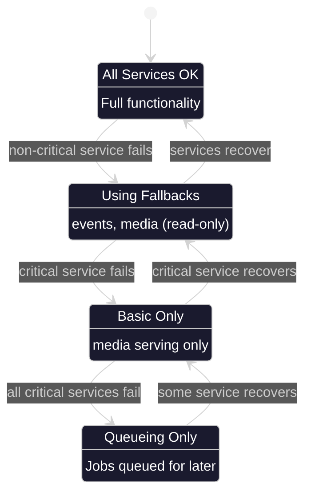

# Graceful Degradation

The DegradationManager provides graceful degradation capabilities when dependent services become unavailable, allowing the system to continue operating in a degraded mode.

**Source:** `backend/services/degradation_manager.py`

## Overview

The `DegradationManager` class (`backend/services/degradation_manager.py:347-1169`) manages:

- Service health state tracking
- Degradation mode transitions
- Fallback queue strategies (memory and disk)
- Automatic recovery detection
- Job queueing for later processing

## Degradation Modes

Defined in `backend/services/degradation_manager.py:68-74`:

```python
# backend/services/degradation_manager.py:68-74
class DegradationMode(Enum):
    """System degradation modes."""

    NORMAL = "normal"
    DEGRADED = "degraded"
    MINIMAL = "minimal"
    OFFLINE = "offline"
```

### Mode Descriptions

| Mode         | Description                                      | Available Features                 |
| ------------ | ------------------------------------------------ | ---------------------------------- |
| **NORMAL**   | All services healthy, full functionality         | detection, analysis, events, media |
| **DEGRADED** | Some services unavailable, using fallbacks       | events, media (read-only)          |
| **MINIMAL**  | Critical services down, basic functionality only | media                              |
| **OFFLINE**  | All services down, queueing only                 | none (jobs queued)                 |

## Configuration

The manager constructor (`backend/services/degradation_manager.py:374-421`):

```python
# backend/services/degradation_manager.py:374-421
def __init__(
    self,
    redis_client: Any | None = None,
    fallback_dir: str | None = None,
    failure_threshold: int = 3,
    recovery_threshold: int = 2,
    max_memory_queue_size: int = 1000,
    check_interval: float = 15.0,
    health_check_timeout: float = DEFAULT_HEALTH_CHECK_TIMEOUT,  # 10.0s
) -> None:
```

### Configuration Parameters

| Parameter               | Type  | Default                 | Description                                   |
| ----------------------- | ----- | ----------------------- | --------------------------------------------- |
| `redis_client`          | Any   | None                    | Redis client for job queueing                 |
| `fallback_dir`          | str   | `~/.cache/hsi_fallback` | Directory for disk-based fallback queues      |
| `failure_threshold`     | int   | 3                       | Consecutive failures before marking unhealthy |
| `recovery_threshold`    | int   | 2                       | Consecutive successes to confirm recovery     |
| `max_memory_queue_size` | int   | 1000                    | Max jobs in memory queue                      |
| `check_interval`        | float | 15.0                    | Seconds between health checks                 |
| `health_check_timeout`  | float | 10.0                    | Timeout for individual health checks          |

## Service Health Tracking

### ServiceHealth Dataclass

Defined in `backend/services/degradation_manager.py:85-119`:

```python
# backend/services/degradation_manager.py:85-119
@dataclass(slots=True)
class ServiceHealth:
    """Health information for a monitored service."""

    name: str
    status: DegradationServiceStatus = DegradationServiceStatus.UNKNOWN
    last_check: float | None = None
    last_success: float | None = None
    consecutive_failures: int = 0
    error_message: str | None = None

    @property
    def is_healthy(self) -> bool:
        return self.status == DegradationServiceStatus.HEALTHY
```

### DegradationServiceStatus Enum

Defined in `backend/services/degradation_manager.py:77-82`:

```python
# backend/services/degradation_manager.py:77-82
class DegradationServiceStatus(Enum):
    """Service health status for degradation manager monitoring."""

    HEALTHY = "healthy"
    UNHEALTHY = "unhealthy"
    UNKNOWN = "unknown"
```

### Registering Services

Register services for monitoring (`backend/services/degradation_manager.py:438-456`):

```python
# backend/services/degradation_manager.py:438-456
def register_service(
    self,
    name: str,
    health_check: Callable[[], Any],
    critical: bool = False,
) -> None:
    """Register a service for health monitoring."""
```

**Usage:**

```python
manager = get_degradation_manager()

# Register AI services
manager.register_service(
    name="yolo26",
    health_check=detector_client.health_check,
    critical=True,  # System cannot function without this
)

manager.register_service(
    name="nemotron",
    health_check=llm_client.health_check,
    critical=False,  # Can use fallback risk scoring
)
```

## Mode Transitions

### Transition Logic

The `_evaluate_mode_transition()` method (`backend/services/degradation_manager.py:525-549`):

```python
# backend/services/degradation_manager.py:525-549
async def _evaluate_mode_transition(self) -> None:
    """Evaluate and perform mode transitions based on service health."""
    critical_unhealthy = 0
    total_unhealthy = 0

    for service in self._services.values():
        if service.health.consecutive_failures >= self.failure_threshold:
            total_unhealthy += 1
            if service.critical:
                critical_unhealthy += 1

    # Determine new mode
    if critical_unhealthy == 0 and total_unhealthy == 0:
        self._mode = DegradationMode.NORMAL
    elif critical_unhealthy == 0:
        self._mode = DegradationMode.DEGRADED
    elif critical_unhealthy < len(critical_services):
        self._mode = DegradationMode.MINIMAL
    else:
        self._mode = DegradationMode.OFFLINE
```

### State Transition Diagram



## Fallback Queues

### In-Memory Queue

When Redis is unavailable, jobs are queued in memory (`backend/services/degradation_manager.py:663-701`):

```python
# backend/services/degradation_manager.py:663-701
def _queue_to_memory(self, job: QueuedJob) -> bool:
    """Queue job to in-memory fallback queue."""
    try:
        queue_size_before = len(self._memory_queue)
        queue_at_capacity = queue_size_before >= self.max_memory_queue_size

        if queue_at_capacity:
            logger.warning(
                f"Memory queue overflow: dropping oldest job "
                f"(queue_size={queue_size_before}, max_size={self.max_memory_queue_size})"
            )

        self._memory_queue.append(job)
        return True
    except Exception as e:
        logger.error(f"Failed to queue to memory: {e}")
        return False
```

### Disk-Based Fallback Queue

The `FallbackQueue` class (`backend/services/degradation_manager.py:180-344`) provides persistent storage:

```python
# backend/services/degradation_manager.py:180-344
class FallbackQueue:
    """Disk-based fallback queue for when Redis is unavailable."""

    def __init__(
        self,
        queue_name: str,
        fallback_dir: str,
        max_size: int = 10000,
    ):
        self._queue_name = queue_name
        self._fallback_dir = Path(fallback_dir) / queue_name
        self._max_size = max_size
        self._fallback_dir.mkdir(parents=True, exist_ok=True)
```

**Methods:**

| Method        | Line    | Description                          |
| ------------- | ------- | ------------------------------------ |
| `add(item)`   | 232-282 | Add item to disk queue               |
| `get()`       | 284-318 | Get oldest item (removes from queue) |
| `peek(limit)` | 320-344 | Peek at items without removing       |
| `count()`     | 229-230 | Count items in queue                 |

### Queue with Fallback

The `queue_with_fallback()` method (`backend/services/degradation_manager.py:727-781`):

```python
# backend/services/degradation_manager.py:727-781
async def queue_with_fallback(
    self,
    queue_name: str,
    item: dict[str, Any],
) -> bool:
    """Queue an item with automatic fallback to disk.

    Attempts to queue to Redis first. If Redis is unavailable,
    falls back to disk-based queue.
    """
    # Try Redis first if available
    if self._redis_healthy and self._redis is not None:
        try:
            result = await self._redis.add_to_queue_safe(
                queue_name, item,
                overflow_policy=QueueOverflowPolicy.DLQ,
            )
            if result.success:
                return True
        except Exception:
            self._redis_healthy = False

    # Fallback to disk
    fallback = self._get_fallback_queue(queue_name)
    return await fallback.add(item)
```

## Job Queueing

### QueuedJob Dataclass

Defined in `backend/services/degradation_manager.py:122-155`:

```python
# backend/services/degradation_manager.py:122-155
@dataclass(slots=True)
class QueuedJob:
    """A job queued for later processing."""

    job_type: str
    data: dict[str, Any]
    queued_at: str
    retry_count: int = 0
```

### Queueing for Later

The `queue_job_for_later()` method (`backend/services/degradation_manager.py:607-661`):

```python
# backend/services/degradation_manager.py:607-661
async def queue_job_for_later(
    self,
    job_type: str,
    data: dict[str, Any],
) -> bool:
    """Queue a job for later processing."""
    job = QueuedJob(
        job_type=job_type,
        data=data,
        queued_at=datetime.now(UTC).isoformat(),
        retry_count=0,
    )

    # Try Redis first
    if self._redis and self._redis_healthy:
        try:
            result = await self._redis.add_to_queue_safe(
                self.DEGRADED_QUEUE,
                job.to_dict(),
                overflow_policy=QueueOverflowPolicy.DLQ,
            )
            if result.success:
                return True
        except Exception:
            self._redis_healthy = False

    # Fall back to in-memory queue
    return self._queue_to_memory(job)
```

### Processing Queued Jobs

The `process_queued_jobs()` method (`backend/services/degradation_manager.py:873-946`):

```python
# Example usage
processed = await manager.process_queued_jobs(
    job_type="detection",
    processor=process_detection,
    max_jobs=100,
)
print(f"Processed {processed} queued jobs")
```

## Health Check Loop

The health check loop (`backend/services/degradation_manager.py:1088-1112`):

```python
# backend/services/degradation_manager.py:1088-1112
async def _health_check_loop(self) -> None:
    """Main health check loop."""
    while self._running:
        try:
            # Run health checks for all registered services
            await self.run_health_checks()

            # Check Redis health
            await self.check_redis_health()

            # Drain memory queue to Redis if available
            if self._redis_healthy:
                await self.drain_memory_queue_to_redis()

            await asyncio.sleep(self._check_interval)

        except asyncio.CancelledError:
            break
        except Exception as e:
            logger.error(f"Health check loop error: {e}")
            await asyncio.sleep(self._check_interval)
```

### Health Check Timeout

Each health check has a configurable timeout (`backend/services/degradation_manager.py:551-585`):

```python
# backend/services/degradation_manager.py:551-585
async def run_health_checks(self) -> None:
    """Run health checks for all registered services."""
    for service in self._services.values():
        try:
            is_healthy = await asyncio.wait_for(
                service.health_check(),
                timeout=self._health_check_timeout,  # Default: 10.0s
            )
            await self.update_service_health(service.name, is_healthy=is_healthy)
        except TimeoutError:
            await self.update_service_health(
                service.name,
                is_healthy=False,
                error_message=f"Health check timed out after {self._health_check_timeout}s",
            )
```

## Recovery Handling

### Draining Memory Queue

When Redis recovers, drain memory queue (`backend/services/degradation_manager.py:977-1024`):

```python
# backend/services/degradation_manager.py:977-1024
async def drain_memory_queue_to_redis(self) -> int:
    """Drain in-memory queue to Redis when available."""
    if not self._redis or not self._redis_healthy:
        return 0

    drained = 0
    while self._memory_queue:
        job = self._memory_queue.popleft()
        try:
            result = await self._redis.add_to_queue_safe(
                self.DEGRADED_QUEUE,
                job.to_dict(),
                overflow_policy=QueueOverflowPolicy.DLQ,
            )
            if result.success:
                drained += 1
            else:
                self._memory_queue.appendleft(job)
                break
        except Exception:
            self._memory_queue.appendleft(job)
            break

    return drained
```

### Draining Fallback Queue

Drain disk queue to Redis (`backend/services/degradation_manager.py:783-846`):

```python
# Example
drained = await manager.drain_fallback_queue("detection_queue")
print(f"Drained {drained} items from fallback to Redis")
```

## Status and Monitoring

### get_status()

Get overall status (`backend/services/degradation_manager.py:1114-1133`):

```python
# backend/services/degradation_manager.py:1114-1133
def get_status(self) -> dict[str, Any]:
    """Get overall degradation status."""
    return {
        "mode": self._mode.value,
        "is_degraded": self.is_degraded,
        "redis_healthy": self._redis_healthy,
        "memory_queue_size": len(self._memory_queue),
        "fallback_queues": {
            name: queue.count()
            for name, queue in self._fallback_queues.items()
        },
        "services": {
            name: service.health.to_dict()
            for name, service in self._services.items()
        },
        "available_features": self.get_available_features(),
        "health_check_timeout": self._health_check_timeout,
    }
```

### Available Features by Mode

The `get_available_features()` method (`backend/services/degradation_manager.py:1034-1049`):

```python
# backend/services/degradation_manager.py:1034-1049
def get_available_features(self) -> list[str]:
    """Get list of available features based on current mode."""
    all_features = ["detection", "analysis", "events", "media"]

    if self._mode == DegradationMode.NORMAL:
        return all_features
    elif self._mode == DegradationMode.DEGRADED:
        return ["events", "media"]  # Read-only features
    elif self._mode == DegradationMode.MINIMAL:
        return ["media"]  # Basic media serving only
    else:
        return []
```

## Global Manager Access

```python
# backend/services/degradation_manager.py:1140-1163
from backend.services.degradation_manager import get_degradation_manager

# Get or create global instance
manager = get_degradation_manager(
    redis_client=redis,
    fallback_dir="/var/lib/hsi/fallback",
)

# Start health monitoring
await manager.start()

# Use in request handlers
if manager.should_queue_job("detection"):
    await manager.queue_job_for_later("detection", job_data)
else:
    await process_detection(job_data)

# Stop gracefully
await manager.stop()
```

## Best Practices

1. **Register critical services**: Mark essential services as `critical=True`
2. **Set appropriate timeouts**: Health check timeout should be less than check interval
3. **Monitor fallback queues**: Large disk queues indicate prolonged outages
4. **Test fallback paths**: Verify disk fallback works before production
5. **Plan for recovery**: Have procedures to drain queues after recovery

## Related Documentation

- [Circuit Breaker](circuit-breaker.md) - Integration with circuit breaker pattern
- [Retry Handler](retry-handler.md) - Retry logic coordination
- [Health Monitoring](health-monitoring.md) - Automatic service recovery

---

_Source: NEM-3458 - Graceful Degradation Documentation_
