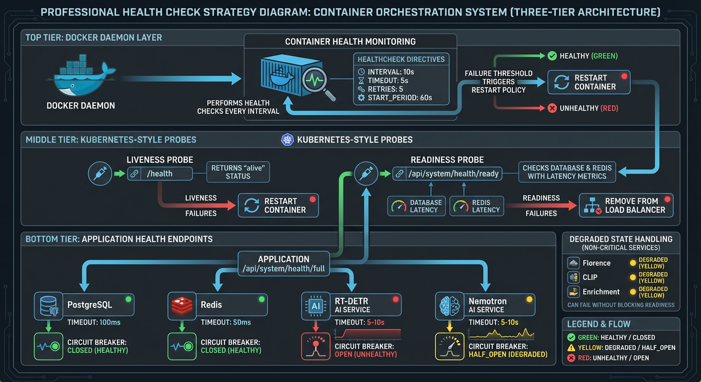
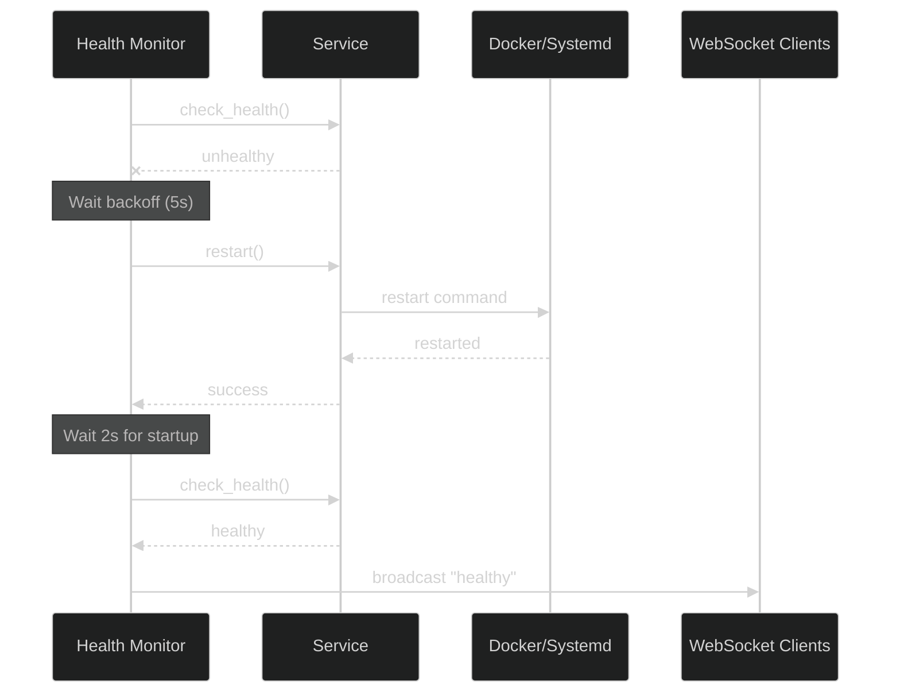

# Health Monitoring and Auto-Recovery

The ServiceHealthMonitor provides continuous health monitoring and automatic recovery of dependent services with exponential backoff restart strategies.

**Source:** `backend/services/health_monitor.py`

## Overview

The `ServiceHealthMonitor` class (`backend/services/health_monitor.py:44-401`) provides:

- Periodic health checks for all configured services
- Automatic restart with exponential backoff on failure
- Configurable max retries before giving up
- WebSocket broadcast of service status changes
- Graceful shutdown support
- Event history tracking

## Service Status Values

| Status             | Description                            |
| ------------------ | -------------------------------------- |
| `healthy`          | Service responding normally            |
| `unhealthy`        | Health check failed                    |
| `restarting`       | Restart in progress                    |
| `restart_failed`   | Restart attempt failed                 |
| `restart_disabled` | Service unhealthy but restart disabled |
| `failed`           | Max retries exceeded, giving up        |

## Configuration

### ServiceConfig

Service configuration is defined in `backend/services/service_managers.py`:

```python
@dataclass
class ServiceConfig:
    """Configuration for a monitored service."""

    name: str              # Service identifier
    health_url: str        # Health check endpoint
    restart_cmd: str | None  # Restart command (None = disabled)
    max_retries: int       # Max restart attempts
    backoff_base: float    # Base delay for exponential backoff
```

### ServiceHealthMonitor Constructor

Defined in `backend/services/health_monitor.py:59-89`:

```python
# backend/services/health_monitor.py:59-89
def __init__(
    self,
    manager: ServiceManager,
    services: list[ServiceConfig],
    broadcaster: EventBroadcaster | None = None,
    check_interval: float = 15.0,
    max_events: int = 100,
) -> None:
    """Initialize the health monitor.

    Args:
        manager: ServiceManager implementation for health checks and restarts
        services: List of service configurations to monitor
        broadcaster: Optional EventBroadcaster for WebSocket status updates
        check_interval: Seconds between health check cycles (default: 15.0)
        max_events: Maximum number of health events to track (default: 100)
    """
```

### Configuration Parameters

| Parameter        | Type                | Default  | Description                                   |
| ---------------- | ------------------- | -------- | --------------------------------------------- |
| `manager`        | ServiceManager      | Required | Implementation for health checks and restarts |
| `services`       | list[ServiceConfig] | Required | Services to monitor                           |
| `broadcaster`    | EventBroadcaster    | None     | WebSocket broadcaster for status updates      |
| `check_interval` | float               | 15.0     | Seconds between health check cycles           |
| `max_events`     | int                 | 100      | Maximum health events to retain               |

## Health Event Tracking

### HealthEvent Dataclass

Defined in `backend/services/health_monitor.py:27-41`:

```python
# backend/services/health_monitor.py:27-41
@dataclass(slots=True)
class HealthEvent:
    """Represents a health-related event for tracking failure history."""

    timestamp: datetime
    service: str
    event_type: str  # "failure", "recovery", "restart"
    message: str | None = None
```

### Event Types

| Type       | Description                                   |
| ---------- | --------------------------------------------- |
| `failure`  | Service health check failed or restart failed |
| `recovery` | Service recovered from unhealthy state        |
| `restart`  | Restart attempt initiated                     |

## Health Check Loop



The main monitoring loop (`backend/services/health_monitor.py:130-184`):

```python
# backend/services/health_monitor.py:130-184
async def _health_check_loop(self) -> None:
    """Main loop - check all services every N seconds."""
    while self._running:
        try:
            for service in self._services:
                if not self._running:
                    break

                try:
                    is_healthy = await self._manager.check_health(service)

                    if is_healthy:
                        # Service recovered or still healthy
                        if self._failure_counts.get(service.name, 0) > 0:
                            logger.info(f"Service {service.name} recovered")
                            self._failure_counts[service.name] = 0
                            await self._broadcast_status(service, "healthy", "Service recovered")
                    else:
                        # Service is unhealthy
                        await self._broadcast_status(service, "unhealthy", "Health check failed")
                        await self._handle_failure(service)

                except Exception as e:
                    await self._broadcast_status(service, "unhealthy", f"Health check error: {e}")
                    await self._handle_failure(service)

            await asyncio.sleep(self._check_interval)

        except asyncio.CancelledError:
            break
```

## Failure Handling with Exponential Backoff

### Recovery Algorithm

The `_handle_failure()` method (`backend/services/health_monitor.py:186-287`):

```python
# backend/services/health_monitor.py:186-287
async def _handle_failure(self, service: ServiceConfig) -> None:
    """Handle service failure with exponential backoff restart."""
    # Check if restart is disabled
    if service.restart_cmd is None:
        await self._broadcast_status(service, "restart_disabled", "...")
        return

    # Increment failure count
    current_failures = self._failure_counts.get(service.name, 0) + 1
    self._failure_counts[service.name] = current_failures

    # Check max retries
    if current_failures > service.max_retries:
        await self._broadcast_status(service, "failed", "Max retries exceeded")
        return

    # Calculate exponential backoff: backoff_base * 2^(failures-1)
    backoff_delay = service.backoff_base * (2 ** (current_failures - 1))

    # Wait for backoff period
    await asyncio.sleep(backoff_delay)

    # Attempt restart
    await self._broadcast_status(service, "restarting", f"Attempt {current_failures}/{service.max_retries}")
    restart_success = await self._manager.restart(service)

    if restart_success:
        # Verify health after restart
        await asyncio.sleep(2)  # Brief pause before health check
        is_healthy = await self._manager.check_health(service)

        if is_healthy:
            self._failure_counts[service.name] = 0
            await self._broadcast_status(service, "healthy", "Service restarted successfully")
```

### Backoff Timing

With `backoff_base=5.0` (default):

| Attempt | Backoff Delay | Formula   |
| ------- | ------------- | --------- |
| 1       | 5s            | `5 * 2^0` |
| 2       | 10s           | `5 * 2^1` |
| 3       | 20s           | `5 * 2^2` |
| 4       | 40s           | `5 * 2^3` |
| 5       | 80s           | `5 * 2^4` |

## WebSocket Status Broadcasting

### Broadcast Format

Status updates use a canonical message envelope (`backend/services/health_monitor.py:310-368`):

```python
# backend/services/health_monitor.py:350-359
event_data = {
    "type": "service_status",
    "data": {
        "service": service.name,
        "status": status,
        "message": message,
    },
    "timestamp": datetime.now(UTC).isoformat(),
}
```

### Example WebSocket Message

```json
{
  "type": "service_status",
  "data": {
    "service": "yolo26",
    "status": "restarting",
    "message": "Attempting restart (attempt 2/5)"
  },
  "timestamp": "2024-01-15T10:30:15.000000+00:00"
}
```

## Lifecycle Management

### Starting the Monitor

```python
# backend/services/health_monitor.py:91-107
async def start(self) -> None:
    """Start the health check loop.

    This method is idempotent - calling when already running has no effect.
    """
    if self._running:
        logger.warning("ServiceHealthMonitor already running")
        return

    logger.info("Starting ServiceHealthMonitor")
    self._running = True
    self._failure_counts.clear()

    # Start health check loop in background
    self._task = asyncio.create_task(self._health_check_loop())
```

### Stopping the Monitor

```python
# backend/services/health_monitor.py:109-128
async def stop(self) -> None:
    """Stop the health check loop gracefully."""
    if not self._running:
        return

    logger.info("Stopping ServiceHealthMonitor")
    self._running = False

    # Cancel health check task
    if self._task:
        self._task.cancel()
        with contextlib.suppress(asyncio.CancelledError):
            await self._task
        self._task = None
```

## Status and Monitoring

### get_status()

Get current failure counts (`backend/services/health_monitor.py:370-382`):

```python
# backend/services/health_monitor.py:370-382
def get_status(self) -> dict[str, dict[str, int | str]]:
    """Get current status of all monitored services."""
    return {
        service.name: {
            "failure_count": self._failure_counts.get(service.name, 0),
            "max_retries": service.max_retries,
        }
        for service in self._services
    }
```

### get_recent_events()

Get event history (`backend/services/health_monitor.py:384-396`):

```python
# backend/services/health_monitor.py:384-396
def get_recent_events(self, limit: int = 50) -> list[HealthEvent]:
    """Get recent health events.

    Args:
        limit: Maximum number of events to return (default: 50)

    Returns:
        List of recent HealthEvent objects, most recent first
    """
    events = list(self._health_events)
    events.reverse()
    return events[:limit]
```

### is_running Property

```python
# backend/services/health_monitor.py:398-401
@property
def is_running(self) -> bool:
    """Check if the health monitor is running."""
    return self._running
```

## Service Manager Integration

The monitor uses a `ServiceManager` interface for health checks and restarts:

```python
# backend/services/service_managers.py
class ServiceManager(ABC):
    """Abstract interface for service management."""

    @abstractmethod
    async def check_health(self, service: ServiceConfig) -> bool:
        """Check if a service is healthy."""
        pass

    @abstractmethod
    async def restart(self, service: ServiceConfig) -> bool:
        """Restart a service."""
        pass
```

### Available Implementations

| Manager                | Description    | Use Case                            |
| ---------------------- | -------------- | ----------------------------------- |
| `ShellServiceManager`  | Shell commands | Development, systemd services       |
| `DockerServiceManager` | Docker CLI     | Production Docker/Podman containers |

## Usage Example

```python
from backend.services.health_monitor import ServiceHealthMonitor
from backend.services.service_managers import (
    ServiceConfig,
    DockerServiceManager,
)
from backend.services.event_broadcaster import get_event_broadcaster

# Define services to monitor
services = [
    ServiceConfig(
        name="yolo26",
        health_url="http://localhost:8090/health",
        restart_cmd="docker restart yolo26",
        max_retries=5,
        backoff_base=5.0,
    ),
    ServiceConfig(
        name="nemotron",
        health_url="http://localhost:8091/health",
        restart_cmd="docker restart nemotron",
        max_retries=5,
        backoff_base=5.0,
    ),
    ServiceConfig(
        name="redis",
        health_url="redis://localhost:6379",
        restart_cmd=None,  # Restart disabled for Redis
        max_retries=3,
        backoff_base=5.0,
    ),
]

# Create monitor
manager = DockerServiceManager()
broadcaster = await get_event_broadcaster()

monitor = ServiceHealthMonitor(
    manager=manager,
    services=services,
    broadcaster=broadcaster,
    check_interval=15.0,
)

# Start monitoring
await monitor.start()

# Check status
status = monitor.get_status()
for service_name, service_status in status.items():
    print(f"{service_name}: failures={service_status['failure_count']}")

# Get recent events
events = monitor.get_recent_events(limit=10)
for event in events:
    print(f"{event.timestamp}: {event.service} - {event.event_type}")

# Stop gracefully
await monitor.stop()
```

## Recovery Sequence Diagram



## Best Practices

1. **Set appropriate check intervals**: Balance responsiveness with system load
2. **Configure restart commands carefully**: Test commands work in production environment
3. **Monitor failure counts**: Track `failure_count` metrics for alerting
4. **Use WebSocket broadcasts**: Keep UI informed of service status
5. **Test recovery paths**: Simulate failures to verify auto-recovery works

## Related Documentation

- [Circuit Breaker](circuit-breaker.md) - Failure protection during restarts
- [Graceful Degradation](graceful-degradation.md) - Service health tracking integration
- [Retry Handler](retry-handler.md) - Retry logic coordination

---

_Source: NEM-3458 - Health Monitoring Documentation_
