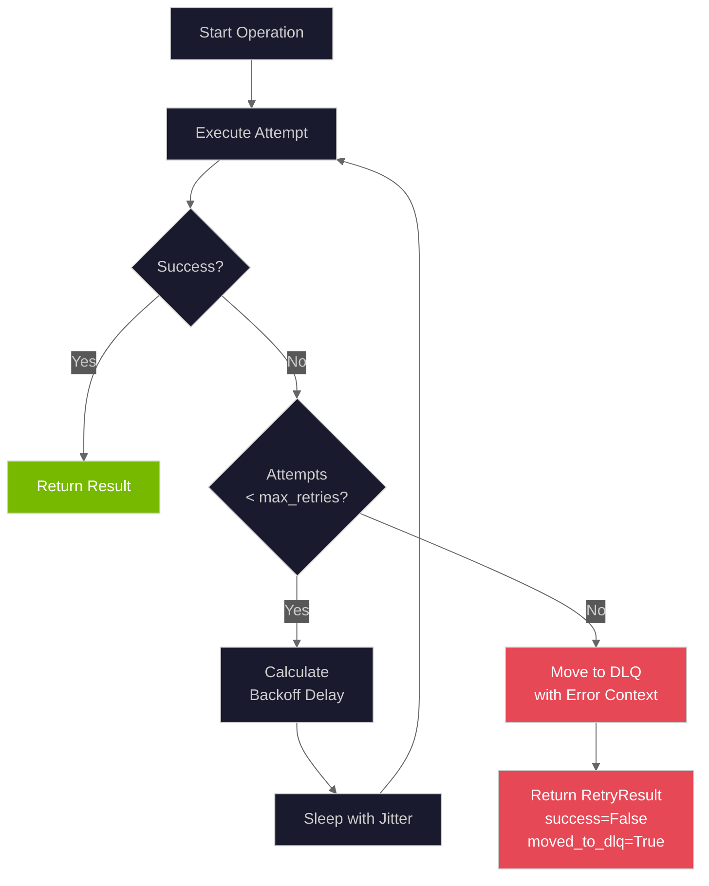

# Retry Handler with Exponential Backoff

The retry handler provides automatic retries with exponential backoff for transient failures, integrating with dead-letter queues for persistent failure handling.

**Source:** `backend/services/retry_handler.py`

## Overview

The `RetryHandler` class (`backend/services/retry_handler.py:184-832`) provides:

- Exponential backoff for failed operations
- Configurable jitter to prevent thundering herd
- Dead-letter queue (DLQ) for poison jobs
- Circuit breaker integration for DLQ overflow protection
- Enriched error context for debugging

## Configuration

The `RetryConfig` dataclass (`backend/services/retry_handler.py:64-96`) defines retry behavior:

```python
# backend/services/retry_handler.py:64-96
@dataclass(slots=True)
class RetryConfig:
    """Configuration for retry behavior."""

    max_retries: int = 3
    base_delay_seconds: float = 1.0
    max_delay_seconds: float = 30.0
    exponential_base: float = 2.0
    jitter: bool = True

    def get_delay(self, attempt: int) -> float:
        """Calculate delay for the given attempt number."""
        delay = self.base_delay_seconds * (self.exponential_base ** (attempt - 1))
        delay = min(delay, self.max_delay_seconds)
        if self.jitter:
            jitter_amount = delay * 0.25 * random.random()
            delay = delay + jitter_amount
        return delay
```

### Configuration Parameters

| Parameter            | Type  | Default | Description                                 |
| -------------------- | ----- | ------- | ------------------------------------------- |
| `max_retries`        | int   | 3       | Maximum retry attempts before moving to DLQ |
| `base_delay_seconds` | float | 1.0     | Initial delay between retries               |
| `max_delay_seconds`  | float | 30.0    | Maximum delay cap                           |
| `exponential_base`   | float | 2.0     | Multiplier for exponential growth           |
| `jitter`             | bool  | True    | Add random 0-25% jitter to delays           |

## Exponential Backoff Algorithm

The delay calculation (`backend/services/retry_handler.py:74-96`):

```
delay = base_delay_seconds * (exponential_base ^ (attempt - 1))
delay = min(delay, max_delay_seconds)
if jitter:
    delay += delay * 0.25 * random()
```

### Delay Timing Table

| Attempt | Base Delay     | With Jitter (0-25%) |
| ------- | -------------- | ------------------- |
| 1       | 1.0s           | 1.0s - 1.25s        |
| 2       | 2.0s           | 2.0s - 2.5s         |
| 3       | 4.0s           | 4.0s - 5.0s         |
| 4       | 8.0s           | 8.0s - 10.0s        |
| 5       | 16.0s          | 16.0s - 20.0s       |
| 6+      | 30.0s (capped) | 30.0s - 37.5s       |

## Usage

### Basic Retry Pattern

```python
from backend.services.retry_handler import RetryHandler, RetryConfig

handler = RetryHandler(
    redis_client=redis,
    config=RetryConfig(max_retries=3),
)

result = await handler.with_retry(
    operation=some_async_func,
    job_data={"file_path": "...", "camera_id": "..."},
    queue_name="detection_queue",
    arg1, arg2,  # passed to operation
)

if result.success:
    processed_data = result.result
else:
    # Job was moved to DLQ
    logger.error(f"Failed after {result.attempts} attempts: {result.error}")
```

### Global Handler Access

```python
# backend/services/retry_handler.py:810-826
from backend.services.retry_handler import get_retry_handler

# Get or create global instance
handler = get_retry_handler(redis_client=redis)

# Subsequent calls return the same instance
handler2 = get_retry_handler()
assert handler is handler2
```

## RetryResult

The `RetryResult` dataclass (`backend/services/retry_handler.py:164-173`) captures operation outcomes:

```python
# backend/services/retry_handler.py:164-173
@dataclass(slots=True)
class RetryResult:
    """Result of a retry operation."""

    success: bool
    result: Any = None
    error: str | None = None
    attempts: int = 0
    moved_to_dlq: bool = False
```

## with_retry() Method

The main retry method (`backend/services/retry_handler.py:264-380`):

```python
# backend/services/retry_handler.py:264-380
async def with_retry(
    self,
    operation: Callable[..., Any],
    job_data: dict[str, Any],
    queue_name: str,
    *args: Any,
    **kwargs: Any,
) -> RetryResult:
    """Execute an operation with retry logic.

    Retries the operation with exponential backoff. If all retries fail,
    the job is moved to the dead-letter queue with enriched error context.
    """
```

### Retry Flow



## Error Context Enrichment

When jobs fail, the handler captures detailed context (`backend/services/retry_handler.py:382-438`):

```python
# backend/services/retry_handler.py:99-161
@dataclass(slots=True)
class JobFailure:
    """Record of a failed job with enriched error context."""

    original_job: dict[str, Any]
    error: str
    attempt_count: int
    first_failed_at: str
    last_failed_at: str
    queue_name: str
    # Error context enrichment fields (NEM-1474)
    error_type: str | None = None
    stack_trace: str | None = None
    http_status: int | None = None
    response_body: str | None = None
    retry_delays: list[float] | None = None
    context: dict[str, Any] | None = None
```

### Context Extraction

The `_extract_error_context()` method (`backend/services/retry_handler.py:382-438`):

```python
# backend/services/retry_handler.py:382-438
def _extract_error_context(self, exc: BaseException | None) -> dict[str, Any]:
    """Extract error context from an exception for DLQ enrichment."""
    context = {}
    context["error_type"] = type(exc).__name__
    # Truncated stack trace (max 4096 chars)
    context["stack_trace"] = truncated_traceback
    # HTTP-specific fields (for httpx errors)
    if isinstance(exc, httpx.HTTPStatusError):
        context["http_status"] = exc.response.status_code
        context["response_body"] = truncated_response  # max 2048 chars
    return context
```

### System Context Capture

The `_capture_system_context()` method (`backend/services/retry_handler.py:440-469`):

```python
# backend/services/retry_handler.py:440-469
async def _capture_system_context(self) -> dict[str, Any]:
    """Capture system state at failure time for debugging."""
    context = {}
    context["detection_queue_depth"] = await self._redis.get_queue_length(DETECTION_QUEUE)
    context["analysis_queue_depth"] = await self._redis.get_queue_length(ANALYSIS_QUEUE)
    context["dlq_circuit_breaker_state"] = self._dlq_circuit_breaker.state.value
    return context
```

## DLQ Circuit Breaker

The retry handler includes a circuit breaker for DLQ operations (`backend/services/retry_handler.py:216-246`):

```python
# backend/services/retry_handler.py:216-246
def __init__(
    self,
    redis_client: RedisClient | None = None,
    config: RetryConfig | None = None,
    dlq_circuit_breaker: CircuitBreaker | None = None,
):
    if dlq_circuit_breaker is not None:
        self._dlq_circuit_breaker = dlq_circuit_breaker
    else:
        settings = get_settings()
        cb_config = CircuitBreakerConfig(
            failure_threshold=settings.dlq_circuit_breaker_failure_threshold,
            recovery_timeout=settings.dlq_circuit_breaker_recovery_timeout,
            half_open_max_calls=settings.dlq_circuit_breaker_half_open_max_calls,
            success_threshold=settings.dlq_circuit_breaker_success_threshold,
        )
        self._dlq_circuit_breaker = CircuitBreaker(
            name="dlq_overflow",
            config=cb_config,
        )
```

### DLQ Circuit Breaker Methods

| Method                             | Line    | Description                     |
| ---------------------------------- | ------- | ------------------------------- |
| `get_dlq_circuit_breaker_status()` | 634-645 | Get circuit breaker status      |
| `is_dlq_circuit_open()`            | 647-653 | Check if DLQ writes are blocked |
| `reset_dlq_circuit_breaker()`      | 655-665 | Reset to CLOSED state           |

### Critical Data Loss Warning

When the DLQ circuit breaker is open, jobs cannot be preserved (`backend/services/retry_handler.py:509-531`):

```python
# backend/services/retry_handler.py:509-531
if not await self._dlq_circuit_breaker.allow_call():
    # CRITICAL: Job is being permanently lost due to open circuit breaker
    logger.error(
        f"CRITICAL DATA LOSS: DLQ circuit breaker is {self._dlq_circuit_breaker.state.value}, "
        f"job from {queue_name} will be PERMANENTLY LOST.",
        extra={
            "data_loss": True,
            "lost_job_data": job_data,
            ...
        },
    )
    return False
```

## DLQ Management Methods

### get_dlq_stats()

Get queue statistics (`backend/services/retry_handler.py:612-632`):

```python
stats = await handler.get_dlq_stats()
# Returns DLQStats:
#   detection_queue_count: 5
#   analysis_queue_count: 2
#   total_count: 7
```

### get_dlq_jobs()

Peek at DLQ contents without removing (`backend/services/retry_handler.py:667-691`):

```python
jobs = await handler.get_dlq_jobs(
    dlq_name="dlq:detection_queue",
    start=0,
    end=9,  # First 10 jobs
)
for job in jobs:
    print(f"Error: {job.error}, Attempts: {job.attempt_count}")
```

### requeue_dlq_job()

Move oldest job back for reprocessing (`backend/services/retry_handler.py:693-721`):

```python
job_data = await handler.requeue_dlq_job("dlq:detection_queue")
if job_data:
    # Process the job again
    await process_detection(job_data)
```

### move_dlq_job_to_queue()

Move job to specific target queue (`backend/services/retry_handler.py:743-803`):

```python
success = await handler.move_dlq_job_to_queue(
    dlq_name="dlq:detection_queue",
    target_queue="detection_queue",
)
```

### clear_dlq()

Remove all jobs from DLQ (`backend/services/retry_handler.py:723-741`):

```python
success = await handler.clear_dlq("dlq:detection_queue")
```

## DLQ Constants

Queue names are defined in `backend/core/constants.py:146-178`:

```python
# backend/core/constants.py:146-178
DETECTION_QUEUE = "detection_queue"
ANALYSIS_QUEUE = "analysis_queue"

DLQ_PREFIX = "dlq:"
DLQ_DETECTION_QUEUE = f"{DLQ_PREFIX}{DETECTION_QUEUE}"  # "dlq:detection_queue"
DLQ_ANALYSIS_QUEUE = f"{DLQ_PREFIX}{ANALYSIS_QUEUE}"    # "dlq:analysis_queue"
DLQ_OVERFLOW_PREFIX = "dlq:overflow:"
```

## Testing Reset

For testing, reset the global handler (`backend/services/retry_handler.py:829-832`):

```python
from backend.services.retry_handler import reset_retry_handler

reset_retry_handler()  # Clears global instance
```

## Best Practices

1. **Configure appropriate timeouts**: Set `max_delay_seconds` based on SLA requirements
2. **Enable jitter**: Prevents thundering herd when services recover
3. **Monitor DLQ depth**: Alert when jobs accumulate in dead-letter queues
4. **Implement DLQ processing**: Regularly review and requeue recoverable jobs
5. **Watch for circuit breaker trips**: DLQ circuit breaker open = data loss risk

## Related Documentation

- [Circuit Breaker](circuit-breaker.md) - DLQ circuit breaker integration
- [Dead-Letter Queue](dead-letter-queue.md) - DLQ management and API
- [Health Monitoring](health-monitoring.md) - Service health that triggers retries

---

_Source: NEM-3458 - Retry Handler Documentation_
