# Resilience Architecture

This document details the resilience patterns implemented in the Home Security Intelligence system to ensure reliable operation even when external services (the ai-gateway detection backend, the ai-vlm analysis backend, Redis) experience failures.

---

## Table of Contents

1. [Resilience Overview](#resilience-overview)
2. [Circuit Breaker Pattern](#circuit-breaker-pattern)
3. [Retry Handler with Exponential Backoff](#retry-handler-with-exponential-backoff)
4. [Dead-Letter Queue (DLQ) Management](#dead-letter-queue-dlq-management)
5. [Service Health Monitoring](#service-health-monitoring)
6. [Graceful Degradation](#graceful-degradation)
7. [Recovery Strategies](#recovery-strategies)
8. [Configuration Reference](#configuration-reference)
9. [WebSocket Circuit Breaker and Degraded Mode](#websocket-circuit-breaker-and-degraded-mode)

---

## Resilience Overview

The system implements multiple layers of resilience to handle failures gracefully:

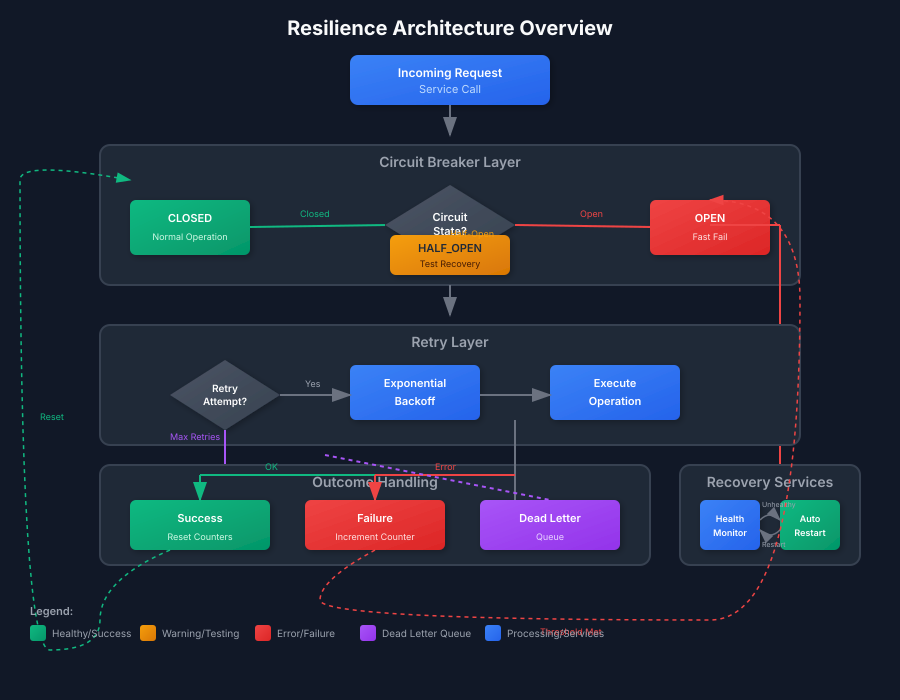

_Layered resilience architecture showing circuit breakers, retry logic with exponential backoff, dead-letter queues, and health monitoring._

<details>
<summary>Mermaid source (click to expand)</summary>

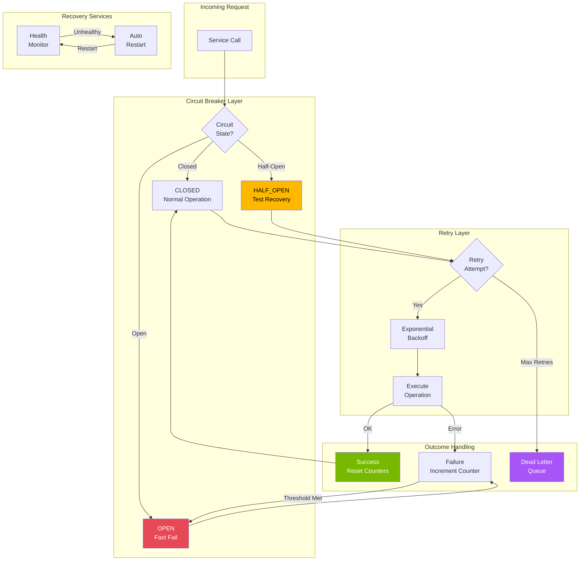
```mermaid
flowchart TB
    subgraph Input["Incoming Request"]
        REQ[Service Call]
    end

    subgraph CircuitBreaker["Circuit Breaker Layer"]
        CB{Circuit<br/>State?}
        CLOSED[CLOSED<br/>Normal Operation]
        OPEN[OPEN<br/>Fast Fail]
        HALF[HALF_OPEN<br/>Test Recovery]
    end

    subgraph Retry["Retry Layer"]
        RT{Retry<br/>Attempt?}
        BACKOFF[Exponential<br/>Backoff]
        EXEC[Execute<br/>Operation]
    end

    subgraph Outcome["Outcome Handling"]
        SUCCESS[Success<br/>Reset Counters]
        FAIL[Failure<br/>Increment Counter]
        DLQ[Dead Letter<br/>Queue]
    end

    subgraph Recovery["Recovery Services"]
        HM[Health<br/>Monitor]
        AUTO[Auto<br/>Restart]
    end

    REQ --> CB
    CB -->|Closed| CLOSED --> RT
    CB -->|Open| OPEN --> FAIL
    CB -->|Half-Open| HALF --> RT

    RT -->|Yes| BACKOFF --> EXEC
    RT -->|Max Retries| DLQ

    EXEC -->|OK| SUCCESS
    EXEC -->|Error| FAIL

    FAIL -->|Threshold Met| OPEN
    SUCCESS --> CLOSED

    HM -->|Unhealthy| AUTO
    AUTO -->|Restart| HM

    style OPEN fill:#E74856,color:#fff
    style SUCCESS fill:#76B900,color:#fff
    style DLQ fill:#A855F7,color:#fff
    style HALF fill:#FFB800,color:#000
```

</details>

### Resilience Components

| Component              | Location                                      | Responsibility                              |
| ---------------------- | --------------------------------------------- | ------------------------------------------- |
| `CircuitBreaker`       | `backend/services/circuit_breaker.py:270`     | Prevents cascading failures by failing fast |
| `RetryHandler`         | `backend/services/retry_handler.py:184`       | Exponential backoff with DLQ support        |
| `ServiceHealthMonitor` | `backend/services/health_monitor.py:44`       | Periodic health checks and auto-recovery    |
| `DegradationManager`   | `backend/services/degradation_manager.py:350` | Graceful degradation during outages         |

---

## Circuit Breaker Pattern


The circuit breaker protects external services from cascading failures by monitoring failure rates and temporarily blocking calls to unhealthy services.

### Circuit Breaker States

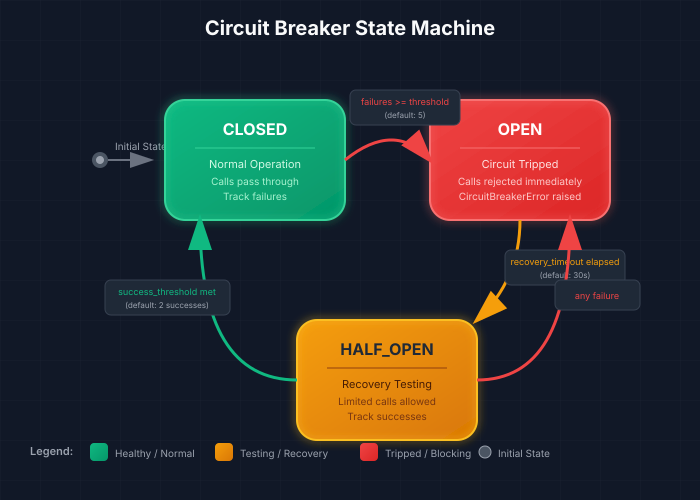

_State machine showing transitions between CLOSED (normal), OPEN (tripped), and HALF_OPEN (testing) states._

<details>
<summary>Mermaid source (click to expand)</summary>

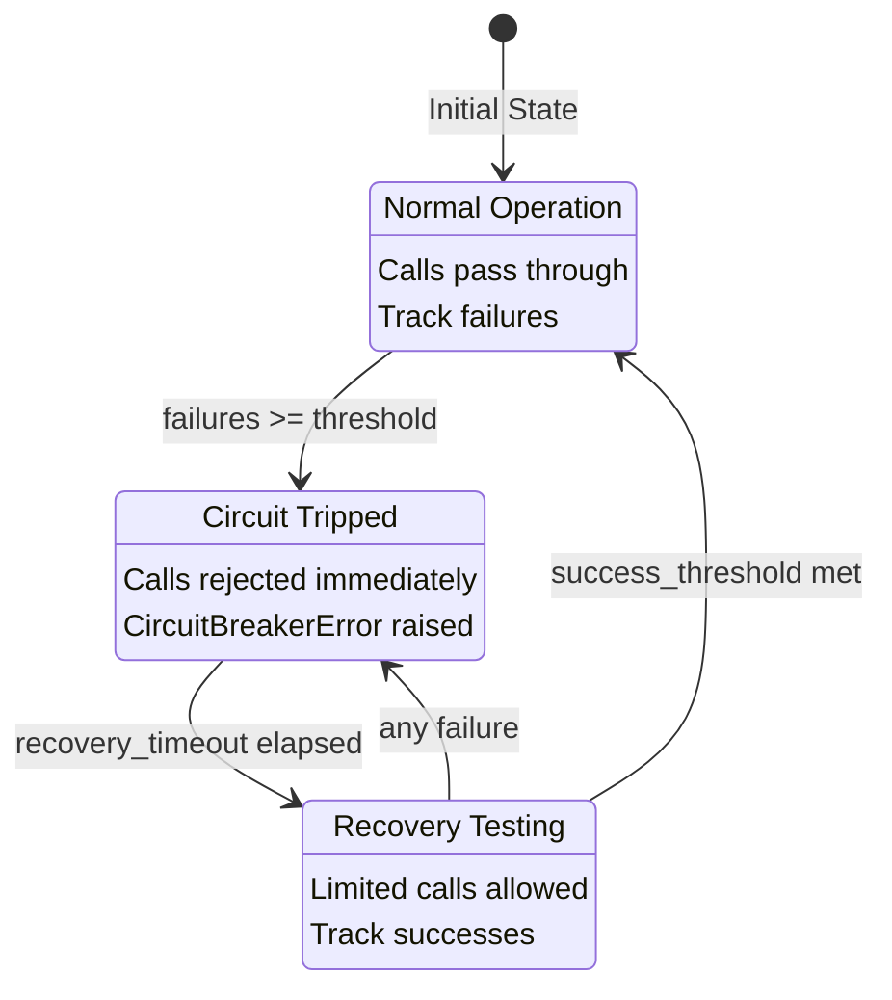
```mermaid
stateDiagram-v2
    [*] --> CLOSED: Initial State

    CLOSED --> OPEN: failures >= threshold
    OPEN --> HALF_OPEN: recovery_timeout elapsed
    HALF_OPEN --> CLOSED: success_threshold met
    HALF_OPEN --> OPEN: any failure

    CLOSED: Normal Operation
    CLOSED: Calls pass through
    CLOSED: Track failures

    OPEN: Circuit Tripped
    OPEN: Calls rejected immediately
    OPEN: CircuitBreakerError raised

    HALF_OPEN: Recovery Testing
    HALF_OPEN: Limited calls allowed
    HALF_OPEN: Track successes
```

</details>

### Implementation Details

The `CircuitBreaker` class (`backend/services/circuit_breaker.py:270`) implements the pattern; `CircuitState` is defined at `:130`:

```python
# backend/services/circuit_breaker.py:270
class CircuitBreaker:
    """Circuit breaker for protecting external service calls.

    Implements the circuit breaker pattern with three states:
    - CLOSED: Normal operation, calls pass through
    - OPEN: Service failing, calls rejected immediately
    - HALF_OPEN: Testing recovery, limited calls allowed
    """

    def __init__(
        self,
        name: str,
        config: CircuitBreakerConfig | None = None,
    ) -> None:
        self._name = name
        self._config = config or CircuitBreakerConfig()
        self._state = CircuitState.CLOSED
        self._failure_count = 0
        # ...
```

Operations run through the breaker with `await breaker.call(...)` (`backend/services/circuit_breaker.py:440`); when the circuit is OPEN the call is rejected without touching the network.

### Circuit Breaker Configuration

The `CircuitBreakerConfig` dataclass (`backend/services/circuit_breaker.py:139`) defines behavior:

| Parameter             | Default | Description                                  |
| --------------------- | ------- | -------------------------------------------- |
| `failure_threshold`   | 5       | Failures before opening circuit              |
| `recovery_timeout`    | 30.0s   | Wait time before testing recovery            |
| `half_open_max_calls` | 3       | Max calls allowed in half-open state         |
| `success_threshold`   | 2       | Successes needed to close circuit            |
| `excluded_exceptions` | ()      | Exception types that don't count as failures |

### Usage Pattern

```python
from backend.services.circuit_breaker import get_circuit_breaker, CircuitBreakerConfig

# Get or create circuit breaker for a service
breaker = get_circuit_breaker(
    "yolo26",
    CircuitBreakerConfig(
        failure_threshold=5,
        recovery_timeout=30.0,
    )
)

# Execute through circuit breaker
try:
    result = await breaker.call(detector_client.detect_objects, image_path)
except CircuitBreakerError:
    # Service unavailable, use fallback
    result = []
```

### Circuit Breaker Registry

The `CircuitBreakerRegistry` (`backend/services/circuit_breaker.py:1018`) is a process-global registry of named breakers, accessed through `get_circuit_breaker()` (`:1104`). Breakers are pre-registered at startup and reused by every later caller that asks for the same name:

<details>
<summary>Mermaid source (click to expand)</summary>

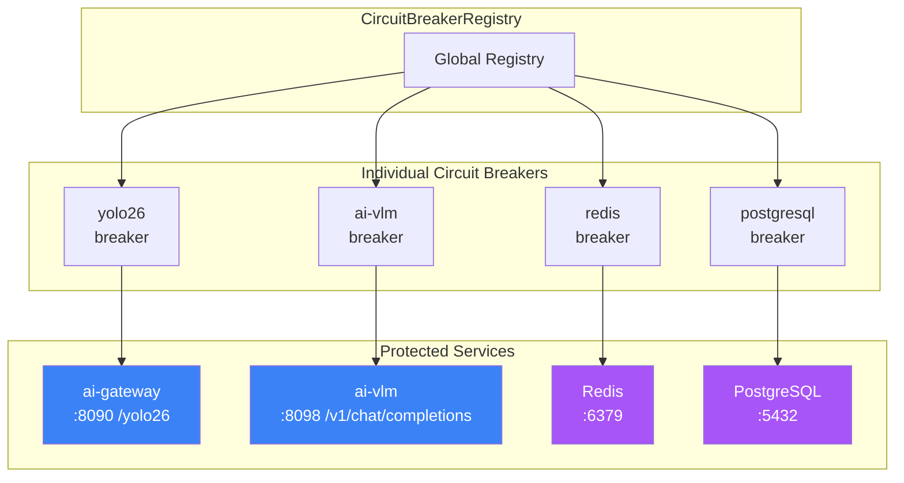
```mermaid
flowchart TB
    subgraph Registry["CircuitBreakerRegistry"]
        R[Global Registry]
    end

    subgraph Breakers["Individual Circuit Breakers"]
        B1[yolo26<br/>breaker]
        B2[ai-vlm<br/>breaker]
        B3[redis<br/>breaker]
        B4[postgresql<br/>breaker]
    end

    subgraph Services["Protected Services"]
        S1[ai-gateway<br/>:8090 /yolo26]
        S2[ai-vlm<br/>:8098 /v1/chat/completions]
        S3[Redis<br/>:6379]
        S4[PostgreSQL<br/>:5432]
    end

    R --> B1
    R --> B2
    R --> B3
    R --> B4

    B1 --> S1
    B2 --> S2
    B3 --> S3
    B4 --> S4

    style S1 fill:#3B82F6,color:#fff
    style S2 fill:#3B82F6,color:#fff
    style S3 fill:#A855F7,color:#fff
    style S4 fill:#A855F7,color:#fff
```

</details>

Startup pre-registration (`backend/main.py:321-329`) creates three named breakers with two profiles:

- **AI profile** (`failure_threshold=5`, `recovery_timeout=30.0`, `half_open_max_calls=3`, `success_threshold=2`): used for `yolo26`.
- **Infrastructure profile** (`failure_threshold=10`, `recovery_timeout=60.0`, `half_open_max_calls=5`, `success_threshold=3`): used for `postgresql` and `redis`.

The `ai-vlm` breaker is not in the startup list - `VlmClient` creates it on first use with `get_circuit_breaker("ai-vlm", CircuitBreakerConfig(failure_threshold=5, recovery_timeout=60.0))` (breaker name at `backend/services/vlm_client.py:93`, construction at `:316-319`). While it is OPEN, the client refuses the request without any I/O instead of piling onto a downed service, and the open/close transitions are pushed to the DegradationManager (see [Graceful Degradation](#graceful-degradation)).

---

## Retry Handler with Exponential Backoff

The `RetryHandler` (`backend/services/retry_handler.py:184`) provides automatic retries with exponential backoff for transient failures. Pipeline workers construct one with the shipped defaults (`backend/services/pipeline_workers.py:279-287`): `max_retries=3`, `base_delay_seconds=1.0`, `max_delay_seconds=30.0`, `exponential_base=2.0`, `jitter=True`.

### Retry Flow

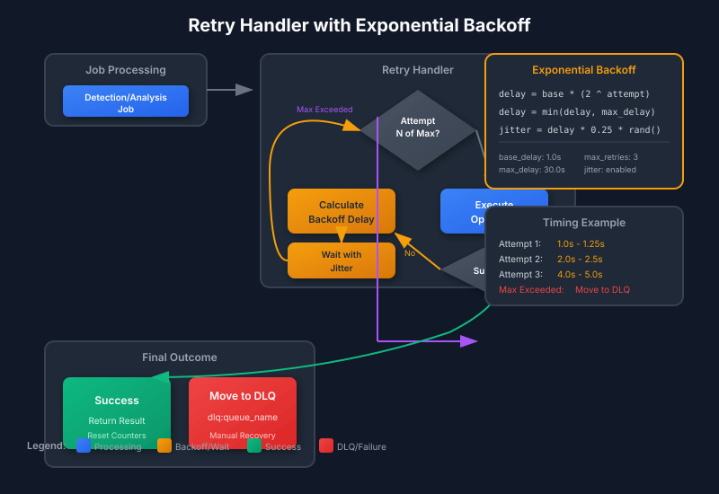

_Retry flow showing exponential backoff calculation, jitter application, cap enforcement, and dead-letter queue handling._

<details>
<summary>Mermaid source (click to expand)</summary>

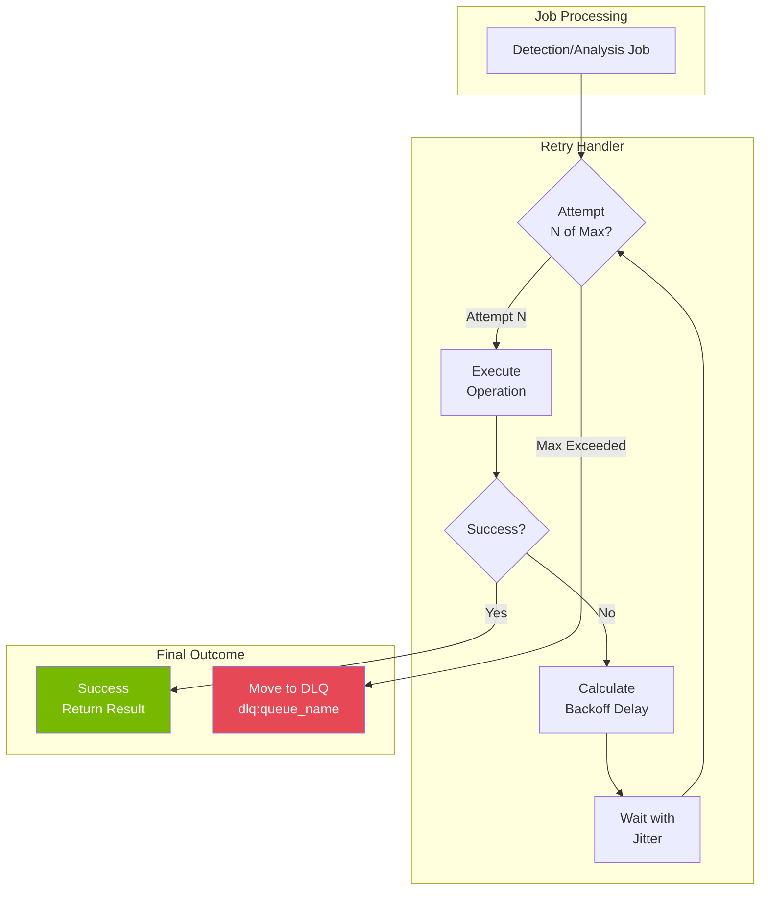
```mermaid
flowchart TB
    subgraph Input["Job Processing"]
        JOB[Detection/Analysis Job]
    end

    subgraph RetryLoop["Retry Handler"]
        ATT{Attempt<br/>N of Max?}
        EXEC[Execute<br/>Operation]
        CHK{Success?}
        CALC[Calculate<br/>Backoff Delay]
        WAIT[Wait with<br/>Jitter]
    end

    subgraph Outcomes["Final Outcome"]
        OK[Success<br/>Return Result]
        DLQ[Move to DLQ<br/>dlq:queue_name]
    end

    JOB --> ATT
    ATT -->|Attempt N| EXEC
    ATT -->|Max Exceeded| DLQ

    EXEC --> CHK
    CHK -->|Yes| OK
    CHK -->|No| CALC

    CALC --> WAIT
    WAIT --> ATT

    style OK fill:#76B900,color:#fff
    style DLQ fill:#E74856,color:#fff
```

</details>

### Exponential Backoff Algorithm

The `RetryConfig` dataclass (`backend/services/retry_handler.py:65`) configures backoff behavior:

```python
# backend/services/retry_handler.py:65
@dataclass
class RetryConfig:
    """Configuration for retry behavior."""

    max_retries: int = 3
    base_delay_seconds: float = 1.0
    max_delay_seconds: float = 30.0
    exponential_base: float = 2.0
    jitter: bool = True

    def get_delay(self, attempt: int) -> float:
        """Calculate delay: base * (exponential_base ^ (attempt - 1))"""
        delay = self.base_delay_seconds * (self.exponential_base ** (attempt - 1))
        delay = min(delay, self.max_delay_seconds)
        if self.jitter:
            jitter_amount = delay * 0.25 * random.random()
            delay = delay + jitter_amount
        return delay
```

### Backoff Timing Example

| Attempt | Base Delay  | With Jitter (0-25%) |
| ------- | ----------- | ------------------- |
| 1       | 1.0s        | 1.0s - 1.25s        |
| 2       | 2.0s        | 2.0s - 2.5s         |
| 3       | 4.0s        | 4.0s - 5.0s         |
| 4       | 8.0s        | 8.0s - 10.0s        |
| 5       | 16.0s       | 16.0s - 20.0s       |
| 6+      | 30.0s (max) | 30.0s - 37.5s       |

`with_retry()` (`backend/services/retry_handler.py:264`) executes the operation up to `max_retries` times and returns a `RetryResult`; when every attempt has failed the job is written to the dead-letter queue with the enriched metadata described next.

---

## Dead-Letter Queue (DLQ) Management

Jobs that exhaust all retry attempts are moved to dead-letter queues for manual inspection and reprocessing.

### DLQ Architecture


_DLQ system architecture with queue workers, retry handling, and management API for failed job recovery._

<details>
<summary>Mermaid source (click to expand)</summary>

```mermaid
flowchart TB
    subgraph ProcessingQueues["Processing Queues"]
        DQ[detection_queue]
        AQ[analysis_queue]
    end

    subgraph Workers["Queue Workers"]
        DW[DetectionQueueWorker]
        AW[AnalysisQueueWorker]
    end

    subgraph RetryLayer["Retry Handler"]
        RH[RetryHandler<br/>max_retries=3]
    end

    subgraph DLQs["Dead Letter Queues"]
        DLQ1[dlq:detection_queue]
        DLQ2[dlq:analysis_queue]
    end

    subgraph Management["DLQ Management API"]
        API[/api/dlq/*]
        INSPECT[Inspect Jobs]
        REQUEUE[Requeue Jobs]
        CLEAR[Clear Queue]
    end

    DQ --> DW
    AQ --> AW
    DW --> RH
    AW --> RH

    RH -->|Exhausted| DLQ1
    RH -->|Exhausted| DLQ2

    API --> INSPECT
    API --> REQUEUE
    API --> CLEAR

    DLQ1 -.->|Manual| REQUEUE
    DLQ2 -.->|Manual| REQUEUE
    REQUEUE -.->|Return to| DQ
    REQUEUE -.->|Return to| AQ

    style DLQ1 fill:#E74856,color:#fff
    style DLQ2 fill:#E74856,color:#fff
    style API fill:#3B82F6,color:#fff
```

</details>

### Queue and DLQ Key Layout

The Redis key names are defined in `backend/core/constants.py:146-177`: the legacy list queues are `detection_queue` and `analysis_queue`, the DLQ prefix is `dlq:`, giving `dlq:detection_queue` and `dlq:analysis_queue`. The `RetryHandler` re-exports these constants (`backend/services/retry_handler.py:212-215`) and derives DLQ names as `dlq:{queue_name}`.

With streams enabled (`USE_REDIS_STREAMS`, default true), the queue-of-record is the Redis Streams path instead of those lists: `detections:stream` and `analysis:stream` (`backend/services/redis_streams.py:73`, `:873`). The stream services keep their own per-stream DLQ **streams** at `{stream_key}:dlq` - `detections:stream:dlq` and `analysis:stream:dlq` (constants at `:74`, `:874`; derived as `self._dlq_key` at `:271`, `:971`). A message is moved there by `DetectionStreamService.move_to_dlq()` (`:618`) when `DEFAULT_MAX_DELIVERY_COUNT = 3` (`:82`) delivery attempts are exceeded, storing the original fields plus `original_message_id`, `dlq_reason`, `dlq_timestamp`, and `delivery_count`.

The `/api/dlq` management API and `get_dlq_stats()` read the list-shaped `dlq:detection_queue` / `dlq:analysis_queue` keys via `get_queue_length` (`backend/services/retry_handler.py:612-629`, `backend/api/routes/dlq.py`).

### DLQ Job Format

Jobs moved by the retry handler include failure metadata (`original_job`, `error`, `attempt_count`, `first_failed_at`, `last_failed_at`, `queue_name`):

```json
{
  "original_job": {
    "camera_id": "front_door",
    "file_path": "/export/foscam/front_door/image_001.jpg",
    "timestamp": "2024-01-15T10:30:00.000000"
  },
  "error": "Connection refused: YOLO26 service unavailable",
  "attempt_count": 3,
  "first_failed_at": "2024-01-15T10:30:01.000000",
  "last_failed_at": "2024-01-15T10:30:15.000000",
  "queue_name": "detection_queue"
}
```

### DLQ Statistics

The `DLQStats` dataclass (`backend/services/retry_handler.py:176`):

```python
# backend/services/retry_handler.py:176
@dataclass
class DLQStats:
    """Statistics about dead-letter queues."""

    detection_queue_count: int = 0
    analysis_queue_count: int = 0
    total_count: int = 0
```

### DLQ API Endpoints

All endpoints are on the `/api/dlq` router (`backend/api/routes/dlq.py:38`):

| Endpoint                            | Method | Description                     |
| ----------------------------------- | ------ | ------------------------------- |
| `/api/dlq/stats`                    | GET    | Get DLQ statistics              |
| `/api/dlq/jobs/{queue_name}`        | GET    | List jobs in a DLQ              |
| `/api/dlq/requeue/{queue_name}`     | POST   | Move one job back to processing |
| `/api/dlq/requeue-all/{queue_name}` | POST   | Requeue all jobs in a DLQ       |
| `/api/dlq/{queue_name}`             | DELETE | Clear all jobs in DLQ           |

### DLQ Overflow Protection

The `RetryHandler` wraps its own DLQ writes in a dedicated `dlq_overflow` circuit breaker so a Redis outage cannot turn DLQ writes into an unbounded retry loop (`backend/services/retry_handler.py:236-246`). Its settings come from `backend/core/config.py:2121-2143`: failure threshold 5, recovery timeout 60.0s, half-open max calls 3, success threshold 2. While the breaker is open, DLQ writes are rejected (`is_dlq_circuit_open()`); after manually draining a DLQ, `reset_dlq_circuit_breaker()` closes it again.

---

## Service Health Monitoring

The `ServiceHealthMonitor` (`backend/services/health_monitor.py:44`) continuously monitors the detector service and orchestrates automatic recovery.

### Health Check Flow

<details>
<summary>Mermaid source (click to expand)</summary>

```mermaid
flowchart TB
    subgraph Monitor["ServiceHealthMonitor"]
        LOOP[Health Check Loop<br/>Every 15s]
    end

    subgraph Services["Monitored Service"]
        S1[yolo26<br/>GET gateway /health]
        S3[Redis<br/>PING (not monitored)]
    end

    subgraph States["Service States"]
        HEALTHY[healthy<br/>Normal operation]
        UNHEALTHY[unhealthy<br/>Health check failed]
        RESTARTING[restarting<br/>Restart in progress]
        FAILED[failed<br/>Max retries exceeded]
    end

    subgraph Recovery["Recovery Actions"]
        BACKOFF[Exponential<br/>Backoff]
        RESTART[Restart<br/>Service]
        BROADCAST[WebSocket<br/>Broadcast]
    end

    LOOP --> S1

    S1 -->|OK| HEALTHY
    S1 -->|Fail| UNHEALTHY

    UNHEALTHY --> BACKOFF
    BACKOFF --> RESTART
    RESTART -->|Success| HEALTHY
    RESTART -->|Fail| RESTARTING
    RESTARTING -->|Max Retries| FAILED

    HEALTHY --> BROADCAST
    UNHEALTHY --> BROADCAST
    FAILED --> BROADCAST

    style HEALTHY fill:#76B900,color:#fff
    style UNHEALTHY fill:#FFB800,color:#000
    style FAILED fill:#E74856,color:#fff
    style RESTARTING fill:#3B82F6,color:#fff
```

</details>

The monitored set is exactly `yolo26` (`build_ai_service_health_configs`, `backend/main.py:671-729`): health is checked at the ai-gateway's aggregated `/health` endpoint when `USE_AI_GATEWAY` is on, restarts run `docker restart ai-gateway` in containerized deployments or `ai/start_detector.sh` locally, and `AI_RESTART_ENABLED=false` (`backend/core/config.py:2637`) keeps monitoring while disabling restarts. Redis is deliberately not in the monitored list - the application already handles Redis failures gracefully. ai-vlm is deliberately not a probe target either: probing would wake a sleeping llama.cpp, so its health arrives by breaker-push from `VlmClient` to the DegradationManager instead (`backend/main.py:1134-1150`).

### Health Monitor Implementation

```python
# backend/services/health_monitor.py:44
class ServiceHealthMonitor:
    """Monitors service health and orchestrates automatic recovery.

    Status values:
        - healthy: Service responding normally
        - unhealthy: Health check failed
        - restarting: Restart in progress
        - restart_failed: Restart attempt failed
        - failed: Max retries exceeded, giving up
    """

    def __init__(
        self,
        manager: ServiceManager,
        services: list[ServiceConfig],
        broadcaster: EventBroadcaster | None = None,
        check_interval: float = 15.0,
    ) -> None:
        self._manager = manager
        self._services = services
        self._broadcaster = broadcaster
        self._check_interval = check_interval
        # ...
```

The backend wires it up at startup with `check_interval=15.0` (`backend/main.py:1110-1115`).

### Per-Service Configuration

The monitor consumes `ServiceConfig` entries (`backend/services/service_managers.py:99`):

| Field            | Default | Description                                       |
| ---------------- | ------- | ------------------------------------------------- |
| `health_url`     | -       | HTTP endpoint polled each cycle                   |
| `restart_cmd`    | None    | Restart command; None disables restart            |
| `health_timeout` | 5.0s    | Timeout for individual health-check requests      |
| `max_retries`    | 3       | Restart attempts before giving up (yolo26 uses 3) |
| `backoff_base`   | 5.0s    | Base for restart backoff: `base * 2^(failures-1)` |

### Recovery Backoff Strategy

Recovery attempts use exponential backoff to avoid overwhelming recovering services (`backend/services/health_monitor.py:227-229`). For the yolo26 config (`max_retries=3`, `backoff_base=5.0`):

| Attempt | Backoff Delay | Formula              |
| ------- | ------------- | -------------------- |
| 1       | 5s            | `backoff_base * 2^0` |
| 2       | 10s           | `backoff_base * 2^1` |
| 3       | 20s           | `backoff_base * 2^2` |
| 4       | (Give up)     | Max retries exceeded |

---

## Graceful Degradation

When services are unavailable, the system degrades gracefully rather than failing completely.

### Degradation Modes

<details>
<summary>Mermaid source (click to expand)</summary>

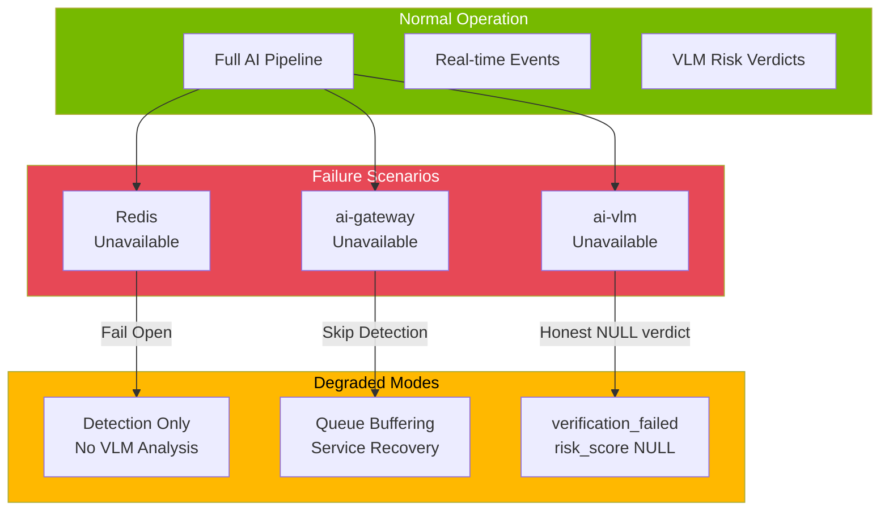
```mermaid
flowchart TB
    subgraph Normal["Normal Operation"]
        N1[Full AI Pipeline]
        N2[Real-time Events]
        N3[VLM Risk Verdicts]
    end

    subgraph Degraded["Degraded Modes"]
        D1[Detection Only<br/>No VLM Analysis]
        D2[Queue Buffering<br/>Service Recovery]
        D3[verification_failed<br/>risk_score NULL]
    end

    subgraph Failed["Failure Scenarios"]
        F1[ai-gateway<br/>Unavailable]
        F2[ai-vlm<br/>Unavailable]
        F3[Redis<br/>Unavailable]
    end

    F1 -->|Skip Detection| D2
    F2 -->|Honest NULL verdict| D3
    F3 -->|Fail Open| D1

    N1 --> F1
    N1 --> F2
    N1 --> F3

    style Normal fill:#76B900,color:#fff
    style Degraded fill:#FFB800,color:#000
    style Failed fill:#E74856,color:#fff
```

</details>

### Degradation Behavior by Component

| Component      | Failure Mode | Degradation Behavior                                                      |
| -------------- | ------------ | ------------------------------------------------------------------------- |
| **ai-gateway** | Unreachable  | `DetectorClient.detect_objects` returns an empty list, detection skipped  |
| **ai-vlm**     | Unreachable  | Event stored with `verification_failed`, NULL score/level - never a guess |
| **Redis**      | Unreachable  | Deduplication fails open (allows processing)                              |
| **Redis**      | Pub/sub down | WebSocket updates unavailable; broadcasters enter degraded mode           |
| **PostgreSQL** | Unreachable  | Full system failure (critical dependency)                                 |

### VLM Failure Semantics

There is no invented fallback score. When the VLM cannot produce a valid verdict - transport failure, schema failure after the one temperature-0 retry, or any other rung of the retry ladder bottoming out - `apply_verdict_invariants()` writes an honest placeholder into the event row (`backend/services/vlm_analyzer.py:268-280`):

```python
# backend/services/vlm_analyzer.py:268 (inside apply_verdict_invariants, verdict=None)
return {
    "verdict": "verification_failed",
    "risk_score": None,
    "risk_level": None,
    "summary": "VLM verification failed; this event needs review.",
    ...
}
```

The event row is still written so the UI shows it as needing review, and the streaming path emits a recoverable `LLM_INVALID_RESPONSE` error for the in-flight progress stream (`backend/services/vlm_analyzer.py:747-756`). `verification_failed` plus a NULL score is the signature that the backend was up while the VLM was not - it is not a low-risk verdict.

### DegradationManager

The `DegradationManager` (`backend/services/degradation_manager.py:350`) tracks a service-health registry with a mode that goes NON-NORMAL when any registered service is down, queues jobs for later processing during outages (Redis queue `degraded:jobs`, with a disk-backed fallback queue when Redis itself is down), and re-queues them on recovery.

ai-vlm is registered on this singleton at startup with `critical=False` (`backend/main.py:1149-1150`), and its health row is updated by breaker-push: `VlmClient` calls `update_service_health()` when its circuit breaker opens and closes (`backend/services/vlm_client.py:920-929`, `:936-939`). The registration's `health_check` stub is never polled - wake-on-probe would disturb a sleeping llama.cpp, so the manager's poll loop is not the source of truth for this service.

---

## Recovery Strategies

### Automatic Recovery Sequence

<details>
<summary>Mermaid source (click to expand)</summary>

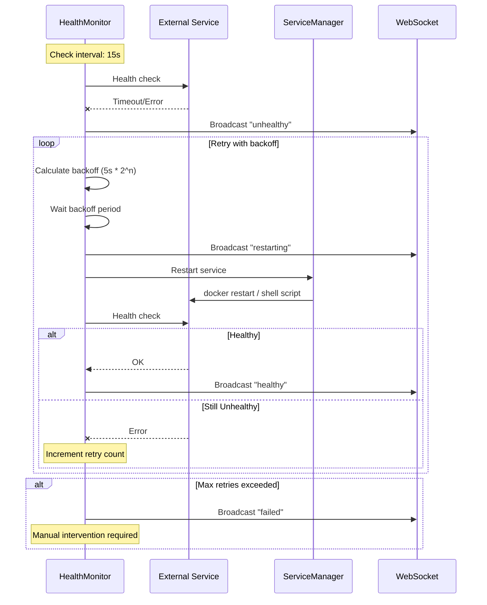
```mermaid
sequenceDiagram
    participant HM as HealthMonitor
    participant SVC as External Service
    participant SM as ServiceManager
    participant WS as WebSocket

    Note over HM: Check interval: 15s
    HM->>SVC: Health check
    SVC--xHM: Timeout/Error

    HM->>WS: Broadcast "unhealthy"

    loop Retry with backoff
        HM->>HM: Calculate backoff (5s * 2^n)
        HM->>HM: Wait backoff period
        HM->>WS: Broadcast "restarting"
        HM->>SM: Restart service
        SM->>SVC: docker restart / shell script
        HM->>SVC: Health check
        alt Healthy
            SVC-->>HM: OK
            HM->>WS: Broadcast "healthy"
        else Still Unhealthy
            SVC--xHM: Error
            Note over HM: Increment retry count
        end
    end

    alt Max retries exceeded
        HM->>WS: Broadcast "failed"
        Note over HM: Manual intervention required
    end
```

</details>

### Service Manager Strategies

The system supports different restart strategies via the `ServiceManager` interface (`backend/services/service_managers.py:120`):

| Strategy               | Implementation                        | Use Case                     |
| ---------------------- | ------------------------------------- | ---------------------------- |
| `ShellServiceManager`  | Shell commands (`systemctl`, scripts) | Development, native services |
| `DockerServiceManager` | Docker CLI (`docker restart`, `:407`) | Production containers        |

The backend picks `DockerServiceManager` when containerized restarts are enabled and `ShellServiceManager` otherwise (`backend/main.py:1103-1106`).

---

## Configuration Reference

The shipped resilience parameters are code defaults and class constants, not dedicated environment variables. The knobs that do have env overrides:

| Setting                                   | Default | Where                                                        |
| ----------------------------------------- | ------- | ------------------------------------------------------------ |
| `AI_RESTART_ENABLED`                      | true    | Detector auto-restart switch (`backend/core/config.py:2637`) |
| `DLQ_CIRCUIT_BREAKER_FAILURE_THRESHOLD`   | 5       | DLQ overflow breaker (`backend/core/config.py:2121`)         |
| `DLQ_CIRCUIT_BREAKER_RECOVERY_TIMEOUT`    | 60.0    | DLQ overflow breaker (`backend/core/config.py:2126`)         |
| `DLQ_CIRCUIT_BREAKER_HALF_OPEN_MAX_CALLS` | 3       | DLQ overflow breaker (`backend/core/config.py:2131`)         |
| `DLQ_CIRCUIT_BREAKER_SUCCESS_THRESHOLD`   | 2       | DLQ overflow breaker (`backend/core/config.py:2136`)         |

Field names on `Settings` map to env vars by name (case-insensitive, no prefix), so `DLQ_CIRCUIT_BREAKER_*` are settable; `ORCHESTRATOR_HEALTH_CHECK_INTERVAL` (30s, `backend/core/config.py:157`) belongs to the container orchestrator's own health loop, not `ServiceHealthMonitor`.

Code-level defaults worth knowing:

- **`CircuitBreakerConfig`**: 5 / 30.0s / 3 / 2 (`backend/services/circuit_breaker.py:150-154`); startup profiles override per service (AI 5/30/3/2, infrastructure 10/60/5/3, ai-vlm 5/60).
- **`RetryConfig`**: 3 retries, 1.0s base, 30.0s cap, jitter on (`backend/services/retry_handler.py:68-72`).
- **`ServiceHealthMonitor`**: 15.0s check interval (`backend/services/health_monitor.py:64`, wired at `backend/main.py:1114`); per-service `max_retries` 3 and `backoff_base` 5.0s for yolo26 (`backend/main.py:721-728`).
- **`WebSocketCircuitBreaker`**: constructor defaults failure_threshold 3, recovery_timeout 30.0s, half-open max calls 1, success threshold 1 (`backend/core/websocket_circuit_breaker.py:125-133`); the broadcasters pass `failure_threshold=MAX_RECOVERY_ATTEMPTS` (5) with the other parameters at their defaults (`backend/services/system_broadcaster.py:120-126`, `backend/services/event_broadcaster.py:404-410`).

---

## WebSocket Circuit Breaker and Degraded Mode

The system includes a dedicated WebSocket circuit breaker pattern for real-time connection resilience. This provides automatic recovery when Redis pub/sub experiences failures and graceful degradation when recovery fails.

### Architecture Overview

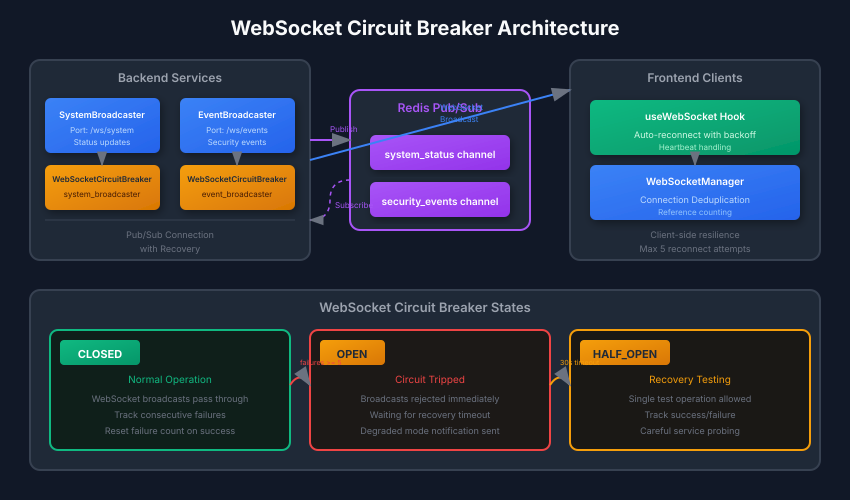

_WebSocket circuit breaker architecture showing backend services, Redis pub/sub, and frontend clients._

<details>
<summary>Mermaid source (click to expand)</summary>

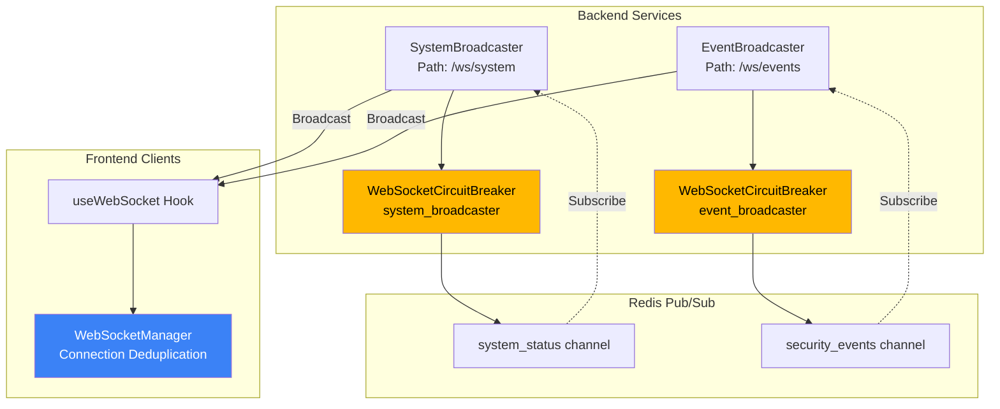
```mermaid
flowchart TB
    subgraph Backend["Backend Services"]
        SB[SystemBroadcaster<br/>Path: /ws/system]
        EB[EventBroadcaster<br/>Path: /ws/events]
        CB1[WebSocketCircuitBreaker<br/>system_broadcaster]
        CB2[WebSocketCircuitBreaker<br/>event_broadcaster]
    end

    subgraph Redis["Redis Pub/Sub"]
        CH1[system_status channel]
        CH2[security_events channel]
    end

    subgraph Frontend["Frontend Clients"]
        WS[useWebSocket Hook]
        WSM[WebSocketManager<br/>Connection Deduplication]
    end

    SB --> CB1
    EB --> CB2
    CB1 --> CH1
    CB2 --> CH2
    CH1 -.->|Subscribe| SB
    CH2 -.->|Subscribe| EB

    SB -->|Broadcast| WS
    EB -->|Broadcast| WS
    WS --> WSM

    style CB1 fill:#FFB800,color:#000
    style CB2 fill:#FFB800,color:#000
    style WSM fill:#3B82F6,color:#fff
```

</details>

### WebSocket Circuit Breaker States

The `WebSocketCircuitBreaker` (`backend/core/websocket_circuit_breaker.py:96`) implements the circuit breaker pattern specifically for WebSocket broadcaster services, with `WebSocketCircuitState` at `:39`.

| State         | Description                                             | Behavior                                         |
| ------------- | ------------------------------------------------------- | ------------------------------------------------ |
| **CLOSED**    | Normal operation, WebSocket operations proceed normally | All broadcasts pass through                      |
| **OPEN**      | Too many failures, operations blocked to allow recovery | Broadcasts are rejected immediately              |
| **HALF_OPEN** | Testing recovery, limited operations allowed            | Single test operation allowed per recovery cycle |

### State Diagram

_Note: The WebSocket circuit breaker state diagram is included in the architecture overview diagram above._

<details>
<summary>Mermaid source (click to expand)</summary>

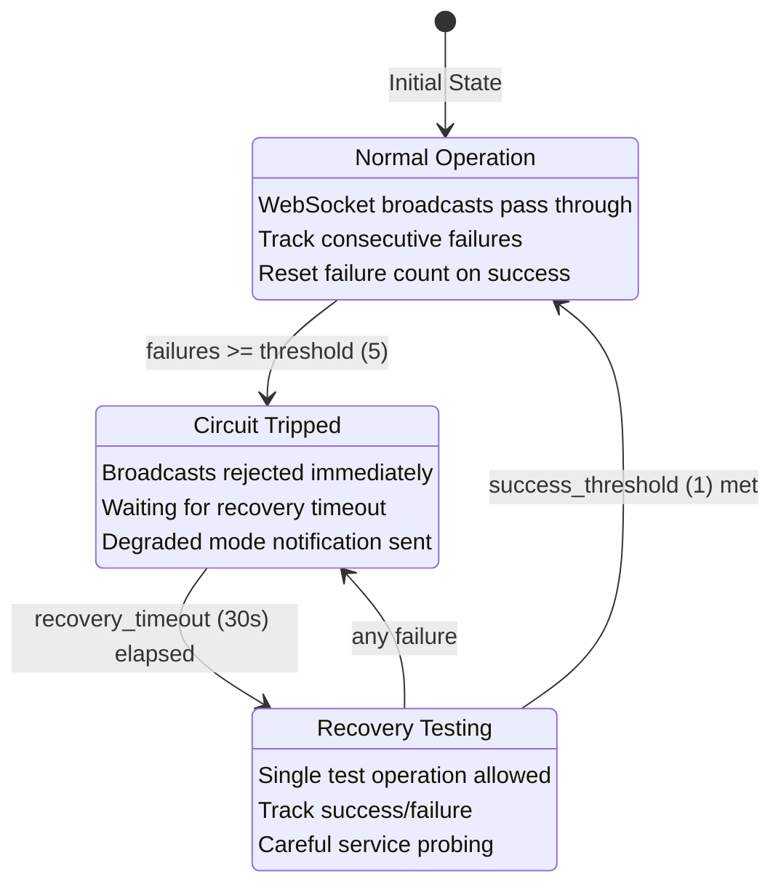
```mermaid
stateDiagram-v2
    [*] --> CLOSED: Initial State

    CLOSED --> OPEN: failures >= threshold (5)
    OPEN --> HALF_OPEN: recovery_timeout (30s) elapsed
    HALF_OPEN --> CLOSED: success_threshold (1) met
    HALF_OPEN --> OPEN: any failure

    CLOSED: Normal Operation
    CLOSED: WebSocket broadcasts pass through
    CLOSED: Track consecutive failures
    CLOSED: Reset failure count on success

    OPEN: Circuit Tripped
    OPEN: Broadcasts rejected immediately
    OPEN: Waiting for recovery timeout
    OPEN: Degraded mode notification sent

    HALF_OPEN: Recovery Testing
    HALF_OPEN: Single test operation allowed
    HALF_OPEN: Track success/failure
    HALF_OPEN: Careful service probing
```

</details>

### Configuration

Both `SystemBroadcaster` (`backend/services/system_broadcaster.py:68`) and `EventBroadcaster` (`backend/services/event_broadcaster.py:349`) construct their breaker the same way (`backend/services/system_broadcaster.py:120-126`, `backend/services/event_broadcaster.py:404-410`):

| Parameter             | Value                       | Description                                    |
| --------------------- | --------------------------- | ---------------------------------------------- |
| `failure_threshold`   | 5 (`MAX_RECOVERY_ATTEMPTS`) | Consecutive failures before opening circuit    |
| `recovery_timeout`    | 30.0s                       | Wait time before transitioning to HALF_OPEN    |
| `half_open_max_calls` | 1                           | Max calls allowed in HALF_OPEN state           |
| `success_threshold`   | 1                           | Successes needed in HALF_OPEN to close circuit |

Repeated HALF_OPEN failures drive a growing backoff between recovery windows (`backoff_base_delay` 1.0s, `backoff_max_delay` 60.0s constructor defaults, `backend/core/websocket_circuit_breaker.py:132-133`).

### Backend: Broadcaster Integration

Both broadcasters expose the breaker state through their public API:

```python
# backend/services/system_broadcaster.py:120-126, :237, :245
self._circuit_breaker = WebSocketCircuitBreaker(
    failure_threshold=self.MAX_RECOVERY_ATTEMPTS,
    recovery_timeout=30.0,
    half_open_max_calls=1,
    success_threshold=1,
    name="system_broadcaster",
)

def get_circuit_state(self) -> WebSocketCircuitState: ...
def is_degraded(self) -> bool: ...
```

(`EventBroadcaster` mirrors this with `name="event_broadcaster"` and `MAX_RECOVERY_ATTEMPTS = 5`, `backend/services/event_broadcaster.py:370`, `:404-410`, `:451`, `:2350`.)

### Degraded Mode

When the circuit breaker opens and recovery fails, the broadcaster enters **degraded mode**:

<details>
<summary>Mermaid source (click to expand)</summary>

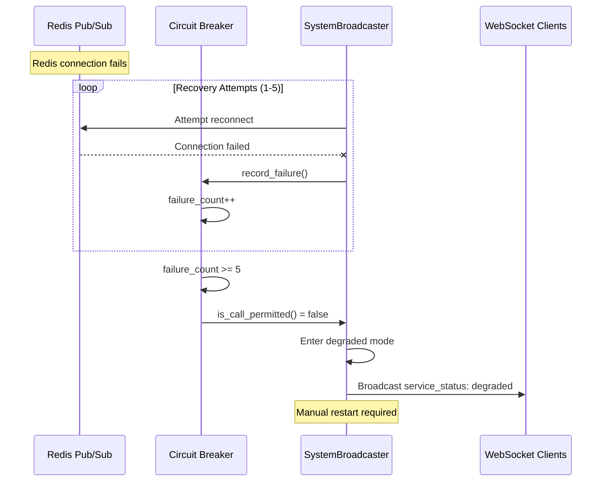
```mermaid
sequenceDiagram
    participant Redis as Redis Pub/Sub
    participant CB as Circuit Breaker
    participant SB as SystemBroadcaster
    participant WS as WebSocket Clients

    Note over Redis: Redis connection fails

    loop Recovery Attempts (1-5)
        SB->>Redis: Attempt reconnect
        Redis--xSB: Connection failed
        SB->>CB: record_failure()
        CB->>CB: failure_count++
    end

    CB->>CB: failure_count >= 5
    CB->>SB: is_call_permitted() = false
    SB->>SB: Enter degraded mode
    SB->>WS: Broadcast service_status: degraded

    Note over SB: Manual restart required
```

</details>

#### Degraded Mode Behavior

1. **`is_degraded()` method** - Returns `True` when all recovery attempts are exhausted
2. **Client notification** - Connected clients receive a `service_status` message built by `_broadcast_degraded_state()` (`backend/services/system_broadcaster.py:406-431`):
   ```json
   {
     "type": "service_status",
     "data": {
       "service": "system_broadcaster",
       "status": "degraded",
       "message": "System status broadcasting is degraded. Updates may be delayed or unavailable.",
       "circuit_state": "open"
     }
   }
   ```
3. **Graceful handling** - WebSocket connections are still accepted, but real-time broadcasts may be delayed or unavailable
4. **CRITICAL logging** - `EventBroadcaster has entered DEGRADED MODE after exhausting ...` is logged for manual intervention (`backend/services/event_broadcaster.py:1974`)

### Recovery Sequence

The broadcaster attempts automatic recovery with exponential backoff:

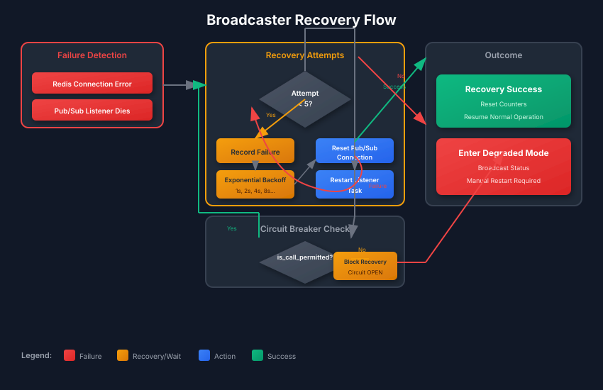

_Broadcaster recovery flow showing failure detection, recovery attempts, circuit breaker check, and outcomes._

<details>
<summary>Mermaid source (click to expand)</summary>

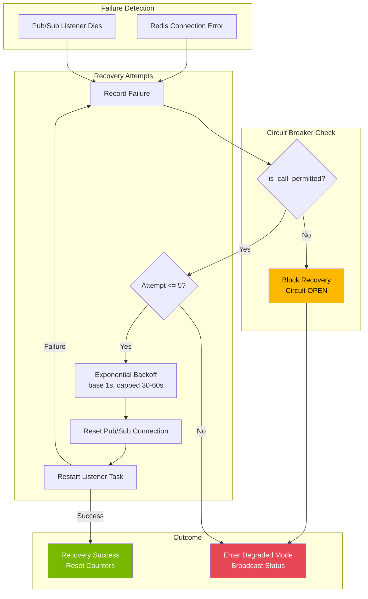
```mermaid
flowchart TB
    subgraph Failure["Failure Detection"]
        F1[Redis Connection Error]
        F2[Pub/Sub Listener Dies]
    end

    subgraph Recovery["Recovery Attempts"]
        R1{Attempt <= 5?}
        R2[Record Failure]
        R3[Exponential Backoff<br/>base 1s, capped 30-60s]
        R4[Reset Pub/Sub Connection]
        R5[Restart Listener Task]
    end

    subgraph CircuitBreaker["Circuit Breaker Check"]
        CB{is_call_permitted?}
        CB_BLOCK[Block Recovery<br/>Circuit OPEN]
    end

    subgraph Outcome["Outcome"]
        SUCCESS[Recovery Success<br/>Reset Counters]
        DEGRADED[Enter Degraded Mode<br/>Broadcast Status]
    end

    F1 --> R2
    F2 --> R2
    R2 --> CB

    CB -->|Yes| R1
    CB -->|No| CB_BLOCK --> DEGRADED

    R1 -->|Yes| R3 --> R4 --> R5
    R1 -->|No| DEGRADED

    R5 -->|Success| SUCCESS
    R5 -->|Failure| R2

    style DEGRADED fill:#E74856,color:#fff
    style SUCCESS fill:#76B900,color:#fff
    style CB_BLOCK fill:#FFB800,color:#000
```

</details>

The backoff is computed per broadcaster: `SystemBroadcaster` restarts its pub/sub listener with base 1s doubling to a 60s cap plus 10-30% jitter (`backend/services/system_broadcaster.py:739-757`), and the EventBroadcaster supervisor restarts the listener with doubling capped at 30s plus jitter (`backend/services/event_broadcaster.py:2053-2058`).

### Frontend: Client-Side Circuit Breaker Pattern

The frontend implements its own circuit breaker-like behavior through the reconnection logic in `webSocketManager.ts`. While not a traditional circuit breaker class, the `maxReconnectAttempts` mechanism provides equivalent protection:

- **Closed State (equivalent):** Normal connection, reset on successful open
- **Open State (equivalent):** `hasExhaustedRetries = true`, no more connection attempts
- **Half-Open State (equivalent):** Each reconnection attempt tests if the server is available

This approach is more appropriate for client-side WebSocket connections where:

1. The client cannot "block" operations like a backend service can
2. The primary failure mode is disconnection, not request failures
3. User feedback (connection status) is more important than request throttling

#### Frontend Circuit Breaker State Machine

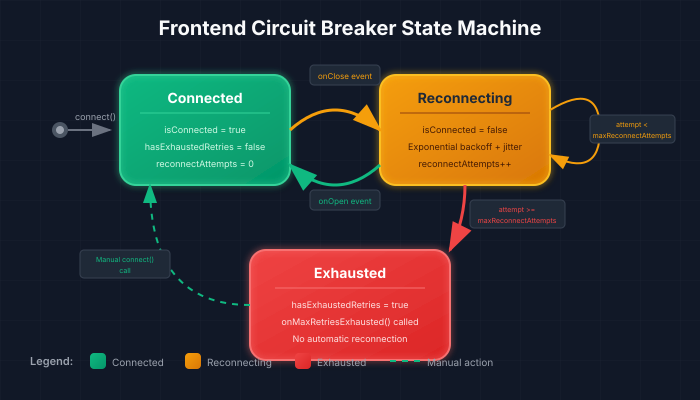

_Frontend circuit breaker state machine showing Connected, Reconnecting, and Exhausted states._

<details>
<summary>Mermaid source (click to expand)</summary>

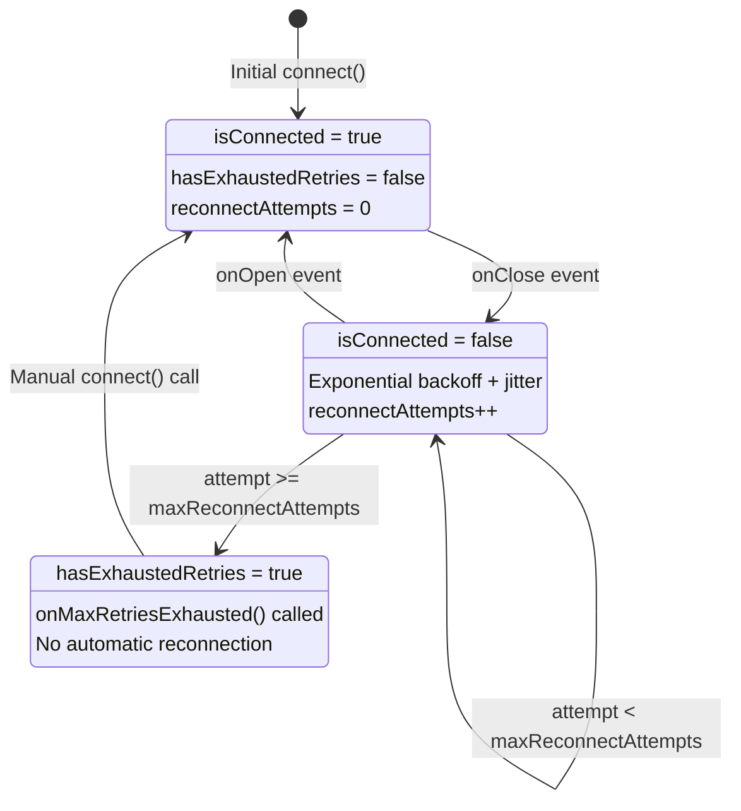
```mermaid
stateDiagram-v2
    [*] --> Connected: Initial connect()

    Connected --> Reconnecting: onClose event
    Connected: isConnected = true
    Connected: hasExhaustedRetries = false
    Connected: reconnectAttempts = 0

    Reconnecting --> Connected: onOpen event
    Reconnecting --> Reconnecting: attempt < maxReconnectAttempts
    Reconnecting --> Exhausted: attempt >= maxReconnectAttempts
    Reconnecting: isConnected = false
    Reconnecting: Exponential backoff + jitter
    Reconnecting: reconnectAttempts++

    Exhausted --> Connected: Manual connect() call
    Exhausted: hasExhaustedRetries = true
    Exhausted: onMaxRetriesExhausted() called
    Exhausted: No automatic reconnection
```

</details>

#### WebSocket Manager Architecture

The `WebSocketManager` (`frontend/src/hooks/webSocketManager.ts:225`, singleton exported as `webSocketManager` at `:952`) provides connection deduplication and automatic reconnection:

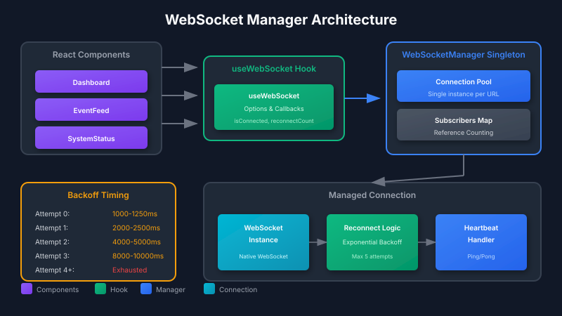

_WebSocket Manager architecture showing React components, hook, manager singleton, and managed connection._

<details>
<summary>Mermaid source (click to expand)</summary>

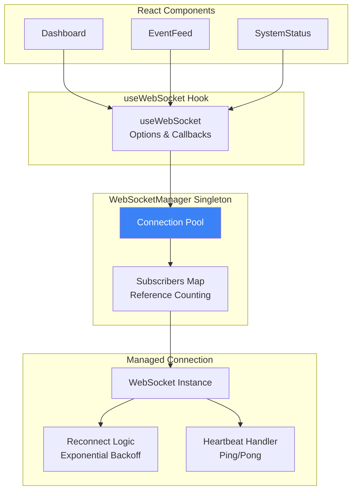
```mermaid
flowchart TB
    subgraph Components["React Components"]
        C1[Dashboard]
        C2[EventFeed]
        C3[SystemStatus]
    end

    subgraph Hook["useWebSocket Hook"]
        H[useWebSocket<br/>Options & Callbacks]
    end

    subgraph Manager["WebSocketManager Singleton"]
        M[Connection Pool]
        SUB[Subscribers Map<br/>Reference Counting]
    end

    subgraph Connection["Managed Connection"]
        WS[WebSocket Instance]
        RT[Reconnect Logic<br/>Exponential Backoff]
        HB[Heartbeat Handler<br/>Ping/Pong]
    end

    C1 & C2 & C3 --> H
    H --> M
    M --> SUB --> WS
    WS --> RT
    WS --> HB

    style M fill:#3B82F6,color:#fff
```

</details>

#### Client Reconnection Configuration

```typescript
// frontend/src/hooks/useWebSocket.ts:13,66-72
export interface WebSocketOptions {
  url: string;
  reconnect?: boolean; // Default: true
  reconnectInterval?: number; // Default: 1000ms (base interval)
  reconnectAttempts?: number; // Default: 15 (max attempts)
  connectionTimeout?: number; // Default: 10000ms
  autoRespondToHeartbeat?: boolean; // Default: true
  onMaxRetriesExhausted?: () => void; // Called when max attempts reached
}
```

The hook defaults to 15 attempts - with the exponential schedule below this covers roughly eight minutes of backend restart time before giving up.

#### Exponential Backoff with Jitter

```typescript
// frontend/src/hooks/webSocketManager.ts:188
function calculateBackoffDelay(
  attempt: number,
  baseInterval: number,
  maxInterval: number = 30000
): number {
  const exponentialDelay = baseInterval * Math.pow(2, attempt);
  const cappedDelay = Math.min(exponentialDelay, maxInterval);
  const jitter = Math.random() * 0.25 * cappedDelay;
  return Math.floor(cappedDelay + jitter);
}
```

| Attempt | Base Delay | Exponential | Capped  | With Jitter (0-25%) |
| ------- | ---------- | ----------- | ------- | ------------------- |
| 0       | 1000ms     | 1000ms      | 1000ms  | 1000-1250ms         |
| 1       | 1000ms     | 2000ms      | 2000ms  | 2000-2500ms         |
| 2       | 1000ms     | 4000ms      | 4000ms  | 4000-5000ms         |
| 3       | 1000ms     | 8000ms      | 8000ms  | 8000-10000ms        |
| 4       | 1000ms     | 16000ms     | 16000ms | 16000-20000ms       |
| 5+      | 1000ms     | 32000ms+    | 30000ms | 30000-37500ms       |

#### Client State Tracking

The `useWebSocket` hook exposes reconnection state (`frontend/src/hooks/useWebSocket.ts:40-54`):

```typescript
export interface UseWebSocketReturn {
  isConnected: boolean; // Current connection status
  lastMessage: unknown; // Latest parsed message
  send: (data: unknown) => void;
  connect: () => void; // Manual reconnect trigger
  disconnect: () => void; // Manual disconnect
  hasExhaustedRetries: boolean; // True if max attempts reached
  reconnectCount: number; // Current retry attempt count
  lastHeartbeat: Date | null; // Timestamp of last server heartbeat
  connectionId: string; // Unique connection ID
}
```

### End-to-End Resilience Flow

<details>
<summary>Mermaid source (click to expand)</summary>

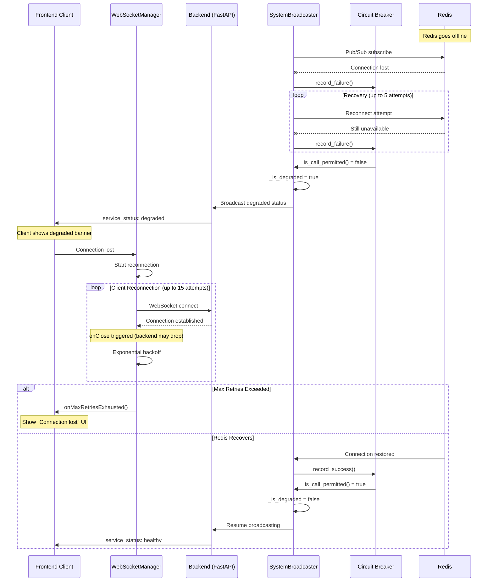
```mermaid
sequenceDiagram
    participant Client as Frontend Client
    participant WSM as WebSocketManager
    participant Backend as Backend (FastAPI)
    participant SB as SystemBroadcaster
    participant CB as Circuit Breaker
    participant Redis as Redis

    Note over Redis: Redis goes offline

    SB->>Redis: Pub/Sub subscribe
    Redis--xSB: Connection lost
    SB->>CB: record_failure()

    loop Recovery (up to 5 attempts)
        SB->>Redis: Reconnect attempt
        Redis--xSB: Still unavailable
        SB->>CB: record_failure()
    end

    CB->>SB: is_call_permitted() = false
    SB->>SB: _is_degraded = true
    SB->>Backend: Broadcast degraded status
    Backend->>Client: service_status: degraded

    Note over Client: Client shows degraded banner

    Client->>WSM: Connection lost
    WSM->>WSM: Start reconnection

    loop Client Reconnection (up to 15 attempts)
        WSM->>Backend: WebSocket connect
        Backend-->>WSM: Connection established
        Note over WSM: onClose triggered (backend may drop)
        WSM->>WSM: Exponential backoff
    end

    alt Max Retries Exceeded
        WSM->>Client: onMaxRetriesExhausted()
        Note over Client: Show "Connection lost" UI
    else Redis Recovers
        Redis->>SB: Connection restored
        SB->>CB: record_success()
        CB->>SB: is_call_permitted() = true
        SB->>SB: _is_degraded = false
        SB->>Backend: Resume broadcasting
        Backend->>Client: service_status: healthy
    end
```

</details>

### Monitoring and Observability

#### Backend Metrics

The breaker tracks metrics via `get_metrics()` (`backend/core/websocket_circuit_breaker.py:506`, returning `WebSocketCircuitBreakerMetrics` as declared at `:48-63`) and `get_status()` (`:526`):

| Metric                           | Description                                     |
| -------------------------------- | ----------------------------------------------- |
| `state`                          | Current circuit state                           |
| `failure_count`                  | Consecutive failures since last success         |
| `success_count`                  | Consecutive successes in HALF_OPEN state        |
| `total_failures`                 | Total failures recorded                         |
| `total_successes`                | Total successes recorded                        |
| `last_failure_time`              | Timestamp of last failure (monotonic)           |
| `last_state_change`              | Timestamp of last state transition              |
| `opened_at`                      | Timestamp when circuit was last opened          |
| `consecutive_half_open_failures` | HALF_OPEN failures driving the recovery backoff |
| `current_backoff_delay`          | Current recovery backoff delay in seconds       |
| `backoff_expires_at`             | When the current backoff window expires         |

#### Health Check Integration

The readiness endpoint reports broadcaster health (`backend/api/routes/system.py:1455`, `:1651`):

```python
# GET /api/system/health/ready includes per-dependency status
is_degraded=event_broadcaster.is_degraded(),
```

#### Client-Side Monitoring

```typescript
// React component monitoring example
const { isConnected, hasExhaustedRetries, reconnectCount, lastHeartbeat } = useWebSocket({
  url: '/ws/system',
  onMaxRetriesExhausted: () => {
    console.error('WebSocket connection failed after max retries');
    showConnectionErrorBanner();
  },
  onHeartbeat: () => {
    updateLastHeartbeatIndicator();
  },
});
```

### Supervisor Task (EventBroadcaster)

The EventBroadcaster includes an additional supervision layer that monitors listener health (`backend/services/event_broadcaster.py:2245-2262`, `SUPERVISION_INTERVAL = 30.0` at `:373`). When the listener task dies while a session is active, the supervisor restarts it through the circuit breaker, and entering an OPEN breaker or exhausting `MAX_RECOVERY_ATTEMPTS` puts the broadcaster into degraded mode (`:2295-2315`).

### Backend vs Frontend Circuit Breaker Comparison

| Aspect                  | Backend (WebSocketCircuitBreaker)                                | Frontend (WebSocketManager)                 |
| ----------------------- | ---------------------------------------------------------------- | ------------------------------------------- |
| **Implementation**      | Dedicated class with explicit states                             | Reconnection logic with attempt counter     |
| **State Tracking**      | `WebSocketCircuitState` enum (CLOSED/OPEN/HALF)                  | Derived from `reconnectAttempts` counter    |
| **Failure Detection**   | Explicit `record_failure()` calls                                | `onClose` event triggers attempt increment  |
| **Recovery Testing**    | HALF_OPEN state with limited calls                               | Each reconnect attempt is a recovery test   |
| **Blocking Behavior**   | Rejects operations when OPEN                                     | Stops automatic reconnection when exhausted |
| **User Notification**   | `service_status` WebSocket message                               | `onMaxRetriesExhausted` callback            |
| **Manual Reset**        | `reset()` method                                                 | `connect()` method resets attempt counter   |
| **Timeout-based Reset** | Yes (`recovery_timeout` triggers HALF_OPEN)                      | No (manual `connect()` required)            |
| **Concurrency Safety**  | `asyncio.Lock` (`backend/core/websocket_circuit_breaker.py:177`) | Single-threaded JavaScript (not needed)     |
| **Metrics**             | `get_metrics()` with counters and timestamps                     | `getConnectionState()` with basic state     |

### Configuration Summary

| Component      | Setting                 | Default | Description                      |
| -------------- | ----------------------- | ------- | -------------------------------- |
| **Backend CB** | `failure_threshold`     | 5       | Failures before circuit opens    |
| **Backend CB** | `recovery_timeout`      | 30s     | Wait before HALF_OPEN transition |
| **Backend**    | `SUPERVISION_INTERVAL`  | 30s     | Listener health check interval   |
| **Frontend**   | `reconnectAttempts`     | 15      | Max client reconnection attempts |
| **Frontend**   | `reconnectInterval`     | 1000ms  | Base backoff interval            |
| **Frontend**   | `connectionTimeout`     | 10000ms | Connection establishment timeout |
| **Frontend**   | `maxInterval` (backoff) | 30000ms | Maximum backoff delay            |

### Manual Recovery

When the system enters degraded mode, manual intervention is required:

```bash
# Check container health
docker compose -f docker-compose.prod.yml ps

# Check Redis connectivity
docker compose -f docker-compose.prod.yml exec redis redis-cli ping

# Restart the backend service
docker compose -f docker-compose.prod.yml restart backend

# View broadcaster logs
docker compose -f docker-compose.prod.yml logs backend | grep -i "broadcaster\|circuit"
```

Look for these log patterns (quotes are substrings of the emitted messages):

| Log Level    | Pattern                                      | Meaning                             |
| ------------ | -------------------------------------------- | ----------------------------------- |
| **CRITICAL** | `EventBroadcaster has entered DEGRADED MODE` | Requires manual restart             |
| **WARNING**  | `circuit breaker is OPEN`                    | Recovery blocked, waiting for reset |
| **INFO**     | `Restarting pub/sub listener (attempt`       | Auto-recovery in progress           |
| **INFO**     | `transitioned HALF_OPEN -> CLOSED`           | Service successfully recovered      |

---

## Related Documentation

| Document                                                         | Purpose                                                                                               |
| ---------------------------------------------------------------- | ----------------------------------------------------------------------------------------------------- |
| [Resilience Patterns Guide](../developer/resilience-patterns.md) | Developer guide with code examples for circuit breakers, retry logic, and prompt injection prevention |
| [AI Pipeline: Current State](ai-pipeline-current-state.md)       | Hop-by-hop shipped pipeline with the live failure modes and monitoring hooks                          |
| [Real-Time](real-time.md)                                        | WebSocket and pub/sub architecture                                                                    |
| [Data Model](data-model.md)                                      | Database schema and relationships                                                                     |
| [Frontend Hooks](frontend-hooks.md)                              | React hooks including useWebSocket                                                                    |

---

_This document describes the resilience architecture for the Home Security Intelligence system. For implementation details, see the source files referenced in the frontmatter._
