# Resilience Architecture

This document details the resilience patterns implemented in the Home Security Intelligence system to ensure reliable operation even when external services (YOLO26, Nemotron LLM, Redis) experience failures.

---

## Table of Contents

1. [Resilience Overview](#resilience-overview)
2. [Circuit Breaker Pattern](#circuit-breaker-pattern)
3. [Retry Handler with Exponential Backoff](#retry-handler-with-exponential-backoff)
4. [Dead-Letter Queue (DLQ) Management](#dead-letter-queue-dlq-management)
5. [Service Health Monitoring](#service-health-monitoring)
6. [Graceful Degradation](#graceful-degradation)
7. [Recovery Strategies](#recovery-strategies)
8. [Configuration Reference](#configuration-reference)
9. [Image Generation Prompts](#image-generation-prompts)
10. [WebSocket Circuit Breaker and Degraded Mode](#websocket-circuit-breaker-and-degraded-mode)

---

## Resilience Overview

The system implements multiple layers of resilience to handle failures gracefully:


_Layered resilience architecture showing circuit breakers, retry logic with exponential backoff, dead-letter queues, and health monitoring._

<details>
<summary>Mermaid source (click to expand)</summary>


</details>

### Resilience Components

| Component                                                        | Location                                  | Responsibility                              |
| ---------------------------------------------------------------- | ----------------------------------------- | ------------------------------------------- |
| [CircuitBreaker](../../backend/services/circuit_breaker.py)      | `backend/services/circuit_breaker.py:270` | Prevents cascading failures by failing fast |
| [RetryHandler](../../backend/services/retry_handler.py)          | `backend/services/retry_handler.py:184`   | Exponential backoff with DLQ support        |
| [ServiceHealthMonitor](../../backend/services/health_monitor.py) | `backend/services/health_monitor.py:44`   | Periodic health checks and auto-recovery    |
| DegradationManager                                               | `backend/services/degradation_manager.py` | Graceful degradation during outages         |

---

## Circuit Breaker Pattern

The circuit breaker protects external services from cascading failures by monitoring failure rates and temporarily blocking calls to unhealthy services.

### Circuit Breaker States


_State machine showing transitions between CLOSED (normal), OPEN (tripped), and HALF_OPEN (testing) states._

<details>
<summary>Mermaid source (click to expand)</summary>


</details>

### Implementation Details

The [CircuitBreaker](../../backend/services/circuit_breaker.py) class at line 270 implements the pattern:

```python
# backend/services/circuit_breaker.py:270
class CircuitBreaker:
    """Circuit breaker for protecting external service calls.

    Implements the circuit breaker pattern with three states:
    - CLOSED: Normal operation, calls pass through
    - OPEN: Service failing, calls rejected immediately
    - HALF_OPEN: Testing recovery, limited calls allowed
    """

    def __init__(
        self,
        name: str,
        config: CircuitBreakerConfig | None = None,
    ) -> None:
        self._name = name
        self._config = config or CircuitBreakerConfig()
        self._state = CircuitState.CLOSED
        self._failure_count = 0
        # ...
```

### Circuit Breaker Configuration

The [CircuitBreakerConfig](../../backend/services/circuit_breaker.py) at line 139 defines behavior:

| Parameter             | Default | Description                                  |
| --------------------- | ------- | -------------------------------------------- |
| `failure_threshold`   | 5       | Failures before opening circuit              |
| `recovery_timeout`    | 30.0s   | Wait time before testing recovery            |
| `half_open_max_calls` | 3       | Max calls allowed in half-open state         |
| `success_threshold`   | 2       | Successes needed to close circuit            |
| `excluded_exceptions` | ()      | Exception types that don't count as failures |

### Usage Pattern

```python
from backend.services.circuit_breaker import get_circuit_breaker, CircuitBreakerConfig

# Get or create circuit breaker for a service
breaker = get_circuit_breaker(
    "yolo26",
    CircuitBreakerConfig(
        failure_threshold=5,
        recovery_timeout=30.0,
    )
)

# Execute through circuit breaker
try:
    result = await breaker.call(detector_client.detect_objects, image_path)
except CircuitBreakerError:
    # Service unavailable, use fallback
    result = []
```

### Circuit Breaker Registry

The [CircuitBreakerRegistry](../../backend/services/circuit_breaker.py) at line 1018 manages multiple breakers:


_Global registry managing circuit breakers for yolo26, nemotron, and redis services._

<details>
<summary>Mermaid source (click to expand)</summary>


</details>

---

## Retry Handler with Exponential Backoff

The [RetryHandler](../../backend/services/retry_handler.py) at line 184 provides automatic retries with exponential backoff for transient failures.

### Retry Flow


_Retry flow showing exponential backoff calculation, jitter application, cap enforcement, and dead-letter queue handling._

<details>
<summary>Mermaid source (click to expand)</summary>


</details>

### Exponential Backoff Algorithm

The [RetryConfig](../../backend/services/retry_handler.py) at line 64 configures backoff behavior:

```python
# backend/services/retry_handler.py:64
@dataclass
class RetryConfig:
    """Configuration for retry behavior."""

    max_retries: int = 3
    base_delay_seconds: float = 1.0
    max_delay_seconds: float = 30.0
    exponential_base: float = 2.0
    jitter: bool = True

    def get_delay(self, attempt: int) -> float:
        """Calculate delay: base * (exponential_base ^ (attempt - 1))"""
        delay = self.base_delay_seconds * (self.exponential_base ** (attempt - 1))
        delay = min(delay, self.max_delay_seconds)
        if self.jitter:
            jitter_amount = delay * 0.25 * random.random()
            delay = delay + jitter_amount
        return delay
```

### Backoff Timing Example

| Attempt | Base Delay  | With Jitter (0-25%) |
| ------- | ----------- | ------------------- |
| 1       | 1.0s        | 1.0s - 1.25s        |
| 2       | 2.0s        | 2.0s - 2.5s         |
| 3       | 4.0s        | 4.0s - 5.0s         |
| 4       | 8.0s        | 8.0s - 10.0s        |
| 5       | 16.0s       | 16.0s - 20.0s       |
| 6+      | 30.0s (max) | 30.0s - 37.5s       |

---

## Dead-Letter Queue (DLQ) Management

Jobs that exhaust all retry attempts are moved to dead-letter queues for manual inspection and reprocessing.

### DLQ Architecture


_DLQ system architecture with queue workers, retry handling, and management API for failed job recovery._

<details>
<summary>Mermaid source (click to expand)</summary>

```mermaid
flowchart TB
    subgraph ProcessingQueues["Processing Queues"]
        DQ[detection_queue]
        AQ[analysis_queue]
    end

    subgraph Workers["Queue Workers"]
        DW[DetectionQueueWorker]
        AW[AnalysisQueueWorker]
    end

    subgraph RetryLayer["Retry Handler"]
        RH[RetryHandler<br/>max_retries=3]
    end

    subgraph DLQs["Dead Letter Queues"]
        DLQ1[dlq:detection_queue]
        DLQ2[dlq:analysis_queue]
    end

    subgraph Management["DLQ Management API"]
        API[/api/dlq/*]
        INSPECT[Inspect Jobs]
        REQUEUE[Requeue Jobs]
        CLEAR[Clear Queue]
    end

    DQ --> DW
    AQ --> AW
    DW --> RH
    AW --> RH

    RH -->|Exhausted| DLQ1
    RH -->|Exhausted| DLQ2

    API --> INSPECT
    API --> REQUEUE
    API --> CLEAR

    DLQ1 -.->|Manual| REQUEUE
    DLQ2 -.->|Manual| REQUEUE
    REQUEUE -.->|Return to| DQ
    REQUEUE -.->|Return to| AQ

    style DLQ1 fill:#E74856,color:#fff
    style DLQ2 fill:#E74856,color:#fff
    style API fill:#3B82F6,color:#fff
```

</details>

### DLQ Job Format

Jobs in the DLQ include failure metadata:

```json
{
  "original_job": {
    "camera_id": "front_door",
    "file_path": "/export/foscam/front_door/image_001.jpg",
    "timestamp": "2024-01-15T10:30:00.000000"
  },
  "error": "Connection refused: YOLO26 service unavailable",
  "attempt_count": 3,
  "first_failed_at": "2024-01-15T10:30:01.000000",
  "last_failed_at": "2024-01-15T10:30:15.000000",
  "queue_name": "detection_queue"
}
```

### DLQ Statistics

The [DLQStats](../../backend/services/retry_handler.py) dataclass at line 175:

```python
# backend/services/retry_handler.py:175
@dataclass
class DLQStats:
    """Statistics about dead-letter queues."""

    detection_queue_count: int = 0
    analysis_queue_count: int = 0
    total_count: int = 0
```

### DLQ API Endpoints

| Endpoint                        | Method | Description                 |
| ------------------------------- | ------ | --------------------------- |
| `/api/dlq/stats`                | GET    | Get DLQ statistics          |
| `/api/dlq/{queue_name}`         | GET    | List jobs in a DLQ          |
| `/api/dlq/{queue_name}/requeue` | POST   | Move job back to processing |
| `/api/dlq/{queue_name}`         | DELETE | Clear all jobs in DLQ       |

---

## Service Health Monitoring

The [ServiceHealthMonitor](../../backend/services/health_monitor.py) at line 44 continuously monitors external services and orchestrates automatic recovery.

### Health Check Flow


_Service health monitoring flow showing monitored services, state transitions, and recovery actions._

```mermaid
flowchart TB
    subgraph Monitor["ServiceHealthMonitor"]
        LOOP[Health Check Loop<br/>Every 15s]
    end

    subgraph Services["Monitored Services"]
        S1[YOLO26<br/>GET /health]
        S2[Nemotron<br/>GET /health]
        S3[Redis<br/>PING]
    end

    subgraph States["Service States"]
        HEALTHY[healthy<br/>Normal operation]
        UNHEALTHY[unhealthy<br/>Health check failed]
        RESTARTING[restarting<br/>Restart in progress]
        FAILED[failed<br/>Max retries exceeded]
    end

    subgraph Recovery["Recovery Actions"]
        BACKOFF[Exponential<br/>Backoff]
        RESTART[Restart<br/>Service]
        BROADCAST[WebSocket<br/>Broadcast]
    end

    LOOP --> S1
    LOOP --> S2
    LOOP --> S3

    S1 & S2 & S3 -->|OK| HEALTHY
    S1 & S2 & S3 -->|Fail| UNHEALTHY

    UNHEALTHY --> BACKOFF
    BACKOFF --> RESTART
    RESTART -->|Success| HEALTHY
    RESTART -->|Fail| RESTARTING
    RESTARTING -->|Max Retries| FAILED

    HEALTHY --> BROADCAST
    UNHEALTHY --> BROADCAST
    FAILED --> BROADCAST

    style HEALTHY fill:#76B900,color:#fff
    style UNHEALTHY fill:#FFB800,color:#000
    style FAILED fill:#E74856,color:#fff
    style RESTARTING fill:#3B82F6,color:#fff
```

<details>
<summary>Mermaid source (click to expand)</summary>



</details>

### Health Monitor Implementation

```python
# backend/services/health_monitor.py:44
class ServiceHealthMonitor:
    """Monitors service health and orchestrates automatic recovery.

    Status values:
        - healthy: Service responding normally
        - unhealthy: Health check failed
        - restarting: Restart in progress
        - restart_failed: Restart attempt failed
        - failed: Max retries exceeded, giving up
    """

    def __init__(
        self,
        manager: ServiceManager,
        services: list[ServiceConfig],
        broadcaster: EventBroadcaster | None = None,
        check_interval: float = 15.0,
    ) -> None:
        self._manager = manager
        self._services = services
        self._broadcaster = broadcaster
        self._check_interval = check_interval
        # ...
```

### Recovery Backoff Strategy

Recovery attempts use exponential backoff to avoid overwhelming recovering services:

| Attempt | Backoff Delay | Formula              |
| ------- | ------------- | -------------------- |
| 1       | 5s            | `backoff_base * 2^0` |
| 2       | 10s           | `backoff_base * 2^1` |
| 3       | 20s           | `backoff_base * 2^2` |
| 4       | 40s           | `backoff_base * 2^3` |
| 5       | (Give up)     | Max retries exceeded |

---

## Graceful Degradation

When services are unavailable, the system degrades gracefully rather than failing completely.

### Degradation Modes


_Graceful degradation modes showing normal operation, failure scenarios, and degraded behaviors._

<details>
<summary>Mermaid source (click to expand)</summary>


</details>

### Degradation Behavior by Component

| Component      | Failure Mode | Degradation Behavior                                 |
| -------------- | ------------ | ---------------------------------------------------- |
| **YOLO26**     | Unreachable  | DetectorClient returns empty list, detection skipped |
| **Nemotron**   | Unreachable  | NemotronAnalyzer returns default risk (50, medium)   |
| **Redis**      | Unreachable  | Deduplication fails open (allows processing)         |
| **Redis**      | Pub/sub down | WebSocket updates unavailable                        |
| **PostgreSQL** | Unreachable  | Full system failure (critical dependency)            |

### Fallback Risk Assessment

When Nemotron is unavailable, the system uses a fallback risk assessment:

```python
# backend/services/nemotron_analyzer.py (within analyze_batch)
# Create fallback risk data when LLM is unavailable
risk_data = {
    "risk_score": 50,
    "risk_level": "medium",
    "summary": "Analysis unavailable - LLM service error",
    "reasoning": "Failed to analyze detections due to service error",
}
```

---

## Recovery Strategies

### Automatic Recovery Sequence

<details>
<summary>Mermaid source (click to expand)</summary>


</details>

### Service Manager Strategies

The system supports different restart strategies via the ServiceManager interface:

| Strategy               | Implementation                        | Use Case                     |
| ---------------------- | ------------------------------------- | ---------------------------- |
| `ShellServiceManager`  | Shell commands (`systemctl`, scripts) | Development, native services |
| `DockerServiceManager` | Docker CLI (`docker restart`)         | Production containers        |
| `PodmanServiceManager` | Podman CLI (`podman restart`)         | Podman deployments           |

---

## Configuration Reference

### Circuit Breaker Settings

| Environment Variable                  | Default | Description              |
| ------------------------------------- | ------- | ------------------------ |
| `CIRCUIT_BREAKER_FAILURE_THRESHOLD`   | 5       | Failures before opening  |
| `CIRCUIT_BREAKER_RECOVERY_TIMEOUT`    | 30      | Seconds before half-open |
| `CIRCUIT_BREAKER_HALF_OPEN_MAX_CALLS` | 3       | Max test calls           |
| `CIRCUIT_BREAKER_SUCCESS_THRESHOLD`   | 2       | Successes to close       |

### Retry Handler Settings

| Environment Variable     | Default | Description             |
| ------------------------ | ------- | ----------------------- |
| `RETRY_MAX_RETRIES`      | 3       | Maximum retry attempts  |
| `RETRY_BASE_DELAY`       | 1.0     | Initial delay (seconds) |
| `RETRY_MAX_DELAY`        | 30.0    | Maximum delay (seconds) |
| `RETRY_EXPONENTIAL_BASE` | 2.0     | Backoff multiplier      |

### Health Monitor Settings

| Environment Variable    | Default | Description              |
| ----------------------- | ------- | ------------------------ |
| `HEALTH_CHECK_INTERVAL` | 15.0    | Check interval (seconds) |
| `SERVICE_MAX_RETRIES`   | 5       | Max restart attempts     |
| `SERVICE_BACKOFF_BASE`  | 5.0     | Initial restart backoff  |

---

## Image Generation Prompts

### Prompt: Resilience Architecture Overview

**Dimensions:** 800x1200 (vertical 2:3)

```
Technical illustration of a resilience system architecture,
showing layered defense with circuit breakers, retry logic, and health monitoring.

Visual elements:
- Top layer: incoming requests represented as flowing data streams
- Middle layer: circuit breaker icons (open/closed switches) with state indicators
- Retry layer: circular arrows with backoff timing indicators
- Bottom layer: dead-letter queue as a secure vault/buffer
- Side panel: health monitor with heartbeat line and status indicators

Color scheme:
- Dark background #121212
- NVIDIA green #76B900 for healthy/success states
- Red #E74856 for failures and DLQ
- Yellow #FFB800 for warning/half-open states
- Blue #3B82F6 for external services

Style: Isometric technical diagram, clean lines, glowing data paths, vertical orientation
No text overlays
```

### Prompt: Circuit Breaker State Machine

**Dimensions:** 800x1000 (vertical)

```
Technical illustration of a circuit breaker state machine,
showing three states: Closed, Open, and Half-Open.

Visual elements:
- Three interconnected circular nodes representing states
- Arrows showing state transitions with trigger conditions
- CLOSED state: green glow, electricity flowing through
- OPEN state: red glow, broken connection, barrier
- HALF_OPEN state: yellow glow, partial connection, testing probe

Background: Dark #121212 with subtle grid pattern
Accent lighting: State-appropriate colors (green/red/yellow)
Style: Modern technical diagram, glowing circuit aesthetic, vertical layout
No text overlays
```

---

## WebSocket Circuit Breaker and Degraded Mode

The system includes a dedicated WebSocket circuit breaker pattern for real-time connection resilience. This provides automatic recovery when Redis pub/sub experiences failures and graceful degradation when recovery fails.

### Architecture Overview


_WebSocket circuit breaker architecture showing backend services, Redis pub/sub, and frontend clients._

<details>
<summary>Mermaid source (click to expand)</summary>


</details>

### WebSocket Circuit Breaker States

The [WebSocketCircuitBreaker](../../backend/core/websocket_circuit_breaker.py) implements the circuit breaker pattern specifically for WebSocket broadcaster services.

| State         | Description                                             | Behavior                                         |
| ------------- | ------------------------------------------------------- | ------------------------------------------------ |
| **CLOSED**    | Normal operation, WebSocket operations proceed normally | All broadcasts pass through                      |
| **OPEN**      | Too many failures, operations blocked to allow recovery | Broadcasts are rejected immediately              |
| **HALF_OPEN** | Testing recovery, limited operations allowed            | Single test operation allowed per recovery cycle |

### State Diagram

_Note: The WebSocket circuit breaker state diagram is included in the architecture overview diagram above._

<details>
<summary>Mermaid source (click to expand)</summary>


</details>

### Configuration

Both [SystemBroadcaster](../../backend/services/system_broadcaster.py) and [EventBroadcaster](../../backend/services/event_broadcaster.py) use the following circuit breaker configuration:

| Parameter             | Default                   | Description                                    |
| --------------------- | ------------------------- | ---------------------------------------------- |
| `failure_threshold`   | 5 (MAX_RECOVERY_ATTEMPTS) | Consecutive failures before opening circuit    |
| `recovery_timeout`    | 30.0s                     | Wait time before transitioning to HALF_OPEN    |
| `half_open_max_calls` | 1                         | Max calls allowed in HALF_OPEN state           |
| `success_threshold`   | 1                         | Successes needed in HALF_OPEN to close circuit |

### Backend: Broadcaster Integration

Both EventBroadcaster and SystemBroadcaster integrate the WebSocketCircuitBreaker for pub/sub listener resilience:

```python
# backend/services/system_broadcaster.py
from backend.core.websocket_circuit_breaker import WebSocketCircuitBreaker

class SystemBroadcaster:
    MAX_RECOVERY_ATTEMPTS = 5

    def __init__(self, ...):
        self._circuit_breaker = WebSocketCircuitBreaker(
            failure_threshold=self.MAX_RECOVERY_ATTEMPTS,
            recovery_timeout=30.0,
            half_open_max_calls=1,
            success_threshold=1,
            name="system_broadcaster",
        )
        self._is_degraded = False

    def is_degraded(self) -> bool:
        """Check if the broadcaster is in degraded mode."""
        return self._is_degraded

    def get_circuit_state(self) -> WebSocketCircuitState:
        """Get current circuit breaker state."""
        return self._circuit_breaker.get_state()
```

### Degraded Mode

When the circuit breaker opens and recovery fails, the broadcaster enters **degraded mode**:

<details>
<summary>Mermaid source (click to expand)</summary>


</details>

#### Degraded Mode Behavior

1. **`is_degraded()` method** - Returns `True` when all recovery attempts are exhausted
2. **Client notification** - Connected clients receive a `service_status` message:
   ```json
   {
     "type": "service_status",
     "data": {
       "service": "system_broadcaster",
       "status": "degraded",
       "message": "System status broadcasting is degraded. Updates may be delayed or unavailable.",
       "circuit_state": "open"
     }
   }
   ```
3. **Graceful handling** - WebSocket connections are still accepted, but real-time broadcasts may be delayed or unavailable
4. **CRITICAL logging** - Operator alert logged for manual intervention

### Recovery Sequence

The broadcaster attempts automatic recovery with exponential backoff:


_Broadcaster recovery flow showing failure detection, recovery attempts, circuit breaker check, and outcomes._

<details>
<summary>Mermaid source (click to expand)</summary>


</details>

### Frontend: Client-Side Circuit Breaker Pattern

The frontend implements its own circuit breaker-like behavior through the reconnection logic in `webSocketManager.ts`. While not a traditional circuit breaker class, the `maxReconnectAttempts` mechanism provides equivalent protection:

- **Closed State (equivalent):** Normal connection, reset on successful open
- **Open State (equivalent):** `hasExhaustedRetries = true`, no more connection attempts
- **Half-Open State (equivalent):** Each reconnection attempt tests if the server is available

This approach is more appropriate for client-side WebSocket connections where:

1. The client cannot "block" operations like a backend service can
2. The primary failure mode is disconnection, not request failures
3. User feedback (connection status) is more important than request throttling

#### Frontend Circuit Breaker State Machine


_Frontend circuit breaker state machine showing Connected, Reconnecting, and Exhausted states._

<details>
<summary>Mermaid source (click to expand)</summary>


</details>

#### WebSocket Manager Architecture

The [WebSocketManager](../../frontend/src/hooks/webSocketManager.ts) provides connection deduplication and automatic reconnection:


_WebSocket Manager architecture showing React components, hook, manager singleton, and managed connection._

<details>
<summary>Mermaid source (click to expand)</summary>


</details>

#### Client Reconnection Configuration

```typescript
// frontend/src/hooks/useWebSocket.ts
export interface WebSocketOptions {
  url: string;
  reconnect?: boolean; // Default: true
  reconnectInterval?: number; // Default: 1000ms (base interval)
  reconnectAttempts?: number; // Default: 5 (max attempts)
  connectionTimeout?: number; // Default: 10000ms
  autoRespondToHeartbeat?: boolean; // Default: true
  onMaxRetriesExhausted?: () => void; // Called when max attempts reached
}
```

#### Exponential Backoff with Jitter

```typescript
// frontend/src/hooks/webSocketManager.ts
function calculateBackoffDelay(
  attempt: number,
  baseInterval: number,
  maxInterval: number = 30000
): number {
  const exponentialDelay = baseInterval * Math.pow(2, attempt);
  const cappedDelay = Math.min(exponentialDelay, maxInterval);
  const jitter = Math.random() * 0.25 * cappedDelay;
  return Math.floor(cappedDelay + jitter);
}
```

| Attempt | Base Delay | Exponential | Capped  | With Jitter (0-25%) |
| ------- | ---------- | ----------- | ------- | ------------------- |
| 0       | 1000ms     | 1000ms      | 1000ms  | 1000-1250ms         |
| 1       | 1000ms     | 2000ms      | 2000ms  | 2000-2500ms         |
| 2       | 1000ms     | 4000ms      | 4000ms  | 4000-5000ms         |
| 3       | 1000ms     | 8000ms      | 8000ms  | 8000-10000ms        |
| 4       | 1000ms     | 16000ms     | 16000ms | 16000-20000ms       |
| 5+      | 1000ms     | 32000ms+    | 30000ms | 30000-37500ms       |

#### Client State Tracking

The `useWebSocket` hook exposes reconnection state:

```typescript
export interface UseWebSocketReturn {
  isConnected: boolean; // Current connection status
  hasExhaustedRetries: boolean; // True if max attempts reached
  reconnectCount: number; // Current retry attempt count
  lastHeartbeat: Date | null; // Timestamp of last server heartbeat
  connect: () => void; // Manual reconnect trigger
  disconnect: () => void; // Manual disconnect
}
```

### End-to-End Resilience Flow

<details>
<summary>Mermaid source (click to expand)</summary>


</details>

### Monitoring and Observability

#### Backend Metrics

The circuit breaker tracks metrics via `get_metrics()` and `get_status()`:

| Metric              | Description                              | API Endpoint                    |
| ------------------- | ---------------------------------------- | ------------------------------- |
| `failure_count`     | Consecutive failures since last success  | `GET /api/system/health/ready`  |
| `success_count`     | Consecutive successes in HALF_OPEN state | Internal monitoring             |
| `total_failures`    | Total failures recorded                  | Prometheus metrics (if enabled) |
| `total_successes`   | Total successes recorded                 | Prometheus metrics (if enabled) |
| `last_failure_time` | Timestamp of last failure (monotonic)    | Circuit breaker status          |
| `last_state_change` | Timestamp of last state transition       | Circuit breaker status          |
| `opened_at`         | Timestamp when circuit was last opened   | Circuit breaker status          |

#### Health Check Integration

```python
# Check broadcaster health in health endpoints
broadcaster = get_system_broadcaster_sync()
if broadcaster.is_degraded():
    return {"status": "degraded", "reason": "WebSocket broadcasting unavailable"}
```

#### Client-Side Monitoring

```typescript
// React component monitoring example
const { isConnected, hasExhaustedRetries, reconnectCount, lastHeartbeat } = useWebSocket({
  url: '/ws/system',
  onMaxRetriesExhausted: () => {
    console.error('WebSocket connection failed after max retries');
    showConnectionErrorBanner();
  },
  onHeartbeat: () => {
    updateLastHeartbeatIndicator();
  },
});
```

### Supervisor Task (EventBroadcaster)

The EventBroadcaster includes an additional supervision layer that monitors listener health:

```python
# backend/services/event_broadcaster.py
async def _supervise_listener(self) -> None:
    """Supervision task that monitors listener health and restarts if needed."""
    while self._is_listening:
        await asyncio.sleep(self.SUPERVISION_INTERVAL)  # 30 seconds

        listener_alive = self._listener_task is not None and not self._listener_task.done()

        if listener_alive:
            self._circuit_breaker.record_success()
            self._recovery_attempts = 0
        elif self._is_listening:
            # Listener died - attempt recovery
            if self._circuit_breaker.is_call_permitted():
                await self._restart_listener()
            else:
                self._enter_degraded_mode()
```

### Backend vs Frontend Circuit Breaker Comparison

| Aspect                  | Backend (WebSocketCircuitBreaker)               | Frontend (WebSocketManager)                 |
| ----------------------- | ----------------------------------------------- | ------------------------------------------- |
| **Implementation**      | Dedicated class with explicit states            | Reconnection logic with attempt counter     |
| **State Tracking**      | `WebSocketCircuitState` enum (CLOSED/OPEN/HALF) | Derived from `reconnectAttempts` counter    |
| **Failure Detection**   | Explicit `record_failure()` calls               | `onClose` event triggers attempt increment  |
| **Recovery Testing**    | HALF_OPEN state with limited calls              | Each reconnect attempt is a recovery test   |
| **Blocking Behavior**   | Rejects operations when OPEN                    | Stops automatic reconnection when exhausted |
| **User Notification**   | `service_status` WebSocket message              | `onMaxRetriesExhausted` callback            |
| **Manual Reset**        | `reset()` method                                | `connect()` method resets attempt counter   |
| **Timeout-based Reset** | Yes (`recovery_timeout` triggers HALF_OPEN)     | No (manual `connect()` required)            |
| **Thread Safety**       | `asyncio.Lock` for async contexts               | Single-threaded JavaScript (not needed)     |
| **Metrics**             | `get_metrics()` with counters and timestamps    | `getConnectionState()` with basic state     |

### Configuration Summary

| Component      | Setting                 | Default | Description                      |
| -------------- | ----------------------- | ------- | -------------------------------- |
| **Backend CB** | `failure_threshold`     | 5       | Failures before circuit opens    |
| **Backend CB** | `recovery_timeout`      | 30s     | Wait before HALF_OPEN transition |
| **Backend**    | `SUPERVISION_INTERVAL`  | 30s     | Listener health check interval   |
| **Frontend**   | `reconnectAttempts`     | 5       | Max client reconnection attempts |
| **Frontend**   | `reconnectInterval`     | 1000ms  | Base backoff interval            |
| **Frontend**   | `connectionTimeout`     | 10000ms | Connection establishment timeout |
| **Frontend**   | `maxInterval` (backoff) | 30000ms | Maximum backoff delay            |

### Manual Recovery

When the system enters degraded mode, manual intervention is required:

```bash
# Check container health
docker compose -f docker-compose.prod.yml ps

# Check Redis connectivity
docker compose -f docker-compose.prod.yml exec redis redis-cli ping

# Restart the backend service
docker compose -f docker-compose.prod.yml restart backend

# View broadcaster logs
docker compose -f docker-compose.prod.yml logs backend | grep -i "broadcaster\|circuit"
```

Look for these log patterns:

| Log Level    | Pattern                                        | Meaning                             |
| ------------ | ---------------------------------------------- | ----------------------------------- |
| **CRITICAL** | `EventBroadcaster has entered DEGRADED MODE`   | Requires manual restart             |
| **WARNING**  | `Circuit breaker is OPEN`                      | Recovery blocked, waiting for reset |
| **INFO**     | `Restarting pub/sub listener (attempt N/5)`    | Auto-recovery in progress           |
| **INFO**     | `transitioned HALF_OPEN -> CLOSED (recovered)` | Service successfully recovered      |

---

## Related Documentation

| Document                                                         | Purpose                                                                                               |
| ---------------------------------------------------------------- | ----------------------------------------------------------------------------------------------------- |
| [Resilience Patterns Guide](../developer/resilience-patterns.md) | Developer guide with code examples for circuit breakers, retry logic, and prompt injection prevention |
| [AI Pipeline](ai-pipeline.md)                                    | Detection and analysis flow                                                                           |
| [Real-Time](real-time.md)                                        | WebSocket and pub/sub architecture                                                                    |
| [Data Model](data-model.md)                                      | Database schema and relationships                                                                     |
| [Backend AGENTS.md](../../backend/services/AGENTS.md)            | Service implementation details                                                                        |
| [Frontend Hooks](frontend-hooks.md)                              | React hooks including useWebSocket                                                                    |
| [Backend Core](../../backend/core/AGENTS.md)                     | Core infrastructure including Redis                                                                   |

---

_This document describes the resilience architecture for the Home Security Intelligence system. For implementation details, see the source files referenced in the frontmatter._
