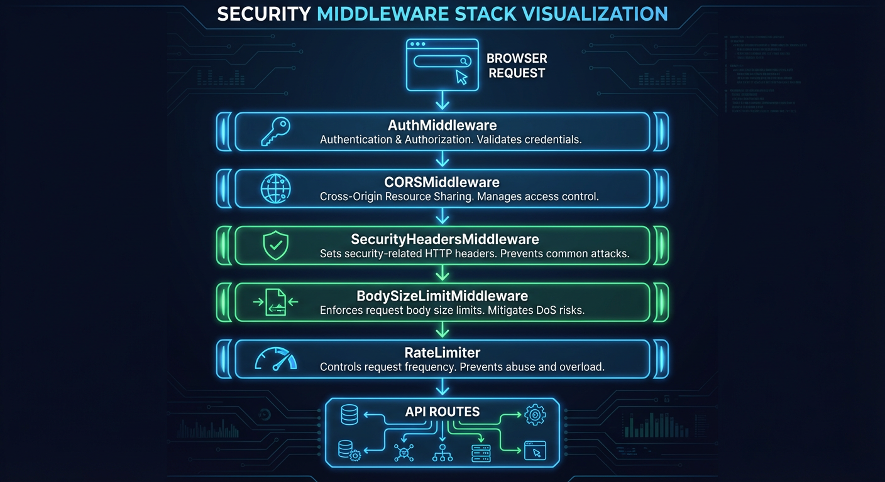
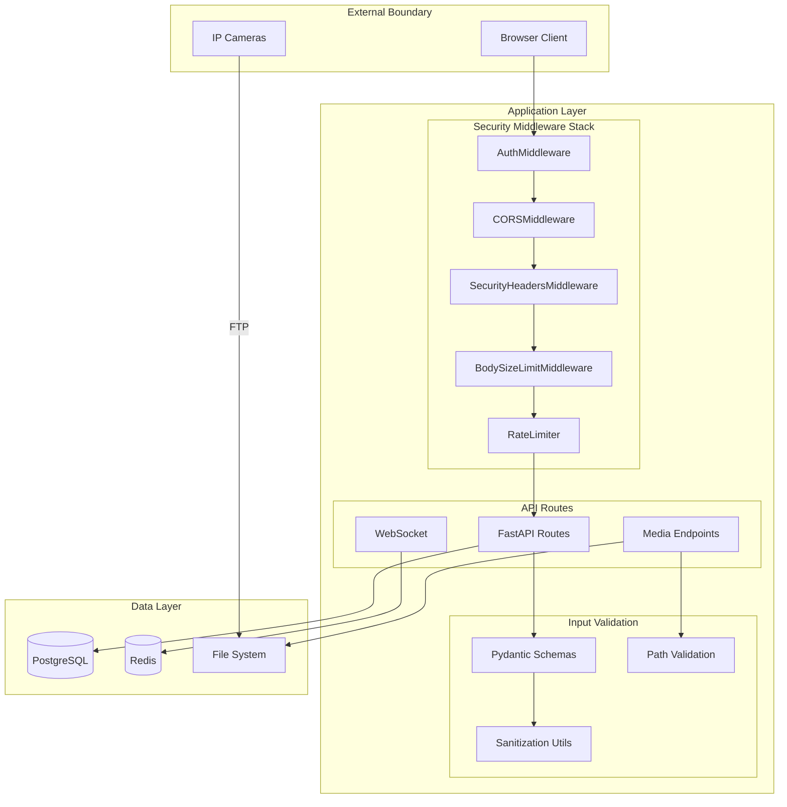
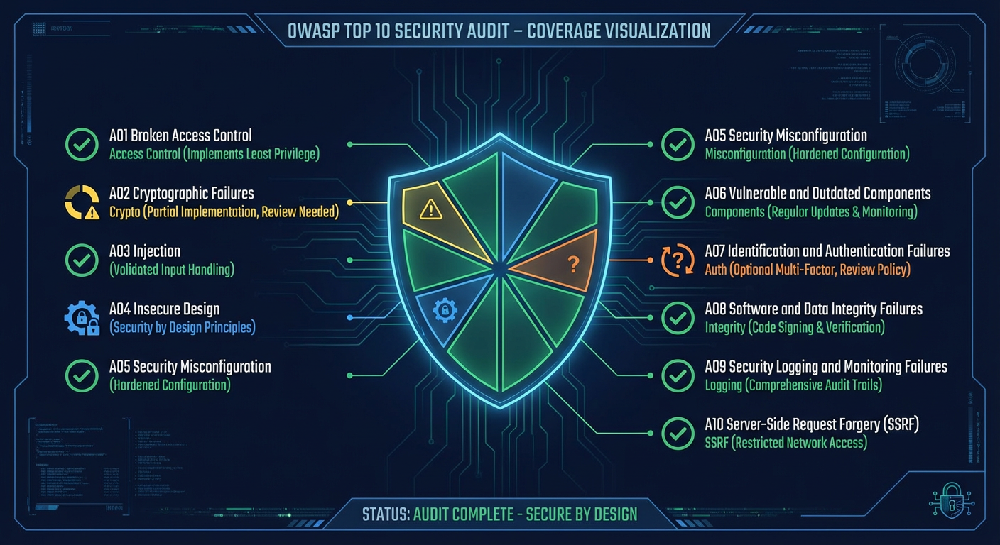

# Security Hub

> Security model, input validation, data protection, and hardening guidelines for the AI-powered home security monitoring system

## Overview

This hub documents the security considerations and implementations for the Home Security Intelligence system. The system is designed for **single-user, trusted network deployment** - it operates on a local network without exposure to the public internet.

While the system does not require authentication by default (configurable via `API_KEY_ENABLED`), it implements defense-in-depth security measures including input validation, secure HTTP headers, path traversal protection, and SSRF prevention.

**Key Assumptions:**

| Assumption               | Implication                                      |
| ------------------------ | ------------------------------------------------ |
| Single-user deployment   | No role-based access control                     |
| Trusted local network    | API key authentication is optional               |
| No internet exposure     | CORS allows local origins by default             |
| Camera data is sensitive | Path traversal protection on all media endpoints |

## Security Architecture

## Security Documents

| Document                                              | Description                                                 |
| ----------------------------------------------------- | ----------------------------------------------------------- |
| [Input Validation](./input-validation.md)             | Pydantic validation, SQL injection prevention, sanitization |
| [Data Protection](./data-protection.md)               | Sensitive data handling, image storage, log sanitization    |
| [Network Security](./network-security.md)             | CORS configuration, trusted network assumptions             |
| [Security Headers](./security-headers.md)             | HTTP security headers, CSP policy                           |
| [Authentication Roadmap](./authentication-roadmap.md) | Future authentication implementation considerations         |

## Security Controls Summary

### Current Implementation

| Control          | Implementation                            | File Reference                               |
| ---------------- | ----------------------------------------- | -------------------------------------------- |
| Input Validation | Pydantic schemas with field validators    | `backend/api/schemas/*.py`                   |
| SQL Injection    | SQLAlchemy ORM with parameterized queries | `backend/core/database.py`                   |
| Path Traversal   | Path validation on all media endpoints    | `backend/api/routes/media.py:42-124`         |
| XSS Prevention   | React automatic escaping + CSP headers    | `backend/api/middleware/security_headers.py` |
| SSRF Protection  | URL validation with IP range blocking     | `backend/core/url_validation.py`             |
| Rate Limiting    | Tiered rate limits per endpoint type      | `backend/api/middleware/rate_limit.py`       |
| Body Size Limits | 10MB request body limit                   | `backend/main.py:1145-1147`                  |
| Security Headers | Defense-in-depth HTTP headers             | `backend/api/middleware/security_headers.py` |

### Optional Security Features

| Feature                | Environment Variable        | Default |
| ---------------------- | --------------------------- | ------- |
| API Key Authentication | `API_KEY_ENABLED`           | `false` |
| HSTS Preload           | `HSTS_PRELOAD`              | `false` |
| TLS/HTTPS              | `TLS_ENABLED`               | `false` |
| Request Recording      | `REQUEST_RECORDING_ENABLED` | `false` |

## OWASP Top 10 Coverage

| OWASP Category                | Mitigation                                  | Status      |
| ----------------------------- | ------------------------------------------- | ----------- |
| A01 Broken Access Control     | Path traversal protection, media allowlists | Implemented |
| A02 Cryptographic Failures    | SHA-256 API key hashing, optional TLS       | Partial     |
| A03 Injection                 | Pydantic validation, SQLAlchemy ORM         | Implemented |
| A04 Insecure Design           | Single-user model, defense-in-depth         | By Design   |
| A05 Security Misconfiguration | Security headers, restrictive defaults      | Implemented |
| A06 Vulnerable Components     | Dependabot, pre-commit hooks                | Implemented |
| A07 Authentication Failures   | Optional API key auth                       | Optional    |
| A08 Integrity Failures        | Content-Type validation, CSP                | Implemented |
| A09 Logging Failures          | Structured logging with sanitization        | Implemented |
| A10 SSRF                      | URL validation, blocked IP ranges           | Implemented |

## Key Files

| File                                         | Purpose                        |
| -------------------------------------------- | ------------------------------ |
| `backend/main.py:1083-1162`                  | Middleware stack configuration |
| `backend/api/middleware/auth.py`             | API key authentication         |
| `backend/api/middleware/security_headers.py` | HTTP security headers          |
| `backend/core/sanitization.py`               | Input and error sanitization   |
| `backend/core/url_validation.py`             | SSRF protection                |
| `backend/api/schemas/camera.py`              | Camera input validation        |
| `backend/api/routes/media.py`                | Path traversal protection      |
| `backend/core/config.py`                     | Authentication settings        |

## Related Documentation

- [Middleware](../middleware/README.md) - Request processing pipeline
- [API Reference](../api-reference/README.md) - Endpoint documentation
- [System Overview](../system-overview/README.md) - Architecture context
- [Resilience Patterns](../resilience-patterns/README.md) - Circuit breakers, retry handling

---

_Last updated: 2026-01-24 - Initial security hub documentation for NEM-3464_
