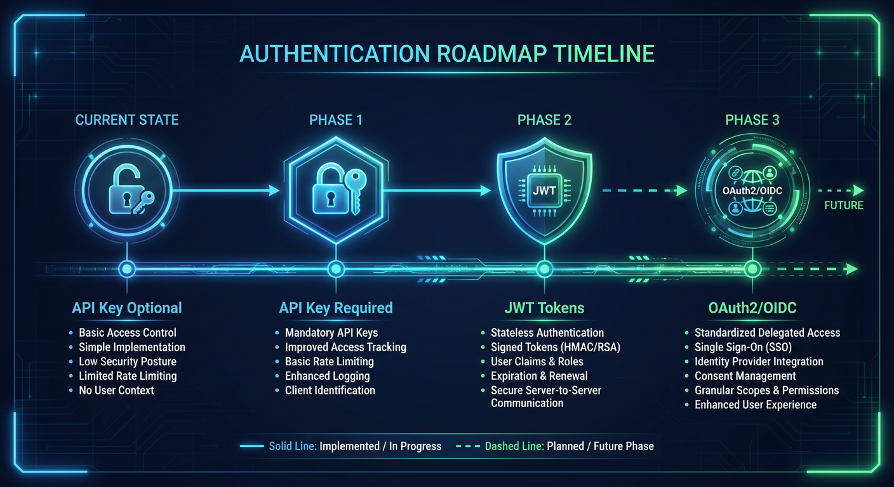
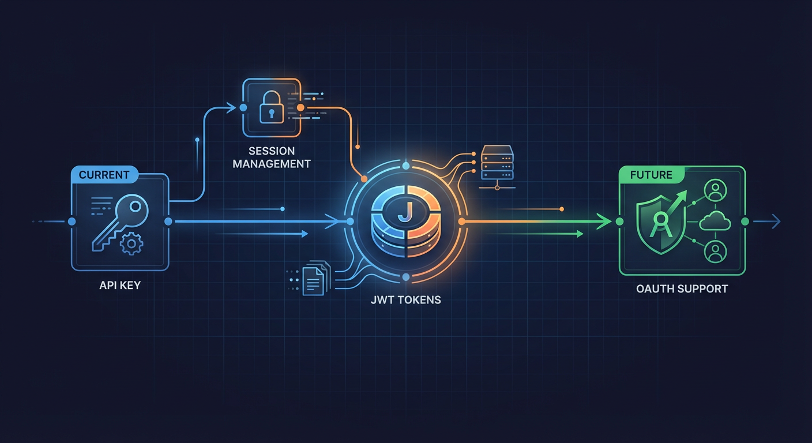
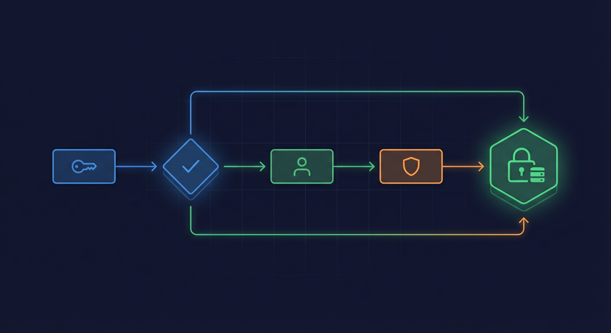
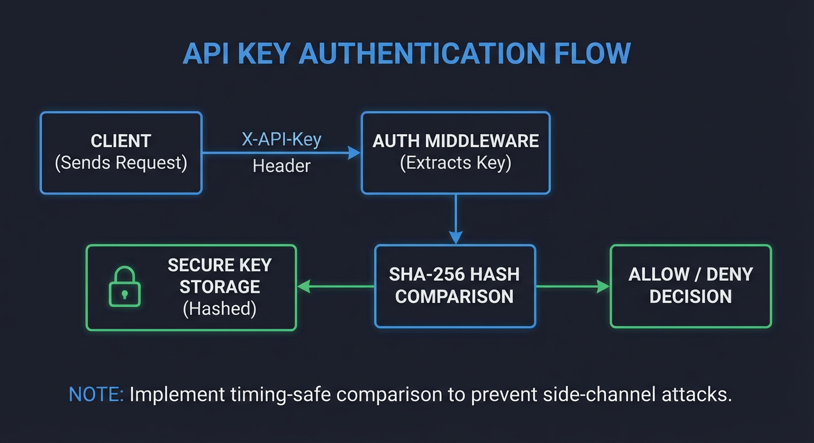
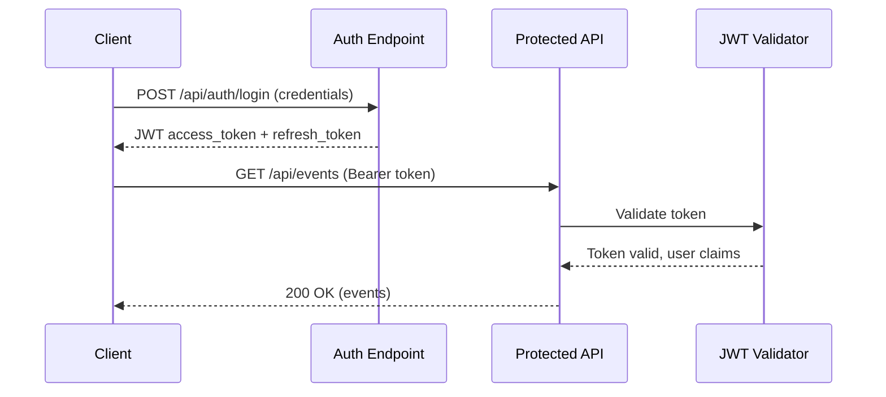
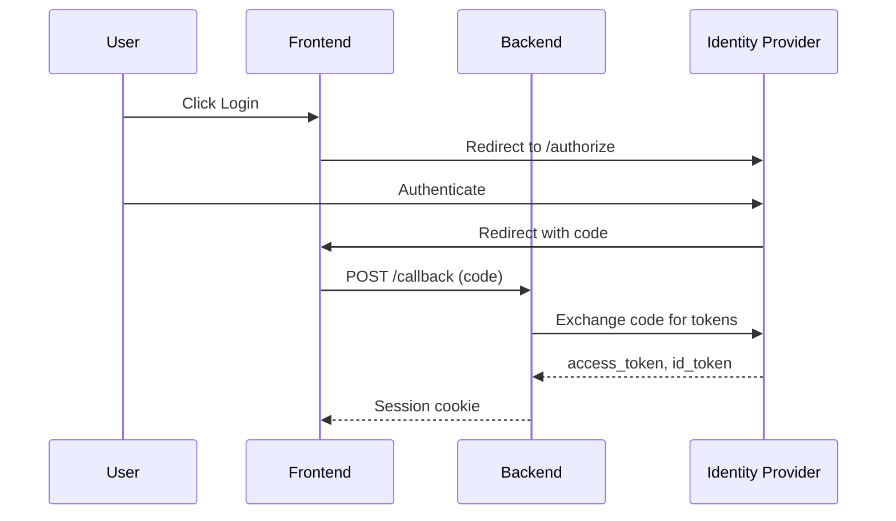

# Authentication Roadmap

> Future authentication implementation considerations for multi-user and remote access scenarios



## Key Files

- `backend/core/config.py:1090-1098` - Current API key authentication settings
- `backend/api/middleware/auth.py` - Current AuthMiddleware implementation
- `backend/api/middleware/websocket_auth.py` - WebSocket token validation

## Overview

The Home Security Intelligence system is currently designed for **single-user, trusted network deployment** and does not require authentication by default. However, optional API key authentication is available for environments where access control is desired.

This document outlines the current authentication state and provides a roadmap for future enhancements if multi-user or remote access requirements emerge.





## Current Authentication State



### API Key Authentication (Optional)

The system supports optional API key authentication:

```python
# From backend/core/config.py:1090-1098
api_key_enabled: bool = Field(
    default=False,
    description="Enable API key authentication (default: False for development)",
)
api_keys: list[str] = Field(
    default=[],
    description="List of valid API keys (plain text, hashed on startup)",
)
```

### Enabling API Key Authentication

```bash
# Enable authentication
export API_KEY_ENABLED=true

# Configure API keys (comma-separated or JSON array)
export API_KEYS='["your-secret-key-1","your-secret-key-2"]'
```

### API Key Middleware

When enabled, requests must include the API key:

```bash
# Via header (preferred)
curl -H "X-API-Key: your-secret-key" http://localhost:8000/api/events

# Via query parameter (fallback)
curl "http://localhost:8000/api/events?api_key=your-secret-key"
```

### Implementation Details

```python
# From backend/api/middleware/auth.py (conceptual)
class AuthMiddleware(BaseHTTPMiddleware):
    """API key authentication middleware."""

    def __init__(self, app, api_keys: list[str]):
        super().__init__(app)
        # Hash keys on initialization for secure comparison
        self.hashed_keys = {self._hash_key(k) for k in api_keys}

    async def dispatch(self, request: Request, call_next):
        # Skip auth for health check endpoint
        if request.url.path in ["/health", "/api/health"]:
            return await call_next(request)

        # Extract API key
        api_key = request.headers.get("X-API-Key") or request.query_params.get("api_key")

        if not api_key:
            return JSONResponse(
                status_code=401,
                content={"detail": "API key required"}
            )

        # Constant-time comparison
        if not self._verify_key(api_key):
            return JSONResponse(
                status_code=401,
                content={"detail": "Invalid API key"}
            )

        return await call_next(request)
```

## Why Authentication is Currently Optional

The system operates under these assumptions:

| Assumption           | Implication                              |
| -------------------- | ---------------------------------------- |
| Single user          | No need to distinguish between users     |
| Local network        | Network itself provides access control   |
| No internet exposure | No remote attackers                      |
| Physical security    | Users have physical access to the server |

**When to Enable Authentication:**

- Shared home network with multiple trusted users
- VPN access from outside the home
- Additional defense-in-depth layer desired

## Future Authentication Roadmap

### Phase 1: Enhanced API Key Management

**Priority:** Medium
**Complexity:** Low

Improvements to the existing API key system:

| Feature        | Description                                         |
| -------------- | --------------------------------------------------- |
| Key rotation   | Generate new keys without downtime                  |
| Key scopes     | Limit keys to specific endpoints (read-only, admin) |
| Key expiration | Automatic key expiration with renewal               |
| Audit logging  | Log key usage for security monitoring               |

**Implementation Considerations:**

```python
# Enhanced API key schema
api_keys:
  - key: "hashed-key-1"
    name: "Mobile App"
    scopes: ["read:events", "read:detections"]
    expires_at: "2025-12-31T00:00:00Z"
    created_at: "2025-01-01T00:00:00Z"
```

### Phase 2: JWT Token Authentication

**Priority:** Low
**Complexity:** Medium

Stateless authentication for multi-device scenarios:



**Token Structure:**

```json
{
  "sub": "user-id",
  "exp": 1735689600,
  "iat": 1735603200,
  "scope": ["read:events", "write:cameras"],
  "device_id": "mobile-app-1"
}
```

**Implementation Dependencies:**

- `python-jose` or `PyJWT` library
- Secure key management for signing
- Token revocation mechanism (Redis blacklist)

### Phase 3: OAuth2/OIDC Integration

**Priority:** Low
**Complexity:** High

Integration with external identity providers:

| Provider       | Use Case               |
| -------------- | ---------------------- |
| Home Assistant | Smart home integration |
| Google/GitHub  | Personal accounts      |
| Keycloak       | Self-hosted IdP        |

**OpenID Connect Flow:**



### Phase 4: Role-Based Access Control (RBAC)

**Priority:** Low
**Complexity:** Medium

For multi-user households:

| Role     | Permissions                        |
| -------- | ---------------------------------- |
| Admin    | Full access, user management       |
| Viewer   | Read-only access to events/cameras |
| Operator | Acknowledge alerts, manage cameras |

**Database Schema Extension:**

```sql
CREATE TABLE users (
    id UUID PRIMARY KEY,
    email VARCHAR(255) UNIQUE,
    password_hash VARCHAR(255),
    role VARCHAR(50),
    created_at TIMESTAMP
);

CREATE TABLE sessions (
    id UUID PRIMARY KEY,
    user_id UUID REFERENCES users(id),
    token_hash VARCHAR(255),
    expires_at TIMESTAMP
);
```

## WebSocket Authentication

### Current Implementation

WebSocket connections can validate tokens:

```python
# From backend/api/middleware/websocket_auth.py (conceptual)
async def validate_websocket_token(websocket: WebSocket) -> bool:
    """Validate token for WebSocket connection."""
    token = websocket.query_params.get("token")
    if not token:
        return False
    return await verify_token(token)
```

### Future Enhancement

Support JWT in WebSocket connections:

```javascript
// Client-side
const ws = new WebSocket(`ws://localhost:8000/ws?token=${jwt}`);

// Or via Sec-WebSocket-Protocol header
const ws = new WebSocket('ws://localhost:8000/ws', ['access_token', jwt]);
```

## Security Considerations

### Password Storage

If user authentication is implemented:

```python
# Use bcrypt or argon2 for password hashing
from passlib.context import CryptContext

pwd_context = CryptContext(schemes=["bcrypt"], deprecated="auto")

def hash_password(password: str) -> str:
    return pwd_context.hash(password)

def verify_password(password: str, hashed: str) -> bool:
    return pwd_context.verify(password, hashed)
```

### Session Management

| Security Control    | Implementation                          |
| ------------------- | --------------------------------------- |
| Session timeout     | 24 hours for web, 30 days for mobile    |
| Concurrent sessions | Limit to 5 active sessions              |
| Session revocation  | Logout invalidates all sessions         |
| Secure cookies      | `HttpOnly`, `Secure`, `SameSite=Strict` |

### Rate Limiting for Auth Endpoints

```python
# More aggressive limits for auth endpoints
auth_rate_limiter = RateLimiter(
    requests_per_minute=10,
    lockout_duration=300  # 5 minute lockout
)
```

## Migration Path

If authentication becomes required:

### 1. Enable API Key Authentication

```bash
# Minimal change - add API key requirement
export API_KEY_ENABLED=true
export API_KEYS='["your-generated-key"]'
```

### 2. Add User Database (Optional)

```sql
-- Migration: add users table
ALTER TABLE events ADD COLUMN user_id UUID;
```

### 3. Deploy Authentication Service (Optional)

For OAuth2/OIDC, deploy alongside existing services:

```yaml
# docker-compose.override.yml
services:
  keycloak:
    image: quay.io/keycloak/keycloak
    environment:
      KEYCLOAK_ADMIN: admin
      KEYCLOAK_ADMIN_PASSWORD: admin
    ports:
      - '8080:8080'
```

## Related Documentation

- [Network Security](./network-security.md) - CORS and network boundaries
- [Security Headers](./security-headers.md) - HTTP security headers
- [Data Protection](./data-protection.md) - Credential storage

---

_Last updated: 2026-01-24 - Authentication roadmap for NEM-3464_
