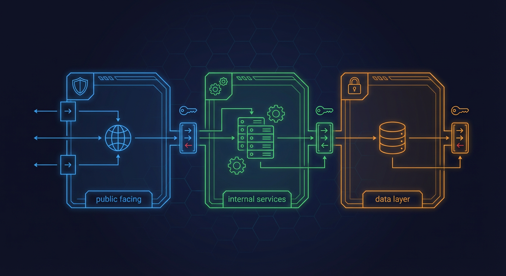
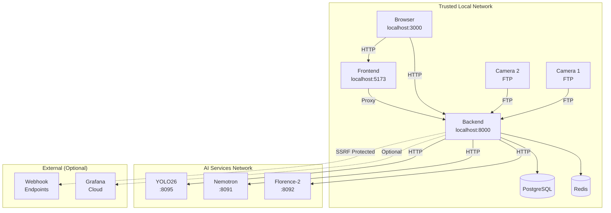
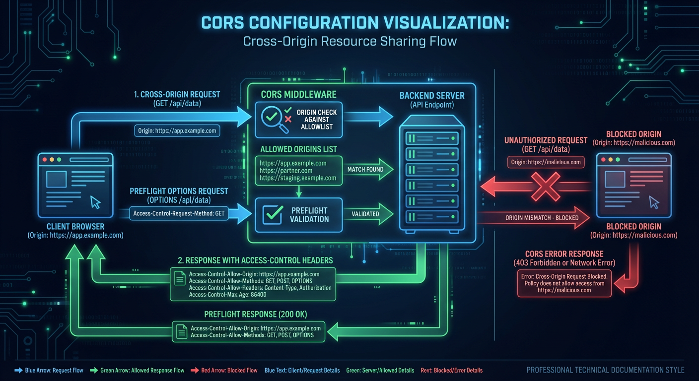
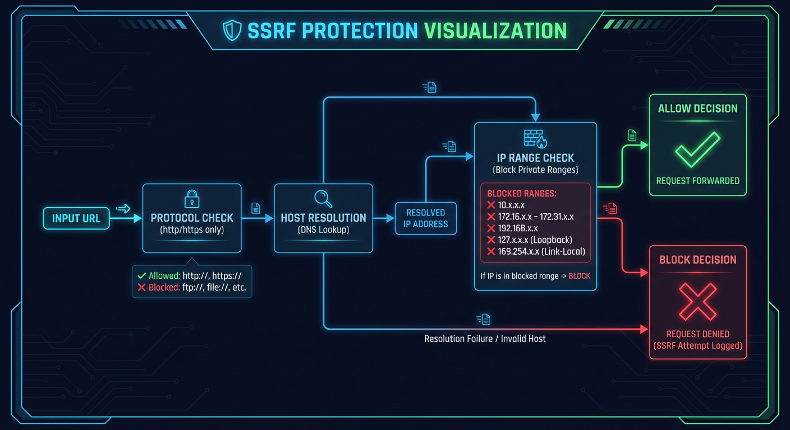

# Network Security

> CORS configuration, trusted network assumptions, and SSRF protection



## Key Files

- `backend/core/config.py:572-585` - CORS origins configuration
- `backend/main.py:1051-1056` - CORS middleware setup
- `backend/core/url_validation.py:1-450` - SSRF protection utilities
- `backend/core/sanitization.py:515-657` - URL validation for monitoring services
- `backend/api/middleware/rate_limit.py` - Rate limiting configuration

## Overview

The Home Security Intelligence system is designed for **trusted local network deployment**. It assumes:

1. The system runs on a private network without public internet exposure
2. All network clients are trusted (single-user deployment)
3. Cameras communicate via FTP on the local network
4. External webhook URLs require SSRF validation

This document covers CORS configuration, network boundary assumptions, and protections against Server-Side Request Forgery (SSRF).

## Network Architecture



## CORS Configuration



### Default Origins

CORS is configured to allow common local development origins:

```python
# From backend/core/config.py:572-585
cors_origins: list[str] = Field(
    default=[
        "http://localhost:3000",
        "http://localhost:5173",
        "http://127.0.0.1:3000",
        "http://127.0.0.1:5173",
        "http://0.0.0.0:3000",
        "http://0.0.0.0:5173",
    ],
    description="Allowed CORS origins. Set CORS_ORIGINS env var to override.",
)
```

### CORS Middleware Configuration

The FastAPI CORS middleware is configured with sensible defaults:

```python
# From backend/main.py:1051-1056
app.add_middleware(
    CORSMiddleware,
    allow_origins=settings.cors_origins,
    allow_credentials=True,
    allow_methods=["*"],
    allow_headers=["*"],
)
```

**Configuration Options:**

| Setting             | Value             | Rationale                              |
| ------------------- | ----------------- | -------------------------------------- |
| `allow_origins`     | Configurable list | Restrict to known frontends            |
| `allow_credentials` | `True`            | Support API key cookies                |
| `allow_methods`     | `["*"]`           | All HTTP methods allowed               |
| `allow_headers`     | `["*"]`           | Accept custom headers (API keys, etc.) |

### Custom CORS Configuration

For production deployments, override via environment variable:

```bash
# Single origin
export CORS_ORIGINS='["http://your-frontend.local:3000"]'

# Multiple origins
export CORS_ORIGINS='["http://192.168.1.100:3000","http://dashboard.local:3000"]'
```

## SSRF Protection



### Overview

Server-Side Request Forgery (SSRF) protection is implemented for any feature that makes outbound HTTP requests, such as:

- Webhook notifications
- External monitoring integrations
- AI service connections (allow internal by default)

### URL Validation

The `validate_webhook_url()` function performs comprehensive SSRF validation:

```python
# From backend/core/url_validation.py:304-388
def validate_webhook_url(
    url: str,
    *,
    allow_dev_http: bool = False,
    resolve_dns: bool = True,
) -> str:
    """Validate a webhook URL for SSRF protection.

    This function performs comprehensive validation:
    1. Validates URL structure and scheme
    2. Blocks private/reserved IP ranges
    3. Blocks cloud metadata endpoints
    4. Blocks .local and other internal domain suffixes
    5. Optionally resolves DNS and checks resolved IPs
    6. Logs all blocked SSRF attempts
    """
```

### Blocked IP Ranges

Private and reserved IP ranges are blocked:

```python
# From backend/core/url_validation.py:48-72
BLOCKED_IP_NETWORKS = [
    # IPv4 Private Networks (RFC 1918)
    ipaddress.ip_network("10.0.0.0/8"),
    ipaddress.ip_network("172.16.0.0/12"),
    ipaddress.ip_network("192.168.0.0/16"),
    # Loopback (RFC 990)
    ipaddress.ip_network("127.0.0.0/8"),
    # Link-Local (RFC 3927) - cloud metadata
    ipaddress.ip_network("169.254.0.0/16"),
    # Carrier-Grade NAT (RFC 6598)
    ipaddress.ip_network("100.64.0.0/10"),
    # IPv6 Loopback
    ipaddress.ip_network("::1/128"),
    # IPv6 Link-Local
    ipaddress.ip_network("fe80::/10"),
    # IPv6 Unique Local
    ipaddress.ip_network("fc00::/7"),
]
```

### Cloud Metadata Endpoint Protection

Cloud metadata endpoints are explicitly blocked:

```python
# From backend/core/url_validation.py:75-84
BLOCKED_IPS = {
    # AWS/GCP/Azure metadata service
    "169.254.169.254",
    # AWS ECS metadata
    "169.254.170.2",
    # Azure Instance Metadata Service
    "169.254.169.253",
    # GCP metadata (alias)
    "metadata.google.internal",
}
```

### Blocked Domain Suffixes

Internal domain suffixes are blocked:

```python
# From backend/core/url_validation.py:94-105
BLOCKED_DOMAIN_SUFFIXES = {
    ".local",       # mDNS/Bonjour local network domains
    ".localhost",   # RFC 6761 localhost TLD
    ".internal",    # Common internal domain suffix
    ".lan",         # Common LAN suffix
    ".home",        # Home network suffix
    ".localdomain", # Standard local domain
    ".intranet",    # Intranet suffix
    ".corp",        # Corporate internal domain
    ".home.arpa",   # RFC 8375 home network domain
}
```

### SSRF Attempt Logging

All blocked SSRF attempts are logged for security monitoring:

```python
# From backend/core/url_validation.py:176-194
def _log_blocked_ssrf_attempt(url: str, reason: str, hostname: str | None = None) -> None:
    """Log a blocked SSRF attempt for security monitoring."""
    # Truncate URL to avoid log injection
    safe_url = url[:200] if len(url) > 200 else url
    # Sanitize to remove control characters
    safe_url = "".join(c if c.isprintable() else "?" for c in safe_url)

    logger.warning(
        "SSRF attempt blocked: reason=%s, hostname=%s, url=%s",
        reason,
        hostname[:100] if hostname and len(hostname) > 100 else hostname,
        safe_url,
    )
```

### Monitoring URL Validation

Grafana and monitoring URLs have relaxed validation (allowing internal IPs):

```python
# From backend/core/sanitization.py:554-658
def validate_monitoring_url(
    url: str,
    *,
    allow_internal: bool = True,
    require_https: bool = False,
) -> str:
    """Validate a monitoring service URL (like Grafana).

    This validates that the URL:
    1. Is a well-formed HTTP/HTTPS URL
    2. Does not point to dangerous cloud metadata endpoints
    3. Optionally allows internal/private IPs (for local deployments)
    """
```

## Rate Limiting

### Tiered Rate Limits

Rate limits are applied based on endpoint type:

```python
# From backend/api/middleware/rate_limit.py
class RateLimitTier(StrEnum):
    DEFAULT = "default"      # 100 requests/minute
    SEARCH = "search"        # 30 requests/minute
    MEDIA = "media"          # 60 requests/minute
    ADMIN = "admin"          # 10 requests/minute
```

### Implementation

Rate limiting is applied via middleware:

```python
# Usage in routes
from backend.api.middleware import RateLimiter, RateLimitTier

media_rate_limiter = RateLimiter(tier=RateLimitTier.MEDIA)

@router.get("/cameras/{camera_id}/{filename:path}")
async def serve_camera_file(
    camera_id: str,
    filename: str,
    _rate_limit: None = Depends(media_rate_limiter)
) -> FileResponse:
    ...
```

## WebSocket Security

### WebSocket Authentication

WebSocket connections can require API key authentication:

```python
# From backend/api/middleware/__init__.py
from .websocket_auth import validate_websocket_token
from .auth import authenticate_websocket, validate_websocket_api_key
```

### WebSocket Rate Limiting

```python
# From backend/api/middleware/__init__.py
from .rate_limit import check_websocket_rate_limit
```

## AI Service Communication

### Internal Service URLs

AI services use internal Docker network URLs:

```python
# From backend/core/config.py:655-664
yolo26_url: str = Field(
    default="http://localhost:8095",
    description="YOLO26 detection service URL. Docker: http://ai-yolo26:8095",
)
nemotron_url: str = Field(
    default="http://localhost:8091",
    description="Nemotron reasoning service URL. Docker: http://ai-llm:8091",
)
```

### Optional API Key Authentication for AI Services

AI services can require API key authentication:

```python
# From backend/core/config.py:667-675
yolo26_api_key: str | None = Field(
    default=None,
    description="API key for YOLO26 service authentication (X-API-Key header)",
)
nemotron_api_key: str | None = Field(
    default=None,
    description="API key for Nemotron service authentication (X-API-Key header)",
)
```

## Network Isolation Recommendations

### Docker Network Segmentation

```yaml
# Recommended docker-compose.yml network structure
networks:
  frontend:
    # Browser access
  backend:
    # API and database
  ai-services:
    # AI inference (GPU access)
```

### Firewall Recommendations

For production deployments:

| Port      | Service     | Access        |
| --------- | ----------- | ------------- |
| 3000      | Frontend    | Local network |
| 8000      | Backend API | Local network |
| 5432      | PostgreSQL  | Backend only  |
| 6379      | Redis       | Backend only  |
| 8090-8094 | AI Services | Backend only  |

## Related Documentation

- [Security Headers](./security-headers.md) - HTTP security headers
- [Authentication Roadmap](./authentication-roadmap.md) - Future auth plans
- [Middleware](../middleware/README.md) - Request processing pipeline

---

_Last updated: 2026-01-24 - Network security documentation for NEM-3464_
