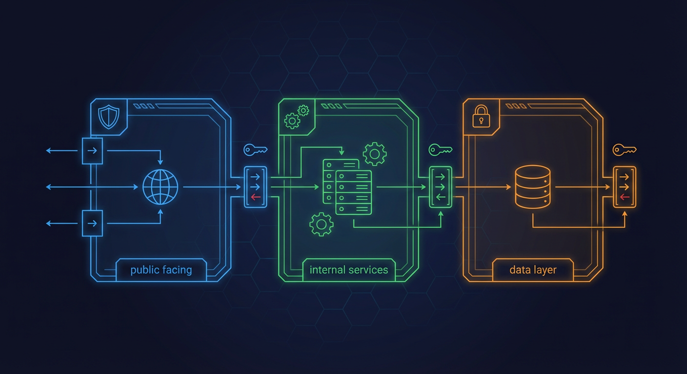
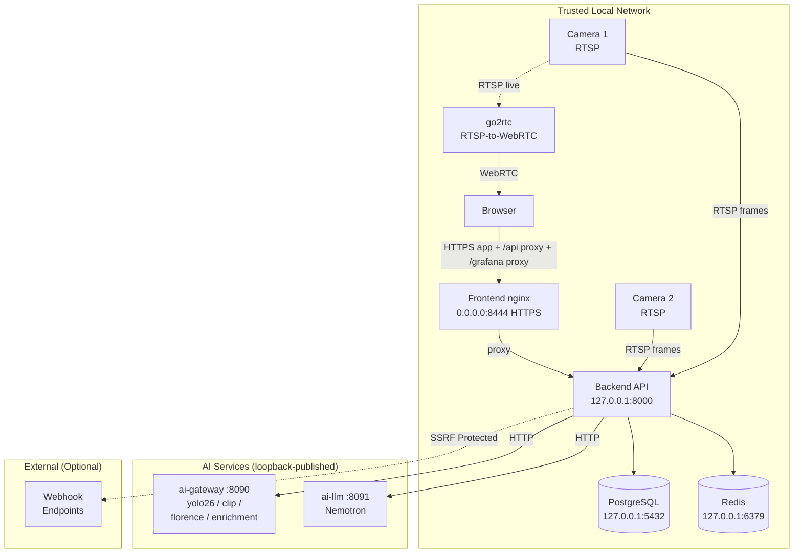
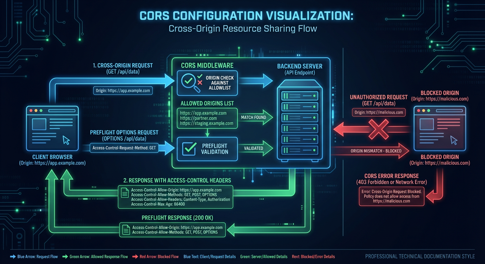
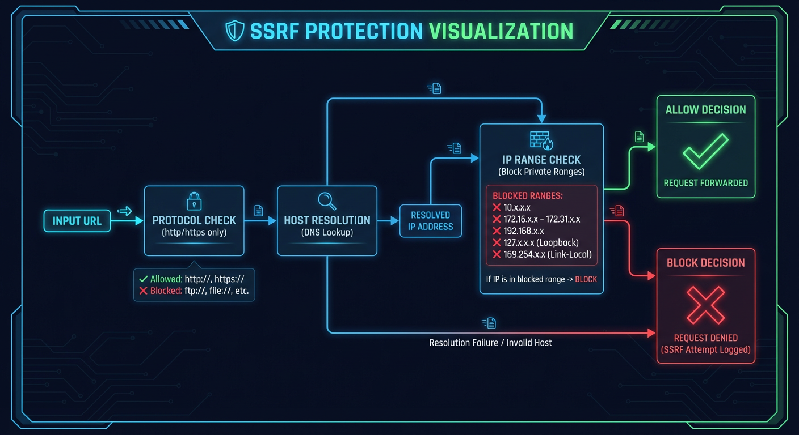

# Network Security

> CORS configuration, trusted network assumptions, and SSRF protection



## Key Files

- `backend/core/config.py:884-894` - CORS origins configuration
- `backend/main.py:1398-1418` - CORS middleware setup
- `backend/core/url_validation.py` (450 lines) - SSRF protection utilities
- `backend/core/sanitization.py:554-657` - URL validation for monitoring services
- `backend/api/middleware/rate_limit.py` - Rate limiting configuration

## Overview

The Home Security Intelligence system is designed for **trusted local network deployment**. It assumes:

1. The system runs on a private network without public internet exposure
2. All network clients are trusted (single-user deployment)
3. Cameras deliver frames over RTSP on the local network (served to browsers through go2rtc)
4. External webhook URLs require SSRF validation

This document covers CORS configuration, network boundary assumptions, and protections against Server-Side Request Forgery (SSRF).

## Network Architecture


```mermaid
flowchart TB
    subgraph TrustedNetwork["Trusted Local Network"]
        CAM1[Camera 1<br/>RTSP]
        CAM2[Camera 2<br/>RTSP]
        BROWSER[Browser]
        FRONTEND[Frontend nginx<br/>0.0.0.0:8444 HTTPS]
        BACKEND[Backend API<br/>127.0.0.1:8000]
        GO2RTC[go2rtc<br/>RTSP-to-WebRTC]
        DB[(PostgreSQL<br/>127.0.0.1:5432)]
        REDIS[(Redis<br/>127.0.0.1:6379)]
    end

    subgraph AIServices["AI Services (loopback-published)"]
        GATEWAY[ai-gateway :8090<br/>yolo26 / clip /<br/>florence / enrichment]
        LLM[ai-llm :8091<br/>Nemotron]
    end

    subgraph External["External (Optional)"]
        WEBHOOK[Webhook<br/>Endpoints]
    end

    CAM1 -->|RTSP frames| BACKEND
    CAM2 -->|RTSP frames| BACKEND
    CAM1 -.->|RTSP live| GO2RTC
    GO2RTC -.->|WebRTC| BROWSER
    BROWSER -->|HTTPS app + /api proxy + /grafana proxy| FRONTEND
    FRONTEND -->|proxy| BACKEND
    BACKEND --> DB
    BACKEND --> REDIS
    BACKEND -->|HTTP| GATEWAY
    BACKEND -->|HTTP| LLM
    BACKEND -.->|SSRF Protected| WEBHOOK
```

Every service except the frontend nginx binds `127.0.0.1` on the host
(`docker-compose.prod.yml` port mappings); the compose network is a single
`security-net` bridge. In the deployed stack nginx proxies `/api` on the same
origin (port 8444), so CORS only engages for direct dev-server access. The
loopback binding is the primary security boundary (see the auth model in the
project AGENTS.md).

## CORS Configuration



### Default Origins

CORS is configured to allow common local development origins:

```python
# From backend/core/config.py:884-894
cors_origins: list[str] = Field(
    default=[
        # HTTPS origins for external browser access
        "https://localhost:8444",
        "https://127.0.0.1:8444",
        "https://0.0.0.0:8444",
        # Internal container communication (HTTP within Docker network)
        "http://frontend:8080",
    ],
    description="Allowed CORS origins. Set CORS_ORIGINS env var to override for your network.",
)
```

### CORS Middleware Configuration

The FastAPI CORS middleware is configured with security-conscious defaults:

```python
# From backend/main.py:1398-1418
# Note: When allow_credentials=True, allow_origins cannot be ["*"]
# If "*" is in origins, we disable credentials to allow any origin
_cors_origins = get_settings().cors_origins
_allow_credentials = "*" not in _cors_origins
# Explicit list of allowed headers for cross-origin requests (NEM-5059)
_cors_allowed_headers = ["Content-Type", "Authorization", "X-Request-ID", "X-API-Key"]
app.add_middleware(
    CORSMiddleware,
    allow_origins=_cors_origins,
    allow_credentials=_allow_credentials,
    allow_methods=["GET", "POST", "PUT", "PATCH", "DELETE", "OPTIONS"],
    allow_headers=_cors_allowed_headers,
)
```

**Configuration Options:**

| Setting             | Value                                                            | Rationale                                                                       |
| ------------------- | ---------------------------------------------------------------- | ------------------------------------------------------------------------------- |
| `allow_origins`     | Configurable list                                                | Restrict to known frontends                                                     |
| `allow_credentials` | `True` (unless origins contain `*`)                              | Support API key cookies; disabled if wildcard origin                            |
| `allow_methods`     | `["GET", "POST", "PUT", "PATCH", "DELETE", "OPTIONS"]`           | Explicit methods (least-privilege principle)                                    |
| `allow_headers`     | `["Content-Type", "Authorization", "X-Request-ID", "X-API-Key"]` | Explicit allowlist (NEM-5059) — arbitrary headers are not accepted cross-origin |

### Custom CORS Configuration

For production deployments, override via environment variable:

```bash
# Single origin
export CORS_ORIGINS='["https://security.example.com"]'

# Multiple origins
export CORS_ORIGINS='["https://security.example.com","https://admin.example.com"]'
```

See [CORS Configuration](../middleware/cors-configuration.md) for the full walkthrough
(preflight behaviour, credentials handling, and troubleshooting).

## SSRF Protection



### Overview

Server-Side Request Forgery (SSRF) protection is implemented for any feature that makes outbound HTTP requests, such as:

- Webhook notifications
- External monitoring integrations
- AI service connections (allow internal by default)

### URL Validation

The `validate_webhook_url()` function performs comprehensive SSRF validation:

```python
# From backend/core/url_validation.py:304-388
def validate_webhook_url(
    url: str,
    *,
    allow_dev_http: bool = False,
    resolve_dns: bool = True,
) -> str:
    """Validate a webhook URL for SSRF protection.

    This function performs comprehensive validation:
    1. Validates URL structure and scheme
    2. Blocks private/reserved IP ranges
    3. Blocks cloud metadata endpoints
    4. Blocks .local and other internal domain suffixes
    5. Optionally resolves DNS and checks resolved IPs
    6. Logs all blocked SSRF attempts
    """
```

### Blocked IP Ranges

Private and reserved IP ranges are blocked:

```python
# From backend/core/url_validation.py:48-72
BLOCKED_IP_NETWORKS = [
    # IPv4 Private Networks (RFC 1918)
    ipaddress.ip_network("10.0.0.0/8"),
    ipaddress.ip_network("172.16.0.0/12"),
    ipaddress.ip_network("192.168.0.0/16"),
    # Loopback (RFC 990)
    ipaddress.ip_network("127.0.0.0/8"),
    # Link-Local (RFC 3927) - cloud metadata
    ipaddress.ip_network("169.254.0.0/16"),
    # Carrier-Grade NAT (RFC 6598)
    ipaddress.ip_network("100.64.0.0/10"),
    # IPv6 Loopback
    ipaddress.ip_network("::1/128"),
    # IPv6 Link-Local
    ipaddress.ip_network("fe80::/10"),
    # IPv6 Unique Local
    ipaddress.ip_network("fc00::/7"),
]
```

### Cloud Metadata Endpoint Protection

Cloud metadata endpoints are explicitly blocked:

```python
# From backend/core/url_validation.py:75-84
BLOCKED_IPS = {
    # AWS/GCP/Azure metadata service
    "169.254.169.254",
    # AWS ECS metadata
    "169.254.170.2",
    # Azure Instance Metadata Service
    "169.254.169.253",
    # GCP metadata (alias)
    "metadata.google.internal",
}
```

### Blocked Domain Suffixes

Internal domain suffixes are blocked:

```python
# From backend/core/url_validation.py:94-105
BLOCKED_DOMAIN_SUFFIXES = {
    ".local",       # mDNS/Bonjour local network domains
    ".localhost",   # RFC 6761 localhost TLD
    ".internal",    # Common internal domain suffix
    ".lan",         # Common LAN suffix
    ".home",        # Home network suffix
    ".localdomain", # Standard local domain
    ".intranet",    # Intranet suffix
    ".corp",        # Corporate internal domain
    ".home.arpa",   # RFC 8375 home network domain
}
```

### SSRF Attempt Logging

All blocked SSRF attempts are logged for security monitoring:

```python
# From backend/core/url_validation.py:176-194
def _log_blocked_ssrf_attempt(url: str, reason: str, hostname: str | None = None) -> None:
    """Log a blocked SSRF attempt for security monitoring."""
    # Truncate URL to avoid log injection
    safe_url = url[:200] if len(url) > 200 else url
    # Sanitize to remove control characters
    safe_url = "".join(c if c.isprintable() else "?" for c in safe_url)

    logger.warning(
        "SSRF attempt blocked: reason=%s, hostname=%s, url=%s",
        reason,
        hostname[:100] if hostname and len(hostname) > 100 else hostname,
        safe_url,
    )
```

### Monitoring URL Validation

Grafana and monitoring URLs have relaxed validation (allowing internal IPs):

```python
# From backend/core/sanitization.py:554-658
def validate_monitoring_url(
    url: str,
    *,
    allow_internal: bool = True,
    require_https: bool = False,
) -> str:
    """Validate a monitoring service URL (like Grafana).

    This validates that the URL:
    1. Is a well-formed HTTP/HTTPS URL
    2. Does not point to dangerous cloud metadata endpoints
    3. Optionally allows internal/private IPs (for local deployments)
    """
```

## Rate Limiting

### Tiered Rate Limits

Rate limits are applied based on endpoint type:

```python
# From backend/api/middleware/rate_limit.py:283-291
class RateLimitTier(str, Enum):
    DEFAULT = "default"          # rate_limit_requests_per_minute (default 60)
    MEDIA = "media"              # rate_limit_media_requests_per_minute (default 120)
    WEBSOCKET = "websocket"      # rate_limit_websocket_connections_per_minute (default 100)
    SEARCH = "search"            # rate_limit_search_requests_per_minute (default 30)
    EXPORT = "export"            # rate_limit_export_requests_per_minute (default 10, no burst)
    AI_INFERENCE = "ai_inference"  # default 10/min (burst 0..configured)
    BULK = "bulk"                # default 10/min
```

Each tier's limit comes from a `rate_limit_*` setting in
`backend/core/config.py:2122-2181` (`get_tier_limits()` maps tier →
`(requests_per_minute, burst_allowance)`; the generic burst default is 10, the
export tier has no burst allowance).

Client identification uses `get_client_ip()` (`rate_limit.py`), which honours
`X-Forwarded-For` only when the direct client is a trusted proxy — otherwise a
spoofed header would bypass rate limits.

### Implementation

Rate limiting is applied as a route dependency:

```python
# Usage in routes (e.g. backend/api/routes/media.py:11-22)
from backend.api.middleware import RateLimiter, RateLimitTier

media_rate_limiter = RateLimiter(tier=RateLimitTier.MEDIA)

@router.get("/cameras/{camera_id}/{filename:path}")  # router prefix "/api/media"
async def serve_camera_file(
    camera_id: str,
    filename: str,
    _rate_limit: None = Depends(media_rate_limiter),
): ...
```

## WebSocket Security

### WebSocket Authentication

WebSocket connections can require API key authentication:

```python
# From backend/api/middleware/__init__.py
from .websocket_auth import validate_websocket_token
from .auth import authenticate_websocket, validate_websocket_api_key
```

### WebSocket Rate Limiting

```python
# From backend/api/middleware/__init__.py
from .rate_limit import check_websocket_rate_limit
```

## AI Service Communication

### Internal Service URLs

AI services use internal Docker network URLs:

```python
# From backend/core/config.py:1023-1033
yolo26_url: str = Field(
    default="http://ai-gateway:8090/yolo26",
    description="URL of the YOLO26 detection service",
)
nemotron_url: str = Field(
    default="http://localhost:8091",
    description="Nemotron reasoning service URL (llama.cpp server). Development: http://localhost:8091, Docker: http://ai-llm:8091",
)
```

Since the gateway consolidation, detection, CLIP, Florence and the enrichment
models all run inside the single `ai-gateway` service on port 8090 under
path prefixes (`/yolo26`, `/clip`, `/florence`, `/enrichment`, `/enrich-lt`);
only Nemotron stays on its own `ai-llm` container (port 8091). The
`ai_gateway_url` / `use_ai_gateway` settings (`config.py:1309-1319`) route all
AI clients through the gateway — both are enabled in the deployed stack
(`docker-compose.prod.yml:456-457`, `.env.example:200-201`).

### Optional API Key Authentication for AI Services

AI services can require API key authentication:

```python
# From backend/core/config.py:1036-1043
yolo26_api_key: SecretStr | None = Field(
    default=None,
    description="Optional API key for YOLO26 service authentication",
)
nemotron_api_key: SecretStr | None = Field(
    default=None,
    description="API key for Nemotron service authentication (optional, sent via X-API-Key header)",
)
```

## Network Isolation Recommendations

### Docker Network Segmentation

The shipped `docker-compose.prod.yml` puts every service on a single bridge
network, `security-net` (`docker-compose.prod.yml:1388-1389`). Isolation comes
from host port bindings instead of network splits:

| Exposure                                                      | Services                                                                                                                                                                                           |
| ------------------------------------------------------------- | -------------------------------------------------------------------------------------------------------------------------------------------------------------------------------------------------- |
| Published to the LAN (`0.0.0.0:${FRONTEND_HTTPS_PORT:-8444}`) | Frontend nginx (app, `/api` proxy, `/grafana` proxy)                                                                                                                                               |
| Published on loopback only (`127.0.0.1:...`)                  | Backend 8000 (`API_PORT`), ai-gateway 8090 (`AI_GATEWAY_PORT`), ai-llm 8091 (`LLM_PORT`), PostgreSQL 5432, Redis 6379, go2rtc 1984, Prometheus 9090, Alertmanager 9093, Grafana 3002, and the rest |
| Not published at all                                          | Containers reachable only over `security-net` service names (e.g. `http://backend:8000`, `http://ai-gateway:8090`)                                                                                 |

### Firewall Recommendations

With the default compose configuration the only host port open to the network
is the frontend's HTTPS port (8444). Everything else stays on loopback or
inside `security-net`, so no additional firewall rules are required for the
default deployment. If you re-publish any port beyond the frontend, keep it
loopback-bound or restrict it to your LAN, and never expose PostgreSQL, Redis,
or the AI service ports directly.

## Related Documentation

- [Security Headers](./security-headers.md) - HTTP security headers
- [Authentication Roadmap](./authentication-roadmap.md) - Future auth plans
- [Middleware](../middleware/README.md) - Request processing pipeline

---

_Last updated: 2026-01-24 - Network security documentation for NEM-3464_
