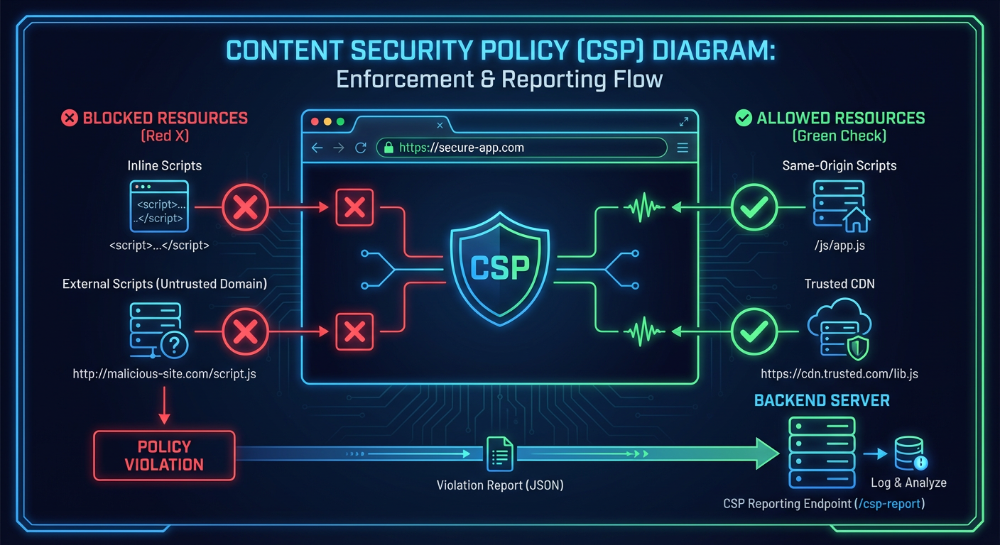
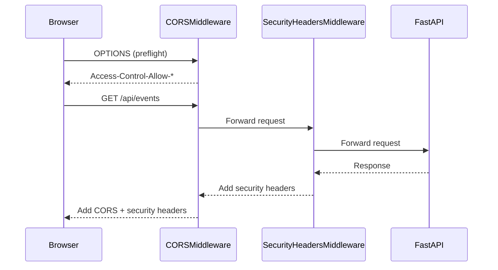

# Security Headers

> HTTP security headers, Content Security Policy, and defense-in-depth configuration


## Key Files

- `backend/api/middleware/security_headers.py` - Security headers middleware implementation
- `backend/main.py:1014-1015` - Security headers middleware registration
- `frontend/vite.config.ts` - Frontend CSP configuration (development)
- `frontend/nginx.conf` - Frontend CSP configuration (production)

## Overview

The Home Security Intelligence system implements HTTP security headers as a defense-in-depth measure. These headers protect against common web vulnerabilities including:

- Cross-Site Scripting (XSS)
- Clickjacking
- Content-Type sniffing
- Cross-origin information leakage

Security headers are applied by the `SecurityHeadersMiddleware` on all HTTP responses.

## Security Headers Middleware

### Implementation

The security headers middleware adds defensive headers to all responses:

```python
# From backend/api/middleware/security_headers.py (conceptual)
class SecurityHeadersMiddleware:
    """Middleware to add security headers to all responses."""

    async def dispatch(self, request: Request, call_next):
        response = await call_next(request)

        # Add security headers
        response.headers["X-Content-Type-Options"] = "nosniff"
        response.headers["X-Frame-Options"] = "DENY"
        response.headers["X-XSS-Protection"] = "1; mode=block"
        response.headers["Referrer-Policy"] = "strict-origin-when-cross-origin"
        response.headers["Content-Security-Policy"] = self.csp_policy

        if self.hsts_enabled:
            response.headers["Strict-Transport-Security"] = self.hsts_header

        return response
```

### Registration

The middleware is registered in the application startup:

```python
# From backend/main.py:1014-1015
# Security headers middleware for defense-in-depth (NEM-1615)
app.add_middleware(SecurityHeadersMiddleware)
```

## Header Reference

### X-Content-Type-Options

Prevents MIME-type sniffing attacks:

```
X-Content-Type-Options: nosniff
```

**Purpose:** Prevents browsers from interpreting files as a different MIME type than declared, mitigating drive-by download attacks.

**OWASP Reference:** [OWASP HTTP Headers Cheat Sheet](https://cheatsheetseries.owasp.org/cheatsheets/HTTP_Headers_Cheat_Sheet.html)

### X-Frame-Options

Prevents clickjacking attacks:

```
X-Frame-Options: DENY
```

**Purpose:** Prevents the page from being embedded in iframes, protecting against clickjacking.

**Values:**

| Value        | Description                       |
| ------------ | --------------------------------- |
| `DENY`       | Never allow framing (most secure) |
| `SAMEORIGIN` | Allow framing from same origin    |

### X-XSS-Protection

Enables browser XSS filtering (legacy browsers):

```
X-XSS-Protection: 1; mode=block
```

**Purpose:** Enables the browser's built-in XSS filter. Note: Modern browsers have deprecated this in favor of CSP.

**Note:** This header is considered deprecated but included for compatibility with older browsers.

### Referrer-Policy

Controls information sent in the Referer header:

```
Referrer-Policy: strict-origin-when-cross-origin
```

**Purpose:** Limits the information sent in the Referer header to prevent information leakage.

**Values:**

| Value                             | Behavior                                               |
| --------------------------------- | ------------------------------------------------------ |
| `no-referrer`                     | Never send Referer                                     |
| `strict-origin-when-cross-origin` | Full URL for same-origin, origin only for cross-origin |
| `same-origin`                     | Only send for same-origin requests                     |

### Strict-Transport-Security (HSTS)

Enforces HTTPS connections (when enabled):

```
Strict-Transport-Security: max-age=31536000; includeSubDomains
```

**Purpose:** Instructs browsers to only connect via HTTPS for the specified duration.

**Configuration:**

| Parameter           | Default           | Description                 |
| ------------------- | ----------------- | --------------------------- |
| `max-age`           | 31536000 (1 year) | Cache duration in seconds   |
| `includeSubDomains` | Enabled           | Apply to all subdomains     |
| `preload`           | Disabled          | Enable browser preload list |

**Enabling HSTS:**

```bash
# Via environment variable
export HSTS_PRELOAD=true
```

## Content Security Policy (CSP)



### Backend CSP Policy

The backend sets a restrictive CSP for API responses:

```python
# From backend/api/middleware/security_headers.py (conceptual)
CSP_POLICY = "; ".join([
    "default-src 'self'",
    "script-src 'self'",
    "style-src 'self' 'unsafe-inline'",  # For inline styles
    "img-src 'self' data: blob:",         # For camera images
    "connect-src 'self' ws: wss:",        # WebSocket connections
    "frame-ancestors 'none'",             # Prevent framing
    "base-uri 'self'",
    "form-action 'self'",
])
```

### Frontend CSP Policy

The frontend (nginx) sets additional CSP for the SPA:

```nginx
# From frontend/nginx.conf (conceptual)
add_header Content-Security-Policy "
    default-src 'self';
    script-src 'self';
    style-src 'self' 'unsafe-inline';
    img-src 'self' data: blob: /api/media/;
    connect-src 'self' ws: wss: /api/;
    font-src 'self';
    frame-src 'none';
    frame-ancestors 'none';
    base-uri 'self';
    form-action 'self';
";
```

### CSP Directive Reference

| Directive         | Value                    | Purpose                                   |
| ----------------- | ------------------------ | ----------------------------------------- |
| `default-src`     | `'self'`                 | Default policy for all resource types     |
| `script-src`      | `'self'`                 | Only allow scripts from same origin       |
| `style-src`       | `'self' 'unsafe-inline'` | Styles from same origin + inline          |
| `img-src`         | `'self' data: blob:`     | Images from same origin, data URIs, blobs |
| `connect-src`     | `'self' ws: wss:`        | XHR/fetch/WebSocket same origin           |
| `frame-ancestors` | `'none'`                 | Prevent embedding (like X-Frame-Options)  |
| `base-uri`        | `'self'`                 | Restrict base tag URLs                    |
| `form-action`     | `'self'`                 | Restrict form submission targets          |

### CSP Violations

CSP violations are reported but not enforced in development:

```python
# Development mode: report-only
Content-Security-Policy-Report-Only: <policy>; report-uri /api/csp-report

# Production mode: enforced
Content-Security-Policy: <policy>
```

## CORS and Security Headers Interaction

Security headers work alongside CORS:



## Header Summary Table

| Header                      | Value                                      | Status             |
| --------------------------- | ------------------------------------------ | ------------------ |
| `X-Content-Type-Options`    | `nosniff`                                  | Always             |
| `X-Frame-Options`           | `DENY`                                     | Always             |
| `X-XSS-Protection`          | `1; mode=block`                            | Always (legacy)    |
| `Referrer-Policy`           | `strict-origin-when-cross-origin`          | Always             |
| `Strict-Transport-Security` | `max-age=31536000; includeSubDomains`      | When HTTPS enabled |
| `Content-Security-Policy`   | See above                                  | Always             |
| `Permissions-Policy`        | `geolocation=(), camera=(), microphone=()` | Optional           |

## Permissions Policy

Optionally restricts browser features:

```
Permissions-Policy: geolocation=(), camera=(), microphone=()
```

**Purpose:** Disables browser features the application doesn't need, reducing attack surface.

## Testing Security Headers

### Using curl

```bash
# Check response headers
curl -I http://localhost:8000/api/health

# Expected headers include:
# X-Content-Type-Options: nosniff
# X-Frame-Options: DENY
# X-XSS-Protection: 1; mode=block
# Referrer-Policy: strict-origin-when-cross-origin
# Content-Security-Policy: default-src 'self'; ...
```

### Using Security Headers Scanner

Online tools like [securityheaders.com](https://securityheaders.com) can scan production deployments.

### Expected Results

| Header                 | Grade Impact          |
| ---------------------- | --------------------- |
| CSP                    | A+ with strict policy |
| HSTS                   | A+ with preload       |
| X-Frame-Options        | +1 grade              |
| X-Content-Type-Options | +1 grade              |

## Configuration Reference

### Environment Variables

| Variable          | Default | Description                   |
| ----------------- | ------- | ----------------------------- |
| `HSTS_PRELOAD`    | `false` | Enable HSTS preload directive |
| `CSP_REPORT_ONLY` | `false` | Use report-only CSP mode      |
| `CSP_REPORT_URI`  | None    | URI for CSP violation reports |

## Related Documentation

- [Network Security](./network-security.md) - CORS configuration
- [Data Protection](./data-protection.md) - Sensitive data handling
- [Middleware](../middleware/README.md) - Middleware stack

---

_Last updated: 2026-01-24 - Security headers documentation for NEM-3464_
