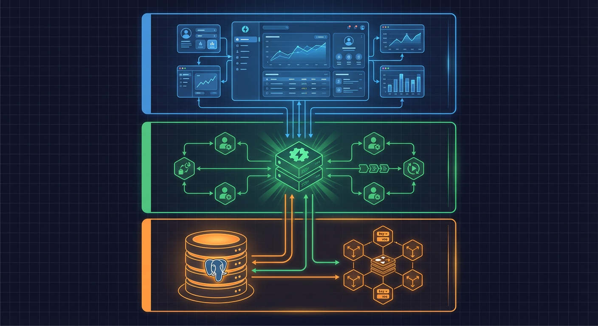
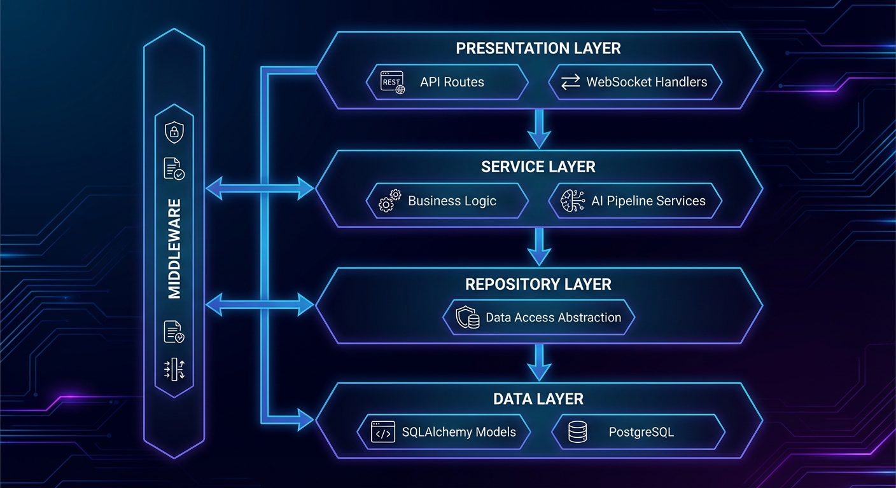
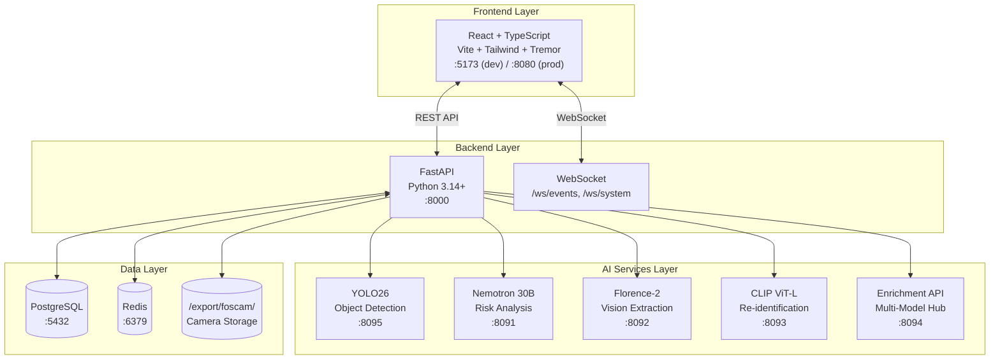
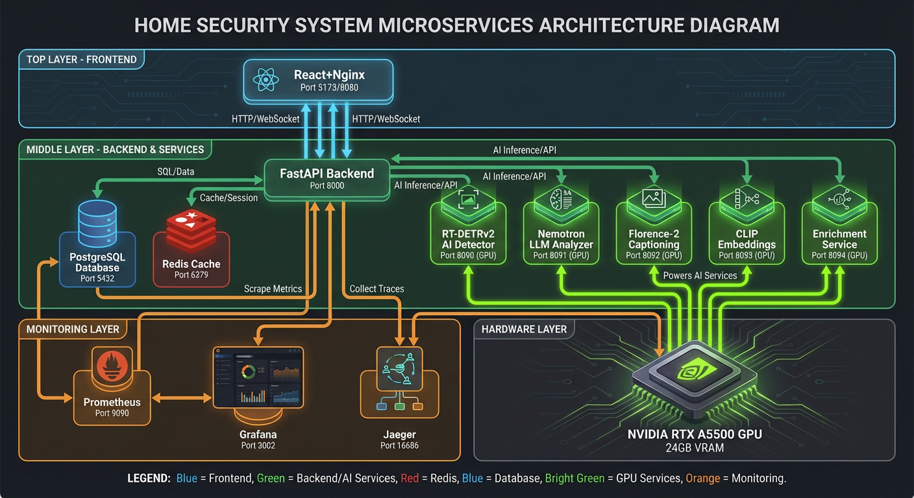
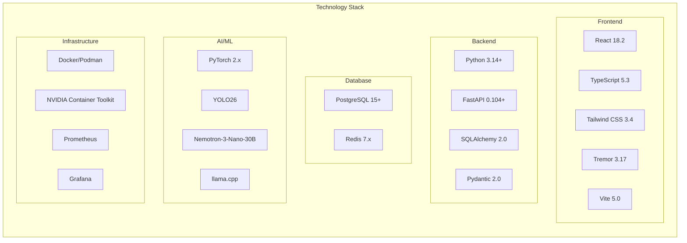

# System Overview Hub

This hub provides high-level architecture understanding of the Home Security Intelligence system.

## Component Architecture

### Backend Layer Organization

## Service Inventory

| Service          | Port                    | Container       | Source                        | Description                             |
| ---------------- | ----------------------- | --------------- | ----------------------------- | --------------------------------------- |
| **Frontend**     | 5173 (dev), 8080 (prod) | `frontend`      | `frontend/`                   | React dashboard with real-time updates  |
| **Backend**      | 8000                    | `backend`       | `backend/main.py:992`         | FastAPI server with WebSocket support   |
| **PostgreSQL**   | 5432                    | `postgres`      | `docker-compose.prod.yml:41`  | Primary database for events, detections |
| **Redis**        | 6379                    | `redis`         | `docker-compose.prod.yml:403` | Queues, pub/sub, batch state            |
| **YOLO26**       | 8090                    | `ai-yolo26`     | `ai/yolo26/`                  | Real-time object detection              |
| **Nemotron LLM** | 8091                    | `ai-llm`        | `ai/nemotron/`                | Risk analysis via llama.cpp             |
| **Florence-2**   | 8092                    | `ai-florence`   | `ai/florence/`                | Vision-language extraction              |
| **CLIP**         | 8093                    | `ai-clip`       | `ai/clip/`                    | Entity re-identification                |
| **Enrichment**   | 8094                    | `ai-enrichment` | `ai/enrichment/`              | Multi-model enrichment hub              |
| **Prometheus**   | 9090                    | `prometheus`    | `docker-compose.prod.yml:534` | Metrics collection                      |
| **Grafana**      | 3002                    | `grafana`       | `docker-compose.prod.yml:564` | Monitoring dashboards                   |
| **Jaeger**       | 16686                   | `jaeger`        | `docker-compose.prod.yml:507` | Distributed tracing                     |
| **Alertmanager** | 9093                    | `alertmanager`  | `docker-compose.prod.yml:656` | Alert routing                           |

## Technology Stack

## Quick Links

| Document                                      | Description                                         |
| --------------------------------------------- | --------------------------------------------------- |
| [Design Decisions](design-decisions.md)       | ADR-format architectural decisions with rationale   |
| [Deployment Topology](deployment-topology.md) | Container architecture, GPU passthrough, networking |
| [Configuration](configuration.md)             | Settings architecture, environment variables        |

## Data Flow Summary

1. **Image Capture**: Foscam cameras FTP upload images to `/export/foscam/{camera}/`
2. **Detection**: FileWatcher queues images, YOLO26 performs object detection
3. **Batching**: BatchAggregator groups detections (90s window, 30s idle timeout)
4. **Analysis**: Nemotron LLM analyzes batches, assigns risk scores
5. **Broadcast**: Events pushed via Redis pub/sub to WebSocket clients
6. **Display**: React dashboard updates in real-time

## Script Dependencies

The project includes various scripts for development, testing, and deployment. This dependency graph illustrates how scripts relate to each other and their execution order.

## Related Documentation

| Document                            | Purpose                             |
| ----------------------------------- | ----------------------------------- |
| `/docs/architecture/overview.md`    | Comprehensive architecture overview |
| `/docs/architecture/decisions.md`   | Full ADR collection                 |
| `/docs/architecture/ai-pipeline.md` | AI processing pipeline details      |
| `/docs/architecture/real-time.md`   | WebSocket and pub/sub patterns      |
| `/AGENTS.md`                        | Project navigation guide            |
