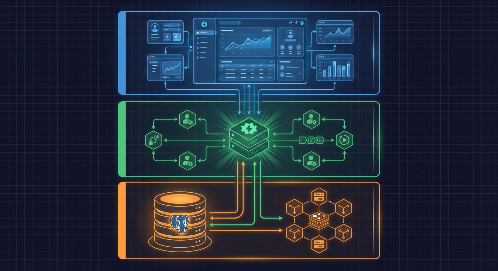
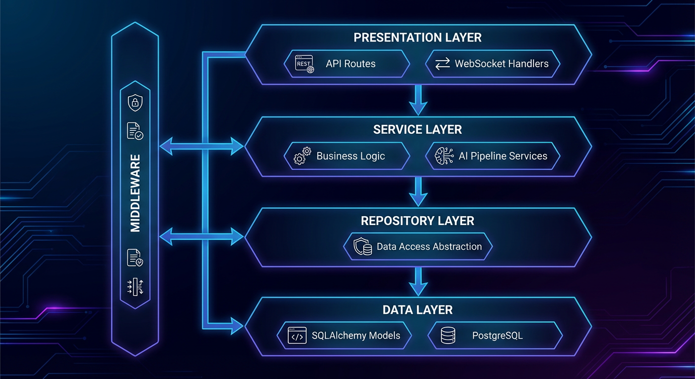
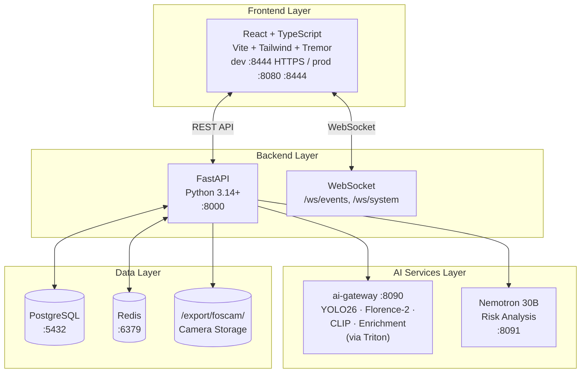
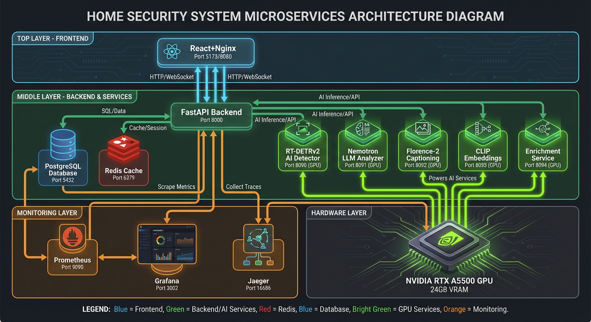
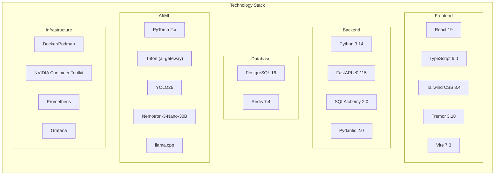
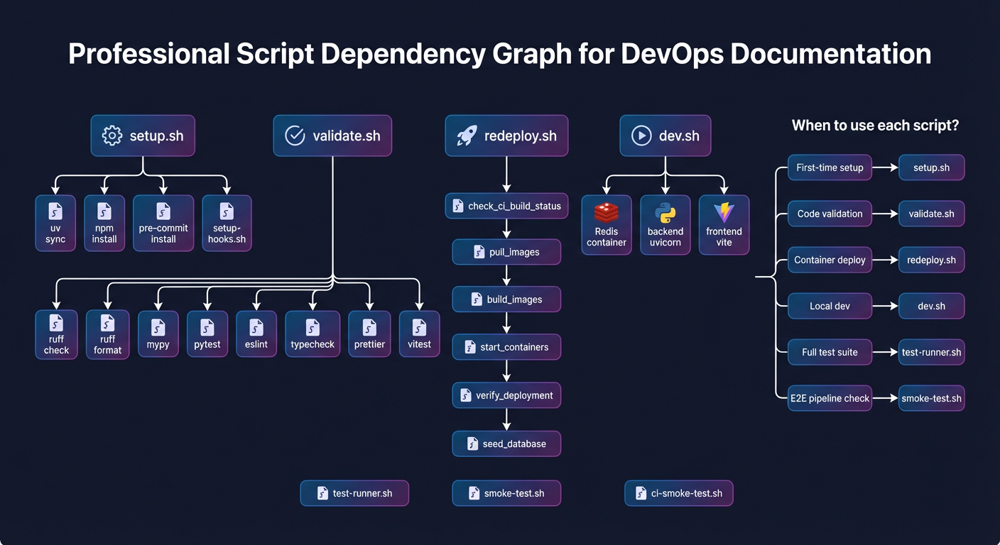

# System Overview Hub

This hub provides high-level architecture understanding of the Home Security Intelligence system.

## Component Architecture

### Backend Layer Organization

```mermaid
flowchart TB
    subgraph Frontend["Frontend Layer"]
        FE["React + TypeScript<br/>Vite + Tailwind + Tremor<br/>dev :8444 HTTPS / prod :8080 :8444"]
    end

    subgraph Backend["Backend Layer"]
        BE["FastAPI<br/>Python 3.14+<br/>:8000"]
        WS["WebSocket<br/>/ws/events, /ws/system"]
    end

    subgraph AI["AI Services Layer"]
        GW["ai-gateway :8090<br/>YOLO26 · Florence-2 ·<br/>CLIP · Enrichment<br/>(via Triton)"]
        LLM["Nemotron 30B<br/>Risk Analysis<br/>:8091"]
    end

    subgraph Data["Data Layer"]
        PG[(PostgreSQL<br/>:5432)]
        RD[(Redis<br/>:6379)]
        FS[("/export/foscam/<br/>Camera Storage")]
    end

    FE <-->|REST API| BE
    FE <-->|WebSocket| WS
    BE --> GW
    BE --> LLM
    BE <--> PG
    BE <--> RD
    BE --> FS
```

## Service Inventory

| Service          | Port                        | Container      | Source                         | Description                                                      |
| ---------------- | --------------------------- | -------------- | ------------------------------ | ---------------------------------------------------------------- |
| **Frontend**     | host 8444 HTTPS / 8080 HTTP | `frontend`     | `frontend/`                    | React dashboard with real-time updates                           |
| **Backend**      | 8000                        | `backend`      | `backend/main.py:1314`         | FastAPI server with WebSocket support                            |
| **PostgreSQL**   | 5432                        | `postgres`     | `docker-compose.prod.yml:44`   | Primary database for events, detections                          |
| **Redis**        | 6379                        | `redis`        | `docker-compose.prod.yml:540`  | Queues, pub/sub, batch state                                     |
| **ai-gateway**   | 8090 (+8002 metrics)        | `ai-gateway`   | `ai/gateway/`                  | YOLO26, Florence-2, CLIP and enrichment models served via Triton |
| **Nemotron LLM** | 8091                        | `ai-llm`       | `ai/nemotron/`                 | Risk analysis via llama.cpp                                      |
| **Prometheus**   | 9090                        | `prometheus`   | `docker-compose.prod.yml:871`  | Metrics collection                                               |
| **Grafana**      | host 3002 (container 3000)  | `grafana`      | `docker-compose.prod.yml:915`  | Monitoring dashboards at `/grafana/` via proxy                   |
| **Tempo**        | 3200                        | `tempo`        | `docker-compose.prod.yml:842`  | Distributed trace storage (replaces Jaeger)                      |
| **Alertmanager** | 9093                        | `alertmanager` | `docker-compose.prod.yml:1044` | Alert routing                                                    |

## Technology Stack

```mermaid
flowchart TB
    subgraph Stack["Technology Stack"]
        direction TB

        subgraph FE["Frontend"]
            React["React 19"]
            TS["TypeScript 6.0"]
            Tailwind["Tailwind CSS 3.4"]
            Tremor["Tremor 3.18"]
            Vite["Vite 7.3"]
        end

        subgraph BE["Backend"]
            Python["Python 3.14"]
            FastAPI["FastAPI ≥0.115"]
            SQLAlchemy["SQLAlchemy 2.0"]
            Pydantic["Pydantic 2.0"]
        end

        subgraph DB["Database"]
            PG["PostgreSQL 16"]
            Redis["Redis 7.4"]
        end

        subgraph ML["AI/ML"]
            PyTorch["PyTorch 2.x"]
            Triton["Triton (ai-gateway)"]
            YOLO26["YOLO26"]
            Nemotron["Nemotron-3-Nano-30B"]
            LlamaCpp["llama.cpp"]
        end

        subgraph Infra["Infrastructure"]
            Docker["Docker/Podman"]
            NVIDIA["NVIDIA Container Toolkit"]
            Prom["Prometheus"]
            Graf["Grafana"]
        end
    end
```

## Quick Links

| Document                                      | Description                                         |
| --------------------------------------------- | --------------------------------------------------- |
| [Design Decisions](design-decisions.md)       | ADR-format architectural decisions with rationale   |
| [Deployment Topology](deployment-topology.md) | Container architecture, GPU passthrough, networking |
| [Configuration](configuration.md)             | Settings architecture, environment variables        |

## Data Flow Summary

1. **Image Capture**: Foscam cameras FTP upload images to `/export/foscam/{camera}/`
2. **Detection**: FileWatcher queues images, YOLO26 performs object detection
3. **Batching**: BatchAggregator groups detections (90s window, 30s idle timeout)
4. **Analysis**: Nemotron LLM analyzes batches, assigns risk scores
5. **Broadcast**: Events pushed via Redis pub/sub to WebSocket clients
6. **Display**: React dashboard updates in real-time

## Script Dependencies

The project includes various scripts for development, testing, and deployment. This dependency graph illustrates how scripts relate to each other and their execution order.

## Related Documentation

| Document                            | Purpose                             |
| ----------------------------------- | ----------------------------------- |
| `/docs/architecture/overview.md`    | Comprehensive architecture overview |
| `/docs/architecture/decisions.md`   | Full ADR collection                 |
| `/docs/architecture/ai-pipeline.md` | AI processing pipeline details      |
| `/docs/architecture/real-time.md`   | WebSocket and pub/sub patterns      |
| `/AGENTS.md`                        | Project navigation guide            |
