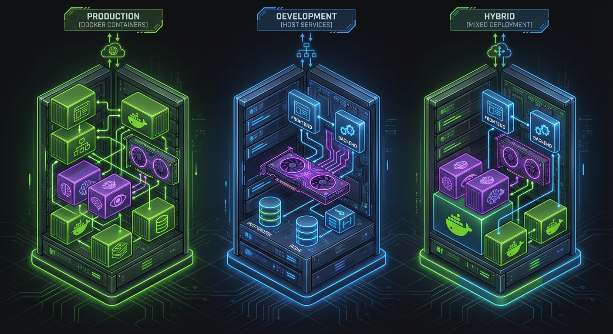
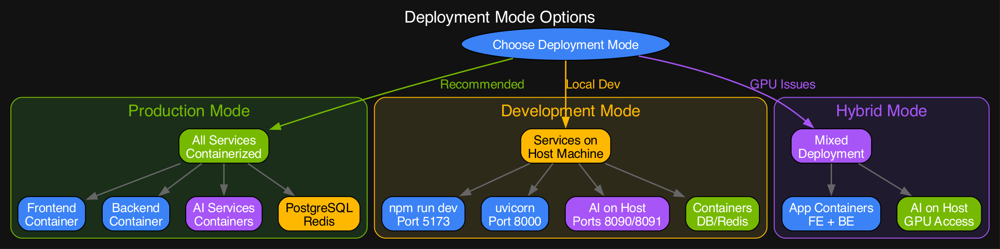
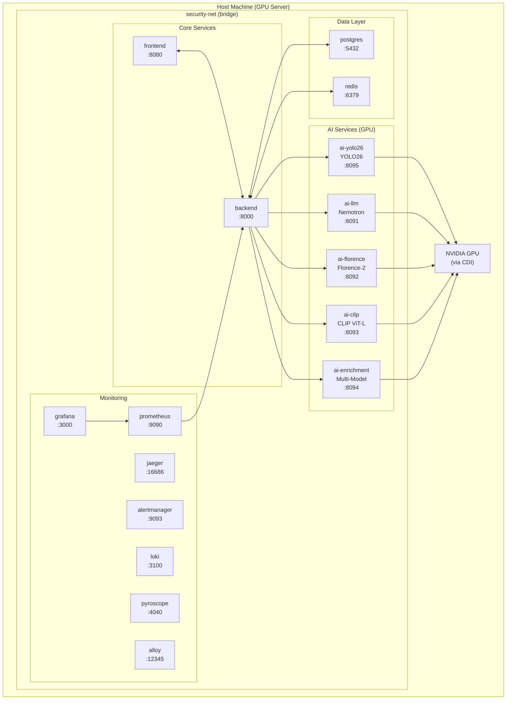
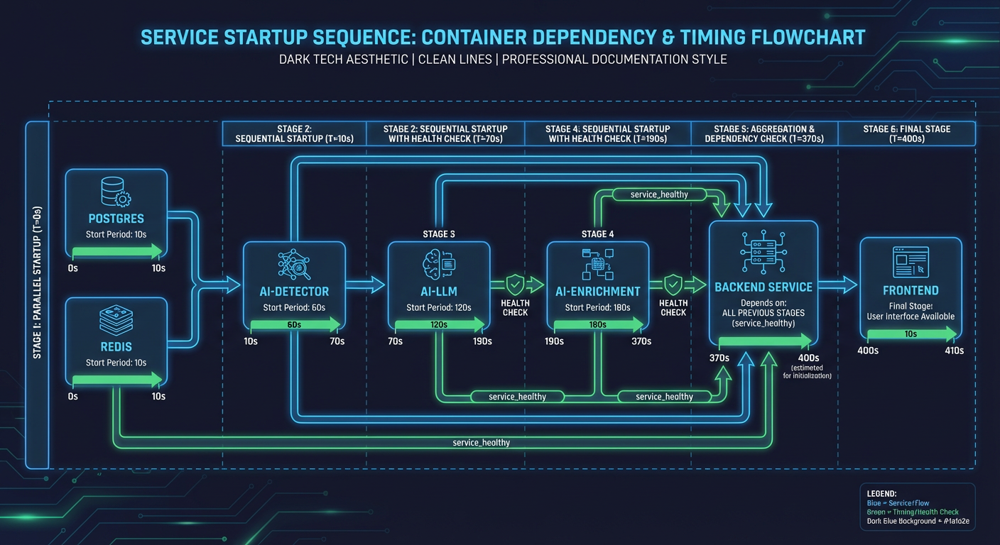
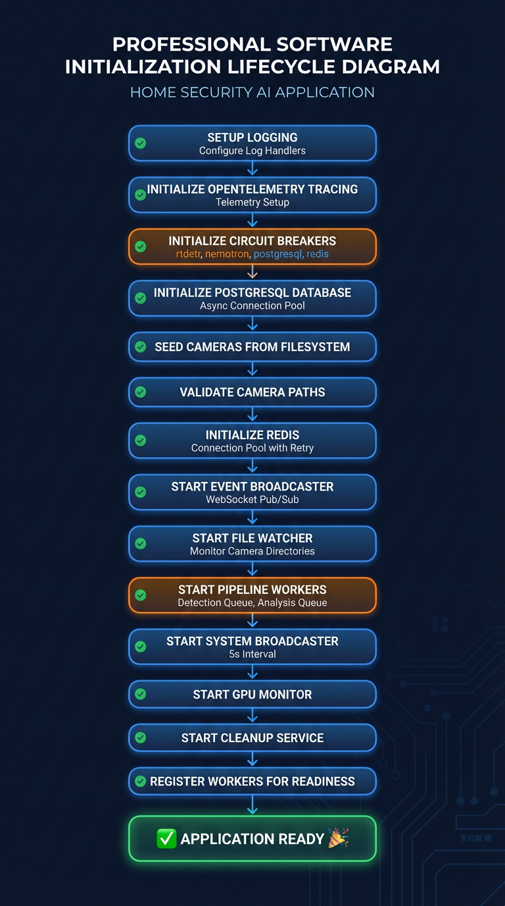
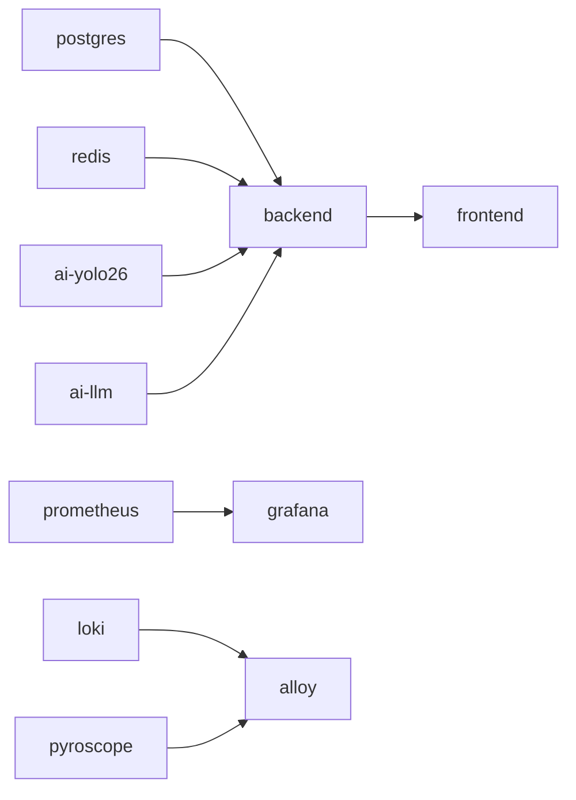

# Deployment Topology

This document describes the container architecture, network configuration, GPU passthrough, and resource allocation for the Home Security Intelligence system.

## Container Architecture

All services run as containers on a single Docker/Podman network (`security-net`), enabling service discovery by container name.

### Deployment Mode Options







## Network Configuration

**Source:** `docker-compose.prod.yml:834-836`

```yaml
networks:
  security-net:
    driver: bridge
```

| Service       | Internal Port | External Port | Protocol   |
| ------------- | ------------- | ------------- | ---------- |
| frontend      | 8080          | 5173          | HTTP/HTTPS |
| backend       | 8000          | 8000          | HTTP/WS    |
| postgres      | 5432          | 5432          | TCP        |
| redis         | 6379          | 6379          | TCP        |
| ai-yolo26     | 8090          | 8090          | HTTP       |
| ai-llm        | 8091          | 8091          | HTTP       |
| ai-florence   | 8092          | 8092          | HTTP       |
| ai-clip       | 8093          | 8093          | HTTP       |
| ai-enrichment | 8094          | 8094          | HTTP       |
| prometheus    | 9090          | 9090          | HTTP       |
| grafana       | 3000          | 3002          | HTTP       |
| jaeger        | 16686         | 16686         | HTTP       |
| alertmanager  | 9093          | 9093          | HTTP       |
| loki          | 3100          | 3100          | HTTP       |
| pyroscope     | 4040          | 4040          | HTTP       |
| alloy         | 12345         | 12345         | HTTP       |

## GPU Passthrough Configuration

All AI services use NVIDIA Container Toolkit (CDI) for GPU access.

**Source:** `docker-compose.prod.yml:137-143` (ai-yolo26 example)

```yaml
deploy:
  resources:
    reservations:
      devices:
        - driver: nvidia
          count: 1
          capabilities: [gpu]
```

### GPU Requirements

- **NVIDIA GPU**: RTX A5500 (24GB) or similar with 24GB+ VRAM
- **CUDA**: 12.0+ support required
- **Container Toolkit**: nvidia-container-toolkit must be installed

### Installation Commands

```bash
# Install NVIDIA Container Toolkit (Ubuntu/Debian)
distribution=$(. /etc/os-release;echo $ID$VERSION_ID)
curl -s -L https://nvidia.github.io/nvidia-docker/gpgkey | sudo apt-key add -
curl -s -L https://nvidia.github.io/nvidia-docker/$distribution/nvidia-docker.list | \
    sudo tee /etc/apt/sources.list.d/nvidia-docker.list
sudo apt update && sudo apt install -y nvidia-container-toolkit

# Configure Docker
sudo nvidia-ctk runtime configure --runtime=docker
sudo systemctl restart docker
```

## VRAM Allocation

Total GPU VRAM: ~24GB (RTX A5500)

```
+------------------------------------------------------------------+
|                        GPU VRAM (24GB)                            |
+------------------------------------------------------------------+
| Nemotron LLM (Q4_K_M)                          | ~21,700 MB       |
| ================================================                  |
+------------------------------------------------------------------+
| YOLO26                                      | ~650 MB          |
| ======                                                            |
+------------------------------------------------------------------+
| Enrichment Service Budget                      | ~6,800 MB        |
| (on-demand: vehicle, pet, pose, threat, etc.)                     |
| ==================                                                |
+------------------------------------------------------------------+
| Florence-2 (optional)                          | ~1,500 MB        |
| =====                                                             |
+------------------------------------------------------------------+
| CLIP ViT-L (optional)                          | ~400 MB          |
| ==                                                                |
+------------------------------------------------------------------+
| System/Driver Overhead                         | ~500 MB          |
| ==                                                                |
+------------------------------------------------------------------+
```

### VRAM by Service

| Service               | VRAM       | Notes                               |
| --------------------- | ---------- | ----------------------------------- |
| **Nemotron LLM**      | ~21,700 MB | Q4_K_M quantization, 128K context   |
| **YOLO26**            | ~650 MB    | Object detection, always loaded     |
| **Enrichment Budget** | ~6,800 MB  | On-demand model loading (Model Zoo) |
| **Florence-2**        | ~1,500 MB  | Vision-language, optional           |
| **CLIP ViT-L**        | ~400 MB    | Re-identification, optional         |

**Enrichment VRAM Budget Source:** `docker-compose.prod.yml:284`

```yaml
- VRAM_BUDGET_GB=6.8
```

## Volume Mounts

**Source:** `docker-compose.prod.yml:818-832`

```yaml
volumes:
  postgres_data:
    driver: local
  redis_data:
    driver: local
  prometheus_data:
    driver: local
  grafana_data:
    driver: local
  alertmanager_data:
    driver: local
  loki_data:
    driver: local
  pyroscope_data:
    driver: local
```

| Volume                       | Container    | Mount Path                 | Purpose                   |
| ---------------------------- | ------------ | -------------------------- | ------------------------- |
| `postgres_data`              | postgres     | `/var/lib/postgresql/data` | Database persistence      |
| `redis_data`                 | redis        | `/data`                    | Redis AOF persistence     |
| `prometheus_data`            | prometheus   | `/prometheus`              | Metrics storage           |
| `grafana_data`               | grafana      | `/var/lib/grafana`         | Dashboard configs         |
| `alertmanager_data`          | alertmanager | `/alertmanager`            | Alert state               |
| `loki_data`                  | loki         | `/loki`                    | Log storage               |
| `pyroscope_data`             | pyroscope    | `/data`                    | Profile storage           |
| Host: `/export/foscam`       | backend      | `/cameras:ro`              | Camera images (read-only) |
| Host: `~/.cache/huggingface` | ai-yolo26    | `/cache/huggingface`       | Model cache               |

## Health Checks

All services include Docker health checks for orchestration and monitoring.

**Source:** `docker-compose.prod.yml` (various services)

| Service       | Health Endpoint                | Interval | Timeout | Retries | Start Period |
| ------------- | ------------------------------ | -------- | ------- | ------- | ------------ |
| postgres      | `pg_isready`                   | 10s      | 5s      | 5       | 10s          |
| redis         | `redis-cli ping`               | 10s      | 5s      | 3       | -            |
| backend       | `GET /api/system/health/ready` | 10s      | 5s      | 3       | 30s          |
| frontend      | `GET /health`                  | 30s      | 10s     | 3       | 40s          |
| ai-yolo26     | `GET /health`                  | 10s      | 5s      | 5       | 60s          |
| ai-llm        | `GET /health`                  | 10s      | 5s      | 5       | 120s         |
| ai-florence   | `GET /health`                  | 10s      | 5s      | 5       | 60s          |
| ai-clip       | `GET /health`                  | 10s      | 5s      | 5       | 60s          |
| ai-enrichment | `GET /health`                  | 10s      | 5s      | 5       | 180s         |
| prometheus    | `GET /-/healthy`               | 15s      | 5s      | 3       | -            |
| grafana       | `GET /api/health`              | 15s      | 5s      | 3       | -            |
| jaeger        | `GET /`                        | 15s      | 5s      | 3       | -            |
| alertmanager  | `GET /-/healthy`               | 15s      | 5s      | 3       | -            |
| loki          | `GET /ready`                   | 10s      | 5s      | 5       | -            |
| pyroscope     | `GET /ready`                   | 10s      | 5s      | 5       | -            |

### Start Period Notes

AI services have longer start periods due to model loading:

- **ai-yolo26**: 60s for YOLO26 model loading
- **ai-llm**: 120s for Nemotron LLM loading (largest model)
- **ai-enrichment**: 180s for multiple model initialization

## Resource Limits

**Source:** `docker-compose.prod.yml` (various services)

| Service           | CPU Limit | Memory Limit |
| ----------------- | --------- | ------------ |
| postgres          | 2         | 1G           |
| redis             | 1         | 512M         |
| backend           | 2         | 4G           |
| frontend          | 1         | 512M         |
| prometheus        | 1         | 512M         |
| grafana           | 1         | 256M         |
| alertmanager      | 0.5       | 128M         |
| loki              | 0.25      | 512M         |
| pyroscope         | 0.25      | 512M         |
| alloy             | 0.5       | 768M         |
| redis-exporter    | 0.5       | 64M          |
| json-exporter     | 0.5       | 64M          |
| blackbox-exporter | 0.5       | 64M          |

**Note:** AI services (ai-yolo26, ai-llm, ai-florence, ai-clip, ai-enrichment) do not have CPU/memory limits to allow full GPU utilization.

## Service Dependencies



### Backend Initialization Sequence



**Source:** `docker-compose.prod.yml:353-376`

```yaml
# Backend startup order
depends_on:
  postgres:
    condition: service_healthy
  redis:
    condition: service_healthy
  ai-yolo26:
    condition: service_healthy
  ai-llm:
    condition: service_healthy
```



## Deployment Commands

```bash
# Start all services
docker compose -f docker-compose.prod.yml up -d

# Or with Podman
podman-compose -f docker-compose.prod.yml up -d

# Check container status
docker compose -f docker-compose.prod.yml ps

# View logs
docker compose -f docker-compose.prod.yml logs -f backend

# Check GPU usage
nvidia-smi --query-compute-apps=pid,name,used_memory --format=csv

# Rebuild without cache
docker compose -f docker-compose.prod.yml build --no-cache backend
```

## Related Documentation

- [Configuration](configuration.md) - Environment variables and settings
- [Design Decisions](design-decisions.md) - Why containerized deployment
- [Architecture Overview](/docs/architecture/overview.md) - System design
