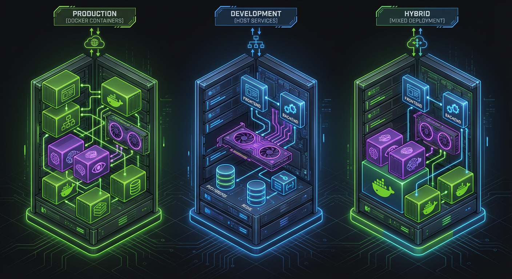
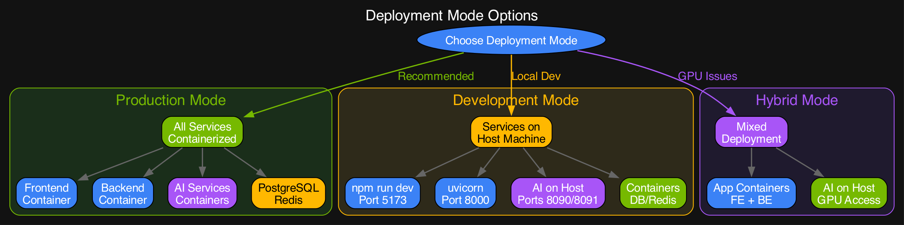
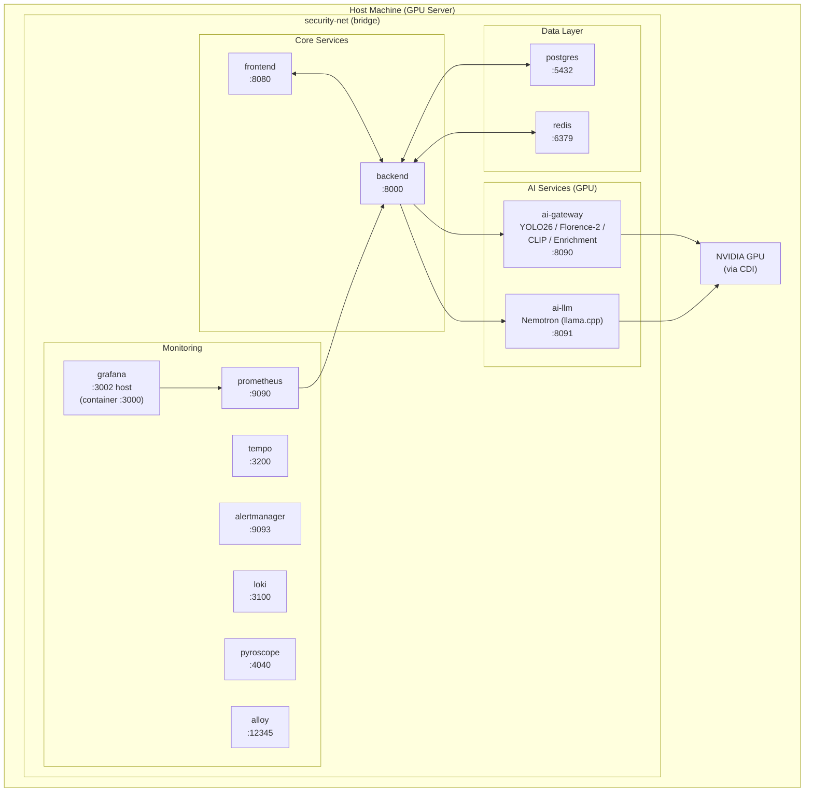
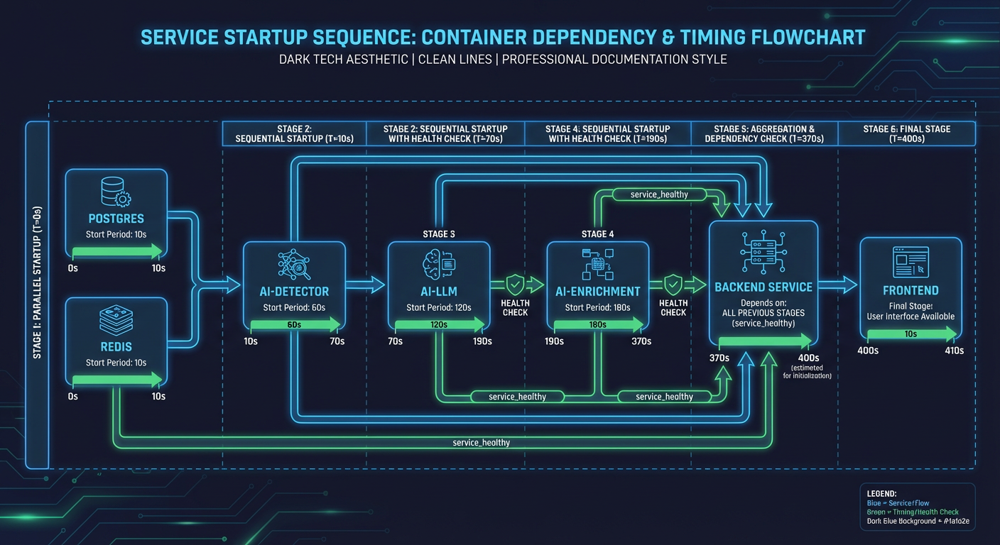
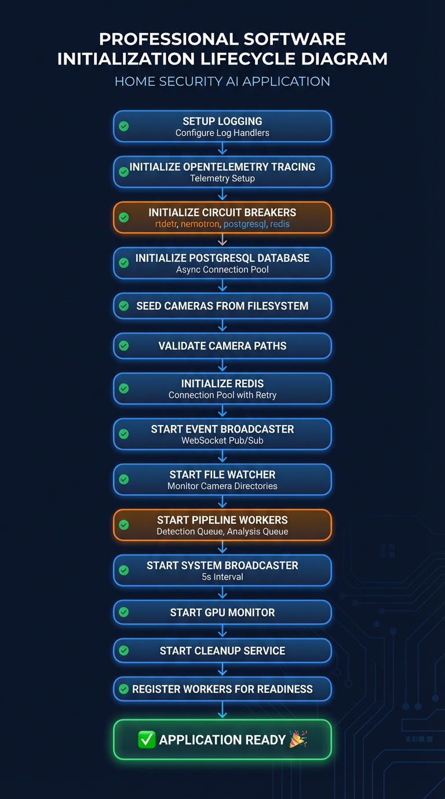
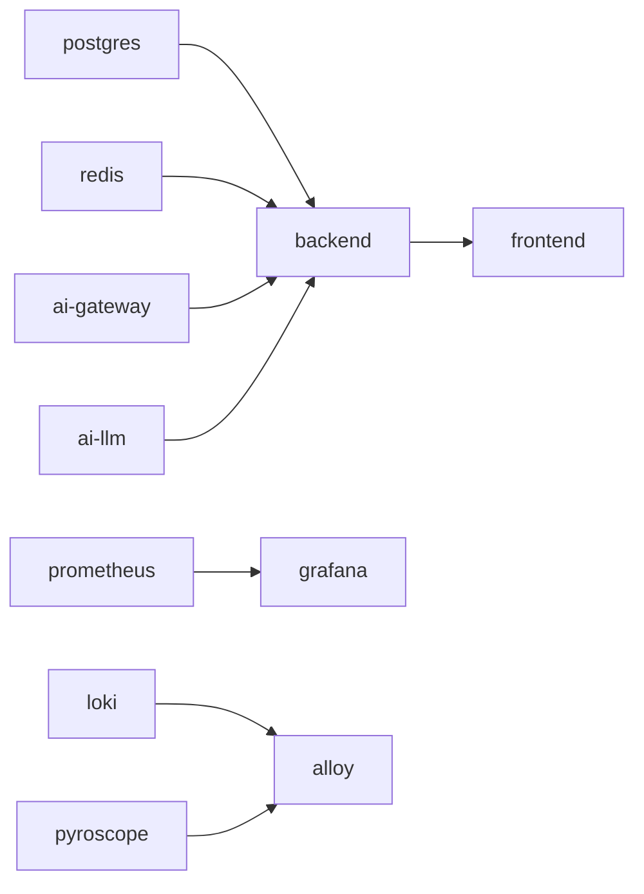

# Deployment Topology

This document describes the container architecture, network configuration, GPU passthrough, and resource allocation for the Home Security Intelligence system.

## Container Architecture

All services run as containers on a single Docker/Podman network (`security-net`), enabling service discovery by container name.

### Deployment Mode Options






```mermaid
flowchart TB
    subgraph Host["Host Machine (GPU Server)"]
        subgraph Network["security-net (bridge)"]
            subgraph Core["Core Services"]
                FE["frontend<br/>:8080"]
                BE["backend<br/>:8000"]
            end

            subgraph Data["Data Layer"]
                PG["postgres<br/>:5432"]
                RD["redis<br/>:6379"]
            end

            subgraph AI["AI Services (GPU)"]
                GW["ai-gateway<br/>YOLO26 / Florence-2 /<br/>CLIP / Enrichment<br/>:8090"]
                LLM["ai-llm<br/>Nemotron (llama.cpp)<br/>:8091"]
            end

            subgraph Mon["Monitoring"]
                PROM["prometheus<br/>:9090"]
                GRAF["grafana<br/>:3002 host<br/>(container :3000)"]
                TEMPO["tempo<br/>:3200"]
                ALERT["alertmanager<br/>:9093"]
                LOKI["loki<br/>:3100"]
                PYRO["pyroscope<br/>:4040"]
                ALLOY["alloy<br/>:12345"]
            end
        end

        GPU["NVIDIA GPU<br/>(via CDI)"]
    end

    FE <--> BE
    BE <--> PG
    BE <--> RD
    BE --> GW
    BE --> LLM
    GW --> GPU
    LLM --> GPU
    PROM --> BE
    GRAF --> PROM
```

## Network Configuration

**Source:** `docker-compose.prod.yml:1388-1390`

```yaml
networks:
  security-net:
    driver: bridge
```

External ports are the `.env.example` defaults (bind address `127.0.0.1` unless noted).

| Service      | Internal Port | External Port        | Protocol   |
| ------------ | ------------- | -------------------- | ---------- |
| frontend     | 8443 / 8080   | 8444 / 8080          | HTTP/HTTPS |
| backend      | 8000          | 8000                 | HTTP/WS    |
| postgres     | 5432          | 5432                 | TCP        |
| redis        | 6379          | 6379                 | TCP        |
| ai-gateway   | 8090          | 8090 (+8002 metrics) | HTTP       |
| ai-llm       | 8091          | 8091                 | HTTP       |
| prometheus   | 9090          | 9090                 | HTTP       |
| grafana      | 3000          | 3002                 | HTTP       |
| tempo        | 3200          | 3200                 | HTTP       |
| alertmanager | 9093          | 9093                 | HTTP       |
| loki         | 3100          | 3100                 | HTTP       |
| pyroscope    | 4040          | 4040                 | HTTP       |
| alloy        | 12345         | 12345                | HTTP       |

The frontend binds `0.0.0.0` (all interfaces) rather than loopback so browsers on the LAN can reach the dashboard. All other published ports bind `127.0.0.1`. Grafana is normally reached through the frontend nginx proxy at `https://<host>:8444/grafana/` (`GF_SERVER_ROOT_URL=/grafana/`); port 3002 is the direct host mapping.

## GPU Passthrough Configuration

All AI services use NVIDIA Container Toolkit (CDI) for GPU access.

**Source:** `docker-compose.prod.yml:342-352` (ai-gateway example)

```yaml
deploy:
  resources:
    reservations:
      devices:
        - driver: nvidia
          count: 1
          capabilities: [gpu]
```

### GPU Requirements

- **NVIDIA GPU**: RTX A5500 (24GB) or similar with 24GB+ VRAM
- **CUDA**: 12.0+ support required
- **Container Toolkit**: nvidia-container-toolkit must be installed

### Installation Commands

```bash
# Install NVIDIA Container Toolkit (Ubuntu/Debian)
distribution=$(. /etc/os-release;echo $ID$VERSION_ID)
curl -s -L https://nvidia.github.io/nvidia-docker/gpgkey | sudo apt-key add -
curl -s -L https://nvidia.github.io/nvidia-docker/$distribution/nvidia-docker.list | \
    sudo tee /etc/apt/sources.list.d/nvidia-docker.list
sudo apt update && sudo apt install -y nvidia-container-toolkit

# Configure Docker
sudo nvidia-ctk runtime configure --runtime=docker
sudo systemctl restart docker
```

## VRAM Allocation

VRAM is split across two GPUs, selected by `GPU_LLM` (Nemotron) and `GPU_AI_SERVICES` (ai-gateway) in
`.env.example`. Check your own card with `nvidia-smi`; the layout below shows the loading pattern, not
a fixed budget — only the Nemotron figure (~14.7 GB at Q4_K_M) is a fixed estimate in this repo.

```
GPU for LLM (GPU_LLM)              GPU for AI services (GPU_AI_SERVICES)
+--------------------------+       +------------------------------------------+
| Nemotron LLM  ~14.7 GB   |       | ai-gateway (Triton, 14 models)           |
| (llama.cpp, always       |       |  - YOLO26: always loaded                 |
|  resident)               |       |  - Florence-2, CLIP/SigLIP, enrichment:  |
|                          |       |    load/evict on demand                  |
+--------------------------+       +------------------------------------------+
```

### VRAM by Service

| Service               | VRAM             | Notes                                                                                                                                 |
| --------------------- | ---------------- | ------------------------------------------------------------------------------------------------------------------------------------- |
| **Nemotron LLM**      | ~14.7 GB         | Q4_K_M quantization (see `models.yml` description)                                                                                    |
| **ai-gateway models** | see `models.yml` | YOLO26, Florence-2, CLIP/SigLIP and enrichment models each declare `vram_mb` in `models.yml` and load on demand in one Triton process |

Enrichment models load and evict on demand through ai-gateway's Triton backend; per-model estimates live in
`models.yml` (`vram_mb` per entry). There is no fixed "enrichment budget" environment variable in the
current compose file — VRAM allocation is managed dynamically per GPU (`GPU_LLM`, `GPU_AI_SERVICES` in `.env.example`).

## Volume Mounts

**Source:** `docker-compose.prod.yml:1339` (top-level `volumes:` block)

Named volumes include `postgres_data`, `redis_data`, `tempo_data`, `hf_cache`, `prometheus_data`,
`grafana_data`, `alertmanager_data`, `loki_data`, `pyroscope_data`, `alloy_symb_cache`, and
`frontend_certs`, plus Triton caches (`triton-kernel-cache`, `triton-tmp-cache`).

| Volume                                      | Container             | Mount Path                 | Purpose                     |
| ------------------------------------------- | --------------------- | -------------------------- | --------------------------- |
| `postgres_data`                             | postgres              | `/var/lib/postgresql/data` | Database persistence        |
| `redis_data`                                | redis                 | `/data`                    | Redis AOF persistence       |
| `prometheus_data`                           | prometheus            | `/prometheus`              | Metrics storage             |
| `grafana_data`                              | grafana               | `/var/lib/grafana`         | Dashboard configs           |
| `alertmanager_data`                         | alertmanager          | `/alertmanager`            | Alert state                 |
| `loki_data`                                 | loki                  | `/loki`                    | Log storage                 |
| `tempo_data`                                | tempo                 | `/var/tempo`               | Trace storage               |
| `pyroscope_data`                            | pyroscope             | `/data`                    | Profile storage             |
| Host: `${FOSCAM_BASE_PATH:-/export/foscam}` | backend / foscam-init | `/cameras`                 | Camera images (FTP uploads) |
| Host: `${HF_CACHE_PATH}`                    | ai-llm, ai-gateway    | `/root/.cache/huggingface` | HuggingFace model cache     |

## Health Checks

All services include Docker health checks for orchestration and monitoring.

**Source:** `docker-compose.prod.yml` (various services)

| Service      | Health Check                    | Interval | Timeout | Retries | Start Period |
| ------------ | ------------------------------- | -------- | ------- | ------- | ------------ |
| postgres     | `pg_isready`                    | 10s      | 5s      | 5       | 10s          |
| redis        | `redis-cli ping`                | 10s      | 5s      | 3       | -            |
| backend      | `GET /api/system/health/ready`  | 10s      | 5s      | 3       | 30s          |
| frontend     | `GET /health` (container :8080) | 30s      | 10s     | 3       | 40s          |
| ai-gateway   | `GET :8090/health`              | 15s      | 10s     | 5       | 180s         |
| ai-llm       | `GET :8091/health`              | 10s      | 5s      | 3       | 300s         |
| prometheus   | `GET /-/healthy`                | 15s      | 5s      | 3       | -            |
| grafana      | `GET /api/health`               | 15s      | 5s      | 3       | -            |
| tempo        | `GET /ready`                    | 15s      | 5s      | 3       | -            |
| alertmanager | `GET /-/healthy`                | 15s      | 5s      | 3       | -            |
| loki         | `GET /ready`                    | 10s      | 5s      | 5       | -            |
| pyroscope    | `GET /ready`                    | 10s      | 5s      | 5       | -            |

### Start Period Notes

AI services have longer start periods because models must load before the health endpoint returns:

- **ai-gateway**: 180s — Triton initializes its full model set before `/health` passes
- **ai-llm**: 300s — Nemotron is the largest model and takes the longest to load

## Resource Limits

**Source:** `docker-compose.prod.yml` (various services)

| Service           | CPU Limit | Memory Limit |
| ----------------- | --------- | ------------ |
| postgres          | 2         | 1G           |
| redis             | 1         | 512M         |
| backend           | 2         | 10G          |
| frontend          | 1         | 512M         |
| ai-gateway        | 8         | 20G          |
| ai-llm            | 4         | 12G          |
| prometheus        | 1         | 512M         |
| grafana           | 1         | 512M         |
| tempo             | 1         | 1G           |
| alertmanager      | 0.5       | 128M         |
| loki              | 0.25      | 1G           |
| pyroscope         | 0.25      | 512M         |
| alloy             | 0.5       | 768M         |
| redis-exporter    | 0.5       | 64M          |
| json-exporter     | 0.5       | 64M          |
| blackbox-exporter | 0.5       | 64M          |

**Note:** `ai-llm-vllm` (the optional vLLM alternative) is capped at 4 CPUs / 24G. GPU inference workloads
are bounded by VRAM, not CPU limits — the compose caps above leave headroom for host overhead.

## Service Dependencies



### Backend Initialization Sequence



**Source:** `docker-compose.prod.yml:499-513` (backend `depends_on`)

```yaml
# Backend startup order
depends_on:
  foscam-init:
    condition: service_completed_successfully
  postgres:
    condition: service_healthy
  redis:
    condition: service_healthy
  ai-llm:
    condition: service_healthy
  ai-gateway:
    condition: service_healthy
  go2rtc:
    condition: service_healthy
```


```mermaid
flowchart LR
    PG["postgres"] --> BE["backend"]
    RD["redis"] --> BE
    GW["ai-gateway"] --> BE
    LLM["ai-llm"] --> BE
    BE --> FE["frontend"]
    PROM["prometheus"] --> GRAF["grafana"]
    LOKI["loki"] --> ALLOY["alloy"]
    PYRO["pyroscope"] --> ALLOY
```

## Deployment Commands

```bash
# Start all services
docker compose -f docker-compose.prod.yml up -d

# Or with Podman
podman-compose -f docker-compose.prod.yml up -d

# Check container status
docker compose -f docker-compose.prod.yml ps

# View logs
docker compose -f docker-compose.prod.yml logs -f backend

# Check GPU usage
nvidia-smi --query-compute-apps=pid,name,used_memory --format=csv

# Rebuild without cache
docker compose -f docker-compose.prod.yml build --no-cache backend
```

## Related Documentation

- [Configuration](configuration.md) - Environment variables and settings
- [Design Decisions](design-decisions.md) - Why containerized deployment
- [Architecture Overview](/architecture/overview.md) - System design
