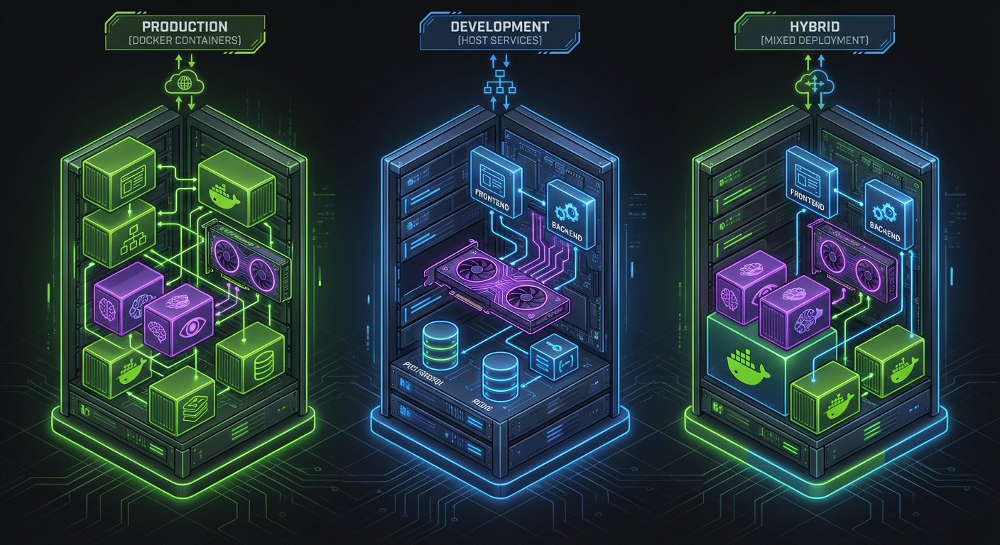
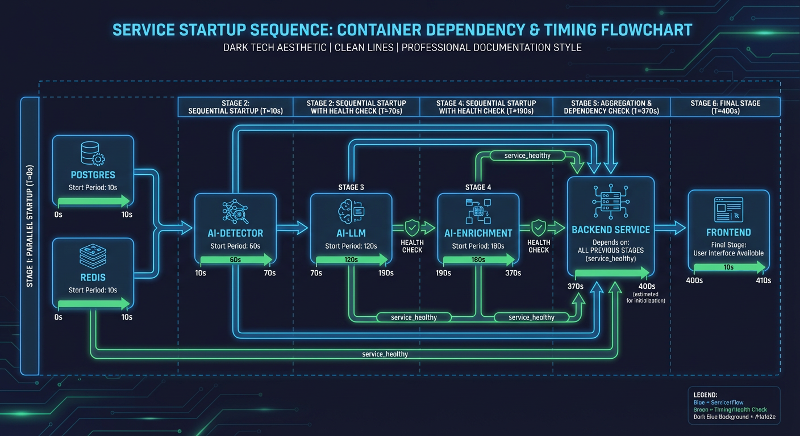
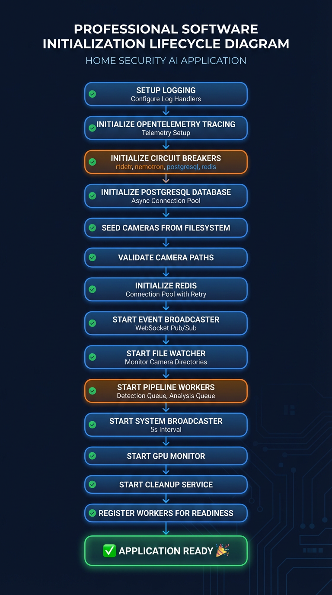
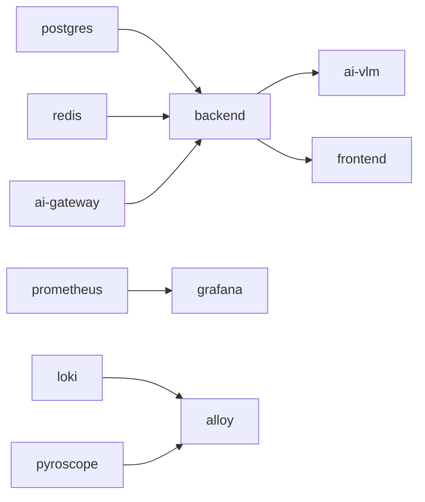

# Deployment Topology

This document describes the container architecture, network configuration, GPU passthrough, and resource allocation for the Home Security Intelligence system.

## Container Architecture

All services run as containers on a single Docker/Podman network (`security-net`), enabling service discovery by container name.

### Deployment Mode Options




```mermaid
flowchart TB
    subgraph Host["Host Machine (GPU Server)"]
        subgraph Network["security-net (bridge)"]
            subgraph Core["Core Services"]
                FE["frontend<br/>:8080 / :8443"]
                BE["backend<br/>:8000"]
            end

            subgraph Data["Data Layer"]
                PG["postgres<br/>:5432"]
                RD["redis<br/>:6379"]
            end

            subgraph AI["AI Services (GPU)"]
                GW["ai-gateway<br/>Triton: yolo26 / reid<br/>:8090 (+ :8002 metrics)"]
                VLM["ai-vlm<br/>Qwen3VL-8B llama-server<br/>:8098"]
            end

            subgraph Mon["Monitoring"]
                PROM["prometheus<br/>:9090"]
                GRAF["grafana<br/>:3002 host<br/>(container :3000)"]
                TEMPO["tempo<br/>:3200"]
                ALERT["alertmanager<br/>:9093"]
                LOKI["loki<br/>:3100"]
                PYRO["pyroscope<br/>:4040"]
                ALLOY["alloy<br/>:12345"]
            end
        end

        GPU["NVIDIA GPU<br/>(via CDI)")
    end

    FE <--> BE
    BE <--> PG
    BE <--> RD
    BE --> GW
    BE --> VLM
    GW --> GPU
    VLM --> GPU
    PROM --> BE
    GRAF --> PROM
```

ai-vlm is the only LLM service.

## Network Configuration

**Source:** `docker-compose.prod.yml:1527-1529`

```yaml
networks:
  security-net:
    driver: bridge
```

External ports are the `.env.example` defaults (bind address `127.0.0.1` unless noted).

| Service           | Internal Port | External Port        | Protocol   |
| ----------------- | ------------- | -------------------- | ---------- |
| frontend          | 8443 / 8080   | 8444 / 8080          | HTTP/HTTPS |
| backend           | 8000          | 8000                 | HTTP/WS    |
| postgres          | 5432          | 5432                 | TCP        |
| redis             | 6379          | 6379                 | TCP        |
| ai-gateway        | 8090          | 8090 (+8002 metrics) | HTTP       |
| ai-vlm            | 8098          | 8098                 | HTTP       |
| go2rtc            | 1984          | 1984 (+8555 WebRTC)  | HTTP       |
| prometheus        | 9090          | 9090                 | HTTP       |
| grafana           | 3000          | 3002                 | HTTP       |
| tempo             | 3200          | 3200 (+4317 OTLP)    | HTTP       |
| alertmanager      | 9093          | 9093                 | HTTP       |
| loki              | 3100          | 3100                 | HTTP       |
| pyroscope         | 4040          | 4040                 | HTTP       |
| alloy             | 12345         | 12345                | HTTP       |
| node-exporter     | 9100          | 9100                 | HTTP       |
| redis-exporter    | 9121          | 9121                 | HTTP       |
| json-exporter     | 7979          | 7979                 | HTTP       |
| blackbox-exporter | 9115          | 9115                 | HTTP       |

The frontend binds `0.0.0.0` (all interfaces) rather than loopback so browsers on the LAN can reach the dashboard. All other published ports bind `127.0.0.1`. Grafana is normally reached through the frontend nginx proxy at `https://<host>:8444/grafana/` (`GF_SERVER_ROOT_URL=/grafana/`); port 3002 is the direct host mapping.

The container-side ports are fixed (for example ai-vlm always listens on 8098 inside the container), so the internal URL `http://ai-vlm:8098` never depends on the host-side mapping. The `.env` port variables only change the host binding.

## GPU Passthrough Configuration

Both AI services use NVIDIA Container Toolkit (CDI) for GPU access, and each reserves one specific card selected by a `.env` variable.

**Source:** `docker-compose.prod.yml:417-427` (ai-gateway `deploy` block)

```yaml
deploy:
  resources:
    limits:
      cpus: '8'
      memory: 20G
    reservations:
      memory: 10G
      devices:
        - driver: nvidia
          device_ids: ['${GPU_AI_SERVICES:-1}']
          capabilities: [gpu]
```

Alongside the reservation, the gateway declares `devices: [nvidia.com/gpu=all]` so both `/dev/nvidia*` nodes exist in the container; `CUDA_VISIBLE_DEVICES` is what actually narrows Triton to one card (`docker-compose.prod.yml:366-367`, `:392`).

| Variable          | Default | Selects                                           |
| ----------------- | ------- | ------------------------------------------------- |
| `GPU_LLM`         | `0`     | the card ai-vlm reserves (`.env.example:554`)     |
| `GPU_AI_SERVICES` | `1`     | the card ai-gateway reserves (`.env.example:946`) |

The backend reserves one GPU without pinning an id (`docker-compose.prod.yml:663-674`) for its in-process onnxruntime/torch lookup legs.

### GPU Requirements

- **NVIDIA GPU**: 24 GB+ class card (RTX A5500 24 GB or similar) if you want the face and re-ID legs resident; see `BACKEND_MODEL_PRELOAD` below
- **CUDA**: the AI images build on the CUDA 13.x devel images (`ai/vlm/Dockerfile:19`)
- **Container Toolkit**: nvidia-container-toolkit must be installed

### Installation Commands

```bash
# Install NVIDIA Container Toolkit (Ubuntu/Debian)
distribution=$(. /etc/os-release;echo $ID$VERSION_ID)
curl -s -L https://nvidia.github.io/nvidia-docker/gpgkey | sudo apt-key add -
curl -s -L https://nvidia.github.io/nvidia-docker/$distribution/nvidia-docker.list | \
    sudo tee /etc/apt/sources.list.d/nvidia-docker.list
sudo apt update && sudo apt install -y nvidia-container-toolkit

# Configure Docker
sudo nvidia-ctk runtime configure --runtime=docker
sudo systemctl restart docker
```

## VRAM Allocation

VRAM is split across two GPUs, selected by `GPU_LLM` (ai-vlm) and `GPU_AI_SERVICES` (ai-gateway) in
`.env.example`. Check your own card with `nvidia-smi`; the layout below shows the loading pattern, not
a fixed budget — this repo publishes no measured residency figure for the shipped 8B VLM on a 24 GB
card, and `docs/reference/models.md:114-115` says so explicitly.

```
GPU for the VLM (GPU_LLM)            GPU for AI services (GPU_AI_SERVICES)
+--------------------------+       +------------------------------------------+
| ai-vlm                   |       | ai-gateway (Triton)                      |
|  Qwen3VL-8B-Instruct     |       |  served set with the shipped             |
|  Q4_K_M GGUF + mmproj    |       |  GATEWAY_MODEL_SET=vlm:  {yolo26, reid}  |
|  Q8_0 projector          |       |  (threat ships, pruned unless opted in)  |
|                          |       |  pruned before Triton starts by          |
|                          |       |  ai/gateway/residency.py                 |
+--------------------------+       +------------------------------------------+
        |                                       |
        +---- backend process (its own GPU reservation) ----+
              onnxruntime / torch lookup legs:
              face leg (CPU ONNX), OSNet re-ID, FastALPR
```

### VRAM by Service

| Service                 | VRAM             | Notes                                                                                                        |
| ----------------------- | ---------------- | ------------------------------------------------------------------------------------------------------------ |
| **ai-vlm**              | not measured     | Q4_K_M GGUF + Q8_0 projector + KV cache; no 24 GB-class figure exists in this repo                           |
| **ai-gateway models**   | see `models.yml` | each `models.yml` row declares `vram_mb`; with the shipped `vlm` set Triton actually serves `{yolo26, reid}` |
| **backend lookup legs** | ~100 MB at boot  | `osnet-ain-x1-0` (100 MB) is the only preloaded GPU row; the face leg is CPU onnxruntime (`vram_mb: 0`)      |

There is no enrichment budget or eviction pass in this stack. `ai/gateway/residency.py` prunes the
Triton repository to the selected set before Triton starts, so a model outside the selected set
cannot load even by accident. Backend-side weights load per use; `BACKEND_MODEL_PRELOAD` (shipped `false`,
`.env.example:231`) gates the boot sweep that would make the face and re-ID legs resident.

## Volume Mounts

**Source:** `docker-compose.prod.yml:1478-1525` (top-level `volumes:` block)

Named volumes include `postgres_data`, `redis_data`, `tempo_data`, `hf_cache`, `prometheus_data`,
`grafana_data`, `alertmanager_data`, `loki_data`, `pyroscope_data`, `alloy_symb_cache`, and
`frontend_certs`, plus the caches `triton-kernel-cache`, `triton-tmp-cache`, `llama-cache`, and
`llama-nv-cache`.

| Volume                                      | Container             | Mount Path                  | Purpose                      |
| ------------------------------------------- | --------------------- | --------------------------- | ---------------------------- |
| `postgres_data`                             | postgres              | `/var/lib/postgresql/data`  | Database persistence         |
| `redis_data`                                | redis                 | `/data`                     | Redis AOF persistence        |
| `prometheus_data`                           | prometheus            | `/prometheus`               | Metrics storage              |
| `grafana_data`                              | grafana               | `/var/lib/grafana`          | Dashboard configs            |
| `alertmanager_data`                         | alertmanager          | `/alertmanager`             | Alert state                  |
| `loki_data`                                 | loki                  | `/loki`                     | Log storage                  |
| `tempo_data`                                | tempo                 | `/var/tempo`                | Trace storage                |
| `pyroscope_data`                            | pyroscope             | `/data`                     | Profile storage              |
| Host: `${FOSCAM_BASE_PATH:-/export/foscam}` | backend / foscam-init | `/cameras`                  | Camera images (FTP uploads)  |
| Host: `${AI_MODELS_PATH}/vlm`               | ai-vlm                | `/models` (ro)              | The two GGUF files           |
| Host: `${AI_MODELS_PATH}/model-zoo`         | ai-gateway, backend   | `/models/zoo`, `/models`    | Backend + gateway weights    |
| Host: `${AI_MODELS_PATH}/triton`            | ai-gateway            | `/models/cache`             | Built TensorRT engines       |
| Host: `${HF_CACHE_PATH}`                    | ai-gateway            | `/root/.cache/huggingface`  | HuggingFace model cache      |
| Host: `${HF_CACHE_PATH}`                    | backend               | `/models/huggingface-cache` | HuggingFace model cache (ro) |

## Health Checks

All services include Docker health checks for orchestration and monitoring.

**Source:** `docker-compose.prod.yml` (various services)

| Service      | Health Check                    | Interval | Timeout | Retries | Start Period |
| ------------ | ------------------------------- | -------- | ------- | ------- | ------------ |
| postgres     | `pg_isready`                    | 10s      | 5s      | 5       | 10s          |
| redis        | `redis-cli ping`                | 10s      | 5s      | 3       | -            |
| backend      | `GET /api/system/health/ready`  | 10s      | 5s      | 3       | 30s          |
| frontend     | `GET /health` (container :8080) | 30s      | 10s     | 3       | 40s          |
| ai-gateway   | `GET :8090/health`              | 15s      | 10s     | 5       | 180s         |
| ai-vlm       | `GET :8098/health`              | 10s      | 5s      | 3       | 120s         |
| go2rtc       | `GET :1984/api/streams`         | 30s      | 10s     | 3       | 10s          |
| prometheus   | `GET /-/healthy`                | 15s      | 5s      | 3       | -            |
| grafana      | `GET /api/health`               | 15s      | 5s      | 3       | -            |
| tempo        | `GET /ready`                    | 15s      | 5s      | 3       | -            |
| alertmanager | `GET /-/healthy`                | 15s      | 5s      | 3       | -            |
| loki         | `GET /ready`                    | 10s      | 5s      | 5       | -            |
| pyroscope    | `GET /ready`                    | 10s      | 5s      | 5       | -            |

### Start Period Notes

AI services have longer start periods because models must load before the health endpoint returns:

- **ai-gateway**: 180s — Triton initializes the repository set before `/health` passes
- **ai-vlm**: 120s — mirrors the image's own `HEALTHCHECK --start-period=120s` (`ai/vlm/Dockerfile:138`) so the two never disagree about when a cold serve may answer

A `200` on `ai-vlm/health` does **not** prove the serve can see. The Dockerfile builds the `--mmproj`
argument conditionally (`ai/vlm/Dockerfile:144`), so an absent `MMPROJ_PATH` yields a text-only
server that passes every health check above. Confirm with
`podman exec ai-vlm sh -c 'echo $MMPROJ_PATH'` and `podman logs ai-vlm | grep -i mmproj`.

## Resource Limits

**Source:** `docker-compose.prod.yml` (various services)

| Service           | CPU Limit | Memory Limit |
| ----------------- | --------- | ------------ |
| postgres          | 2         | 1G           |
| redis             | 1         | 512M         |
| backend           | 2         | 10G          |
| frontend          | 1         | 512M         |
| ai-gateway        | 8         | 20G          |
| ai-vlm            | 4         | 10G          |
| prometheus        | 1         | 512M         |
| grafana           | 1         | 512M         |
| tempo             | 1         | 1G           |
| alertmanager      | 0.5       | 128M         |
| loki              | 0.25      | 1G           |
| pyroscope         | 0.25      | 512M         |
| alloy             | 0.5       | 768M         |
| go2rtc            | 1         | 256M         |
| node-exporter     | 0.5       | 128M         |
| redis-exporter    | 0.5       | 64M          |
| json-exporter     | 0.5       | 64M          |
| blackbox-exporter | 0.5       | 64M          |

GPU inference workloads are bounded by VRAM, not CPU limits — the compose caps above leave headroom
for host overhead.

## Service Dependencies



### Backend Initialization Sequence



**Source:** `docker-compose.prod.yml:637-649` (backend `depends_on`)

```yaml
# Backend startup order
depends_on:
  foscam-init:
    condition: service_completed_successfully
  postgres:
    condition: service_healthy
  redis:
    condition: service_healthy
  ai-gateway:
    condition: service_healthy
  go2rtc:
    condition: service_healthy
```

The backend has no `depends_on` entry for ai-vlm — deliberately, so an engine that fails to
start never blocks the rest of the boot. The VLM degrades instead of blocking boot, and the
analyzer reports `verification_failed` when it cannot reach `http://ai-vlm:8098`. (The rule
that kept it out of `depends_on` while ai-vlm was a profiled service still holds for services
that are profiled today: a profiled name in `depends_on` breaks the default `up`.)


```mermaid
flowchart LR
    PG["postgres"] --> BE["backend"]
    RD["redis"] --> BE
    GW["ai-gateway"] --> BE
    BE --> VLM["ai-vlm"]
    BE --> FE["frontend"]
    PROM["prometheus"] --> GRAF["grafana"]
    LOKI["loki"] --> ALLOY["alloy"]
    PYRO["pyroscope"] --> ALLOY
```

## Deployment Commands

ai-vlm ships in the default compose set (until UR-18 it sat behind a profile that had to be
named explicitly), so a plain `up -d` starts it with the rest of the stack:

```bash
# Start the stack INCLUDING the VLM
docker compose -f docker-compose.prod.yml up -d

# Or with Podman
podman-compose -f docker-compose.prod.yml up -d

# Start only the VLM on a stack that is already running
podman compose -f docker-compose.prod.yml up -d ai-vlm

# Check container status
docker compose -f docker-compose.prod.yml ps

# View logs
docker compose -f docker-compose.prod.yml logs -f backend
docker compose -f docker-compose.prod.yml logs -f ai-vlm

# Check GPU usage
nvidia-smi --query-compute-apps=pid,name,used_memory --format=csv

# Rebuild without cache
docker compose -f docker-compose.prod.yml build --no-cache backend
```

`scripts/restart-all.sh` groups `ai-gateway ai-vlm` under its AI group but passes no profile
flag there (`scripts/restart-all.sh:39`, `:220`), while its monitoring group does pass one
(`:222`). Since UR-18 moved ai-vlm into the default compose set, the AI group's named `up -d`
starts ai-vlm with no flag, and a restart through that script no longer leaves it down —
`podman ps --filter name=ai-vlm` still confirms it.

## Related Documentation

- [Configuration](configuration.md) - Environment variables and settings
- [Design Decisions](design-decisions.md) - Why containerized deployment
- [Architecture Overview](/architecture/overview.md) - System design
