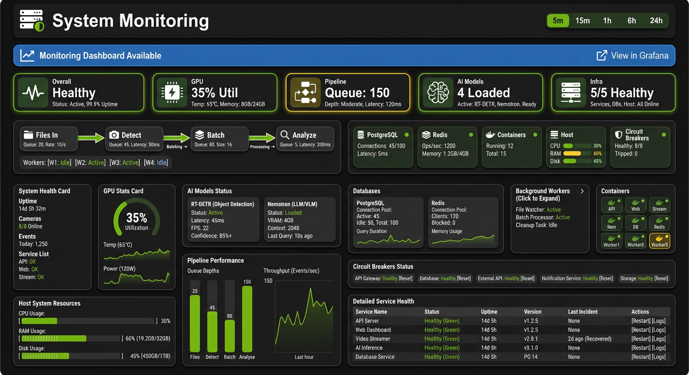

# System Page Pipeline Visualization

This document describes the pipeline visualization features on the System Monitoring page, which provide real-time insight into the AI processing pipeline's health and performance.

## Table of Contents

1. [Overview](#overview)
2. [Pipeline Flow Diagram Component](#pipeline-flow-diagram-component)
3. [Pipeline Stages](#pipeline-stages)
4. [Health Status Indicators](#health-status-indicators)
5. [Background Workers Grid](#background-workers-grid)
6. [Pipeline Metrics Panel](#pipeline-metrics-panel)
7. [Infrastructure Status Grid](#infrastructure-status-grid)
8. [Data Sources and Refresh](#data-sources-and-refresh)
9. [Related Components](#related-components)

---

## Overview

The System page provides operators with real-time visibility into the AI processing pipeline through two complementary visualization components:

1. **PipelineFlowVisualization** - A visual diagram showing the pipeline stages with flow arrows and per-stage metrics
2. **PipelineMetricsPanel** - A detailed metrics card showing queue depths, latencies, and throughput charts

These components help operators:

- Monitor pipeline health at a glance
- Identify bottlenecks and backlogs
- Track processing latencies across stages
- Verify background worker status
- Detect performance degradation early

### Architecture Context

```
+------------------+     +------------------+     +------------------+     +------------------+
|     Files        |---->|     Detect       |---->|     Batch        |---->|     Analyze      |
| (File Watcher)   |     | (RT-DETRv2)      |     | (Aggregator)     |     | (Nemotron LLM)   |
+------------------+     +------------------+     +------------------+     +------------------+
     Throughput:             Queue Depth:          Pending Items:          Queue Depth:
     XX/min                  N items               N items                 N items
                             Avg: XXms                                     Avg: XXs
```

---

## Pipeline Flow Diagram Component

The `PipelineFlowVisualization` component (`frontend/src/components/system/PipelineFlowVisualization.tsx`) renders a visual representation of the four-stage AI pipeline.



_System page wireframe showing the pipeline visualization, infrastructure status grid, and metrics panels layout._

### Visual Layout

```
+------------+     +------------+     +------------+     +------------+
|  [Folder]  | --> |  [Search]  | --> | [Package]  | --> |  [Brain]   |
|   Files    |     |   Detect   |     |   Batch    |     |  Analyze   |
| ---------- |     | ---------- |     | ---------- |     | ---------- |
|  12/min    |     | Queue: 0   |     | 3 pending  |     | Queue: 0   |
|            |     | Avg: 14.0s |     |            |     | Avg: 2.1s  |
+------------+     +------------+     +------------+     +------------+

         Total Pipeline: 16s avg | 48s p95 | 102s p99

+----------------------------------------------------------------+
| Background Workers                              [8/8 Running]   |
|    Det   Ana  Batch  Clean  Watch   GPU   Metr  Bcast          |
|     o     o     o      o      o      o     o      o            |
|                                                                |
|                     [Expand Details]                           |
+----------------------------------------------------------------+
```

### Component Props

| Prop                | Type                       | Description                                       |
| ------------------- | -------------------------- | ------------------------------------------------- | ----------------------------- |
| `stages`            | `PipelineStageData[]`      | Array of stage configurations with metrics        |
| `workers`           | `BackgroundWorkerStatus[]` | Array of background worker statuses               |
| `totalLatency`      | `TotalLatency`             | Pipeline-wide latency metrics (avg, p95, p99)     |
| `baselineLatencies` | `BaselineLatencies`        | Optional baseline latencies for health comparison |
| `isLoading`         | `boolean`                  | Shows loading skeleton when true                  |
| `error`             | `string                    | null`                                             | Displays error state when set |
| `className`         | `string`                   | Additional CSS classes                            |

### Stage Icons

Each pipeline stage uses a distinct icon from the Lucide icon library:

| Stage   | Icon      | Description                 |
| ------- | --------- | --------------------------- |
| Files   | `Folder`  | File system monitoring      |
| Detect  | `Search`  | RT-DETRv2 object detection  |
| Batch   | `Package` | Detection batch aggregation |
| Analyze | `Brain`   | Nemotron LLM risk analysis  |

---

## Pipeline Stages

### 1. Files Stage

**Purpose:** Monitors the file watcher service that detects new camera uploads.

**Metrics Displayed:**

- **Throughput** - Images processed per minute (e.g., "12/min")

**Data Source:** File watcher service statistics

### 2. Detect Stage (RT-DETRv2)

**Purpose:** Shows the object detection queue and processing performance.

**Metrics Displayed:**

- **Queue Depth** - Number of images waiting for detection
- **Average Latency** - Mean time to process an image (typically 30-50ms)
- **P95 Latency** - 95th percentile processing time

**Data Source:** Redis `detection_queue` length and latency telemetry

**Health Thresholds:**

- Healthy: Queue <= 10, latency < 2x baseline
- Degraded: Queue 11-50, or latency 2-5x baseline
- Critical: Queue > 50, or latency > 5x baseline

### 3. Batch Stage

**Purpose:** Shows the batch aggregator that groups related detections.

**Metrics Displayed:**

- **Pending** - Number of items waiting to be batched

**Data Source:** Batch aggregator service statistics

**Context:** Batches accumulate over 30-90 second windows before being sent for LLM analysis. See [AI Pipeline Architecture](ai-pipeline.md#batching-logic) for details.

### 4. Analyze Stage (Nemotron LLM)

**Purpose:** Shows the LLM analysis queue and processing performance.

**Metrics Displayed:**

- **Queue Depth** - Number of batches waiting for analysis
- **Average Latency** - Mean time for risk analysis (typically 2-5 seconds)
- **P95 Latency** - 95th percentile analysis time

**Data Source:** Redis `analysis_queue` length and latency telemetry

**Health Thresholds:**

- Healthy: Queue <= 10, latency < 2x baseline
- Degraded: Queue 11-50, or latency 2-5x baseline
- Critical: Queue > 50, or latency > 5x baseline

---

## Health Status Indicators

Each pipeline stage displays a colored border indicating its health status:

| Status       | Border Color                 | Conditions                                  |
| ------------ | ---------------------------- | ------------------------------------------- |
| **Healthy**  | Green (`border-emerald-500`) | Queue depth <= 10 AND latency < 2x baseline |
| **Degraded** | Yellow (`border-yellow-500`) | Queue depth 11-50 OR latency 2-5x baseline  |
| **Critical** | Red (`border-red-500`)       | Queue depth > 50 OR latency > 5x baseline   |

### Health Calculation Algorithm

```typescript
function getStageHealth(
  metrics: StageMetrics,
  stageId: string,
  baselineLatencies?: BaselineLatencies
): 'healthy' | 'degraded' | 'critical' {
  const queueDepth = metrics.queueDepth;
  const avgLatency = metrics.avgLatency;
  const baseline = baselineLatencies?.[stageId];

  // Check queue depth first
  if (queueDepth !== undefined) {
    if (queueDepth > 50) return 'critical';
    if (queueDepth > 10) return 'degraded';
  }

  // Check latency against baseline
  if (avgLatency !== null && avgLatency !== undefined && baseline) {
    const ratio = avgLatency / baseline;
    if (ratio > 5) return 'critical';
    if (ratio > 2) return 'degraded';
  }

  return 'healthy';
}
```

---

## Background Workers Grid

The component displays a grid of background worker status indicators below the pipeline diagram.

### Workers Displayed

| Worker ID              | Display Name | Purpose                   |
| ---------------------- | ------------ | ------------------------- |
| `detection_worker`     | Det          | Processes detection queue |
| `analysis_worker`      | Ana          | Processes analysis queue  |
| `batch_timeout_worker` | Batch        | Closes expired batches    |
| `cleanup_service`      | Clean        | Removes old data          |
| `file_watcher`         | Watch        | Monitors camera uploads   |
| `gpu_monitor`          | GPU          | Collects GPU statistics   |
| `metrics_worker`       | Metr         | Gathers system metrics    |
| `system_broadcaster`   | Bcast        | WebSocket status updates  |

### Worker Status Indicators

| Status       | Dot Color                | Description                               |
| ------------ | ------------------------ | ----------------------------------------- |
| **Running**  | Green (`bg-emerald-500`) | Worker is active and healthy              |
| **Stopped**  | Red (`bg-red-500`)       | Worker has stopped                        |
| **Degraded** | Yellow (`bg-yellow-500`) | Worker is running but experiencing issues |

### Expand/Collapse Details

Users can click "Expand Details" to see a detailed list view showing:

- Full worker IDs
- Status text for each worker

---

## Pipeline Metrics Panel

The `PipelineMetricsPanel` component (`frontend/src/components/system/PipelineMetricsPanel.tsx`) provides complementary detailed metrics in a card format.

### Sections

#### 1. Queue Depths Row

Displays inline badges for detection and analysis queue depths:

```
+------------------------------------------------------------------+
| [Layers Icon] Queues    Detect: [3]   Analyze: [1]               |
+------------------------------------------------------------------+
```

Color coding:

- Gray: Queue = 0
- Green: Queue 1-5
- Yellow: Queue 6-10
- Red: Queue > 10

#### 2. Latency Grid

Three-column grid showing latency statistics for each processing stage:

```
+----------------+----------------+----------------+
|   Detection    |     Batch      |   Analysis     |
|   [14.0s]      |    [--]        |    [2.1s]      |
| 43.0s / 68.0s  |   -- / --      | 4.8s / 8.2s    |
+----------------+----------------+----------------+
        (avg / p95 / p99 shown for each stage)
```

Warning highlighting applies when latency exceeds the configured threshold (default: 10,000ms).

#### 3. Throughput Section

Shows current throughput rates and a sparkline chart:

```
+------------------------------------------------------------------+
| [Zap Icon] Throughput    Detect: 45/min   Analyze: 12/min        |
|                                                                   |
|  ~~~~~~~~~~~~~~~~~~~~~~~~~~~~~~~~~~~~~~~~~ (Area chart)           |
+------------------------------------------------------------------+
```

The chart displays detections and analyses per minute over time (emerald and blue colors).

#### 4. Warning Banner

When queue backup is detected, a warning banner appears:

```
+------------------------------------------------------------------+
| [!] Queue backup detected. Processing may be delayed.             |
+------------------------------------------------------------------+
```

---

## Infrastructure Status Grid

The `InfrastructureStatusGrid` component (`frontend/src/components/system/InfrastructureStatusGrid.tsx`) provides a compact 5-card grid showing infrastructure health status with expandable detail panels.

### Visual Layout

```
+-------------+-------------+-------------+-------------+-------------+
|  [Database] |  [Server]   |   [Box]     | [Monitor]   |   [Zap]     |
| PostgreSQL  |    Redis    | Containers  |    Host     |  Circuits   |
|     [ok]    |    [ok]     |    [ok]     |    [ok]     |    [ok]     |
|    12ms     |   1.2k/s    |    5/5      |  CPU 45%    |    4/4      |
|     [v]     |     [v]     |     [v]     |     [v]     |     [v]     |
+-------------+-------------+-------------+-------------+-------------+

(Clicking any card expands its detail panel below)

+------------------------------------------------------------------+
|  [Database Icon] PostgreSQL Details                               |
|  Pool usage: [=========    ] 8/20 active                          |
|  Query latency: 12ms                                              |
|  Active queries: 3                                                |
|  DB size: 2.4 GB                                                  |
+------------------------------------------------------------------+
```

### Component Props

| Prop           | Type                                             | Description                                    |
| -------------- | ------------------------------------------------ | ---------------------------------------------- |
| `data`         | `InfrastructureData`                             | Infrastructure data from API                   |
| `loading`      | `boolean`                                        | Shows loading skeleton when true               |
| `error`        | `string \| null`                                 | Displays error state when set                  |
| `onCardClick`  | `(cardId: InfrastructureCardId \| null) => void` | Callback when a card is clicked                |
| `expandedCard` | `InfrastructureCardId \| null`                   | Currently expanded card (null = all collapsed) |
| `className`    | `string`                                         | Additional CSS classes                         |

### Infrastructure Cards

The grid displays five infrastructure service cards:

| Card           | Icon       | Color  | Primary Metric      | Description                 |
| -------------- | ---------- | ------ | ------------------- | --------------------------- |
| **PostgreSQL** | `Database` | Blue   | Query latency (ms)  | Primary database health     |
| **Redis**      | `Server`   | Red    | Operations/sec      | Cache and queue performance |
| **Containers** | `Box`      | Purple | Running/Total count | Docker container health     |
| **Host**       | `Monitor`  | Orange | CPU utilization (%) | Host system resources       |
| **Circuits**   | `Zap`      | Green  | Healthy/Total count | Circuit breaker states      |

### Card Status Indicators

Each card displays a status icon and colored border based on health:

| Status        | Icon            | Border Color                 | Conditions                     |
| ------------- | --------------- | ---------------------------- | ------------------------------ |
| **Healthy**   | Green checkmark | Gray (green on hover)        | Service operating normally     |
| **Degraded**  | Yellow triangle | Yellow (`border-yellow-500`) | Service experiencing issues    |
| **Unhealthy** | Red X           | Red (`border-red-500`)       | Service failing or unreachable |
| **Unknown**   | Gray circle     | Gray (`border-gray-700`)     | Status cannot be determined    |

### Accordion Behavior

- **Single expansion**: Only one card can be expanded at a time
- **Toggle**: Clicking an expanded card collapses it
- **Switch**: Clicking a different card switches the expansion
- **Visual indicator**: Expanded cards show a green ring and rotated chevron

### Expanded Detail Panels

#### PostgreSQL Details

Shows database connection pool and query metrics:

| Metric         | Description                              | Warning Threshold |
| -------------- | ---------------------------------------- | ----------------- |
| Pool usage     | Active/max connections with progress bar | > 80% pool usage  |
| Query latency  | Average query response time (ms)         | > 100ms           |
| Active queries | Currently running queries                | > 50 queries      |
| DB size        | Total database size in GB                | Informational     |

#### Redis Details

Shows cache server performance metrics:

| Metric            | Description                     | Warning Threshold |
| ----------------- | ------------------------------- | ----------------- |
| Memory usage      | Current memory consumption (MB) | > 80% of max      |
| Ops/sec           | Operations per second           | Informational     |
| Connected clients | Number of active connections    | > 100 clients     |
| Hit rate          | Cache hit ratio percentage      | < 80%             |

#### Containers Details

Shows status table for all Docker containers:

| Column    | Description                                  |
| --------- | -------------------------------------------- |
| Container | Container name (truncated if long)           |
| Status    | running (green) / stopped (red) / restarting |
| CPU       | CPU utilization percentage                   |
| Memory    | Memory usage in MB                           |
| Restarts  | Restart count (yellow if >= 3)               |

#### Host Details

Shows system resource utilization with progress bars:

| Metric | Description                      | Color Thresholds                      |
| ------ | -------------------------------- | ------------------------------------- |
| CPU    | Processor utilization percentage | Green < 75%, Yellow < 90%, Red >= 90% |
| Memory | RAM usage (used/total GB)        | Green < 75%, Yellow < 90%, Red >= 90% |
| Disk   | Storage usage (used/total GB)    | Green < 75%, Yellow < 90%, Red >= 90% |

#### Circuit Breakers Details

Shows status table for all circuit breakers:

| Column   | Description               | Color                |
| -------- | ------------------------- | -------------------- |
| Circuit  | Circuit breaker name      | Based on state       |
| State    | closed / open / half_open | Green / Red / Yellow |
| Failures | Cumulative failure count  | N/A                  |

### Type Definitions

```typescript
interface InfrastructureData {
  postgresql: PostgreSQLDetails | null;
  redis: RedisDetails | null;
  containers: ContainerDetails | null;
  host: HostDetails | null;
  circuits: CircuitDetails | null;
}

interface PostgreSQLDetails {
  status: 'healthy' | 'degraded' | 'unhealthy';
  latency_ms: number;
  pool_active: number;
  pool_max: number;
  active_queries: number;
  db_size_gb: number;
}

interface RedisDetails {
  status: 'healthy' | 'degraded' | 'unhealthy';
  ops_per_sec: number;
  memory_mb: number;
  connected_clients: number;
  hit_rate: number;
}

interface ContainerDetails {
  status: 'healthy' | 'degraded' | 'unhealthy';
  running: number;
  total: number;
  containers: ContainerInfo[];
}

interface ContainerInfo {
  name: string;
  status: 'running' | 'stopped' | 'restarting';
  cpu_percent: number;
  memory_mb: number;
  restart_count: number;
}

interface HostDetails {
  status: 'healthy' | 'degraded' | 'unhealthy';
  cpu_percent: number;
  memory_used_gb: number;
  memory_total_gb: number;
  disk_used_gb: number;
  disk_total_gb: number;
}

interface CircuitDetails {
  status: 'healthy' | 'degraded' | 'unhealthy';
  healthy: number;
  total: number;
  breakers: CircuitBreakerInfo[];
}

interface CircuitBreakerInfo {
  name: string;
  state: 'closed' | 'open' | 'half_open';
  failure_count: number;
}
```

### Grid Responsiveness

The card grid adapts to different screen sizes:

| Screen Size  | Columns | Description             |
| ------------ | ------- | ----------------------- |
| Mobile       | 2       | 2 cards per row         |
| Tablet (sm)  | 3       | 3 cards per row         |
| Desktop (lg) | 5       | All cards in single row |

### Loading and Error States

**Loading State:**

- Shows animated skeleton grid (5 placeholder cards)
- Test ID: `infrastructure-grid-loading`

**Error State:**

- Shows red-bordered error message with alert icon
- Displays the error message text
- Test ID: `infrastructure-grid-error`

### Integration with SystemMonitoringPage

The InfrastructureStatusGrid is currently referenced in documentation but the full integration uses individual panels (DatabasesPanel, ContainersPanel, HostSystemPanel, CircuitBreakerPanel) for more detailed views. The compact grid is available for summary views where space is limited.

---

## Data Sources and Refresh

### Backend API Endpoint

Pipeline telemetry data is fetched from the `/api/system/telemetry` endpoint:

**Request:**

```
GET /api/system/telemetry
```

**Response:**

```json
{
  "queues": {
    "detection_queue": 3,
    "analysis_queue": 1
  },
  "latencies": {
    "detect": {
      "avg_ms": 14000,
      "p95_ms": 43000,
      "p99_ms": 68000,
      "sample_count": 150
    },
    "batch": {
      "avg_ms": null,
      "p95_ms": null,
      "p99_ms": null,
      "sample_count": 0
    },
    "analyze": {
      "avg_ms": 2100,
      "p95_ms": 4800,
      "p99_ms": 8200,
      "sample_count": 45
    }
  },
  "timestamp": "2026-01-04T12:30:00.000000Z"
}
```

### Refresh Rates

| Data Type          | Refresh Rate                        | Method                         |
| ------------------ | ----------------------------------- | ------------------------------ |
| Queue depths       | 5 seconds                           | Polling via `fetchTelemetry()` |
| Latency metrics    | 5 seconds                           | Polling via `fetchTelemetry()` |
| GPU statistics     | 5 seconds                           | Polling via `fetchGPUStats()`  |
| Worker status      | 10 seconds                          | `useHealthStatus` hook         |
| Throughput history | Calculated on each telemetry update | Delta calculation              |

### WebSocket Updates

Real-time performance updates are also delivered via WebSocket on the `/ws/system` channel with `performance_update` message type. See [Real-Time Architecture](real-time.md) for details.

### Data Hooks

The System page uses several React hooks to manage data:

| Hook                    | Purpose                                  |
| ----------------------- | ---------------------------------------- |
| `usePerformanceMetrics` | Aggregates performance data with history |
| `useHealthStatus`       | Fetches service health including workers |
| `useModelZooStatus`     | Fetches AI model status                  |

---

## Related Components

### SystemMonitoringPage

The parent page component (`frontend/src/components/system/SystemMonitoringPage.tsx`) that integrates all system monitoring panels including:

- System Health card
- GPU Stats
- AI Models Panel
- Pipeline Metrics Panel
- Databases Panel
- Workers Panel
- Containers Panel
- Host System Panel

### SystemSummaryRow

A compact summary row (`frontend/src/components/system/SystemSummaryRow.tsx`) that provides at-a-glance indicators for:

- Overall system health
- GPU status
- Pipeline status (queue depth + throughput)
- AI Models status
- Infrastructure status

Clicking any indicator scrolls to the corresponding section.

### InfrastructureStatusGrid

A compact 5-card grid (`frontend/src/components/system/InfrastructureStatusGrid.tsx`) showing infrastructure health at a glance:

- **PostgreSQL** - Database connection pool and query latency
- **Redis** - Cache operations per second and memory usage
- **Containers** - Running container count and individual status
- **Host** - CPU, memory, and disk utilization
- **Circuits** - Circuit breaker states (closed/open/half_open)

Each card is clickable to expand detailed metrics in an accordion panel below the grid. See [Infrastructure Status Grid](#infrastructure-status-grid) for complete documentation.

---

## Related Documentation

| Document                                   | Description                                |
| ------------------------------------------ | ------------------------------------------ |
| [AI Pipeline Architecture](ai-pipeline.md) | Detailed pipeline flow with batching logic |
| [Real-Time Architecture](real-time.md)     | WebSocket channels and message formats     |
| [Frontend Hooks](frontend-hooks.md)        | Custom React hooks for data fetching       |
| [Resilience](resilience.md)                | Error handling and circuit breakers        |

---

_This document describes the pipeline visualization components for the Home Security Intelligence system. For implementation details, see the source files referenced in the frontmatter._
