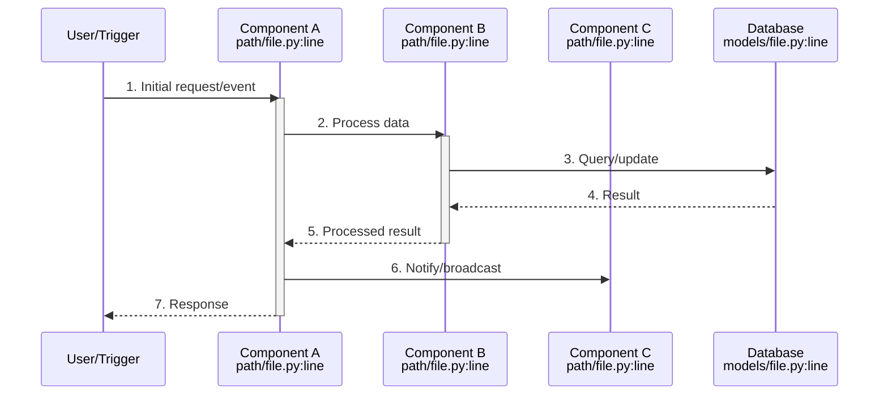
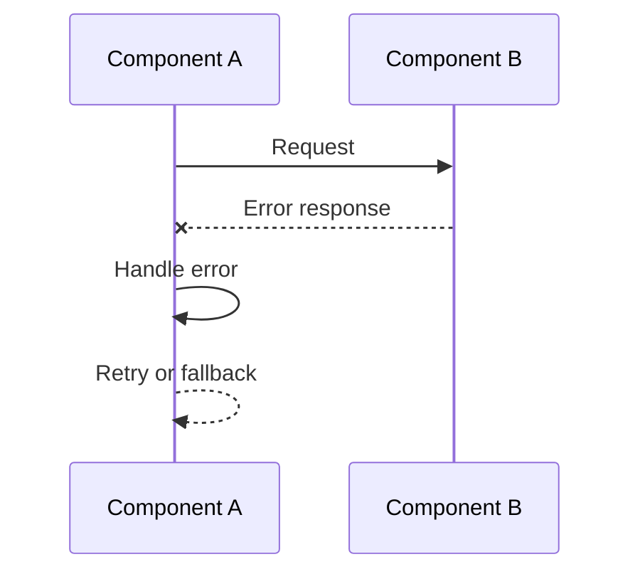

# Dataflow: {Flow Name}

> {Trigger} -> {End State}

**Key Files:**

- `entry/point/file.py:lines` - Flow entry point
- `processing/file.py:lines` - Core processing
- `output/file.py:lines` - Flow completion

## Trigger

{What initiates this flow. Be specific about the event, user action, or system condition that starts this sequence.}

**Entry Point:** `path/to/entry.py:line`

**Trigger Conditions:**

- Condition 1
- Condition 2
- Condition 3

## End State

{What constitutes successful completion of this flow. Describe the expected outcome and any side effects.}

**Success Criteria:**

- Criterion 1
- Criterion 2
- Criterion 3

**Side Effects:**

- Database updates
- Cache invalidation
- Event emissions

## Sequence Diagram



## Step-by-Step Trace

### Step 1: {Action Name}

**Location:** `path/to/file.py:67-89`

**Input:**

```json
{
  "field": "example value",
  "another_field": 123
}
```

**Processing:**
{Detailed description of what happens at this step. Include any validation, transformation, or business logic.}

Key code path:

```python
# From path/to/file.py:67-75
def handle_input(self, data: InputType) -> ProcessedType:
    # Validation
    validated = self.validate(data)
    # Processing
    return self.process(validated)
```

**Output:**

```json
{
  "processed_field": "transformed value",
  "status": "success"
}
```

**Next:** Step 2

---

### Step 2: {Action Name}

**Location:** `path/to/another/file.py:23-45`

**Input:**
{Output from Step 1}

**Processing:**
{Description of this step's processing.}

**Output:**

```json
{
  "result": "value"
}
```

**Next:** Step 3

---

### Step 3: {Action Name}

**Location:** `path/to/final/file.py:100-120`

**Input:**
{Output from Step 2}

**Processing:**
{Final processing and completion.}

**Output:**
{Final result or side effects}

**Next:** Flow complete

## Error Paths

### Error Path 1: {Error Condition}

**Trigger:** When {condition} occurs at Step {N}.

**Sequence:**



**Recovery:** {How the system recovers or what the user sees.}

### Error Path 2: {Another Error Condition}

**Trigger:** When {condition} occurs.

**Handling:** {How it's handled.}

## Performance Characteristics

| Metric             | Typical Value | Notes              |
| ------------------ | ------------- | ------------------ |
| End-to-end latency | ~Xms          | Under normal load  |
| Database queries   | N             | Per flow execution |
| External API calls | N             | Per flow execution |

## Monitoring

**Key Metrics:**

- `metric_name` - What it measures
- `another_metric` - What it measures

**Log Patterns:**

```
INFO: Flow started - {flow_id}
DEBUG: Step 1 complete - {details}
INFO: Flow completed - {flow_id} in {duration}ms
```

## Related Dataflows

- [Related Flow 1](./related-flow.md) - How flows interact
- [Related Flow 2](./another-flow.md) - Dependency relationship
