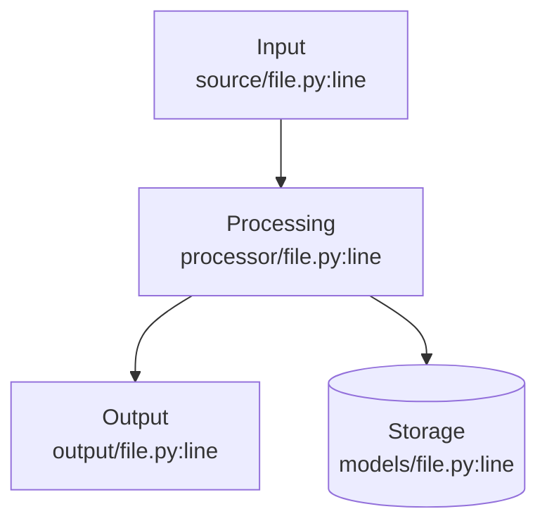

# {Document Title}

> {One-line description summarizing what this document covers}

**Key Files:**

- `primary/file/path.py:lines` - Primary implementation
- `secondary/file/path.py:lines` - Supporting implementation
- `tests/path/test_file.py:lines` - Test coverage

## Overview

{What this component/feature/system does. Explain its purpose and role in the larger architecture. Keep this to 2-3 paragraphs.}

{Second paragraph with more detail about how it works at a high level.}

## Architecture



## Implementation Details

### {Primary Section}

{Description of the main functionality with code citations.}

The `ClassName` (`path/to/file.py:start-end`) handles the core logic:

```python
# From path/to/file.py:start-end
def example_method(self, param: Type) -> ReturnType:
    """Brief description of what this does."""
    # Implementation details
    pass
```

### {Secondary Section}

{Description of supporting functionality.}

Key implementation points:

1. **Point 1** - Explanation (`path/to/file.py:line`)
2. **Point 2** - Explanation (`path/to/file.py:line`)
3. **Point 3** - Explanation (`path/to/file.py:line`)

## Configuration

| Setting           | Type  | Default     | Description        |
| ----------------- | ----- | ----------- | ------------------ |
| `SETTING_NAME`    | `str` | `"default"` | What this controls |
| `ANOTHER_SETTING` | `int` | `100`       | What this controls |

Configuration is loaded from `backend/core/config.py:lines`.

## Error Handling

### {Error Type 1}

**When it occurs:** Description of the condition.

**Handling:** How the system responds.

**Recovery:** How to recover or what happens automatically.

```python
# From path/to/file.py:lines
try:
    # Operation that might fail
    pass
except SpecificError as e:
    # How it's handled
    pass
```

### {Error Type 2}

**When it occurs:** Description.

**Handling:** Response.

## Testing

Test coverage is provided in `tests/path/test_file.py`.

| Test                  | Purpose                      | Location                       |
| --------------------- | ---------------------------- | ------------------------------ |
| `test_happy_path`     | Verifies normal operation    | `tests/path/test_file.py:line` |
| `test_error_handling` | Verifies error cases         | `tests/path/test_file.py:line` |
| `test_edge_case`      | Verifies boundary conditions | `tests/path/test_file.py:line` |

### Running Tests

```bash
# Run specific tests
uv run pytest tests/path/test_file.py -v

# Run with coverage
uv run pytest tests/path/test_file.py --cov=module_name
```

## Examples

### Example 1: {Use Case}

```python
# Example usage
from module import Class

instance = Class(config)
result = instance.method(input_data)
```

### Example 2: {Another Use Case}

```python
# Another example
```

## Related Documents

- [Related Document 1](./related-doc.md) - How it relates
- [Related Document 2](../other-hub/doc.md) - Cross-hub relationship
- [External Resource](https://example.com) - External documentation
