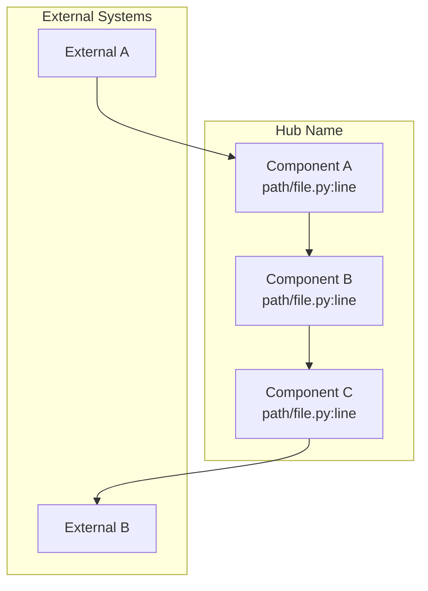

# {Hub Name}

> {One-line description}

## Overview

{2-3 paragraph overview explaining what this hub covers, why it exists, and how it fits into the overall system architecture.}

{Second paragraph providing more context about the key concepts and patterns used in this area.}

{Third paragraph (optional) discussing any important design decisions or trade-offs relevant to this hub.}

## Documents

| Document                               | Description                                    | Key Files                             |
| -------------------------------------- | ---------------------------------------------- | ------------------------------------- |
| [document-name.md](./document-name.md) | Brief description of what this document covers | `path/to/primary/file.py`             |
| [another-doc.md](./another-doc.md)     | Another document description                   | `path/to/file.py`, `path/to/other.py` |

## Architecture Diagram

## Quick Reference

| Component        | File                            | Purpose                           |
| ---------------- | ------------------------------- | --------------------------------- |
| ComponentName    | `path/to/file.py:line`          | Brief description of what it does |
| AnotherComponent | `path/to/another.py:line-range` | Brief description                 |
| ServiceClass     | `path/to/service.py:line`       | Brief description                 |

## Key Concepts

### Concept 1

Brief explanation of an important concept in this hub.

### Concept 2

Brief explanation of another important concept.

## Configuration

| Setting        | Location                      | Default | Description                |
| -------------- | ----------------------------- | ------- | -------------------------- |
| `SETTING_NAME` | `backend/core/config.py:line` | `value` | What this setting controls |

## Related Hubs

- [Related Hub 1](../related-hub-1/README.md) - How it relates
- [Related Hub 2](../related-hub-2/README.md) - How it relates
- [Related Hub 3](../related-hub-3/README.md) - How it relates
