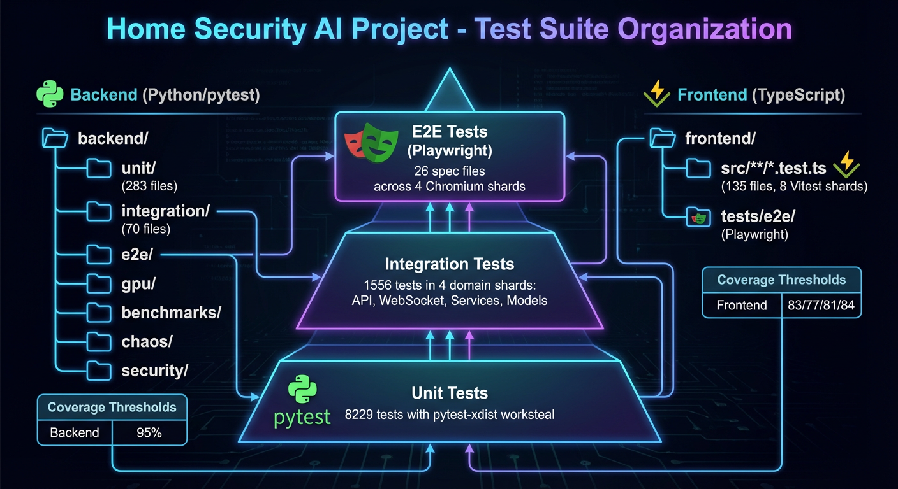
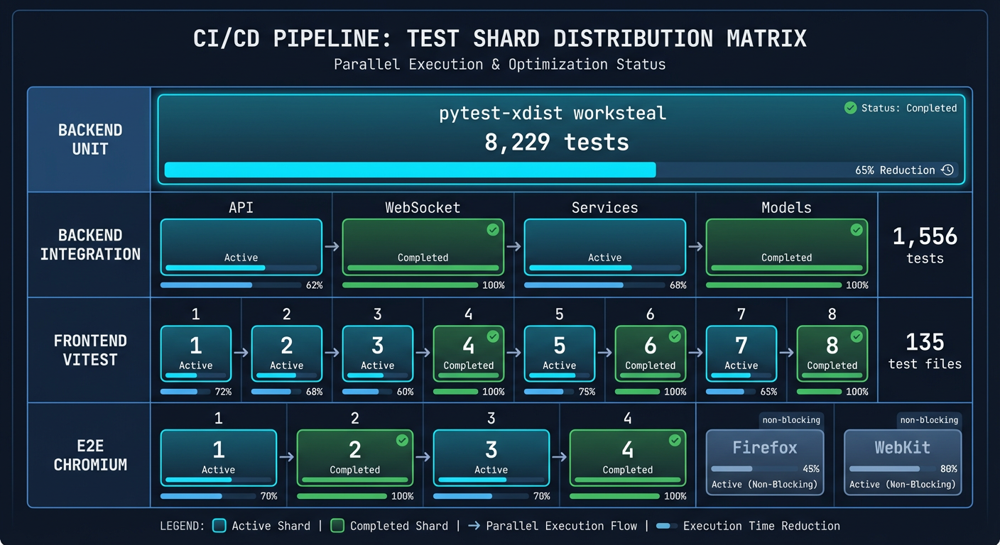
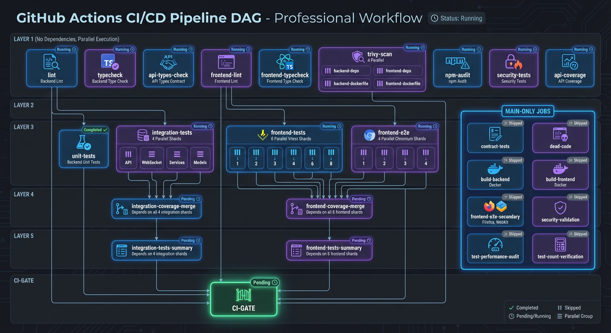

# Testing Hub

This hub documents the comprehensive testing infrastructure for the AI-powered home security monitoring system. The system follows **Test-Driven Development (TDD)** practices with a multi-layered testing strategy.

## Test Pyramid

```
                    /\
                   /  \
                  / E2E \              < 2% - Critical user flows
                 /--------\
                / Contract  \          < 5% - API contracts, WebSocket messages
               /  Security   \
              /---------------\
             /   Integration   \       ~15% - Multi-component workflows
            /-------------------\
           /        Unit         \     ~80% - Isolated component testing
          /-----------------------\
```

## Documentation Index

| Document                                          | Purpose                                       |
| ------------------------------------------------- | --------------------------------------------- |
| [Unit Testing](unit-testing.md)                   | pytest patterns, fixtures, mocking strategies |
| [Integration Testing](integration-testing.md)     | Database tests, API tests, parallel execution |
| [E2E Testing](e2e-testing.md)                     | Playwright patterns, Page Object Model        |
| [Test Fixtures](test-fixtures.md)                 | Factory patterns, Hypothesis strategies       |
| [Coverage Requirements](coverage-requirements.md) | Coverage gates, CI enforcement                |

## Quick Reference

### Running Tests

```bash
# Full validation (recommended before PRs)
./scripts/validate.sh

# Backend unit tests (parallel)
uv run pytest backend/tests/unit/ -n auto --dist=worksteal

# Backend integration tests (serial; pyproject addopts default to -n 8,
# so -n0 overrides them — matches the project quick reference and CI rerun
# tiers, avoiding concurrent schema-creation deadlocks)
uv run pytest backend/tests/integration/ -n0 --timeout=30

# Frontend tests
cd frontend && npm test

# E2E tests (Playwright)
cd frontend && npx playwright test
```

### Test Structure



```
backend/tests/
  conftest.py              # Root fixtures (database, Redis, HTTP client)
  factories.py             # factory_boy test data factories
  hypothesis_strategies.py # Hypothesis strategies for property-based testing
  strategies.py            # Additional domain-specific strategies
  unit/                    # ~680 test files - isolated component testing
  integration/             # ~200 test files - multi-component workflows
  e2e/                     # Pipeline integration tests
  benchmarks/              # Performance regression detection
  chaos/                   # Chaos engineering failure tests
  contracts/               # API contract validation
  security/                # Security vulnerability tests
  gpu/                     # GPU service integration tests

frontend/
  src/__tests__/           # Vitest component/hook tests
  tests/e2e/               # Playwright E2E tests
    fixtures/              # API mocks, test data
    pages/                 # Page Object Model
    specs/                 # Test specifications
```

### Coverage Requirements

See [Coverage Requirements](coverage-requirements.md) for the full model.

| Test Type                | Minimum                             | Enforcement                                              |
| ------------------------ | ----------------------------------- | -------------------------------------------------------- |
| Backend Combined         | 80%                                 | Absolute floor: `validate.sh`, `nightly-full-gate.yml`   |
| Backend PR diff gate     | 85 (relative baseline, ruling A7.1) | Diff gate on merged shard data, 0.5pp noise band         |
| Backend Unit tier        | 84                                  | CI merge step, only when the tier fully passed           |
| Backend Integration tier | 37                                  | CI merge step, only when the tier fully passed           |
| Frontend Statements      | 80                                  | `merge-shard-coverage.mjs --enforce` (all shards passed) |
| Frontend Branches        | 74.6                                | same                                                     |
| Frontend Functions       | 78.4                                | same                                                     |
| Frontend Lines           | 80.9                                | same                                                     |

### Key Configuration Files

| File                                                              | Purpose                                                       |
| ----------------------------------------------------------------- | ------------------------------------------------------------- |
| `pyproject.toml:529-568`                                          | Coverage configuration (`fail_under = 85` diff-gate baseline) |
| `pyproject.toml` (`[tool.pytest]`)                                | pytest configuration and markers                              |
| `frontend/vite.config.ts` (`test.coverage`, thresholds ~:400-433) | Vitest configuration and coverage thresholds                  |
| `frontend/playwright.config.ts`                                   | Playwright E2E configuration                                  |

## Testing Philosophy

### TDD Workflow

1. **RED**: Write a failing test that defines expected behavior
2. **GREEN**: Implement minimal code to make the test pass
3. **REFACTOR**: Improve code quality while keeping tests green

### Test Isolation

- **Unit tests**: All external dependencies mocked
- **Integration tests**: Real database, mocked Redis (per-worker isolation)
- **E2E tests**: Full stack with API mocks

### Parallel Execution



Backend tests support parallel execution via pytest-xdist:

- **Unit tests**: `-n auto --dist=worksteal` (fully parallel)
- **Integration tests**: pyproject `addopts` defaults to `-n 8
--dist=worksteal`; CI shards suites across jobs (xdist inside each
  shard), and the flaky-rerun tier runs `-n0` because concurrent schema
  creation can deadlock

Each pytest-xdist worker gets its own PostgreSQL database (`security_test_gw0`, etc.) for complete isolation.

## CI/CD Pipeline



The CI/CD pipeline orchestrates test execution across multiple stages with parallelization for optimal performance. The DAG structure ensures proper ordering of build, lint, unit test, integration test, and deployment stages.

## Related Documentation

- [TDD Workflow Guide](../../developer/testing-workflow.md)
- [Testing Guide](../../developer/testing.md)
- [Testing Patterns](../../developer/patterns/AGENTS.md)
- [Backend Tests AGENTS.md](../../../backend/tests/AGENTS.md)
