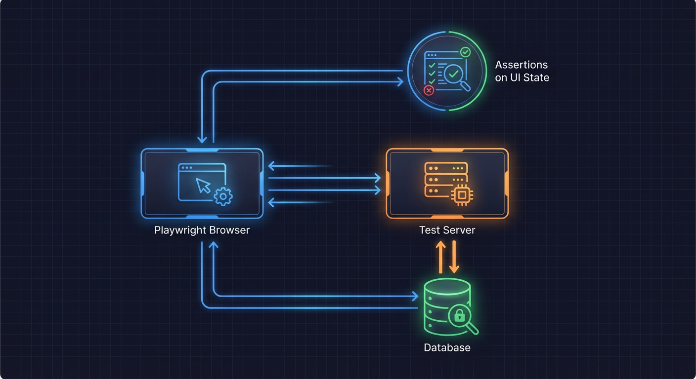
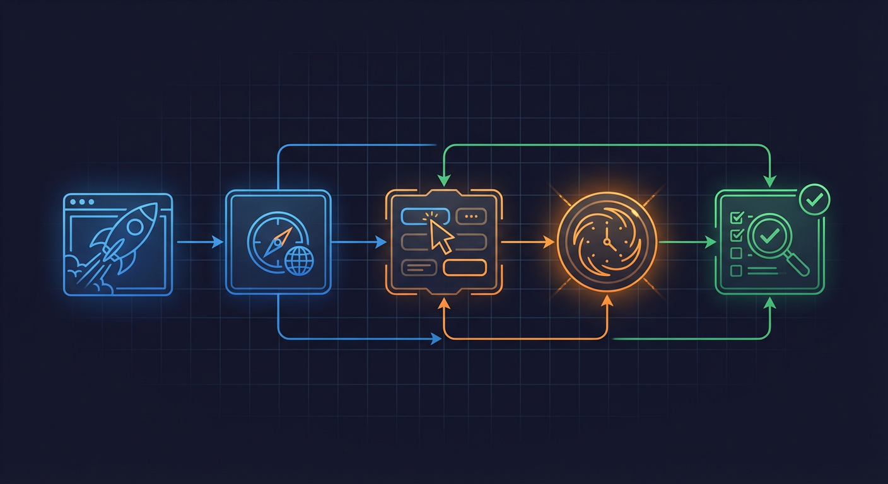

# End-to-End Testing



End-to-end (E2E) tests verify complete user flows through the application. The frontend uses Playwright for browser automation, while the backend has pipeline integration tests.

## Overview



E2E tests sit at the top of the test pyramid (<2% of tests). They:

- Test complete user journeys
- Verify frontend-backend integration
- Use API mocks for deterministic behavior
- Run across multiple browsers

**Locations**:

- Frontend: `frontend/tests/e2e/`
- Backend: `backend/tests/e2e/`

## Frontend E2E Testing

### Technology Stack

- **Playwright**: Browser automation framework
- **Page Object Model**: Encapsulates page interactions
- **API Mocks**: Deterministic backend responses

### Directory Structure

```
frontend/tests/e2e/
  fixtures/
    index.ts              # Central fixture exports
    test-data.ts          # Mock data definitions
    api-mocks.ts          # API mock configuration
    websocket-mock.ts     # WebSocket mock utilities
    performance.ts        # Performance testing utilities
  pages/
    BasePage.ts           # Base page object class
    DashboardPage.ts      # Dashboard page object
    CameraPage.ts         # Camera detail page object
  specs/
    dashboard.spec.ts     # Dashboard tests
    cameras.spec.ts       # Camera management tests
    events.spec.ts        # Event viewing tests
```

### Playwright Configuration

From `frontend/playwright.config.ts:1-78`:

```typescript
import { defineConfig, devices } from '@playwright/test';

export default defineConfig({
  testDir: './tests/e2e',
  fullyParallel: true,
  forbidOnly: !!process.env.CI,
  retries: process.env.CI ? 2 : 0,
  workers: process.env.CI ? 1 : undefined,
  reporter: 'html',

  use: {
    baseURL: 'http://localhost:5173',
    trace: 'on-first-retry',
    screenshot: 'only-on-failure',
  },

  projects: [
    {
      name: 'chromium',
      use: { ...devices['Desktop Chrome'] },
    },
    {
      name: 'firefox',
      use: { ...devices['Desktop Firefox'] },
    },
    {
      name: 'webkit',
      use: { ...devices['Desktop Safari'] },
    },
  ],

  webServer: {
    command: 'npm run dev',
    url: 'http://localhost:5173',
    reuseExistingServer: !process.env.CI,
  },
});
```

### Page Object Model

#### Base Page

From `frontend/tests/e2e/pages/BasePage.ts:1-60`:

```typescript
import { Page, Locator, expect } from '@playwright/test';

export class BasePage {
  readonly page: Page;
  readonly loadingIndicator: Locator;
  readonly errorMessage: Locator;

  constructor(page: Page) {
    this.page = page;
    this.loadingIndicator = page.locator('[data-testid="loading"]');
    this.errorMessage = page.locator('[data-testid="error-message"]');
  }

  async waitForPageLoad(): Promise<void> {
    await this.loadingIndicator.waitFor({ state: 'hidden' });
  }

  async expectNoErrors(): Promise<void> {
    await expect(this.errorMessage).not.toBeVisible();
  }

  async goto(path: string): Promise<void> {
    await this.page.goto(path);
    await this.waitForPageLoad();
  }
}
```

#### Page Object Example

```typescript
import { Page, Locator, expect } from '@playwright/test';
import { BasePage } from './BasePage';

export class DashboardPage extends BasePage {
  readonly cameraGrid: Locator;
  readonly eventTimeline: Locator;
  readonly riskScoreCard: Locator;

  constructor(page: Page) {
    super(page);
    this.cameraGrid = page.locator('[data-testid="camera-grid"]');
    this.eventTimeline = page.locator('[data-testid="event-timeline"]');
    this.riskScoreCard = page.locator('[data-testid="risk-score-card"]');
  }

  async goto(): Promise<void> {
    await super.goto('/');
  }

  async getCameraCount(): Promise<number> {
    const cards = this.cameraGrid.locator('[data-testid="camera-card"]');
    return await cards.count();
  }

  async clickCamera(cameraId: string): Promise<void> {
    await this.cameraGrid.locator(`[data-testid="camera-${cameraId}"]`).click();
  }
}
```

### API Mocking

#### Mock Configuration

From `frontend/tests/e2e/fixtures/api-mocks.ts`:

```typescript
import { Page } from '@playwright/test';

export interface ApiMockConfig {
  cameras?: Camera[];
  events?: Event[];
  health?: HealthStatus;
  delay?: number;
}

export const defaultMockConfig: ApiMockConfig = {
  cameras: [
    { id: 'front_door', name: 'Front Door', status: 'online' },
    { id: 'driveway', name: 'Driveway', status: 'online' },
  ],
  events: [{ id: 1, camera_id: 'front_door', risk_score: 75 }],
  health: { status: 'healthy' },
};

export async function setupApiMocks(
  page: Page,
  config: ApiMockConfig = defaultMockConfig
): Promise<void> {
  // Mock cameras endpoint
  await page.route('**/api/cameras', async (route) => {
    if (config.delay) await new Promise((r) => setTimeout(r, config.delay));
    await route.fulfill({
      status: 200,
      contentType: 'application/json',
      body: JSON.stringify({ cameras: config.cameras }),
    });
  });

  // Mock events endpoint
  await page.route('**/api/events*', async (route) => {
    await route.fulfill({
      status: 200,
      contentType: 'application/json',
      body: JSON.stringify({ events: config.events, total: config.events?.length }),
    });
  });

  // Mock health endpoint
  await page.route('**/api/health', async (route) => {
    await route.fulfill({
      status: 200,
      contentType: 'application/json',
      body: JSON.stringify(config.health),
    });
  });
}
```

#### Custom Test Fixture

From `frontend/tests/e2e/fixtures/index.ts:1-67`:

```typescript
import { test as base, expect } from '@playwright/test';
import { setupApiMocks, defaultMockConfig, type ApiMockConfig } from './api-mocks';

export const test = base.extend<{
  autoMock: void;
  mockConfig: ApiMockConfig;
}>({
  // Default mock config - can be overridden per test
  mockConfig: [defaultMockConfig, { option: true }],

  // Auto-setup mocks before each test
  autoMock: [
    async ({ page, mockConfig }, use) => {
      // Disable product tour to prevent overlay blocking
      await page.addInitScript(() => {
        localStorage.setItem('nemotron-tour-completed', 'true');
      });

      await setupApiMocks(page, mockConfig);
      await use();
    },
    { auto: true },
  ],
});

export { expect };
```

### Test Data

From `frontend/tests/e2e/fixtures/test-data.ts`:

```typescript
export const mockCameras = [
  {
    id: 'front_door',
    name: 'Front Door',
    folder_path: '/export/foscam/front_door',
    status: 'online',
    created_at: '2024-01-15T10:00:00Z',
    last_seen_at: '2024-01-15T12:00:00Z',
  },
  {
    id: 'driveway',
    name: 'Driveway',
    folder_path: '/export/foscam/driveway',
    status: 'online',
    created_at: '2024-01-15T10:00:00Z',
    last_seen_at: '2024-01-15T12:00:00Z',
  },
];

export const mockEvents = [
  {
    id: 1,
    camera_id: 'front_door',
    batch_id: 'batch_001',
    risk_score: 75,
    risk_level: 'high',
    summary: 'Person detected at front door',
    started_at: '2024-01-15T11:00:00Z',
    ended_at: '2024-01-15T11:01:00Z',
  },
];

export const errorMockConfig: ApiMockConfig = {
  cameras: [],
  events: [],
  health: { status: 'unhealthy', error: 'Database connection failed' },
};
```

### Writing E2E Tests

#### Basic Test Structure

```typescript
import { test, expect } from '../fixtures';

test.describe('Dashboard', () => {
  test('displays camera grid with all cameras', async ({ page }) => {
    // Navigate to dashboard (mocks already set up)
    await page.goto('/');

    // Wait for content to load
    await page.waitForSelector('[data-testid="camera-grid"]');

    // Verify cameras are displayed
    const cameraCards = page.locator('[data-testid="camera-card"]');
    await expect(cameraCards).toHaveCount(2);
  });

  test('navigates to camera detail on click', async ({ page }) => {
    await page.goto('/');

    // Click on a camera
    await page.click('[data-testid="camera-front_door"]');

    // Verify navigation
    await expect(page).toHaveURL('/cameras/front_door');
  });
});
```

#### Overriding Mocks

```typescript
import { test, expect, errorMockConfig } from '../fixtures';

test.describe('Error Handling', () => {
  // Override mock config for this test group
  test.use({ mockConfig: errorMockConfig });

  test('displays error state when API fails', async ({ page }) => {
    await page.goto('/');

    // Verify error message is shown
    await expect(page.locator('[data-testid="error-message"]')).toBeVisible();
    await expect(page.locator('[data-testid="error-message"]')).toContainText(
      'Database connection failed'
    );
  });
});
```

#### WebSocket Testing

```typescript
import { test, expect } from '../fixtures';
import { createWebSocketMock } from '../fixtures/websocket-mock';

test('receives real-time event updates', async ({ page }) => {
  const wsMock = createWebSocketMock();

  await page.goto('/');

  // Simulate incoming event via WebSocket
  await wsMock.send({
    type: 'event_created',
    event: {
      id: 999,
      camera_id: 'front_door',
      risk_score: 90,
      summary: 'New detection',
    },
  });

  // Verify UI updates
  await expect(page.locator('[data-testid="event-999"]')).toBeVisible();
});
```

### Running E2E Tests

```bash
# Run all E2E tests
cd frontend && npx playwright test

# Run specific test file
npx playwright test tests/e2e/specs/dashboard.spec.ts

# Run with UI mode (debugging)
npx playwright test --ui

# Run in headed mode
npx playwright test --headed

# Run specific browser
npx playwright test --project=chromium

# View HTML report
npx playwright show-report
```

## Backend E2E Testing

### Pipeline Integration Tests

Backend E2E tests verify the complete AI pipeline from file detection to event creation.

**Location**: `backend/tests/e2e/`

#### Test Files

| File                           | Description                          |
| ------------------------------ | ------------------------------------ |
| `test_pipeline_integration.py` | E2E with mocked AI services          |
| `test_gpu_pipeline.py`         | E2E with real or mocked GPU services |

#### Pipeline Test Example

```python
@pytest.mark.e2e
@pytest.mark.timeout(60)  # Model loading can be slow
async def test_full_pipeline_flow(integration_db, mock_detector, mock_nemotron):
    """Test complete pipeline: image -> detection -> analysis -> event."""
    # Arrange: Create test image
    test_image_path = create_test_image("person_at_door.jpg")
    camera_id = "test_camera"

    # Set up mocks
    mock_detector.detect.return_value = [
        Detection(label="person", confidence=0.95, bbox=(100, 100, 200, 200))
    ]
    mock_nemotron.analyze.return_value = {
        "risk_score": 75,
        "risk_level": "high",
        "summary": "Person detected at entry point",
    }

    # Act: Trigger pipeline
    from backend.services.orchestrator import PipelineOrchestrator
    orchestrator = PipelineOrchestrator()
    await orchestrator.process_image(test_image_path, camera_id)

    # Assert: Verify event was created
    async with get_session() as session:
        result = await session.execute(
            select(Event).where(Event.camera_id == camera_id)
        )
        event = result.scalar_one()

    assert event is not None
    assert event.risk_score == 75
    assert event.risk_level == "high"
    assert "person" in event.object_types
```

## Best Practices

### 1. Use Data-TestID Attributes

Add `data-testid` attributes for stable selectors:

```typescript
// Component
<div data-testid="camera-card">
  <h3 data-testid="camera-name">{camera.name}</h3>
</div>

// Test
await page.click('[data-testid="camera-card"]');
const name = await page.textContent('[data-testid="camera-name"]');
```

### 2. Wait for Network Idle

Ensure page is fully loaded before assertions:

```typescript
test('displays loaded content', async ({ page }) => {
  await page.goto('/');
  await page.waitForLoadState('networkidle');
  // Now safe to assert
});
```

### 3. Avoid Hard-Coded Timeouts

Use Playwright's built-in waiting:

```typescript
// Bad
await page.click('button');
await page.waitForTimeout(1000); // Flaky!

// Good
await page.click('button');
await page.waitForSelector('[data-testid="result"]');
```

### 4. Isolate Test State

Each test should be independent:

```typescript
test.beforeEach(async ({ page }) => {
  // Clear any persisted state
  await page.evaluate(() => localStorage.clear());
});
```

### 5. Use Meaningful Assertions

```typescript
// Bad: Generic assertion
await expect(page.locator('div')).toBeVisible();

// Good: Specific assertion
await expect(page.locator('[data-testid="camera-grid"]')).toBeVisible();
await expect(page.locator('[data-testid="camera-card"]')).toHaveCount(2);
```

## Debugging E2E Tests

### Playwright Inspector

```bash
# Run with inspector
npx playwright test --debug

# Debug specific test
npx playwright test tests/e2e/specs/dashboard.spec.ts --debug
```

### Traces

Enable trace on failure:

```typescript
// playwright.config.ts
use: {
  trace: 'on-first-retry',
}
```

View traces:

```bash
npx playwright show-trace trace.zip
```

### Screenshots

Automatic screenshots on failure:

```typescript
use: {
  screenshot: 'only-on-failure',
}
```

## Related Documentation

- [Unit Testing](unit-testing.md) - Component testing
- [Integration Testing](integration-testing.md) - Backend integration tests
- [Test Fixtures](test-fixtures.md) - Test data patterns
