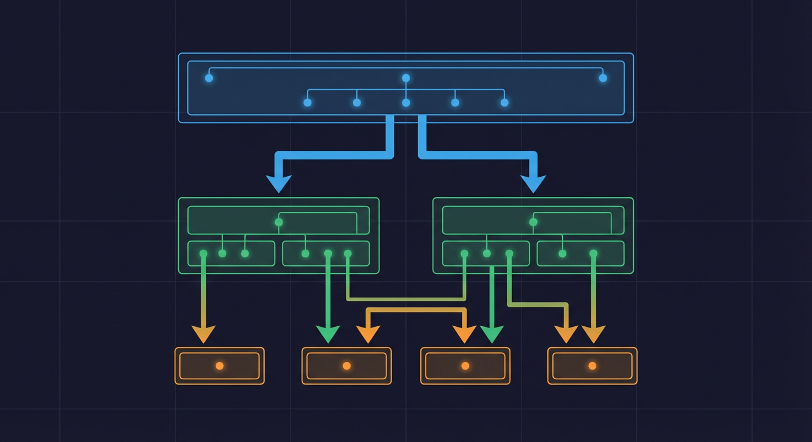

# Test Fixtures



Test fixtures provide reusable test data and setup patterns. This document covers factory-boy factories for model instances and Hypothesis strategies for property-based testing.

## Overview

The testing infrastructure uses two complementary approaches for test data:

1. **factory_boy**: Create model instances with sensible defaults and traits
2. **Hypothesis**: Generate random valid data for property-based testing

**Location**: `backend/tests/factories.py`, `backend/tests/hypothesis_strategies.py`, `backend/tests/strategies.py`

## Factory-Boy Factories


### Core Concept

Factories reduce boilerplate by providing default values for model attributes:

```python
# Without factory
camera = Camera(
    id="front_door",
    name="Front Door",
    folder_path="/export/foscam/front_door",
    status="online",
    created_at=datetime.now(UTC),
    last_seen_at=None,
    deleted_at=None,
)

# With factory
camera = CameraFactory()  # All defaults
camera = CameraFactory(id="front_door")  # Override specific field
```

### Available Factories

From `backend/tests/factories.py:58-750`:

| Factory                    | Model             | Common Traits                                                                   |
| -------------------------- | ----------------- | ------------------------------------------------------------------------------- |
| `CameraFactory`            | Camera            | `offline`, `with_last_seen`                                                     |
| `DetectionFactory`         | Detection         | `video`, `high_confidence`, `low_confidence`, `vehicle`, `animal`               |
| `EventFactory`             | Event             | `low_risk`, `high_risk`, `critical`, `reviewed_event`, `fast_path`, `with_clip` |
| `ZoneFactory`              | CameraZone        | `entry_point`, `driveway`, `sidewalk`, `yard`, `polygon`, `disabled`            |
| `AlertFactory`             | Alert             | `low_severity`, `high_severity`, `critical`, `delivered`, `acknowledged`        |
| `AlertRuleFactory`         | AlertRule         | `low_severity`, `high_severity`, `critical`, `disabled`, `person_detection`     |
| `HouseholdFactory`         | Household         | -                                                                               |
| `PropertyFactory`          | Property          | `main_house`, `beach_house`, `vacation_home`                                    |
| `AreaFactory`              | Area              | `front_yard`, `driveway`, `backyard`, `garage`, `pool_area`                     |
| `HouseholdMemberFactory`   | HouseholdMember   | `resident`, `family`, `service_worker`, `frequent_visitor`                      |
| `PersonEmbeddingFactory`   | PersonEmbedding   | `high_confidence`, `low_confidence`, `with_source_event`                        |
| `RegisteredVehicleFactory` | RegisteredVehicle | `car`, `truck`, `motorcycle`, `suv`, `van`, `untrusted`                         |

### CameraFactory

From `backend/tests/factories.py:58-88`:

```python
class CameraFactory(factory.Factory):
    """Factory for creating Camera model instances."""

    class Meta:
        model = Camera

    id: str = Sequence(lambda n: f"camera_{n}")
    name: str = Sequence(lambda n: f"Camera {n}")
    folder_path: str = LazyAttribute(lambda o: f"/export/foscam/{o.name.replace(' ', '_').lower()}")
    status: str = CameraStatus.ONLINE.value
    created_at: datetime = LazyFunction(lambda: datetime.now(UTC))
    last_seen_at: datetime | None = None
    deleted_at: datetime | None = None

    class Params:
        """Traits for common camera configurations."""
        offline = factory.Trait(status=CameraStatus.OFFLINE.value)
        with_last_seen = factory.Trait(last_seen_at=LazyFunction(lambda: datetime.now(UTC)))
```

**Usage**:

```python
from backend.tests.factories import CameraFactory

# Default camera
camera = CameraFactory()
# camera.id = "camera_0"
# camera.name = "Camera 0"
# camera.status = "online"

# With custom values
camera = CameraFactory(id="front_door", name="Front Door")

# Using traits
offline_camera = CameraFactory(offline=True)
# offline_camera.status = "offline"

# Batch creation
cameras = CameraFactory.create_batch(5)
# Creates 5 cameras with sequential IDs

# Build without saving (for unit tests)
camera = CameraFactory.build()
```

### DetectionFactory

From `backend/tests/factories.py:90-151`:

```python
class DetectionFactory(factory.Factory):
    """Factory for creating Detection model instances."""

    class Meta:
        model = Detection

    id: int = Sequence(lambda n: n + 1)
    camera_id: str = Sequence(lambda n: f"camera_{n}")
    file_path: str = LazyAttribute(lambda o: f"/export/foscam/{o.camera_id}/image_{o.id:04d}.jpg")
    file_type: str = "image/jpeg"
    detected_at: datetime = LazyFunction(lambda: datetime.now(UTC))
    object_type: str = "person"
    confidence: float = 0.90
    bbox_x: int = 100
    bbox_y: int = 200
    bbox_width: int = 150
    bbox_height: int = 300
    thumbnail_path: str | None = None
    media_type: str = "image"
    duration: float | None = None
    video_codec: str | None = None
    video_width: int | None = None
    video_height: int | None = None

    class Params:
        """Traits for common detection configurations."""
        video = factory.Trait(
            media_type="video",
            file_type="video/mp4",
            file_path=LazyAttribute(lambda o: f"/export/foscam/{o.camera_id}/video_{o.id:04d}.mp4"),
            duration=30.0,
            video_codec="h264",
            video_width=1920,
            video_height=1080,
        )
        high_confidence = factory.Trait(confidence=0.98)
        low_confidence = factory.Trait(confidence=0.45)
        vehicle = factory.Trait(object_type="vehicle")
        animal = factory.Trait(object_type="animal")
```

**Usage**:

```python
from backend.tests.factories import DetectionFactory

# Person detection
detection = DetectionFactory()
# detection.object_type = "person"
# detection.confidence = 0.90

# Video detection
video_detection = DetectionFactory(video=True)
# video_detection.media_type = "video"
# video_detection.duration = 30.0

# High-confidence vehicle
detection = DetectionFactory(vehicle=True, high_confidence=True)
```

### EventFactory

From `backend/tests/factories.py:153-229`:

```python
class EventFactory(factory.Factory):
    """Factory for creating Event model instances."""

    class Meta:
        model = Event

    id: int = Sequence(lambda n: n + 1)
    batch_id: str = Sequence(lambda n: f"batch_{n:08d}")
    camera_id: str = Sequence(lambda n: f"camera_{n}")
    started_at: datetime = LazyFunction(lambda: datetime.now(UTC))
    ended_at: datetime | None = None
    risk_score: int = 50
    risk_level: str = "medium"
    summary: str = LazyAttribute(lambda o: f"Event detected on {o.camera_id}")
    reasoning: str = "Standard detection analysis"
    llm_prompt: str | None = None
    reviewed: bool = False
    notes: str | None = None
    is_fast_path: bool = False
    object_types: str = "person"
    clip_path: str | None = None

    class Params:
        low_risk = factory.Trait(risk_score=15, risk_level="low")
        high_risk = factory.Trait(
            risk_score=85,
            risk_level="high",
            summary="High risk activity detected",
            reasoning="Suspicious behavior at entry point during night hours",
        )
        critical = factory.Trait(
            risk_score=95,
            risk_level="critical",
            summary="Critical security event",
            reasoning="Immediate attention required",
        )
        reviewed_event = factory.Trait(reviewed=True, notes="Reviewed and confirmed")
        fast_path = factory.Trait(is_fast_path=True, risk_score=90, risk_level="high")
        with_clip = factory.Trait(clip_path=LazyAttribute(lambda o: f"/clips/event_{o.id}.mp4"))
```

### Helper Functions

From `backend/tests/factories.py:800-862`:

```python
def create_camera_with_events(
    camera_kwargs: dict[str, Any] | None = None,
    num_events: int = 3,
    event_kwargs: dict[str, Any] | None = None,
) -> tuple[Camera, list[Event]]:
    """Create a camera with multiple associated events."""
    camera = CameraFactory(**(camera_kwargs or {}))
    events = EventFactory.create_batch(
        num_events,
        camera_id=camera.id,
        **(event_kwargs or {}),
    )
    return camera, events


def create_detection_batch_for_camera(
    camera_id: str,
    count: int = 5,
    **detection_kwargs: Any,
) -> list[Detection]:
    """Create multiple detections for a specific camera."""
    return DetectionFactory.create_batch(
        count,
        camera_id=camera_id,
        **detection_kwargs,
    )
```

**Usage**:

```python
from backend.tests.factories import create_camera_with_events

# Create camera with 5 high-risk events
camera, events = create_camera_with_events(
    camera_kwargs={"name": "Front Door"},
    num_events=5,
    event_kwargs={"risk_score": 75}
)
```

## Hypothesis Strategies

### Core Concept

Hypothesis generates random valid data to find edge cases you haven't considered:

```python
from hypothesis import given
from hypothesis import strategies as st

@given(st.integers(min_value=0, max_value=100))
def test_risk_score_classification(risk_score):
    """Test risk classification for any valid score."""
    level = classify_risk(risk_score)
    assert level in ["low", "medium", "high", "critical"]
```

### Domain-Specific Strategies

From `backend/tests/hypothesis_strategies.py:53-104`:

#### Camera Strategies

```python
@st.composite
def valid_camera_id(draw: st.DrawFn) -> str:
    """Generate valid camera IDs matching normalized format.

    - Lowercase alphanumeric with underscores
    - No leading/trailing underscores
    - No consecutive underscores
    - Length 1-50 characters

    Examples: "front_door", "driveway_cam_1", "backyard"
    """
    first_char = draw(st.characters(whitelist_categories=("Ll",)))
    # ... build rest ensuring no consecutive underscores
    return result


@st.composite
def valid_camera_name(draw: st.DrawFn) -> str:
    """Generate valid camera display names.

    Examples: "Front Door", "Driveway (Main)"
    """
    return draw(st.text(min_size=1, max_size=255, ...))


@st.composite
def valid_camera_folder_path(draw: st.DrawFn) -> str:
    """Generate valid camera folder paths.

    Examples: "/export/foscam/Front Door"
    """
    folder_name = draw(st.text(...).filter(lambda x: ".." not in x))
    return f"/export/foscam/{folder_name.strip()}"
```

#### Bounding Box Strategies

From `backend/tests/hypothesis_strategies.py:197-246`:

```python
@st.composite
def valid_detection_bbox(
    draw: st.DrawFn, max_width: int = 1920, max_height: int = 1080
) -> dict[str, int]:
    """Generate valid detection bounding box coordinates.

    Returns dict with keys: {x, y, width, height}
    - All values are non-negative integers
    - x + width <= max_width
    - y + height <= max_height
    - width >= 1, height >= 1

    Example: {"x": 100, "y": 200, "width": 150, "height": 200}
    """
    x = draw(st.integers(min_value=0, max_value=max(0, max_width - 1)))
    y = draw(st.integers(min_value=0, max_value=max(0, max_height - 1)))
    width = draw(st.integers(min_value=1, max_value=max(1, max_width - x)))
    height = draw(st.integers(min_value=1, max_value=max(1, max_height - y)))
    return {"x": x, "y": y, "width": width, "height": height}


@st.composite
def valid_normalized_bbox(draw: st.DrawFn) -> dict[str, float]:
    """Generate valid normalized bounding box coordinates [0.0, 1.0]."""
    x = draw(st.floats(min_value=0.0, max_value=0.95, allow_nan=False))
    y = draw(st.floats(min_value=0.0, max_value=0.95, allow_nan=False))
    width = draw(st.floats(min_value=0.01, max_value=1.0 - x, allow_nan=False))
    height = draw(st.floats(min_value=0.01, max_value=1.0 - y, allow_nan=False))
    return {"x": x, "y": y, "width": width, "height": height}
```

#### Risk and Confidence Strategies

From `backend/tests/hypothesis_strategies.py:254-300`:

```python
def valid_risk_score() -> st.SearchStrategy[int]:
    """Generate valid risk scores in range [0, 100].

    Ranges:
    - 0-25: LOW
    - 26-50: MEDIUM
    - 51-75: HIGH
    - 76-100: CRITICAL
    """
    return st.integers(min_value=0, max_value=100)


def valid_confidence() -> st.SearchStrategy[float]:
    """Generate valid confidence scores in range [0.0, 1.0]."""
    return st.floats(min_value=0.0, max_value=1.0, allow_nan=False, allow_infinity=False)


@st.composite
def valid_risk_level(draw: st.DrawFn) -> str:
    """Generate valid risk level strings."""
    return draw(st.sampled_from(["low", "medium", "high", "critical"]))
```

#### Timestamp Strategies

From `backend/tests/hypothesis_strategies.py:361-412`:

```python
@st.composite
def valid_utc_timestamp(
    draw: st.DrawFn,
    min_year: int = 2020,
    max_year: int = 2030,
) -> datetime:
    """Generate timezone-aware UTC timestamp."""
    dt_naive = draw(st.datetimes(
        min_value=datetime(min_year, 1, 1),
        max_value=datetime(max_year, 12, 31, 23, 59, 59),
    ))
    return dt_naive.replace(tzinfo=UTC)


@st.composite
def valid_timestamp_range(
    draw: st.DrawFn,
    min_duration_seconds: int = 1,
    max_duration_seconds: int = 3600,
) -> tuple[datetime, datetime]:
    """Generate ordered timestamp pair (start, end) where start < end."""
    started_at = draw(valid_utc_timestamp())
    duration = draw(st.timedeltas(
        min_value=timedelta(seconds=min_duration_seconds),
        max_value=timedelta(seconds=max_duration_seconds),
    ))
    ended_at = started_at + duration
    return (started_at, ended_at)
```

#### Composite Model Strategies

From `backend/tests/hypothesis_strategies.py:664-812`:

```python
@st.composite
def camera_dict_strategy(draw: st.DrawFn) -> dict[str, Any]:
    """Generate complete Camera model dictionary."""
    camera_id = draw(valid_camera_id())
    return {
        "id": camera_id,
        "name": draw(valid_camera_name()),
        "folder_path": draw(valid_camera_folder_path()),
        "status": draw(valid_camera_status()),
        "created_at": draw(valid_utc_timestamp()),
        "last_seen_at": draw(st.one_of(st.none(), valid_utc_timestamp())),
        "deleted_at": None,
    }


@st.composite
def event_dict_strategy(draw: st.DrawFn, camera_id: str | None = None) -> dict[str, Any]:
    """Generate complete Event model dictionary."""
    if camera_id is None:
        camera_id = draw(valid_camera_id())

    timestamps = draw(valid_timestamp_range())
    risk_score = draw(st.one_of(st.none(), valid_risk_score()))

    # Determine risk_level based on risk_score
    if risk_score is not None:
        if risk_score <= 25:
            risk_level = "low"
        elif risk_score <= 50:
            risk_level = "medium"
        elif risk_score <= 75:
            risk_level = "high"
        else:
            risk_level = "critical"
    else:
        risk_level = None

    return {
        "batch_id": draw(valid_uuid_hex()),
        "camera_id": camera_id,
        "started_at": timestamps[0],
        "ended_at": timestamps[1],
        "risk_score": risk_score,
        "risk_level": risk_level,
        # ... more fields
    }
```

### Edge Case Strategies

From `backend/tests/hypothesis_strategies.py:873-938`:

```python
@st.composite
def edge_case_risk_scores(draw: st.DrawFn) -> int:
    """Generate edge case risk scores (boundaries)."""
    return draw(st.sampled_from([0, 25, 50, 75, 100]))


@st.composite
def edge_case_bbox(draw: st.DrawFn) -> dict[str, int]:
    """Generate edge case bounding boxes."""
    case = draw(st.sampled_from(["top_left", "bottom_right", "full_frame", "minimum_size"]))

    if case == "top_left":
        return {"x": 0, "y": 0, "width": 100, "height": 100}
    elif case == "bottom_right":
        return {"x": 1820, "y": 980, "width": 100, "height": 100}
    elif case == "full_frame":
        return {"x": 0, "y": 0, "width": 1920, "height": 1080}
    else:  # minimum_size
        x = draw(st.integers(min_value=0, max_value=1919))
        y = draw(st.integers(min_value=0, max_value=1079))
        return {"x": x, "y": y, "width": 1, "height": 1}
```

## Using Hypothesis in Tests

### Basic Property Test

From `backend/tests/unit/services/test_bbox_validation.py:748-772`:

```python
from hypothesis import given, settings as hypothesis_settings
from backend.tests.strategies import valid_bbox_xyxy_strategy

class TestBboxValidationProperties:
    @given(bbox=valid_bbox_xyxy_strategy())
    @hypothesis_settings(max_examples=100)
    def test_valid_bbox_always_passes_validation(
        self, bbox: tuple[float, float, float, float]
    ) -> None:
        """Property: Valid bboxes are always valid."""
        assert is_valid_bbox(bbox) is True
```

### Testing Mathematical Properties

From `backend/tests/unit/services/test_bbox_validation.py:936-965`:

```python
@given(bbox=valid_bbox_xyxy_strategy())
@hypothesis_settings(max_examples=100)
def test_iou_with_self_is_one(self, bbox: tuple[float, float, float, float]) -> None:
    """Property: IoU of a bbox with itself is 1.0."""
    iou = calculate_bbox_iou(bbox, bbox)
    assert iou == pytest.approx(1.0)


@given(bbox1=valid_bbox_xyxy_strategy(), bbox2=valid_bbox_xyxy_strategy())
@hypothesis_settings(max_examples=100)
def test_iou_is_symmetric(
    self,
    bbox1: tuple[float, float, float, float],
    bbox2: tuple[float, float, float, float],
) -> None:
    """Property: IoU(a, b) == IoU(b, a) (symmetric)."""
    iou1 = calculate_bbox_iou(bbox1, bbox2)
    iou2 = calculate_bbox_iou(bbox2, bbox1)
    assert iou1 == pytest.approx(iou2)
```

### Hypothesis Configuration

From `pyproject.toml:423-439`:

```toml
[tool.hypothesis.profiles.ci]
# CI profile: deterministic, fast
max_examples = 100
deadline = 1000
database = "none"
print_blob = true  # Print failing examples for reproduction

[tool.hypothesis.profiles.dev]
# Local profile: exploratory, thorough
max_examples = 500
deadline = 5000
database = "directory:.hypothesis"
```

### Reproducing Failures

When Hypothesis finds a failing example:

```python
# 1. Copy the blob from CI output
# "Falsifying example: <blob>"

# 2. Add to test with @example decorator
from hypothesis import example, given

@example(<paste-blob-here>)  # Runs first with exact failing input
@given(st.integers())
def test_something(value):
    ...

# 3. Or use the seed
# pytest --hypothesis-seed=12345
```

## When to Use Parametrize vs Hypothesis

### Use `@pytest.mark.parametrize` for:

- Known edge cases you've identified
- Fixed test cases with expected outputs
- Regression tests for specific bugs
- Exhaustive testing of small sets (enums)

```python
@pytest.mark.parametrize("invalid_input,reason", [
    ("", "empty string"),
    (None, "null value"),
    ("   ", "whitespace only"),
])
def test_validation_rejects_invalid_input(invalid_input, reason):
    assert validate(invalid_input) is False, f"Should reject: {reason}"
```

### Use Hypothesis for:

- Properties that should hold for all inputs
- Finding edge cases you haven't thought of
- Testing mathematical invariants
- Large input spaces

```python
@given(bbox=valid_bbox_xyxy_strategy())
def test_valid_bbox_property(bbox):
    """Property: Valid construction always passes validation."""
    assert is_valid_bbox(bbox) is True
```

## Best Practices

### 1. Use Factories for Integration Tests

```python
async def test_camera_api(db_session, client):
    # Use factory for database setup
    camera = CameraFactory.build()
    db_session.add(camera)
    await db_session.commit()

    response = await client.get(f"/api/cameras/{camera.id}")
    assert response.status_code == 200
```

### 2. Use Hypothesis for Property Verification

```python
@given(data=bbox_and_image_strategy())
def test_clamped_bbox_within_bounds(data):
    bbox, width, height = data
    result = clamp_bbox_to_image(bbox, width, height)

    if result is not None:
        x1, y1, x2, y2 = result
        assert 0 <= x1 <= width
        assert 0 <= y1 <= height
```

### 3. Combine Both Approaches

```python
# Parametrize for known edge cases
@pytest.mark.parametrize("bbox", [
    (0, 0, 0, 0),      # Zero-size box
    (100, 100, 50, 50), # Inverted coordinates
])
def test_invalid_bbox_edge_cases(bbox):
    assert is_valid_bbox(bbox) is False

# Hypothesis for property-based testing
@given(bbox=valid_bbox_xyxy_strategy())
def test_valid_bbox_property(bbox):
    assert is_valid_bbox(bbox) is True
```

## Related Documentation

- [Unit Testing](unit-testing.md) - Using fixtures in unit tests
- [Integration Testing](integration-testing.md) - Database fixtures
- [Coverage Requirements](coverage-requirements.md) - Coverage metrics
