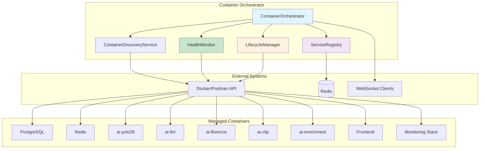
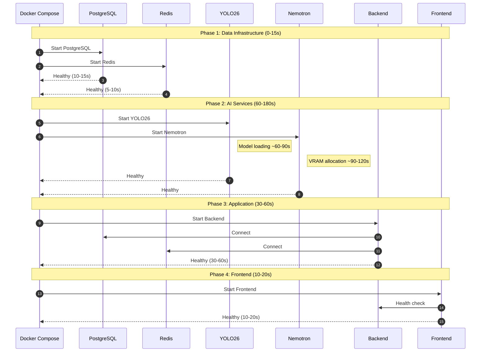
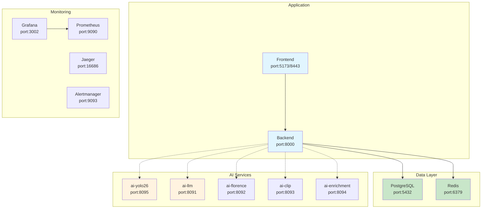
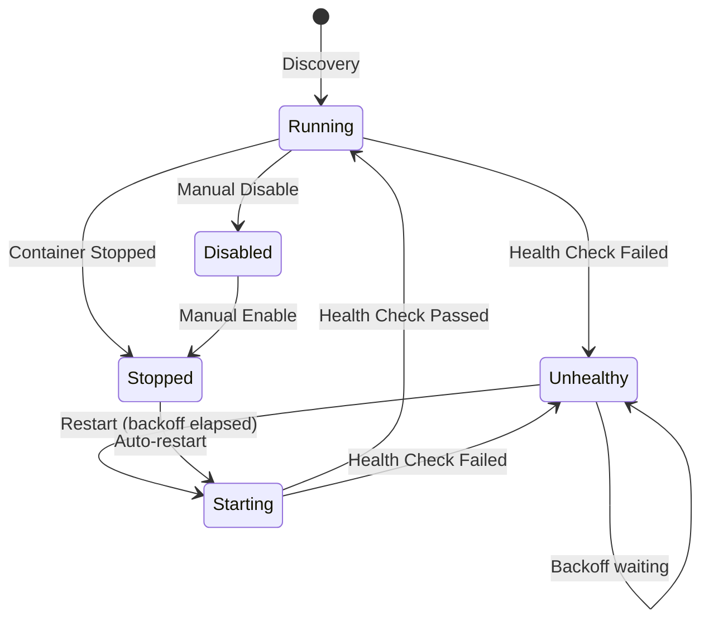

# Container Orchestration

> Comprehensive documentation for the Container Orchestrator including startup sequences, health checks, self-healing recovery, and dependency management.

---

## Table of Contents

- [Overview](#overview)
- [Architecture](#architecture)
- [Startup Sequence](#startup-sequence)
- [Health Checks](#health-checks)
- [Dependency Graph](#dependency-graph)
- [Self-Healing Recovery](#self-healing-recovery)
- [Service Categories](#service-categories)
- [Configuration](#configuration)
- [API Endpoints](#api-endpoints)
- [Recovery Procedures](#recovery-procedures)
- [Troubleshooting](#troubleshooting)

---

## Overview

The Container Orchestrator is a self-healing container management system that monitors Docker/Podman containers, performs health checks, and automatically recovers failed services. It integrates with the backend application to provide real-time service status via WebSocket broadcasts.

### Key Features

- **Container Discovery**: Automatically discovers containers by name pattern
- **Health Monitoring**: Periodic health checks via HTTP endpoints or shell commands
- **Self-Healing**: Automatic restart with exponential backoff on failure
- **WebSocket Broadcasting**: Real-time service status updates to connected clients
- **State Persistence**: Service state persisted to Redis for durability
- **Grace Period Support**: Configurable startup grace periods before health checks begin

### Components

| Component                 | File                                              | Purpose                                        |
| ------------------------- | ------------------------------------------------- | ---------------------------------------------- |
| ContainerOrchestrator     | `backend/services/container_orchestrator.py`      | Main coordinator integrating all components    |
| ContainerDiscoveryService | `backend/services/container_discovery.py`         | Discovers containers by name pattern           |
| HealthMonitor             | `backend/services/health_monitor_orchestrator.py` | Periodic health check loop                     |
| LifecycleManager          | `backend/services/lifecycle_manager.py`           | Restart logic with exponential backoff         |
| ServiceRegistry           | `backend/services/orchestrator/registry.py`       | In-memory service state with Redis persistence |
| DockerClient              | `backend/core/docker_client.py`                   | Async Docker/Podman API wrapper                |

---

## Architecture

### Component Interaction Diagram



### Data Flow

1. **Startup**: ContainerOrchestrator connects to Docker, discovers containers via ContainerDiscoveryService
2. **Registration**: Discovered services are registered in ServiceRegistry, state loaded from Redis
3. **Monitoring**: HealthMonitor runs periodic health checks (default: every 30 seconds)
4. **Recovery**: On failure, LifecycleManager handles restart with exponential backoff
5. **Broadcasting**: Status changes are broadcast via WebSocket to connected clients
6. **Persistence**: Service state is persisted to Redis for durability across restarts

---

## Startup Sequence

### Phase Overview

The system starts in four sequential phases, each waiting for the previous to complete via Docker Compose health check dependencies.



### Phase 1: Data Infrastructure (0-15 seconds)

Services with no dependencies start immediately:

| Service    | Startup Time | Health Check             | Grace Period |
| ---------- | ------------ | ------------------------ | ------------ |
| PostgreSQL | 10-15s       | `pg_isready -U security` | 10s          |
| Redis      | 5-10s        | `redis-cli ping`         | 10s          |

### Phase 2: AI Services (60-180 seconds)

AI services start in parallel after infrastructure is healthy:

| Service            | Startup Time | Health Check  | Grace Period | Notes           |
| ------------------ | ------------ | ------------- | ------------ | --------------- |
| ai-yolo26 (YOLO26) | 60-90s       | GET `/health` | 60s          | Model loading   |
| ai-llm (Nemotron)  | 90-120s      | GET `/health` | 120s         | VRAM allocation |
| ai-florence        | 60s          | GET `/health` | 60s          | Optional        |
| ai-clip            | 60s          | GET `/health` | 60s          | Optional        |
| ai-enrichment      | 180s         | GET `/health` | 180s         | Multiple models |

### Phase 3: Application (30-60 seconds)

Backend starts after PostgreSQL, Redis, and critical AI services are healthy:

| Service | Dependencies                         | Health Check                   | Grace Period |
| ------- | ------------------------------------ | ------------------------------ | ------------ |
| Backend | PostgreSQL, Redis, ai-yolo26, ai-llm | GET `/api/system/health/ready` | 30s          |

### Phase 4: Frontend (10-20 seconds)

Frontend starts after backend is healthy:

| Service  | Dependencies | Health Check  | Grace Period |
| -------- | ------------ | ------------- | ------------ |
| Frontend | Backend      | GET `/health` | 30s          |

### Monitoring Stack (Parallel with Core Services)

Monitoring services start independently:

| Service      | Startup Time | Health Check      | Grace Period |
| ------------ | ------------ | ----------------- | ------------ |
| Prometheus   | 15s          | GET `/-/healthy`  | 30s          |
| Grafana      | 20s          | GET `/api/health` | 30s          |
| Alertmanager | 10s          | GET `/-/healthy`  | 15s          |
| Jaeger       | 10s          | GET `/`           | 15s          |
| Loki         | 15s          | GET `/ready`      | 15s          |
| Pyroscope    | 15s          | GET `/ready`      | 15s          |
| Alloy        | 15s          | Process check     | 15s          |

---

## Health Checks

### Health Check Methods

The orchestrator supports three health check methods, evaluated in priority order:

#### 1. HTTP Health Endpoint (Preferred for AI Services)

Used when `health_endpoint` is configured:

```python
# Example: AI services
async def check_http_health(host: str, port: int, endpoint: str) -> bool:
    url = f"http://{host}:{port}{endpoint}"
    response = await httpx.AsyncClient().get(url, timeout=5.0)
    return response.status_code == 200
```

#### 2. Command Health Check (For Infrastructure)

Used when `health_cmd` is configured:

```python
# Example: PostgreSQL
async def check_cmd_health(docker_client, container_id: str, cmd: str) -> bool:
    exit_code = await docker_client.exec_run(container_id, cmd)
    return exit_code == 0
```

#### 3. Container Running Status (Fallback)

Used when neither HTTP endpoint nor command is configured:

```python
# Fallback check
status = await docker_client.get_container_status(container_id)
return status == "running"
```

### Health Check Configuration by Service

| Service       | Method  | Endpoint/Command         | Timeout | Interval |
| ------------- | ------- | ------------------------ | ------- | -------- |
| PostgreSQL    | Command | `pg_isready -U security` | 5s      | 30s      |
| Redis         | Command | `redis-cli ping`         | 5s      | 30s      |
| ai-yolo26     | HTTP    | `/health`                | 5s      | 30s      |
| ai-llm        | HTTP    | `/health`                | 5s      | 30s      |
| ai-florence   | HTTP    | `/health`                | 5s      | 30s      |
| ai-clip       | HTTP    | `/health`                | 5s      | 30s      |
| ai-enrichment | HTTP    | `/health`                | 5s      | 30s      |
| Frontend      | HTTP    | `/health`                | 5s      | 30s      |
| Prometheus    | HTTP    | `/-/healthy`             | 5s      | 30s      |
| Grafana       | HTTP    | `/api/health`            | 5s      | 30s      |
| Alertmanager  | HTTP    | `/-/healthy`             | 5s      | 30s      |

### Health Check Response Examples

**AI Service Health Endpoint (`/health`):**

```json
{
  "status": "healthy",
  "model_loaded": true,
  "gpu_memory_used_mb": 4096,
  "inference_ready": true
}
```

**Backend Readiness Endpoint (`/api/system/health/ready`):**

```json
{
  "ready": true,
  "status": "ready",
  "services": {
    "database": "healthy",
    "redis": "healthy",
    "ai_services": "healthy"
  },
  "workers": {
    "detection_worker": "running",
    "analysis_worker": "running"
  }
}
```

---

## Dependency Graph

### Service Dependencies



**Legend:**

- Solid arrows: Hard dependencies (required for startup)
- Dashed arrows: Soft dependencies (degraded operation if unavailable)

### Dependency Matrix

| Service       | Hard Dependencies | Soft Dependencies | Auto-Recovers |
| ------------- | ----------------- | ----------------- | ------------- |
| PostgreSQL    | None              | None              | Yes           |
| Redis         | None              | None              | Yes           |
| ai-yolo26     | GPU               | None              | Yes           |
| ai-llm        | GPU               | None              | Yes           |
| ai-florence   | GPU               | None              | Yes           |
| ai-clip       | GPU               | None              | Yes           |
| ai-enrichment | GPU               | None              | Yes           |
| Backend       | PostgreSQL, Redis | ai-yolo26, ai-llm | Yes           |
| Frontend      | Backend           | None              | Yes           |
| Prometheus    | None              | None              | Yes           |
| Grafana       | Prometheus        | None              | Yes           |

---

## Self-Healing Recovery

### Exponential Backoff Algorithm

The orchestrator uses exponential backoff for restart attempts:

```python
def calculate_backoff(failure_count: int, base: float, max_backoff: float) -> float:
    """Calculate backoff: base * 2^failure_count, capped at max_backoff."""
    return min(base * (2 ** failure_count), max_backoff)
```

**Example progression (base=5.0, max=300.0):**

| Failure # | Backoff Delay |
| --------- | ------------- |
| 1         | 5s            |
| 2         | 10s           |
| 3         | 20s           |
| 4         | 40s           |
| 5         | 80s           |
| 6         | 160s          |
| 7+        | 300s (capped) |

### Recovery States



### Service Status Values

| Status      | Description                                          |
| ----------- | ---------------------------------------------------- |
| `RUNNING`   | Container running and health checks passing          |
| `STARTING`  | Container starting, in grace period                  |
| `UNHEALTHY` | Health check failed, awaiting restart                |
| `STOPPED`   | Container stopped                                    |
| `DISABLED`  | Auto-restart disabled (manual intervention required) |
| `NOT_FOUND` | Container not found in Docker                        |

### Category-Specific Defaults

| Category       | Max Failures | Base Backoff | Max Backoff |
| -------------- | ------------ | ------------ | ----------- |
| Infrastructure | 10           | 2.0s         | 60s         |
| AI             | 5            | 5.0s         | 300s        |
| Monitoring     | 5            | 10.0s        | 120s        |

---

## Service Categories

### Infrastructure Services

Critical services required for application operation:

| Service  | Display Name | Port | Grace Period |
| -------- | ------------ | ---- | ------------ |
| postgres | PostgreSQL   | 5432 | 10s          |
| redis    | Redis        | 6379 | 10s          |
| frontend | Frontend     | 8080 | 30s          |

### AI Services

GPU-accelerated AI inference services:

| Service       | Display Name | Port | Grace Period | VRAM                                |
| ------------- | ------------ | ---- | ------------ | ----------------------------------- |
| ai-yolo26     | YOLO26       | 8090 | 60s          | ~4GB                                |
| ai-llm        | Nemotron     | 8091 | 120s         | ~3GB (Mini 4B) / ~14.7GB (30B prod) |
| ai-florence   | Florence-2   | 8092 | 60s          | ~2GB                                |
| ai-clip       | CLIP         | 8093 | 60s          | ~2GB                                |
| ai-enrichment | Enrichment   | 8094 | 180s         | ~4GB                                |

> **Note:** Nemotron VRAM depends on model selection: Nemotron Mini 4B (~3GB, 4K context) is used for development, while Nemotron-3-Nano-30B-A3B (~14.7GB, 128K context) is recommended for production.

### Monitoring Services

Observability and alerting stack:

| Service           | Display Name      | Port  | Grace Period |
| ----------------- | ----------------- | ----- | ------------ |
| prometheus        | Prometheus        | 9090  | 30s          |
| grafana           | Grafana           | 3002  | 30s          |
| alertmanager      | Alertmanager      | 9093  | 15s          |
| jaeger            | Jaeger            | 16686 | 15s          |
| redis-exporter    | Redis Exporter    | 9121  | 15s          |
| json-exporter     | JSON Exporter     | 7979  | 15s          |
| blackbox-exporter | Blackbox Exporter | 9115  | 15s          |

---

## Configuration

### Environment Variables

The orchestrator is configured via environment variables with the `ORCHESTRATOR_` prefix:

| Variable                             | Default                               | Description                       |
| ------------------------------------ | ------------------------------------- | --------------------------------- |
| `ORCHESTRATOR_ENABLED`               | `true`                                | Enable container orchestrator     |
| `ORCHESTRATOR_DOCKER_HOST`           | `tcp://host.containers.internal:2375` | Docker/Podman API endpoint        |
| `ORCHESTRATOR_HEALTH_CHECK_INTERVAL` | `30`                                  | Seconds between health checks     |
| `ORCHESTRATOR_HEALTH_CHECK_TIMEOUT`  | `5`                                   | Timeout for health check requests |
| `ORCHESTRATOR_MONITORING_ENABLED`    | `true`                                | Include monitoring services       |

### Docker/Podman API Setup

The orchestrator requires access to the Docker/Podman API. For Podman:

```bash
# Start Podman API listener (run on host)
podman system service --time=0 tcp:0.0.0.0:2375 &

# Verify connection
curl http://localhost:2375/v1.40/info
```

For Docker:

```bash
# Docker socket is available by default
# For TCP access, configure /etc/docker/daemon.json:
{
  "hosts": ["unix:///var/run/docker.sock", "tcp://0.0.0.0:2375"]
}
```

### Port Configuration

All service ports are configurable via OrchestratorSettings:

```python
# backend/core/config.py
class OrchestratorSettings(BaseSettings):
    postgres_port: int = 5432
    redis_port: int = 6379
    yolo26_port: int = 8095
    nemotron_port: int = 8091
    florence_port: int = 8092
    clip_port: int = 8093
    enrichment_port: int = 8094
    prometheus_port: int = 9090
    grafana_port: int = 3002
    # ... etc
```

---

## API Endpoints

### Health Endpoints

| Endpoint                        | Method | Description                              |
| ------------------------------- | ------ | ---------------------------------------- |
| `/api/system/health`            | GET    | Basic health status                      |
| `/api/system/health/ready`      | GET    | Kubernetes-style readiness probe         |
| `/api/system/health/full`       | GET    | Comprehensive health with all services   |
| `/api/health/ai-services`       | GET    | AI services health with circuit breakers |
| `/api/system/monitoring/health` | GET    | Monitoring stack health                  |

### Service Management Endpoints

| Endpoint                              | Method | Description                 |
| ------------------------------------- | ------ | --------------------------- |
| `/api/system/services`                | GET    | List all managed services   |
| `/api/system/services/{name}`         | GET    | Get specific service status |
| `/api/system/services/{name}/restart` | POST   | Trigger manual restart      |
| `/api/system/services/{name}/enable`  | POST   | Enable auto-restart         |
| `/api/system/services/{name}/disable` | POST   | Disable auto-restart        |

### WebSocket Events

Service status changes are broadcast via WebSocket:

```json
{
  "type": "service_status",
  "data": {
    "name": "ai-yolo26",
    "display_name": "YOLO26",
    "category": "ai",
    "status": "running",
    "enabled": true,
    "container_id": "abc123def456",
    "image": "security-ai-yolo26:latest",
    "port": 8090,
    "failure_count": 0,
    "restart_count": 2,
    "last_restart_at": "2024-01-15T10:30:00Z",
    "uptime_seconds": 3600
  },
  "message": "Service recovered"
}
```

**Event Messages:**

| Message                                   | Description                       |
| ----------------------------------------- | --------------------------------- |
| `Service discovered`                      | Container discovered on startup   |
| `Service recovered`                       | Health check passed after failure |
| `Health check failed`                     | Health check failed               |
| `Manual restart initiated`                | User triggered restart            |
| `Restart completed`                       | Restart succeeded                 |
| `Restart failed`                          | Restart failed                    |
| `Service disabled - max failures reached` | Auto-restart disabled             |
| `Service enabled`                         | Manual re-enable                  |
| `Service disabled`                        | Manual disable                    |

---

## Recovery Procedures

### Common Failure Scenarios

#### Scenario 1: AI Service GPU Out of Memory

**Symptoms:**

- AI service health checks failing
- GPU memory usage at 100%
- Other AI services may be affected

**Recovery Steps:**

```bash
# 1. Check GPU memory usage
nvidia-smi

# 2. Identify memory-hogging processes
nvidia-smi --query-compute-apps=pid,used_memory --format=csv

# 3. Stop affected containers
podman-compose -f docker-compose.prod.yml stop ai-llm ai-enrichment

# 4. Clear GPU memory
nvidia-smi --gpu-reset  # If supported

# 5. Restart services one at a time
podman-compose -f docker-compose.prod.yml start ai-llm
# Wait for health check to pass
podman-compose -f docker-compose.prod.yml start ai-enrichment
```

#### Scenario 2: Database Connection Pool Exhausted

**Symptoms:**

- Backend health check failing with database errors
- PostgreSQL container healthy but connections refused

**Recovery Steps:**

```bash
# 1. Check active connections
podman-compose -f docker-compose.prod.yml exec postgres \
  psql -U security -d security -c "SELECT count(*) FROM pg_stat_activity;"

# 2. Kill idle connections
podman-compose -f docker-compose.prod.yml exec postgres \
  psql -U security -d security -c \
  "SELECT pg_terminate_backend(pid) FROM pg_stat_activity WHERE state = 'idle' AND pid <> pg_backend_pid();"

# 3. Restart backend if needed
podman-compose -f docker-compose.prod.yml restart backend
```

#### Scenario 3: Redis Memory Limit Reached

**Symptoms:**

- Redis health check failing
- OOM errors in Redis logs

**Recovery Steps:**

```bash
# 1. Check Redis memory usage
podman-compose -f docker-compose.prod.yml exec redis redis-cli INFO memory

# 2. Flush non-critical caches
podman-compose -f docker-compose.prod.yml exec redis redis-cli FLUSHDB

# 3. If persistent, restart Redis
podman-compose -f docker-compose.prod.yml restart redis
```

#### Scenario 4: Container Orchestrator Not Connecting

**Symptoms:**

- Services not auto-recovering
- Backend logs show "Failed to connect to Docker daemon"

**Recovery Steps:**

```bash
# 1. Verify Podman API is running
curl http://localhost:2375/v1.40/info

# 2. If not running, start it
podman system service --time=0 tcp:0.0.0.0:2375 &

# 3. Restart backend to reconnect
podman-compose -f docker-compose.prod.yml restart backend
```

### Manual Service Recovery

#### Enable a Disabled Service

```bash
# Via API
curl -X POST http://localhost:8000/api/system/services/ai-yolo26/enable

# Verify status
curl http://localhost:8000/api/system/services/ai-yolo26
```

#### Force Restart with Failure Reset

```bash
# Via API (resets failure count)
curl -X POST http://localhost:8000/api/system/services/ai-yolo26/restart?reset_failures=true
```

#### Check Service Health Events

```bash
# Get recent health events
curl http://localhost:8000/api/system/health/events?limit=50
```

---

## Troubleshooting

### Diagnostic Commands

```bash
# Check all container statuses
podman-compose -f docker-compose.prod.yml ps

# View logs for specific service
podman-compose -f docker-compose.prod.yml logs -f ai-yolo26

# Check orchestrator logs
podman-compose -f docker-compose.prod.yml logs backend | grep -E "orchestrator|health"

# Test individual health endpoint
curl http://localhost:8095/health  # ai-yolo26
curl http://localhost:8091/health  # ai-llm
curl http://localhost:8000/api/system/health/ready  # backend

# Check GPU status
nvidia-smi

# Check Docker/Podman API connection
curl http://localhost:2375/v1.40/containers/json
```

### Common Issues

| Issue                           | Possible Cause         | Solution                                  |
| ------------------------------- | ---------------------- | ----------------------------------------- |
| Service stuck in UNHEALTHY      | Backoff period active  | Wait for backoff or manually restart      |
| All AI services failing         | GPU driver issue       | Run `nvidia-smi`, restart GPU services    |
| Health checks timing out        | Service overloaded     | Increase timeout, check resource limits   |
| Container not discovered        | Name pattern mismatch  | Check container name contains service key |
| State not persisting            | Redis connection issue | Check Redis health, verify connection     |
| WebSocket not receiving updates | Broadcast disabled     | Check `broadcast_fn` configuration        |

### Log Messages Reference

| Log Message                            | Meaning                | Action                            |
| -------------------------------------- | ---------------------- | --------------------------------- |
| `ContainerOrchestrator started`        | Orchestrator running   | Normal                            |
| `Discovered N containers`              | Discovery complete     | Normal                            |
| `Service X recovered`                  | Health check passing   | Normal                            |
| `Health check failed for X`            | Service unhealthy      | Monitor for auto-recovery         |
| `Service X in backoff, N.Ns remaining` | Waiting before retry   | Wait or manual restart            |
| `Restarted service X`                  | Auto-restart succeeded | Normal                            |
| `Failed to connect to Docker daemon`   | API connection failed  | Start Podman API                  |
| `Service X exceeded N failures`        | Max failures reached   | Manual intervention may be needed |

---

## See Also

- [Deployment Guide](../operator/deployment/README.md) - Full deployment instructions
- [Monitoring Guide](../operator/monitoring/README.md) - Observability setup
- [AI Services](../operator/ai-services.md) - AI service configuration
- [Service Control](../operator/service-control.md) - Manual service management
- [Troubleshooting](../reference/troubleshooting/README.md) - General troubleshooting

---

## Appendix: Docker Compose Health Check Configuration

Reference configuration from `docker-compose.prod.yml`:

```yaml
# Backend health check example
backend:
  healthcheck:
    test:
      [
        'CMD',
        'python',
        '-c',
        "import httpx; r = httpx.get('http://localhost:8000/api/system/health/ready'); exit(0 if r.status_code == 200 else 1)",
      ]
    interval: 10s
    timeout: 5s
    retries: 3
    start_period: 30s
  depends_on:
    postgres:
      condition: service_healthy
    redis:
      condition: service_healthy
    ai-yolo26:
      condition: service_healthy
    ai-llm:
      condition: service_healthy

# AI service health check example
ai-yolo26:
  healthcheck:
    test:
      [
        'CMD',
        'python',
        '-c',
        "import httpx; r = httpx.get('http://localhost:8095/health'); exit(0 if r.status_code == 200 else 1)",
      ]
    interval: 10s
    timeout: 5s
    retries: 5
    start_period: 60s

# Infrastructure health check example
postgres:
  healthcheck:
    test: ['CMD-SHELL', 'pg_isready -U security -d security']
    interval: 10s
    timeout: 5s
    retries: 5
    start_period: 10s
```
