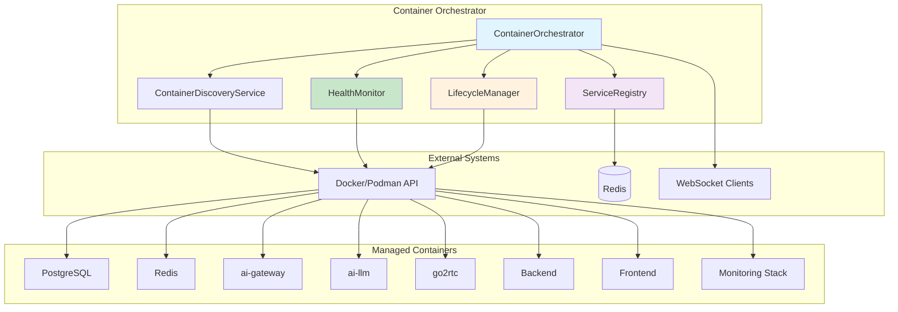
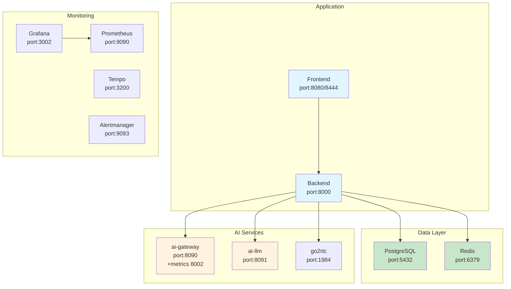
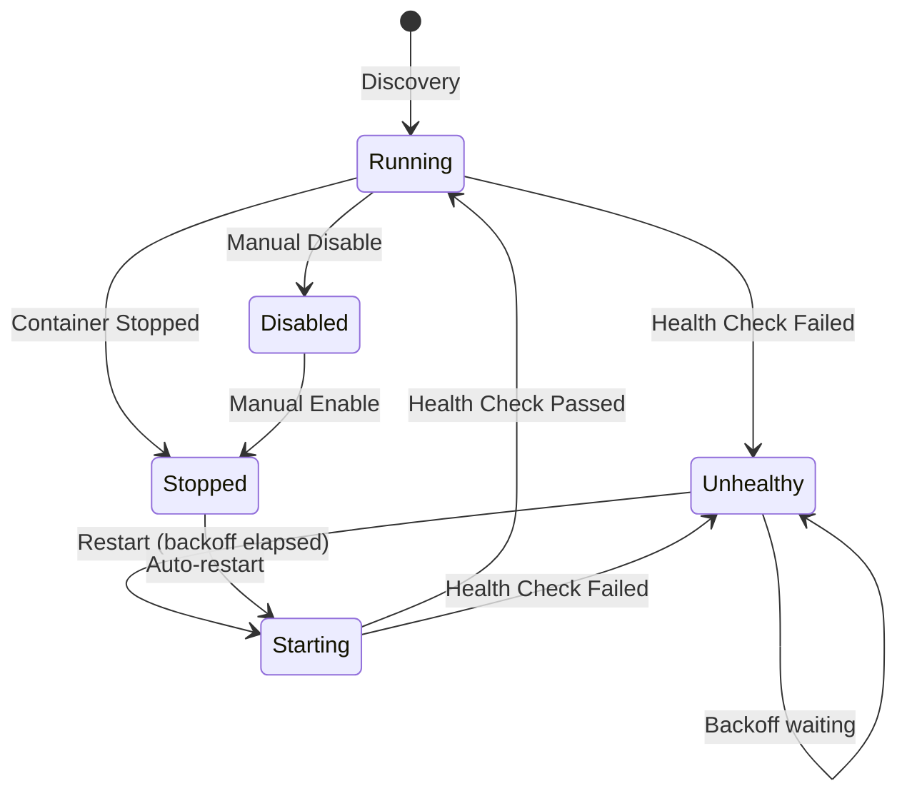

# Container Orchestration

> Comprehensive documentation for the Container Orchestrator including startup sequences, health checks, self-healing recovery, and dependency management.

---

## Table of Contents

- [Overview](#overview)
- [Architecture](#architecture)
- [Startup Sequence](#startup-sequence)
- [Health Checks](#health-checks)
- [Dependency Graph](#dependency-graph)
- [Self-Healing Recovery](#self-healing-recovery)
- [Service Categories](#service-categories)
- [Configuration](#configuration)
- [API Endpoints](#api-endpoints)
- [Recovery Procedures](#recovery-procedures)
- [Troubleshooting](#troubleshooting)

---

## Overview

The Container Orchestrator is a self-healing container management system that monitors Docker/Podman containers, performs health checks, and automatically recovers failed services. It integrates with the backend application to provide real-time service status via WebSocket broadcasts.

### Key Features

- **Container Discovery**: Automatically discovers containers by name pattern
- **Health Monitoring**: Periodic health checks via HTTP endpoints or shell commands
- **Self-Healing**: Automatic restart with exponential backoff on failure
- **WebSocket Broadcasting**: Real-time service status updates to connected clients
- **State Persistence**: Service state persisted to Redis for durability
- **Grace Period Support**: Configurable startup grace periods before health checks begin

### Components

| Component                 | File                                              | Purpose                                        |
| ------------------------- | ------------------------------------------------- | ---------------------------------------------- |
| ContainerOrchestrator     | `backend/services/container_orchestrator.py`      | Main coordinator integrating all components    |
| ContainerDiscoveryService | `backend/services/container_discovery.py`         | Discovers containers by name pattern           |
| HealthMonitor             | `backend/services/health_monitor_orchestrator.py` | Periodic health check loop                     |
| LifecycleManager          | `backend/services/lifecycle_manager.py`           | Restart logic with exponential backoff         |
| ServiceRegistry           | `backend/services/orchestrator/registry.py`       | In-memory service state with Redis persistence |
| DockerClient              | `backend/core/docker_client.py`                   | Async Docker/Podman API wrapper                |

---

## Architecture

### Component Interaction Diagram


```mermaid
flowchart TB
    subgraph Orchestrator["Container Orchestrator"]
        CO[ContainerOrchestrator]
        DS[ContainerDiscoveryService]
        HM[HealthMonitor]
        LM[LifecycleManager]
        SR[ServiceRegistry]
    end

    subgraph External["External Systems"]
        DC[Docker/Podman API]
        RD[(Redis)]
        WS[WebSocket Clients]
    end

    subgraph Containers["Managed Containers"]
        PG[PostgreSQL]
        RS[Redis]
        AI1[ai-gateway]
        AI2[ai-llm]
        G2[go2rtc]
        BE[Backend]
        FE[Frontend]
        MON[Monitoring Stack]
    end

    CO --> DS
    CO --> HM
    CO --> LM
    CO --> SR

    DS --> DC
    HM --> DC
    LM --> DC
    SR --> RD

    CO --> WS

    DC --> PG
    DC --> RS
    DC --> AI1
    DC --> AI2
    DC --> G2
    DC --> BE
    DC --> FE
    DC --> MON

    style CO fill:#e1f5fe
    style HM fill:#c8e6c9
    style LM fill:#fff3e0
    style SR fill:#f3e5f5
```

### Data Flow

1. **Startup**: ContainerOrchestrator connects to Docker, discovers containers via ContainerDiscoveryService
2. **Registration**: Discovered services are registered in ServiceRegistry, state loaded from Redis
3. **Monitoring**: HealthMonitor runs periodic health checks (default: every 30 seconds)
4. **Recovery**: On failure, LifecycleManager handles restart with exponential backoff
5. **Broadcasting**: Status changes are broadcast via WebSocket to connected clients
6. **Persistence**: Service state is persisted to Redis for durability across restarts

---

## Startup Sequence

### Phase Overview

The system starts in four sequential phases, each waiting for the previous to complete via Docker Compose health check dependencies.

```mermaid
sequenceDiagram
    autonumber
    participant DC as Docker Compose
    participant FI as foscam-init
    participant PG as PostgreSQL
    participant RD as Redis
    participant GW as AI Gateway
    participant NM as Nemotron
    participant BE as Backend
    participant FE as Frontend

    Note over DC,FE: Phase 1: Data Infrastructure (0-15s)
    DC->>FI: Camera dir init (one-shot)
    DC->>PG: Start PostgreSQL
    DC->>RD: Start Redis
    PG-->>DC: Healthy (10-15s)
    RD-->>DC: Healthy (5-10s)

    Note over DC,FE: Phase 2: AI Services (60-300s)
    DC->>GW: Start AI Gateway
    DC->>NM: Start Nemotron
    Note right of GW: Triton model load; start_period 180s
    Note right of NM: VRAM allocation; start_period 300s
    GW-->>DC: Healthy
    NM-->>DC: Healthy

    Note over DC,FE: Phase 3: Application (30-60s)
    DC->>BE: Start Backend
    BE->>PG: Connect
    BE->>RD: Connect
    BE-->>DC: Healthy (30-60s)

    Note over DC,FE: Phase 4: Frontend (10-20s)
    DC->>FE: Start Frontend
    FE->>BE: Health check
    FE-->>DC: Healthy (10-20s)
```

### Phase 1: Data Infrastructure (0-15 seconds)

Services with no dependencies start immediately:

| Service     | Startup Time | Health Check                                       | Grace Period           |
| ----------- | ------------ | -------------------------------------------------- | ---------------------- |
| PostgreSQL  | 10-15s       | `pg_isready -U ${POSTGRES_USER} -d ${POSTGRES_DB}` | 10s                    |
| Redis       | 5-10s        | `redis-cli ping` (auth-aware)                      | 15s (category default) |
| foscam-init | ~1s          | none (one-shot, `service_completed_successfully`)  | n/a                    |

### Phase 2: AI Services (60-300 seconds)

AI services start in parallel after infrastructure is healthy:

| Service           | Startup Time | Health Check                       | Grace Period (start_period) | Notes                                                                                                                       |
| ----------------- | ------------ | ---------------------------------- | --------------------------- | --------------------------------------------------------------------------------------------------------------------------- |
| ai-gateway        | 60-180s      | GET `http://localhost:8090/health` | 180s                        | Single entrypoint: Triton + FastAPI routers `/yolo26` `/florence` `/clip` `/enrichment` `/enrich-lt`; models load on demand |
| ai-llm (Nemotron) | 90-300s      | GET `http://localhost:8091/health` | 300s                        | llama.cpp, VRAM allocation for the 30B GGUF                                                                                 |

(The standalone `ai-florence`/`ai-clip`/`ai-enrichment` containers were consolidated into `ai-gateway`; their old 8092-8096 ports survive only as config defaults for local dev scripts.)

### Phase 3: Application (30-60 seconds)

Backend starts after PostgreSQL, Redis, both AI services, and go2rtc are healthy (and foscam-init has completed):

| Service | Dependencies                                               | Health Check                   | Grace Period |
| ------- | ---------------------------------------------------------- | ------------------------------ | ------------ |
| Backend | PostgreSQL, Redis, ai-gateway, ai-llm, go2rtc, foscam-init | GET `/api/system/health/ready` | 30s          |

### Phase 4: Frontend (10-20 seconds)

Frontend starts after the backend container has started:

| Service  | Dependencies | Health Check                       | Grace Period |
| -------- | ------------ | ---------------------------------- | ------------ |
| Frontend | Backend      | GET `http://localhost:8080/health` | 40s          |

### Monitoring Stack (Parallel with Core Services)

Monitoring services start independently:

| Service      | Startup Time | Health Check                            | Grace Period                  |
| ------------ | ------------ | --------------------------------------- | ----------------------------- |
| Prometheus   | 15s          | GET `http://localhost:9090/-/healthy`   | default (30s)                 |
| Grafana      | 20s          | GET `http://localhost:3000/api/health`  | default (30s)                 |
| Alertmanager | 10s          | GET `http://localhost:9093/-/healthy`   | default (30s)                 |
| Tempo        | 10s          | GET `http://localhost:3200/ready`       | default (30s)                 |
| Loki         | 15s          | GET `http://localhost:3100/ready`       | default (30s)                 |
| Pyroscope    | 15s          | GET `http://localhost:4040/ready`       | default (30s)                 |
| Alloy        | 15s          | Process check (`pgrep -f alloy`)        | default (30s)                 |
| go2rtc       | 5s           | GET `http://localhost:1984/api/streams` | 10s (from its `start_period`) |

Distributed tracing runs on **Tempo** (there is no Jaeger container). Exporters (`node-exporter`, `blackbox-exporter`, `dcgm-exporter`, `redis-exporter`, `json-exporter`) round out the stack; `redis-exporter` and `json-exporter` ship without healthchecks.

---

## Health Checks

### Health Check Methods

The orchestrator supports three health check methods, evaluated in priority order:

#### 1. HTTP Health Endpoint (Preferred for AI Services)

Used when `health_endpoint` is configured:

```python
# Example: AI services
async def check_http_health(host: str, port: int, endpoint: str) -> bool:
    url = f"http://{host}:{port}{endpoint}"
    response = await httpx.AsyncClient().get(url, timeout=5.0)
    return response.status_code == 200
```

#### 2. Command Health Check (For Infrastructure)

Used when `health_cmd` is configured:

```python
# Example: PostgreSQL
async def check_cmd_health(docker_client, container_id: str, cmd: str) -> bool:
    exit_code = await docker_client.exec_run(container_id, cmd)
    return exit_code == 0
```

#### 3. Container Running Status (Fallback)

Used when neither HTTP endpoint nor command is configured:

```python
# Fallback check
status = await docker_client.get_container_status(container_id)
return status == "running"
```

### Health Check Configuration by Service

Grace and max-failure values are parsed per service from the compose file (healthcheck `start_period`/`retries`, falling back to category defaults). The orchestrator's own HTTP probe runs every 30s with a 5s timeout (`ORCHESTRATOR_HEALTH_CHECK_INTERVAL`/`_TIMEOUT`).

| Service                  | Method  | Endpoint/Command                                          |
| ------------------------ | ------- | --------------------------------------------------------- |
| postgres                 | Command | `pg_isready -U <user> -d <db>` (from compose healthcheck) |
| redis                    | Command | `redis-cli ping` (auth-aware)                             |
| ai-gateway               | HTTP    | `/health` (port 8090)                                     |
| ai-llm                   | HTTP    | `/health` (port 8091)                                     |
| go2rtc                   | HTTP    | `/api/streams` (port 1984)                                |
| backend                  | HTTP    | `/api/system/health/ready` (port 8000)                    |
| frontend                 | HTTP    | `/health` (port 8080)                                     |
| prometheus               | HTTP    | `/-/healthy`                                              |
| grafana                  | HTTP    | `/api/health`                                             |
| alertmanager             | HTTP    | `/-/healthy`                                              |
| tempo / loki / pyroscope | HTTP    | `/ready`                                                  |

### Health Check Response Examples

**AI Gateway Health Endpoint (`:8090/health`)** — aggregated Triton model readiness:

```json
{
  "status": "healthy",
  "triton_server_ready": true,
  "models": { "yolo26": true, "florence2": true, "clip": true },
  "models_loaded": 13,
  "models_total": 13
}
```

(`status` is `"degraded"` while any Triton model is still loading. The standalone `ai/yolo26` dev server answers `/health` with `model_loaded` and `gpu_memory_health` fields instead.)

**Backend Readiness Endpoint (`/api/system/health/ready`):**

```json
{
  "ready": true,
  "status": "ready",
  "services": {
    "database": { "status": "healthy" },
    "redis": { "status": "healthy" },
    "ai": { "status": "healthy" }
  },
  "workers": [],
  "timestamp": "2026-09-22T10:00:00Z"
}
```

---

## Dependency Graph

### Service Dependencies


```mermaid
graph TD
    subgraph Data["Data Layer"]
        PG[PostgreSQL<br/>port:5432]
        RD[Redis<br/>port:6379]
    end

    subgraph AI["AI Services"]
        GW[ai-gateway<br/>port:8090<br/>+metrics 8002]
        NM[ai-llm<br/>port:8091]
        G2[go2rtc<br/>port:1984]
    end

    subgraph App["Application"]
        BE[Backend<br/>port:8000]
        FE[Frontend<br/>port:8080/8444]
    end

    subgraph Mon["Monitoring"]
        PR[Prometheus<br/>port:9090]
        GR[Grafana<br/>port:3002]
        TP[Tempo<br/>port:3200]
        AL[Alertmanager<br/>port:9093]
    end

    %% Hard dependencies (must be healthy)
    BE --> PG
    BE --> RD
    BE --> GW
    BE --> NM
    BE --> G2
    FE --> BE
    GR --> PR

    style PG fill:#c8e6c9
    style RD fill:#c8e6c9
    style GW fill:#fff3e0
    style NM fill:#fff3e0
    style BE fill:#e1f5fe
    style FE fill:#e1f5fe
```

**Legend:**

- Solid arrows: Hard dependencies (compose `depends_on` with `condition: service_healthy` — backend also waits for the one-shot `foscam-init` to complete)

### Dependency Matrix

| Service    | Hard Dependencies (compose)                              | Soft Dependencies | Auto-Recovers |
| ---------- | -------------------------------------------------------- | ----------------- | ------------- |
| postgres   | None                                                     | None              | Yes           |
| redis      | None                                                     | None              | Yes           |
| ai-gateway | GPU                                                      | None              | Yes           |
| ai-llm     | GPU                                                      | None              | Yes           |
| go2rtc     | None                                                     | Cameras           | Yes           |
| backend    | postgres, redis, ai-gateway, ai-llm, go2rtc, foscam-init | None              | Yes           |
| frontend   | backend                                                  | None              | Yes           |
| prometheus | None                                                     | None              | Yes           |
| grafana    | prometheus (data source)                                 | None              | Yes           |

---

## Self-Healing Recovery

### Exponential Backoff Algorithm

The orchestrator uses exponential backoff for restart attempts:

```python
def calculate_backoff(failure_count: int, base: float, max_backoff: float) -> float:
    """Calculate backoff: base * 2^failure_count, capped at max_backoff."""
    return min(base * (2 ** failure_count), max_backoff)
```

**Example progression (base=5.0, max=300.0):**

| Failure # | Backoff Delay |
| --------- | ------------- |
| 1         | 5s            |
| 2         | 10s           |
| 3         | 20s           |
| 4         | 40s           |
| 5         | 80s           |
| 6         | 160s          |
| 7+        | 300s (capped) |

### Recovery States


```mermaid
stateDiagram-v2
    [*] --> Running: Discovery
    Running --> Unhealthy: Health Check Failed
    Unhealthy --> Starting: Restart (backoff elapsed)
    Unhealthy --> Unhealthy: Backoff waiting
    Starting --> Running: Health Check Passed
    Starting --> Unhealthy: Health Check Failed
    Running --> Stopped: Container Stopped
    Stopped --> Starting: Auto-restart
    Running --> Disabled: Manual Disable
    Disabled --> Stopped: Manual Enable
```

### Service Status Values

| Status      | Description                                          |
| ----------- | ---------------------------------------------------- |
| `RUNNING`   | Container running and health checks passing          |
| `STARTING`  | Container starting, in grace period                  |
| `UNHEALTHY` | Health check failed, awaiting restart                |
| `STOPPED`   | Container stopped                                    |
| `DISABLED`  | Auto-restart disabled (manual intervention required) |
| `NOT_FOUND` | Container not found in Docker                        |

### Category-Specific Defaults

| Category       | Max Failures | Base Backoff | Max Backoff |
| -------------- | ------------ | ------------ | ----------- |
| Infrastructure | 10           | 2.0s         | 60s         |
| AI             | 5            | 5.0s         | 300s        |
| Monitoring     | 5            | 10.0s        | 120s        |

---

## Service Categories

### Infrastructure Services

Critical services required for application operation (explicit list in `compose_parser.INFRASTRUCTURE_SERVICES`):

| Service  | Display Name | Port | Grace Period                                       |
| -------- | ------------ | ---- | -------------------------------------------------- |
| postgres | PostgreSQL   | 5432 | 10s                                                |
| redis    | Redis        | 6379 | 15s (category default — no compose `start_period`) |
| backend  | Backend      | 8000 | 30s                                                |
| frontend | Frontend     | 8080 | 40s                                                |
| go2rtc   | Go2rtc       | 1984 | 10s                                                |

### AI Services

GPU-accelerated AI inference services (any `ai-*` service name is categorized AI):

| Service    | Display Name   | Port                 | Grace Period | VRAM                                            |
| ---------- | -------------- | -------------------- | ------------ | ----------------------------------------------- |
| ai-gateway | Gateway        | 8090 (+8002 metrics) | 180s         | Detection + enrichment models, loaded on demand |
| ai-llm     | LLM (Nemotron) | 8091                 | 300s         | ~14.7GB GGUF on disk, ~21GB resident (30B prod) |

> **Note:** Detection/enrichment models (YOLO26, Florence-2, CLIP, enrichment) all run inside `ai-gateway`'s Triton process — the standalone `ai-florence`/`ai-clip`/`ai-enrichment` containers no longer exist in `docker-compose.prod.yml`. Nemotron VRAM depends on model selection: Mini 4B (~3GB) is the host-dev default for `./ai/start_llm.sh`; the production container runs Nemotron-3-Nano-30B-A3B Q4_K_M.

`ai-llm-vllm` (port 8097) exists in the compose file behind the `vllm` profile and does not start by default.

### Monitoring Services

Observability and alerting stack:

| Service           | Display Name      | Port  | Grace Period |
| ----------------- | ----------------- | ----- | ------------ |
| prometheus        | Prometheus        | 9090  | 30s          |
| grafana           | Grafana           | 3002  | 30s          |
| alertmanager      | Alertmanager      | 9093  | 30s          |
| tempo             | Tempo             | 3200  | 30s          |
| loki              | Loki              | 3100  | 30s          |
| pyroscope         | Pyroscope         | 4040  | 30s          |
| alloy             | Alloy             | 12345 | 30s          |
| node-exporter     | Node Exporter     | 9100  | 30s          |
| blackbox-exporter | Blackbox Exporter | 9115  | 30s          |
| dcgm-exporter     | Dcgm Exporter     | 9400  | 30s          |
| redis-exporter    | Redis Exporter    | 9121  | 30s          |
| json-exporter     | JSON Exporter     | 7979  | 30s          |

Distributed tracing is served by **Tempo** — there is no Jaeger container (the `jaeger` prefix still exists in the category-inference table and `ORCHESTRATOR` port defaults for backward compatibility; `.env.example` still carries JAEGER\_\* variables for legacy local dev).

---

## Configuration

### Environment Variables

The orchestrator is configured via environment variables with the `ORCHESTRATOR_` prefix (`OrchestratorSettings` in `backend/core/config.py`):

| Variable                                | Default                                                                          | Description                                                                        |
| --------------------------------------- | -------------------------------------------------------------------------------- | ---------------------------------------------------------------------------------- |
| `ORCHESTRATOR_ENABLED`                  | `true`                                                                           | Enable container orchestrator                                                      |
| `ORCHESTRATOR_DOCKER_HOST`              | unset (Docker/Podman default; compose sets `unix:///var/run/podman/podman.sock`) | Docker/Podman API endpoint                                                         |
| `ORCHESTRATOR_COMPOSE_FILE`             | `docker-compose.prod.yml`                                                        | Compose file parsed for dynamic service discovery; `None` = hardcoded configs only |
| `ORCHESTRATOR_HEALTH_CHECK_INTERVAL`    | `30`                                                                             | Seconds between health checks                                                      |
| `ORCHESTRATOR_HEALTH_CHECK_TIMEOUT`     | `5`                                                                              | Timeout for health check requests                                                  |
| `ORCHESTRATOR_STARTUP_GRACE_PERIOD`     | `60`                                                                             | Global default grace period (per-service values come from compose)                 |
| `ORCHESTRATOR_MAX_CONSECUTIVE_FAILURES` | `5`                                                                              | Failures before auto-restart is disabled (per-service may override)                |
| `ORCHESTRATOR_RESTART_BACKOFF_BASE`     | `5.0`                                                                            | Global backoff base (per-service comes from compose labels/category)               |
| `ORCHESTRATOR_RESTART_BACKOFF_MAX`      | `300.0`                                                                          | Global backoff cap                                                                 |
| `ORCHESTRATOR_MONITORING_ENABLED`       | `true`                                                                           | Include monitoring services                                                        |

Per-service overrides live in compose labels on each service (interpreted by `ComposeParser`):
`orchestrator.category`, `orchestrator.display_name`, `orchestrator.startup_grace_period`, `orchestrator.max_failures`, `orchestrator.backoff_base`, `orchestrator.backoff_max`. With no label, grace comes from the service's healthcheck `start_period` (then the category default) and max-failures from its `retries`.

### Podman/Docker API Access

The orchestrator talks to the container engine over its API socket. In the standard deployment this needs **no setup**: `docker-compose.prod.yml` mounts the host Podman socket into the backend container and sets `ORCHESTRATOR_DOCKER_HOST=unix:///var/run/podman/podman.sock` (it also mounts the compose file read-only so the parser can discover services). The socket comes from the `PODMAN_SOCKET` variable in `.env` — enable the socket on the host with:

```bash
systemctl --user enable --now podman.socket   # rootless: /run/user/$UID/podman/podman.sock
# or system-wide: systemctl enable --now podman.socket
```

A TCP listener (`podman system service --time=0 tcp:0.0.0.0:2375`) works as a fallback but is unnecessary and less secure — prefer the socket.

### Port Configuration

Service ports come from the standard `.env` variables (read via Pydantic `validation_alias`, so `.env` remains the single source of truth):

```python
# backend/core/config.py (excerpt)
class OrchestratorSettings(BaseSettings):
    postgres_port: int = Field(5432, validation_alias="POSTGRES_PORT")
    redis_port: int = Field(6379, validation_alias="REDIS_PORT")
    backend_port: int = Field(8000, validation_alias="API_PORT")
    go2rtc_port: int = Field(1984, validation_alias="GO2RTC_API_PORT")
    nemotron_port: int = Field(8091, validation_alias="LLM_PORT")
    prometheus_port: int = Field(9090, validation_alias="PROMETHEUS_PORT")
    grafana_port: int = Field(3002, validation_alias="GRAFANA_PORT")
    # ... etc
```

> **Note:** `yolo26_port` (8095), `florence_port` (8092), `clip_port` (8093), `enrichment_port` (8094) and `enrichment_light_port` (8096) fields still exist for the retired standalone containers and local dev scripts. In the gateway deployment those services do not exist, so the values are unused.

---

## API Endpoints

### Health Endpoints

| Endpoint                        | Method | Description                              |
| ------------------------------- | ------ | ---------------------------------------- |
| `/api/system/health`            | GET    | Basic health status                      |
| `/api/system/health/ready`      | GET    | Kubernetes-style readiness probe         |
| `/api/system/health/full`       | GET    | Comprehensive health with all services   |
| `/api/health/ai-services`       | GET    | AI services health with circuit breakers |
| `/api/system/monitoring/health` | GET    | Monitoring stack health                  |

### Service Management Endpoints

| Endpoint                              | Method | Description                                   |
| ------------------------------------- | ------ | --------------------------------------------- |
| `/api/system/services`                | GET    | List all managed services                     |
| `/api/system/services/{name}/restart` | POST   | Trigger manual restart (resets failure count) |
| `/api/system/services/{name}/start`   | POST   | Start a stopped service                       |
| `/api/system/services/{name}/enable`  | POST   | Enable auto-restart                           |
| `/api/system/services/{name}/disable` | POST   | Disable auto-restart                          |

There is no `GET /api/system/services/{name}` — fetch the list and filter by `name`.

### WebSocket Events

Service status changes are broadcast via WebSocket:

```json
{
  "type": "service_status",
  "data": {
    "name": "ai-gateway",
    "display_name": "Gateway",
    "category": "ai",
    "status": "running",
    "enabled": true,
    "container_id": "abc123def456",
    "image": "<project>-ai-gateway:latest",
    "port": 8090,
    "failure_count": 0,
    "restart_count": 2,
    "last_restart_at": "2026-09-22T10:30:00Z",
    "uptime_seconds": 3600
  },
  "message": "Service recovered"
}
```

**Event Messages:**

| Message                                   | Description                       |
| ----------------------------------------- | --------------------------------- |
| `Service discovered`                      | Container discovered on startup   |
| `Service recovered`                       | Health check passed after failure |
| `Health check failed`                     | Health check failed               |
| `Manual restart initiated`                | User triggered restart            |
| `Restart completed`                       | Restart succeeded                 |
| `Restart failed`                          | Restart failed                    |
| `Service disabled - max failures reached` | Auto-restart disabled             |
| `Service enabled`                         | Manual re-enable                  |
| `Service disabled`                        | Manual disable                    |

---

## Recovery Procedures

### Common Failure Scenarios

#### Scenario 1: AI Service GPU Out of Memory

**Symptoms:**

- AI service health checks failing
- GPU memory usage at 100%
- Other AI services may be affected

**Recovery Steps:**

```bash
# 1. Check GPU memory usage
nvidia-smi

# 2. Identify memory-hogging processes
nvidia-smi --query-compute-apps=pid,used_memory --format=csv

# 3. Stop affected containers
podman compose -f docker-compose.prod.yml stop ai-llm ai-gateway

# 4. Clear GPU memory
nvidia-smi --gpu-reset  # If supported

# 5. Restart services one at a time
podman compose -f docker-compose.prod.yml start ai-llm
# Wait for health check to pass
podman compose -f docker-compose.prod.yml start ai-gateway
```

#### Scenario 2: Database Connection Pool Exhausted

**Symptoms:**

- Backend health check failing with database errors
- PostgreSQL container healthy but connections refused

**Recovery Steps:**

```bash
# 1. Check active connections
podman compose -f docker-compose.prod.yml exec postgres \
  psql -U security -d security -c "SELECT count(*) FROM pg_stat_activity;"

# 2. Kill idle connections
podman compose -f docker-compose.prod.yml exec postgres \
  psql -U security -d security -c \
  "SELECT pg_terminate_backend(pid) FROM pg_stat_activity WHERE state = 'idle' AND pid <> pg_backend_pid();"

# 3. Restart backend if needed
podman compose -f docker-compose.prod.yml restart backend
```

#### Scenario 3: Redis Memory Limit Reached

**Symptoms:**

- Redis health check failing
- OOM errors in Redis logs

**Recovery Steps:**

```bash
# 1. Check Redis memory usage
podman compose -f docker-compose.prod.yml exec redis redis-cli INFO memory

# 2. Flush non-critical caches
podman compose -f docker-compose.prod.yml exec redis redis-cli FLUSHDB

# 3. If persistent, restart Redis
podman compose -f docker-compose.prod.yml restart redis
```

#### Scenario 4: Container Orchestrator Not Connecting

**Symptoms:**

- Services not auto-recovering
- Backend logs show "Failed to connect to Docker daemon"

**Recovery Steps:**

```bash
# 1. Verify the Podman socket the backend uses is up (PODMAN_SOCKET from .env)
systemctl --user status podman.socket
podman --url unix:///run/user/$(id -u)/podman/podman.sock info

# 2. If the socket is off, enable it
systemctl --user enable --now podman.socket

# 3. Restart backend to reconnect
podman compose -f docker-compose.prod.yml restart backend
```

### Manual Service Recovery

#### Enable a Disabled Service

```bash
# Via API
curl -X POST http://localhost:8000/api/system/services/ai-gateway/enable

# Verify status (there is no per-service GET — filter the list)
curl -s http://localhost:8000/api/system/services | jq '.services[] | select(.name=="ai-gateway")'
```

#### Force Restart with Failure Reset

```bash
# Via API — POST /restart always resets the failure counter
curl -X POST http://localhost:8000/api/system/services/ai-gateway/restart
```

---

## Troubleshooting

### Diagnostic Commands

```bash
# Check all container statuses
podman compose -f docker-compose.prod.yml ps

# View logs for specific service
podman compose -f docker-compose.prod.yml logs -f ai-gateway

# Check orchestrator logs
podman compose -f docker-compose.prod.yml logs backend | grep -E "orchestrator|health"

# Test individual health endpoint
curl http://localhost:8090/health  # ai-gateway
curl http://localhost:8091/health  # ai-llm
curl http://localhost:8000/api/system/health/ready  # backend

# Check GPU status
nvidia-smi

# Check the container engine API the backend uses (same PODMAN_SOCKET as .env)
podman info --format '{{.Host.RemoteSocket.Path}}' 2>/dev/null || podman ps
```

### Common Issues

| Issue                           | Possible Cause         | Solution                                  |
| ------------------------------- | ---------------------- | ----------------------------------------- |
| Service stuck in UNHEALTHY      | Backoff period active  | Wait for backoff or manually restart      |
| All AI services failing         | GPU driver issue       | Run `nvidia-smi`, restart GPU services    |
| Health checks timing out        | Service overloaded     | Increase timeout, check resource limits   |
| Container not discovered        | Name pattern mismatch  | Check container name contains service key |
| State not persisting            | Redis connection issue | Check Redis health, verify connection     |
| WebSocket not receiving updates | Broadcast disabled     | Check `broadcast_fn` configuration        |

### Log Messages Reference

| Log Message                            | Meaning                | Action                            |
| -------------------------------------- | ---------------------- | --------------------------------- |
| `ContainerOrchestrator started`        | Orchestrator running   | Normal                            |
| `Discovered N containers`              | Discovery complete     | Normal                            |
| `Service X recovered`                  | Health check passing   | Normal                            |
| `Health check failed for X`            | Service unhealthy      | Monitor for auto-recovery         |
| `Service X in backoff, N.Ns remaining` | Waiting before retry   | Wait or manual restart            |
| `Restarted service X`                  | Auto-restart succeeded | Normal                            |
| `Failed to connect to Docker daemon`   | API connection failed  | Start Podman API                  |
| `Service X exceeded N failures`        | Max failures reached   | Manual intervention may be needed |

---

## See Also

- [Deployment Guide](../operator/deployment/README.md) - Full deployment instructions
- [Monitoring Guide](../operator/monitoring/README.md) - Observability setup
- [AI Services](../operator/ai-services.md) - AI service configuration
- [Service Control](../operator/service-control.md) - Manual service management
- [Troubleshooting](../reference/troubleshooting/index.md) - General troubleshooting

---

## Appendix: Docker Compose Health Check Configuration

Reference configuration from `docker-compose.prod.yml` (measured values):

```yaml
# Backend health check
backend:
  healthcheck:
    test:
      [
        'CMD-SHELL',
        'python -c "import httpx; r = httpx.get(''http://localhost:8000/api/system/health/ready''); exit(0 if r.status_code == 200 else 1)"',
      ]
    interval: 10s
    timeout: 5s
    retries: 3
    start_period: 30s
  depends_on:
    postgres:
      condition: service_healthy
    redis:
      condition: service_healthy
    ai-gateway:
      condition: service_healthy
    ai-llm:
      condition: service_healthy
    go2rtc:
      condition: service_healthy
    foscam-init:
      condition: service_completed_successfully

# AI gateway health check
ai-gateway:
  healthcheck:
    test: ['CMD', 'curl', '-f', 'http://localhost:8090/health']
    interval: 15s
    timeout: 10s
    retries: 5
    start_period: 180s

# LLM health check (30B GGUF needs minutes to load)
ai-llm:
  healthcheck:
    test: ['CMD', 'curl', '-f', 'http://localhost:8091/health']
    interval: 10s
    timeout: 5s
    retries: 3
    start_period: 300s

# Infrastructure health check
postgres:
  healthcheck:
    test: ['CMD-SHELL', 'pg_isready -U ${POSTGRES_USER:-security} -d ${POSTGRES_DB:-security}']
    interval: 10s
    timeout: 5s
    retries: 5
    start_period: 10s
```
