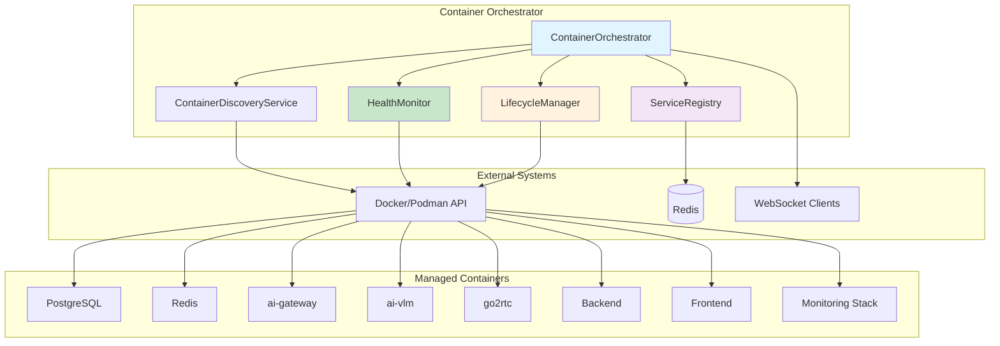
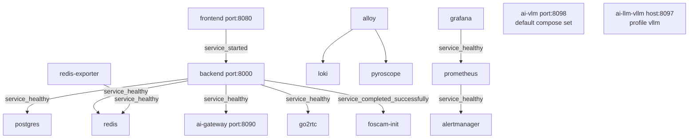
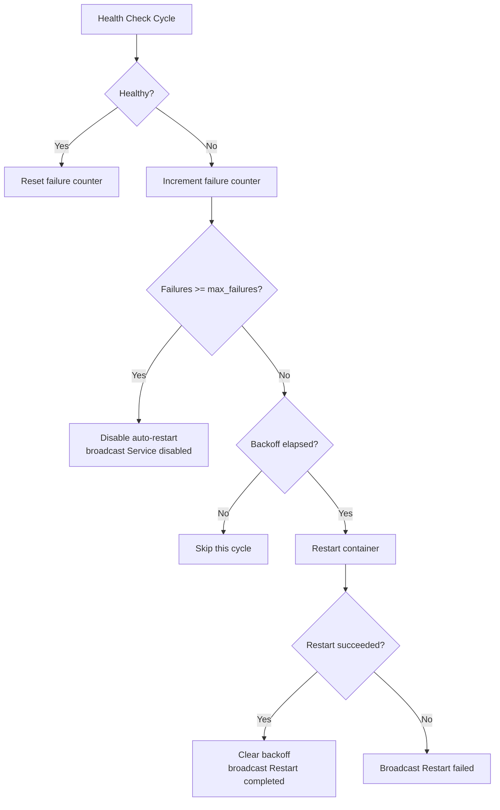
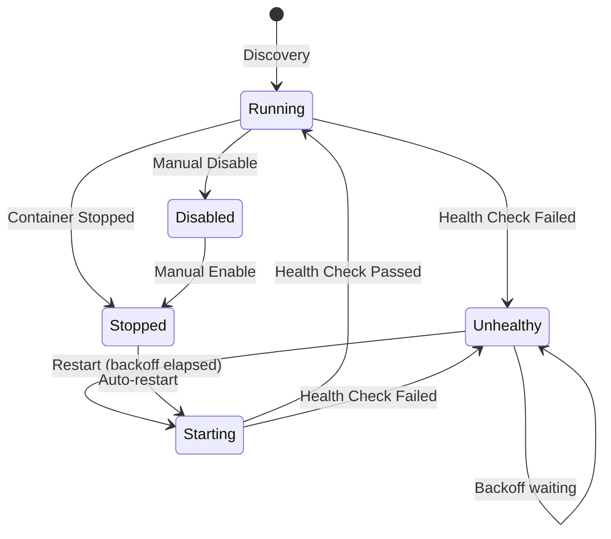

# Container Orchestration

> Documentation for the Container Orchestrator: startup sequences, health checks, self-healing recovery, and dependency management.

---

## Table of Contents

- [Overview](#overview)
- [Architecture](#architecture)
- [Startup Sequence](#startup-sequence)
- [Health Checks](#health-checks)
- [Dependency Graph](#dependency-graph)
- [Self-Healing Recovery](#self-healing-recovery)
- [Service Categories](#service-categories)
- [Configuration](#configuration)
- [API Endpoints](#api-endpoints)
- [Recovery Procedures](#recovery-procedures)
- [Troubleshooting](#troubleshooting)

---

## Overview

The Container Orchestrator is a self-healing container management system that monitors Docker/Podman containers, performs health checks, and automatically recovers failed services. It integrates with the backend application to provide real-time service status via WebSocket broadcasts.

### Key Features

- **Container Discovery**: Automatically discovers containers by name pattern
- **Health Monitoring**: Periodic health checks via HTTP endpoints or shell commands
- **Self-Healing**: Automatic restart with exponential backoff on failure
- **WebSocket Broadcasting**: Real-time service status updates to connected clients
- **State Persistence**: Service state persisted to Redis for durability
- **Grace Period Support**: Configurable startup grace periods before health checks begin

### Components

| Component                 | File                                              | Purpose                                           |
| ------------------------- | ------------------------------------------------- | ------------------------------------------------- |
| ContainerOrchestrator     | `backend/services/container_orchestrator.py`      | Main coordinator integrating all components       |
| ContainerDiscoveryService | `backend/services/container_discovery.py`         | Discovers containers by name pattern              |
| HealthMonitor             | `backend/services/health_monitor_orchestrator.py` | Periodic health check loop                        |
| LifecycleManager          | `backend/services/lifecycle_manager.py`           | Restart logic with exponential backoff            |
| ServiceRegistry           | `backend/services/orchestrator/registry.py`       | In-memory service state with Redis persistence    |
| ComposeParser             | `backend/services/compose_parser.py`              | Derives per-service configs from the compose file |
| DockerClient              | `backend/core/docker_client.py`                   | Async Docker/Podman API wrapper                   |

---

## Architecture

### Component Interaction Diagram


```mermaid
flowchart TB
    subgraph Orchestrator["Container Orchestrator"]
        CO[ContainerOrchestrator]
        DS[ContainerDiscoveryService]
        HM[HealthMonitor]
        LM[LifecycleManager]
        SR[ServiceRegistry]
    end

    subgraph External["External Systems"]
        DC[Docker/Podman API]
        RD[(Redis)]
        WS[WebSocket Clients]
    end

    subgraph Containers["Managed Containers"]
        PG[PostgreSQL]
        RS[Redis]
        AI1[ai-gateway]
        AI2[ai-vlm]
        G2[go2rtc]
        BE[Backend]
        FE[Frontend]
        MON[Monitoring Stack]
    end

    CO --> DS
    CO --> HM
    CO --> LM
    CO --> SR

    DS --> DC
    HM --> DC
    LM --> DC
    SR --> RD

    CO --> WS

    DC --> PG
    DC --> RS
    DC --> AI1
    DC --> AI2
    DC --> G2
    DC --> BE
    DC --> FE
    DC --> MON

    style CO fill:#e1f5fe
    style HM fill:#c8e6c9
    style LM fill:#fff3e0
    style SR fill:#f3e5f5
```

### Data Flow

1. **Startup**: ContainerOrchestrator connects to Docker, discovers containers via ContainerDiscoveryService
2. **Registration**: Discovered services are registered in ServiceRegistry, state loaded from Redis
3. **Monitoring**: HealthMonitor runs periodic health checks (default: every 30 seconds)
4. **Recovery**: On failure, LifecycleManager handles restart with exponential backoff
5. **Broadcasting**: Status changes are broadcast via WebSocket to connected clients
6. **Persistence**: Service state is persisted to Redis for durability across restarts

---

## Startup Sequence

### Phase Overview

Compose orders the stack with health-check conditions. Two services are gated behind compose profiles and so are absent from the default `up` path: `ai-llm-vllm` under `vllm`, and `dcgm-exporter` under `gpu-rootful`. `ai-vlm` is **not** gated — since UR-18 it ships in the default bring-up, so a plain `up -d` starts it with the rest of the stack (until then it sat behind a profile that had to be named explicitly). None of the three appears in any `depends_on`; the gated ones are managed on their own schedule, and `ai-vlm` is reached over HTTP at runtime rather than through a compose edge.

```mermaid
sequenceDiagram
    autonumber
    participant DC as Docker Compose
    participant FI as foscam-init
    participant PG as PostgreSQL
    participant RD as Redis
    participant G2 as go2rtc
    participant GW as AI Gateway
    participant BE as Backend
    participant FE as Frontend

    Note over DC,FE: Phase 1: Data Infrastructure (0-15s)
    DC->>FI: Camera dir init (one-shot)
    DC->>PG: Start PostgreSQL
    DC->>RD: Start Redis
    DC->>G2: Start go2rtc
    PG-->>DC: Healthy (10-15s)
    RD-->>DC: Healthy (5-10s)

    Note over DC,FE: Phase 2: AI Gateway (up to 180s)
    DC->>GW: Start ai-gateway
    Note right of GW: Triton plan load; start_period 180s
    GW-->>DC: Healthy

    Note over DC,FE: Phase 3: Application (30-60s)
    DC->>BE: Start Backend
    BE->>PG: Connect
    BE->>RD: Connect
    BE-->>DC: Healthy (30-60s)

    Note over DC,FE: Phase 4: Frontend (10-20s)
    DC->>FE: Start Frontend
    FE->>BE: Health check
    FE-->>DC: Healthy (10-20s)
```

### Phase 1: Data Infrastructure (0-15 seconds)

Services with no dependencies start immediately:

| Service     | Startup Time | Health Check                                                           | Grace Period           |
| ----------- | ------------ | ---------------------------------------------------------------------- | ---------------------- |
| PostgreSQL  | 10-15s       | `pg_isready -U ${POSTGRES_USER:-security} -d ${POSTGRES_DB:-security}` | 10s                    |
| Redis       | 5-10s        | auth-aware `redis-cli ping`                                            | 15s (category default) |
| go2rtc      | ~5s          | `wget http://localhost:1984/api/streams`                               | 10s                    |
| foscam-init | ~1s          | none (one-shot, `service_completed_successfully`)                      | n/a                    |

### Phase 2: AI Gateway (up to 180 seconds)

| Service    | Startup Time | Health Check                       | Grace Period (start_period) | Notes                                                                 |
| ---------- | ------------ | ---------------------------------- | --------------------------- | --------------------------------------------------------------------- |
| ai-gateway | 60-180s      | GET `http://localhost:8090/health` | 180s                        | Triton + FastAPI in one container; routers `/yolo26` and `/enrich-lt` |

Triton starts with `--model-control-mode=none`, so the repository selected by
`GATEWAY_MODEL_SET` (`vlm` → `{yolo26, reid}`, plus `threat` when
`GATEWAY_ENABLE_THREAT=true`) is resident from container start. The health check
passes once Triton reports ready and every active model reports ready.

`ai-vlm` is in the default `up` (UR-18); `ai-llm-vllm` is the optional
benchmarking engine and lives behind the `vllm` profile:

| Service       | Profile         | Host port             | Health Check                                | Grace Period |
| ------------- | --------------- | --------------------- | ------------------------------------------- | ------------ |
| `ai-vlm`      | — (default set) | 8098                  | GET `http://localhost:8098/health`          | 120s         |
| `ai-llm-vllm` | `vllm`          | 8097 → container 8000 | GET `http://localhost:8000/health` (inside) | 300s         |

### Phase 3: Application (30-60 seconds)

Backend starts after PostgreSQL, Redis, ai-gateway, and go2rtc are healthy (and
foscam-init has completed):

| Service | Dependencies                                       | Health Check                   | Grace Period |
| ------- | -------------------------------------------------- | ------------------------------ | ------------ |
| Backend | PostgreSQL, Redis, ai-gateway, go2rtc, foscam-init | GET `/api/system/health/ready` | 30s          |

`ai-vlm` is deliberately **not** in the backend's `depends_on`: when the engine
is down the backend must still boot, and the VLM stage degrades to its own
unavailable path rather than blocking startup. Nothing depends on `ai-vlm`
either, so its failure never takes the rest of the stack down.

### Phase 4: Frontend (10-20 seconds)

Frontend starts after the backend container has started (`condition:
service_started`, not `service_healthy`):

| Service  | Dependencies | Health Check                                                            | Grace Period |
| -------- | ------------ | ----------------------------------------------------------------------- | ------------ |
| Frontend | Backend      | `wget --spider http://localhost:${FRONTEND_INTERNAL_PORT:-8080}/health` | 40s          |

### Monitoring Stack (Parallel with Core Services)

The observability containers start alongside the core stack with no dependency
on it, except for these compose-declared orderings:

| Service        | depends_on (condition)                    |
| -------------- | ----------------------------------------- |
| prometheus     | alertmanager (healthy)                    |
| grafana        | prometheus (healthy)                      |
| redis-exporter | redis (healthy)                           |
| alloy          | loki, pyroscope (list form, no condition) |

---

## Health Checks

### Health Check Methods (Priority Order)

`HealthMonitor` picks one method per service (`backend/services/health_monitor_orchestrator.py`):

1. **HTTP endpoint** — used when the service config has `health_endpoint`
2. **Command** — executed inside the container when `health_cmd` is set
3. **Container status** — falls back to "container `status == running`" when neither is configured

### Compose-Level Health Checks

Every parameter below is measured from `docker-compose.prod.yml`. `start_period`
is what the orchestrator uses as the startup grace period when the service has no
`orchestrator.startup_grace_period` label.

| Service                               | interval | timeout | retries | start_period | Check                                                   |
| ------------------------------------- | -------- | ------- | ------- | ------------ | ------------------------------------------------------- |
| postgres                              | 10s      | 5s      | 5       | 10s          | `pg_isready`                                            |
| redis                                 | 10s      | 5s      | 3       | (none)       | auth-aware `redis-cli ping`                             |
| ai-gateway                            | 15s      | 10s     | 5       | 180s         | `curl -f http://localhost:8090/health`                  |
| ai-vlm (default compose set)          | 10s      | 5s      | 3       | 120s         | `curl -f http://localhost:8098/health`                  |
| ai-llm-vllm (profile `vllm`)          | 10s      | 5s      | 3       | 300s         | `curl -f http://localhost:8000/health` (container port) |
| backend                               | 10s      | 5s      | 3       | 30s          | `httpx` GET `/api/system/health/ready`                  |
| go2rtc                                | 30s      | 10s     | 3       | 10s          | `wget http://localhost:1984/api/streams`                |
| frontend                              | 30s      | 10s     | 3       | 40s          | `wget --spider .../health`                              |
| tempo                                 | 15s      | 5s      | 3       | (none)       | `wget --spider :3200/ready`                             |
| prometheus                            | 15s      | 5s      | 3       | (none)       | `wget --spider :9090/-/healthy`                         |
| grafana                               | 15s      | 5s      | 3       | (none)       | `wget --spider :3000/api/health`                        |
| alertmanager                          | 15s      | 5s      | 3       | (none)       | `wget --spider :9093/-/healthy`                         |
| blackbox-exporter                     | 15s      | 5s      | 3       | (none)       | `wget --spider :9115/metrics`                           |
| node-exporter                         | 15s      | 5s      | 3       | (none)       | `wget --spider :9100/metrics`                           |
| loki                                  | 10s      | 5s      | 5       | (none)       | `wget --spider :3100/ready`                             |
| pyroscope                             | 10s      | 5s      | 5       | (none)       | `wget --spider :4040/ready`                             |
| alloy                                 | 10s      | 5s      | 5       | (none)       | `pgrep -f alloy` (process liveness, not HTTP)           |
| dcgm-exporter (profile `gpu-rootful`) | 30s      | 10s     | 3       | (none)       | `wget -O- :9400/metrics`                                |
| redis-exporter                        | —        | —       | —       | —            | **`healthcheck.disable: true`** — no probe              |
| json-exporter                         | —        | —       | —       | —            | no `healthcheck:` block                                 |
| foscam-init                           | —        | —       | —       | —            | no `healthcheck:` block (one-shot)                      |

Two consequences worth knowing: `redis-exporter` reports "healthy" as soon as the
container is running because its probe is explicitly disabled, and
`json-exporter` falls to the container-status check because it declares none.

### Gateway Health Response Shape

`GET http://localhost:8090/health` (`ai/gateway/main.py`) returns:

```json
{
  "status": "healthy",
  "triton_server_ready": true,
  "models": { "yolo26": true, "reid": true },
  "models_loaded": 2,
  "models_total": 2
}
```

`status` is `healthy` only when Triton itself is ready **and** every active model
reports ready; otherwise it is `degraded`. With `GATEWAY_ENABLE_THREAT=true` the
`threat` model joins the map, so `models_total` becomes 3 — the counts are
whatever the mounted repository holds, not a fixed 13.

### Verifying From the Host

```bash
curl -s http://localhost:8090/health | jq '{status, triton_server_ready, models, models_loaded, models_total}'
curl -s http://localhost:8000/api/system/health/ready | jq .
# ai-vlm starts with the default up, so this answers once it is healthy:
curl -s http://localhost:8098/health | jq .
```

---

## Dependency Graph

### Compose Dependency Diagram


```mermaid
flowchart TD
    PG[postgres]
    RD[redis]
    G2[go2rtc]
    FI[foscam-init]
    GW[ai-gateway port:8090]
    BE[backend port:8000]
    FE[frontend port:8080]
    AM[alertmanager]
    PR[prometheus]
    GR[grafana]
    LK[loki]
    PY[pyroscope]
    AL[alloy]
    RX[redis-exporter]

    BE -->|service_healthy| PG
    BE -->|service_healthy| RD
    BE -->|service_healthy| GW
    BE -->|service_healthy| G2
    BE -->|service_completed_successfully| FI
    FE -->|service_started| BE
    PR -->|service_healthy| AM
    GR -->|service_healthy| PR
    RX -->|service_healthy| RD
    AL --> LK
    AL --> PY

    VLM[ai-vlm port:8098<br/>default compose set]
    VLLM[ai-llm-vllm host:8097<br/>profile vllm]
```

`ai-vlm` and `ai-llm-vllm` have no `depends_on` edges in either direction: the
backend reaches `ai-vlm` over HTTP at runtime rather than through a compose
ordering, which is why `ai-vlm`'s start failure never cascades into the rest of
the stack.

### Dependency Matrix

| Service              | Depends on (compose)                                                   | On the AI path             |
| -------------------- | ---------------------------------------------------------------------- | -------------------------- |
| postgres             | —                                                                      | —                          |
| redis                | —                                                                      | —                          |
| go2rtc               | —                                                                      | —                          |
| foscam-init          | —                                                                      | —                          |
| ai-gateway           | —                                                                      | Triton: `yolo26` (+`reid`) |
| ai-vlm               | — (default set)                                                        | the VLM stage itself       |
| ai-llm-vllm          | — (profile `vllm`)                                                     | optional benchmark engine  |
| backend              | postgres, redis, ai-gateway, go2rtc (healthy); foscam-init (completed) | yes — calls the gateway    |
| frontend             | backend (started)                                                      | —                          |
| prometheus           | alertmanager (healthy)                                                 | —                          |
| grafana              | prometheus (healthy)                                                   | —                          |
| redis-exporter       | redis (healthy)                                                        | —                          |
| alloy                | loki, pyroscope                                                        | —                          |
| every other exporter | —                                                                      | —                          |

---

## Self-Healing Recovery

### Restart Flow


```mermaid
flowchart TD
    A[Health Check Cycle] --> B{Healthy?}
    B -->|Yes| C[Reset failure counter]
    B -->|No| D[Increment failure counter]
    D --> E{Failures >= max_failures?}
    E -->|Yes| F[Disable auto-restart<br/>broadcast Service disabled]
    E -->|No| G{Backoff elapsed?}
    G -->|No| H[Skip this cycle]
    G -->|Yes| I[Restart container]
    I --> J{Restart succeeded?}
    J -->|Yes| K[Clear backoff<br/>broadcast Restart completed]
    J -->|No| L[Broadcast Restart failed]
```

### Backoff Calculation

`LifecycleManager` computes the delay as `min(base * 2^attempt, max_backoff)`
(`backend/services/lifecycle_manager.py`), so with the AI category defaults
(base 5.0s, max 300s) consecutive failures wait 5s, 10s, 20s, 40s, 80s, 160s,
then 300s. `restart_backoff_base` / `restart_backoff_max` come from the
`orchestrator.*` labels, else the category defaults.

### Recovery States


```mermaid
stateDiagram-v2
    [*] --> Running: Discovery
    Running --> Unhealthy: Health Check Failed
    Unhealthy --> Starting: Restart (backoff elapsed)
    Unhealthy --> Unhealthy: Backoff waiting
    Starting --> Running: Health Check Passed
    Starting --> Unhealthy: Health Check Failed
    Running --> Stopped: Container Stopped
    Stopped --> Starting: Auto-restart
    Running --> Disabled: Manual Disable
    Disabled --> Stopped: Manual Enable
```

### Service Status Values

`ContainerServiceStatus` (`backend/api/schemas/services.py`, re-exported by
`backend/services/orchestrator/enums.py`) is a `StrEnum` built with `auto()`, so
the wire values are the lowercased names — `running`, `starting`, `unhealthy`,
`stopped`, `disabled`, `not_found`:

| Status      | Description                                                      |
| ----------- | ---------------------------------------------------------------- |
| `RUNNING`   | Container running and health checks passing                      |
| `STARTING`  | Container starting, in grace period                              |
| `UNHEALTHY` | Health check failed, awaiting restart                            |
| `STOPPED`   | Container stopped                                                |
| `DISABLED`  | Auto-restart disabled (manual intervention required)             |
| `NOT_FOUND` | Container not found in Docker (also the initial default on load) |

### Category-Specific Defaults

From `backend/services/compose_parser.py` (`CATEGORY_DEFAULTS`) — applied when
the service carries no `orchestrator.*` label:

| Category       | Grace Period | Max Failures | Base Backoff | Max Backoff |
| -------------- | ------------ | ------------ | ------------ | ----------- |
| Infrastructure | 15s          | 10           | 2.0s         | 60s         |
| AI             | 60s          | 5            | 5.0s         | 300s        |
| Monitoring     | 30s          | 5            | 10.0s        | 120s        |

---

## Service Categories

The compose file carries **no** `orchestrator.*` labels, so every value below
comes from the parser: category by explicit list or name prefix, display name by
`_format_display_name()`, grace period by the healthcheck `start_period` (else the
category default), max failures by the healthcheck `retries` (else the category
default).

### Infrastructure Services

Critical services required for application operation (explicit list in
`compose_parser.INFRASTRUCTURE_SERVICES`):

| Service  | Display Name | Port | Grace Period                                       |
| -------- | ------------ | ---- | -------------------------------------------------- |
| postgres | PostgreSQL   | 5432 | 10s                                                |
| redis    | Redis        | 6379 | 15s (category default — no compose `start_period`) |
| backend  | Backend      | 8000 | 30s                                                |
| frontend | Frontend     | 8080 | 40s                                                |
| go2rtc   | Go2rtc       | 1984 | 10s                                                |

### AI Services

GPU-accelerated AI inference services (any `ai-*` service name is categorized AI):

| Service     | Display Name | Port                        | Grace Period | Profile   | What it holds                                                  |
| ----------- | ------------ | --------------------------- | ------------ | --------- | -------------------------------------------------------------- |
| ai-gateway  | Gateway      | 8090 (+8002 Triton metrics) | 180s         | (default) | Triton + FastAPI; the `GATEWAY_MODEL_SET` repository, resident |
| ai-vlm      | Vlm          | 8098                        | 120s         | (default) | one llama.cpp server, one GGUF pair                            |
| ai-llm-vllm | Llm Vllm     | 8097 → container 8000       | 300s         | `vllm`    | optional vLLM benchmarking engine                              |

Detection and re-ID models all run inside `ai-gateway`'s Triton process, and the
VLM stage runs in `ai-vlm`. Triton starts with `--model-control-mode=none`: the
repository is sized at container start, resident from then on, and never loaded,
unloaded, or evicted at runtime — see
[GPU Memory Limits](./gpu-memory-limits.md).

### Monitoring Services

Observability and alerting stack (category by `CATEGORY_PREFIXES`):

| Service           | Display Name      | Port  | Grace Period                                       |
| ----------------- | ----------------- | ----- | -------------------------------------------------- |
| prometheus        | Prometheus        | 9090  | 30s (category default — no compose `start_period`) |
| grafana           | Grafana           | 3002  | 30s (category default)                             |
| alertmanager      | Alertmanager      | 9093  | 30s (category default)                             |
| tempo             | Tempo             | 3200  | 30s (category default)                             |
| loki              | Loki              | 3100  | 30s (category default)                             |
| pyroscope         | Pyroscope         | 4040  | 30s (category default)                             |
| alloy             | Grafana Alloy     | 12345 | 30s (category default)                             |
| node-exporter     | Node Exporter     | 9100  | 30s (category default)                             |
| blackbox-exporter | Blackbox Exporter | 9115  | 30s (category default)                             |
| dcgm-exporter     | DCGM Exporter     | 9400  | 30s (category default; profile `gpu-rootful`)      |
| redis-exporter    | Redis Exporter    | 9121  | 30s (category default; healthcheck disabled)       |
| json-exporter     | JSON Exporter     | 7979  | 30s (category default)                             |

Distributed tracing is served by **Tempo** — there is no Jaeger container.

### Compose Inventory

`docker-compose.prod.yml` declares 21 services on one network (`security-net`):
`postgres`, `ai-vlm`, `ai-llm-vllm`, `ai-gateway`, `foscam-init`, `backend`,
`redis`, `go2rtc`, `frontend`, `tempo`, `prometheus`, `grafana`,
`redis-exporter`, `json-exporter`, `alertmanager`, `blackbox-exporter`, `loki`,
`pyroscope`, `node-exporter`, `dcgm-exporter`, `alloy`.

Named volumes: `postgres_data`, `redis_data`, `tempo_data`, `hf_cache`,
`prometheus_data`, `grafana_data`, `alertmanager_data`, `loki_data`,
`pyroscope_data`, `alloy_symb_cache`, `frontend_certs`, `triton-kernel-cache`,
`triton-tmp-cache`, `llama-cache`, `llama-nv-cache`.

---

## Configuration

### Environment Variables

The orchestrator is configured via environment variables with the `ORCHESTRATOR_`
prefix (`OrchestratorSettings` in `backend/core/config.py`):

| Variable                                | Default                                                                          | Description                                                                        |
| --------------------------------------- | -------------------------------------------------------------------------------- | ---------------------------------------------------------------------------------- |
| `ORCHESTRATOR_ENABLED`                  | `true`                                                                           | Enable container orchestrator                                                      |
| `ORCHESTRATOR_DOCKER_HOST`              | unset (Docker/Podman default; compose sets `unix:///var/run/podman/podman.sock`) | Docker/Podman API endpoint                                                         |
| `ORCHESTRATOR_COMPOSE_FILE`             | `docker-compose.prod.yml`                                                        | Compose file parsed for dynamic service discovery; `None` = hardcoded configs only |
| `ORCHESTRATOR_HEALTH_CHECK_INTERVAL`    | `30` (5-300)                                                                     | Seconds between health checks                                                      |
| `ORCHESTRATOR_HEALTH_CHECK_TIMEOUT`     | `5` (1-60)                                                                       | Timeout for health check requests                                                  |
| `ORCHESTRATOR_STARTUP_GRACE_PERIOD`     | `60` (10-600)                                                                    | Global default grace period (per-service values come from compose)                 |
| `ORCHESTRATOR_MAX_CONSECUTIVE_FAILURES` | `5` (1-50)                                                                       | Failures before auto-restart is disabled (per-service may override)                |
| `ORCHESTRATOR_RESTART_BACKOFF_BASE`     | `5.0` (1.0-60.0)                                                                 | Global backoff base (per-service comes from compose labels/category)               |
| `ORCHESTRATOR_RESTART_BACKOFF_MAX`      | `300.0`                                                                          | Global backoff cap                                                                 |
| `ORCHESTRATOR_MONITORING_ENABLED`       | `true`                                                                           | Include monitoring services                                                        |

Per-service overrides are available as compose labels (interpreted by
`ComposeParser`): `orchestrator.enabled`, `orchestrator.category`,
`orchestrator.display_name`, `orchestrator.startup_grace_period`,
`orchestrator.max_failures`, `orchestrator.backoff_base`,
`orchestrator.backoff_max`. With no label, category comes from
`INFRASTRUCTURE_SERVICES` / `CATEGORY_PREFIXES`, grace from the healthcheck
`start_period` (then the category default), and max-failures from `retries` (then
the category default).

### Podman/Docker API Access

The orchestrator talks to the container engine over its API socket. In the
standard deployment this needs **no setup**: `docker-compose.prod.yml` mounts the
host Podman socket into the backend container and sets
`ORCHESTRATOR_DOCKER_HOST=unix:///var/run/podman/podman.sock` (it also mounts the
compose file read-only so the parser can discover services). The socket comes from
the `PODMAN_SOCKET` variable in `.env` — enable the socket on the host with:

```bash
systemctl --user enable --now podman.socket   # rootless: /run/user/$UID/podman/podman.sock
# or system-wide: systemctl enable --now podman.socket
```

A TCP listener (`podman system service --time=0 tcp:0.0.0.0:2375`) works as a
fallback but is unnecessary and less secure — prefer the socket.

### Port Configuration

Service ports come from the standard `.env` variables (read via Pydantic
`validation_alias`, so `.env` remains the single source of truth):

```python
# backend/core/config.py (excerpt)
class OrchestratorSettings(BaseSettings):
    postgres_port: int = Field(5432, validation_alias="POSTGRES_PORT")
    redis_port: int = Field(6379, validation_alias="REDIS_PORT")
    backend_port: int = Field(8000, validation_alias="API_PORT")
    go2rtc_port: int = Field(1984, validation_alias="GO2RTC_API_PORT")
    ai_gateway_port: int = Field(8090, validation_alias="AI_GATEWAY_PORT")
    vllm_port: int = Field(8097, validation_alias="VLLM_PORT")
    prometheus_port: int = Field(9090, validation_alias="PROMETHEUS_PORT")
    grafana_port: int = Field(3002, validation_alias="GRAFANA_PORT")
    # ... plus redis_exporter_port, json_exporter_port, alertmanager_port,
    # blackbox_exporter_port, tempo_port, loki_port, pyroscope_port,
    # alloy_port (ALLOY_UI_PORT), node_exporter_port, cadvisor_port,
    # dcgm_exporter_port, frontend_port (FRONTEND_INTERNAL_PORT)
```

`vllm_port` is the **host** port: compose maps `${VLLM_PORT:-8097}:8000`, and the
in-container health check still targets port 8000 — the same host-port convention
as Grafana's 3002-over-3000.

---

## API Endpoints

### Health Endpoints

| Endpoint                        | Method | Description                                  |
| ------------------------------- | ------ | -------------------------------------------- |
| `/api/system/health`            | GET    | Basic health status                          |
| `/api/system/health/live`       | GET    | Liveness probe                               |
| `/api/system/health/ready`      | GET    | Readiness probe (what the healthcheck calls) |
| `/api/system/health/websocket`  | GET    | WebSocket subsystem health                   |
| `/api/system/health/full`       | GET    | Comprehensive health with all services       |
| `/api/health/ai-services`       | GET    | AI services health with circuit breakers     |
| `/api/system/monitoring/health` | GET    | Monitoring stack health                      |

### Service Management Endpoints

Router prefix is `/api/system/services` (`backend/api/routes/services.py`):

| Endpoint                              | Method | Description                                                        |
| ------------------------------------- | ------ | ------------------------------------------------------------------ |
| `/api/system/services`                | GET    | List all managed services (503 if the orchestrator is unavailable) |
| `/api/system/services/{name}/restart` | POST   | Trigger manual restart (resets failure count)                      |
| `/api/system/services/{name}/start`   | POST   | Start a stopped service                                            |
| `/api/system/services/{name}/enable`  | POST   | Enable auto-restart                                                |
| `/api/system/services/{name}/disable` | POST   | Disable auto-restart                                               |

There is no `GET /api/system/services/{name}` — fetch the list and filter by `name`.

### WebSocket Events

Service status changes are broadcast via WebSocket:

```json
{
  "type": "service_status",
  "data": {
    "name": "ai-gateway",
    "display_name": "Gateway",
    "category": "ai",
    "status": "running",
    "enabled": true,
    "container_id": "abc123def456",
    "image": "<project>-ai-gateway:latest",
    "port": 8090,
    "failure_count": 0,
    "restart_count": 2,
    "last_restart_at": "2026-09-22T10:30:00Z",
    "uptime_seconds": 3600
  },
  "message": "Service recovered"
}
```

**Event Messages** (the strings `_broadcast_status()` emits in
`backend/services/container_orchestrator.py`):

| Message                                   | Description                       |
| ----------------------------------------- | --------------------------------- |
| `Service discovered`                      | Container discovered on startup   |
| `Service recovered`                       | Health check passed after failure |
| `Health check failed`                     | Health check failed               |
| `Manual restart initiated`                | User triggered restart            |
| `Restart completed`                       | Restart succeeded                 |
| `Restart failed`                          | Restart failed                    |
| `Service disabled - max failures reached` | Auto-restart disabled             |
| `Service enabled`                         | Manual re-enable                  |
| `Service disabled`                        | Manual disable                    |

---

## Recovery Procedures

### Common Failure Scenarios

#### Scenario 1: GPU Out Of Memory

**Symptoms:**

- `ai-gateway` fails its health check within its start period, or Triton logs a load failure
- GPU memory usage at 100%

**Recovery Steps:**

```bash
# 1. Check GPU memory usage
nvidia-smi

# 2. Identify memory-hogging processes
nvidia-smi --query-compute-apps=pid,used_memory --format=csv

# 3. Stop the GPU consumers
podman compose -f docker-compose.prod.yml stop ai-gateway

# 4. Restart one at a time, waiting for health between them
podman compose -f docker-compose.prod.yml start ai-gateway
podman compose -f docker-compose.prod.yml ps ai-gateway
```

Nothing evicts at runtime, so an OOM is a sizing problem: the mounted Triton
repository (and whether `GATEWAY_ENABLE_THREAT=true` added the threat model) is
what has to fit. See
[GPU Memory Limits](./gpu-memory-limits.md) for which knobs shrink the footprint.

#### Scenario 2: Database Connection Pool Exhausted

**Symptoms:**

- Backend health check failing with database errors
- PostgreSQL container healthy but connections refused

**Recovery Steps:**

```bash
# 1. Check active connections
podman compose -f docker-compose.prod.yml exec postgres \
  psql -U security -d security -c "SELECT count(*) FROM pg_stat_activity;"

# 2. Kill idle connections
podman compose -f docker-compose.prod.yml exec postgres \
  psql -U security -d security -c \
  "SELECT pg_terminate_backend(pid) FROM pg_stat_activity WHERE state = 'idle' AND pid <> pg_backend_pid();"

# 3. Restart backend if needed
podman compose -f docker-compose.prod.yml restart backend
```

#### Scenario 3: Redis Memory Limit Reached

**Symptoms:**

- Redis health check failing
- OOM errors in Redis logs

**Recovery Steps:**

```bash
# 1. Check Redis memory usage
podman compose -f docker-compose.prod.yml exec redis redis-cli INFO memory

# 2. Flush non-critical caches
podman compose -f docker-compose.prod.yml exec redis redis-cli FLUSHDB

# 3. If persistent, restart Redis
podman compose -f docker-compose.prod.yml restart redis
```

#### Scenario 4: Container Orchestrator Not Connecting

**Symptoms:**

- Services not auto-recovering
- Backend logs show "Failed to connect to Docker daemon"

**Recovery Steps:**

```bash
# 1. Verify the Podman socket the backend uses is up (PODMAN_SOCKET from .env)
systemctl --user status podman.socket
podman --url unix:///run/user/$(id -u)/podman/podman.sock info

# 2. If the socket is off, enable it
systemctl --user enable --now podman.socket

# 3. Restart backend to reconnect
podman compose -f docker-compose.prod.yml restart backend
```

### Manual Service Recovery

#### Enable a Disabled Service

```bash
# Via API
curl -X POST http://localhost:8000/api/system/services/ai-gateway/enable

# Verify status (there is no per-service GET — filter the list)
curl -s http://localhost:8000/api/system/services | jq '.services[] | select(.name=="ai-gateway")'
```

#### Force Restart with Failure Reset

```bash
# Via API — POST /restart always resets the failure counter
curl -X POST http://localhost:8000/api/system/services/ai-gateway/restart
```

---

## Troubleshooting

### Diagnostic Commands

```bash
# Check all container statuses
podman compose -f docker-compose.prod.yml ps

# View logs for specific service
podman compose -f docker-compose.prod.yml logs -f ai-gateway

# Check orchestrator logs
podman compose -f docker-compose.prod.yml logs backend | grep -E "orchestrator|health"

# Test individual health endpoint
curl http://localhost:8090/health                       # ai-gateway
curl http://localhost:8000/api/system/health/ready      # backend
curl http://localhost:8098/health                       # ai-vlm (default set)

# Check GPU status
nvidia-smi

# Check the container engine API the backend uses (same PODMAN_SOCKET as .env)
podman info --format '{{.Host.RemoteSocket.Path}}' 2>/dev/null || podman ps
```

### Common Issues

| Issue                                  | Possible Cause                     | Solution                                  |
| -------------------------------------- | ---------------------------------- | ----------------------------------------- |
| Service stuck in UNHEALTHY             | Backoff period active              | Wait for backoff or manually restart      |
| All AI services failing                | GPU driver issue                   | Run `nvidia-smi`, restart GPU services    |
| Health checks timing out               | Service overloaded                 | Increase timeout, check resource limits   |
| Container not discovered               | Name pattern mismatch              | Check container name contains service key |
| State not persisting                   | Redis connection issue             | Check Redis health, verify connection     |
| WebSocket not receiving updates        | Broadcast disabled                 | Check `broadcast_fn` configuration        |
| Profiled service missing from the list | `vllm` / `gpu-rootful` not enabled | `podman compose --profile vllm up -d`     |

### Log Messages Reference

| Log Message                            | Meaning                | Action                            |
| -------------------------------------- | ---------------------- | --------------------------------- |
| `ContainerOrchestrator started`        | Orchestrator running   | Normal                            |
| `Discovered N containers`              | Discovery complete     | Normal                            |
| `Service X recovered`                  | Health check passing   | Normal                            |
| `Health check failed for X`            | Service unhealthy      | Monitor for auto-recovery         |
| `Service X in backoff, N.Ns remaining` | Waiting before retry   | Wait or manual restart            |
| `Restarted service X`                  | Auto-restart succeeded | Normal                            |
| `Failed to connect to Docker daemon`   | API connection failed  | Start Podman API                  |
| `Service X exceeded N failures`        | Max failures reached   | Manual intervention may be needed |

---

## See Also

- [GPU Memory Limits](./gpu-memory-limits.md) - GPU assignment and memory bounds
- [YOLO26 Deployment Guide](./yolo26-migration.md) - The detector inside `ai-gateway`
- [Monitoring Guide](../operator/monitoring/README.md) - Observability setup
- [AI Services](../operator/ai-services.md) - AI service configuration
- [Service Control](../operator/service-control.md) - Manual service management
- [Troubleshooting](../reference/troubleshooting/index.md) - General troubleshooting

---

## Appendix: Docker Compose Health Check Configuration

Reference configuration from `docker-compose.prod.yml` (measured values):

```yaml
# Backend health check
backend:
  healthcheck:
    test:
      [
        'CMD-SHELL',
        'python -c "import httpx; r = httpx.get(''http://localhost:8000/api/system/health/ready''); exit(0 if r.status_code == 200 else 1)"',
      ]
    interval: 10s
    timeout: 5s
    retries: 3
    start_period: 30s
  depends_on:
    postgres:
      condition: service_healthy
    redis:
      condition: service_healthy
    ai-gateway:
      condition: service_healthy
    go2rtc:
      condition: service_healthy
    foscam-init:
      condition: service_completed_successfully

# AI gateway health check
ai-gateway:
  healthcheck:
    test: ['CMD', 'curl', '-f', 'http://localhost:8090/health']
    interval: 15s
    timeout: 10s
    retries: 5
    start_period: 180s

# VLM engine health check (default compose set; GGUF pair takes minutes to load)
ai-vlm:
  healthcheck:
    test: ['CMD', 'curl', '-f', 'http://localhost:8098/health']
    interval: 10s
    timeout: 5s
    retries: 3
    start_period: 120s

# Infrastructure health check
postgres:
  healthcheck:
    test: ['CMD-SHELL', 'pg_isready -U ${POSTGRES_USER:-security} -d ${POSTGRES_DB:-security}']
    interval: 10s
    timeout: 5s
    retries: 5
    start_period: 10s
```
