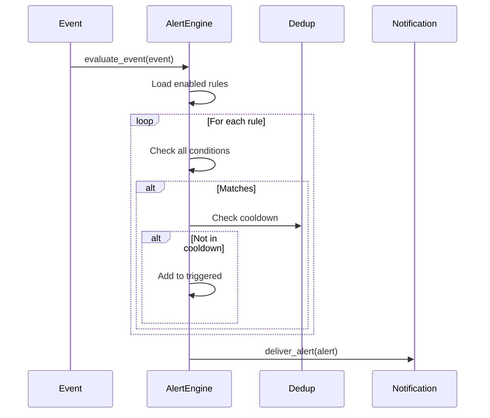
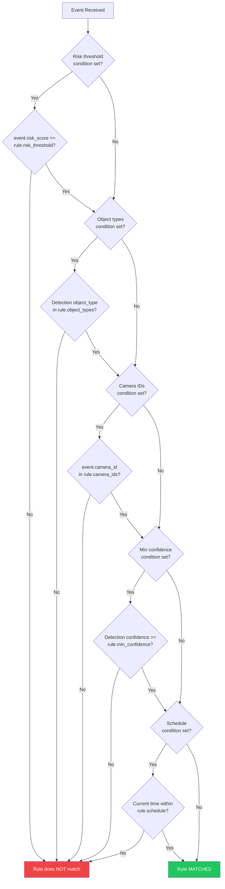
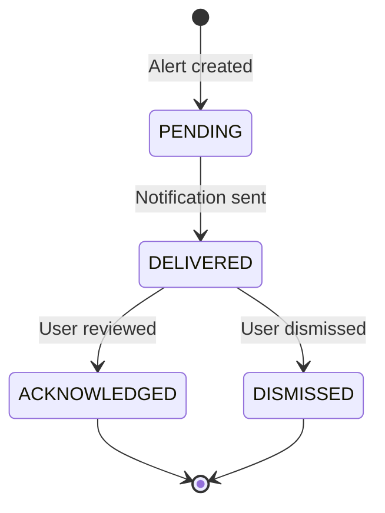

# Alert System Technical Documentation

> Technical deep-dive into the alert/notification system for developers.

**Time to read:** ~10 min
**Prerequisites:** [Codebase Tour](codebase-tour.md)

---

## Overview

The alert system notifies users when security events match configured rule conditions:


_Alert engine pipeline showing events flowing through rule evaluation, deduplication, and notification delivery._

```
Events --> [Alert Rules] --> [Alert Engine] --> [Dedup] --> [Notification]
```

| Component     | File                               | Purpose                       |
| ------------- | ---------------------------------- | ----------------------------- |
| Alert Rules   | `backend/models/alert.py`          | Define trigger conditions     |
| Alert Engine  | `backend/services/alert_engine.py` | Evaluate rules against events |
| Deduplication | `backend/services/alert_dedup.py`  | Prevent alert fatigue         |
| Notification  | `backend/services/notification.py` | Deliver through channels      |

**Key Design Decisions:**

- AND logic: All conditions in a rule must match
- Multiple rules can trigger for the same event
- Higher severity rules take precedence
- Cooldown-based deduplication using time windows

---

## Alert Rules

### Rule Structure

```python
# backend/models/alert.py
class AlertRule(Base):
    id: Mapped[str]                    # UUID
    name: Mapped[str]                  # Human-readable name
    enabled: Mapped[bool]              # Active/inactive
    severity: Mapped[AlertSeverity]    # LOW, MEDIUM, HIGH, CRITICAL

    # Conditions (all must match)
    risk_threshold: Mapped[int | None]      # Alert when risk >= threshold
    object_types: Mapped[list | None]       # ["person", "vehicle", ...]
    camera_ids: Mapped[list | None]         # Specific cameras (empty = all)
    min_confidence: Mapped[float | None]    # 0.0-1.0 confidence threshold
    schedule: Mapped[dict | None]           # Time-based conditions

    # Deduplication
    dedup_key_template: Mapped[str]         # "{camera_id}:{rule_id}"
    cooldown_seconds: Mapped[int]           # Default: 300

    # Notification
    channels: Mapped[list | None]           # ["email", "webhook"]
```

### Supported Conditions

| Condition        | Type        | Description              |
| ---------------- | ----------- | ------------------------ |
| `risk_threshold` | `int`       | Min risk score (0-100)   |
| `object_types`   | `list[str]` | Object classes to match  |
| `camera_ids`     | `list[str]` | Camera restrictions      |
| `min_confidence` | `float`     | Min detection confidence |
| `schedule`       | `dict`      | Time-based restrictions  |

### Schedule Format

```json
{
  "days": ["monday", "tuesday"],
  "start_time": "22:00",
  "end_time": "06:00",
  "timezone": "America/New_York"
}
```

If `start_time > end_time`, schedule spans midnight.

---

## Evaluation Pipeline



### Alert Rule Condition Evaluation

All conditions in a rule must match (AND logic) for the rule to trigger:



### Deduplication

Prevents alert fatigue using cooldown windows:

```python
# Dedup key format: "camera_id:object_type:zone"
# Example: "front_door:person:entry_zone"

dedup_key_template = "{camera_id}:{rule_id}"  # Default
cooldown_seconds = 300  # 5 minutes
```

**Race Condition Prevention:** Uses `SELECT ... FOR UPDATE SKIP LOCKED` for atomic check-then-insert.

---

## Notification Channels

| Channel | Status      | Required Config                  |
| ------- | ----------- | -------------------------------- |
| Email   | Implemented | `SMTP_HOST`, `SMTP_FROM_ADDRESS` |
| Webhook | Implemented | `DEFAULT_WEBHOOK_URL`            |
| Push    | Stubbed     | Not yet implemented              |

### Configuration

```bash
# Enable notifications
NOTIFICATION_ENABLED=true

# Email (SMTP)
SMTP_HOST=smtp.gmail.com
SMTP_PORT=587
SMTP_USER=your-email@gmail.com
SMTP_PASSWORD=app-specific-password
SMTP_FROM_ADDRESS=alerts@yourdomain.com
DEFAULT_EMAIL_RECIPIENTS=["admin@example.com"]

# Webhook
DEFAULT_WEBHOOK_URL=https://hooks.example.com/alerts
WEBHOOK_TIMEOUT_SECONDS=30
```

### Webhook Payload

```json
{
  "type": "security_alert",
  "alert": {
    "id": "550e8400-...",
    "event_id": 123,
    "severity": "high",
    "dedup_key": "front_door:person"
  },
  "metadata": {
    "rule_name": "Night Intruder Alert",
    "matched_conditions": ["risk_score >= 70"]
  },
  "timestamp": "2025-12-28T12:00:01Z"
}
```

---

## Alert History

### Alert Model

```python
class Alert(Base):
    id: Mapped[str]                      # UUID
    event_id: Mapped[int]                # Related event
    rule_id: Mapped[str | None]          # Triggering rule
    severity: Mapped[AlertSeverity]
    status: Mapped[AlertStatus]          # PENDING/DELIVERED/ACKNOWLEDGED/DISMISSED
    dedup_key: Mapped[str]
    created_at: Mapped[datetime]
    delivered_at: Mapped[datetime | None]
    alert_metadata: Mapped[dict | None]  # Matched conditions
```

### Status Flow



The alert lifecycle progresses through these states:

- **PENDING**: Alert created but notification not yet sent
- **DELIVERED**: Notification successfully sent via configured channels
- **ACKNOWLEDGED**: User has reviewed and acknowledged the alert
- **DISMISSED**: User has dismissed the alert without action

---

## API Reference

### Alert Rules

| Method | Endpoint                      | Description         |
| ------ | ----------------------------- | ------------------- |
| GET    | `/api/alerts/rules`           | List rules          |
| POST   | `/api/alerts/rules`           | Create rule         |
| GET    | `/api/alerts/rules/{id}`      | Get rule            |
| PUT    | `/api/alerts/rules/{id}`      | Update rule         |
| DELETE | `/api/alerts/rules/{id}`      | Delete rule         |
| POST   | `/api/alerts/rules/{id}/test` | Test against events |

**Create Rule:**

```bash
curl -X POST http://localhost:8000/api/alerts/rules \
  -H "Content-Type: application/json" \
  -d '{
    "name": "Night Intruder",
    "severity": "critical",
    "risk_threshold": 70,
    "object_types": ["person"],
    "schedule": {"start_time": "22:00", "end_time": "06:00"},
    "channels": ["email", "webhook"]
  }'
```

### Notification

| Method | Endpoint                   | Description       |
| ------ | -------------------------- | ----------------- |
| GET    | `/api/notification/config` | Get config status |
| POST   | `/api/notification/test`   | Test a channel    |

**Test Notification:**

```bash
curl -X POST http://localhost:8000/api/notification/test \
  -H "Content-Type: application/json" \
  -d '{"channel": "email", "email_recipients": ["test@example.com"]}'
```

---

## Adding a Notification Channel

To add a new channel (e.g., Slack):

1. **Add enum value:**

```python
# backend/services/notification.py
class NotificationChannel(str, Enum):
    SLACK = "slack"
```

2. **Add config check:**

```python
def is_slack_configured(self) -> bool:
    return bool(self.settings.slack_webhook_url)
```

3. **Implement send method:**

```python
async def send_slack(self, alert: Alert, url: str | None) -> NotificationDelivery:
    url = url or self.settings.slack_webhook_url
    if not url:
        return NotificationDelivery(
            channel=NotificationChannel.SLACK,
            success=False,
            error="No Slack webhook configured"
        )
    # Build and send Slack payload
    payload = {"text": f"Alert: {alert.severity.value}"}
    response = await self._get_http_client().post(url, json=payload)
    return NotificationDelivery(
        channel=NotificationChannel.SLACK,
        success=response.status_code == 200,
        delivered_at=datetime.now(UTC) if response.status_code == 200 else None
    )
```

4. **Register handler:**

```python
# In _send_to_channel
channel_handlers = {
    # ... existing ...
    NotificationChannel.SLACK: lambda: self.send_slack(alert, slack_url),
}
```

5. **Add settings:**

```python
# backend/core/config.py
slack_webhook_url: str | None = Field(default=None)
```

---

## Adding a Condition Type

To add a new condition (e.g., weather):

1. **Add field to AlertRule:**

```python
weather_conditions: Mapped[list | None] = mapped_column(JSON, nullable=True)
```

2. **Add evaluation logic:**

```python
# In _evaluate_rule
if rule.weather_conditions:
    current = await self._get_current_weather()
    if current not in rule.weather_conditions:
        return False, []
    matched_conditions.append(f"weather in {rule.weather_conditions}")
```

3. **Add schema field and create migration.**

---

## Frontend Integration

Alert UI: `frontend/src/components/alerts/AlertsPage.tsx`

- Fetches events with `risk_level: "high"` and `"critical"`
- Provides severity filtering and pagination
- Uses EventCard component for display

Real-time updates use WebSocket via `EventBroadcaster` for event notifications.

---

## Next Steps

- [Data Model](data-model.md) - Database schema
- [Pipeline Overview](pipeline-overview.md) - How events are generated

---

## See Also

- [Risk Analysis](risk-analysis.md) - How risk scores are generated
- [Risk Levels Reference](../reference/config/risk-levels.md) - Risk score definitions
- [Database Management](../operator/database.md) - Alert table maintenance
- [Understanding Alerts](../ui/understanding-alerts.md) - User perspective on alerts

---

[Back to Developer Hub](README.md)
