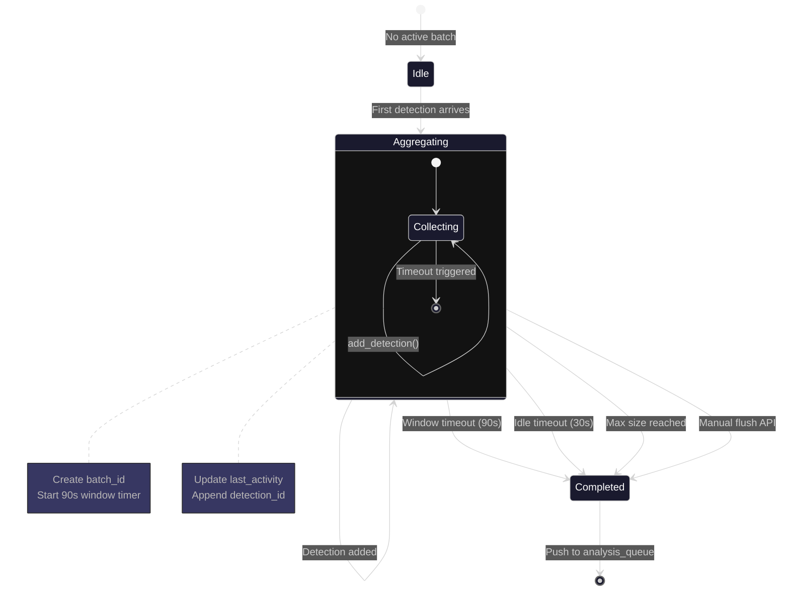
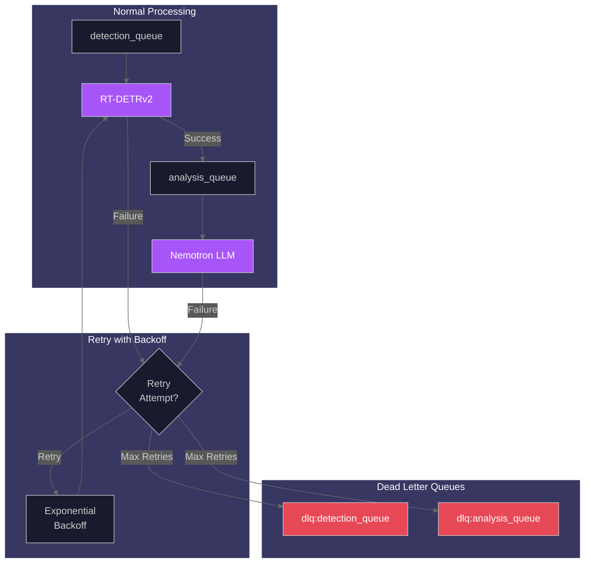

# AI Pipeline API

This guide covers the AI processing pipeline including enrichment, batch aggregation, AI audit logging, background jobs management, and the dead letter queue for failed jobs.

**Endpoint Count:** 35 implemented endpoints across 3 domains (AI Audit: 18, DLQ: 5, Jobs: 12), plus 11 planned endpoints (Enrichment: 6, Batches: 5)

## Pipeline Overview

The AI pipeline processes camera images through these stages:

1. **File Watch** - Monitor camera folders for new images
2. **Detection** - RT-DETRv2 identifies objects in images
3. **Batching** - Group detections within 90-second time windows
4. **Enrichment** - Vision model extracts attributes (clothing, carrying items)
5. **Analysis** - Nemotron LLM generates risk assessments

### AI Pipeline Flow Diagram

```mermaid
%%{init: {'theme': 'dark', 'themeVariables': {'primaryColor': '#3B82F6', 'primaryTextColor': '#FFFFFF', 'primaryBorderColor': '#60A5FA', 'secondaryColor': '#A855F7', 'tertiaryColor': '#009688', 'background': '#121212', 'mainBkg': '#1a1a2e', 'lineColor': '#666666'}}}%%
flowchart LR
    subgraph Input["Image Input"]
        CAM[Camera FTP Upload]
        FW[File Watcher]
    end

    subgraph Detection["Object Detection"]
        DQ[detection_queue]
        RT[RT-DETRv2<br/>30-50ms]
    end

    subgraph Processing["Batch Processing"]
        ENR[Enrichment<br/>Vision Model]
        BA[Batch Aggregator<br/>90s window]
    end

    subgraph Analysis["Risk Analysis"]
        AQ[analysis_queue]
        NEM[Nemotron LLM<br/>2-5s]
    end

    subgraph Output["Output"]
        EVT[Security Event]
        WS[WebSocket<br/>Broadcast]
    end

    CAM --> FW
    FW --> DQ
    DQ --> RT
    RT --> ENR
    ENR --> BA
    BA --> AQ
    AQ --> NEM
    NEM --> EVT
    EVT --> WS

    style RT fill:#A855F7,color:#fff
    style NEM fill:#A855F7,color:#fff
    style BA fill:#009688,color:#fff
    style ENR fill:#009688,color:#fff
    style EVT fill:#76B900,color:#fff
```



_End-to-end AI pipeline flow from camera image upload through detection, batching, enrichment, and LLM analysis to WebSocket broadcast._

---

## Enrichment

> **Note:** Enrichment endpoints are planned for a future release. The following documents the intended API design.

Enrichment endpoints will provide access to vision model analysis results that describe detected objects.

### Planned Endpoints

| Method | Endpoint                         | Description             |
| ------ | -------------------------------- | ----------------------- |
| GET    | `/api/enrichment`                | List enrichment records |
| GET    | `/api/enrichment/stats`          | Enrichment statistics   |
| GET    | `/api/enrichment/{id}`           | Get enrichment by ID    |
| GET    | `/api/enrichment/detection/{id}` | Get by detection ID     |
| GET    | `/api/enrichment/event/{id}`     | Get all for event       |
| POST   | `/api/enrichment/reprocess/{id}` | Reprocess enrichment    |

### List Enrichments

```bash
GET /api/enrichment?detection_type=person&min_confidence=0.8&limit=50
```

**Parameters:**

| Name           | Type     | Description                        |
| -------------- | -------- | ---------------------------------- |
| detection_type | string   | Filter by object type              |
| camera_id      | string   | Filter by camera                   |
| start_date     | datetime | Filter after timestamp             |
| end_date       | datetime | Filter before timestamp            |
| min_confidence | float    | Minimum model confidence (0.0-1.0) |
| event_id       | integer  | Filter by parent event             |
| limit          | integer  | Max results (1-1000, default: 50)  |
| offset         | integer  | Results to skip (default: 0)       |

**Response:**

```json
{
  "enrichments": [
    {
      "id": 1,
      "detection_id": 123,
      "event_id": 45,
      "model_name": "qwen-vl",
      "model_version": "2.5-3b",
      "description": "Adult male wearing dark jacket and jeans, carrying backpack",
      "attributes": {
        "clothing": ["dark jacket", "blue jeans"],
        "carrying": ["backpack"],
        "age_group": "adult",
        "gender_presentation": "male"
      },
      "confidence": 0.92,
      "latency_ms": 1250,
      "created_at": "2025-12-23T12:00:30Z"
    }
  ],
  "count": 1,
  "limit": 50,
  "offset": 0
}
```

### Enrichment Statistics

```bash
GET /api/enrichment/stats
```

**Response:**

```json
{
  "total_enrichments": 15234,
  "enrichments_today": 456,
  "by_detection_type": {
    "person": 12500,
    "vehicle": 2500,
    "animal": 234
  },
  "avg_confidence": 0.89,
  "avg_latency_ms": 1150,
  "p95_latency_ms": 2300
}
```

### Reprocess Enrichment

Force re-analysis of a detection:

```bash
POST /api/enrichment/reprocess/123
```

**Response:**

```json
{
  "status": "queued",
  "detection_id": 123,
  "message": "Enrichment reprocessing queued successfully"
}
```

---

## Batches

> **Note:** Batch management endpoints are planned for a future release. The following documents the intended API design.

Batches group detections from the same camera within configurable time windows (default: 90 seconds) before sending to the LLM for analysis.

### Batch Processing Lifecycle



_State machine showing batch lifecycle from creation through collection to closure, with multiple timeout triggers._

### Planned Endpoints

| Method | Endpoint                        | Description            |
| ------ | ------------------------------- | ---------------------- |
| GET    | `/api/batches`                  | List batches           |
| GET    | `/api/batches/{batch_id}`       | Get batch by ID        |
| GET    | `/api/batches/stats`            | Batch processing stats |
| GET    | `/api/batches/active`           | Currently aggregating  |
| POST   | `/api/batches/{batch_id}/flush` | Force flush batch      |

### List Batches

```bash
GET /api/batches?camera_id=front_door&status=completed&limit=50
```

**Parameters:**

| Name       | Type     | Description                          |
| ---------- | -------- | ------------------------------------ |
| camera_id  | string   | Filter by camera                     |
| status     | string   | `aggregating`, `completed`, `failed` |
| start_date | datetime | Filter after timestamp               |
| end_date   | datetime | Filter before timestamp              |
| limit      | integer  | Max results (1-1000, default: 50)    |
| offset     | integer  | Results to skip (default: 0)         |

**Response:**

```json
{
  "batches": [
    {
      "batch_id": "batch_abc123def456",
      "camera_id": "front_door",
      "status": "completed",
      "detection_count": 8,
      "started_at": "2025-12-23T12:00:00Z",
      "completed_at": "2025-12-23T12:01:30Z",
      "event_id": 45,
      "trigger": "idle_timeout"
    }
  ],
  "count": 1,
  "limit": 50,
  "offset": 0
}
```

### Batch Triggers

| Trigger        | Description                          |
| -------------- | ------------------------------------ |
| `time_window`  | 90-second window elapsed             |
| `idle_timeout` | 30 seconds without new detections    |
| `max_size`     | Maximum detections per batch reached |
| `manual_flush` | API-triggered flush                  |

### Active Batches

Get currently aggregating batches:

```bash
GET /api/batches/active
```

**Response:**

```json
{
  "batches": [
    {
      "batch_id": "batch_xyz789",
      "camera_id": "front_door",
      "detection_count": 3,
      "started_at": "2025-12-23T12:02:00Z",
      "age_seconds": 25.5,
      "last_activity_seconds": 8.2
    }
  ],
  "count": 1
}
```

### Force Flush Batch

Trigger immediate processing of an active batch:

```bash
POST /api/batches/batch_xyz789/flush
```

**Response:**

```json
{
  "status": "flushed",
  "batch_id": "batch_xyz789",
  "detection_count": 3,
  "message": "Batch sent for analysis"
}
```

---

## AI Audit

The AI audit system provides transparency into LLM decision-making, prompt management, and self-evaluation capabilities for security and compliance.

### AI Audit Workflow

```mermaid
%%{init: {'theme': 'dark', 'themeVariables': {'primaryColor': '#3B82F6', 'primaryTextColor': '#FFFFFF', 'primaryBorderColor': '#60A5FA', 'secondaryColor': '#A855F7', 'tertiaryColor': '#009688', 'background': '#121212', 'mainBkg': '#1a1a2e', 'lineColor': '#666666'}}}%%
sequenceDiagram
    participant BA as Batch Aggregator
    participant NEM as Nemotron LLM
    participant DB as PostgreSQL
    participant API as Audit API

    Note over BA,API: AI Decision Audit Trail

    BA->>NEM: Send batch for analysis
    activate NEM
    NEM->>NEM: Generate risk assessment
    NEM-->>BA: Risk score + reasoning
    deactivate NEM

    BA->>DB: INSERT ai_audit_log
    Note right of DB: Stores:<br/>- input_summary<br/>- model output<br/>- tokens used<br/>- latency_ms

    rect rgb(26, 26, 46)
        Note over API,DB: Later: Compliance Review
        API->>DB: GET /api/ai-audit
        DB-->>API: Audit entries
        API->>API: Filter by model, action, date
    end

    rect rgb(26, 46, 42)
        Note over API,DB: Later: Performance Analysis
        API->>DB: GET /api/ai-audit/stats
        DB-->>API: Aggregated metrics
        Note right of API: avg_latency_ms<br/>token_usage_today<br/>by_model breakdown
    end
```



_Sequence diagram showing how AI decisions are logged for audit and later retrieved for compliance review and performance analysis._

### Endpoints

| Method | Endpoint                                   | Description                           |
| ------ | ------------------------------------------ | ------------------------------------- |
| POST   | `/api/ai-audit/batch`                      | Trigger batch audit processing        |
| GET    | `/api/ai-audit/events/{event_id}`          | Get audit for specific event          |
| POST   | `/api/ai-audit/events/{event_id}/evaluate` | Trigger full event evaluation         |
| GET    | `/api/ai-audit/leaderboard`                | Get model leaderboard by contribution |
| GET    | `/api/ai-audit/prompt-config/{model}`      | Get prompt configuration (DB)         |
| PUT    | `/api/ai-audit/prompt-config/{model}`      | Update prompt configuration (DB)      |
| GET    | `/api/ai-audit/prompts`                    | Get all prompt configurations         |
| GET    | `/api/ai-audit/prompts/export`             | Export all configurations as JSON     |
| GET    | `/api/ai-audit/prompts/history`            | Get history for all models            |
| GET    | `/api/ai-audit/prompts/history/{model}`    | Get history for specific model        |
| POST   | `/api/ai-audit/prompts/history/{version}`  | Restore a prompt version              |
| POST   | `/api/ai-audit/prompts/import`             | Import configurations from JSON       |
| POST   | `/api/ai-audit/prompts/test`               | Test modified prompt config           |
| GET    | `/api/ai-audit/prompts/{model}`            | Get prompt for specific model         |
| PUT    | `/api/ai-audit/prompts/{model}`            | Update prompt for specific model      |
| GET    | `/api/ai-audit/recommendations`            | Get prompt improvement suggestions    |
| GET    | `/api/ai-audit/stats`                      | Get aggregate audit statistics        |
| POST   | `/api/ai-audit/test-prompt`                | Test custom prompt (A/B testing)      |

### Batch Audit Processing

Trigger batch audit processing for multiple events:

```bash
POST /api/ai-audit/batch
Content-Type: application/json

{
  "event_ids": [1, 2, 3],
  "camera_id": "front_door",
  "start_date": "2025-12-23T00:00:00Z",
  "end_date": "2025-12-23T23:59:59Z"
}
```

**Response:**

```json
{
  "queued_count": 15,
  "message": "Batch audit processing queued"
}
```

### Get Event Audit

Get audit information for a specific event:

```bash
GET /api/ai-audit/events/45
```

**Response:**

```json
{
  "event_id": 45,
  "audit_id": 123,
  "model_contributions": {
    "nemotron": 0.65,
    "florence-2": 0.25,
    "yolo-world": 0.1
  },
  "quality_scores": {
    "coherence": 0.92,
    "relevance": 0.88,
    "consistency": 0.95
  },
  "prompt_suggestions": [
    "Consider adding more context about time of day",
    "Include weather conditions in prompt"
  ],
  "created_at": "2025-12-23T12:01:30Z"
}
```

### Evaluate Event

Trigger full self-evaluation pipeline for an event:

```bash
POST /api/ai-audit/events/45/evaluate?force=false
```

**Parameters:**

| Name  | Type    | Default | Description                           |
| ----- | ------- | ------- | ------------------------------------- |
| force | boolean | false   | Re-evaluate even if already evaluated |

**Response:**

Returns updated `EventAuditResponse` with evaluation results including self-critique, rubric scoring, consistency check, and prompt improvements.

### Model Leaderboard

Get models ranked by contribution rate:

```bash
GET /api/ai-audit/leaderboard?days=7
```

**Parameters:**

| Name | Type    | Default | Description                      |
| ---- | ------- | ------- | -------------------------------- |
| days | integer | 7       | Number of days to include (1-90) |

**Response:**

```json
{
  "entries": [
    {
      "model_name": "nemotron",
      "contribution_rate": 0.65,
      "total_events": 1500,
      "avg_quality_score": 0.91,
      "quality_correlation": 0.87
    },
    {
      "model_name": "florence-2",
      "contribution_rate": 0.25,
      "total_events": 1500,
      "avg_quality_score": 0.88,
      "quality_correlation": 0.82
    }
  ],
  "period_days": 7,
  "total_events": 1500
}
```

### Prompt Configuration Management

#### Get Prompt Config (Database-backed)

```bash
GET /api/ai-audit/prompt-config/nemotron
```

**Response:**

```json
{
  "model": "nemotron",
  "system_prompt": "You are a security analysis AI...",
  "temperature": 0.1,
  "max_tokens": 2048,
  "version": 5,
  "created_at": "2025-12-23T10:00:00Z"
}
```

#### Update Prompt Config (Database-backed)

```bash
PUT /api/ai-audit/prompt-config/nemotron
Content-Type: application/json

{
  "system_prompt": "You are an expert security analyst...",
  "temperature": 0.15,
  "max_tokens": 3000
}
```

### Prompt Management

#### Get All Prompts

```bash
GET /api/ai-audit/prompts
```

**Response:**

```json
{
  "prompts": {
    "nemotron": {
      "system_prompt": "...",
      "temperature": 0.1,
      "max_tokens": 2048,
      "version": 5
    },
    "florence-2": {
      "system_prompt": "...",
      "temperature": 0.0,
      "max_tokens": 512,
      "version": 3
    }
  }
}
```

#### Get Model Prompt

```bash
GET /api/ai-audit/prompts/nemotron
```

#### Update Model Prompt

```bash
PUT /api/ai-audit/prompts/nemotron
Content-Type: application/json

{
  "system_prompt": "Updated prompt content...",
  "temperature": 0.1,
  "max_tokens": 2048,
  "description": "Added weather context handling"
}
```

**Response:**

```json
{
  "model": "nemotron",
  "version": 6,
  "previous_version": 5,
  "description": "Added weather context handling",
  "updated_at": "2025-12-23T14:00:00Z"
}
```

### Prompt History

#### Get All Models History

```bash
GET /api/ai-audit/prompts/history?limit=10
```

**Parameters:**

| Name  | Type    | Default | Description                    |
| ----- | ------- | ------- | ------------------------------ |
| limit | integer | 10      | Max versions per model (1-100) |

#### Get Model History

```bash
GET /api/ai-audit/prompts/history/nemotron?limit=50&offset=0
```

**Parameters:**

| Name   | Type    | Default | Description                |
| ------ | ------- | ------- | -------------------------- |
| limit  | integer | 50      | Max versions to return     |
| offset | integer | 0       | Number of versions to skip |

**Response:**

```json
{
  "model": "nemotron",
  "versions": [
    {
      "version": 6,
      "system_prompt": "...",
      "temperature": 0.1,
      "description": "Added weather context",
      "created_at": "2025-12-23T14:00:00Z"
    },
    {
      "version": 5,
      "system_prompt": "...",
      "temperature": 0.1,
      "description": "Initial prompt",
      "created_at": "2025-12-22T10:00:00Z"
    }
  ],
  "total": 6
}
```

#### Restore Prompt Version

```bash
POST /api/ai-audit/prompts/history/5?model=nemotron
Content-Type: application/json

{
  "description": "Reverting to version 5"
}
```

**Response:**

```json
{
  "model": "nemotron",
  "restored_version": 5,
  "new_version": 7,
  "description": "Reverting to version 5",
  "restored_at": "2025-12-23T15:00:00Z"
}
```

### Prompt Import/Export

#### Export All Prompts

```bash
GET /api/ai-audit/prompts/export
```

**Response:**

```json
{
  "prompts": {
    "nemotron": {
      "system_prompt": "...",
      "temperature": 0.1,
      "max_tokens": 2048
    },
    "florence-2": {
      "system_prompt": "...",
      "temperature": 0.0,
      "max_tokens": 512
    }
  },
  "exported_at": "2025-12-23T12:00:00Z",
  "version": "1.0"
}
```

#### Import Prompts

```bash
POST /api/ai-audit/prompts/import
Content-Type: application/json

{
  "prompts": {
    "nemotron": {
      "system_prompt": "...",
      "temperature": 0.1,
      "max_tokens": 2048
    }
  },
  "overwrite": false
}
```

**Parameters:**

| Name      | Type    | Default | Description                       |
| --------- | ------- | ------- | --------------------------------- |
| overwrite | boolean | false   | Overwrite existing configurations |

**Response:**

```json
{
  "imported": ["nemotron"],
  "skipped": ["florence-2"],
  "errors": []
}
```

### Prompt Testing

#### Test Modified Prompt Config

Test a prompt configuration against an event:

```bash
POST /api/ai-audit/prompts/test
Content-Type: application/json

{
  "model": "nemotron",
  "event_id": 45,
  "config": {
    "system_prompt": "Modified prompt for testing...",
    "temperature": 0.2,
    "max_tokens": 2048
  }
}
```

**Response:**

```json
{
  "event_id": 45,
  "model": "nemotron",
  "current_result": {
    "risk_score": 75,
    "summary": "Current analysis result..."
  },
  "modified_result": {
    "risk_score": 80,
    "summary": "Modified analysis result..."
  },
  "comparison": {
    "risk_score_diff": 5,
    "latency_diff_ms": 150
  }
}
```

#### Test Custom Prompt (A/B Testing)

Test a custom prompt for the Prompt Playground:

```bash
POST /api/ai-audit/test-prompt
Content-Type: application/json

{
  "event_id": 45,
  "custom_prompt": "Analyze this security event with focus on...",
  "temperature": 0.1,
  "max_tokens": 2048,
  "model": "nemotron"
}
```

**Response:**

```json
{
  "event_id": 45,
  "result": {
    "risk_score": 78,
    "risk_level": "high",
    "summary": "Analysis based on custom prompt...",
    "reasoning": "..."
  },
  "latency_ms": 4200,
  "tokens_used": 1650
}
```

### Recommendations

Get aggregated prompt improvement recommendations:

```bash
GET /api/ai-audit/recommendations?days=7
```

**Parameters:**

| Name | Type    | Default | Description                      |
| ---- | ------- | ------- | -------------------------------- |
| days | integer | 7       | Number of days to analyze (1-90) |

**Response:**

```json
{
  "recommendations": [
    {
      "model": "nemotron",
      "priority": "high",
      "category": "context",
      "suggestion": "Add time-of-day context to improve night analysis",
      "impact_estimate": 0.15,
      "affected_events": 45
    },
    {
      "model": "florence-2",
      "priority": "medium",
      "category": "specificity",
      "suggestion": "Include clothing color descriptions",
      "impact_estimate": 0.08,
      "affected_events": 120
    }
  ],
  "period_days": 7,
  "total_events_analyzed": 1500
}
```

### Audit Statistics

```bash
GET /api/ai-audit/stats?days=7&camera_id=front_door
```

**Parameters:**

| Name      | Type    | Default | Description                      |
| --------- | ------- | ------- | -------------------------------- |
| days      | integer | 7       | Number of days to include (1-90) |
| camera_id | string  | null    | Optional camera filter           |

**Response:**

```json
{
  "total_events": 5234,
  "events_today": 156,
  "by_model": {
    "nemotron": {
      "events": 4500,
      "avg_latency_ms": 4200,
      "contribution_rate": 0.65
    },
    "florence-2": {
      "events": 734,
      "avg_latency_ms": 1150,
      "contribution_rate": 0.25
    }
  },
  "quality_scores": {
    "avg_coherence": 0.91,
    "avg_relevance": 0.88,
    "avg_consistency": 0.94
  },
  "token_usage": {
    "total_input": 4500000,
    "total_output": 850000,
    "today_input": 45000,
    "today_output": 8500
  },
  "period_days": 7
}
```

---

## Dead Letter Queue (DLQ)

The DLQ holds failed AI pipeline jobs for inspection and reprocessing.

### Queue Architecture



_Queue architecture showing normal processing flow and failure paths to dead letter queues._

### Endpoints

| Method | Endpoint                            | Description        |
| ------ | ----------------------------------- | ------------------ |
| GET    | `/api/dlq/stats`                    | DLQ statistics     |
| GET    | `/api/dlq/jobs/{queue_name}`        | List jobs in queue |
| POST   | `/api/dlq/requeue/{queue_name}`     | Requeue single job |
| POST   | `/api/dlq/requeue-all/{queue_name}` | Requeue all jobs   |
| DELETE | `/api/dlq/{queue_name}`             | Clear queue        |

### Queue Names

| Queue Name            | Description                     |
| --------------------- | ------------------------------- |
| `dlq:detection_queue` | Failed RT-DETRv2 detection jobs |
| `dlq:analysis_queue`  | Failed Nemotron analysis jobs   |

### Get DLQ Statistics

```bash
GET /api/dlq/stats
```

**Response:**

```json
{
  "detection_queue_count": 2,
  "analysis_queue_count": 1,
  "total_count": 3
}
```

### List DLQ Jobs

```bash
GET /api/dlq/jobs/dlq:detection_queue?start=0&limit=10
```

**Parameters:**

| Name  | Type    | Default | Description                       |
| ----- | ------- | ------- | --------------------------------- |
| start | integer | 0       | Start index (0-based)             |
| limit | integer | 100     | Maximum jobs to return (max 1000) |

**Response:**

```json
{
  "queue_name": "dlq:detection_queue",
  "jobs": [
    {
      "original_job": {
        "camera_id": "front_door",
        "file_path": "/export/foscam/front_door/image_001.jpg",
        "timestamp": "2025-12-23T10:30:00.000000"
      },
      "error": "Connection refused: detector service unavailable",
      "attempt_count": 3,
      "first_failed_at": "2025-12-23T10:30:05.000000",
      "last_failed_at": "2025-12-23T10:30:15.000000",
      "queue_name": "detection_queue"
    }
  ],
  "count": 1
}
```

### Requeue Jobs

Requeue a single job (oldest first):

```bash
POST /api/dlq/requeue/dlq:detection_queue
X-API-Key: your-api-key
```

Requeue all jobs (limit: 1000 per call):

```bash
POST /api/dlq/requeue-all/dlq:analysis_queue
X-API-Key: your-api-key
```

### Clear Queue

**Warning:** Permanently deletes all jobs.

```bash
DELETE /api/dlq/dlq:detection_queue
X-API-Key: your-api-key
```

### Retry Behavior

Before jobs reach the DLQ, the system retries with exponential backoff:

| Setting          | Default | Description              |
| ---------------- | ------- | ------------------------ |
| Max retries      | 3       | Attempts before DLQ      |
| Base delay       | 1s      | Initial retry delay      |
| Max delay        | 30s     | Maximum retry delay      |
| Exponential base | 2.0     | Backoff multiplier       |
| Jitter           | 0-25%   | Random variance on delay |

### Common Failure Reasons

**Detection Queue:**

| Error                | Cause                           | Resolution                |
| -------------------- | ------------------------------- | ------------------------- |
| Connection refused   | RT-DETR service down            | Check AI container health |
| Timeout              | RT-DETR overloaded              | Check GPU utilization     |
| File not found       | Image deleted before processing | Check retention settings  |
| Invalid image format | Corrupted image                 | Manual review             |

**Analysis Queue:**

| Error                   | Cause                 | Resolution                |
| ----------------------- | --------------------- | ------------------------- |
| Connection refused      | Nemotron service down | Check AI container health |
| Context length exceeded | Too many detections   | Reduce batch window       |
| Model loading failed    | VRAM exhausted        | Restart AI services       |

### Recovery Workflow

The following diagram illustrates the DLQ recovery process:

```mermaid
%%{init: {'theme': 'dark', 'themeVariables': {'primaryColor': '#3B82F6', 'primaryTextColor': '#FFFFFF', 'primaryBorderColor': '#60A5FA', 'secondaryColor': '#A855F7', 'tertiaryColor': '#009688', 'background': '#121212', 'mainBkg': '#1a1a2e', 'lineColor': '#666666'}}}%%
flowchart TB
    subgraph Monitor["1. Monitor"]
        CHK[Check Service Health<br/>GET /api/system/health]
        STATS[Review DLQ Stats<br/>GET /api/dlq/stats]
    end

    subgraph Inspect["2. Inspect"]
        LIST[List Failed Jobs<br/>GET /api/dlq/jobs/{queue}]
        ANALYZE[Analyze Error Patterns]
    end

    subgraph Fix["3. Fix Root Cause"]
        SVC[Restart Service]
        CFG[Fix Configuration]
        CLEAN[Clear Corrupted Data]
    end

    subgraph Recover["4. Recover"]
        REQ[Requeue Jobs<br/>POST /api/dlq/requeue-all]
        MON[Monitor Processing]
    end

    subgraph Outcome["5. Verify"]
        OK{Jobs<br/>Processed?}
        SUCCESS[Recovery Complete]
        RETRY[Retry Fix]
    end

    CHK --> STATS
    STATS --> LIST
    LIST --> ANALYZE
    ANALYZE --> SVC
    ANALYZE --> CFG
    ANALYZE --> CLEAN
    SVC --> REQ
    CFG --> REQ
    CLEAN --> REQ
    REQ --> MON
    MON --> OK
    OK -->|Yes| SUCCESS
    OK -->|No| RETRY
    RETRY --> ANALYZE

    style SUCCESS fill:#76B900,color:#fff
    style REQ fill:#3B82F6,color:#fff
```

_Step-by-step DLQ recovery workflow from monitoring through inspection, fix, and verification._

**CLI Commands:**

```bash
# 1. Check service health
curl http://localhost:8000/api/system/health

# 2. Review DLQ statistics
curl http://localhost:8000/api/dlq/stats

# 3. Inspect failed jobs
curl "http://localhost:8000/api/dlq/jobs/dlq:detection_queue?limit=10"

# 4. Requeue after fixing issues
curl -X POST http://localhost:8000/api/dlq/requeue-all/dlq:detection_queue \
  -H "X-API-Key: your-api-key"

# 5. Monitor for new failures
watch -n 5 'curl -s http://localhost:8000/api/dlq/stats'
```

---

## Circuit Breaker Protection

The pipeline uses circuit breakers to prevent cascading failures.

### States

| State       | Behavior                                   |
| ----------- | ------------------------------------------ |
| `closed`    | Normal operation, requests pass through    |
| `open`      | Failing, requests rejected immediately     |
| `half_open` | Testing recovery, limited requests allowed |

### Configuration

| Variable                            | Default | Description                     |
| ----------------------------------- | ------- | ------------------------------- |
| `CIRCUIT_BREAKER_FAILURE_THRESHOLD` | 5       | Failures before opening         |
| `CIRCUIT_BREAKER_RECOVERY_TIMEOUT`  | 30      | Seconds before testing recovery |
| `CIRCUIT_BREAKER_SUCCESS_THRESHOLD` | 2       | Successes to close circuit      |

### Check Status

```bash
GET /api/system/circuit-breakers
```

**Response:**

```json
{
  "circuit_breakers": {
    "rtdetr": {
      "name": "rtdetr",
      "state": "closed",
      "failure_count": 0,
      "total_calls": 100
    },
    "nemotron": {
      "name": "nemotron",
      "state": "closed",
      "failure_count": 0,
      "total_calls": 50
    }
  },
  "total_count": 2,
  "open_count": 0
}
```

### Reset Circuit Breaker

```bash
POST /api/system/circuit-breakers/rtdetr/reset
X-API-Key: your-api-key
```

---

## Background Jobs

The jobs API provides management and monitoring of background processing tasks including exports, cleanups, and AI processing jobs.

### Endpoints

| Method | Endpoint                     | Description                     |
| ------ | ---------------------------- | ------------------------------- |
| GET    | `/api/jobs`                  | List all jobs with filtering    |
| POST   | `/api/jobs/bulk-cancel`      | Cancel multiple jobs at once    |
| GET    | `/api/jobs/search`           | Advanced job search with facets |
| GET    | `/api/jobs/stats`            | Get aggregate job statistics    |
| GET    | `/api/jobs/types`            | List available job types        |
| GET    | `/api/jobs/{job_id}`         | Get job status                  |
| DELETE | `/api/jobs/{job_id}`         | Cancel or abort a job           |
| POST   | `/api/jobs/{job_id}/abort`   | Abort a running job             |
| POST   | `/api/jobs/{job_id}/cancel`  | Cancel a queued job             |
| GET    | `/api/jobs/{job_id}/detail`  | Get detailed job information    |
| GET    | `/api/jobs/{job_id}/history` | Get job execution history       |
| GET    | `/api/jobs/{job_id}/logs`    | Get job execution logs          |

### List Jobs

```bash
GET /api/jobs?job_type=export&status=running&limit=50&offset=0
```

**Parameters:**

| Name     | Type    | Default | Description                                                       |
| -------- | ------- | ------- | ----------------------------------------------------------------- |
| job_type | string  | null    | Filter by type (export, cleanup, etc.)                            |
| status   | string  | null    | Filter by status (pending, running, completed, failed, cancelled) |
| limit    | integer | 50      | Max results (1-1000)                                              |
| offset   | integer | 0       | Results to skip                                                   |

**Response:**

```json
{
  "jobs": [
    {
      "job_id": "job_abc123",
      "job_type": "export",
      "status": "running",
      "progress": 45,
      "created_at": "2025-12-23T12:00:00Z",
      "started_at": "2025-12-23T12:00:05Z",
      "metadata": {
        "format": "csv",
        "event_count": 1000
      }
    }
  ],
  "count": 1,
  "limit": 50,
  "offset": 0
}
```

### Advanced Job Search

Search and filter jobs with advanced query capabilities:

```bash
GET /api/jobs/search?q=export&status=running,pending&has_error=false&sort=created_at&order=desc
```

**Parameters:**

| Name             | Type     | Default    | Description                                   |
| ---------------- | -------- | ---------- | --------------------------------------------- |
| q                | string   | null       | Free text search across type, error, metadata |
| status           | string   | null       | Comma-separated status values                 |
| job_type         | string   | null       | Comma-separated job types                     |
| queue            | string   | null       | Queue name filter                             |
| created_after    | datetime | null       | Filter jobs created after timestamp           |
| created_before   | datetime | null       | Filter jobs created before timestamp          |
| completed_after  | datetime | null       | Filter jobs completed after timestamp         |
| completed_before | datetime | null       | Filter jobs completed before timestamp        |
| has_error        | boolean  | null       | Filter jobs with/without errors               |
| min_duration     | float    | null       | Minimum duration in seconds                   |
| max_duration     | float    | null       | Maximum duration in seconds                   |
| limit            | integer  | 50         | Max results (1-1000)                          |
| offset           | integer  | 0          | Results to skip                               |
| sort             | string   | created_at | Sort field                                    |
| order            | string   | desc       | Sort direction (asc, desc)                    |

**Response:**

```json
{
  "jobs": [...],
  "count": 25,
  "limit": 50,
  "offset": 0,
  "aggregations": {
    "by_status": {
      "running": 5,
      "pending": 10,
      "completed": 8,
      "failed": 2
    },
    "by_type": {
      "export": 15,
      "cleanup": 10
    }
  }
}
```

### Job Statistics

```bash
GET /api/jobs/stats
```

**Response:**

```json
{
  "total_jobs": 1500,
  "by_status": {
    "pending": 25,
    "running": 5,
    "completed": 1400,
    "failed": 50,
    "cancelled": 20
  },
  "by_type": {
    "export": 800,
    "cleanup": 500,
    "ai_processing": 200
  },
  "avg_duration_seconds": 45.5,
  "jobs_today": 120,
  "jobs_this_hour": 15
}
```

### Job Types

```bash
GET /api/jobs/types
```

**Response:**

```json
{
  "types": [
    {
      "type": "export",
      "description": "Export events to CSV/JSON",
      "supports_abort": true
    },
    {
      "type": "cleanup",
      "description": "Clean up old data",
      "supports_abort": false
    }
  ]
}
```

### Get Job Status

```bash
GET /api/jobs/job_abc123
```

**Response:**

```json
{
  "job_id": "job_abc123",
  "job_type": "export",
  "status": "running",
  "progress": 65,
  "created_at": "2025-12-23T12:00:00Z",
  "started_at": "2025-12-23T12:00:05Z",
  "completed_at": null,
  "error_message": null,
  "result": null,
  "metadata": {
    "format": "csv",
    "event_count": 1000,
    "processed": 650
  }
}
```

### Get Job Detail

Get comprehensive job information including progress history and timing:

```bash
GET /api/jobs/job_abc123/detail
```

**Response:**

```json
{
  "job_id": "job_abc123",
  "job_type": "export",
  "status": "running",
  "progress": 65,
  "progress_history": [
    { "timestamp": "2025-12-23T12:00:05Z", "progress": 0, "message": "Starting" },
    { "timestamp": "2025-12-23T12:00:30Z", "progress": 25, "message": "Processing batch 1" },
    { "timestamp": "2025-12-23T12:01:00Z", "progress": 50, "message": "Processing batch 2" },
    { "timestamp": "2025-12-23T12:01:30Z", "progress": 65, "message": "Processing batch 3" }
  ],
  "timing": {
    "created_at": "2025-12-23T12:00:00Z",
    "started_at": "2025-12-23T12:00:05Z",
    "queue_wait_seconds": 5,
    "running_seconds": 90
  },
  "retry_info": {
    "attempt": 1,
    "max_attempts": 3,
    "last_error": null
  },
  "metadata": {
    "format": "csv",
    "event_count": 1000
  }
}
```

### Get Job History

Get complete execution history with state transitions:

```bash
GET /api/jobs/job_abc123/history
```

**Response:**

```json
{
  "job_id": "job_abc123",
  "transitions": [
    {
      "from_status": null,
      "to_status": "pending",
      "timestamp": "2025-12-23T12:00:00Z",
      "reason": "Job created"
    },
    {
      "from_status": "pending",
      "to_status": "running",
      "timestamp": "2025-12-23T12:00:05Z",
      "reason": "Worker picked up job"
    }
  ],
  "attempts": [
    {
      "attempt": 1,
      "started_at": "2025-12-23T12:00:05Z",
      "status": "running"
    }
  ]
}
```

### Get Job Logs

```bash
GET /api/jobs/job_abc123/logs?level=INFO&since=2025-12-23T12:00:00Z&limit=100
```

**Parameters:**

| Name  | Type     | Default | Description                                     |
| ----- | -------- | ------- | ----------------------------------------------- |
| level | string   | null    | Minimum log level (DEBUG, INFO, WARNING, ERROR) |
| since | datetime | null    | Return logs from this timestamp                 |
| limit | integer  | 100     | Maximum log entries                             |

**Response:**

```json
{
  "job_id": "job_abc123",
  "logs": [
    {
      "timestamp": "2025-12-23T12:00:05Z",
      "level": "INFO",
      "message": "Starting export job"
    },
    {
      "timestamp": "2025-12-23T12:00:30Z",
      "level": "INFO",
      "message": "Processed 250 events"
    },
    {
      "timestamp": "2025-12-23T12:01:00Z",
      "level": "WARNING",
      "message": "Slow query detected, optimizing"
    }
  ],
  "count": 3
}
```

### Cancel Job

Cancel a queued job:

```bash
POST /api/jobs/job_abc123/cancel
```

**Response:**

```json
{
  "job_id": "job_abc123",
  "status": "cancelled",
  "message": "Job cancelled successfully"
}
```

### Abort Running Job

Abort a currently running job:

```bash
POST /api/jobs/job_abc123/abort
```

**Response:**

```json
{
  "job_id": "job_abc123",
  "status": "aborted",
  "message": "Abort signal sent to worker"
}
```

### Delete/Cancel Job (Unified)

Cancel or abort based on current state:

```bash
DELETE /api/jobs/job_abc123
```

**Response:**

```json
{
  "job_id": "job_abc123",
  "action": "cancelled",
  "previous_status": "pending",
  "message": "Job cancelled"
}
```

### Bulk Cancel Jobs

Cancel multiple jobs at once:

```bash
POST /api/jobs/bulk-cancel
Content-Type: application/json

{
  "job_ids": ["job_abc123", "job_def456", "job_ghi789"]
}
```

**Response:**

```json
{
  "successful": 2,
  "failed": 1,
  "results": [
    { "job_id": "job_abc123", "success": true, "message": "Cancelled" },
    { "job_id": "job_def456", "success": true, "message": "Cancelled" },
    { "job_id": "job_ghi789", "success": false, "error": "Job already completed" }
  ]
}
```

---

## Related Documentation

- [Core Resources API](core-resources.md) - Cameras, events, detections
- [System Operations API](system-ops.md) - Health and configuration
- [Real-time API](realtime.md) - WebSocket streams
