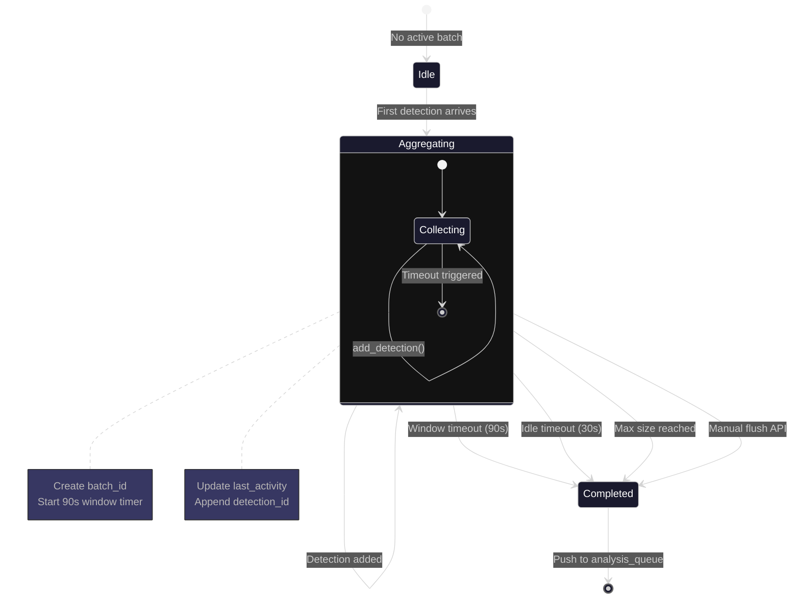
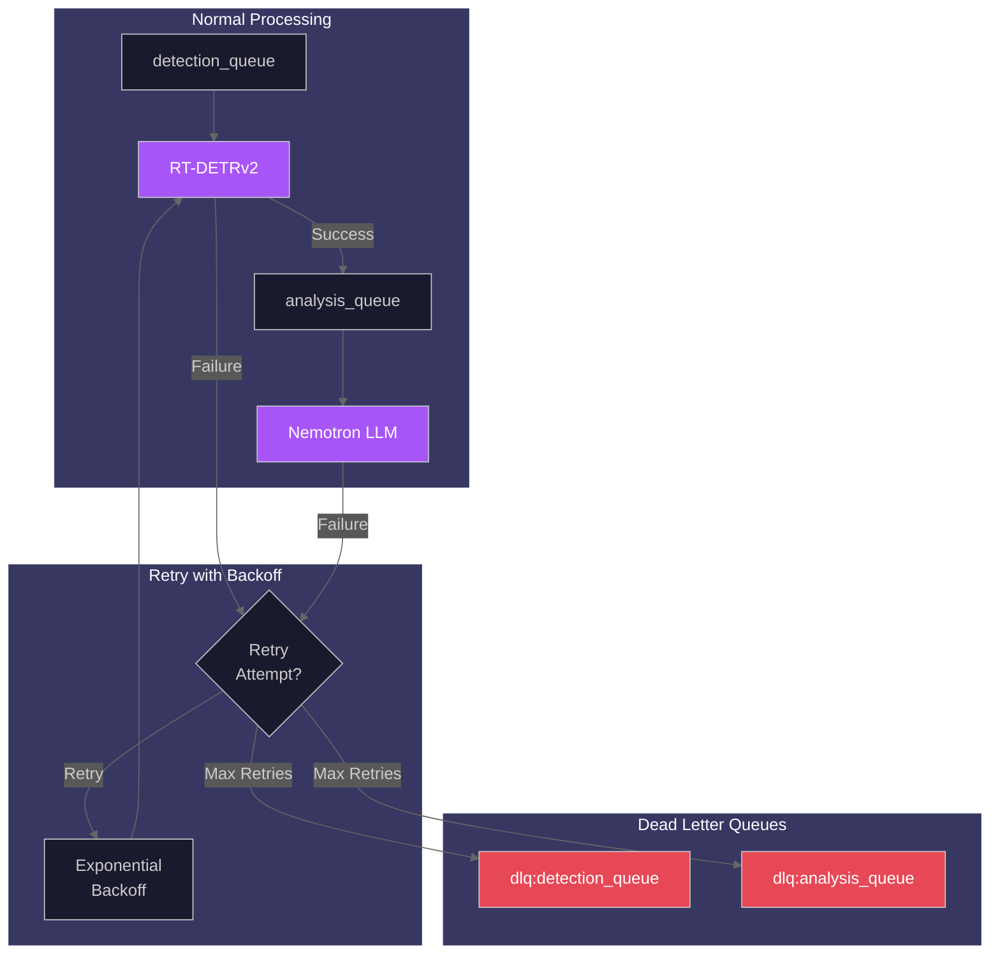

# AI Pipeline API

This guide covers the AI processing pipeline including enrichment, batch aggregation, AI audit logging, and the dead letter queue for failed jobs.

## Pipeline Overview

The AI pipeline processes camera images through these stages:

1. **File Watch** - Monitor camera folders for new images
2. **Detection** - RT-DETRv2 identifies objects in images
3. **Batching** - Group detections within 90-second time windows
4. **Enrichment** - Vision model extracts attributes (clothing, carrying items)
5. **Analysis** - Nemotron LLM generates risk assessments

### AI Pipeline Flow Diagram

```mermaid
%%{init: {'theme': 'dark', 'themeVariables': {'primaryColor': '#3B82F6', 'primaryTextColor': '#FFFFFF', 'primaryBorderColor': '#60A5FA', 'secondaryColor': '#A855F7', 'tertiaryColor': '#009688', 'background': '#121212', 'mainBkg': '#1a1a2e', 'lineColor': '#666666'}}}%%
flowchart LR
    subgraph Input["Image Input"]
        CAM[Camera FTP Upload]
        FW[File Watcher]
    end

    subgraph Detection["Object Detection"]
        DQ[detection_queue]
        RT[RT-DETRv2<br/>30-50ms]
    end

    subgraph Processing["Batch Processing"]
        ENR[Enrichment<br/>Vision Model]
        BA[Batch Aggregator<br/>90s window]
    end

    subgraph Analysis["Risk Analysis"]
        AQ[analysis_queue]
        NEM[Nemotron LLM<br/>2-5s]
    end

    subgraph Output["Output"]
        EVT[Security Event]
        WS[WebSocket<br/>Broadcast]
    end

    CAM --> FW
    FW --> DQ
    DQ --> RT
    RT --> ENR
    ENR --> BA
    BA --> AQ
    AQ --> NEM
    NEM --> EVT
    EVT --> WS

    style RT fill:#A855F7,color:#fff
    style NEM fill:#A855F7,color:#fff
    style BA fill:#009688,color:#fff
    style ENR fill:#009688,color:#fff
    style EVT fill:#76B900,color:#fff
```



_End-to-end AI pipeline flow from camera image upload through detection, batching, enrichment, and LLM analysis to WebSocket broadcast._

---

## Enrichment

Enrichment endpoints provide access to vision model analysis results that describe detected objects.

### Endpoints

| Method | Endpoint                         | Description             |
| ------ | -------------------------------- | ----------------------- |
| GET    | `/api/enrichment`                | List enrichment records |
| GET    | `/api/enrichment/stats`          | Enrichment statistics   |
| GET    | `/api/enrichment/{id}`           | Get enrichment by ID    |
| GET    | `/api/enrichment/detection/{id}` | Get by detection ID     |
| GET    | `/api/enrichment/event/{id}`     | Get all for event       |
| POST   | `/api/enrichment/reprocess/{id}` | Reprocess enrichment    |

### List Enrichments

```bash
GET /api/enrichment?detection_type=person&min_confidence=0.8&limit=50
```

**Parameters:**

| Name           | Type     | Description                        |
| -------------- | -------- | ---------------------------------- |
| detection_type | string   | Filter by object type              |
| camera_id      | string   | Filter by camera                   |
| start_date     | datetime | Filter after timestamp             |
| end_date       | datetime | Filter before timestamp            |
| min_confidence | float    | Minimum model confidence (0.0-1.0) |
| event_id       | integer  | Filter by parent event             |
| limit          | integer  | Max results (1-1000, default: 50)  |
| offset         | integer  | Results to skip (default: 0)       |

**Response:**

```json
{
  "enrichments": [
    {
      "id": 1,
      "detection_id": 123,
      "event_id": 45,
      "model_name": "qwen-vl",
      "model_version": "2.5-3b",
      "description": "Adult male wearing dark jacket and jeans, carrying backpack",
      "attributes": {
        "clothing": ["dark jacket", "blue jeans"],
        "carrying": ["backpack"],
        "age_group": "adult",
        "gender_presentation": "male"
      },
      "confidence": 0.92,
      "latency_ms": 1250,
      "created_at": "2025-12-23T12:00:30Z"
    }
  ],
  "count": 1,
  "limit": 50,
  "offset": 0
}
```

### Enrichment Statistics

```bash
GET /api/enrichment/stats
```

**Response:**

```json
{
  "total_enrichments": 15234,
  "enrichments_today": 456,
  "by_detection_type": {
    "person": 12500,
    "vehicle": 2500,
    "animal": 234
  },
  "avg_confidence": 0.89,
  "avg_latency_ms": 1150,
  "p95_latency_ms": 2300
}
```

### Reprocess Enrichment

Force re-analysis of a detection:

```bash
POST /api/enrichment/reprocess/123
```

**Response:**

```json
{
  "status": "queued",
  "detection_id": 123,
  "message": "Enrichment reprocessing queued successfully"
}
```

---

## Batches

Batches group detections from the same camera within configurable time windows (default: 90 seconds) before sending to the LLM for analysis.

### Batch Processing Lifecycle



_State machine showing batch lifecycle from creation through collection to closure, with multiple timeout triggers._

### Endpoints

| Method | Endpoint                        | Description            |
| ------ | ------------------------------- | ---------------------- |
| GET    | `/api/batches`                  | List batches           |
| GET    | `/api/batches/{batch_id}`       | Get batch by ID        |
| GET    | `/api/batches/stats`            | Batch processing stats |
| GET    | `/api/batches/active`           | Currently aggregating  |
| POST   | `/api/batches/{batch_id}/flush` | Force flush batch      |

### List Batches

```bash
GET /api/batches?camera_id=front_door&status=completed&limit=50
```

**Parameters:**

| Name       | Type     | Description                          |
| ---------- | -------- | ------------------------------------ |
| camera_id  | string   | Filter by camera                     |
| status     | string   | `aggregating`, `completed`, `failed` |
| start_date | datetime | Filter after timestamp               |
| end_date   | datetime | Filter before timestamp              |
| limit      | integer  | Max results (1-1000, default: 50)    |
| offset     | integer  | Results to skip (default: 0)         |

**Response:**

```json
{
  "batches": [
    {
      "batch_id": "batch_abc123def456",
      "camera_id": "front_door",
      "status": "completed",
      "detection_count": 8,
      "started_at": "2025-12-23T12:00:00Z",
      "completed_at": "2025-12-23T12:01:30Z",
      "event_id": 45,
      "trigger": "idle_timeout"
    }
  ],
  "count": 1,
  "limit": 50,
  "offset": 0
}
```

### Batch Triggers

| Trigger        | Description                          |
| -------------- | ------------------------------------ |
| `time_window`  | 90-second window elapsed             |
| `idle_timeout` | 30 seconds without new detections    |
| `max_size`     | Maximum detections per batch reached |
| `manual_flush` | API-triggered flush                  |

### Active Batches

Get currently aggregating batches:

```bash
GET /api/batches/active
```

**Response:**

```json
{
  "batches": [
    {
      "batch_id": "batch_xyz789",
      "camera_id": "front_door",
      "detection_count": 3,
      "started_at": "2025-12-23T12:02:00Z",
      "age_seconds": 25.5,
      "last_activity_seconds": 8.2
    }
  ],
  "count": 1
}
```

### Force Flush Batch

Trigger immediate processing of an active batch:

```bash
POST /api/batches/batch_xyz789/flush
```

**Response:**

```json
{
  "status": "flushed",
  "batch_id": "batch_xyz789",
  "detection_count": 3,
  "message": "Batch sent for analysis"
}
```

---

## AI Audit

The AI audit log provides transparency into LLM decision-making for security and compliance.

### AI Audit Workflow

```mermaid
%%{init: {'theme': 'dark', 'themeVariables': {'primaryColor': '#3B82F6', 'primaryTextColor': '#FFFFFF', 'primaryBorderColor': '#60A5FA', 'secondaryColor': '#A855F7', 'tertiaryColor': '#009688', 'background': '#121212', 'mainBkg': '#1a1a2e', 'lineColor': '#666666'}}}%%
sequenceDiagram
    participant BA as Batch Aggregator
    participant NEM as Nemotron LLM
    participant DB as PostgreSQL
    participant API as Audit API

    Note over BA,API: AI Decision Audit Trail

    BA->>NEM: Send batch for analysis
    activate NEM
    NEM->>NEM: Generate risk assessment
    NEM-->>BA: Risk score + reasoning
    deactivate NEM

    BA->>DB: INSERT ai_audit_log
    Note right of DB: Stores:<br/>- input_summary<br/>- model output<br/>- tokens used<br/>- latency_ms

    rect rgb(26, 26, 46)
        Note over API,DB: Later: Compliance Review
        API->>DB: GET /api/ai-audit
        DB-->>API: Audit entries
        API->>API: Filter by model, action, date
    end

    rect rgb(26, 46, 42)
        Note over API,DB: Later: Performance Analysis
        API->>DB: GET /api/ai-audit/stats
        DB-->>API: Aggregated metrics
        Note right of API: avg_latency_ms<br/>token_usage_today<br/>by_model breakdown
    end
```



_Sequence diagram showing how AI decisions are logged for audit and later retrieved for compliance review and performance analysis._

### Endpoints

| Method | Endpoint                   | Description           |
| ------ | -------------------------- | --------------------- |
| GET    | `/api/ai-audit`            | List audit entries    |
| GET    | `/api/ai-audit/{id}`       | Get audit entry by ID |
| GET    | `/api/ai-audit/event/{id}` | Get audit for event   |
| GET    | `/api/ai-audit/stats`      | Audit statistics      |

### List Audit Entries

```bash
GET /api/ai-audit?model_name=nemotron&action=risk_assessment&limit=50
```

**Parameters:**

| Name       | Type     | Description                             |
| ---------- | -------- | --------------------------------------- |
| model_name | string   | Filter by model: `nemotron`, `qwen-vl`  |
| action     | string   | Filter: `risk_assessment`, `enrichment` |
| start_date | datetime | Filter after timestamp                  |
| end_date   | datetime | Filter before timestamp                 |
| event_id   | integer  | Filter by event                         |
| limit      | integer  | Max results (1-1000, default: 50)       |
| offset     | integer  | Results to skip (default: 0)            |

**Response:**

```json
{
  "entries": [
    {
      "id": 1,
      "event_id": 45,
      "batch_id": "batch_abc123",
      "action": "risk_assessment",
      "model_name": "nemotron-mini",
      "model_version": "4b",
      "input_summary": {
        "detection_count": 8,
        "object_types": ["person"],
        "camera_id": "front_door",
        "time_span_seconds": 90
      },
      "output": {
        "risk_score": 75,
        "risk_level": "high",
        "summary": "Person detected at front door",
        "reasoning": "Single person approaching entrance..."
      },
      "tokens_input": 1250,
      "tokens_output": 350,
      "latency_ms": 4500,
      "temperature": 0.1,
      "created_at": "2025-12-23T12:01:30Z"
    }
  ],
  "count": 1,
  "limit": 50,
  "offset": 0
}
```

### Audit Statistics

```bash
GET /api/ai-audit/stats
```

**Response:**

```json
{
  "total_entries": 5234,
  "entries_today": 156,
  "by_model": {
    "nemotron-mini": 4500,
    "qwen-vl": 734
  },
  "by_action": {
    "risk_assessment": 4500,
    "enrichment": 734
  },
  "avg_latency_ms": {
    "nemotron-mini": 4200,
    "qwen-vl": 1150
  },
  "token_usage_today": {
    "input": 450000,
    "output": 85000
  }
}
```

---

## Dead Letter Queue (DLQ)

The DLQ holds failed AI pipeline jobs for inspection and reprocessing.

### Queue Architecture



_Queue architecture showing normal processing flow and failure paths to dead letter queues._

### Endpoints

| Method | Endpoint                            | Description        |
| ------ | ----------------------------------- | ------------------ |
| GET    | `/api/dlq/stats`                    | DLQ statistics     |
| GET    | `/api/dlq/jobs/{queue_name}`        | List jobs in queue |
| POST   | `/api/dlq/requeue/{queue_name}`     | Requeue single job |
| POST   | `/api/dlq/requeue-all/{queue_name}` | Requeue all jobs   |
| DELETE | `/api/dlq/{queue_name}`             | Clear queue        |

### Queue Names

| Queue Name            | Description                     |
| --------------------- | ------------------------------- |
| `dlq:detection_queue` | Failed RT-DETRv2 detection jobs |
| `dlq:analysis_queue`  | Failed Nemotron analysis jobs   |

### Get DLQ Statistics

```bash
GET /api/dlq/stats
```

**Response:**

```json
{
  "detection_queue_count": 2,
  "analysis_queue_count": 1,
  "total_count": 3
}
```

### List DLQ Jobs

```bash
GET /api/dlq/jobs/dlq:detection_queue?start=0&limit=10
```

**Parameters:**

| Name  | Type    | Default | Description                       |
| ----- | ------- | ------- | --------------------------------- |
| start | integer | 0       | Start index (0-based)             |
| limit | integer | 100     | Maximum jobs to return (max 1000) |

**Response:**

```json
{
  "queue_name": "dlq:detection_queue",
  "jobs": [
    {
      "original_job": {
        "camera_id": "front_door",
        "file_path": "/export/foscam/front_door/image_001.jpg",
        "timestamp": "2025-12-23T10:30:00.000000"
      },
      "error": "Connection refused: detector service unavailable",
      "attempt_count": 3,
      "first_failed_at": "2025-12-23T10:30:05.000000",
      "last_failed_at": "2025-12-23T10:30:15.000000",
      "queue_name": "detection_queue"
    }
  ],
  "count": 1
}
```

### Requeue Jobs

Requeue a single job (oldest first):

```bash
POST /api/dlq/requeue/dlq:detection_queue
X-API-Key: your-api-key
```

Requeue all jobs (limit: 1000 per call):

```bash
POST /api/dlq/requeue-all/dlq:analysis_queue
X-API-Key: your-api-key
```

### Clear Queue

**Warning:** Permanently deletes all jobs.

```bash
DELETE /api/dlq/dlq:detection_queue
X-API-Key: your-api-key
```

### Retry Behavior

Before jobs reach the DLQ, the system retries with exponential backoff:

| Setting          | Default | Description              |
| ---------------- | ------- | ------------------------ |
| Max retries      | 3       | Attempts before DLQ      |
| Base delay       | 1s      | Initial retry delay      |
| Max delay        | 30s     | Maximum retry delay      |
| Exponential base | 2.0     | Backoff multiplier       |
| Jitter           | 0-25%   | Random variance on delay |

### Common Failure Reasons

**Detection Queue:**

| Error                | Cause                           | Resolution                |
| -------------------- | ------------------------------- | ------------------------- |
| Connection refused   | RT-DETR service down            | Check AI container health |
| Timeout              | RT-DETR overloaded              | Check GPU utilization     |
| File not found       | Image deleted before processing | Check retention settings  |
| Invalid image format | Corrupted image                 | Manual review             |

**Analysis Queue:**

| Error                   | Cause                 | Resolution                |
| ----------------------- | --------------------- | ------------------------- |
| Connection refused      | Nemotron service down | Check AI container health |
| Context length exceeded | Too many detections   | Reduce batch window       |
| Model loading failed    | VRAM exhausted        | Restart AI services       |

### Recovery Workflow

The following diagram illustrates the DLQ recovery process:

```mermaid
%%{init: {'theme': 'dark', 'themeVariables': {'primaryColor': '#3B82F6', 'primaryTextColor': '#FFFFFF', 'primaryBorderColor': '#60A5FA', 'secondaryColor': '#A855F7', 'tertiaryColor': '#009688', 'background': '#121212', 'mainBkg': '#1a1a2e', 'lineColor': '#666666'}}}%%
flowchart TB
    subgraph Monitor["1. Monitor"]
        CHK[Check Service Health<br/>GET /api/system/health]
        STATS[Review DLQ Stats<br/>GET /api/dlq/stats]
    end

    subgraph Inspect["2. Inspect"]
        LIST[List Failed Jobs<br/>GET /api/dlq/jobs/{queue}]
        ANALYZE[Analyze Error Patterns]
    end

    subgraph Fix["3. Fix Root Cause"]
        SVC[Restart Service]
        CFG[Fix Configuration]
        CLEAN[Clear Corrupted Data]
    end

    subgraph Recover["4. Recover"]
        REQ[Requeue Jobs<br/>POST /api/dlq/requeue-all]
        MON[Monitor Processing]
    end

    subgraph Outcome["5. Verify"]
        OK{Jobs<br/>Processed?}
        SUCCESS[Recovery Complete]
        RETRY[Retry Fix]
    end

    CHK --> STATS
    STATS --> LIST
    LIST --> ANALYZE
    ANALYZE --> SVC
    ANALYZE --> CFG
    ANALYZE --> CLEAN
    SVC --> REQ
    CFG --> REQ
    CLEAN --> REQ
    REQ --> MON
    MON --> OK
    OK -->|Yes| SUCCESS
    OK -->|No| RETRY
    RETRY --> ANALYZE

    style SUCCESS fill:#76B900,color:#fff
    style REQ fill:#3B82F6,color:#fff
```

_Step-by-step DLQ recovery workflow from monitoring through inspection, fix, and verification._

**CLI Commands:**

```bash
# 1. Check service health
curl http://localhost:8000/api/system/health

# 2. Review DLQ statistics
curl http://localhost:8000/api/dlq/stats

# 3. Inspect failed jobs
curl "http://localhost:8000/api/dlq/jobs/dlq:detection_queue?limit=10"

# 4. Requeue after fixing issues
curl -X POST http://localhost:8000/api/dlq/requeue-all/dlq:detection_queue \
  -H "X-API-Key: your-api-key"

# 5. Monitor for new failures
watch -n 5 'curl -s http://localhost:8000/api/dlq/stats'
```

---

## Circuit Breaker Protection

The pipeline uses circuit breakers to prevent cascading failures.

### States

| State       | Behavior                                   |
| ----------- | ------------------------------------------ |
| `closed`    | Normal operation, requests pass through    |
| `open`      | Failing, requests rejected immediately     |
| `half_open` | Testing recovery, limited requests allowed |

### Configuration

| Variable                            | Default | Description                     |
| ----------------------------------- | ------- | ------------------------------- |
| `CIRCUIT_BREAKER_FAILURE_THRESHOLD` | 5       | Failures before opening         |
| `CIRCUIT_BREAKER_RECOVERY_TIMEOUT`  | 30      | Seconds before testing recovery |
| `CIRCUIT_BREAKER_SUCCESS_THRESHOLD` | 2       | Successes to close circuit      |

### Check Status

```bash
GET /api/system/circuit-breakers
```

**Response:**

```json
{
  "circuit_breakers": {
    "rtdetr": {
      "name": "rtdetr",
      "state": "closed",
      "failure_count": 0,
      "total_calls": 100
    },
    "nemotron": {
      "name": "nemotron",
      "state": "closed",
      "failure_count": 0,
      "total_calls": 50
    }
  },
  "total_count": 2,
  "open_count": 0
}
```

### Reset Circuit Breaker

```bash
POST /api/system/circuit-breakers/rtdetr/reset
X-API-Key: your-api-key
```

---

## Related Documentation

- [Core Resources API](core-resources.md) - Cameras, events, detections
- [System Operations API](system-ops.md) - Health and configuration
- [Real-time API](realtime.md) - WebSocket streams
