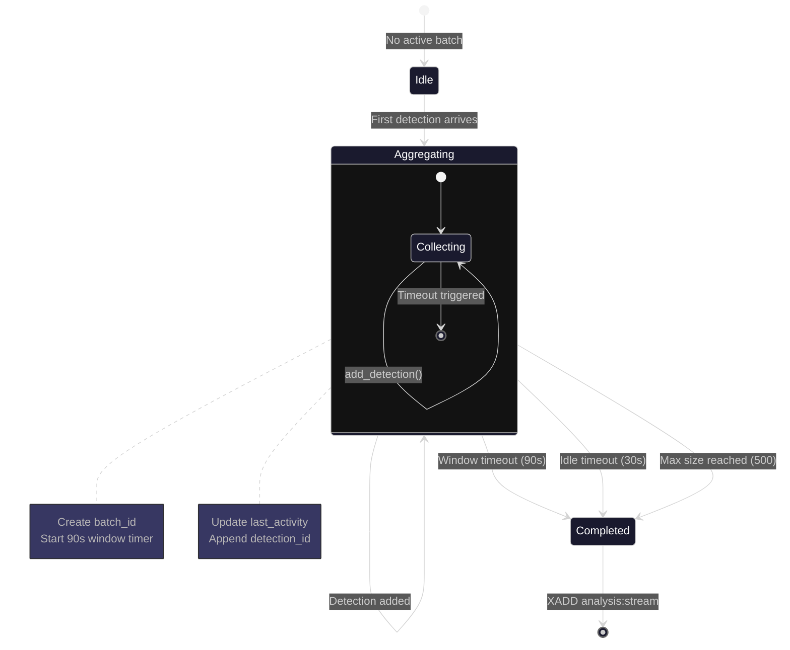
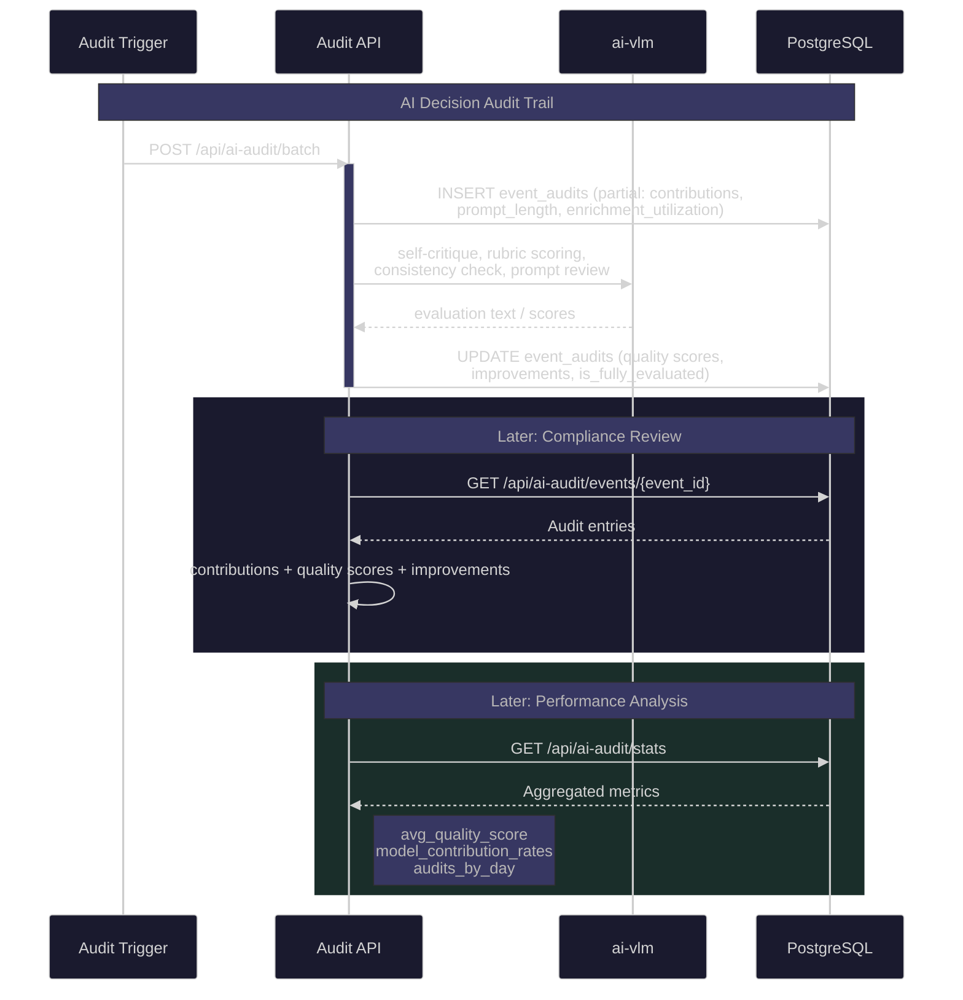
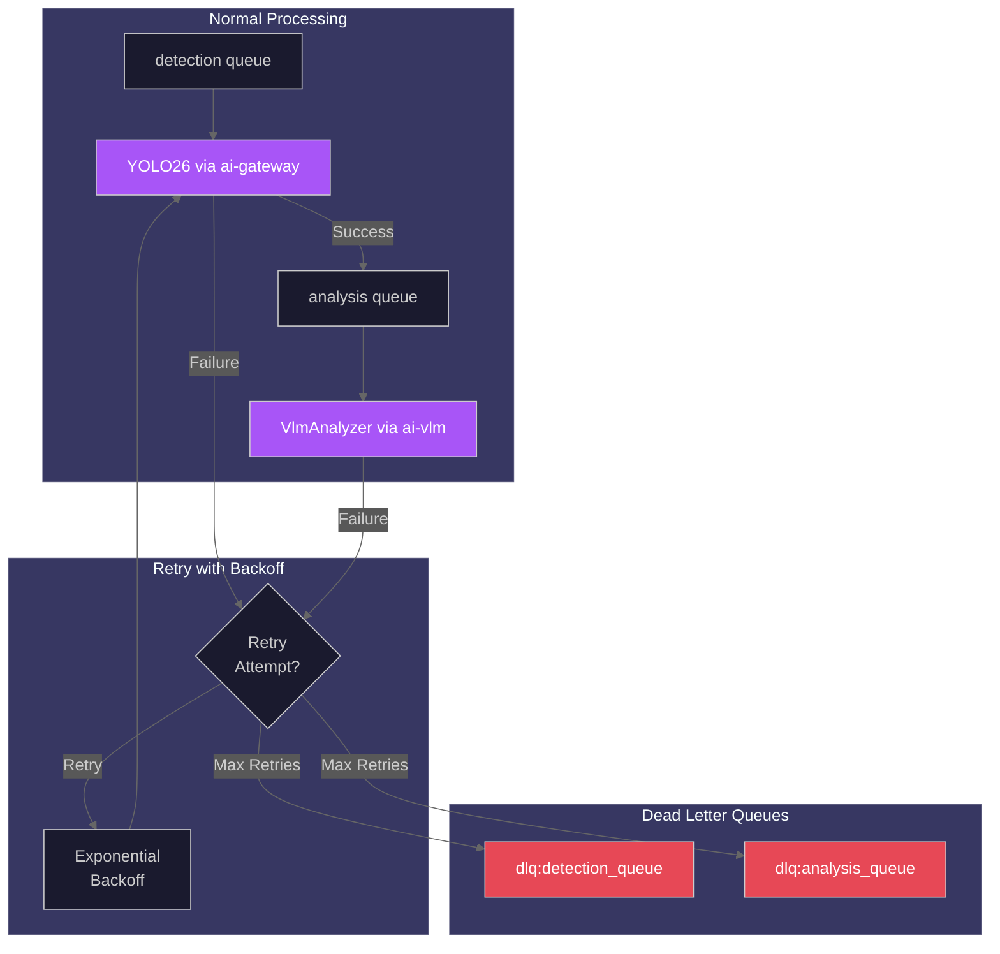

# AI Pipeline API

This guide covers the API surfaces around the AI processing pipeline: AI audit logging, prompt management, the dead letter queue for failed jobs, circuit-breaker status, and background jobs management. The pipeline itself is documented in [AI pipeline current state](../../architecture/ai-pipeline-current-state.md).

**Endpoint Count:** 34 endpoints across 4 domains — AI Audit: 7, Prompt management: 10, DLQ: 5, Jobs: 12 — plus the two circuit-breaker routes under `/api/system`. Every endpoint listed here exists in `docs/openapi.json` and in `backend/api/routes/`.

## Pipeline Overview

The AI pipeline processes camera images through these stages:

1. **File Watch** - `FileWatcher` watches camera folders for new images and pushes each onto the `detections:stream` Redis stream
2. **Detection** - the detection worker calls the gateway route `/yolo26` (Triton YOLO26 TensorRT behind `ai-gateway`)
3. **Batching** - `BatchAggregator` groups detections per camera, closing on a 90-second window, 30 seconds idle, or 500 detections
4. **Analysis** - `VlmAnalyzer` selects 1-4 key frames, runs the in-process lookup legs (faces, plates, person re-ID), and asks `ai-vlm` for a verdict that becomes the Event's risk score

### AI Pipeline Flow Diagram


```mermaid
%%{init: {'theme': 'dark', 'themeVariables': {'primaryColor': '#3B82F6', 'primaryTextColor': '#FFFFFF', 'primaryBorderColor': '#60A5FA', 'secondaryColor': '#A855F7', 'tertiaryColor': '#009688', 'background': '#121212', 'mainBkg': '#1a1a2e', 'lineColor': '#666666'}}}%%
flowchart LR
    subgraph Input["Image Input"]
        CAM[Camera FTP Upload]
        FW[File Watcher]
    end

    subgraph Detection["Object Detection"]
        DS[detections:stream]
        YOLO[YOLO26 via<br/>ai-gateway:8090]
    end

    subgraph Processing["Batch Processing"]
        BA[Batch Aggregator<br/>90s window]
    end

    subgraph Analysis["Risk Analysis"]
        AS[analysis:stream]
        VLM[VlmAnalyzer<br/>ai-vlm:8098]
    end

    subgraph Output["Output"]
        EVT[Security Event]
        WS[WebSocket<br/>Broadcast]
    end

    CAM --> FW
    FW --> DS
    DS --> YOLO
    YOLO --> BA
    BA --> AS
    AS --> VLM
    VLM --> EVT
    EVT --> WS

    style YOLO fill:#A855F7,color:#fff
    style VLM fill:#A855F7,color:#fff
    style BA fill:#009688,color:#fff
    style EVT fill:#76B900,color:#fff
```

_End-to-end AI pipeline flow from camera image upload through detection, batching, and VLM analysis to WebSocket broadcast._

---

## Batch Aggregation

Batches group detections from the same camera before sending them to the VLM for analysis. The aggregator has no REST API: batch state lives in the `BatchAggregator`
(`backend/services/batch_aggregator.py`) and is observable through the pipeline metrics and through the events a batch produces. `POST /api/events/analyze/{batch_id}/stream` is the one route that names a batch: it re-runs analysis for a batch id and streams progress.

### Batch Processing Lifecycle


```mermaid
%%{init: {'theme': 'dark', 'themeVariables': {'primaryColor': '#3B82F6', 'primaryTextColor': '#FFFFFF', 'primaryBorderColor': '#60A5FA', 'secondaryColor': '#A855F7', 'tertiaryColor': '#009688', 'background': '#121212', 'mainBkg': '#1a1a2e', 'lineColor': '#666666'}}}%%
stateDiagram-v2
    [*] --> Idle: No active batch

    Idle --> Aggregating: First detection arrives
    note right of Aggregating: Create batch_id<br/>Start 90s window timer

    Aggregating --> Aggregating: Detection added
    note right of Aggregating: Update last_activity<br/>Append detection_id

    Aggregating --> Completed: Window timeout (90s)
    Aggregating --> Completed: Idle timeout (30s)
    Aggregating --> Completed: Max size reached (500)

    Completed --> [*]: XADD analysis:stream

    state Aggregating {
        [*] --> Collecting
        Collecting --> Collecting: add_detection()
        Collecting --> [*]: Timeout triggered
    }
```

_State machine showing batch lifecycle from creation through collection to closure, with the three timeout triggers._

### Batch Triggers

| Trigger    | Config                                    | Description                           |
| ---------- | ----------------------------------------- | ------------------------------------- |
| `timeout`  | `BATCH_WINDOW_SECONDS` (default 90)       | Window elapsed since the batch opened |
| `idle`     | `BATCH_IDLE_TIMEOUT_SECONDS` (default 30) | 30 seconds without new detections     |
| `max_size` | `BATCH_MAX_DETECTIONS` (default 500)      | Batch closed and a new one opened     |

---

## AI Audit

The AI audit system provides transparency into model decision-making, prompt management, and self-evaluation capabilities for security and compliance. Audit rows live in the `event_audits` table (`backend/models/event_audit.py`). The analysis run itself does not write audit rows: a row is created when you trigger an audit (`POST /api/ai-audit/batch`, or the per-event routes below), or by the background evaluator when it runs while the GPU is idle (`backend/services/background_evaluator.py`). Self-evaluation makes four completion calls to `ai-vlm` per event, so a fresh install with no audits yet shows `0%` coverage — `GET /api/ai-audit/stats` carries a `message` saying so.

### AI Audit Workflow


```mermaid
%%{init: {'theme': 'dark', 'themeVariables': {'primaryColor': '#3B82F6', 'primaryTextColor': '#FFFFFF', 'primaryBorderColor': '#60A5FA', 'secondaryColor': '#A855F7', 'tertiaryColor': '#009688', 'background': '#121212', 'mainBkg': '#1a1a2e', 'lineColor': '#666666'}}}%%
sequenceDiagram
    participant OP as Audit Trigger
    participant API as Audit API
    participant VLM as ai-vlm
    participant DB as PostgreSQL

    Note over OP,DB: AI Decision Audit Trail

    OP->>API: POST /api/ai-audit/batch
    activate API
    API->>DB: INSERT event_audits (partial: contributions,<br/>prompt_length, enrichment_utilization)
    API->>VLM: self-critique, rubric scoring,<br/>consistency check, prompt review
    VLM-->>API: evaluation text / scores
    API->>DB: UPDATE event_audits (quality scores,<br/>improvements, is_fully_evaluated)
    deactivate API

    rect rgb(26, 26, 46)
        Note over API,DB: Later: Compliance Review
        API->>DB: GET /api/ai-audit/events/{event_id}
        DB-->>API: Audit entries
        API->>API: contributions + quality scores + improvements
    end

    rect rgb(26, 46, 42)
        Note over API,DB: Later: Performance Analysis
        API->>DB: GET /api/ai-audit/stats
        DB-->>API: Aggregated metrics
        Note right of API: avg_quality_score<br/>model_contribution_rates<br/>audits_by_day
    end
```

_Sequence diagram showing how AI decisions are logged for audit and later retrieved for compliance review and performance analysis._

### Endpoints

| Method | Endpoint                                   | Description                           |
| ------ | ------------------------------------------ | ------------------------------------- |
| POST   | `/api/ai-audit/batch`                      | Trigger batch audit processing        |
| GET    | `/api/ai-audit/batch/{job_id}`             | Get batch audit job status            |
| GET    | `/api/ai-audit/events/{event_id}`          | Get audit for specific event          |
| POST   | `/api/ai-audit/events/{event_id}/evaluate` | Trigger full event evaluation         |
| GET    | `/api/ai-audit/leaderboard`                | Get model leaderboard by contribution |
| GET    | `/api/ai-audit/recommendations`            | Get prompt improvement suggestions    |
| GET    | `/api/ai-audit/stats`                      | Get aggregate audit statistics        |

Prompt management is a separate router (`APIRouter(prefix="/api/prompts")` in
`backend/api/routes/prompt_management.py`):

| Method | Endpoint                            | Description                      |
| ------ | ----------------------------------- | -------------------------------- |
| GET    | `/api/prompts`                      | Get all prompt configurations    |
| GET    | `/api/prompts/export`               | Export all configurations (JSON) |
| GET    | `/api/prompts/history`              | Get history for all models       |
| POST   | `/api/prompts/history/{version_id}` | Restore a prompt version         |
| POST   | `/api/prompts/import`               | Import configurations from JSON  |
| POST   | `/api/prompts/import/preview`       | Preview import changes           |
| POST   | `/api/prompts/test`                 | Test modified prompt config      |
| POST   | `/api/prompts/test-prompt`          | Test custom prompt (A/B testing) |
| GET    | `/api/prompts/{model}`              | Get prompt for specific model    |
| PUT    | `/api/prompts/{model}`              | Update prompt for specific model |

### Batch Audit Processing

Queue batch audit processing (async — the request returns a job id, `202
Accepted`):

```bash
POST /api/ai-audit/batch
Content-Type: application/json

{
  "limit": 100,
  "min_risk_score": 50,
  "force_reevaluate": false
}
```

| Name             | Type    | Default | Description                                           |
| ---------------- | ------- | ------- | ----------------------------------------------------- |
| limit            | integer | 100     | Max events to audit (1-1000)                          |
| min_risk_score   | integer | null    | Only audit events at or above this risk score (0-100) |
| force_reevaluate | boolean | false   | Re-audit events that are already fully evaluated      |

**Response:**

```json
{
  "job_id": "550e8400-e29b-41d4-a716-446655440000",
  "status": "pending",
  "message": "Batch audit job created. Use GET /api/ai-audit/batch/550e8400-e29b-41d4-a716-446655440000 to track progress.",
  "total_events": 75
}
```

Poll `GET /api/ai-audit/batch/{job_id}` for progress (`progress`,
`processed_events`, `failed_events`).

### Get Event Audit

Get audit information for a specific event (`404` if the event or its audit
row does not exist):

```bash
GET /api/ai-audit/events/45
```

**Response** (`EventAuditResponse`):

```json
{
  "id": 123,
  "event_id": 45,
  "audited_at": "2026-10-01T12:01:30Z",
  "is_fully_evaluated": true,
  "contributions": {
    "yolo26": true,
    "florence": false,
    "clip": false,
    "violence": false,
    "clothing": false,
    "vehicle": false,
    "pet": false,
    "weather": true,
    "image_quality": true,
    "zones": true,
    "baseline": false,
    "cross_camera": false
  },
  "prompt_length": 2048,
  "prompt_token_estimate": 512,
  "enrichment_utilization": 0.85,
  "scores": {
    "context_usage": 4.2,
    "reasoning_coherence": 4.5,
    "risk_justification": 3.8,
    "consistency": 4.0,
    "overall": 4.1
  },
  "improvements": {
    "missing_context": ["Time since last motion event"],
    "confusing_sections": [],
    "unused_data": [],
    "format_suggestions": ["Add structured detection summary"],
    "model_gaps": []
  }
}
```

The `contributions` flags say which pipeline stages contributed to the event;
`florence`, `clip`, `violence`, `clothing`, `vehicle`, and `pet` are columns
the audit writer still fills from the event's enriched context, and on the
shipped VLM path the in-process lookup legs are what populate them — a flag
being false does not name a broken service.

### Evaluate Event

Trigger full self-evaluation pipeline for an event:

```bash
POST /api/ai-audit/events/45/evaluate?force=false
```

**Parameters:**

| Name  | Type    | Default | Description                           |
| ----- | ------- | ------- | ------------------------------------- |
| force | boolean | false   | Re-evaluate even if already evaluated |

**Response:**

Returns the updated `EventAuditResponse` after the four evaluation modes
(self-critique, rubric scoring, consistency check, prompt-improvement review)
have run. An event with no stored `llm_prompt` cannot be evaluated — the
route returns the audit row unchanged. Events analyzed before the audit
record existed gain one on the first evaluate call.

### Model Leaderboard

Get models ranked by contribution rate:

```bash
GET /api/ai-audit/leaderboard?days=7
```

**Parameters:**

| Name | Type    | Default | Description                      |
| ---- | ------- | ------- | -------------------------------- |
| days | integer | 7       | Number of days to include (1-90) |

**Response** (`LeaderboardResponse` — one entry per tracked model name,
computed from the audit rows in the window):

```json
{
  "entries": [
    {
      "model_name": "yolo26",
      "contribution_rate": 0.98,
      "quality_correlation": 0.85,
      "event_count": 1200
    },
    {
      "model_name": "weather",
      "contribution_rate": 0.95,
      "quality_correlation": 0.44,
      "event_count": 1140
    }
  ],
  "period_days": 7
}
```

### Prompt Configuration Management

`{model}` names a stored config bucket, not a running service: the
`nemotron` bucket holds the risk-analysis system prompt that
`POST /api/prompts/test` sends to `ai-vlm`.

#### Get Model Prompt

```bash
GET /api/prompts/nemotron
```

Valid `{model}` values: `nemotron`, `florence2`, `yolo_world`, `xclip`,
`fashion_clip`.

**Response:**

```json
{
  "model": "nemotron",
  "config": {
    "system_prompt": "You are a home security AI assistant...",
    "temperature": 0.7,
    "max_tokens": 2048
  },
  "version": 3,
  "created_at": "2026-01-03T10:30:00Z",
  "created_by": "admin",
  "change_description": "Added weather context to prompt"
}
```

#### Update Model Prompt

```bash
PUT /api/prompts/nemotron
Content-Type: application/json

{
  "config": {
    "system_prompt": "You are a home security AI assistant...",
    "temperature": 0.7,
    "max_tokens": 2048
  },
  "change_description": "Increased temperature for more creative responses",
  "expected_version": 3
}
```

**Parameters:**

| Name               | Type    | Default | Description                                                         |
| ------------------ | ------- | ------- | ------------------------------------------------------------------- |
| change_description | string  | null    | Optional description of what changed                                |
| expected_version   | integer | null    | Optimistic locking; returns `409 Conflict` if it mismatches current |

**Response:** the updated `ModelPromptConfig` (same shape as the GET above,
with the incremented `version`).

### Prompt Management

#### Get All Prompts

```bash
GET /api/prompts
```

**Response:**

```json
{
  "version": "1.0",
  "exported_at": "2026-01-03T10:30:00Z",
  "prompts": {
    "nemotron": {
      "system_prompt": "You are a home security AI assistant...",
      "temperature": 0.7,
      "max_tokens": 2048
    },
    "florence2": {
      "vqa_queries": ["What is this person wearing?", "Is this person carrying anything?"]
    }
  }
}
```

### Prompt History

#### Get Version History

```bash
GET /api/prompts/history?model=nemotron&limit=50&offset=0
```

**Parameters:**

| Name   | Type    | Default | Description                    |
| ------ | ------- | ------- | ------------------------------ |
| model  | string  | null    | Optional model filter          |
| limit  | integer | 50      | Max versions to return (1-100) |
| offset | integer | 0       | Number of versions to skip     |

**Response:**

```json
{
  "versions": [
    {
      "id": 15,
      "model": "nemotron",
      "version": 3,
      "created_at": "2026-01-03T10:30:00Z",
      "created_by": "admin",
      "change_description": "Added weather context to prompt",
      "is_active": true
    },
    {
      "id": 12,
      "model": "nemotron",
      "version": 2,
      "created_at": "2026-01-02T14:00:00Z",
      "created_by": "system",
      "change_description": "Initial configuration",
      "is_active": false
    }
  ],
  "total_count": 3
}
```

#### Restore Prompt Version

Restore is keyed by the version record `id` (the `id` field from the history
response), not the model name:

```bash
POST /api/prompts/history/15
```

**Response:**

```json
{
  "restored_version": 3,
  "model": "nemotron",
  "new_version": 4,
  "message": "Successfully restored version 3 as new version 4"
}
```

### Prompt Import/Export

#### Export All Prompts

```bash
GET /api/prompts/export
```

**Response:** the same shape as `GET /api/prompts`
(`version`, `exported_at`, `prompts`).

#### Preview Import Changes

Validate an import payload and diff it against current configs without
applying anything:

```bash
POST /api/prompts/import/preview
Content-Type: application/json

{
  "version": "1.0",
  "prompts": {
    "nemotron": {
      "system_prompt": "You are a home security AI assistant...",
      "temperature": 0.8,
      "max_tokens": 2048
    }
  }
}
```

**Response:** per-model diff entries (`model`, `has_changes`,
`current_version`, `current_config`, `imported_config`, `changes`), plus
`total_changes`, `validation_errors`, and `unknown_models`.

#### Import Prompts

```bash
POST /api/prompts/import
Content-Type: application/json

{
  "version": "1.0",
  "prompts": {
    "nemotron": {
      "system_prompt": "You are a home security AI assistant...",
      "temperature": 0.7,
      "max_tokens": 2048
    }
  }
}
```

**Response:**

```json
{
  "imported_models": ["nemotron"],
  "skipped_models": ["yolo_world"],
  "new_versions": {
    "nemotron": 4
  },
  "message": "Successfully imported 1 prompt configurations, skipped 1"
}
```

### Prompt Testing

#### Test Modified Prompt Config

Test a candidate configuration against an event (rate limited to 10
requests/minute per client):

```bash
POST /api/prompts/test
Content-Type: application/json

{
  "model": "nemotron",
  "config": {
    "system_prompt": "Modified prompt for testing...",
    "temperature": 0.2,
    "max_tokens": 2048
  },
  "event_id": 12345
}
```

**Response:**

```json
{
  "model": "nemotron",
  "before_score": 65,
  "after_score": 45,
  "before_response": {
    "risk_score": 65,
    "risk_level": "medium",
    "summary": "Person detected at front door during evening hours"
  },
  "after_response": {
    "risk_score": 45,
    "risk_level": "low",
    "summary": "Regular visitor detected - matches known delivery pattern"
  },
  "improved": true,
  "test_duration_ms": 1250,
  "error": null
}
```

#### Test Custom Prompt (A/B Testing)

Test a custom prompt for the Prompt Playground. Results are **not**
persisted. Same rate limit as above:

```bash
POST /api/prompts/test-prompt
Content-Type: application/json

{
  "event_id": 12345,
  "custom_prompt": "Analyze this security event with focus on...",
  "temperature": 0.7,
  "max_tokens": 2048,
  "model": "nemotron"
}
```

**Response:**

```json
{
  "risk_score": 45,
  "risk_level": "low",
  "reasoning": "The detected person matches the expected delivery pattern...",
  "summary": "Delivery person detected at front door during expected hours",
  "entities": [{ "type": "person", "confidence": 0.95 }],
  "flags": [],
  "recommended_action": "No action required",
  "processing_time_ms": 1250,
  "tokens_used": 512
}
```

### Recommendations

Get aggregated prompt improvement recommendations:

```bash
GET /api/ai-audit/recommendations?days=7
```

**Parameters:**

| Name | Type    | Default | Description                      |
| ---- | ------- | ------- | -------------------------------- |
| days | integer | 7       | Number of days to analyze (1-90) |

**Response** (`RecommendationsResponse` — items carry `category`,
`suggestion`, `frequency`, `priority`; there is no per-model breakdown):

```json
{
  "recommendations": [
    {
      "category": "missing_context",
      "suggestion": "Add time since last motion event",
      "frequency": 25,
      "priority": "high"
    },
    {
      "category": "format_suggestions",
      "suggestion": "Add structured detection summary",
      "frequency": 12,
      "priority": "medium"
    }
  ],
  "total_events_analyzed": 500
}
```

`total_events_analyzed` counts fully evaluated audits in the window, so
recommendations only exist once self-evaluation has run.

### Audit Statistics

```bash
GET /api/ai-audit/stats?days=7&camera_id=front_door
```

**Parameters:**

| Name      | Type    | Default | Description                      |
| --------- | ------- | ------- | -------------------------------- |
| days      | integer | 7       | Number of days to include (1-90) |
| camera_id | string  | null    | Optional camera filter           |

**Response** (`AuditStatsResponse` — rates are 0-1 contribution fractions
computed from the audit rows):

```json
{
  "total_events": 5234,
  "audited_events": 4800,
  "fully_evaluated_events": 3900,
  "avg_quality_score": 4.1,
  "avg_consistency_rate": 0.92,
  "avg_enrichment_utilization": 0.78,
  "model_contribution_rates": {
    "yolo26": 1.0,
    "florence": 0.0,
    "clip": 0.0,
    "weather": 0.95,
    "image_quality": 0.98,
    "zones": 0.62
  },
  "audits_by_day": [
    {
      "date": "2026-10-01",
      "day_of_week": "Tuesday",
      "count": 45,
      "avg_quality_score": 4.2,
      "avg_enrichment_utilization": 0.78,
      "model_contributions": { "yolo26": 45, "weather": 41 }
    }
  ],
  "message": null
}
```

`total_events` here counts **audited** events in the window (the service
builds it from the audit rows), and `message` carries guidance when nothing
has been evaluated yet. There is no token-usage breakdown in this response.

---

## Dead Letter Queue (DLQ)

The DLQ holds failed AI pipeline jobs for inspection and reprocessing.

### Queue Architecture


```mermaid
%%{init: {'theme': 'dark', 'themeVariables': {'primaryColor': '#3B82F6', 'primaryTextColor': '#FFFFFF', 'primaryBorderColor': '#60A5FA', 'secondaryColor': '#A855F7', 'tertiaryColor': '#009688', 'background': '#121212', 'mainBkg': '#1a1a2e', 'lineColor': '#666666'}}}%%
flowchart TB
    subgraph Processing["Normal Processing"]
        DQ[detection queue]
        AQ[analysis queue]
        RT[YOLO26 via ai-gateway]
        VLM[VlmAnalyzer via ai-vlm]
    end

    subgraph Retry["Retry with Backoff"]
        R1{Retry<br/>Attempt?}
        BACK[Exponential<br/>Backoff]
    end

    subgraph DLQ["Dead Letter Queues"]
        DLQ1[dlq:detection_queue]
        DLQ2[dlq:analysis_queue]
    end

    DQ --> RT
    RT -->|Success| AQ
    RT -->|Failure| R1
    R1 -->|Retry| BACK --> RT
    R1 -->|Max Retries| DLQ1

    AQ --> VLM
    VLM -->|Failure| R1
    R1 -->|Max Retries| DLQ2

    style DLQ1 fill:#E74856,color:#fff
    style DLQ2 fill:#E74856,color:#fff
    style RT fill:#A855F7,color:#fff
    style VLM fill:#A855F7,color:#fff
```

_Queue architecture showing normal processing flow and failure paths to dead letter queues._

Two carriers exist and both end in the same DLQ names. With the shipped
default `USE_REDIS_STREAMS=true` (`backend/core/config.py:2242`) the hops run over Redis
Streams (`detections:stream`, `analysis:stream`) and a message that exceeds
its max delivery count is moved to the matching stream DLQ
(`detections:stream:dlq`, `analysis:stream:dlq` —
`backend/services/redis_streams.py:618,1131`). The list queues
(`detection_queue`, `analysis_queue`) keep the retry-handler path documented
on this page: exhausted retries land in `dlq:detection_queue` /
`dlq:analysis_queue`, which are what the endpoints below read.

### Endpoints

| Method | Endpoint                            | Description        |
| ------ | ----------------------------------- | ------------------ |
| GET    | `/api/dlq/stats`                    | DLQ statistics     |
| GET    | `/api/dlq/jobs/{queue_name}`        | List jobs in queue |
| POST   | `/api/dlq/requeue/{queue_name}`     | Requeue single job |
| POST   | `/api/dlq/requeue-all/{queue_name}` | Requeue all jobs   |
| DELETE | `/api/dlq/{queue_name}`             | Clear queue        |

### Queue Names

| Queue Name            | Description                      |
| --------------------- | -------------------------------- |
| `dlq:detection_queue` | Failed YOLO26 detection jobs     |
| `dlq:analysis_queue`  | Failed VLM analysis (batch) jobs |

### Get DLQ Statistics

```bash
GET /api/dlq/stats
```

**Response:**

```json
{
  "detection_queue_count": 2,
  "analysis_queue_count": 1,
  "total_count": 3
}
```

### List DLQ Jobs

```bash
GET /api/dlq/jobs/dlq:detection_queue?start=0&limit=10
```

**Parameters:**

| Name  | Type    | Default | Description                       |
| ----- | ------- | ------- | --------------------------------- |
| start | integer | 0       | Start index (0-based)             |
| limit | integer | 100     | Maximum jobs to return (max 1000) |

Each job carries enriched error context (`error_type`, `stack_trace`,
`http_status`, `response_body`, `retry_delays`, `context`). The response uses
the standard pagination envelope (`items` + `pagination`):

```json
{
  "queue_name": "dlq:detection_queue",
  "items": [
    {
      "original_job": {
        "camera_id": "front_door",
        "file_path": "/export/foscam/front_door/image_001.jpg",
        "timestamp": "2025-12-23T10:30:00.000000"
      },
      "error": "Connection refused: detector service unavailable",
      "attempt_count": 3,
      "first_failed_at": "2025-12-23T10:30:05.000000",
      "last_failed_at": "2025-12-23T10:30:15.000000",
      "queue_name": "detection_queue",
      "error_type": "ConnectionRefusedError",
      "http_status": null,
      "retry_delays": [1.0, 2.0],
      "context": {
        "detection_queue_depth": 150,
        "analysis_queue_depth": 25,
        "dlq_circuit_breaker_state": "closed"
      }
    }
  ],
  "pagination": { "total": 1, "limit": 100, "offset": 0, "has_more": false }
}
```

### Requeue Jobs

Requeue a single job (oldest first):

```bash
POST /api/dlq/requeue/dlq:detection_queue
X-API-Key: your-api-key
```

Requeue all jobs (limit: 1000 per call):

```bash
POST /api/dlq/requeue-all/dlq:analysis_queue
X-API-Key: your-api-key
```

### Clear Queue

**Warning:** Permanently deletes all jobs.

```bash
DELETE /api/dlq/dlq:detection_queue
X-API-Key: your-api-key
```

### Retry Behavior

Before jobs reach the DLQ, the retry handler (`RetryConfig` in
`backend/services/retry_handler.py`) retries with exponential backoff:

| Setting          | Default | Description               |
| ---------------- | ------- | ------------------------- |
| Max retries      | 3       | Attempts before DLQ       |
| Base delay       | 1s      | Initial retry delay       |
| Max delay        | 30s     | Maximum retry delay       |
| Exponential base | 2.0     | Backoff multiplier        |
| Jitter           | 0-25%   | Added on top of the delay |

### Common Failure Reasons

**Detection Queue:**

| Error                | Cause                           | Resolution                |
| -------------------- | ------------------------------- | ------------------------- |
| Connection refused   | YOLO26 service down             | Check AI container health |
| Timeout              | YOLO26 overloaded               | Check GPU utilization     |
| File not found       | Image deleted before processing | Check retention settings  |
| Invalid image format | Corrupted image                 | Manual review             |

**Analysis Queue:**

| Error                   | Cause                          | Resolution                 |
| ----------------------- | ------------------------------ | -------------------------- |
| Connection refused      | `ai-vlm` not up or unprofiled  | Check AI container health  |
| Context length exceeded | Prompt larger than served slot | Fewer detections per batch |
| Model loading failed    | VRAM exhausted                 | Restart AI services        |

### Recovery Workflow

The following diagram illustrates the DLQ recovery process:

```mermaid
%%{init: {'theme': 'dark', 'themeVariables': {'primaryColor': '#3B82F6', 'primaryTextColor': '#FFFFFF', 'primaryBorderColor': '#60A5FA', 'secondaryColor': '#A855F7', 'tertiaryColor': '#009688', 'background': '#121212', 'mainBkg': '#1a1a2e', 'lineColor': '#666666'}}}%%
flowchart TB
    subgraph Monitor["1. Monitor"]
        CHK[Check Service Health<br/>GET /api/system/health]
        STATS[Review DLQ Stats<br/>GET /api/dlq/stats]
    end

    subgraph Inspect["2. Inspect"]
        LIST[List Failed Jobs<br/>GET /api/dlq/jobs/{queue}]
        ANALYZE[Analyze Error Patterns]
    end

    subgraph Fix["3. Fix Root Cause"]
        SVC[Restart Service]
        CFG[Fix Configuration]
        CLEAN[Clear Corrupted Data]
    end

    subgraph Recover["4. Recover"]
        REQ[Requeue Jobs<br/>POST /api/dlq/requeue-all]
        MON[Monitor Processing]
    end

    subgraph Outcome["5. Verify"]
        OK{Jobs<br/>Processed?}
        SUCCESS[Recovery Complete]
        RETRY[Retry Fix]
    end

    CHK --> STATS
    STATS --> LIST
    LIST --> ANALYZE
    ANALYZE --> SVC
    ANALYZE --> CFG
    ANALYZE --> CLEAN
    SVC --> REQ
    CFG --> REQ
    CLEAN --> REQ
    REQ --> MON
    MON --> OK
    OK -->|Yes| SUCCESS
    OK -->|No| RETRY
    RETRY --> ANALYZE

    style SUCCESS fill:#76B900,color:#fff
    style REQ fill:#3B82F6,color:#fff
```

_Step-by-step DLQ recovery workflow from monitoring through inspection, fix, and verification._

**CLI Commands:**

```bash
# 1. Check service health
curl http://localhost:8000/api/system/health

# 2. Review DLQ statistics
curl http://localhost:8000/api/dlq/stats

# 3. Inspect failed jobs
curl "http://localhost:8000/api/dlq/jobs/dlq:detection_queue?limit=10"

# 4. Requeue after fixing issues
curl -X POST http://localhost:8000/api/dlq/requeue-all/dlq:detection_queue \
  -H "X-API-Key: your-api-key"

# 5. Monitor for new failures
watch -n 5 'curl -s http://localhost:8000/api/dlq/stats'
```

---

## Circuit Breaker Protection

The pipeline uses circuit breakers to prevent cascading failures.

### States

| State       | Behavior                                   |
| ----------- | ------------------------------------------ |
| `closed`    | Normal operation, requests pass through    |
| `open`      | Failing, requests rejected immediately     |
| `half_open` | Testing recovery, limited requests allowed |

### Configuration

Breakers are registered at startup with fixed settings, not env vars (the
`CircuitBreakerConfig` defaults in `backend/services/circuit_breaker.py`):

| Breaker               | failure_threshold | recovery_timeout | success_threshold |
| --------------------- | ----------------- | ---------------- | ----------------- |
| `yolo26`              | 5                 | 30s              | 2                 |
| `postgresql`, `redis` | 10                | 60s              | 3                 |
| `ai-vlm` (vlm_client) | 5                 | 60s              | 2                 |

The `/api/system/circuit-breakers` response echoes each breaker's actual
config, so read it there rather than trusting this table if a deployment has
been changed in code.

### Check Status

```bash
GET /api/system/circuit-breakers
```

Breakers registered at startup: `yolo26`, `postgresql`, `redis`
(`backend/main.py:303-330`), plus `ai-vlm`, created lazily by `VlmClient`
(`backend/services/vlm_client.py:93`). A freshly started backend shows the
first three; `ai-vlm` appears once the VLM path has been used.

**Response:**

```json
{
  "circuit_breakers": {
    "yolo26": {
      "name": "yolo26",
      "state": "closed",
      "failure_count": 0,
      "success_count": 0,
      "total_calls": 100,
      "rejected_calls": 0,
      "config": {
        "failure_threshold": 5,
        "recovery_timeout": 30.0,
        "half_open_max_calls": 3,
        "success_threshold": 2
      }
    }
  },
  "total_count": 3,
  "open_count": 0,
  "timestamp": "2026-10-02T10:30:00Z"
}
```

### Reset Circuit Breaker

```bash
POST /api/system/circuit-breakers/yolo26/reset
X-API-Key: your-api-key
```

---

## Background Jobs

The jobs API provides management and monitoring of background processing tasks including exports, cleanups, and AI processing jobs.

### Endpoints

| Method | Endpoint                     | Description                     |
| ------ | ---------------------------- | ------------------------------- |
| GET    | `/api/jobs`                  | List all jobs with filtering    |
| POST   | `/api/jobs/bulk-cancel`      | Cancel multiple jobs at once    |
| GET    | `/api/jobs/search`           | Advanced job search with facets |
| GET    | `/api/jobs/stats`            | Get aggregate job statistics    |
| GET    | `/api/jobs/types`            | List available job types        |
| GET    | `/api/jobs/{job_id}`         | Get job status                  |
| DELETE | `/api/jobs/{job_id}`         | Cancel or abort a job           |
| POST   | `/api/jobs/{job_id}/abort`   | Abort a running job             |
| POST   | `/api/jobs/{job_id}/cancel`  | Cancel a queued job             |
| GET    | `/api/jobs/{job_id}/detail`  | Get detailed job information    |
| GET    | `/api/jobs/{job_id}/history` | Get job execution history       |
| GET    | `/api/jobs/{job_id}/logs`    | Get job execution logs          |

### List Jobs

```bash
GET /api/jobs?job_type=export&status=running&limit=50&offset=0
```

**Parameters:**

| Name     | Type    | Default | Description                                                       |
| -------- | ------- | ------- | ----------------------------------------------------------------- |
| job_type | string  | null    | Filter by type (export, cleanup, etc.)                            |
| status   | string  | null    | Filter by status (pending, running, completed, failed, cancelled) |
| limit    | integer | 50      | Max results (1-1000)                                              |
| offset   | integer | 0       | Results to skip                                                   |

**Response** (pagination envelope — `items` + `pagination`, NEM-2178):

```json
{
  "items": [
    {
      "job_id": "550e8400-e29b-41d4-a716-446655440000",
      "job_type": "export",
      "status": "running",
      "progress": 45,
      "message": "Exporting events: 450/1000",
      "created_at": "2026-10-02T12:00:00Z",
      "started_at": "2026-10-02T12:00:05Z",
      "completed_at": null,
      "result": null,
      "error": null
    }
  ],
  "pagination": { "total": 1, "limit": 50, "offset": 0, "has_more": false }
}
```

### Advanced Job Search

Search and filter jobs with advanced query capabilities:

```bash
GET /api/jobs/search?q=export&status=running,pending&has_error=false&sort=created_at&order=desc
```

**Parameters:**

| Name             | Type     | Default    | Description                                   |
| ---------------- | -------- | ---------- | --------------------------------------------- |
| q                | string   | null       | Free text search across type, error, metadata |
| status           | string   | null       | Comma-separated status values                 |
| job_type         | string   | null       | Comma-separated job types                     |
| queue            | string   | null       | Queue name filter                             |
| created_after    | datetime | null       | Filter jobs created after timestamp           |
| created_before   | datetime | null       | Filter jobs created before timestamp          |
| completed_after  | datetime | null       | Filter jobs completed after timestamp         |
| completed_before | datetime | null       | Filter jobs completed before timestamp        |
| has_error        | boolean  | null       | Filter jobs with/without errors               |
| min_duration     | float    | null       | Minimum duration in seconds                   |
| max_duration     | float    | null       | Maximum duration in seconds                   |
| limit            | integer  | 50         | Max results (1-1000)                          |
| offset           | integer  | 0          | Results to skip                               |
| sort             | string   | created_at | Sort field                                    |
| order            | string   | desc       | Sort direction (asc, desc)                    |

**Response** (`data` + `meta` + `aggregations`):

```json
{
  "data": [
    {
      "job_id": "550e8400-e29b-41d4-a716-446655440000",
      "job_type": "export",
      "status": "completed",
      "progress": 100
    }
  ],
  "meta": { "total": 150, "limit": 50, "offset": 0, "has_more": true },
  "aggregations": {
    "by_status": { "running": 5, "pending": 10, "completed": 100, "failed": 35 },
    "by_type": { "export": 120, "cleanup": 20, "backup": 10 }
  }
}
```

The status filter param is `status` (the handler names it `job_status`);
`sort` accepts `created_at`, `started_at`, `completed_at`, `progress`,
`job_type`, `status`.

### Job Statistics

```bash
GET /api/jobs/stats
```

**Response** (`by_status` and `by_type` are lists of `{status|job_type, count}`
objects, not maps):

```json
{
  "total_jobs": 1500,
  "by_status": [
    { "status": "pending", "count": 25 },
    { "status": "running", "count": 5 },
    { "status": "completed", "count": 1400 },
    { "status": "failed", "count": 70 }
  ],
  "by_type": [
    { "job_type": "export", "count": 800 },
    { "job_type": "orphaned_file_cleanup", "count": 500 },
    { "job_type": "batch_audit", "count": 200 }
  ],
  "average_duration_seconds": 45.5,
  "oldest_pending_job_age_seconds": 120.0
}
```

`JobStatusEnum` has four values — `pending`, `running`, `completed`, `failed`.
A cancelled or aborted job lands in `failed`; there is no `cancelled` status.

### Job Types

```bash
GET /api/jobs/types
```

**Response** — the job types the backend actually creates (`create_job(...)`
call sites): `export`, `batch_audit`, `evaluation`, `orphaned_file_cleanup`.

```json
{
  "job_types": [
    { "name": "export", "description": "Export events to CSV, JSON, or ZIP format" },
    { "name": "cleanup", "description": "Clean up old data and temporary files" }
  ]
}
```

### Get Job Status

```bash
GET /api/jobs/550e8400-e29b-41d4-a716-446655440000
```

**Response** (`JobResponse`):

```json
{
  "job_id": "550e8400-e29b-41d4-a716-446655440000",
  "job_type": "export",
  "status": "running",
  "progress": 45,
  "message": "Exporting events: 450/1000",
  "created_at": "2026-10-02T12:00:00Z",
  "started_at": "2026-10-02T12:00:05Z",
  "completed_at": null,
  "error": null,
  "result": null
}
```

### Get Job Detail

Get comprehensive job information including progress history and timing:

```bash
GET /api/jobs/550e8400-e29b-41d4-a716-446655440000/detail
```

**Response** (`JobDetailResponse` — `progress`, `timing`, and `retry_info` are
nested objects; the id field is `id`, not `job_id`):

```json
{
  "id": "550e8400-e29b-41d4-a716-446655440000",
  "job_type": "export",
  "status": "running",
  "queue_name": "high_priority",
  "priority": 1,
  "progress": {
    "percent": 45,
    "current_step": "Processing events",
    "items_processed": 450,
    "items_total": 1000
  },
  "timing": {
    "created_at": "2026-10-02T12:00:00Z",
    "started_at": "2026-10-02T12:00:05Z",
    "duration_seconds": 45.5,
    "estimated_remaining_seconds": 55.0
  },
  "retry_info": { "attempt_number": 1, "max_attempts": 3, "previous_errors": [] },
  "result": null,
  "error": null,
  "metadata": { "worker_id": "worker-001" }
}
```

### Get Job History

Get complete execution history with state transitions:

```bash
GET /api/jobs/550e8400-e29b-41d4-a716-446655440000/history
```

**Response** (`JobHistoryResponse` — transitions use `from`/`to`/`at`/
`triggered_by`, attempts use `attempt_number`):

```json
{
  "job_id": "550e8400-e29b-41d4-a716-446655440000",
  "job_type": "export",
  "status": "completed",
  "created_at": "2026-10-02T12:00:00Z",
  "started_at": "2026-10-02T12:00:01Z",
  "completed_at": "2026-10-02T12:01:30Z",
  "transitions": [
    { "at": "2026-10-02T12:00:00Z", "to": "pending", "triggered_by": "api" },
    {
      "at": "2026-10-02T12:00:01Z",
      "from": "pending",
      "to": "running",
      "triggered_by": "worker",
      "details": { "worker_id": "worker-1" }
    }
  ],
  "attempts": [
    {
      "attempt_number": 1,
      "started_at": "2026-10-02T12:00:01Z",
      "ended_at": "2026-10-02T12:01:30Z",
      "status": "succeeded",
      "duration_seconds": 89.0,
      "worker_id": "worker-1"
    }
  ]
}
```

### Get Job Logs

```bash
GET /api/jobs/550e8400-e29b-41d4-a716-446655440000/logs?level=INFO&limit=100
```

**Parameters:**

| Name  | Type     | Default | Description                                     |
| ----- | -------- | ------- | ----------------------------------------------- |
| level | string   | null    | Minimum log level (DEBUG, INFO, WARNING, ERROR) |
| since | datetime | null    | Return logs from this timestamp                 |
| limit | integer  | 100     | Maximum log entries                             |

**Response** (`JobLogsResponse` — `total` + `has_more`, not `count`):

```json
{
  "job_id": "550e8400-e29b-41d4-a716-446655440000",
  "logs": [
    {
      "timestamp": "2026-10-02T12:00:01Z",
      "level": "INFO",
      "message": "Job started",
      "attempt_number": 1
    },
    {
      "timestamp": "2026-10-02T12:00:05Z",
      "level": "INFO",
      "message": "Processing events: 0/1000",
      "attempt_number": 1,
      "context": { "progress": 0 }
    }
  ],
  "total": 2,
  "has_more": false
}
```

### Cancel Job

Cancel a queued job (`409` if it already completed or failed; `404` if the id
is unknown). A cancelled job's status becomes `failed` — the tracker has no
`cancelled` state:

```bash
POST /api/jobs/550e8400-e29b-41d4-a716-446655440000/cancel
```

**Response:**

```json
{
  "job_id": "550e8400-e29b-41d4-a716-446655440000",
  "status": "failed",
  "message": "Job cancellation requested"
}
```

### Abort Running Job

Abort a currently running job (queued jobs should use `/cancel`; `400` if the
job is not running):

```bash
POST /api/jobs/550e8400-e29b-41d4-a716-446655440000/abort
```

**Response:**

```json
{
  "job_id": "550e8400-e29b-41d4-a716-446655440000",
  "status": "failed",
  "message": "Job abort requested - worker notified"
}
```

### Delete/Cancel Job (Unified)

Cancel based on current state (same response as `/cancel`):

```bash
DELETE /api/jobs/550e8400-e29b-41d4-a716-446655440000
```

### Bulk Cancel Jobs

Cancel multiple jobs at once (1-100 ids per call). Jobs that cannot be
cancelled are reported in `errors`; the call itself still succeeds:

```bash
POST /api/jobs/bulk-cancel
Content-Type: application/json

{
  "job_ids": ["550e8400-e29b-41d4-a716-446655440000", "660e8400-e29b-41d4-a716-446655440001"]
}
```

**Response** (`BulkCancelResponse` — `cancelled` + `failed` counts, failures
listed under `errors`):

```json
{
  "cancelled": 1,
  "failed": 1,
  "errors": [
    { "job_id": "660e8400-e29b-41d4-a716-446655440001", "error": "Job already completed or failed" }
  ]
}
```

---

## Related Documentation

- [Core Resources API](core-resources.md) - Cameras, events, detections
- [System Operations API](system-ops.md) - Health and configuration
- [Real-time API](realtime.md) - WebSocket streams
