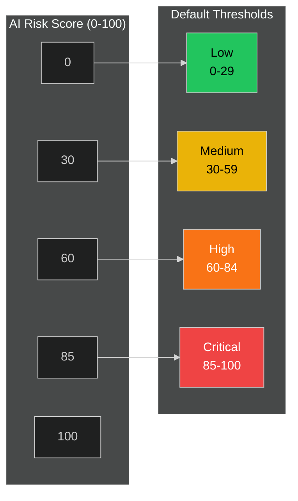

# Calibration API

This guide covers the User Calibration API for managing personalized risk thresholds that customize how risk scores are categorized into severity levels.

## Overview

The Calibration API allows users to adjust the risk score thresholds that determine how events are classified (low, medium, high, critical). This enables personalized risk assessment based on individual preferences and feedback patterns.

### Risk Threshold Concept



**How Calibration Works:**

1. **AI Pipeline** generates a risk score (0-100) based on detected objects and context
2. **Calibration thresholds** map the numeric score to a severity level (low/medium/high/critical)
3. **User feedback** (false positives, missed threats) can adjust thresholds over time
4. **Decay factor** controls how quickly thresholds adapt to feedback

---

## Endpoints

| Method | Endpoint                    | Description                      |
| ------ | --------------------------- | -------------------------------- |
| GET    | `/api/calibration`          | Get current calibration settings |
| PUT    | `/api/calibration`          | Update calibration (full update) |
| PATCH  | `/api/calibration`          | Partial calibration update       |
| POST   | `/api/calibration/reset`    | Reset to default thresholds      |
| GET    | `/api/calibration/defaults` | Get default threshold values     |

---

## Get Calibration

Get the current user's calibration settings.

```bash
GET /api/calibration
```

If no calibration exists for the user, one is automatically created with default values.

### Response

**Success (200 OK):**

```json
{
  "id": 1,
  "user_id": "default",
  "low_threshold": 30,
  "medium_threshold": 60,
  "high_threshold": 85,
  "decay_factor": 0.1,
  "false_positive_count": 5,
  "missed_threat_count": 3,
  "created_at": "2026-01-01T12:00:00Z",
  "updated_at": "2026-01-15T10:30:00Z"
}
```

### Response Fields

| Field                  | Type     | Description                                         |
| ---------------------- | -------- | --------------------------------------------------- |
| `id`                   | integer  | Calibration record ID                               |
| `user_id`              | string   | User identifier ("default" for single-user systems) |
| `low_threshold`        | integer  | Upper bound for "low" risk (scores below this)      |
| `medium_threshold`     | integer  | Upper bound for "medium" risk                       |
| `high_threshold`       | integer  | Upper bound for "high" risk (above = critical)      |
| `decay_factor`         | float    | Learning rate for threshold adjustment (0.0-1.0)    |
| `false_positive_count` | integer  | Total false positive feedback received              |
| `missed_threat_count`  | integer  | Total missed threat feedback received               |
| `created_at`           | datetime | When calibration was created                        |
| `updated_at`           | datetime | When calibration was last modified                  |

### Risk Level Mapping

With the response above, risk scores would be categorized as:

| Risk Score | Risk Level |
| ---------- | ---------- |
| 0-29       | Low        |
| 30-59      | Medium     |
| 60-84      | High       |
| 85-100     | Critical   |

---

## Update Calibration

Update calibration thresholds. Both PUT and PATCH support partial updates.

```bash
PUT /api/calibration
Content-Type: application/json
```

or

```bash
PATCH /api/calibration
Content-Type: application/json
```

### Request Body

All fields are optional. Only provided fields will be updated.

```json
{
  "low_threshold": 25,
  "medium_threshold": 55,
  "high_threshold": 80,
  "decay_factor": 0.15
}
```

### Request Fields

| Field              | Type    | Range   | Description                                   |
| ------------------ | ------- | ------- | --------------------------------------------- |
| `low_threshold`    | integer | 0-100   | Upper bound for low risk classification       |
| `medium_threshold` | integer | 0-100   | Upper bound for medium risk classification    |
| `high_threshold`   | integer | 0-100   | Upper bound for high risk classification      |
| `decay_factor`     | float   | 0.0-1.0 | Learning rate for automatic threshold updates |

### Threshold Ordering

Thresholds must maintain proper ordering: `low_threshold < medium_threshold < high_threshold`

This validation is applied after merging with existing values. For example, if current thresholds are `30, 60, 85` and you update only `low_threshold: 70`, it will fail because `70 >= 60`.

### Response

**Success (200 OK):**

```json
{
  "id": 1,
  "user_id": "default",
  "low_threshold": 25,
  "medium_threshold": 55,
  "high_threshold": 80,
  "decay_factor": 0.15,
  "false_positive_count": 5,
  "missed_threat_count": 3,
  "created_at": "2026-01-01T12:00:00Z",
  "updated_at": "2026-01-18T14:30:00Z"
}
```

**Validation Error (422):**

```json
{
  "detail": "low_threshold (70) must be less than medium_threshold (60)"
}
```

---

## Reset Calibration

Reset calibration thresholds to default values.

```bash
POST /api/calibration/reset
```

This resets thresholds and decay factor to defaults but **preserves** feedback counts (`false_positive_count`, `missed_threat_count`).

### Response

**Success (200 OK):**

```json
{
  "message": "Calibration reset to default values",
  "calibration": {
    "id": 1,
    "user_id": "default",
    "low_threshold": 30,
    "medium_threshold": 60,
    "high_threshold": 85,
    "decay_factor": 0.1,
    "false_positive_count": 5,
    "missed_threat_count": 3,
    "created_at": "2026-01-01T12:00:00Z",
    "updated_at": "2026-01-18T14:35:00Z"
  }
}
```

---

## Get Default Values

Get the system default threshold values without modifying the current calibration.

```bash
GET /api/calibration/defaults
```

This endpoint is useful for displaying defaults in the UI or documentation.

### Response

**Success (200 OK):**

```json
{
  "low_threshold": 30,
  "medium_threshold": 60,
  "high_threshold": 85,
  "decay_factor": 0.1
}
```

---

## Default Threshold Values

| Threshold          | Default | Description                             |
| ------------------ | ------- | --------------------------------------- |
| `low_threshold`    | 30      | Scores 0-29 classified as low risk      |
| `medium_threshold` | 60      | Scores 30-59 classified as medium risk  |
| `high_threshold`   | 85      | Scores 60-84 classified as high risk    |
| `decay_factor`     | 0.1     | 10% learning rate for threshold updates |

---

## Decay Factor

The `decay_factor` controls how quickly thresholds adapt to user feedback:

- **Lower values (0.01-0.05):** Slow adaptation, more stable thresholds
- **Default (0.1):** Balanced adaptation
- **Higher values (0.2-0.5):** Fast adaptation, more responsive to feedback

### Example Threshold Adjustment

When a user marks an event as a "false positive":

```
new_threshold = current_threshold + (decay_factor * adjustment)
```

For a false positive on a score of 75 with `high_threshold=85` and `decay_factor=0.1`:

```
adjustment = 100 - 75 = 25  (push threshold higher)
new_high_threshold = 85 + (0.1 * 25) = 87.5 (rounded to 88)
```

---

## Single-User System

This system operates in single-user mode. All calibration operations use `user_id="default"`. Multi-user support may be added in future versions.

---

## Integration with Feedback

The Calibration API works in conjunction with the [Feedback API](/api/feedback) to enable a feedback loop:

1. User submits feedback on an event (false positive, missed threat, etc.)
2. Feedback is recorded via `/api/feedback`
3. Calibration thresholds can be automatically adjusted based on feedback patterns
4. Updated thresholds affect future event classification

**Feedback Types and Their Effects:**

| Feedback Type      | Effect on Thresholds                       |
| ------------------ | ------------------------------------------ |
| `false_positive`   | Raises thresholds (less sensitive)         |
| `missed_detection` | Lowers thresholds (more sensitive)         |
| `wrong_severity`   | Adjusts specific threshold boundary        |
| `correct`          | No change (reinforces current calibration) |

---

## Error Handling

| Code | Scenario                   | Example Response                                     |
| ---- | -------------------------- | ---------------------------------------------------- |
| 200  | Success                    | Calibration data returned                            |
| 422  | Invalid threshold ordering | `"low_threshold must be less than medium_threshold"` |
| 422  | Value out of range         | `"low_threshold must be between 0 and 100"`          |
| 500  | Database error             | `"Internal server error"`                            |

---

## Examples

### Increase Sensitivity (Lower Thresholds)

Make the system more sensitive by lowering thresholds:

```bash
PATCH /api/calibration
Content-Type: application/json

{
  "low_threshold": 20,
  "medium_threshold": 45,
  "high_threshold": 70
}
```

Result: More events will be classified as higher risk.

### Decrease Sensitivity (Raise Thresholds)

Reduce false positives by raising thresholds:

```bash
PATCH /api/calibration
Content-Type: application/json

{
  "low_threshold": 40,
  "medium_threshold": 70,
  "high_threshold": 90
}
```

Result: Fewer events will trigger high/critical alerts.

### Adjust Learning Rate Only

Change how quickly thresholds adapt without changing current values:

```bash
PATCH /api/calibration
Content-Type: application/json

{
  "decay_factor": 0.05
}
```

Result: Slower, more conservative threshold adaptation.

---

## Related Documentation

- [Core Resources API](core-resources.md) - Events and risk levels
- [System Operations API](system-ops.md) - Severity configuration
- [AI Pipeline API](ai-pipeline.md) - Risk score generation
