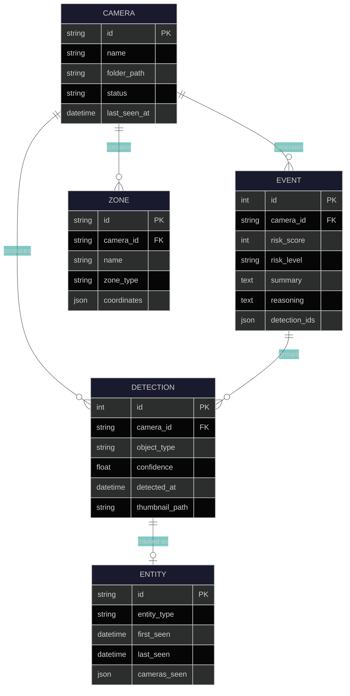
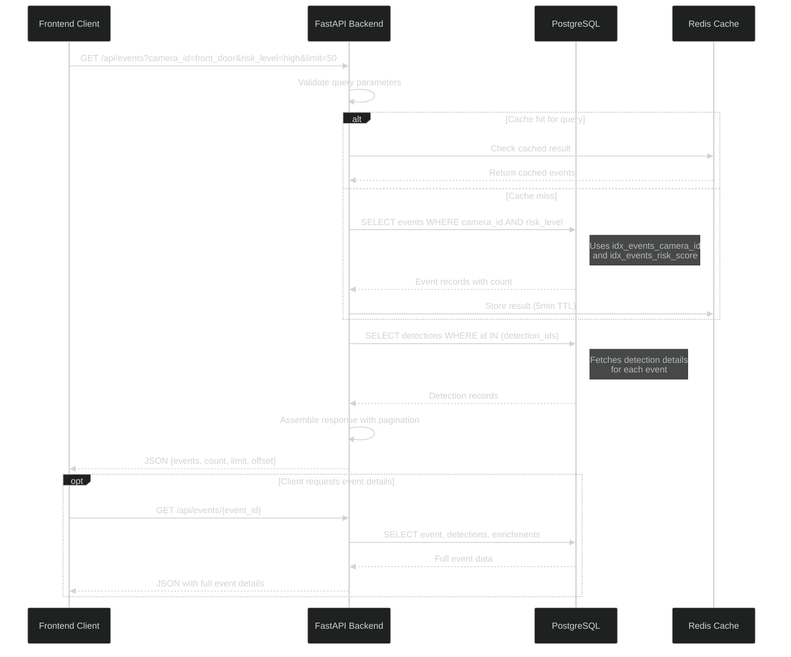
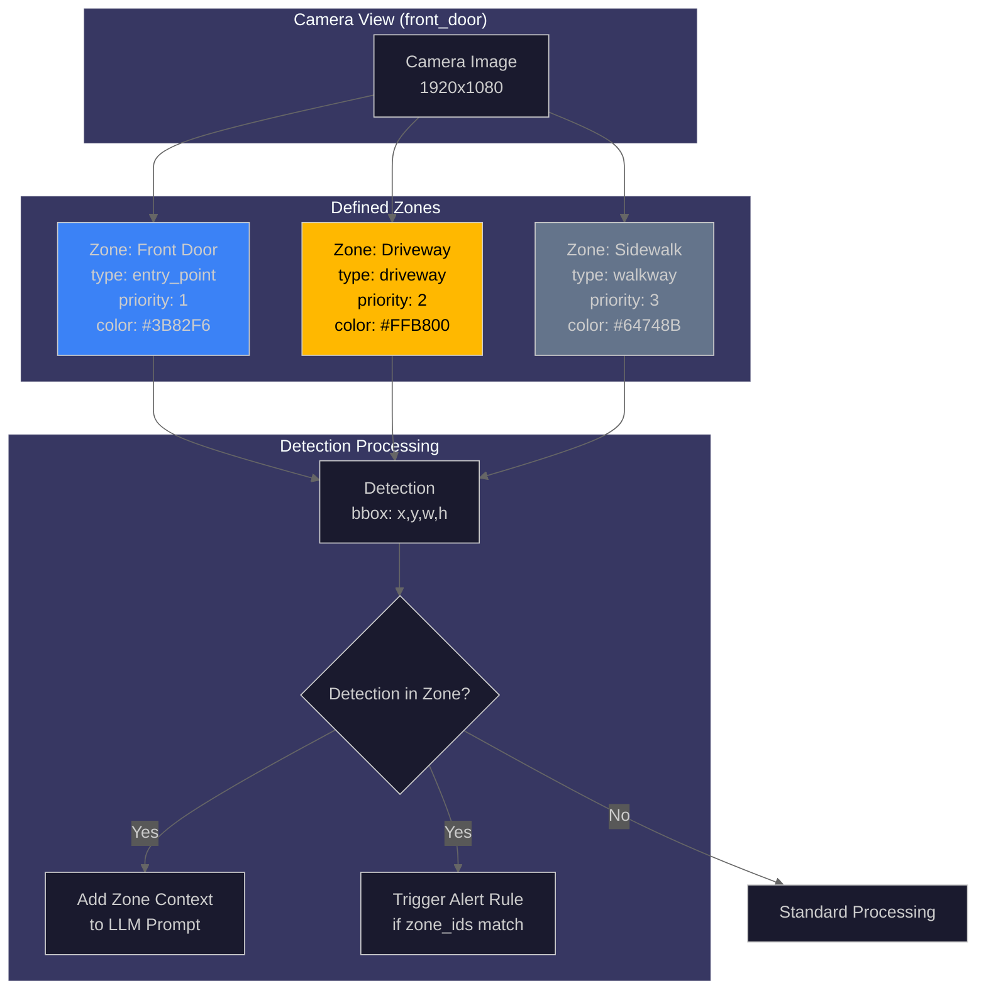

# Core Resources API

This guide covers the fundamental data resources in the Home Security Intelligence system: cameras, events, detections, zones, entities, and analytics.

## Entity Relationships

The core data model follows a hierarchical structure where cameras produce detections, which are aggregated into events by the AI pipeline.



**Data Flow:**

1. **Camera** uploads images via FTP to its configured `folder_path`
2. **Detection** records are created when RT-DETRv2 identifies objects in images
3. **Events** aggregate multiple detections within time windows (90s) and include LLM-generated risk assessments
4. **Zones** define regions of interest within camera views for targeted detection
5. **Entities** track persons/vehicles across cameras using CLIP-based re-identification

---

## Cameras

Cameras represent physical security devices that upload images to configured folder paths.

### Endpoints

| Method | Endpoint                                                  | Description              |
| ------ | --------------------------------------------------------- | ------------------------ |
| GET    | `/api/cameras`                                            | List all cameras         |
| GET    | `/api/cameras/{camera_id}`                                | Get camera by ID         |
| POST   | `/api/cameras`                                            | Create new camera        |
| PATCH  | `/api/cameras/{camera_id}`                                | Update camera            |
| DELETE | `/api/cameras/{camera_id}`                                | Delete camera            |
| GET    | `/api/cameras/{camera_id}/snapshot`                       | Get latest snapshot      |
| GET    | `/api/cameras/validation/paths`                           | Validate folder paths    |
| GET    | `/api/cameras/{camera_id}/baseline`                       | Get baseline activity    |
| GET    | `/api/cameras/{camera_id}/baseline/anomalies`             | Get recent anomalies     |
| GET    | `/api/cameras/{camera_id}/scene-changes`                  | List scene changes       |
| POST   | `/api/cameras/{camera_id}/scene-changes/{id}/acknowledge` | Acknowledge scene change |

### List Cameras

```bash
GET /api/cameras?status=online
```

**Parameters:**

| Name   | Type   | Description                          |
| ------ | ------ | ------------------------------------ |
| status | string | Filter: `online`, `offline`, `error` |

**Response:**

```json
{
  "cameras": [
    {
      "id": "front_door",
      "name": "Front Door Camera",
      "folder_path": "/export/foscam/front_door",
      "status": "online",
      "created_at": "2025-12-23T10:00:00Z",
      "last_seen_at": "2025-12-23T12:00:00Z"
    }
  ],
  "count": 1
}
```

### Create Camera

```bash
POST /api/cameras
Content-Type: application/json

{
  "name": "Front Door Camera",
  "folder_path": "/export/foscam/front_door",
  "status": "online"
}
```

The camera `id` is auto-generated from the name (lowercase, underscored).

### Get Camera Snapshot

```bash
GET /api/cameras/front_door/snapshot
```

Returns binary image data with appropriate `Content-Type` header.

### Baseline Activity

Get activity patterns for anomaly detection:

```bash
GET /api/cameras/front_door/baseline
```

**Response:**

```json
{
  "camera_id": "front_door",
  "baseline_established": "2026-01-01T00:00:00Z",
  "data_points": 720,
  "hourly_patterns": {
    "0": { "avg_detections": 0.5, "std_dev": 0.3, "sample_count": 30 },
    "17": { "avg_detections": 5.2, "std_dev": 1.1, "sample_count": 30 }
  },
  "current_deviation": {
    "score": 1.8,
    "interpretation": "slightly_above_normal",
    "contributing_factors": ["person_count_elevated"]
  }
}
```

### Scene Change Detection

Monitor camera tampering or angle changes:

```bash
GET /api/cameras/front_door/scene-changes?acknowledged=false
```

**Change Types:** `view_blocked`, `angle_changed`, `view_tampered`, `unknown`

---

## Events

Events are aggregated from detections within time windows and contain LLM-generated risk assessments.

### Event Retrieval Flow

The following diagram illustrates the typical API flow for fetching events with filters, including how the backend processes pagination and joins detection data.



### Endpoints

| Method | Endpoint                               | Description                |
| ------ | -------------------------------------- | -------------------------- |
| GET    | `/api/events`                          | List events with filtering |
| GET    | `/api/events/stats`                    | Get event statistics       |
| GET    | `/api/events/search`                   | Full-text search           |
| GET    | `/api/events/export`                   | Export as CSV              |
| GET    | `/api/events/{event_id}`               | Get event by ID            |
| PATCH  | `/api/events/{event_id}`               | Update event (review)      |
| GET    | `/api/events/{event_id}/detections`    | Get detections for event   |
| GET    | `/api/events/{event_id}/enrichments`   | Get enrichment data        |
| GET    | `/api/events/{event_id}/clip`          | Get video clip info        |
| POST   | `/api/events/{event_id}/clip/generate` | Generate video clip        |

### List Events

```bash
GET /api/events?camera_id=front_door&risk_level=high&limit=50
```

**Parameters:**

| Name        | Type     | Description                           |
| ----------- | -------- | ------------------------------------- |
| camera_id   | string   | Filter by camera ID                   |
| risk_level  | string   | `low`, `medium`, `high`, `critical`   |
| start_date  | datetime | Filter events after date              |
| end_date    | datetime | Filter events before date             |
| reviewed    | boolean  | Filter by reviewed status             |
| object_type | string   | Filter by object: `person`, `vehicle` |
| limit       | integer  | Max results (1-1000, default: 50)     |
| offset      | integer  | Results to skip (default: 0)          |

**Response:**

```json
{
  "events": [
    {
      "id": 1,
      "camera_id": "front_door",
      "started_at": "2025-12-23T12:00:00Z",
      "ended_at": "2025-12-23T12:02:30Z",
      "risk_score": 75,
      "risk_level": "medium",
      "summary": "Person detected near front entrance",
      "reasoning": "Person approaching entrance during daytime",
      "reviewed": false,
      "detection_count": 5,
      "detection_ids": [1, 2, 3, 4, 5]
    }
  ],
  "count": 1,
  "limit": 50,
  "offset": 0
}
```

### Full-Text Search

```bash
GET /api/events/search?q=suspicious+person&severity=high,critical
```

**Search Syntax:**

| Syntax            | Description  | Example               |
| ----------------- | ------------ | --------------------- |
| `word1 word2`     | Implicit AND | `person vehicle`      |
| `"phrase"`        | Exact phrase | `"suspicious person"` |
| `word1 OR word2`  | Boolean OR   | `person OR animal`    |
| `word1 NOT word2` | Boolean NOT  | `person NOT cat`      |

### Update Event (Review)

```bash
PATCH /api/events/1
Content-Type: application/json

{
  "reviewed": true,
  "notes": "Verified - delivery person"
}
```

### Generate Video Clip

```bash
POST /api/events/123/clip/generate
Content-Type: application/json

{
  "start_offset_seconds": -15,
  "end_offset_seconds": 30,
  "force": false
}
```

---

## Detections

Detections represent individual objects identified by RT-DETRv2 in camera images.

### Endpoints

| Method | Endpoint                                         | Description         |
| ------ | ------------------------------------------------ | ------------------- |
| GET    | `/api/detections`                                | List detections     |
| GET    | `/api/detections/{detection_id}`                 | Get detection by ID |
| GET    | `/api/detections/{detection_id}/image`           | Get thumbnail       |
| GET    | `/api/detections/{detection_id}/enrichment`      | Get enrichment data |
| GET    | `/api/detections/{detection_id}/video`           | Stream video        |
| GET    | `/api/detections/{detection_id}/video/thumbnail` | Get video thumbnail |

### List Detections

```bash
GET /api/detections?camera_id=front_door&object_type=person&min_confidence=0.8
```

**Parameters:**

| Name           | Type     | Description                          |
| -------------- | -------- | ------------------------------------ |
| camera_id      | string   | Filter by camera ID                  |
| object_type    | string   | Filter: `person`, `car`, `dog`, etc. |
| start_date     | datetime | Filter after date                    |
| end_date       | datetime | Filter before date                   |
| min_confidence | float    | Minimum confidence (0.0-1.0)         |
| limit          | integer  | Max results (1-1000, default: 50)    |
| offset         | integer  | Results to skip (default: 0)         |

**Response:**

```json
{
  "detections": [
    {
      "id": 1,
      "camera_id": "front_door",
      "file_path": "/export/foscam/front_door/20251223_120000.jpg",
      "file_type": "image/jpeg",
      "detected_at": "2025-12-23T12:00:00Z",
      "object_type": "person",
      "confidence": 0.95,
      "bbox_x": 100,
      "bbox_y": 150,
      "bbox_width": 200,
      "bbox_height": 400,
      "thumbnail_path": "/data/thumbnails/1_thumb.jpg",
      "media_type": "image"
    }
  ],
  "count": 1,
  "limit": 50,
  "offset": 0
}
```

### Object Types

Common objects detected by RT-DETRv2:

| Type         | Description  |
| ------------ | ------------ |
| `person`     | Human being  |
| `car`        | Automobile   |
| `truck`      | Truck or van |
| `motorcycle` | Motorcycle   |
| `bicycle`    | Bicycle      |
| `dog`        | Dog          |
| `cat`        | Cat          |

### Video Streaming

Supports HTTP Range requests for seeking:

```bash
GET /api/detections/1/video
Range: bytes=0-1048575
```

Returns `206 Partial Content` with `Content-Range` header.

---

## Zones

Zones define areas of interest within camera views for targeted detection and alerting.

### Zone Configuration Architecture

Zones enable fine-grained detection filtering and contextual risk assessment. The following diagram shows how zones integrate with cameras and affect detection processing.



**Zone Types and Use Cases:**

| Zone Type     | Typical Use                     | Risk Impact                   |
| ------------- | ------------------------------- | ----------------------------- |
| `entry_point` | Doors, gates, windows           | Higher risk for unknowns      |
| `restricted`  | Private areas, off-limits zones | Maximum risk elevation        |
| `driveway`    | Vehicle areas, parking          | Vehicle-focused alerts        |
| `walkway`     | Sidewalks, common paths         | Lower risk (expected traffic) |
| `perimeter`   | Property boundaries             | Boundary breach detection     |
| `other`       | General purpose zones           | User-defined behavior         |

### Endpoints

| Method | Endpoint                                   | Description |
| ------ | ------------------------------------------ | ----------- |
| GET    | `/api/cameras/{camera_id}/zones`           | List zones  |
| POST   | `/api/cameras/{camera_id}/zones`           | Create zone |
| GET    | `/api/cameras/{camera_id}/zones/{zone_id}` | Get zone    |
| PUT    | `/api/cameras/{camera_id}/zones/{zone_id}` | Update zone |
| DELETE | `/api/cameras/{camera_id}/zones/{zone_id}` | Delete zone |

### Create Zone

```bash
POST /api/cameras/front_door/zones
Content-Type: application/json

{
  "name": "Front Door",
  "zone_type": "entry_point",
  "coordinates": [
    [0.1, 0.2],
    [0.3, 0.2],
    [0.3, 0.8],
    [0.1, 0.8]
  ],
  "shape": "rectangle",
  "color": "#3B82F6",
  "enabled": true,
  "priority": 1
}
```

**Zone Types:**

| Type          | Description               |
| ------------- | ------------------------- |
| `entry_point` | Entry/exit points (doors) |
| `restricted`  | Restricted areas          |
| `driveway`    | Driveway or parking       |
| `walkway`     | Sidewalks and paths       |
| `perimeter`   | Property boundary         |
| `other`       | General purpose           |

**Coordinate System:**

Coordinates are normalized (0.0-1.0):

- `(0.0, 0.0)` = top-left corner
- `(1.0, 1.0)` = bottom-right corner

---

## Entities

Entities track persons and vehicles across cameras using CLIP-based re-identification.

### Endpoints

| Method | Endpoint                            | Description             |
| ------ | ----------------------------------- | ----------------------- |
| GET    | `/api/entities`                     | List tracked entities   |
| GET    | `/api/entities/{entity_id}`         | Get entity details      |
| GET    | `/api/entities/{entity_id}/history` | Get appearance timeline |

### List Entities

```bash
GET /api/entities?entity_type=person&camera_id=front_door
```

**Parameters:**

| Name        | Type     | Description                       |
| ----------- | -------- | --------------------------------- |
| entity_type | string   | Filter: `person` or `vehicle`     |
| camera_id   | string   | Filter by camera ID               |
| since       | datetime | Filter entities seen since time   |
| limit       | integer  | Max results (1-1000, default: 50) |
| offset      | integer  | Results to skip (default: 0)      |

**Response:**

```json
{
  "entities": [
    {
      "id": "entity_abc123",
      "entity_type": "person",
      "first_seen": "2025-12-23T10:00:00Z",
      "last_seen": "2025-12-23T14:30:00Z",
      "appearance_count": 5,
      "cameras_seen": ["front_door", "backyard", "driveway"],
      "thumbnail_url": "/api/detections/123/image"
    }
  ],
  "count": 1,
  "limit": 50,
  "offset": 0
}
```

### Get Entity Details

```bash
GET /api/entities/entity_abc123
```

Returns entity with full appearance history including:

- Detection IDs
- Camera locations
- Timestamps
- Similarity scores
- Attributes (clothing, carrying items)

### Re-identification Architecture

- **Algorithm:** CLIP ViT-L 768-dimensional embeddings
- **Storage:** Redis with 24-hour TTL
- **Matching:** Cosine similarity (default threshold: 0.85)
- **Scope:** Today's and yesterday's embeddings

---

## Analytics

Analytics endpoints provide aggregated data for dashboards and reports.

### Endpoints

| Method | Endpoint                             | Description             |
| ------ | ------------------------------------ | ----------------------- |
| GET    | `/api/analytics/detection-trends`    | Daily detection counts  |
| GET    | `/api/analytics/risk-history`        | Risk score distribution |
| GET    | `/api/analytics/camera-uptime`       | Uptime per camera       |
| GET    | `/api/analytics/object-distribution` | Counts by object type   |

### Detection Trends

```bash
GET /api/analytics/detection-trends?start_date=2025-12-01&end_date=2025-12-31
```

**Response:**

```json
{
  "data_points": [
    { "date": "2025-12-01", "count": 45 },
    { "date": "2025-12-02", "count": 32 }
  ],
  "total_detections": 77,
  "start_date": "2025-12-01",
  "end_date": "2025-12-02"
}
```

### Risk History

```bash
GET /api/analytics/risk-history?start_date=2025-12-01&end_date=2025-12-31
```

**Response:**

```json
{
  "data_points": [
    {
      "date": "2025-12-01",
      "low": 10,
      "medium": 5,
      "high": 2,
      "critical": 0
    }
  ],
  "start_date": "2025-12-01",
  "end_date": "2025-12-31"
}
```

### Camera Uptime

Uptime is calculated as days with at least one detection:

```bash
GET /api/analytics/camera-uptime?start_date=2025-12-01&end_date=2025-12-31
```

**Response:**

```json
{
  "cameras": [
    {
      "camera_id": "front_door",
      "camera_name": "Front Door Camera",
      "uptime_percentage": 95.5,
      "detection_count": 1250
    }
  ],
  "start_date": "2025-12-01",
  "end_date": "2025-12-31"
}
```

### Object Distribution

```bash
GET /api/analytics/object-distribution?start_date=2025-12-01&end_date=2025-12-31
```

**Response:**

```json
{
  "object_types": [
    { "object_type": "person", "count": 450, "percentage": 65.2 },
    { "object_type": "car", "count": 180, "percentage": 26.1 },
    { "object_type": "dog", "count": 60, "percentage": 8.7 }
  ],
  "total_detections": 690,
  "start_date": "2025-12-01",
  "end_date": "2025-12-31"
}
```

---

## Related Documentation

- [AI Pipeline API](ai-pipeline.md) - Enrichment and batch processing
- [System Operations API](system-ops.md) - Health and configuration
- [Real-time API](realtime.md) - WebSocket streams
