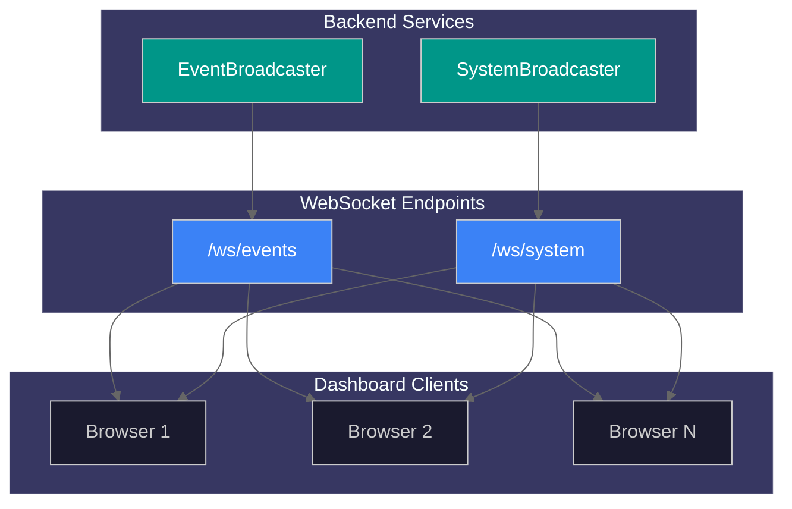
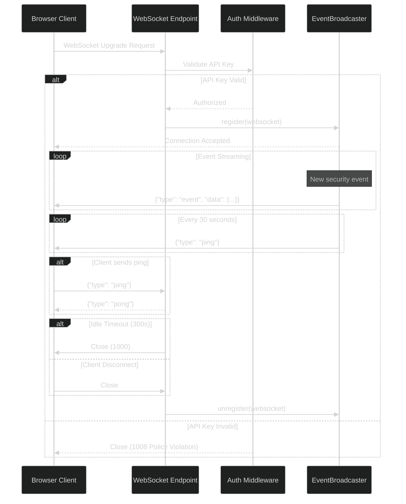
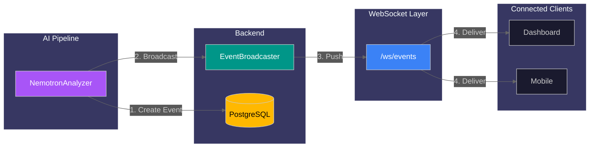
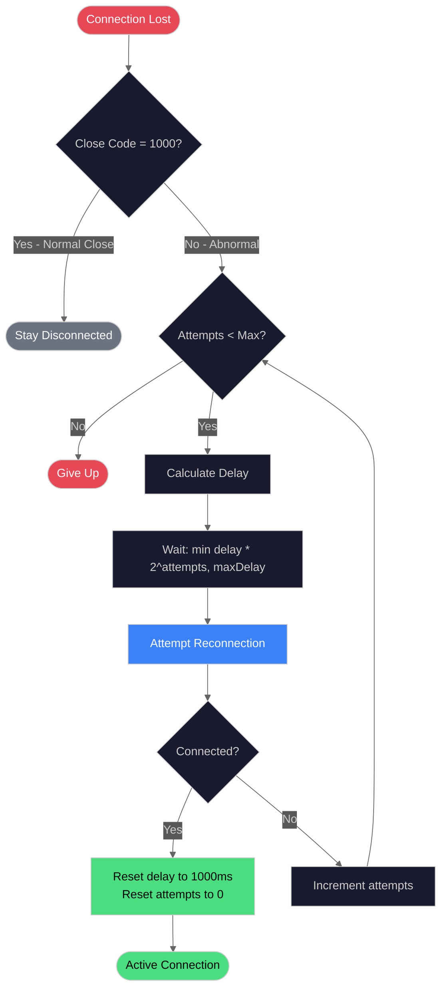
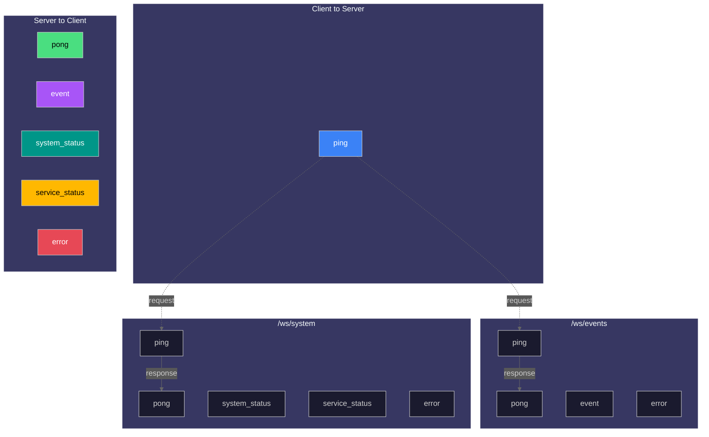

# Real-time API

This guide covers WebSocket endpoints for streaming security events and system status updates in real-time.

## WebSocket Architecture Overview



## Overview

The system provides two WebSocket endpoints for real-time communication:

| Protocol | Endpoint     | Description           |
| -------- | ------------ | --------------------- |
| WS       | `/ws/events` | Security event stream |
| WS       | `/ws/system` | System status stream  |

WebSocket connections enable the frontend to receive push notifications without polling, reducing latency and server load.

---

## Authentication

When `API_KEY_ENABLED=true`, provide the API key via:

**Query Parameter (recommended):**

```
ws://localhost:8000/ws/events?api_key=YOUR_KEY
```

**WebSocket Protocol Header:**

```javascript
const ws = new WebSocket('ws://localhost:8000/ws/events', ['api-key.YOUR_KEY']);
```

---

## Events Stream

Stream security events as they are detected and analyzed.

**Endpoint:** `ws://localhost:8000/ws/events`

### Connection Lifecycle

1. **Connect** - Client initiates WebSocket handshake
2. **Authenticate** - Server validates API key (if enabled)
3. **Register** - Client added to broadcaster subscription list
4. **Stream** - Server pushes events as they occur
5. **Keepalive** - Periodic pings maintain connection
6. **Close** - Idle timeout or client disconnect



### Server-Sent Messages

#### Event Message

Sent when a new security event is created:

```json
{
  "type": "event",
  "data": {
    "id": 1,
    "event_id": 1,
    "batch_id": "batch_abc123",
    "camera_id": "front_door",
    "risk_score": 75,
    "risk_level": "high",
    "summary": "Person detected at front door",
    "started_at": "2025-12-23T12:00:00"
  }
}
```

**Event Data Fields:**

| Field        | Type    | Description                            |
| ------------ | ------- | -------------------------------------- |
| `id`         | integer | Unique event identifier                |
| `event_id`   | integer | Legacy alias (backward compatibility)  |
| `batch_id`   | string  | Detection batch identifier             |
| `camera_id`  | string  | Camera that captured the event         |
| `risk_score` | integer | Risk assessment score (0-100)          |
| `risk_level` | string  | `low`, `medium`, `high`, or `critical` |
| `summary`    | string  | Human-readable event description       |
| `started_at` | string  | ISO 8601 timestamp                     |

#### Server Heartbeat

Sent every 30 seconds to keep connection alive:

```json
{ "type": "ping" }
```

### Client-Sent Messages

#### Ping (Keep-Alive)

Send to reset idle timeout and confirm connectivity:

```json
{ "type": "ping" }
```

**Server Response:**

```json
{ "type": "pong" }
```

#### Legacy Ping Format

For backward compatibility, plain text pings are also accepted:

```
ping
```

### Error Messages

Sent when client message validation fails:

```json
{
  "type": "error",
  "error": "invalid_json",
  "message": "Message must be valid JSON",
  "details": { "raw_data_preview": "invalid{json" }
}
```

**Error Codes:**

| Code                     | Description               |
| ------------------------ | ------------------------- |
| `invalid_json`           | Message is not valid JSON |
| `invalid_message_format` | Message schema invalid    |
| `unknown_message_type`   | Unrecognized message type |
| `validation_error`       | Schema validation failed  |

### Event Streaming Flow

The following diagram shows how security events flow from the AI pipeline through the WebSocket to connected clients:



### JavaScript Example

```javascript
class EventsWebSocket {
  constructor(apiKey) {
    this.url = `ws://localhost:8000/ws/events?api_key=${apiKey}`;
    this.reconnectDelay = 1000;
    this.maxDelay = 30000;
    this.connect();
  }

  connect() {
    this.ws = new WebSocket(this.url);

    this.ws.onopen = () => {
      console.log('Connected to event stream');
      this.reconnectDelay = 1000; // Reset on success

      // Send keepalive every 60 seconds
      this.pingInterval = setInterval(() => {
        if (this.ws.readyState === WebSocket.OPEN) {
          this.ws.send(JSON.stringify({ type: 'ping' }));
        }
      }, 60000);
    };

    this.ws.onmessage = (event) => {
      const data = JSON.parse(event.data);

      switch (data.type) {
        case 'event':
          this.handleEvent(data.data);
          break;
        case 'pong':
          console.debug('Keepalive acknowledged');
          break;
        case 'error':
          console.error('WebSocket error:', data.message);
          break;
      }
    };

    this.ws.onclose = (event) => {
      clearInterval(this.pingInterval);

      if (event.code !== 1000) {
        console.log(`Reconnecting in ${this.reconnectDelay}ms...`);
        setTimeout(() => this.connect(), this.reconnectDelay);
        this.reconnectDelay = Math.min(this.reconnectDelay * 2, this.maxDelay);
      }
    };

    this.ws.onerror = (error) => {
      console.error('WebSocket error:', error);
    };
  }

  handleEvent(event) {
    console.log('New security event:', event);
    // Update UI, show notification, etc.
  }

  close() {
    clearInterval(this.pingInterval);
    if (this.ws) {
      this.ws.close(1000, 'Client disconnect');
    }
  }
}

// Usage
const eventsWs = new EventsWebSocket('your-api-key');
```

---

## System Stream

Stream real-time system status including GPU metrics, queue status, and service health.

**Endpoint:** `ws://localhost:8000/ws/system`

### Server-Sent Messages

#### System Status Message

Sent periodically with current system metrics:

```json
{
  "type": "system_status",
  "data": {
    "gpu": {
      "utilization": 45.5,
      "memory_used": 8192,
      "memory_total": 24576,
      "temperature": 65.0,
      "inference_fps": 30.5
    },
    "cameras": {
      "active": 4,
      "total": 6
    },
    "queue": {
      "pending": 2,
      "processing": 1
    },
    "health": "healthy"
  },
  "timestamp": "2025-12-23T10:30:00.000Z"
}
```

**System Data Fields:**

| Field               | Type    | Description                        |
| ------------------- | ------- | ---------------------------------- |
| `gpu.utilization`   | float   | GPU utilization percentage         |
| `gpu.memory_used`   | integer | GPU memory used (MB)               |
| `gpu.memory_total`  | integer | Total GPU memory (MB)              |
| `gpu.temperature`   | float   | GPU temperature (Celsius)          |
| `gpu.inference_fps` | float   | Inference frames per second        |
| `cameras.active`    | integer | Number of active cameras           |
| `cameras.total`     | integer | Total configured cameras           |
| `queue.pending`     | integer | Items pending in queue             |
| `queue.processing`  | integer | Items currently processing         |
| `health`            | string  | `healthy`, `degraded`, `unhealthy` |

#### Service Status Message

Sent when a service status changes:

```json
{
  "type": "service_status",
  "data": {
    "service": "redis",
    "status": "healthy",
    "message": "Service responding normally"
  },
  "timestamp": "2025-12-23T12:00:00.000Z"
}
```

**Service Status Values:**

| Status           | Description                    |
| ---------------- | ------------------------------ |
| `healthy`        | Service operating normally     |
| `unhealthy`      | Service down or not responding |
| `restarting`     | Service restarting             |
| `restart_failed` | Restart attempt failed         |
| `failed`         | Service has failed             |

### JavaScript Example

```javascript
class SystemWebSocket {
  constructor(apiKey, callbacks) {
    this.url = `ws://localhost:8000/ws/system?api_key=${apiKey}`;
    this.callbacks = callbacks;
    this.connect();
  }

  connect() {
    this.ws = new WebSocket(this.url);

    this.ws.onmessage = (event) => {
      const data = JSON.parse(event.data);

      switch (data.type) {
        case 'system_status':
          this.callbacks.onSystemStatus?.(data.data, data.timestamp);
          break;
        case 'service_status':
          this.callbacks.onServiceStatus?.(data.data, data.timestamp);
          break;
        case 'pong':
          break;
      }
    };

    // Similar lifecycle handling as EventsWebSocket...
  }
}

// Usage
const systemWs = new SystemWebSocket('your-api-key', {
  onSystemStatus: (status, timestamp) => {
    updateGpuDashboard(status.gpu);
    updateQueueIndicator(status.queue);
    updateHealthBadge(status.health);
  },
  onServiceStatus: (status, timestamp) => {
    if (status.status !== 'healthy') {
      showServiceAlert(status.service, status.message);
    }
  },
});
```

---

## Connection Settings

| Setting                           | Default | Description                        |
| --------------------------------- | ------- | ---------------------------------- |
| `websocket_idle_timeout_seconds`  | 300     | Close after N seconds without ping |
| `websocket_ping_interval_seconds` | 30      | Server heartbeat interval          |

### Close Codes

| Code | Reason                                     |
| ---- | ------------------------------------------ |
| 1000 | Normal close (idle timeout, client close)  |
| 1008 | Policy violation (auth failed, rate limit) |

---

## Rate Limiting

WebSocket connections are rate-limited to prevent abuse:

- Connection attempts are throttled per IP address
- Excessive connections result in close code 1008
- Message rate within connections may also be limited

---

## Reconnection Strategy

The following diagram illustrates the exponential backoff reconnection strategy:



**Reconnection Parameters:**

| Parameter       | Default  | Description                        |
| --------------- | -------- | ---------------------------------- |
| `initialDelay`  | 1000ms   | First reconnection delay           |
| `maxDelay`      | 30000ms  | Maximum delay between attempts     |
| `maxAttempts`   | Infinity | Maximum reconnection attempts      |
| `backoffFactor` | 2        | Multiplier for exponential backoff |

Implement exponential backoff for reliable reconnection:

```javascript
class ReconnectingWebSocket {
  constructor(url, options = {}) {
    this.url = url;
    this.reconnectDelay = options.initialDelay || 1000;
    this.maxDelay = options.maxDelay || 30000;
    this.maxAttempts = options.maxAttempts || Infinity;
    this.attempts = 0;
    this.onMessage = options.onMessage;
    this.connect();
  }

  connect() {
    this.ws = new WebSocket(this.url);

    this.ws.onopen = () => {
      console.log('WebSocket connected');
      this.reconnectDelay = 1000;
      this.attempts = 0;
    };

    this.ws.onmessage = (event) => {
      if (this.onMessage) {
        this.onMessage(JSON.parse(event.data));
      }
    };

    this.ws.onclose = (event) => {
      if (event.code !== 1000 && this.attempts < this.maxAttempts) {
        this.attempts++;
        const delay = Math.min(this.reconnectDelay * Math.pow(2, this.attempts - 1), this.maxDelay);
        console.log(`Reconnecting in ${delay}ms (attempt ${this.attempts})...`);
        setTimeout(() => this.connect(), delay);
      }
    };

    this.ws.onerror = (error) => {
      console.error('WebSocket error:', error);
    };
  }

  send(message) {
    if (this.ws.readyState === WebSocket.OPEN) {
      this.ws.send(JSON.stringify(message));
    }
  }

  close() {
    this.maxAttempts = 0; // Prevent reconnection
    if (this.ws) {
      this.ws.close(1000, 'Client disconnect');
    }
  }
}
```

---

## Message Schema Reference

### Message Type Relationships



### Client-to-Server Messages

**WebSocketMessage (Base):**

| Field  | Type   | Required | Description               |
| ------ | ------ | -------- | ------------------------- |
| `type` | string | Yes      | Message type (1-50 chars) |
| `data` | object | No       | Optional payload          |

**WebSocketPingMessage:**

```json
{ "type": "ping" }
```

### Server-to-Client Messages

**WebSocketPongResponse:**

```json
{ "type": "pong" }
```

**WebSocketEventMessage:**

| Field  | Type   | Description      |
| ------ | ------ | ---------------- |
| `type` | string | Always `"event"` |
| `data` | object | Event payload    |

**WebSocketSystemStatusMessage:**

| Field       | Type   | Description              |
| ----------- | ------ | ------------------------ |
| `type`      | string | Always `"system_status"` |
| `data`      | object | System status payload    |
| `timestamp` | string | ISO 8601 timestamp       |

**WebSocketServiceStatusMessage:**

| Field       | Type   | Description               |
| ----------- | ------ | ------------------------- |
| `type`      | string | Always `"service_status"` |
| `data`      | object | Service status payload    |
| `timestamp` | string | ISO 8601 timestamp        |

**WebSocketErrorResponse:**

| Field     | Type   | Description                |
| --------- | ------ | -------------------------- |
| `type`    | string | Always `"error"`           |
| `error`   | string | Error code                 |
| `message` | string | Human-readable description |
| `details` | object | Additional context         |

---

## React Hook Example

```typescript
import { useEffect, useState, useCallback } from 'react';

interface SecurityEvent {
  id: number;
  camera_id: string;
  risk_score: number;
  risk_level: string;
  summary: string;
  started_at: string;
}

export function useEventStream(apiKey: string) {
  const [events, setEvents] = useState<SecurityEvent[]>([]);
  const [connected, setConnected] = useState(false);
  const [error, setError] = useState<string | null>(null);

  useEffect(() => {
    const ws = new WebSocket(`ws://localhost:8000/ws/events?api_key=${apiKey}`);

    ws.onopen = () => {
      setConnected(true);
      setError(null);
    };

    ws.onmessage = (event) => {
      const data = JSON.parse(event.data);
      if (data.type === 'event') {
        setEvents((prev) => [data.data, ...prev].slice(0, 100));
      }
    };

    ws.onclose = () => setConnected(false);
    ws.onerror = () => setError('Connection failed');

    // Keepalive
    const pingInterval = setInterval(() => {
      if (ws.readyState === WebSocket.OPEN) {
        ws.send(JSON.stringify({ type: 'ping' }));
      }
    }, 60000);

    return () => {
      clearInterval(pingInterval);
      ws.close(1000);
    };
  }, [apiKey]);

  return { events, connected, error };
}
```

---

## Related Documentation

- [Core Resources API](core-resources.md) - Events REST endpoints
- [System Operations API](system-ops.md) - System status REST endpoints
- [AI Pipeline API](ai-pipeline.md) - Pipeline monitoring
