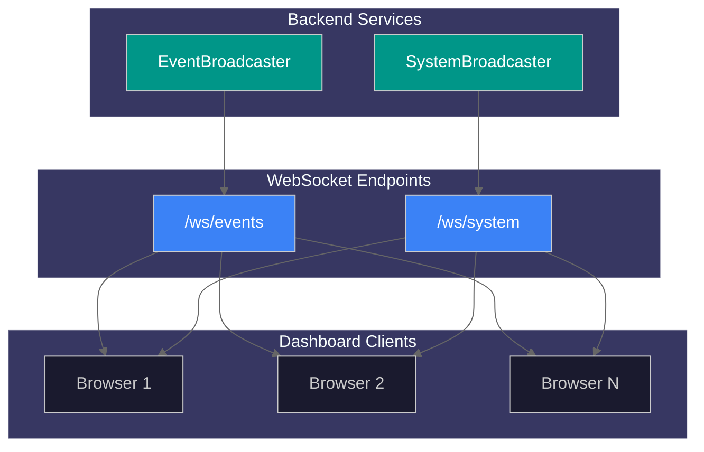
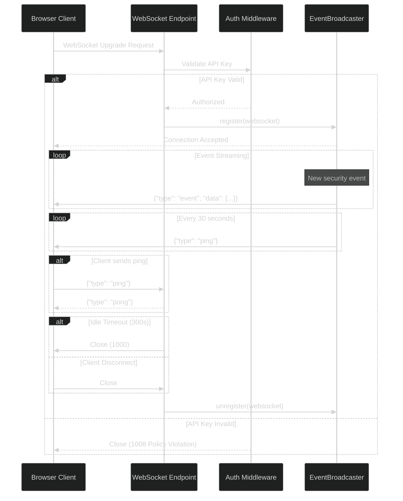
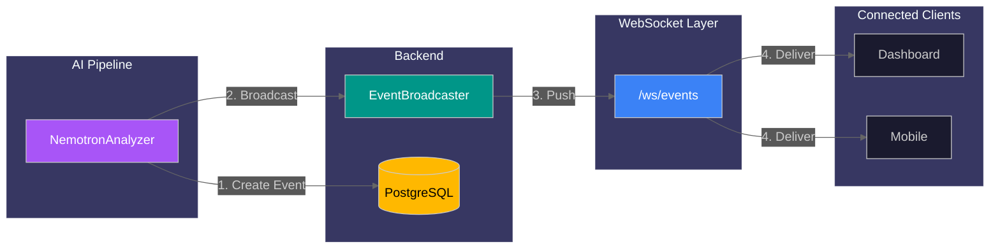
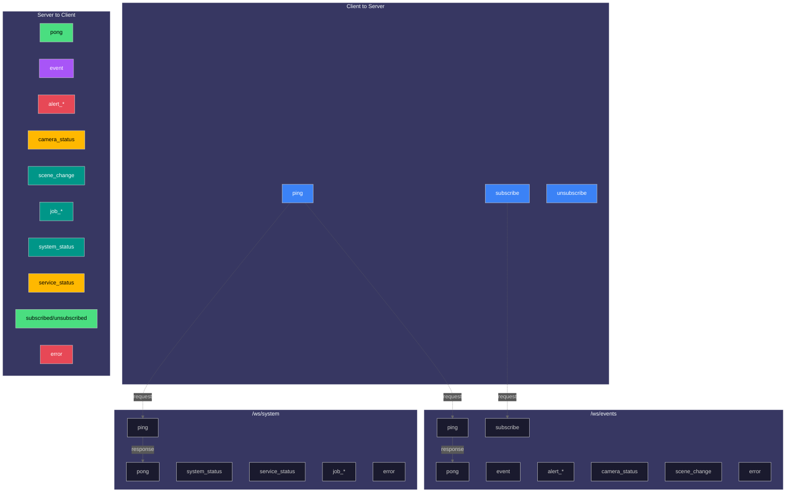

# Real-time API

This guide covers WebSocket endpoints for streaming security events and system status updates in real-time.

## WebSocket Architecture Overview



## Overview

The system provides WebSocket endpoints for real-time push communication and an SSE endpoint for streaming LLM analysis:

| Protocol | Endpoint                                | Description                     |
| -------- | --------------------------------------- | ------------------------------- |
| WS       | `/ws/events`                            | Security event stream           |
| WS       | `/ws/system`                            | System status stream            |
| WS       | `/ws/detections`                        | Real-time AI detection stream   |
| WS       | `/ws/jobs/{job_id}/logs`                | Job log streaming               |
| SSE      | `/api/events/analyze/{batch_id}/stream` | LLM analysis progress streaming |

Additionally, REST endpoints are available for WebSocket monitoring:

| Method | Endpoint                           | Description                      |
| ------ | ---------------------------------- | -------------------------------- |
| GET    | `/api/system/health/websocket`     | WebSocket broadcaster health     |
| GET    | `/api/system/websocket/events`     | Event type registry              |
| GET    | `/api/debug/websocket/connections` | Active connection states (debug) |

WebSocket connections enable the frontend to receive push notifications without polling, reducing latency and server load.

---

## Authentication

Two authentication methods are available (both optional, can be used together):

### 1. API Key Authentication

When `API_KEY_ENABLED=true`, provide the API key via:

**Query Parameter (recommended):**

```
ws://localhost:8000/ws/events?api_key=YOUR_KEY
```

**WebSocket Protocol Header:**

```javascript
const ws = new WebSocket('ws://localhost:8000/ws/events', ['api-key.YOUR_KEY']);
```

### 2. Token Authentication

When `WEBSOCKET_TOKEN` is configured, provide the token via query parameter:

```
ws://localhost:8000/ws/events?token=YOUR_TOKEN
```

**JavaScript Example:**

```javascript
// With token authentication:
const ws = new WebSocket('ws://localhost:8000/ws/events?token=YOUR_TOKEN');
// Or with API key authentication:
const ws = new WebSocket('ws://localhost:8000/ws/events?api_key=YOUR_KEY');
```

---

## Events Stream

Stream security events as they are detected and analyzed.

**Endpoint:** `ws://localhost:8000/ws/events`

### Connection Lifecycle

1. **Connect** - Client initiates WebSocket handshake
2. **Authenticate** - Server validates API key (if enabled)
3. **Register** - Client added to broadcaster subscription list
4. **Stream** - Server pushes events as they occur
5. **Keepalive** - Periodic pings maintain connection
6. **Close** - Idle timeout or client disconnect



### Server-Sent Messages

#### Event Message

Sent when a new security event is created:

```json
{
  "type": "event",
  "data": {
    "id": 1,
    "event_id": 1,
    "batch_id": "batch_abc123",
    "camera_id": "front_door",
    "risk_score": 75,
    "risk_level": "high",
    "summary": "Person detected at front door",
    "started_at": "2025-12-23T12:00:00"
  }
}
```

**Event Data Fields:**

| Field        | Type    | Description                            |
| ------------ | ------- | -------------------------------------- |
| `id`         | integer | Unique event identifier                |
| `event_id`   | integer | Legacy alias (backward compatibility)  |
| `batch_id`   | string  | Detection batch identifier             |
| `camera_id`  | string  | Camera that captured the event         |
| `risk_score` | integer | Risk assessment score (0-100)          |
| `risk_level` | string  | `low`, `medium`, `high`, or `critical` |
| `summary`    | string  | Human-readable event description       |
| `started_at` | string  | ISO 8601 timestamp                     |

#### Server Heartbeat

Sent every 30 seconds to keep connection alive:

```json
{ "type": "ping" }
```

### Client-Sent Messages

#### Ping (Keep-Alive)

Send to reset idle timeout and confirm connectivity:

```json
{ "type": "ping" }
```

**Server Response:**

```json
{ "type": "pong" }
```

#### Legacy Ping Format

For backward compatibility, plain text pings are also accepted:

```
ping
```

### Event Filtering (Subscriptions)

Clients can subscribe to specific event patterns to reduce bandwidth and receive only relevant events. By default, new connections receive all events.

#### Subscribe Message

Send to subscribe to specific event patterns:

```json
{
  "type": "subscribe",
  "data": {
    "events": ["alert.*", "camera.status_changed", "event.created"]
  }
}
```

**Server Response:**

```json
{
  "action": "subscribed",
  "events": ["alert.*", "camera.status_changed", "event.created"]
}
```

#### Unsubscribe Message

Send to unsubscribe from specific patterns (or all if no patterns specified):

```json
{
  "type": "unsubscribe",
  "data": {
    "events": ["alert.*"]
  }
}
```

**Server Response:**

```json
{
  "action": "unsubscribed",
  "events": ["alert.*"]
}
```

#### Pattern Syntax

| Pattern                 | Description                    |
| ----------------------- | ------------------------------ |
| `*`                     | All events (default)           |
| `alert.*`               | All alert events               |
| `camera.*`              | All camera events              |
| `event.*`               | All security event events      |
| `job.*`                 | All background job events      |
| `system.*`              | All system events              |
| `camera.status_changed` | Exact match for specific event |

### Error Messages

Sent when client message validation fails:

```json
{
  "type": "error",
  "error": "invalid_json",
  "message": "Message must be valid JSON",
  "details": { "raw_data_preview": "invalid{json" }
}
```

**Error Codes:**

| Code                     | Description               |
| ------------------------ | ------------------------- |
| `invalid_json`           | Message is not valid JSON |
| `invalid_message_format` | Message schema invalid    |
| `unknown_message_type`   | Unrecognized message type |
| `validation_error`       | Schema validation failed  |

### Event Streaming Flow

The following diagram shows how security events flow from the AI pipeline through the WebSocket to connected clients:



### JavaScript Example

```javascript
class EventsWebSocket {
  constructor(apiKey) {
    this.url = `ws://localhost:8000/ws/events?api_key=${apiKey}`;
    this.reconnectDelay = 1000;
    this.maxDelay = 30000;
    this.connect();
  }

  connect() {
    this.ws = new WebSocket(this.url);

    this.ws.onopen = () => {
      console.log('Connected to event stream');
      this.reconnectDelay = 1000; // Reset on success

      // Send keepalive every 60 seconds
      this.pingInterval = setInterval(() => {
        if (this.ws.readyState === WebSocket.OPEN) {
          this.ws.send(JSON.stringify({ type: 'ping' }));
        }
      }, 60000);
    };

    this.ws.onmessage = (event) => {
      const data = JSON.parse(event.data);

      switch (data.type) {
        case 'event':
          this.handleEvent(data.data);
          break;
        case 'pong':
          console.debug('Keepalive acknowledged');
          break;
        case 'error':
          console.error('WebSocket error:', data.message);
          break;
      }
    };

    this.ws.onclose = (event) => {
      clearInterval(this.pingInterval);

      if (event.code !== 1000) {
        console.log(`Reconnecting in ${this.reconnectDelay}ms...`);
        setTimeout(() => this.connect(), this.reconnectDelay);
        this.reconnectDelay = Math.min(this.reconnectDelay * 2, this.maxDelay);
      }
    };

    this.ws.onerror = (error) => {
      console.error('WebSocket error:', error);
    };
  }

  handleEvent(event) {
    console.log('New security event:', event);
    // Update UI, show notification, etc.
  }

  close() {
    clearInterval(this.pingInterval);
    if (this.ws) {
      this.ws.close(1000, 'Client disconnect');
    }
  }
}

// Usage
const eventsWs = new EventsWebSocket('your-api-key');
```

---

## System Stream

Stream real-time system status including GPU metrics, queue status, and service health.

**Endpoint:** `ws://localhost:8000/ws/system`

### Server-Sent Messages

#### System Status Message

Sent periodically with current system metrics:

```json
{
  "type": "system_status",
  "data": {
    "gpu": {
      "utilization": 45.5,
      "memory_used": 8192,
      "memory_total": 24576,
      "temperature": 65.0,
      "inference_fps": 30.5
    },
    "cameras": {
      "active": 4,
      "total": 6
    },
    "queue": {
      "pending": 2,
      "processing": 1
    },
    "health": "healthy"
  },
  "timestamp": "2025-12-23T10:30:00.000Z"
}
```

**System Data Fields:**

| Field               | Type    | Description                        |
| ------------------- | ------- | ---------------------------------- |
| `gpu.utilization`   | float   | GPU utilization percentage         |
| `gpu.memory_used`   | integer | GPU memory used (MB)               |
| `gpu.memory_total`  | integer | Total GPU memory (MB)              |
| `gpu.temperature`   | float   | GPU temperature (Celsius)          |
| `gpu.inference_fps` | float   | Inference frames per second        |
| `cameras.active`    | integer | Number of active cameras           |
| `cameras.total`     | integer | Total configured cameras           |
| `queue.pending`     | integer | Items pending in queue             |
| `queue.processing`  | integer | Items currently processing         |
| `health`            | string  | `healthy`, `degraded`, `unhealthy` |

#### Service Status Message

Sent when a service status changes:

```json
{
  "type": "service_status",
  "data": {
    "service": "redis",
    "status": "healthy",
    "message": "Service responding normally"
  },
  "timestamp": "2025-12-23T12:00:00.000Z"
}
```

**Service Status Values:**

| Status           | Description                    |
| ---------------- | ------------------------------ |
| `healthy`        | Service operating normally     |
| `unhealthy`      | Service down or not responding |
| `restarting`     | Service restarting             |
| `restart_failed` | Restart attempt failed         |
| `failed`         | Service has failed             |

### JavaScript Example

```javascript
class SystemWebSocket {
  constructor(apiKey, callbacks) {
    this.url = `ws://localhost:8000/ws/system?api_key=${apiKey}`;
    this.callbacks = callbacks;
    this.connect();
  }

  connect() {
    this.ws = new WebSocket(this.url);

    this.ws.onmessage = (event) => {
      const data = JSON.parse(event.data);

      switch (data.type) {
        case 'system_status':
          this.callbacks.onSystemStatus?.(data.data, data.timestamp);
          break;
        case 'service_status':
          this.callbacks.onServiceStatus?.(data.data, data.timestamp);
          break;
        case 'pong':
          break;
      }
    };

    // Similar lifecycle handling as EventsWebSocket...
  }
}

// Usage
const systemWs = new SystemWebSocket('your-api-key', {
  onSystemStatus: (status, timestamp) => {
    updateGpuDashboard(status.gpu);
    updateQueueIndicator(status.queue);
    updateHealthBadge(status.health);
  },
  onServiceStatus: (status, timestamp) => {
    if (status.status !== 'healthy') {
      showServiceAlert(status.service, status.message);
    }
  },
});
```

---

## Detections Stream

Stream real-time AI detection events as they are processed by the YOLO26 pipeline. This endpoint provides lower-level detection data before event aggregation.

**Endpoint:** `ws://localhost:8000/ws/detections`

### Use Cases

- Real-time object detection visualization
- Live camera monitoring dashboards
- Custom detection filtering and alerting
- Integration with third-party analytics

### Connection Lifecycle

1. **Connect** - Client initiates WebSocket handshake
2. **Authenticate** - Server validates API key or token (if enabled)
3. **Auto-Subscribe** - Client automatically subscribed to `detection.*` events
4. **Stream** - Server pushes detection events as they occur
5. **Keepalive** - Periodic pings maintain connection
6. **Close** - Idle timeout or client disconnect

### Server-Sent Messages

#### Detection Event Message

Sent when a new AI detection is created:

```json
{
  "type": "detection",
  "seq": 42,
  "data": {
    "id": 12345,
    "camera_id": "front_door",
    "object_type": "person",
    "confidence": 0.95,
    "detected_at": "2026-01-15T10:30:00Z",
    "bbox_x": 100,
    "bbox_y": 150,
    "bbox_width": 200,
    "bbox_height": 400,
    "file_path": "/export/foscam/front_door/image.jpg",
    "thumbnail_path": "/data/thumbnails/12345_thumb.jpg"
  }
}
```

**Detection Data Fields:**

| Field            | Type    | Description                               |
| ---------------- | ------- | ----------------------------------------- |
| `id`             | integer | Unique detection identifier               |
| `camera_id`      | string  | Camera that captured the detection        |
| `object_type`    | string  | Detected object type (person, car, etc.)  |
| `confidence`     | float   | Detection confidence score (0.0-1.0)      |
| `detected_at`    | string  | ISO 8601 timestamp                        |
| `bbox_x`         | integer | Bounding box X coordinate                 |
| `bbox_y`         | integer | Bounding box Y coordinate                 |
| `bbox_width`     | integer | Bounding box width                        |
| `bbox_height`    | integer | Bounding box height                       |
| `file_path`      | string  | Path to source image                      |
| `thumbnail_path` | string  | Path to thumbnail (may be null initially) |

#### Batch Detection Message

Sent when multiple detections from a single frame are processed:

```json
{
  "type": "detection.batch",
  "seq": 43,
  "data": {
    "batch_id": "batch_abc123",
    "camera_id": "front_door",
    "detection_count": 3,
    "detection_ids": [12345, 12346, 12347],
    "timestamp": "2026-01-15T10:30:00Z"
  }
}
```

### Sequence Numbers

All messages include a `seq` field for message ordering and gap detection:

```json
{
  "type": "detection",
  "seq": 42,
  "data": {...}
}
```

Clients can detect missed messages by tracking sequence numbers. Server heartbeats include `lastSeq` for gap detection during idle periods.

### JavaScript Example

```javascript
class DetectionsWebSocket {
  constructor(apiKey, callbacks) {
    this.url = `ws://localhost:8000/ws/detections?api_key=${apiKey}`;
    this.callbacks = callbacks;
    this.lastSeq = 0;
    this.connect();
  }

  connect() {
    this.ws = new WebSocket(this.url);

    this.ws.onopen = () => {
      console.log('Connected to detections stream');
      // Auto-subscribed to detection.* events
    };

    this.ws.onmessage = (event) => {
      const data = JSON.parse(event.data);

      // Check for sequence gaps
      if (data.seq && data.seq > this.lastSeq + 1) {
        console.warn(`Sequence gap detected: expected ${this.lastSeq + 1}, got ${data.seq}`);
      }
      if (data.seq) {
        this.lastSeq = data.seq;
      }

      switch (data.type) {
        case 'detection':
          this.callbacks.onDetection?.(data.data);
          break;
        case 'detection.batch':
          this.callbacks.onBatch?.(data.data);
          break;
        case 'ping':
          // Server heartbeat - check lastSeq for gaps
          if (data.lastSeq && data.lastSeq > this.lastSeq) {
            console.warn('Missed messages during idle');
          }
          this.ws.send(JSON.stringify({ type: 'pong' }));
          break;
        case 'pong':
          break;
      }
    };

    // Similar reconnection handling as EventsWebSocket...
  }
}

// Usage
const detectionsWs = new DetectionsWebSocket('your-api-key', {
  onDetection: (detection) => {
    console.log(`New detection: ${detection.object_type} on ${detection.camera_id}`);
    updateLiveView(detection);
  },
  onBatch: (batch) => {
    console.log(`Batch ${batch.batch_id}: ${batch.detection_count} detections`);
  },
});
```

### React Hook Example

```typescript
import { useEffect, useState, useCallback } from 'react';

interface Detection {
  id: number;
  camera_id: string;
  object_type: string;
  confidence: number;
  detected_at: string;
  bbox_x: number;
  bbox_y: number;
  bbox_width: number;
  bbox_height: number;
}

export function useDetectionStream(apiKey: string) {
  const [detections, setDetections] = useState<Detection[]>([]);
  const [connected, setConnected] = useState(false);

  useEffect(() => {
    const ws = new WebSocket(`ws://localhost:8000/ws/detections?api_key=${apiKey}`);

    ws.onopen = () => setConnected(true);

    ws.onmessage = (event) => {
      const data = JSON.parse(event.data);
      if (data.type === 'detection') {
        setDetections((prev) => [data.data, ...prev].slice(0, 100));
      }
    };

    ws.onclose = () => setConnected(false);

    // Keepalive
    const pingInterval = setInterval(() => {
      if (ws.readyState === WebSocket.OPEN) {
        ws.send(JSON.stringify({ type: 'ping' }));
      }
    }, 60000);

    return () => {
      clearInterval(pingInterval);
      ws.close(1000);
    };
  }, [apiKey]);

  return { detections, connected };
}
```

---

## Job Logs Stream

Stream real-time log entries for active background jobs. This enables live progress monitoring for long-running operations like exports or video processing.

**Endpoint:** `ws://localhost:8000/ws/jobs/{job_id}/logs`

### Use Cases

- Real-time job progress monitoring
- Debugging job execution issues
- Building job status dashboards

### Server-Sent Messages

#### Log Message

Sent as log entries are generated:

```json
{
  "type": "log",
  "data": {
    "timestamp": "2026-01-17T10:32:05Z",
    "level": "INFO",
    "message": "Processing batch 2/3",
    "context": { "batch_id": "abc123" }
  }
}
```

**Log Data Fields:**

| Field       | Type   | Description                                      |
| ----------- | ------ | ------------------------------------------------ |
| `timestamp` | string | ISO 8601 timestamp                               |
| `level`     | string | Log level: `DEBUG`, `INFO`, `WARNING`, `ERROR`   |
| `message`   | string | Log message text                                 |
| `context`   | object | Additional context (optional, job-specific data) |

### Connection Behavior

- Connection closes automatically when job completes or fails
- Server sends periodic heartbeats to maintain connection
- Logs are streamed via Redis pub/sub channel `job:{job_id}:logs`

### JavaScript Example

```javascript
function streamJobLogs(jobId, apiKey, onLog) {
  const ws = new WebSocket(`ws://localhost:8000/ws/jobs/${jobId}/logs?api_key=${apiKey}`);

  ws.onmessage = (event) => {
    const data = JSON.parse(event.data);
    if (data.type === 'log') {
      onLog(data.data);
    } else if (data.type === 'ping') {
      ws.send(JSON.stringify({ type: 'pong' }));
    }
  };

  ws.onclose = () => {
    console.log('Job logs stream closed');
  };

  return ws;
}

// Usage
const ws = streamJobLogs('job-uuid', 'your-api-key', (log) => {
  console.log(`[${log.level}] ${log.message}`);
});
```

---

## Connection Settings

| Setting                           | Default | Description                        |
| --------------------------------- | ------- | ---------------------------------- |
| `websocket_idle_timeout_seconds`  | 300     | Close after N seconds without ping |
| `websocket_ping_interval_seconds` | 30      | Server heartbeat interval          |

### Close Codes

| Code | Reason                                     |
| ---- | ------------------------------------------ |
| 1000 | Normal close (idle timeout, client close)  |
| 1008 | Policy violation (auth failed, rate limit) |

---

## Rate Limiting

WebSocket connections are rate-limited to prevent abuse:

- Connection attempts are throttled per IP address
- Excessive connections result in close code 1008
- Message rate within connections may also be limited

---

## Reconnection Strategy

The following diagram illustrates the exponential backoff reconnection strategy:


**Reconnection Parameters:**

| Parameter       | Default  | Description                        |
| --------------- | -------- | ---------------------------------- |
| `initialDelay`  | 1000ms   | First reconnection delay           |
| `maxDelay`      | 30000ms  | Maximum delay between attempts     |
| `maxAttempts`   | Infinity | Maximum reconnection attempts      |
| `backoffFactor` | 2        | Multiplier for exponential backoff |

Implement exponential backoff for reliable reconnection:

```javascript
class ReconnectingWebSocket {
  constructor(url, options = {}) {
    this.url = url;
    this.reconnectDelay = options.initialDelay || 1000;
    this.maxDelay = options.maxDelay || 30000;
    this.maxAttempts = options.maxAttempts || Infinity;
    this.attempts = 0;
    this.onMessage = options.onMessage;
    this.connect();
  }

  connect() {
    this.ws = new WebSocket(this.url);

    this.ws.onopen = () => {
      console.log('WebSocket connected');
      this.reconnectDelay = 1000;
      this.attempts = 0;
    };

    this.ws.onmessage = (event) => {
      if (this.onMessage) {
        this.onMessage(JSON.parse(event.data));
      }
    };

    this.ws.onclose = (event) => {
      if (event.code !== 1000 && this.attempts < this.maxAttempts) {
        this.attempts++;
        const delay = Math.min(this.reconnectDelay * Math.pow(2, this.attempts - 1), this.maxDelay);
        console.log(`Reconnecting in ${delay}ms (attempt ${this.attempts})...`);
        setTimeout(() => this.connect(), delay);
      }
    };

    this.ws.onerror = (error) => {
      console.error('WebSocket error:', error);
    };
  }

  send(message) {
    if (this.ws.readyState === WebSocket.OPEN) {
      this.ws.send(JSON.stringify(message));
    }
  }

  close() {
    this.maxAttempts = 0; // Prevent reconnection
    if (this.ws) {
      this.ws.close(1000, 'Client disconnect');
    }
  }
}
```

---

## Message Schema Reference

### Message Type Relationships



### Client-to-Server Messages

**WebSocketMessage (Base):**

| Field  | Type   | Required | Description               |
| ------ | ------ | -------- | ------------------------- |
| `type` | string | Yes      | Message type (1-50 chars) |
| `data` | object | No       | Optional payload          |

**WebSocketPingMessage:**

```json
{ "type": "ping" }
```

**WebSocketSubscribeMessage:**

```json
{
  "type": "subscribe",
  "data": {
    "events": ["alert.*", "camera.status_changed"]
  }
}
```

**WebSocketUnsubscribeMessage:**

```json
{
  "type": "unsubscribe",
  "data": {
    "events": ["alert.*"]
  }
}
```

### Server-to-Client Messages

**WebSocketPongResponse:**

```json
{ "type": "pong" }
```

**WebSocketEventMessage:**

| Field  | Type   | Description      |
| ------ | ------ | ---------------- |
| `type` | string | Always `"event"` |
| `data` | object | Event payload    |

**WebSocketSystemStatusMessage:**

| Field       | Type   | Description              |
| ----------- | ------ | ------------------------ |
| `type`      | string | Always `"system_status"` |
| `data`      | object | System status payload    |
| `timestamp` | string | ISO 8601 timestamp       |

**WebSocketServiceStatusMessage:**

| Field       | Type   | Description               |
| ----------- | ------ | ------------------------- |
| `type`      | string | Always `"service_status"` |
| `data`      | object | Service status payload    |
| `timestamp` | string | ISO 8601 timestamp        |

**WebSocketErrorResponse:**

| Field     | Type   | Description                |
| --------- | ------ | -------------------------- |
| `type`    | string | Always `"error"`           |
| `error`   | string | Error code                 |
| `message` | string | Human-readable description |
| `details` | object | Additional context         |

**WebSocketSubscriptionResponse:**

| Field    | Type     | Description                        |
| -------- | -------- | ---------------------------------- |
| `action` | string   | `"subscribed"` or `"unsubscribed"` |
| `events` | string[] | List of affected event patterns    |

**WebSocketCameraStatusMessage:**

| Field  | Type   | Description              |
| ------ | ------ | ------------------------ |
| `type` | string | Always `"camera_status"` |
| `data` | object | Camera status payload    |

**WebSocketAlertMessage:**

| Field  | Type   | Description                                                    |
| ------ | ------ | -------------------------------------------------------------- |
| `type` | string | `"alert_created"`, `"alert_acknowledged"`, `"alert_dismissed"` |
| `data` | object | Alert data payload                                             |

**WebSocketSceneChangeMessage:**

| Field  | Type   | Description             |
| ------ | ------ | ----------------------- |
| `type` | string | Always `"scene_change"` |
| `data` | object | Scene change payload    |

**WebSocketJobMessage:**

| Field  | Type   | Description                                         |
| ------ | ------ | --------------------------------------------------- |
| `type` | string | `"job_progress"`, `"job_completed"`, `"job_failed"` |
| `data` | object | Job data payload                                    |

---

## React Hook Example

```typescript
import { useEffect, useState, useCallback } from 'react';

interface SecurityEvent {
  id: number;
  camera_id: string;
  risk_score: number;
  risk_level: string;
  summary: string;
  started_at: string;
}

export function useEventStream(apiKey: string) {
  const [events, setEvents] = useState<SecurityEvent[]>([]);
  const [connected, setConnected] = useState(false);
  const [error, setError] = useState<string | null>(null);

  useEffect(() => {
    const ws = new WebSocket(`ws://localhost:8000/ws/events?api_key=${apiKey}`);

    ws.onopen = () => {
      setConnected(true);
      setError(null);
    };

    ws.onmessage = (event) => {
      const data = JSON.parse(event.data);
      if (data.type === 'event') {
        setEvents((prev) => [data.data, ...prev].slice(0, 100));
      }
    };

    ws.onclose = () => setConnected(false);
    ws.onerror = () => setError('Connection failed');

    // Keepalive
    const pingInterval = setInterval(() => {
      if (ws.readyState === WebSocket.OPEN) {
        ws.send(JSON.stringify({ type: 'ping' }));
      }
    }, 60000);

    return () => {
      clearInterval(pingInterval);
      ws.close(1000);
    };
  }, [apiKey]);

  return { events, connected, error };
}
```

---

## Additional Message Types

Beyond the core `event` and `system_status` messages, the WebSocket endpoints support additional message types for different domains.

### Camera Status Message

Broadcast when a camera's status changes:

```json
{
  "type": "camera_status",
  "data": {
    "event_type": "camera.offline",
    "camera_id": "front_door",
    "camera_name": "Front Door Camera",
    "status": "offline",
    "timestamp": "2026-01-09T10:30:00Z",
    "previous_status": "online",
    "reason": "No activity detected for 5 minutes",
    "details": null
  }
}
```

**Camera Event Types:**

| Event Type       | Description                  |
| ---------------- | ---------------------------- |
| `camera.online`  | Camera came online           |
| `camera.offline` | Camera went offline          |
| `camera.error`   | Camera encountered an error  |
| `camera.updated` | Camera configuration updated |

### Alert Messages

Broadcast when alerts are created or their state changes:

**Alert Created:**

```json
{
  "type": "alert_created",
  "data": {
    "id": "550e8400-e29b-41d4-a716-446655440000",
    "event_id": 123,
    "rule_id": "550e8400-e29b-41d4-a716-446655440001",
    "severity": "high",
    "status": "pending",
    "dedup_key": "front_door:person:rule1",
    "created_at": "2026-01-09T12:00:00Z",
    "updated_at": "2026-01-09T12:00:00Z"
  }
}
```

**Alert Acknowledged:**

```json
{
  "type": "alert_acknowledged",
  "data": {
    "id": "550e8400-e29b-41d4-a716-446655440000",
    "event_id": 123,
    "severity": "high",
    "status": "acknowledged",
    "created_at": "2026-01-09T12:00:00Z",
    "updated_at": "2026-01-09T12:01:00Z"
  }
}
```

**Alert Dismissed:**

```json
{
  "type": "alert_dismissed",
  "data": {
    "id": "550e8400-e29b-41d4-a716-446655440000",
    "event_id": 123,
    "severity": "high",
    "status": "dismissed",
    "created_at": "2026-01-09T12:00:00Z",
    "updated_at": "2026-01-09T12:02:00Z"
  }
}
```

### Scene Change Message

Broadcast when a camera view change is detected (potential tampering):

```json
{
  "type": "scene_change",
  "data": {
    "id": 1,
    "camera_id": "front_door",
    "detected_at": "2026-01-03T10:30:00Z",
    "change_type": "view_blocked",
    "similarity_score": 0.23
  }
}
```

**Change Types:**

| Type            | Description                        |
| --------------- | ---------------------------------- |
| `view_blocked`  | Camera view is obstructed          |
| `angle_changed` | Camera angle has shifted           |
| `view_tampered` | Potential intentional interference |
| `unknown`       | Unclassified scene change          |

### Job Progress Messages

Broadcast for background job lifecycle events:

**Job Progress:**

```json
{
  "type": "job_progress",
  "data": {
    "job_id": "550e8400-e29b-41d4-a716-446655440000",
    "job_type": "export",
    "progress": 50,
    "status": "running"
  }
}
```

**Job Completed:**

```json
{
  "type": "job_completed",
  "data": {
    "job_id": "550e8400-e29b-41d4-a716-446655440000",
    "job_type": "export",
    "result": { "file_path": "/exports/events_2026-01-09.json" }
  }
}
```

**Job Failed:**

```json
{
  "type": "job_failed",
  "data": {
    "job_id": "550e8400-e29b-41d4-a716-446655440000",
    "job_type": "export",
    "error": "Database connection failed"
  }
}
```

---

## Server-Sent Events (SSE) Streaming

### Analyze Batch Streaming

Stream LLM analysis progress for a batch via Server-Sent Events (SSE). This endpoint provides progressive LLM response updates during long inference times, allowing the frontend to display partial results and typing indicators.

**Endpoint:** `GET /api/events/analyze/{batch_id}/stream`

**Content-Type:** `text/event-stream`

#### Parameters

| Parameter       | Type   | In    | Required | Description                              |
| --------------- | ------ | ----- | -------- | ---------------------------------------- |
| `batch_id`      | string | path  | Yes      | Batch identifier to analyze              |
| `camera_id`     | string | query | No       | Camera ID (uses Redis lookup if omitted) |
| `detection_ids` | string | query | No       | Comma-separated detection IDs            |

#### SSE Event Types

**Progress Event:**

Sent during LLM inference with partial response:

```
data: {"event_type": "progress", "content": "Based on", "accumulated_text": "Based on"}

data: {"event_type": "progress", "content": " the", "accumulated_text": "Based on the"}

data: {"event_type": "progress", "content": " detected", "accumulated_text": "Based on the detected"}
```

**Complete Event:**

Sent when analysis completes with final results:

```
data: {"event_type": "complete", "event_id": 123, "risk_score": 75, "risk_level": "high", "summary": "Person detected at entrance", "reasoning": "..."}
```

**Error Event:**

Sent if analysis fails:

```
data: {"event_type": "error", "error_code": "inference_failed", "message": "LLM inference timeout", "recoverable": true}
```

#### JavaScript Example

```javascript
const eventSource = new EventSource(`/api/events/analyze/${batchId}/stream?camera_id=${cameraId}`);

let accumulatedText = '';

eventSource.onmessage = (event) => {
  const data = JSON.parse(event.data);

  switch (data.event_type) {
    case 'progress':
      accumulatedText = data.accumulated_text;
      updateTypingIndicator(accumulatedText);
      break;
    case 'complete':
      hideTypingIndicator();
      displayFinalResult(data);
      eventSource.close();
      break;
    case 'error':
      showError(data.message);
      if (!data.recoverable) {
        eventSource.close();
      }
      break;
  }
};

eventSource.onerror = () => {
  console.error('SSE connection error');
  eventSource.close();
};
```

---

## WebSocket Monitoring REST Endpoints

These REST endpoints provide information about WebSocket infrastructure health and available event types.

### Get WebSocket Health

Check the health status of WebSocket broadcasters.

**Endpoint:** `GET /api/system/health/websocket`

**Response:**

```json
{
  "event_broadcaster": {
    "state": "closed",
    "failure_count": 0,
    "is_degraded": false
  },
  "system_broadcaster": {
    "state": "closed",
    "failure_count": 0,
    "is_degraded": false
  },
  "timestamp": "2025-12-30T10:30:00Z"
}
```

**Circuit Breaker States:**

| State       | Description                             |
| ----------- | --------------------------------------- |
| `closed`    | Normal operation, connections accepted  |
| `open`      | Circuit open due to failures, rejecting |
| `half_open` | Testing recovery, limited connections   |

### List WebSocket Event Types

Get the complete registry of available WebSocket event types.

**Endpoint:** `GET /api/system/websocket/events`

**Response:**

```json
{
  "event_types": [
    {
      "type": "alert.created",
      "description": "New alert generated from a security event",
      "channel": "alerts",
      "payload_schema": {...},
      "example": {...},
      "deprecated": false,
      "replacement": null
    },
    {
      "type": "camera.status_changed",
      "description": "Camera status change (online/offline/error)",
      "channel": "cameras",
      "payload_schema": {...},
      "example": {...},
      "deprecated": false,
      "replacement": null
    }
  ],
  "channels": ["alerts", "cameras", "detections", "events", "jobs", "system"],
  "total_count": 25,
  "deprecated_count": 3
}
```

### Get WebSocket Connections (Debug)

Get active WebSocket connection states for diagnostics. Only available when debug mode is enabled.

**Endpoint:** `GET /api/debug/websocket/connections`

**Response:**

```json
{
  "event_broadcaster": {
    "connection_count": 3,
    "state": "closed",
    "failure_count": 0,
    "is_degraded": false
  },
  "system_broadcaster": {
    "connection_count": 2,
    "state": "closed",
    "failure_count": 0,
    "is_degraded": false
  },
  "timestamp": "2026-01-09T10:30:00Z"
}
```

---

## Event Type Registry

The system supports a comprehensive set of WebSocket event types organized by domain.

### Event Domains

| Domain      | Channel      | Description                           |
| ----------- | ------------ | ------------------------------------- |
| `alert`     | `alerts`     | Alert notifications and state changes |
| `camera`    | `cameras`    | Camera status and configuration       |
| `detection` | `detections` | Raw AI detection results              |
| `event`     | `events`     | Security event lifecycle              |
| `job`       | `jobs`       | Background job lifecycle              |
| `system`    | `system`     | System health and monitoring          |

### Complete Event Type List

| Event Type               | Description                                 |
| ------------------------ | ------------------------------------------- |
| `alert.created`          | New alert triggered from rule evaluation    |
| `alert.updated`          | Alert modified (metadata, channels updated) |
| `alert.acknowledged`     | Alert marked as seen by user                |
| `alert.resolved`         | Alert resolved/closed                       |
| `alert.dismissed`        | Alert dismissed by user                     |
| `camera.online`          | Camera came online and is streaming         |
| `camera.offline`         | Camera went offline                         |
| `camera.status_changed`  | Camera status changed                       |
| `camera.enabled`         | Camera enabled for monitoring               |
| `camera.disabled`        | Camera disabled from monitoring             |
| `camera.error`           | Camera encountered an error                 |
| `camera.config_updated`  | Camera configuration was updated            |
| `detection.new`          | New detection from AI pipeline              |
| `detection.batch`        | Batch of detections from a frame            |
| `event.created`          | New security event created after analysis   |
| `event.updated`          | Existing security event updated             |
| `event.deleted`          | Security event deleted                      |
| `job.started`            | Background job started                      |
| `job.progress`           | Background job progress update              |
| `job.completed`          | Background job completed                    |
| `job.failed`             | Background job failed                       |
| `job.cancelled`          | Background job cancelled                    |
| `system.health_changed`  | System health status changed                |
| `system.status`          | Periodic system status update               |
| `service.status_changed` | Individual service status changed           |
| `gpu.stats_updated`      | GPU statistics updated                      |
| `scene_change.detected`  | Camera scene change detected                |

---

## Related Documentation

- [Core Resources API](core-resources.md) - Events REST endpoints
- [System Operations API](system-ops.md) - System status REST endpoints
- [AI Pipeline API](ai-pipeline.md) - Pipeline monitoring
