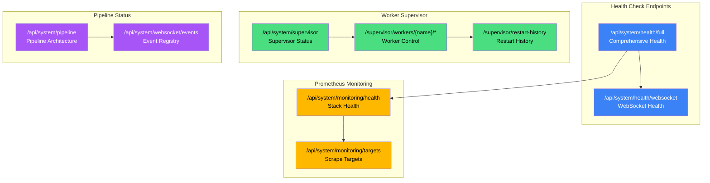

# System Monitoring API

This guide covers advanced system monitoring endpoints for health checks, worker supervision, pipeline status, and Prometheus integration.

**Total Endpoints: 16** (Monitoring: 2, Supervisor: 6, Pipeline: 2, WebSocket Registry: 1, Performance: 2, Full Health: 1, Circuit Breakers: 2)

## System Monitoring Overview

The following diagram illustrates the key system monitoring components and their relationships:

<details>
<summary>Mermaid source (click to expand)</summary>



</details>

---

## Prometheus Monitoring

Monitor the health of the Prometheus monitoring stack and scrape targets.

### Endpoints

| Method | Endpoint                         | Description                     |
| ------ | -------------------------------- | ------------------------------- |
| GET    | `/api/system/monitoring/health`  | Monitoring stack health status  |
| GET    | `/api/system/monitoring/targets` | Prometheus scrape target status |

### Monitoring Stack Health

Get comprehensive health status of the monitoring infrastructure:

```bash
GET /api/system/monitoring/health
```

**Response:**

```json
{
  "healthy": true,
  "prometheus_reachable": true,
  "prometheus_url": "http://prometheus:9090",
  "targets_summary": [
    {
      "job": "backend",
      "total": 1,
      "up": 1,
      "down": 0,
      "unknown": 0
    },
    {
      "job": "redis-exporter",
      "total": 1,
      "up": 1,
      "down": 0,
      "unknown": 0
    }
  ],
  "exporters": [
    {
      "name": "redis-exporter",
      "status": "up",
      "endpoint": "redis-exporter:9121",
      "last_scrape": "2025-12-27T10:30:00Z",
      "error": null
    },
    {
      "name": "json-exporter",
      "status": "up",
      "endpoint": "json-exporter:7979",
      "last_scrape": "2025-12-27T10:30:00Z",
      "error": null
    },
    {
      "name": "blackbox-exporter",
      "status": "up",
      "endpoint": "blackbox-exporter:9115",
      "last_scrape": "2025-12-27T10:30:00Z",
      "error": null
    }
  ],
  "metrics_collection": {
    "collecting": true,
    "last_successful_scrape": "2025-12-27T10:30:00Z",
    "scrape_interval_seconds": 15,
    "total_series": 15000
  },
  "issues": [],
  "timestamp": "2025-12-27T10:30:00Z"
}
```

**Health Determination:**

| Condition                                   | Result                         |
| ------------------------------------------- | ------------------------------ |
| Prometheus reachable, no targets down       | `healthy: true`                |
| Prometheus reachable, some targets down     | `healthy: true` (if up > down) |
| Prometheus reachable, majority targets down | `healthy: false`               |
| Prometheus unreachable                      | `healthy: false`               |

**Known Exporters Tracked:**

| Exporter          | Default Endpoint       | Description            |
| ----------------- | ---------------------- | ---------------------- |
| redis-exporter    | redis-exporter:9121    | Redis metrics          |
| json-exporter     | json-exporter:7979     | JSON endpoint metrics  |
| blackbox-exporter | blackbox-exporter:9115 | Probe-based monitoring |

### Prometheus Scrape Targets

Get detailed status of all Prometheus scrape targets:

```bash
GET /api/system/monitoring/targets
```

**Response:** `200 OK` or `503 Service Unavailable` (if Prometheus unreachable)

```json
{
  "targets": [
    {
      "job": "backend",
      "instance": "backend:8000",
      "health": "up",
      "labels": {
        "job": "backend",
        "instance": "backend:8000"
      },
      "last_scrape": "2025-12-27T10:30:00Z",
      "last_error": null,
      "scrape_duration_seconds": 0.045
    },
    {
      "job": "redis-exporter",
      "instance": "redis-exporter:9121",
      "health": "up",
      "labels": {
        "job": "redis-exporter",
        "instance": "redis-exporter:9121"
      },
      "last_scrape": "2025-12-27T10:30:00Z",
      "last_error": null,
      "scrape_duration_seconds": 0.012
    }
  ],
  "total": 5,
  "up": 5,
  "down": 0,
  "jobs": ["backend", "redis-exporter", "json-exporter", "blackbox-exporter", "prometheus"],
  "timestamp": "2025-12-27T10:30:00Z"
}
```

**Target Health Values:**

| Health    | Description                          |
| --------- | ------------------------------------ |
| `up`      | Target is healthy, scrape successful |
| `down`    | Target is unhealthy, scrape failed   |
| `unknown` | Target status cannot be determined   |

---

## Worker Supervisor

The Worker Supervisor monitors background worker tasks and automatically restarts them with exponential backoff when they crash.

### Endpoints

| Method | Endpoint                                        | Description                 |
| ------ | ----------------------------------------------- | --------------------------- |
| GET    | `/api/system/supervisor`                        | Get supervisor status       |
| GET    | `/api/system/supervisor/status`                 | Alias for supervisor status |
| POST   | `/api/system/supervisor/workers/{name}/start`   | Start a stopped worker      |
| POST   | `/api/system/supervisor/workers/{name}/stop`    | Stop a running worker       |
| POST   | `/api/system/supervisor/workers/{name}/restart` | Restart a worker            |
| POST   | `/api/system/supervisor/reset/{name}`           | Reset worker restart count  |
| GET    | `/api/system/supervisor/restart-history`        | Get restart history         |

### Get Supervisor Status

Get status of the Worker Supervisor and all supervised workers:

```bash
GET /api/system/supervisor
```

**Response:**

```json
{
  "running": true,
  "worker_count": 4,
  "workers": [
    {
      "name": "file_watcher",
      "status": "running",
      "restart_count": 0,
      "max_restarts": 5,
      "last_started_at": "2025-12-27T08:00:00Z",
      "last_crashed_at": null,
      "error": null
    },
    {
      "name": "detection_worker",
      "status": "running",
      "restart_count": 1,
      "max_restarts": 5,
      "last_started_at": "2025-12-27T09:15:00Z",
      "last_crashed_at": "2025-12-27T09:14:55Z",
      "error": "Connection reset by peer"
    },
    {
      "name": "analysis_worker",
      "status": "running",
      "restart_count": 0,
      "max_restarts": 5,
      "last_started_at": "2025-12-27T08:00:00Z",
      "last_crashed_at": null,
      "error": null
    },
    {
      "name": "cleanup_service",
      "status": "running",
      "restart_count": 0,
      "max_restarts": 5,
      "last_started_at": "2025-12-27T08:00:00Z",
      "last_crashed_at": null,
      "error": null
    }
  ],
  "timestamp": "2025-12-27T10:30:00Z"
}
```

**Worker Status Values:**

| Status       | Description                        |
| ------------ | ---------------------------------- |
| `running`    | Worker is actively processing      |
| `stopped`    | Worker is stopped (can be started) |
| `crashed`    | Worker crashed, pending restart    |
| `restarting` | Worker is being restarted          |
| `failed`     | Worker exceeded max restart limit  |

### Start Worker

Start a stopped or failed worker:

```bash
POST /api/system/supervisor/workers/file_watcher/start
```

**Response:** `200 OK`, `400 Bad Request`, `404 Not Found`, or `503 Service Unavailable`

```json
{
  "success": true,
  "message": "Worker 'file_watcher' started successfully",
  "worker_name": "file_watcher"
}
```

### Stop Worker

Stop a running worker:

```bash
POST /api/system/supervisor/workers/file_watcher/stop
```

**Response:** `200 OK`, `400 Bad Request`, `404 Not Found`, or `503 Service Unavailable`

```json
{
  "success": true,
  "message": "Worker 'file_watcher' stopped successfully",
  "worker_name": "file_watcher"
}
```

### Restart Worker

Restart a worker (stops if running, then starts):

```bash
POST /api/system/supervisor/workers/file_watcher/restart
```

**Response:** `200 OK`, `400 Bad Request`, `404 Not Found`, or `503 Service Unavailable`

```json
{
  "success": true,
  "message": "Worker 'file_watcher' restarted successfully",
  "worker_name": "file_watcher"
}
```

### Reset Worker

Reset a failed worker's restart count to allow new restart attempts:

```bash
POST /api/system/supervisor/reset/detection_worker
```

**Response:** `200 OK`, `404 Not Found`, or `503 Service Unavailable`

```json
{
  "success": true,
  "message": "Worker 'detection_worker' restart count reset"
}
```

**When to Use:**

When a worker exceeds its `max_restarts` limit, it enters `failed` status and won't be automatically restarted. Use this endpoint to reset the counter and allow the supervisor to attempt restarts again after fixing the underlying issue.

### Worker Name Validation

Worker names must:

- Start with a letter (a-z, A-Z)
- Contain only alphanumeric characters and underscores
- Match the pattern: `^[a-zA-Z][a-zA-Z0-9_]*$`

Invalid names return `400 Bad Request`.

### Get Restart History

Get paginated history of worker restart events:

```bash
GET /api/system/supervisor/restart-history?worker_name=detection_worker&limit=50&offset=0
```

**Parameters:**

| Name        | Type    | Default | Description                      |
| ----------- | ------- | ------- | -------------------------------- |
| worker_name | string  | null    | Filter by worker name (optional) |
| limit       | integer | 50      | Max events to return (1-100)     |
| offset      | integer | 0       | Number of events to skip         |

**Response:**

```json
{
  "items": [
    {
      "worker_name": "detection_worker",
      "timestamp": "2025-12-27T09:15:00Z",
      "attempt": 1,
      "status": "success",
      "error": null
    },
    {
      "worker_name": "detection_worker",
      "timestamp": "2025-12-27T09:14:55Z",
      "attempt": 0,
      "status": "crashed",
      "error": "Connection reset by peer"
    }
  ],
  "pagination": {
    "total": 2,
    "limit": 50,
    "offset": 0,
    "items_count": 2,
    "has_more": false
  }
}
```

**Restart Event Status Values:**

| Status    | Description                       |
| --------- | --------------------------------- |
| `success` | Worker was successfully restarted |
| `crashed` | Worker crashed (before restart)   |
| `failed`  | Restart attempt failed            |
| `manual`  | Manual restart via API            |

---

## Pipeline Status

Monitor the AI processing pipeline components.

### Endpoints

| Method | Endpoint                       | Description                  |
| ------ | ------------------------------ | ---------------------------- |
| GET    | `/api/system/pipeline`         | Pipeline architecture status |
| GET    | `/api/system/websocket/events` | WebSocket event registry     |

### Get Pipeline Status

Get combined status of all pipeline operations:

```bash
GET /api/system/pipeline
```

**Response:**

```json
{
  "file_watcher": {
    "running": true,
    "camera_root": "/export/foscam",
    "pending_tasks": 3,
    "observer_type": "native"
  },
  "batch_aggregator": {
    "active_batches": 2,
    "batches": [
      {
        "batch_id": "550e8400-e29b-41d4-a716-446655440000",
        "camera_id": "front_door",
        "detection_count": 5,
        "started_at": 1703678400.0,
        "age_seconds": 45.2,
        "last_activity_seconds": 12.5
      },
      {
        "batch_id": "550e8400-e29b-41d4-a716-446655440001",
        "camera_id": "backyard",
        "detection_count": 3,
        "started_at": 1703678420.0,
        "age_seconds": 25.1,
        "last_activity_seconds": 5.3
      }
    ],
    "batch_window_seconds": 90,
    "idle_timeout_seconds": 30
  },
  "degradation": {
    "mode": "normal",
    "is_degraded": false,
    "redis_healthy": true,
    "memory_queue_size": 0,
    "fallback_queues": {},
    "services": [
      {
        "name": "yolo26",
        "status": "healthy",
        "last_check": "2025-12-27T10:30:00Z",
        "consecutive_failures": 0,
        "error_message": null
      },
      {
        "name": "nemotron",
        "status": "healthy",
        "last_check": "2025-12-27T10:30:00Z",
        "consecutive_failures": 0,
        "error_message": null
      }
    ],
    "available_features": ["detection", "analysis", "entity_tracking", "enrichment"]
  },
  "timestamp": "2025-12-27T10:30:00Z"
}
```

**Pipeline Components:**

| Component          | Description                                     |
| ------------------ | ----------------------------------------------- |
| `file_watcher`     | Monitors camera directories for new uploads     |
| `batch_aggregator` | Groups detections into time-based batches       |
| `degradation`      | Handles graceful degradation when services fail |

**FileWatcher Observer Types:**

| Type      | Description                                   |
| --------- | --------------------------------------------- |
| `native`  | Uses OS-native filesystem events (inotify)    |
| `polling` | Falls back to polling when native unavailable |

**Degradation Modes:**

| Mode       | Description                                    |
| ---------- | ---------------------------------------------- |
| `normal`   | All services healthy, full functionality       |
| `degraded` | Some services unhealthy, reduced functionality |
| `minimal`  | Critical services only, limited processing     |
| `offline`  | All external services unavailable              |

### WebSocket Event Registry

List all available WebSocket event types with schemas:

```bash
GET /api/system/websocket/events
```

**Response:**

```json
{
  "event_types": [
    {
      "type": "detection.new",
      "channel": "detections",
      "description": "New detection from AI pipeline",
      "deprecated": false,
      "payload_schema": {
        "type": "object",
        "properties": {
          "detection_id": { "type": "integer" },
          "camera_id": { "type": "string" },
          "object_type": { "type": "string" },
          "confidence": { "type": "number" }
        }
      },
      "example": {
        "detection_id": 123,
        "camera_id": "front_door",
        "object_type": "person",
        "confidence": 0.95
      }
    },
    {
      "type": "event.created",
      "channel": "events",
      "description": "New security event created",
      "deprecated": false,
      "payload_schema": {
        "type": "object",
        "properties": {
          "event_id": { "type": "integer" },
          "camera_id": { "type": "string" },
          "risk_score": { "type": "integer" },
          "summary": { "type": "string" }
        }
      },
      "example": {
        "event_id": 456,
        "camera_id": "front_door",
        "risk_score": 75,
        "summary": "Person detected at front door"
      }
    }
  ],
  "channels": ["detections", "events", "alerts", "cameras", "jobs", "system"],
  "total_count": 24,
  "deprecated_count": 2
}
```

**WebSocket Channels:**

| Channel      | Description                           |
| ------------ | ------------------------------------- |
| `detections` | AI detection pipeline events          |
| `events`     | Security event lifecycle events       |
| `alerts`     | Alert notifications and state changes |
| `cameras`    | Camera status and configuration       |
| `jobs`       | Background job lifecycle events       |
| `system`     | System health and status events       |

**Event Type Naming Convention:**

Events follow a hierarchical naming pattern: `{domain}.{action}`

Examples:

- `detection.new` - New detection from pipeline
- `event.created` - Security event created
- `event.updated` - Security event modified
- `camera.status_changed` - Camera status change
- `job.progress` - Background job progress update
- `system.health_changed` - System health status change

---

## Full Health Check

Get comprehensive health status for all system components.

### Endpoint

| Method | Endpoint                  | Description                |
| ------ | ------------------------- | -------------------------- |
| GET    | `/api/system/health/full` | Comprehensive health check |

### Get Full Health

```bash
GET /api/system/health/full
```

**Response:** `200 OK` (healthy/degraded) or `503 Service Unavailable` (unhealthy)

```json
{
  "status": "healthy",
  "ready": true,
  "message": "All systems operational",
  "postgres": {
    "name": "postgres",
    "status": "healthy",
    "message": "Database operational",
    "details": null
  },
  "redis": {
    "name": "redis",
    "status": "healthy",
    "message": "Redis connected",
    "details": { "redis_version": "7.0.0" }
  },
  "ai_services": [
    {
      "name": "yolo26",
      "display_name": "YOLO26 Object Detection",
      "status": "healthy",
      "url": "http://ai:8001",
      "response_time_ms": 15.2,
      "error": null,
      "circuit_state": "closed",
      "last_check": "2025-12-27T10:30:00Z"
    },
    {
      "name": "nemotron",
      "display_name": "Nemotron LLM Risk Analysis",
      "status": "healthy",
      "url": "http://ai:8002",
      "response_time_ms": 25.5,
      "error": null,
      "circuit_state": "closed",
      "last_check": "2025-12-27T10:30:00Z"
    },
    {
      "name": "florence",
      "display_name": "Florence-2 Vision Language",
      "status": "healthy",
      "url": "http://ai:8003",
      "response_time_ms": 18.3,
      "error": null,
      "circuit_state": "closed",
      "last_check": "2025-12-27T10:30:00Z"
    },
    {
      "name": "clip",
      "display_name": "CLIP Embedding Service",
      "status": "healthy",
      "url": "http://ai:8004",
      "response_time_ms": 12.1,
      "error": null,
      "circuit_state": "closed",
      "last_check": "2025-12-27T10:30:00Z"
    },
    {
      "name": "enrichment",
      "display_name": "Enrichment Service",
      "status": "healthy",
      "url": "http://ai:8005",
      "response_time_ms": 8.5,
      "error": null,
      "circuit_state": "closed",
      "last_check": "2025-12-27T10:30:00Z"
    }
  ],
  "circuit_breakers": {
    "total": 5,
    "open": 0,
    "half_open": 0,
    "closed": 5,
    "breakers": {
      "yolo26": "closed",
      "nemotron": "closed",
      "florence": "closed",
      "clip": "closed",
      "enrichment": "closed"
    }
  },
  "workers": [
    {
      "name": "file_watcher",
      "running": true,
      "critical": true
    },
    {
      "name": "cleanup_service",
      "running": true,
      "critical": false
    }
  ],
  "timestamp": "2025-12-27T10:30:00Z",
  "version": "0.1.0"
}
```

**AI Services Tracked:**

| Service      | Display Name               | Critical |
| ------------ | -------------------------- | -------- |
| `yolo26`     | YOLO26 Object Detection    | Yes      |
| `nemotron`   | Nemotron LLM Risk Analysis | Yes      |
| `florence`   | Florence-2 Vision Language | No       |
| `clip`       | CLIP Embedding Service     | No       |
| `enrichment` | Enrichment Service         | No       |

**Overall Status Determination:**

| Condition                            | Status      | Ready   | HTTP Status |
| ------------------------------------ | ----------- | ------- | ----------- |
| All services healthy                 | `healthy`   | `true`  | 200         |
| Only non-critical services unhealthy | `degraded`  | `true`  | 200         |
| Any critical service unhealthy       | `unhealthy` | `false` | 503         |

**Critical Services:**

- PostgreSQL database
- Redis cache
- YOLO26 (object detection)
- Nemotron (risk analysis)
- File watcher worker

---

## Related Documentation

- [System Operations API](system-ops.md) - Core system health, GPU, configuration, and cleanup
- [Core Resources API](core-resources.md) - Cameras, events, detections
- [AI Pipeline API](ai-pipeline.md) - Enrichment and batch processing
- [Real-time API](realtime.md) - WebSocket streams
- [WebSocket Contracts](websocket-contracts.md) - WebSocket message formats

---

## Error Responses

All endpoints follow standard error response format:

```json
{
  "detail": "Error description"
}
```

| Status Code | Description                                  |
| ----------- | -------------------------------------------- |
| 400         | Invalid request parameters                   |
| 404         | Resource not found (worker, circuit breaker) |
| 503         | Service unavailable (supervisor not running) |
