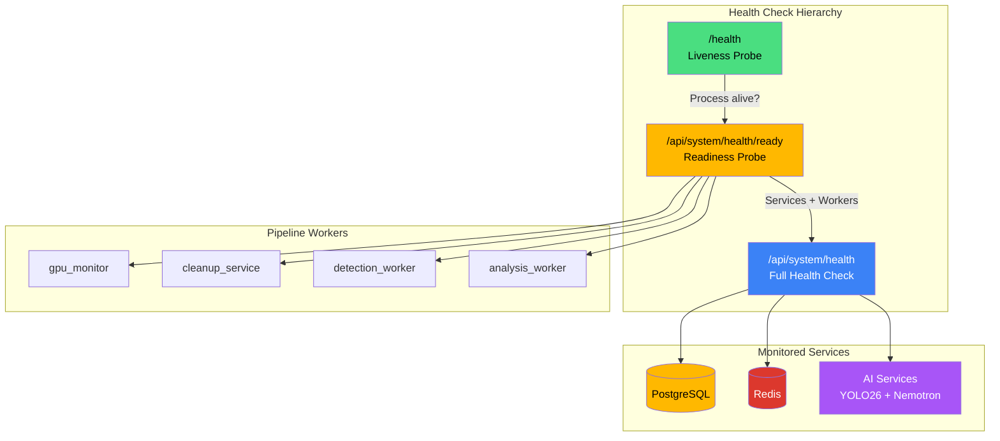
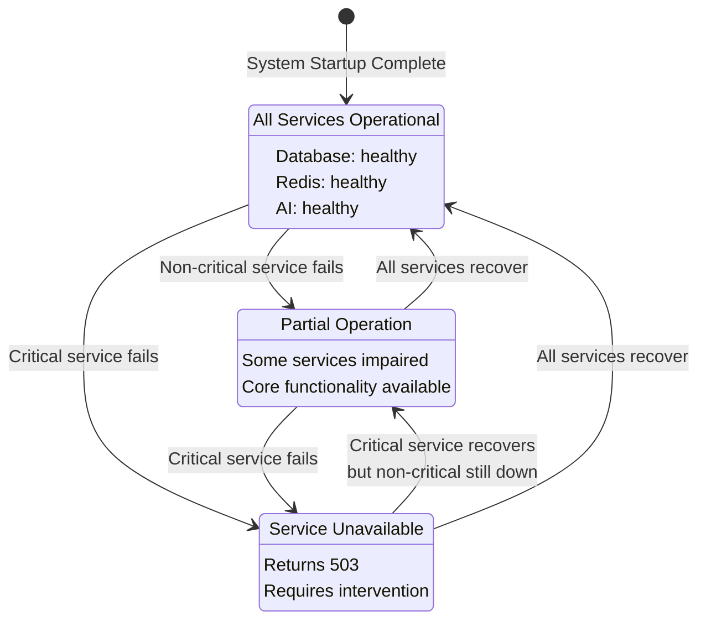
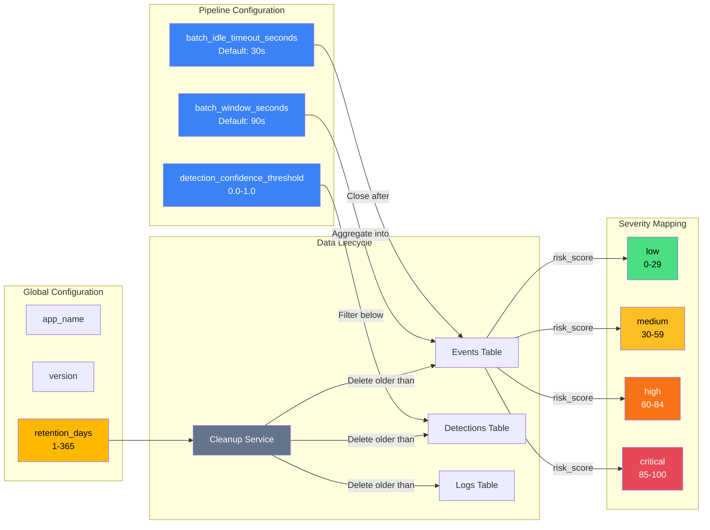
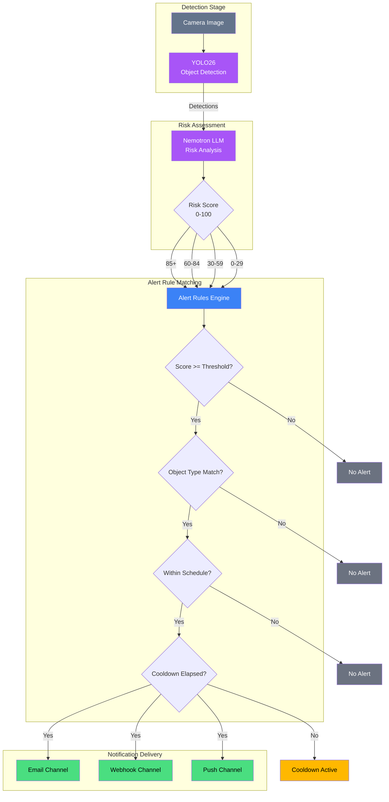
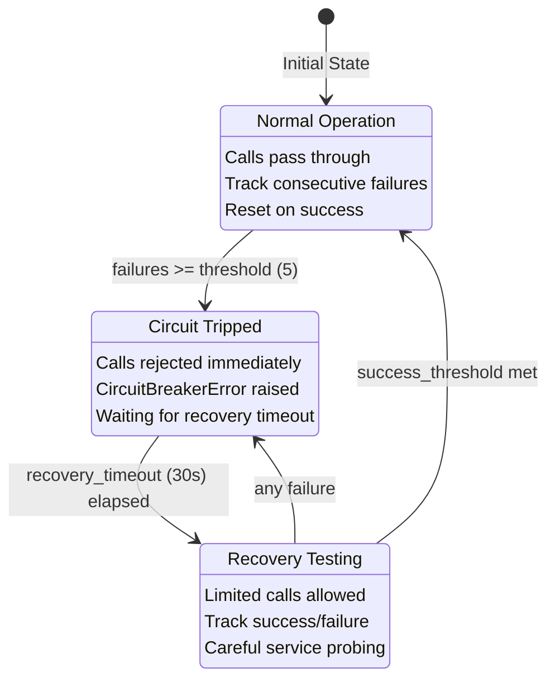

# System Operations API

This guide covers system health monitoring, configuration, alerts, logging, notification preferences, and service management.

**Total Endpoints: 61** (Health: 6, GPU: 2, Config: 2, Statistics: 8, Cleanup: 3, Severity: 2, Alerts: 8, Logs: 5, Notifications: 10, Services: 5, Models: 4, Anomaly Config: 2, Circuit Breakers: 2, Metrics: 1, WebSocket Registry: 1)

## System Operations Overview

The following diagram illustrates the key system operations components and their relationships:

<details>
<summary>Mermaid source (click to expand)</summary>



</details>

## Health Checks

The system exposes multiple health endpoints for monitoring and orchestration.

### Endpoints

| Method | Endpoint                       | Description                  |
| ------ | ------------------------------ | ---------------------------- |
| GET    | `/health`                      | Liveness probe               |
| GET    | `/ready`                       | Simple readiness probe       |
| GET    | `/api/system/health`           | Detailed health check        |
| GET    | `/api/system/health/live`      | Fast liveness probe (<10ms)  |
| GET    | `/api/system/health/ready`     | Readiness probe with details |
| GET    | `/api/system/health/full`      | Comprehensive health check   |
| GET    | `/api/system/health/websocket` | WebSocket broadcaster health |

### Liveness Probe

Simple check that the process is running:

```bash
GET /health
```

**Response:**

```json
{ "status": "alive" }
```

Always returns `200 OK` if the HTTP server is responding.

### Fast Liveness Probe

Ultra-fast liveness check for Kubernetes (responds in under 10ms):

```bash
GET /api/system/health/live
```

**Response:**

```json
{
  "status": "alive",
  "timestamp": "2025-12-23T10:30:00Z"
}
```

This endpoint performs NO external checks - it immediately returns "alive" to indicate the process is running. Use this for Kubernetes liveness probes that need to detect hung processes quickly without waiting for dependency checks.

### Simple Readiness Probe

Check if the system is ready to receive traffic:

```bash
GET /ready
```

**Response:** `200 OK` (ready) or `503 Service Unavailable` (not ready)

```json
{
  "ready": true,
  "status": "ready"
}
```

This is the canonical readiness probe endpoint for Kubernetes/Docker health checks.

### Detailed Health Check

Comprehensive check of all services:

```bash
GET /api/system/health
```

**Response:** `200 OK` (healthy) or `503 Service Unavailable` (degraded/unhealthy)

```json
{
  "status": "healthy",
  "services": {
    "database": {
      "status": "healthy",
      "message": "Database operational",
      "details": null
    },
    "redis": {
      "status": "healthy",
      "message": "Redis connected",
      "details": { "redis_version": "7.0.0" }
    },
    "ai": {
      "status": "healthy",
      "message": "AI services operational",
      "details": { "yolo26": "healthy", "nemotron": "healthy" }
    }
  },
  "timestamp": "2025-12-23T10:30:00Z"
}
```

**Status Values:**

| Status      | Description                               |
| ----------- | ----------------------------------------- |
| `healthy`   | All services functioning normally         |
| `degraded`  | Some services impaired, limited operation |
| `unhealthy` | Critical services down                    |

### Health Status State Machine

The following state diagram shows how the system transitions between health states:

<details>
<summary>Mermaid source (click to expand)</summary>



</details>

### Readiness Probe

Check if system can accept requests:

```bash
GET /api/system/health/ready
```

**Response:** `200 OK` (ready) or `503 Service Unavailable` (not ready)

```json
{
  "ready": true,
  "status": "ready",
  "services": { ... },
  "workers": [
    { "name": "gpu_monitor", "running": true, "message": null },
    { "name": "cleanup_service", "running": true, "message": null },
    { "name": "detection_worker", "running": true, "message": null },
    { "name": "analysis_worker", "running": true, "message": null }
  ],
  "timestamp": "2025-12-23T10:30:00Z"
}
```

**Readiness Criteria:**

- Database must be healthy
- Redis must be healthy
- Pipeline workers must be running

### Full Health Check

Comprehensive health status including all system components:

```bash
GET /api/system/health/full
```

**Response:** `200 OK` (healthy) or `503 Service Unavailable` (critical services unhealthy)

```json
{
  "status": "healthy",
  "infrastructure": {
    "postgres": { "status": "healthy", "latency_ms": 5.2 },
    "redis": { "status": "healthy", "latency_ms": 1.1 }
  },
  "ai_services": {
    "yolo26": { "status": "healthy", "loaded": true },
    "nemotron": { "status": "healthy", "loaded": true },
    "florence": { "status": "healthy", "loaded": false },
    "clip": { "status": "healthy", "loaded": false },
    "enrichment": { "status": "healthy" }
  },
  "circuit_breakers": {
    "yolo26": { "state": "closed", "failures": 0 },
    "nemotron": { "state": "closed", "failures": 0 }
  },
  "workers": {
    "gpu_monitor": { "running": true },
    "cleanup_service": { "running": true },
    "detection_worker": { "running": true },
    "analysis_worker": { "running": true }
  },
  "timestamp": "2025-12-23T10:30:00Z"
}
```

### WebSocket Health

Check WebSocket broadcaster circuit breaker status:

```bash
GET /api/system/health/websocket
```

**Response:**

```json
{
  "event_broadcaster": {
    "state": "closed",
    "failures": 0,
    "last_failure": null
  },
  "system_broadcaster": {
    "state": "closed",
    "failures": 0,
    "last_failure": null
  },
  "timestamp": "2025-12-23T10:30:00Z"
}
```

**Circuit Breaker States:**

| State       | Description                                  |
| ----------- | -------------------------------------------- |
| `closed`    | Normal operation, events flowing             |
| `open`      | Failures detected, events may be delayed     |
| `half_open` | Testing recovery, limited operations allowed |

---

## GPU Monitoring

Monitor GPU statistics for the AI pipeline.

### Endpoints

| Method | Endpoint                  | Description            |
| ------ | ------------------------- | ---------------------- |
| GET    | `/api/system/gpu`         | Current GPU statistics |
| GET    | `/api/system/gpu/history` | GPU stats time series  |

### Current GPU Stats

```bash
GET /api/system/gpu
```

**Response:**

```json
{
  "gpu_name": "NVIDIA RTX A5500",
  "utilization": 75.5,
  "memory_used": 12000,
  "memory_total": 24000,
  "temperature": 65.0,
  "power_usage": 150.0,
  "inference_fps": 30.5
}
```

### GPU History

```bash
GET /api/system/gpu/history?since=2025-12-23T09:00:00Z&limit=100
```

**Parameters:**

| Name  | Type     | Default | Description                 |
| ----- | -------- | ------- | --------------------------- |
| since | datetime | null    | Lower bound for recorded_at |
| limit | integer  | 300     | Max samples (max 5000)      |

**Response:**

```json
{
  "samples": [
    {
      "recorded_at": "2025-12-23T10:00:00Z",
      "gpu_name": "NVIDIA RTX A5500",
      "utilization": 72.0,
      "memory_used": 11500,
      "memory_total": 24000,
      "temperature": 64.0,
      "power_usage": 145.0,
      "inference_fps": 28.5
    }
  ],
  "count": 1,
  "limit": 100
}
```

---

## Configuration

Runtime configuration management.

### Configuration Relationships

The following diagram shows how system configuration parameters relate to each other and affect system behavior:

<details>
<summary>Mermaid source (click to expand)</summary>



</details>

### Endpoints

| Method | Endpoint             | Description          |
| ------ | -------------------- | -------------------- |
| GET    | `/api/system/config` | Get configuration    |
| PATCH  | `/api/system/config` | Update configuration |

### Get Configuration

```bash
GET /api/system/config
```

**Response:**

```json
{
  "app_name": "Home Security Intelligence",
  "version": "0.1.0",
  "retention_days": 30,
  "batch_window_seconds": 90,
  "batch_idle_timeout_seconds": 30,
  "detection_confidence_threshold": 0.5
}
```

### Update Configuration

**Requires API key authentication.**

```bash
PATCH /api/system/config
X-API-Key: your-api-key
Content-Type: application/json

{
  "retention_days": 14,
  "detection_confidence_threshold": 0.6
}
```

**Configurable Fields:**

| Field                            | Type    | Range   | Description               |
| -------------------------------- | ------- | ------- | ------------------------- |
| `retention_days`                 | integer | 1-365   | Data retention period     |
| `batch_window_seconds`           | integer | >= 1    | Detection batch window    |
| `batch_idle_timeout_seconds`     | integer | >= 1    | Batch idle timeout        |
| `detection_confidence_threshold` | float   | 0.0-1.0 | Minimum confidence filter |

---

## Statistics

System-wide statistics and metrics.

### Endpoints

| Method | Endpoint                               | Description                 |
| ------ | -------------------------------------- | --------------------------- |
| GET    | `/api/system/stats`                    | System statistics           |
| GET    | `/api/system/storage`                  | Storage statistics          |
| GET    | `/api/system/telemetry`                | Pipeline telemetry          |
| GET    | `/api/system/pipeline`                 | Pipeline status             |
| GET    | `/api/system/performance`              | Current performance metrics |
| GET    | `/api/system/performance/history`      | Historical performance      |
| GET    | `/api/system/pipeline-latency`         | Pipeline latency metrics    |
| GET    | `/api/system/pipeline-latency/history` | Pipeline latency history    |

### System Statistics

```bash
GET /api/system/stats
```

**Response:**

```json
{
  "total_cameras": 4,
  "total_events": 156,
  "total_detections": 892,
  "uptime_seconds": 86400.5
}
```

### Storage Statistics

```bash
GET /api/system/storage
```

**Response:**

```json
{
  "disk_used_bytes": 107374182400,
  "disk_total_bytes": 536870912000,
  "disk_free_bytes": 429496729600,
  "disk_usage_percent": 20.0,
  "thumbnails": { "file_count": 1500, "size_bytes": 75000000 },
  "images": { "file_count": 10000, "size_bytes": 5000000000 },
  "clips": { "file_count": 50, "size_bytes": 500000000 },
  "events_count": 156,
  "detections_count": 892,
  "gpu_stats_count": 2880,
  "logs_count": 5000,
  "timestamp": "2025-12-30T10:30:00Z"
}
```

### Pipeline Telemetry

```bash
GET /api/system/telemetry
```

**Response:**

```json
{
  "queues": {
    "detection_queue": 5,
    "analysis_queue": 2
  },
  "latencies": {
    "watch": { "avg_ms": 10.0, "p95_ms": 40.0, "sample_count": 500 },
    "detect": { "avg_ms": 200.0, "p95_ms": 600.0, "sample_count": 500 },
    "batch": null,
    "analyze": null
  },
  "timestamp": "2025-12-27T10:30:00Z"
}
```

### Performance Metrics

Get comprehensive real-time performance metrics:

```bash
GET /api/system/performance
```

**Response:**

```json
{
  "gpu": {
    "utilization": 75.5,
    "memory_used_mb": 12000,
    "memory_total_mb": 24000,
    "temperature_c": 65.0,
    "power_watts": 150.0
  },
  "ai_models": {
    "yolo26": { "status": "loaded", "vram_mb": 2048 },
    "nemotron": { "status": "loaded", "vram_mb": 8192 }
  },
  "inference": {
    "avg_latency_ms": 45.2,
    "p95_latency_ms": 120.5,
    "throughput_fps": 22.3
  },
  "databases": {
    "postgres": { "status": "healthy", "connections": 10 },
    "redis": { "status": "healthy", "memory_mb": 256 }
  },
  "host": {
    "cpu_percent": 35.2,
    "ram_percent": 62.1,
    "disk_percent": 45.0
  },
  "containers": [
    { "name": "backend", "status": "running" },
    { "name": "ai", "status": "running" }
  ],
  "alerts": [],
  "timestamp": "2025-12-27T10:30:00Z"
}
```

### Performance History

Get historical performance metrics for time-series visualization:

```bash
GET /api/system/performance/history?time_range=5m
```

**Parameters:**

| Name       | Type   | Default | Description                       |
| ---------- | ------ | ------- | --------------------------------- |
| time_range | string | 5m      | Time range: `5m`, `15m`, or `60m` |

**Response:**

```json
{
  "snapshots": [
    { "timestamp": "2025-12-27T10:29:00Z", "gpu": { ... }, ... },
    { "timestamp": "2025-12-27T10:30:00Z", "gpu": { ... }, ... }
  ],
  "time_range": "5m",
  "count": 60
}
```

### Pipeline Latency

Get detailed pipeline latency metrics with percentiles:

```bash
GET /api/system/pipeline-latency?window_minutes=60
```

**Parameters:**

| Name           | Type    | Default | Description                             |
| -------------- | ------- | ------- | --------------------------------------- |
| window_minutes | integer | 60      | Time window for statistics (in minutes) |

**Response:**

```json
{
  "watch_to_detect": {
    "avg_ms": 15.2,
    "min_ms": 5.0,
    "max_ms": 45.0,
    "p50_ms": 12.0,
    "p95_ms": 35.0,
    "p99_ms": 42.0,
    "sample_count": 500
  },
  "detect_to_batch": {
    "avg_ms": 200.0,
    "min_ms": 150.0,
    "max_ms": 350.0,
    "p50_ms": 190.0,
    "p95_ms": 300.0,
    "p99_ms": 340.0,
    "sample_count": 500
  },
  "batch_to_analyze": { ... },
  "total_pipeline": { ... },
  "timestamp": "2025-12-27T10:30:00Z"
}
```

**Pipeline Stages:**

| Stage              | Description                                 |
| ------------------ | ------------------------------------------- |
| `watch_to_detect`  | File watcher to YOLO26 processing start     |
| `detect_to_batch`  | Detection completion to batch aggregation   |
| `batch_to_analyze` | Batch completion to Nemotron analysis start |
| `total_pipeline`   | Total end-to-end processing time            |

### Pipeline Latency History

Get pipeline latency history for time-series charts:

```bash
GET /api/system/pipeline-latency/history?since=60&bucket_seconds=60
```

**Parameters:**

| Name           | Type    | Default | Description                           |
| -------------- | ------- | ------- | ------------------------------------- |
| since          | integer | 60      | Minutes of history (1-1440)           |
| bucket_seconds | integer | 60      | Time bucket size in seconds (10-3600) |

**Response:**

```json
{
  "snapshots": [
    {
      "timestamp": "2025-12-27T10:29:00Z",
      "watch_to_detect": { "avg_ms": 15.0, "p50_ms": 12.0, "p95_ms": 35.0 },
      "detect_to_batch": { "avg_ms": 200.0, "p50_ms": 190.0, "p95_ms": 300.0 },
      "batch_to_analyze": { ... },
      "total_pipeline": { ... }
    }
  ],
  "count": 60
}
```

---

## Data Cleanup

Manage data retention and cleanup.

### Endpoints

| Method | Endpoint                             | Description            |
| ------ | ------------------------------------ | ---------------------- |
| GET    | `/api/system/cleanup/status`         | Cleanup service status |
| POST   | `/api/system/cleanup`                | Trigger cleanup        |
| POST   | `/api/system/cleanup/orphaned-files` | Clean orphaned files   |

### Cleanup Status

```bash
GET /api/system/cleanup/status
```

**Response:**

```json
{
  "running": true,
  "retention_days": 30,
  "cleanup_time": "03:00",
  "delete_images": false,
  "next_cleanup": "2025-12-31T03:00:00Z",
  "timestamp": "2025-12-30T10:30:00Z"
}
```

### Trigger Cleanup

**Requires API key authentication.**

```bash
POST /api/system/cleanup?dry_run=true
X-API-Key: your-api-key
```

**Parameters:**

| Name    | Type    | Default | Description              |
| ------- | ------- | ------- | ------------------------ |
| dry_run | boolean | false   | Preview without deleting |

**Response:**

```json
{
  "events_deleted": 15,
  "detections_deleted": 89,
  "gpu_stats_deleted": 2880,
  "logs_deleted": 150,
  "thumbnails_deleted": 89,
  "images_deleted": 0,
  "space_reclaimed": 524288000,
  "retention_days": 30,
  "dry_run": true,
  "timestamp": "2025-12-27T10:30:00Z"
}
```

### Orphaned File Cleanup

Find and clean up orphaned files (files on disk not referenced in database):

**Requires API key authentication.**

```bash
POST /api/system/cleanup/orphaned-files?dry_run=true
X-API-Key: your-api-key
```

**Parameters:**

| Name    | Type    | Default | Description                             |
| ------- | ------- | ------- | --------------------------------------- |
| dry_run | boolean | true    | Preview without deleting (default safe) |

**Response:**

```json
{
  "thumbnails": {
    "orphaned_count": 45,
    "orphaned_size_bytes": 2250000,
    "files": ["thumb_001.jpg", "thumb_002.jpg"]
  },
  "clips": {
    "orphaned_count": 5,
    "orphaned_size_bytes": 50000000,
    "files": ["clip_old.mp4"]
  },
  "total_orphaned_files": 50,
  "total_size_bytes": 52250000,
  "dry_run": true,
  "timestamp": "2025-12-27T10:30:00Z"
}
```

**Storage Directories Scanned:**

- Thumbnails directory (`video_thumbnails_dir` setting)
- Clips directory (`clips_directory` setting)

---

## Severity Configuration

Configure risk score to severity level mappings.

### Endpoints

| Method | Endpoint               | Description              |
| ------ | ---------------------- | ------------------------ |
| GET    | `/api/system/severity` | Get severity definitions |
| PUT    | `/api/system/severity` | Update thresholds        |

### Get Severity Definitions

```bash
GET /api/system/severity
```

**Response:**

```json
{
  "definitions": [
    { "severity": "low", "min_score": 0, "max_score": 29, "color": "#22c55e" },
    { "severity": "medium", "min_score": 30, "max_score": 59, "color": "#eab308" },
    { "severity": "high", "min_score": 60, "max_score": 84, "color": "#f97316" },
    { "severity": "critical", "min_score": 85, "max_score": 100, "color": "#ef4444" }
  ],
  "thresholds": {
    "low_max": 29,
    "medium_max": 59,
    "high_max": 84
  }
}
```

### Update Severity Thresholds

**Requires API key authentication.**

```bash
PUT /api/system/severity
X-API-Key: your-api-key
Content-Type: application/json

{
  "low_max": 20,
  "medium_max": 45,
  "high_max": 70
}
```

Thresholds must be strictly ordered: `low_max < medium_max < high_max`

---

## Alert Rules

Configure automated alert triggers based on security events.

### Alert Flow Diagram

The following diagram shows how detections flow through the alert system, from initial detection through risk assessment to notification delivery:

<details>
<summary>Mermaid source (click to expand)</summary>



</details>

### Endpoints

| Method | Endpoint                             | Description       |
| ------ | ------------------------------------ | ----------------- |
| GET    | `/api/alerts/rules`                  | List alert rules  |
| POST   | `/api/alerts/rules`                  | Create rule       |
| GET    | `/api/alerts/rules/{id}`             | Get rule          |
| PUT    | `/api/alerts/rules/{id}`             | Update rule       |
| DELETE | `/api/alerts/rules/{id}`             | Delete rule       |
| POST   | `/api/alerts/rules/{id}/test`        | Test rule         |
| POST   | `/api/alerts/{alert_id}/acknowledge` | Acknowledge alert |
| POST   | `/api/alerts/{alert_id}/dismiss`     | Dismiss alert     |

### List Alert Rules

```bash
GET /api/alerts/rules?enabled=true&severity=high
```

**Response:**

```json
{
  "rules": [
    {
      "id": "550e8400-e29b-41d4-a716-446655440000",
      "name": "High Risk Person Detection",
      "enabled": true,
      "severity": "high",
      "risk_threshold": 75,
      "object_types": ["person"],
      "camera_ids": null,
      "schedule": {
        "days": ["mon", "tue", "wed", "thu", "fri"],
        "start_time": "22:00",
        "end_time": "06:00"
      },
      "cooldown_seconds": 300,
      "channels": ["email", "webhook"]
    }
  ],
  "count": 1
}
```

### Create Alert Rule

```bash
POST /api/alerts/rules
Content-Type: application/json

{
  "name": "Critical Person Detection",
  "severity": "critical",
  "risk_threshold": 85,
  "object_types": ["person"],
  "schedule": {
    "days": ["sun", "mon", "tue", "wed", "thu", "fri", "sat"],
    "start_time": "00:00",
    "end_time": "06:00"
  },
  "cooldown_seconds": 600,
  "channels": ["email", "webhook"]
}
```

**Matching Criteria:**

1. Risk score >= threshold
2. Detection object type matches
3. Camera ID matches (or null = all)
4. Current time within schedule
5. Cooldown period elapsed

### Test Alert Rule

Test a rule against historical events:

```bash
POST /api/alerts/rules/550e8400-e29b-41d4-a716-446655440000/test
Content-Type: application/json

{
  "event_ids": [1, 2, 3],
  "test_time": "2025-12-23T03:00:00Z",
  "limit": 50
}
```

### Acknowledge Alert

Mark an alert as acknowledged:

```bash
POST /api/alerts/{alert_id}/acknowledge
```

**Response:** `200 OK`, `404 Not Found`, or `409 Conflict`

```json
{
  "id": "550e8400-e29b-41d4-a716-446655440000",
  "status": "acknowledged",
  "acknowledged_at": "2025-12-23T10:35:00Z",
  "rule_id": "550e8400-e29b-41d4-a716-446655440001",
  "event_id": 123,
  "created_at": "2025-12-23T10:30:00Z"
}
```

**Status Requirements:** Only alerts with status `PENDING` or `DELIVERED` can be acknowledged.

### Dismiss Alert

Mark an alert as dismissed:

```bash
POST /api/alerts/{alert_id}/dismiss
```

**Response:** `200 OK`, `404 Not Found`, or `409 Conflict`

```json
{
  "id": "550e8400-e29b-41d4-a716-446655440000",
  "status": "dismissed",
  "dismissed_at": "2025-12-23T10:40:00Z",
  "rule_id": "550e8400-e29b-41d4-a716-446655440001",
  "event_id": 123,
  "created_at": "2025-12-23T10:30:00Z"
}
```

**Status Requirements:** Only alerts with status `PENDING`, `DELIVERED`, or `ACKNOWLEDGED` can be dismissed.

---

## Logs

View and query application logs.

### Endpoints

| Method | Endpoint                   | Description                |
| ------ | -------------------------- | -------------------------- |
| GET    | `/api/logs`                | List logs                  |
| GET    | `/api/logs/stats`          | Log statistics             |
| GET    | `/api/logs/{id}`           | Get log entry              |
| POST   | `/api/logs/frontend`       | Submit single frontend log |
| POST   | `/api/logs/frontend/batch` | Submit multiple logs       |

### List Logs

```bash
GET /api/logs?level=ERROR&component=detection_worker&limit=100
```

**Parameters:**

| Name       | Type     | Description                           |
| ---------- | -------- | ------------------------------------- |
| level      | string   | DEBUG, INFO, WARNING, ERROR, CRITICAL |
| component  | string   | Module/component name                 |
| camera_id  | string   | Associated camera                     |
| source     | string   | `backend` or `frontend`               |
| search     | string   | Search in message text                |
| start_date | datetime | Filter from date                      |
| end_date   | datetime | Filter to date                        |
| limit      | integer  | Page size (1-1000, default: 100)      |
| offset     | integer  | Page offset (default: 0)              |

**Response:**

```json
{
  "logs": [
    {
      "id": 1,
      "timestamp": "2025-12-23T10:30:00Z",
      "level": "ERROR",
      "component": "detection_worker",
      "message": "Connection refused to YOLO26 service",
      "camera_id": "front_door",
      "request_id": "abc123",
      "duration_ms": null,
      "extra": { "host": "ai:8001" },
      "source": "backend"
    }
  ],
  "count": 1
}
```

### Log Statistics

```bash
GET /api/logs/stats
```

**Response:**

```json
{
  "total_today": 5000,
  "errors_today": 15,
  "warnings_today": 50,
  "by_component": {
    "detection_worker": 1500,
    "analysis_worker": 1000
  },
  "by_level": {
    "INFO": 4000,
    "WARNING": 50,
    "ERROR": 15
  },
  "top_component": "detection_worker"
}
```

### Submit Frontend Log

Allow frontend to send logs to backend for centralized logging and debugging.

#### Single Log Entry

```bash
POST /api/logs/frontend
Content-Type: application/json

{
  "level": "ERROR",
  "message": "Failed to load component",
  "timestamp": "2024-01-21T12:00:00Z",
  "component": "Dashboard",
  "context": {"userId": "123", "action": "load"},
  "url": "/dashboard",
  "user_agent": "Mozilla/5.0..."
}
```

**Request Body Fields:**

| Field        | Type   | Required | Description                                      |
| ------------ | ------ | -------- | ------------------------------------------------ |
| `level`      | string | Yes      | Log level: DEBUG, INFO, WARNING, ERROR, CRITICAL |
| `message`    | string | Yes      | Log message text                                 |
| `timestamp`  | string | No       | ISO 8601 timestamp (defaults to server time)     |
| `component`  | string | No       | Frontend component name                          |
| `context`    | object | No       | Additional context data (JSON object)            |
| `url`        | string | No       | Page URL where the log originated                |
| `user_agent` | string | No       | Browser user agent string                        |

**Response:**

```json
{
  "success": true,
  "count": 1,
  "message": "Log entry recorded"
}
```

#### Batch Log Entries

Submit multiple log entries in a single request (1-100 entries). This is more efficient for high-volume logging scenarios.

```bash
POST /api/logs/frontend/batch
Content-Type: application/json

{
  "entries": [
    {
      "level": "INFO",
      "message": "Page loaded successfully",
      "component": "App",
      "timestamp": "2024-01-21T12:00:00Z"
    },
    {
      "level": "ERROR",
      "message": "API call failed",
      "component": "ApiClient",
      "context": {"endpoint": "/api/events", "status": 500},
      "timestamp": "2024-01-21T12:00:01Z"
    },
    {
      "level": "WARNING",
      "message": "Slow render detected",
      "component": "EventTimeline",
      "context": {"render_time_ms": 2500},
      "timestamp": "2024-01-21T12:00:02Z"
    }
  ]
}
```

**Request Body:**

| Field     | Type  | Required | Description                      |
| --------- | ----- | -------- | -------------------------------- |
| `entries` | array | Yes      | Array of log entries (1-100 max) |

Each entry in the array follows the same schema as the single log entry endpoint.

**Response:**

```json
{
  "success": true,
  "count": 3,
  "message": "3 log entries recorded"
}
```

**Error Response (validation failure):**

```json
{
  "success": false,
  "count": 0,
  "message": "Batch must contain 1-100 entries",
  "errors": ["entries: ensure this value has at most 100 items"]
}
```

**Use Cases:**

- **Error Reporting**: Capture frontend errors with stack traces and component context
- **Performance Monitoring**: Log slow renders, API latency, and user interactions
- **User Journey Tracking**: Track navigation and feature usage for debugging
- **Debugging**: Centralize frontend and backend logs for correlation

---

## Notification Preferences

Configure global notification settings and per-camera overrides.

### Endpoints

| Method | Endpoint                                            | Description            |
| ------ | --------------------------------------------------- | ---------------------- |
| GET    | `/api/notification-preferences`                     | Get global preferences |
| PUT    | `/api/notification-preferences`                     | Update preferences     |
| GET    | `/api/notification-preferences/cameras`             | List camera settings   |
| GET    | `/api/notification-preferences/cameras/{camera_id}` | Get camera setting     |
| PUT    | `/api/notification-preferences/cameras/{camera_id}` | Update camera setting  |
| GET    | `/api/notification-preferences/quiet-hours`         | Get quiet hours        |
| POST   | `/api/notification-preferences/quiet-hours`         | Create quiet hours     |
| DELETE | `/api/notification-preferences/quiet-hours/{id}`    | Delete quiet hours     |

### Global Preferences

```bash
GET /api/notification-preferences
```

**Response:**

```json
{
  "id": 1,
  "enabled": true,
  "sound": "default",
  "risk_filters": ["critical", "high", "medium"]
}
```

### Update Global Preferences

```bash
PUT /api/notification-preferences
Content-Type: application/json

{
  "enabled": true,
  "sound": "alert",
  "risk_filters": ["critical", "high"]
}
```

**Sound Options:** `none`, `default`, `alert`, `chime`, `urgent`

### Camera-Specific Settings

```bash
PUT /api/notification-preferences/cameras/front_door
Content-Type: application/json

{
  "enabled": true,
  "risk_threshold": 75
}
```

### Quiet Hours

Create a quiet hours period:

```bash
POST /api/notification-preferences/quiet-hours
Content-Type: application/json

{
  "label": "Night Hours",
  "start_time": "22:00:00",
  "end_time": "23:59:00",
  "days": ["monday", "tuesday", "wednesday", "thursday", "friday", "saturday", "sunday"]
}
```

---

## Notification Testing

Test notification delivery.

### Endpoints

| Method | Endpoint                   | Description             |
| ------ | -------------------------- | ----------------------- |
| GET    | `/api/notification/config` | Get notification config |
| POST   | `/api/notification/test`   | Test notification       |

### Get Notification Configuration

```bash
GET /api/notification/config
```

**Response:**

```json
{
  "notification_enabled": true,
  "email_configured": true,
  "webhook_configured": true,
  "push_configured": false,
  "available_channels": ["email", "webhook"],
  "smtp_host": "smtp.example.com",
  "smtp_port": 587,
  "smtp_from_address": "alerts@example.com"
}
```

### Test Notification

```bash
POST /api/notification/test
Content-Type: application/json

{
  "channel": "email",
  "email_recipients": ["test@example.com"]
}
```

**Channels:** `email`, `webhook`, `push`

---

## Services Management

Manage and monitor container services.

### Endpoints

| Method | Endpoint                              | Description       |
| ------ | ------------------------------------- | ----------------- |
| GET    | `/api/system/services`                | List all services |
| POST   | `/api/system/services/{name}/restart` | Restart service   |
| POST   | `/api/system/services/{name}/start`   | Start service     |
| POST   | `/api/system/services/{name}/enable`  | Enable service    |
| POST   | `/api/system/services/{name}/disable` | Disable service   |

### List Services

Get status of all managed services:

```bash
GET /api/system/services?category=ai
```

**Parameters:**

| Name     | Type   | Description                                              |
| -------- | ------ | -------------------------------------------------------- |
| category | string | Filter by category: `infrastructure`, `ai`, `monitoring` |

**Response:**

```json
{
  "services": [
    {
      "name": "backend",
      "category": "infrastructure",
      "status": "running",
      "enabled": true,
      "failure_count": 0,
      "last_restart": null
    },
    {
      "name": "ai",
      "category": "ai",
      "status": "running",
      "enabled": true,
      "failure_count": 0,
      "last_restart": null
    }
  ],
  "summaries": {
    "infrastructure": { "total": 3, "healthy": 3, "unhealthy": 0 },
    "ai": { "total": 1, "healthy": 1, "unhealthy": 0 },
    "monitoring": { "total": 2, "healthy": 2, "unhealthy": 0 }
  }
}
```

### Restart Service

Manually restart a service:

```bash
POST /api/system/services/ai/restart
```

**Response:** `200 OK`, `400 Bad Request` (disabled), or `404 Not Found`

```json
{
  "action": "restart",
  "service": "ai",
  "success": true,
  "message": "Service ai restarted successfully",
  "service_info": {
    "name": "ai",
    "status": "running",
    "enabled": true,
    "failure_count": 0
  }
}
```

### Start Service

Start a stopped service:

```bash
POST /api/system/services/ai/start
```

**Response:** `200 OK`, `400 Bad Request` (already running or disabled), or `404 Not Found`

### Enable Service

Re-enable a disabled service (allows self-healing to resume):

```bash
POST /api/system/services/ai/enable
```

**Response:** `200 OK` or `404 Not Found`

### Disable Service

Disable a service (prevents self-healing restarts):

```bash
POST /api/system/services/ai/disable
```

**Response:** `200 OK` or `404 Not Found`

---

## Model Zoo

Manage AI models in the Model Zoo.

### Endpoints

| Method | Endpoint                                | Description               |
| ------ | --------------------------------------- | ------------------------- |
| GET    | `/api/system/models`                    | Get model registry        |
| GET    | `/api/system/models/{model_name}`       | Get specific model status |
| GET    | `/api/system/model-zoo/status`          | Compact model status      |
| GET    | `/api/system/model-zoo/latency/history` | Model latency history     |

### Get Model Registry

Get comprehensive information about all AI models:

```bash
GET /api/system/models
```

**Response:**

```json
{
  "vram_budget_mb": 1650,
  "vram_used_mb": 512,
  "vram_available_mb": 1138,
  "models": [
    {
      "name": "yolo11-license-plate",
      "category": "detection",
      "status": "loaded",
      "vram_mb": 256,
      "last_used": "2025-12-23T10:30:00Z",
      "enabled": true
    },
    {
      "name": "insightface",
      "category": "recognition",
      "status": "unloaded",
      "vram_mb": 512,
      "last_used": null,
      "enabled": true
    }
  ]
}
```

**Model Categories:**

| Category           | Description                      |
| ------------------ | -------------------------------- |
| `detection`        | Object detection (YOLO variants) |
| `recognition`      | Face/license plate recognition   |
| `ocr`              | Optical character recognition    |
| `embedding`        | Visual embeddings (CLIP)         |
| `depth-estimation` | Depth estimation models          |
| `pose`             | Human pose estimation            |

### Get Model Status

Get detailed status for a specific model:

```bash
GET /api/system/models/yolo11-license-plate
```

**Response:** `200 OK` or `404 Not Found`

```json
{
  "name": "yolo11-license-plate",
  "category": "detection",
  "status": "loaded",
  "vram_mb": 256,
  "last_used": "2025-12-23T10:30:00Z",
  "enabled": true,
  "load_time_ms": 1250,
  "inference_count": 1500
}
```

### Model Zoo Status

Compact status for all 18 Model Zoo models:

```bash
GET /api/system/model-zoo/status
```

**Response:**

```json
{
  "models": [
    {
      "name": "yolo11-license-plate",
      "category": "detection",
      "status": "loaded",
      "vram_mb": 256
    }
  ],
  "categories": {
    "detection": { "loaded": 2, "total": 4 },
    "recognition": { "loaded": 0, "total": 2 }
  },
  "timestamp": "2025-12-23T10:30:00Z"
}
```

### Model Latency History

Get latency history for a specific model:

```bash
GET /api/system/model-zoo/latency/history?model=yolo11-license-plate&since=60&bucket_seconds=60
```

**Parameters:**

| Name           | Type    | Required | Default | Description                           |
| -------------- | ------- | -------- | ------- | ------------------------------------- |
| model          | string  | Yes      | -       | Model name                            |
| since          | integer | No       | 60      | Minutes of history (1-1440)           |
| bucket_seconds | integer | No       | 60      | Time bucket size in seconds (10-3600) |

**Response:** `200 OK` or `404 Not Found`

```json
{
  "model": "yolo11-license-plate",
  "snapshots": [
    {
      "timestamp": "2025-12-23T10:29:00Z",
      "avg_ms": 45.2,
      "p50_ms": 42.0,
      "p95_ms": 85.0,
      "sample_count": 100
    }
  ],
  "count": 60
}
```

---

## Anomaly Detection Configuration

Configure anomaly detection thresholds for baseline deviation alerts.

### Endpoints

| Method | Endpoint                     | Description           |
| ------ | ---------------------------- | --------------------- |
| GET    | `/api/system/anomaly-config` | Get anomaly config    |
| PATCH  | `/api/system/anomaly-config` | Update anomaly config |

### Get Anomaly Config

```bash
GET /api/system/anomaly-config
```

**Response:**

```json
{
  "threshold_stdev": 3.0,
  "min_samples": 100,
  "decay_factor": 0.1,
  "window_days": 7
}
```

**Configuration Fields:**

| Field             | Type    | Description                                  |
| ----------------- | ------- | -------------------------------------------- |
| `threshold_stdev` | float   | Standard deviations for anomaly detection    |
| `min_samples`     | integer | Minimum samples before detection is reliable |
| `decay_factor`    | float   | Exponential decay factor for EWMA            |
| `window_days`     | integer | Rolling window size in days                  |

### Update Anomaly Config

**Requires API key authentication.**

```bash
PATCH /api/system/anomaly-config
X-API-Key: your-api-key
Content-Type: application/json

{
  "threshold_stdev": 2.5,
  "min_samples": 50
}
```

**Note:** `decay_factor` and `window_days` are not configurable at runtime as they affect historical data calculations.

---

## Circuit Breakers

Manage circuit breakers that protect external services from cascading failures.

### Endpoints

| Method | Endpoint                                    | Description              |
| ------ | ------------------------------------------- | ------------------------ |
| GET    | `/api/system/circuit-breakers`              | Get all circuit breakers |
| POST   | `/api/system/circuit-breakers/{name}/reset` | Reset circuit breaker    |

### Get Circuit Breakers

Get status of all circuit breakers:

```bash
GET /api/system/circuit-breakers
```

**Response:**

```json
{
  "circuit_breakers": [
    {
      "name": "yolo26",
      "state": "closed",
      "failure_count": 0,
      "success_count": 150,
      "last_failure": null,
      "last_state_change": "2025-12-23T08:00:00Z"
    },
    {
      "name": "nemotron",
      "state": "closed",
      "failure_count": 0,
      "success_count": 75,
      "last_failure": null,
      "last_state_change": "2025-12-23T08:00:00Z"
    }
  ],
  "timestamp": "2025-12-23T10:30:00Z"
}
```

### Reset Circuit Breaker

Manually reset a circuit breaker to CLOSED state:

**Requires API key authentication (when enabled).**

```bash
POST /api/system/circuit-breakers/yolo26/reset
X-API-Key: your-api-key
```

**Response:** `200 OK`, `400 Bad Request` (invalid name), or `404 Not Found`

```json
{
  "name": "yolo26",
  "previous_state": "open",
  "new_state": "closed",
  "message": "Circuit breaker yolo26 reset to closed state",
  "timestamp": "2025-12-23T10:30:00Z"
}
```

---

## Prometheus Metrics

Export metrics in Prometheus exposition format.

### Endpoints

| Method | Endpoint       | Description        |
| ------ | -------------- | ------------------ |
| GET    | `/api/metrics` | Prometheus metrics |

### Get Metrics

```bash
GET /api/metrics
```

**Response:** `200 OK` with `text/plain` content type

```
# HELP http_requests_total Total HTTP requests
# TYPE http_requests_total counter
http_requests_total{method="GET",endpoint="/api/events",status="200"} 1523

# HELP detection_latency_seconds Detection processing latency
# TYPE detection_latency_seconds histogram
detection_latency_seconds_bucket{le="0.1"} 450
detection_latency_seconds_bucket{le="0.5"} 980
detection_latency_seconds_bucket{le="1.0"} 1050
detection_latency_seconds_sum 523.45
detection_latency_seconds_count 1050

# HELP gpu_utilization_percent Current GPU utilization
# TYPE gpu_utilization_percent gauge
gpu_utilization_percent 75.5

# HELP active_events_count Number of active security events
# TYPE active_events_count gauge
active_events_count 3
```

This endpoint is designed for Prometheus scraping and returns all registered application metrics.

---

## WebSocket Event Registry

Discover available WebSocket event types.

### Endpoints

| Method | Endpoint                       | Description                |
| ------ | ------------------------------ | -------------------------- |
| GET    | `/api/system/websocket/events` | List WebSocket event types |

### List WebSocket Event Types

Get all available WebSocket event types with schemas:

```bash
GET /api/system/websocket/events
```

**Response:**

```json
{
  "event_types": [
    {
      "type": "detection.new",
      "channel": "detections",
      "description": "New detection from AI pipeline",
      "deprecated": false,
      "payload_schema": { ... },
      "example": { ... }
    },
    {
      "type": "event.created",
      "channel": "events",
      "description": "New security event created",
      "deprecated": false,
      "payload_schema": { ... },
      "example": { ... }
    }
  ],
  "channels": ["detections", "events", "alerts", "cameras", "jobs", "system"],
  "total_count": 24,
  "deprecated_count": 2
}
```

**Channels:**

| Channel      | Description                           |
| ------------ | ------------------------------------- |
| `detections` | AI detection pipeline events          |
| `events`     | Security event lifecycle events       |
| `alerts`     | Alert notifications and state changes |
| `cameras`    | Camera status and configuration       |
| `jobs`       | Background job lifecycle events       |
| `system`     | System health and status events       |

---

## Circuit Breaker Pattern

The system uses circuit breakers to protect external services from cascading failures. This is critical for maintaining system stability when AI services (YOLO26, Nemotron) or Redis experience issues.

### Circuit Breaker States

<details>
<summary>Mermaid source (click to expand)</summary>



</details>

### Circuit Breaker Configuration

| Parameter             | Default | Description                          |
| --------------------- | ------- | ------------------------------------ |
| `failure_threshold`   | 5       | Consecutive failures before opening  |
| `recovery_timeout`    | 30s     | Wait time before testing recovery    |
| `half_open_max_calls` | 3       | Max calls allowed in half-open state |
| `success_threshold`   | 2       | Successes needed to close circuit    |

For detailed circuit breaker implementation and WebSocket resilience patterns, see the [Resilience Architecture](../../architecture/resilience.md) documentation.

---

## Related Documentation

- [System Monitoring API](system-monitoring.md) - Worker supervisor, pipeline status, Prometheus integration
- [Core Resources API](core-resources.md) - Cameras, events, detections
- [AI Pipeline API](ai-pipeline.md) - Enrichment and batch processing
- [Real-time API](realtime.md) - WebSocket streams
- [Resilience Architecture](../../architecture/resilience.md) - Circuit breakers, retry logic, DLQ management
