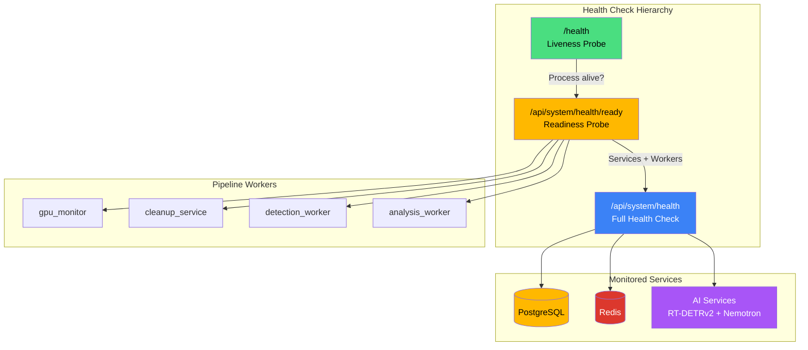
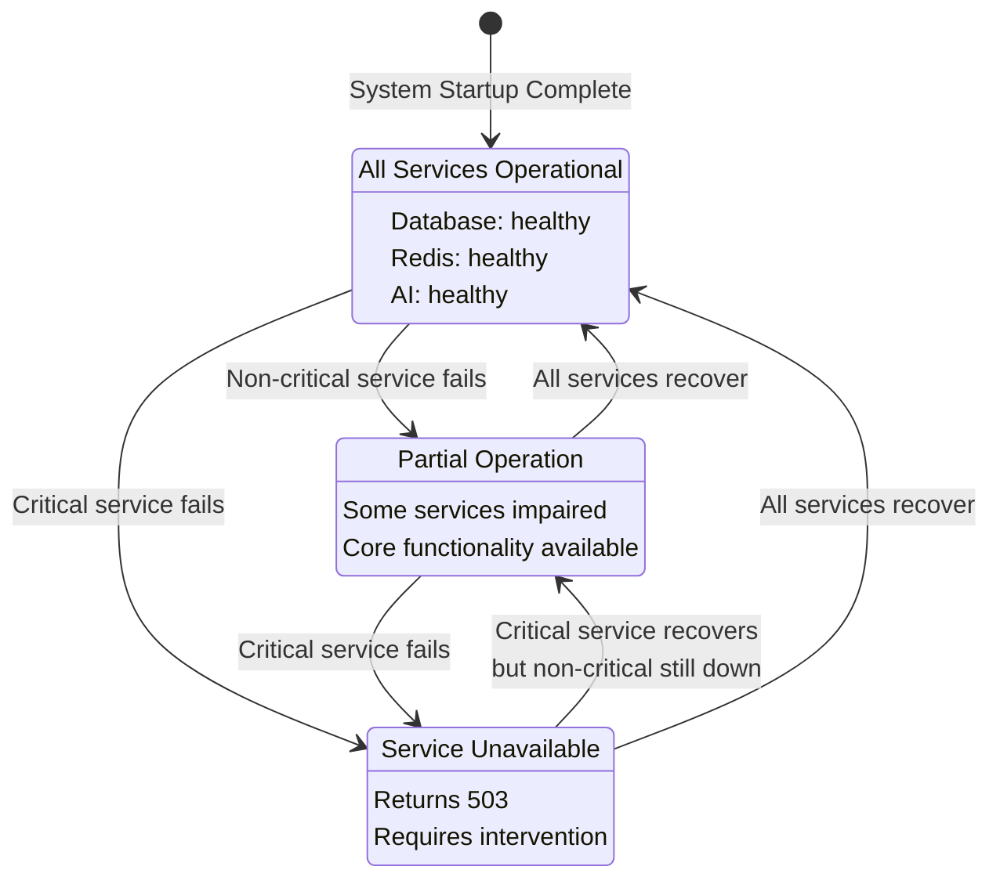
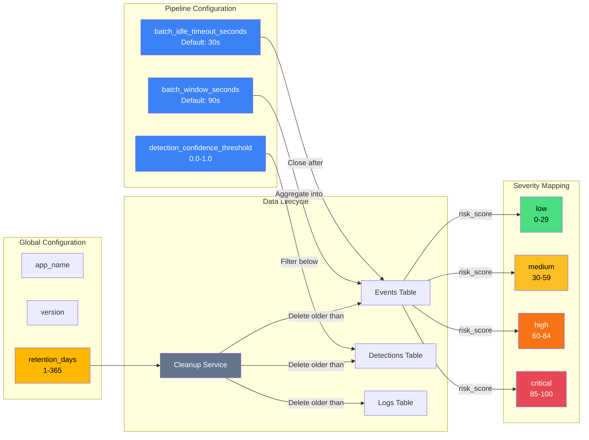
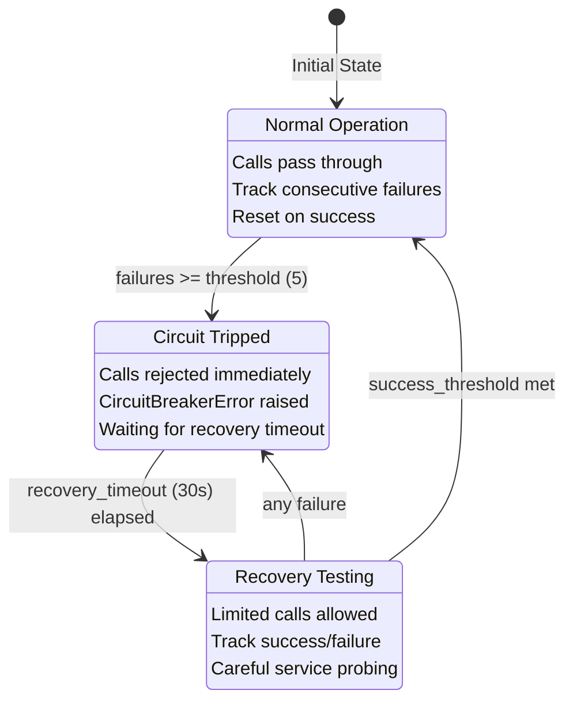

# System Operations API

This guide covers system health monitoring, configuration, alerts, logging, and notification preferences.

## System Operations Overview

The following diagram illustrates the key system operations components and their relationships:

<details>
<summary>Mermaid source (click to expand)</summary>



</details>

## Health Checks

The system exposes multiple health endpoints for monitoring and orchestration.

### Endpoints

| Method | Endpoint                   | Description           |
| ------ | -------------------------- | --------------------- |
| GET    | `/health`                  | Liveness probe        |
| GET    | `/api/system/health`       | Detailed health check |
| GET    | `/api/system/health/ready` | Readiness probe       |

### Liveness Probe

Simple check that the process is running:

```bash
GET /health
```

**Response:**

```json
{ "status": "alive" }
```

Always returns `200 OK` if the HTTP server is responding.

### Detailed Health Check

Comprehensive check of all services:

```bash
GET /api/system/health
```

**Response:** `200 OK` (healthy) or `503 Service Unavailable` (degraded/unhealthy)

```json
{
  "status": "healthy",
  "services": {
    "database": {
      "status": "healthy",
      "message": "Database operational",
      "details": null
    },
    "redis": {
      "status": "healthy",
      "message": "Redis connected",
      "details": { "redis_version": "7.0.0" }
    },
    "ai": {
      "status": "healthy",
      "message": "AI services operational",
      "details": { "rtdetr": "healthy", "nemotron": "healthy" }
    }
  },
  "timestamp": "2025-12-23T10:30:00Z"
}
```

**Status Values:**

| Status      | Description                               |
| ----------- | ----------------------------------------- |
| `healthy`   | All services functioning normally         |
| `degraded`  | Some services impaired, limited operation |
| `unhealthy` | Critical services down                    |

### Health Status State Machine

The following state diagram shows how the system transitions between health states:

<details>
<summary>Mermaid source (click to expand)</summary>



</details>

### Readiness Probe

Check if system can accept requests:

```bash
GET /api/system/health/ready
```

**Response:** `200 OK` (ready) or `503 Service Unavailable` (not ready)

```json
{
  "ready": true,
  "status": "ready",
  "services": { ... },
  "workers": [
    { "name": "gpu_monitor", "running": true, "message": null },
    { "name": "cleanup_service", "running": true, "message": null },
    { "name": "detection_worker", "running": true, "message": null },
    { "name": "analysis_worker", "running": true, "message": null }
  ],
  "timestamp": "2025-12-23T10:30:00Z"
}
```

**Readiness Criteria:**

- Database must be healthy
- Redis must be healthy
- Pipeline workers must be running

---

## GPU Monitoring

Monitor GPU statistics for the AI pipeline.

### Endpoints

| Method | Endpoint                  | Description            |
| ------ | ------------------------- | ---------------------- |
| GET    | `/api/system/gpu`         | Current GPU statistics |
| GET    | `/api/system/gpu/history` | GPU stats time series  |

### Current GPU Stats

```bash
GET /api/system/gpu
```

**Response:**

```json
{
  "gpu_name": "NVIDIA RTX A5500",
  "utilization": 75.5,
  "memory_used": 12000,
  "memory_total": 24000,
  "temperature": 65.0,
  "power_usage": 150.0,
  "inference_fps": 30.5
}
```

### GPU History

```bash
GET /api/system/gpu/history?since=2025-12-23T09:00:00Z&limit=100
```

**Parameters:**

| Name  | Type     | Default | Description                 |
| ----- | -------- | ------- | --------------------------- |
| since | datetime | null    | Lower bound for recorded_at |
| limit | integer  | 300     | Max samples (max 5000)      |

**Response:**

```json
{
  "samples": [
    {
      "recorded_at": "2025-12-23T10:00:00Z",
      "gpu_name": "NVIDIA RTX A5500",
      "utilization": 72.0,
      "memory_used": 11500,
      "memory_total": 24000,
      "temperature": 64.0,
      "power_usage": 145.0,
      "inference_fps": 28.5
    }
  ],
  "count": 1,
  "limit": 100
}
```

---

## Configuration

Runtime configuration management.

### Configuration Relationships

The following diagram shows how system configuration parameters relate to each other and affect system behavior:

<details>
<summary>Mermaid source (click to expand)</summary>



</details>

### Endpoints

| Method | Endpoint             | Description          |
| ------ | -------------------- | -------------------- |
| GET    | `/api/system/config` | Get configuration    |
| PATCH  | `/api/system/config` | Update configuration |

### Get Configuration

```bash
GET /api/system/config
```

**Response:**

```json
{
  "app_name": "Home Security Intelligence",
  "version": "0.1.0",
  "retention_days": 30,
  "batch_window_seconds": 90,
  "batch_idle_timeout_seconds": 30,
  "detection_confidence_threshold": 0.5
}
```

### Update Configuration

**Requires API key authentication.**

```bash
PATCH /api/system/config
X-API-Key: your-api-key
Content-Type: application/json

{
  "retention_days": 14,
  "detection_confidence_threshold": 0.6
}
```

**Configurable Fields:**

| Field                            | Type    | Range   | Description               |
| -------------------------------- | ------- | ------- | ------------------------- |
| `retention_days`                 | integer | 1-365   | Data retention period     |
| `batch_window_seconds`           | integer | >= 1    | Detection batch window    |
| `batch_idle_timeout_seconds`     | integer | >= 1    | Batch idle timeout        |
| `detection_confidence_threshold` | float   | 0.0-1.0 | Minimum confidence filter |

---

## Statistics

System-wide statistics and metrics.

### Endpoints

| Method | Endpoint                | Description        |
| ------ | ----------------------- | ------------------ |
| GET    | `/api/system/stats`     | System statistics  |
| GET    | `/api/system/storage`   | Storage statistics |
| GET    | `/api/system/telemetry` | Pipeline telemetry |
| GET    | `/api/system/pipeline`  | Pipeline status    |

### System Statistics

```bash
GET /api/system/stats
```

**Response:**

```json
{
  "total_cameras": 4,
  "total_events": 156,
  "total_detections": 892,
  "uptime_seconds": 86400.5
}
```

### Storage Statistics

```bash
GET /api/system/storage
```

**Response:**

```json
{
  "disk_used_bytes": 107374182400,
  "disk_total_bytes": 536870912000,
  "disk_free_bytes": 429496729600,
  "disk_usage_percent": 20.0,
  "thumbnails": { "file_count": 1500, "size_bytes": 75000000 },
  "images": { "file_count": 10000, "size_bytes": 5000000000 },
  "clips": { "file_count": 50, "size_bytes": 500000000 },
  "events_count": 156,
  "detections_count": 892,
  "gpu_stats_count": 2880,
  "logs_count": 5000,
  "timestamp": "2025-12-30T10:30:00Z"
}
```

### Pipeline Telemetry

```bash
GET /api/system/telemetry
```

**Response:**

```json
{
  "queues": {
    "detection_queue": 5,
    "analysis_queue": 2
  },
  "latencies": {
    "watch": { "avg_ms": 10.0, "p95_ms": 40.0, "sample_count": 500 },
    "detect": { "avg_ms": 200.0, "p95_ms": 600.0, "sample_count": 500 },
    "batch": null,
    "analyze": null
  },
  "timestamp": "2025-12-27T10:30:00Z"
}
```

---

## Data Cleanup

Manage data retention and cleanup.

### Endpoints

| Method | Endpoint                     | Description            |
| ------ | ---------------------------- | ---------------------- |
| GET    | `/api/system/cleanup/status` | Cleanup service status |
| POST   | `/api/system/cleanup`        | Trigger cleanup        |

### Cleanup Status

```bash
GET /api/system/cleanup/status
```

**Response:**

```json
{
  "running": true,
  "retention_days": 30,
  "cleanup_time": "03:00",
  "delete_images": false,
  "next_cleanup": "2025-12-31T03:00:00Z",
  "timestamp": "2025-12-30T10:30:00Z"
}
```

### Trigger Cleanup

**Requires API key authentication.**

```bash
POST /api/system/cleanup?dry_run=true
X-API-Key: your-api-key
```

**Parameters:**

| Name    | Type    | Default | Description              |
| ------- | ------- | ------- | ------------------------ |
| dry_run | boolean | false   | Preview without deleting |

**Response:**

```json
{
  "events_deleted": 15,
  "detections_deleted": 89,
  "gpu_stats_deleted": 2880,
  "logs_deleted": 150,
  "thumbnails_deleted": 89,
  "images_deleted": 0,
  "space_reclaimed": 524288000,
  "retention_days": 30,
  "dry_run": true,
  "timestamp": "2025-12-27T10:30:00Z"
}
```

---

## Severity Configuration

Configure risk score to severity level mappings.

### Endpoints

| Method | Endpoint               | Description              |
| ------ | ---------------------- | ------------------------ |
| GET    | `/api/system/severity` | Get severity definitions |
| PUT    | `/api/system/severity` | Update thresholds        |

### Get Severity Definitions

```bash
GET /api/system/severity
```

**Response:**

```json
{
  "definitions": [
    { "severity": "low", "min_score": 0, "max_score": 29, "color": "#22c55e" },
    { "severity": "medium", "min_score": 30, "max_score": 59, "color": "#eab308" },
    { "severity": "high", "min_score": 60, "max_score": 84, "color": "#f97316" },
    { "severity": "critical", "min_score": 85, "max_score": 100, "color": "#ef4444" }
  ],
  "thresholds": {
    "low_max": 29,
    "medium_max": 59,
    "high_max": 84
  }
}
```

### Update Severity Thresholds

**Requires API key authentication.**

```bash
PUT /api/system/severity
X-API-Key: your-api-key
Content-Type: application/json

{
  "low_max": 20,
  "medium_max": 45,
  "high_max": 70
}
```

Thresholds must be strictly ordered: `low_max < medium_max < high_max`

---

## Alert Rules

Configure automated alert triggers based on security events.

### Alert Flow Diagram

The following diagram shows how detections flow through the alert system, from initial detection through risk assessment to notification delivery:

<details>
<summary>Mermaid source (click to expand)</summary>


</details>

### Endpoints

| Method | Endpoint                      | Description      |
| ------ | ----------------------------- | ---------------- |
| GET    | `/api/alerts/rules`           | List alert rules |
| POST   | `/api/alerts/rules`           | Create rule      |
| GET    | `/api/alerts/rules/{id}`      | Get rule         |
| PUT    | `/api/alerts/rules/{id}`      | Update rule      |
| DELETE | `/api/alerts/rules/{id}`      | Delete rule      |
| POST   | `/api/alerts/rules/{id}/test` | Test rule        |

### List Alert Rules

```bash
GET /api/alerts/rules?enabled=true&severity=high
```

**Response:**

```json
{
  "rules": [
    {
      "id": "550e8400-e29b-41d4-a716-446655440000",
      "name": "High Risk Person Detection",
      "enabled": true,
      "severity": "high",
      "risk_threshold": 75,
      "object_types": ["person"],
      "camera_ids": null,
      "schedule": {
        "days": ["mon", "tue", "wed", "thu", "fri"],
        "start_time": "22:00",
        "end_time": "06:00"
      },
      "cooldown_seconds": 300,
      "channels": ["email", "webhook"]
    }
  ],
  "count": 1
}
```

### Create Alert Rule

```bash
POST /api/alerts/rules
Content-Type: application/json

{
  "name": "Critical Person Detection",
  "severity": "critical",
  "risk_threshold": 85,
  "object_types": ["person"],
  "schedule": {
    "days": ["sun", "mon", "tue", "wed", "thu", "fri", "sat"],
    "start_time": "00:00",
    "end_time": "06:00"
  },
  "cooldown_seconds": 600,
  "channels": ["email", "webhook"]
}
```

**Matching Criteria:**

1. Risk score >= threshold
2. Detection object type matches
3. Camera ID matches (or null = all)
4. Current time within schedule
5. Cooldown period elapsed

### Test Alert Rule

Test a rule against historical events:

```bash
POST /api/alerts/rules/550e8400-e29b-41d4-a716-446655440000/test
Content-Type: application/json

{
  "event_ids": [1, 2, 3],
  "test_time": "2025-12-23T03:00:00Z",
  "limit": 50
}
```

---

## Logs

View and query application logs.

### Endpoints

| Method | Endpoint             | Description         |
| ------ | -------------------- | ------------------- |
| GET    | `/api/logs`          | List logs           |
| GET    | `/api/logs/stats`    | Log statistics      |
| GET    | `/api/logs/{id}`     | Get log entry       |
| POST   | `/api/logs/frontend` | Submit frontend log |

### List Logs

```bash
GET /api/logs?level=ERROR&component=detection_worker&limit=100
```

**Parameters:**

| Name       | Type     | Description                           |
| ---------- | -------- | ------------------------------------- |
| level      | string   | DEBUG, INFO, WARNING, ERROR, CRITICAL |
| component  | string   | Module/component name                 |
| camera_id  | string   | Associated camera                     |
| source     | string   | `backend` or `frontend`               |
| search     | string   | Search in message text                |
| start_date | datetime | Filter from date                      |
| end_date   | datetime | Filter to date                        |
| limit      | integer  | Page size (1-1000, default: 100)      |
| offset     | integer  | Page offset (default: 0)              |

**Response:**

```json
{
  "logs": [
    {
      "id": 1,
      "timestamp": "2025-12-23T10:30:00Z",
      "level": "ERROR",
      "component": "detection_worker",
      "message": "Connection refused to RT-DETR service",
      "camera_id": "front_door",
      "request_id": "abc123",
      "duration_ms": null,
      "extra": { "host": "ai:8001" },
      "source": "backend"
    }
  ],
  "count": 1
}
```

### Log Statistics

```bash
GET /api/logs/stats
```

**Response:**

```json
{
  "total_today": 5000,
  "errors_today": 15,
  "warnings_today": 50,
  "by_component": {
    "detection_worker": 1500,
    "analysis_worker": 1000
  },
  "by_level": {
    "INFO": 4000,
    "WARNING": 50,
    "ERROR": 15
  },
  "top_component": "detection_worker"
}
```

### Submit Frontend Log

Allow frontend to send logs to backend:

```bash
POST /api/logs/frontend
Content-Type: application/json

{
  "level": "ERROR",
  "component": "EventTimeline",
  "message": "Failed to load events",
  "extra": { "error": "Network timeout" },
  "url": "http://localhost:5173/events"
}
```

---

## Notification Preferences

Configure global notification settings and per-camera overrides.

### Endpoints

| Method | Endpoint                                            | Description            |
| ------ | --------------------------------------------------- | ---------------------- |
| GET    | `/api/notification-preferences`                     | Get global preferences |
| PUT    | `/api/notification-preferences`                     | Update preferences     |
| GET    | `/api/notification-preferences/cameras`             | List camera settings   |
| GET    | `/api/notification-preferences/cameras/{camera_id}` | Get camera setting     |
| PUT    | `/api/notification-preferences/cameras/{camera_id}` | Update camera setting  |
| GET    | `/api/notification-preferences/quiet-hours`         | Get quiet hours        |
| POST   | `/api/notification-preferences/quiet-hours`         | Create quiet hours     |
| DELETE | `/api/notification-preferences/quiet-hours/{id}`    | Delete quiet hours     |

### Global Preferences

```bash
GET /api/notification-preferences
```

**Response:**

```json
{
  "id": 1,
  "enabled": true,
  "sound": "default",
  "risk_filters": ["critical", "high", "medium"]
}
```

### Update Global Preferences

```bash
PUT /api/notification-preferences
Content-Type: application/json

{
  "enabled": true,
  "sound": "alert",
  "risk_filters": ["critical", "high"]
}
```

**Sound Options:** `none`, `default`, `alert`, `chime`, `urgent`

### Camera-Specific Settings

```bash
PUT /api/notification-preferences/cameras/front_door
Content-Type: application/json

{
  "enabled": true,
  "risk_threshold": 75
}
```

### Quiet Hours

Create a quiet hours period:

```bash
POST /api/notification-preferences/quiet-hours
Content-Type: application/json

{
  "label": "Night Hours",
  "start_time": "22:00:00",
  "end_time": "23:59:00",
  "days": ["monday", "tuesday", "wednesday", "thursday", "friday", "saturday", "sunday"]
}
```

---

## Notification Testing

Test notification delivery.

### Endpoints

| Method | Endpoint                   | Description             |
| ------ | -------------------------- | ----------------------- |
| GET    | `/api/notification/config` | Get notification config |
| POST   | `/api/notification/test`   | Test notification       |

### Get Notification Configuration

```bash
GET /api/notification/config
```

**Response:**

```json
{
  "notification_enabled": true,
  "email_configured": true,
  "webhook_configured": true,
  "push_configured": false,
  "available_channels": ["email", "webhook"],
  "smtp_host": "smtp.example.com",
  "smtp_port": 587,
  "smtp_from_address": "alerts@example.com"
}
```

### Test Notification

```bash
POST /api/notification/test
Content-Type: application/json

{
  "channel": "email",
  "email_recipients": ["test@example.com"]
}
```

**Channels:** `email`, `webhook`, `push`

---

## Circuit Breaker Pattern

The system uses circuit breakers to protect external services from cascading failures. This is critical for maintaining system stability when AI services (RT-DETRv2, Nemotron) or Redis experience issues.

### Circuit Breaker States

<details>
<summary>Mermaid source (click to expand)</summary>



</details>

### Circuit Breaker Configuration

| Parameter             | Default | Description                          |
| --------------------- | ------- | ------------------------------------ |
| `failure_threshold`   | 5       | Consecutive failures before opening  |
| `recovery_timeout`    | 30s     | Wait time before testing recovery    |
| `half_open_max_calls` | 3       | Max calls allowed in half-open state |
| `success_threshold`   | 2       | Successes needed to close circuit    |

For detailed circuit breaker implementation and WebSocket resilience patterns, see the [Resilience Architecture](../../architecture/resilience.md) documentation.

---

## Related Documentation

- [Core Resources API](core-resources.md) - Cameras, events, detections
- [AI Pipeline API](ai-pipeline.md) - Enrichment and batch processing
- [Real-time API](realtime.md) - WebSocket streams
- [Resilience Architecture](../../architecture/resilience.md) - Circuit breakers, retry logic, DLQ management
