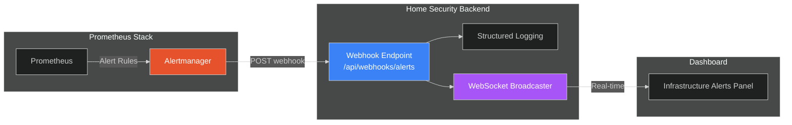
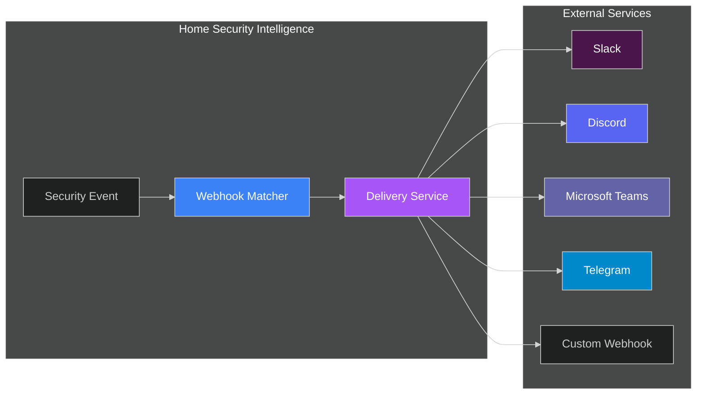

# Webhooks API

This guide covers both webhook receivers (incoming webhooks from systems like Prometheus Alertmanager) and outbound webhooks (sending notifications to external services like Slack, Discord, and Teams).

## Overview

The webhooks API provides endpoints for receiving notifications from external systems. Currently, the primary use case is receiving infrastructure alerts from Alertmanager, which monitors GPU memory, pipeline health, and other system metrics.

### Integration Architecture



**Data Flow:**

1. **Prometheus** evaluates alert rules (GPU memory high, pipeline stalled, etc.)
2. **Alertmanager** receives firing/resolved alerts and routes to configured receivers
3. **Webhook endpoint** receives POST with alert payload
4. **Backend** logs alerts with appropriate severity and broadcasts to WebSocket clients
5. **Frontend** displays infrastructure alerts alongside security alerts

---

## Endpoints

| Method | Endpoint               | Description                                |
| ------ | ---------------------- | ------------------------------------------ |
| POST   | `/api/webhooks/alerts` | Receive Alertmanager webhook notifications |

---

## Receive Alertmanager Webhook

Receive webhook notifications from Prometheus Alertmanager.

```bash
POST /api/webhooks/alerts
Content-Type: application/json
```

### Request Body

The payload follows the standard [Alertmanager webhook format](https://prometheus.io/docs/alerting/latest/configuration/#webhook_config).

```json
{
  "version": "4",
  "groupKey": "{}:{alertname=\"HSIGPUMemoryHigh\"}",
  "truncatedAlerts": 0,
  "status": "firing",
  "receiver": "hsi-backend",
  "groupLabels": {
    "alertname": "HSIGPUMemoryHigh"
  },
  "commonLabels": {
    "alertname": "HSIGPUMemoryHigh",
    "severity": "warning",
    "component": "gpu"
  },
  "commonAnnotations": {
    "summary": "GPU memory usage is high"
  },
  "externalURL": "http://alertmanager:9093",
  "alerts": [
    {
      "status": "firing",
      "labels": {
        "alertname": "HSIGPUMemoryHigh",
        "severity": "warning",
        "component": "gpu"
      },
      "annotations": {
        "summary": "GPU memory usage is high",
        "description": "GPU memory usage is above 90% for 5 minutes"
      },
      "startsAt": "2026-01-17T12:22:56.068Z",
      "endsAt": "0001-01-01T00:00:00Z",
      "generatorURL": "http://prometheus:9090/graph?g0.expr=...",
      "fingerprint": "example123"
    }
  ]
}
```

### Payload Fields

**Top-Level Fields:**

| Field               | Type   | Description                                  |
| ------------------- | ------ | -------------------------------------------- |
| `version`           | string | Alertmanager webhook version (currently "4") |
| `groupKey`          | string | Unique identifier for the alert group        |
| `truncatedAlerts`   | int    | Number of alerts truncated due to limits     |
| `status`            | string | Overall group status: `firing` or `resolved` |
| `receiver`          | string | Name of the receiver that matched            |
| `groupLabels`       | object | Labels used for grouping alerts              |
| `commonLabels`      | object | Labels common to all alerts in group         |
| `commonAnnotations` | object | Annotations common to all alerts             |
| `externalURL`       | string | Alertmanager external URL                    |
| `alerts`            | array  | List of individual alerts                    |

**Alert Fields:**

| Field          | Type     | Description                              |
| -------------- | -------- | ---------------------------------------- |
| `status`       | string   | Alert status: `firing` or `resolved`     |
| `labels`       | object   | Alert labels (alertname, severity, etc.) |
| `annotations`  | object   | Alert annotations (summary, description) |
| `startsAt`     | datetime | When the alert started firing            |
| `endsAt`       | datetime | When the alert resolved (null if firing) |
| `generatorURL` | string   | URL to Prometheus graph for this alert   |
| `fingerprint`  | string   | Unique identifier for deduplication      |

### Response

**Success (200 OK):**

```json
{
  "status": "ok",
  "received": 1,
  "processed": 1,
  "message": "Processed 1 alert(s) from hsi-backend"
}
```

**Validation Error (422):**

```json
{
  "detail": [
    {
      "loc": ["body", "alerts", 0, "status"],
      "msg": "field required",
      "type": "value_error.missing"
    }
  ]
}
```

---

## Alert Processing

### Logging Behavior

Alerts are logged with severity based on their status and labels:

| Alert Status | Severity Label | Log Level |
| ------------ | -------------- | --------- |
| `firing`     | `critical`     | ERROR     |
| `firing`     | `warning`      | WARNING   |
| `firing`     | `high`         | WARNING   |
| `firing`     | other          | INFO      |
| `resolved`   | any            | INFO      |

**Example Log Output:**

```
[ALERT FIRING] HSIGPUMemoryHigh (warning) - component=gpu: GPU memory usage is above 90%
[ALERT RESOLVED] HSIGPUMemoryHigh (warning) - component=gpu: resolved after firing since 2026-01-17T12:22:56Z
```

### WebSocket Broadcast

Alerts are broadcast to connected WebSocket clients as `infrastructure_alert` events:

```json
{
  "type": "infrastructure_alert",
  "data": {
    "alertname": "HSIGPUMemoryHigh",
    "status": "firing",
    "severity": "warning",
    "component": "gpu",
    "summary": "GPU memory usage is high",
    "description": "GPU memory usage is above 90% for 5 minutes",
    "started_at": "2026-01-17T12:22:56.068Z",
    "fingerprint": "example123",
    "receiver": "hsi-backend"
  }
}
```

**Note:** WebSocket broadcasting is performed as a background task and does not block the webhook response. If the broadcaster is not initialized, alerts are still logged but not broadcast.

---

## Common Alert Labels

The following labels are commonly used in Home Security Intelligence alerts:

| Label       | Description                       | Example Values                           |
| ----------- | --------------------------------- | ---------------------------------------- |
| `alertname` | Name of the alert rule            | `HSIGPUMemoryHigh`, `HSIPipelineStalled` |
| `severity`  | Alert severity level              | `critical`, `warning`, `info`            |
| `component` | System component affected         | `gpu`, `pipeline`, `redis`, `database`   |
| `camera_id` | Camera identifier (if applicable) | `front_door`, `backyard`                 |
| `service`   | Service name                      | `backend`, `ai`, `yolo26`, `nemotron`    |

---

## Alertmanager Configuration

### Basic Webhook Receiver

Configure Alertmanager to send alerts to the backend:

```yaml
# alertmanager.yml
receivers:
  - name: 'hsi-backend'
    webhook_configs:
      - url: 'http://backend:8000/api/webhooks/alerts'
        send_resolved: true
        max_alerts: 100

route:
  receiver: 'hsi-backend'
  group_by: ['alertname', 'component']
  group_wait: 30s
  group_interval: 5m
  repeat_interval: 4h
  routes:
    - match:
        severity: critical
      receiver: 'hsi-backend'
      repeat_interval: 1h
```

### Example Alert Rules

```yaml
# prometheus/rules/hsi.yml
groups:
  - name: hsi-infrastructure
    rules:
      - alert: HSIGPUMemoryHigh
        expr: gpu_memory_used_percent > 90
        for: 5m
        labels:
          severity: warning
          component: gpu
        annotations:
          summary: 'GPU memory usage is high'
          description: 'GPU memory usage is {{ $value }}% for 5 minutes'

      - alert: HSIPipelineStalled
        expr: rate(detections_processed_total[5m]) == 0
        for: 10m
        labels:
          severity: critical
          component: pipeline
        annotations:
          summary: 'Detection pipeline has stalled'
          description: 'No detections processed in the last 10 minutes'

      - alert: HSIRedisDown
        expr: up{job="redis"} == 0
        for: 1m
        labels:
          severity: critical
          component: redis
        annotations:
          summary: 'Redis is down'
          description: 'Redis service is unreachable'
```

---

## Error Handling

| Scenario                   | Behavior                                       |
| -------------------------- | ---------------------------------------------- |
| Invalid JSON payload       | Returns 422 with validation details            |
| Missing required fields    | Returns 422 with field-specific errors         |
| WebSocket broadcaster down | Alerts logged but not broadcast; returns 200   |
| Internal processing error  | Returns 500; alerts may be partially processed |

**Idempotency:** Alerts can be safely retried. The `fingerprint` field allows downstream systems to deduplicate repeated alerts.

---

## Outbound Webhooks

Outbound webhooks enable sending notifications to external systems (Slack, Discord, Teams, Telegram) when security events occur.

### Integration Architecture



**Data Flow:**

1. **Event occurs** - Security event, alert, or system health change
2. **Webhook matcher** - Finds webhooks subscribed to the event type
3. **Delivery service** - Sends payload with retry logic and records delivery status

---

### Endpoints

| Method | Endpoint                                                | Description            |
| ------ | ------------------------------------------------------- | ---------------------- |
| POST   | `/api/outbound-webhooks`                                | Create webhook         |
| GET    | `/api/outbound-webhooks`                                | List webhooks          |
| GET    | `/api/outbound-webhooks/{id}`                           | Get webhook by ID      |
| PATCH  | `/api/outbound-webhooks/{id}`                           | Update webhook         |
| DELETE | `/api/outbound-webhooks/{id}`                           | Delete webhook         |
| POST   | `/api/outbound-webhooks/{id}/test`                      | Test webhook           |
| POST   | `/api/outbound-webhooks/{id}/enable`                    | Enable webhook         |
| POST   | `/api/outbound-webhooks/{id}/disable`                   | Disable webhook        |
| GET    | `/api/outbound-webhooks/{id}/deliveries`                | List deliveries        |
| GET    | `/api/outbound-webhooks/deliveries/{delivery_id}`       | Get delivery details   |
| POST   | `/api/outbound-webhooks/deliveries/{delivery_id}/retry` | Retry failed delivery  |
| GET    | `/api/outbound-webhooks/health`                         | Webhook health summary |

---

### Create Webhook

Create a new outbound webhook configuration:

```bash
POST /api/outbound-webhooks
Content-Type: application/json

{
  "name": "Slack Alerts",
  "url": "https://hooks.slack.com/services/xxx/yyy/zzz",
  "event_types": ["alert_fired", "alert_dismissed"],
  "integration_type": "slack",
  "enabled": true,
  "auth": {"type": "none"},
  "custom_headers": {},
  "max_retries": 4,
  "retry_delay_seconds": 10
}
```

**Request Body Fields:**

| Field                 | Type    | Required | Description                               |
| --------------------- | ------- | -------- | ----------------------------------------- |
| `name`                | string  | Yes      | Human-readable webhook name (1-100 chars) |
| `url`                 | string  | Yes      | Webhook endpoint URL                      |
| `event_types`         | array   | Yes      | Events to subscribe to (at least one)     |
| `integration_type`    | string  | No       | Integration type (default: `generic`)     |
| `enabled`             | boolean | No       | Whether active (default: `true`)          |
| `auth`                | object  | No       | Authentication configuration              |
| `custom_headers`      | object  | No       | Additional HTTP headers                   |
| `payload_template`    | string  | No       | Custom Jinja2 payload template            |
| `max_retries`         | integer | No       | Max retry attempts (0-10, default: 4)     |
| `retry_delay_seconds` | integer | No       | Initial retry delay (1-3600, default: 10) |

**Response (201 Created):**

```json
{
  "id": "550e8400-e29b-41d4-a716-446655440000",
  "name": "Slack Alerts",
  "url": "https://hooks.slack.com/services/xxx/yyy/zzz",
  "event_types": ["alert_fired", "alert_dismissed"],
  "integration_type": "slack",
  "enabled": true,
  "custom_headers": {},
  "payload_template": null,
  "max_retries": 4,
  "retry_delay_seconds": 10,
  "created_at": "2026-01-17T10:00:00Z",
  "updated_at": "2026-01-17T10:00:00Z",
  "total_deliveries": 0,
  "successful_deliveries": 0,
  "last_delivery_at": null,
  "last_delivery_status": null
}
```

---

### Event Types

Webhooks can subscribe to the following event types:

| Event Type                 | Description                         |
| -------------------------- | ----------------------------------- |
| `alert_fired`              | Alert was triggered                 |
| `alert_dismissed`          | Alert was dismissed                 |
| `alert_acknowledged`       | Alert was acknowledged              |
| `event_created`            | Security event was created          |
| `event_enriched`           | Event was enriched with AI analysis |
| `entity_discovered`        | New entity was discovered           |
| `anomaly_detected`         | Anomaly was detected                |
| `system_health_changed`    | System health status changed        |
| `batch_analysis_started`   | Batch analysis processing started   |
| `batch_analysis_completed` | Batch analysis completed            |
| `batch_analysis_failed`    | Batch analysis failed               |

---

### Integration Types

Pre-built integrations with platform-specific payload formatting:

| Type       | Description                                   |
| ---------- | --------------------------------------------- |
| `generic`  | Custom webhook with configurable payload      |
| `slack`    | Slack incoming webhook (Block Kit formatting) |
| `discord`  | Discord webhook (embed formatting)            |
| `telegram` | Telegram bot (Markdown formatting)            |
| `teams`    | Microsoft Teams webhook (Adaptive Cards)      |

---

### Authentication

Webhook requests can be authenticated using several methods:

**No Authentication:**

```json
{ "type": "none" }
```

**Bearer Token:**

```json
{
  "type": "bearer",
  "token": "your-api-token"
}
```

**Basic Authentication:**

```json
{
  "type": "basic",
  "username": "webhook-user",
  "credential": "<your-credential>"
}
```

**Custom Header:**

```json
{
  "type": "header",
  "header_name": "X-API-Key",
  "header_value": "your-api-key"
}
```

---

### List Webhooks

```bash
GET /api/outbound-webhooks?enabled_only=true
```

**Parameters:**

| Name         | Type    | Default | Description                     |
| ------------ | ------- | ------- | ------------------------------- |
| enabled_only | boolean | false   | Filter to only enabled webhooks |

**Response:**

```json
{
  "webhooks": [...],
  "total": 5
}
```

---

### Test Webhook

Test a webhook configuration with a sample payload:

```bash
POST /api/outbound-webhooks/{id}/test
Content-Type: application/json

{
  "event_type": "alert_fired"
}
```

**Response:**

```json
{
  "success": true,
  "status_code": 200,
  "response_time_ms": 150,
  "response_body": "ok",
  "error_message": null
}
```

This does not create a delivery record and is useful for validating webhook configuration before enabling.

---

### Delivery History

Get delivery attempts for a webhook:

```bash
GET /api/outbound-webhooks/{id}/deliveries?limit=50&offset=0
```

**Response:**

```json
{
  "deliveries": [
    {
      "id": "delivery-uuid",
      "webhook_id": "webhook-uuid",
      "event_type": "alert_fired",
      "event_id": "event-123",
      "status": "success",
      "status_code": 200,
      "response_time_ms": 150,
      "error_message": null,
      "attempt_count": 1,
      "next_retry_at": null,
      "created_at": "2026-01-17T10:30:00Z",
      "delivered_at": "2026-01-17T10:30:00Z"
    }
  ],
  "total": 1,
  "limit": 50,
  "offset": 0,
  "has_more": false
}
```

**Delivery Status Values:**

| Status     | Description                         |
| ---------- | ----------------------------------- |
| `pending`  | Awaiting delivery                   |
| `success`  | Successfully delivered              |
| `failed`   | Delivery failed (after all retries) |
| `retrying` | Failed, scheduled for retry         |

---

### Retry Failed Delivery

Manually retry a failed delivery:

```bash
POST /api/outbound-webhooks/deliveries/{delivery_id}/retry
```

**Response:** Returns the new delivery attempt details.

**Errors:**

- `404` - Delivery not found
- `409` - Delivery cannot be retried (not in failed state)

---

### Webhook Health Summary

Get aggregated health metrics for all webhooks:

```bash
GET /api/outbound-webhooks/health
```

**Response:**

```json
{
  "total_webhooks": 5,
  "enabled_webhooks": 4,
  "healthy_webhooks": 3,
  "unhealthy_webhooks": 1,
  "total_deliveries_24h": 150,
  "successful_deliveries_24h": 145,
  "failed_deliveries_24h": 5,
  "average_response_time_ms": 125.5
}
```

**Health Criteria:**

- **Healthy**: >90% success rate in last 24 hours
- **Unhealthy**: <50% success rate in last 24 hours

---

### Update Webhook

```bash
PATCH /api/outbound-webhooks/{id}
Content-Type: application/json

{
  "enabled": false,
  "max_retries": 3
}
```

Only provided fields are updated.

---

### Enable/Disable Webhook

Quick endpoints to toggle webhook status:

```bash
POST /api/outbound-webhooks/{id}/enable
POST /api/outbound-webhooks/{id}/disable
```

---

### Delete Webhook

```bash
DELETE /api/outbound-webhooks/{id}
```

Returns `204 No Content`. Also deletes all associated delivery history.

---

## Related Documentation

- [Real-time API](realtime.md) - WebSocket event streams
- [System Operations API](system-ops.md) - Health monitoring and circuit breakers
