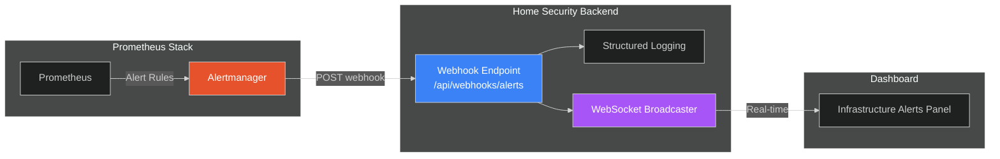

# Webhooks API

This guide covers webhook receivers for integrating with external monitoring systems, primarily Prometheus Alertmanager.

## Overview

The webhooks API provides endpoints for receiving notifications from external systems. Currently, the primary use case is receiving infrastructure alerts from Alertmanager, which monitors GPU memory, pipeline health, and other system metrics.

### Integration Architecture



**Data Flow:**

1. **Prometheus** evaluates alert rules (GPU memory high, pipeline stalled, etc.)
2. **Alertmanager** receives firing/resolved alerts and routes to configured receivers
3. **Webhook endpoint** receives POST with alert payload
4. **Backend** logs alerts with appropriate severity and broadcasts to WebSocket clients
5. **Frontend** displays infrastructure alerts alongside security alerts

---

## Endpoints

| Method | Endpoint               | Description                                |
| ------ | ---------------------- | ------------------------------------------ |
| POST   | `/api/webhooks/alerts` | Receive Alertmanager webhook notifications |

---

## Receive Alertmanager Webhook

Receive webhook notifications from Prometheus Alertmanager.

```bash
POST /api/webhooks/alerts
Content-Type: application/json
```

### Request Body

The payload follows the standard [Alertmanager webhook format](https://prometheus.io/docs/alerting/latest/configuration/#webhook_config).

```json
{
  "version": "4",
  "groupKey": "{}:{alertname=\"HSIGPUMemoryHigh\"}",
  "truncatedAlerts": 0,
  "status": "firing",
  "receiver": "hsi-backend",
  "groupLabels": {
    "alertname": "HSIGPUMemoryHigh"
  },
  "commonLabels": {
    "alertname": "HSIGPUMemoryHigh",
    "severity": "warning",
    "component": "gpu"
  },
  "commonAnnotations": {
    "summary": "GPU memory usage is high"
  },
  "externalURL": "http://alertmanager:9093",
  "alerts": [
    {
      "status": "firing",
      "labels": {
        "alertname": "HSIGPUMemoryHigh",
        "severity": "warning",
        "component": "gpu"
      },
      "annotations": {
        "summary": "GPU memory usage is high",
        "description": "GPU memory usage is above 90% for 5 minutes"
      },
      "startsAt": "2026-01-17T12:22:56.068Z",
      "endsAt": "0001-01-01T00:00:00Z",
      "generatorURL": "http://prometheus:9090/graph?g0.expr=...",
      "fingerprint": "example123"
    }
  ]
}
```

### Payload Fields

**Top-Level Fields:**

| Field               | Type   | Description                                  |
| ------------------- | ------ | -------------------------------------------- |
| `version`           | string | Alertmanager webhook version (currently "4") |
| `groupKey`          | string | Unique identifier for the alert group        |
| `truncatedAlerts`   | int    | Number of alerts truncated due to limits     |
| `status`            | string | Overall group status: `firing` or `resolved` |
| `receiver`          | string | Name of the receiver that matched            |
| `groupLabels`       | object | Labels used for grouping alerts              |
| `commonLabels`      | object | Labels common to all alerts in group         |
| `commonAnnotations` | object | Annotations common to all alerts             |
| `externalURL`       | string | Alertmanager external URL                    |
| `alerts`            | array  | List of individual alerts                    |

**Alert Fields:**

| Field          | Type     | Description                              |
| -------------- | -------- | ---------------------------------------- |
| `status`       | string   | Alert status: `firing` or `resolved`     |
| `labels`       | object   | Alert labels (alertname, severity, etc.) |
| `annotations`  | object   | Alert annotations (summary, description) |
| `startsAt`     | datetime | When the alert started firing            |
| `endsAt`       | datetime | When the alert resolved (null if firing) |
| `generatorURL` | string   | URL to Prometheus graph for this alert   |
| `fingerprint`  | string   | Unique identifier for deduplication      |

### Response

**Success (200 OK):**

```json
{
  "status": "ok",
  "received": 1,
  "processed": 1,
  "message": "Processed 1 alert(s) from hsi-backend"
}
```

**Validation Error (422):**

```json
{
  "detail": [
    {
      "loc": ["body", "alerts", 0, "status"],
      "msg": "field required",
      "type": "value_error.missing"
    }
  ]
}
```

---

## Alert Processing

### Logging Behavior

Alerts are logged with severity based on their status and labels:

| Alert Status | Severity Label | Log Level |
| ------------ | -------------- | --------- |
| `firing`     | `critical`     | ERROR     |
| `firing`     | `warning`      | WARNING   |
| `firing`     | `high`         | WARNING   |
| `firing`     | other          | INFO      |
| `resolved`   | any            | INFO      |

**Example Log Output:**

```
[ALERT FIRING] HSIGPUMemoryHigh (warning) - component=gpu: GPU memory usage is above 90%
[ALERT RESOLVED] HSIGPUMemoryHigh (warning) - component=gpu: resolved after firing since 2026-01-17T12:22:56Z
```

### WebSocket Broadcast

Alerts are broadcast to connected WebSocket clients as `infrastructure_alert` events:

```json
{
  "type": "infrastructure_alert",
  "data": {
    "alertname": "HSIGPUMemoryHigh",
    "status": "firing",
    "severity": "warning",
    "component": "gpu",
    "summary": "GPU memory usage is high",
    "description": "GPU memory usage is above 90% for 5 minutes",
    "started_at": "2026-01-17T12:22:56.068Z",
    "fingerprint": "example123",
    "receiver": "hsi-backend"
  }
}
```

**Note:** WebSocket broadcasting is performed as a background task and does not block the webhook response. If the broadcaster is not initialized, alerts are still logged but not broadcast.

---

## Common Alert Labels

The following labels are commonly used in Home Security Intelligence alerts:

| Label       | Description                       | Example Values                           |
| ----------- | --------------------------------- | ---------------------------------------- |
| `alertname` | Name of the alert rule            | `HSIGPUMemoryHigh`, `HSIPipelineStalled` |
| `severity`  | Alert severity level              | `critical`, `warning`, `info`            |
| `component` | System component affected         | `gpu`, `pipeline`, `redis`, `database`   |
| `camera_id` | Camera identifier (if applicable) | `front_door`, `backyard`                 |
| `service`   | Service name                      | `backend`, `ai`, `yolo26`, `nemotron`    |

---

## Alertmanager Configuration

### Basic Webhook Receiver

Configure Alertmanager to send alerts to the backend:

```yaml
# alertmanager.yml
receivers:
  - name: 'hsi-backend'
    webhook_configs:
      - url: 'http://backend:8000/api/webhooks/alerts'
        send_resolved: true
        max_alerts: 100

route:
  receiver: 'hsi-backend'
  group_by: ['alertname', 'component']
  group_wait: 30s
  group_interval: 5m
  repeat_interval: 4h
  routes:
    - match:
        severity: critical
      receiver: 'hsi-backend'
      repeat_interval: 1h
```

### Example Alert Rules

```yaml
# prometheus/rules/hsi.yml
groups:
  - name: hsi-infrastructure
    rules:
      - alert: HSIGPUMemoryHigh
        expr: gpu_memory_used_percent > 90
        for: 5m
        labels:
          severity: warning
          component: gpu
        annotations:
          summary: 'GPU memory usage is high'
          description: 'GPU memory usage is {{ $value }}% for 5 minutes'

      - alert: HSIPipelineStalled
        expr: rate(detections_processed_total[5m]) == 0
        for: 10m
        labels:
          severity: critical
          component: pipeline
        annotations:
          summary: 'Detection pipeline has stalled'
          description: 'No detections processed in the last 10 minutes'

      - alert: HSIRedisDown
        expr: up{job="redis"} == 0
        for: 1m
        labels:
          severity: critical
          component: redis
        annotations:
          summary: 'Redis is down'
          description: 'Redis service is unreachable'
```

---

## Error Handling

| Scenario                   | Behavior                                       |
| -------------------------- | ---------------------------------------------- |
| Invalid JSON payload       | Returns 422 with validation details            |
| Missing required fields    | Returns 422 with field-specific errors         |
| WebSocket broadcaster down | Alerts logged but not broadcast; returns 200   |
| Internal processing error  | Returns 500; alerts may be partially processed |

**Idempotency:** Alerts can be safely retried. The `fingerprint` field allows downstream systems to deduplicate repeated alerts.

---

## Related Documentation

- [Real-time API](realtime.md) - WebSocket event streams
- [System Operations API](system-ops.md) - Health monitoring and circuit breakers
