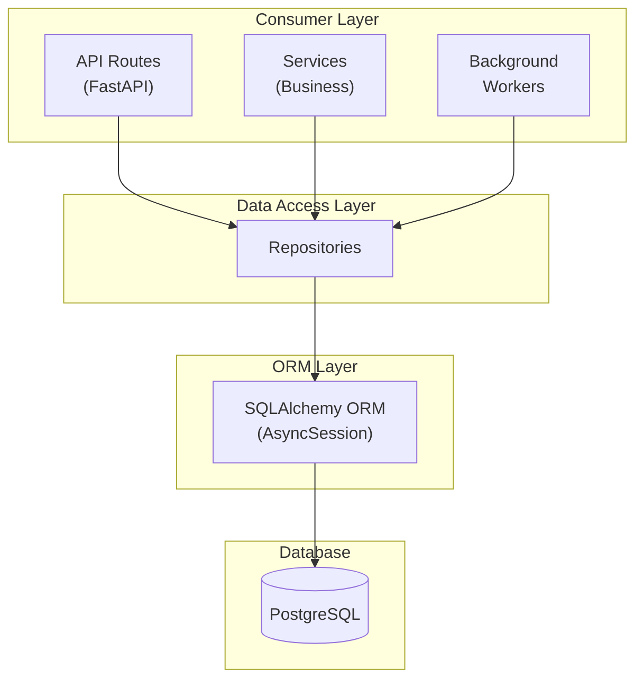

# Backend Architecture Patterns

> **Last Updated:** January 2026 | **Status:** Active

This document covers three key architectural patterns used in the backend:

1. **Repository Pattern** - Database access abstraction
2. **Result Type Pattern** - Structured operation outcomes
3. **RFC 7807 Problem Details** - Standardized error responses

---

## Architecture Diagrams


_Backend layered architecture showing the separation between API routes, services, repositories, and database._


_Backend initialization lifecycle showing the startup sequence and dependency injection._


_API middleware chain showing request processing through authentication, rate limiting, and error handling._

## Table of Contents

- [Repository Pattern](#repository-pattern)
  - [What It Is](#what-it-is)
  - [Why We Use It](#why-we-use-it)
  - [Architecture Overview](#architecture-overview)
  - [Base Repository Class](#base-repository-class)
  - [Creating Domain Repositories](#creating-domain-repositories)
  - [Usage Patterns](#usage-patterns)
  - [Best Practices](#best-practices)
- [Result Type Pattern](#result-type-pattern)
  - [Overview](#result-type-overview)
  - [Implementation](#result-type-implementation)
  - [Usage Examples](#result-type-usage-examples)
  - [When to Use](#when-to-use-result-types)
- [RFC 7807 Problem Details](#rfc-7807-problem-details)
  - [What Is RFC 7807](#what-is-rfc-7807)
  - [Our Implementation](#our-implementation)
  - [Error Response Format](#error-response-format)
  - [Creating Custom Error Types](#creating-custom-error-types)
  - [Exception Hierarchy](#exception-hierarchy)

---

## Repository Pattern

### What It Is

The Repository pattern is a design pattern that mediates between the domain and data mapping layers, acting as an in-memory collection of domain objects. In our codebase, repositories provide a clean, type-safe interface for database operations while hiding SQLAlchemy implementation details.

### Why We Use It

| Benefit                    | Description                                                   |
| -------------------------- | ------------------------------------------------------------- |
| **Separation of Concerns** | Database logic is isolated from business logic and API routes |
| **Testability**            | Easy to mock repositories for unit testing without a database |
| **Type Safety**            | Generic base class with full type hints via `Repository[T]`   |
| **Consistency**            | Standard CRUD operations across all entity types              |
| **Query Encapsulation**    | Complex queries are encapsulated in repository methods        |

### Architecture Overview



**Repository Hierarchy:**

```
Repository[T] (Generic Base)
  |-- CameraRepository
  |-- EventRepository
  +-- DetectionRepository
```

### Base Repository Class

The base `Repository[T]` class provides common CRUD operations for all entity types:

```python
# backend/repositories/base.py
from typing import Generic, TypeVar, Any
from collections.abc import Sequence
from sqlalchemy import func, select
from sqlalchemy.ext.asyncio import AsyncSession

T = TypeVar("T", bound="Base")

class Repository(Generic[T]):
    """Generic repository base class providing common CRUD operations."""

    model_class: type[T]  # Subclasses must set this

    def __init__(self, session: AsyncSession) -> None:
        self.session = session
```

**Available Methods:**

| Method                        | Description                    | Return Type   |
| ----------------------------- | ------------------------------ | ------------- |
| `get_by_id(id)`               | Retrieve entity by primary key | `T \| None`   |
| `get_all()`                   | Retrieve all entities          | `Sequence[T]` |
| `list_paginated(skip, limit)` | Retrieve with pagination       | `Sequence[T]` |
| `get_many(ids)`               | Retrieve multiple by IDs       | `Sequence[T]` |
| `create(entity)`              | Create new entity              | `T`           |
| `create_many(entities)`       | Batch create entities          | `Sequence[T]` |
| `update(entity)`              | Update existing entity         | `T`           |
| `merge(entity)`               | Merge detached entity          | `T`           |
| `save(entity)`                | Upsert (create or update)      | `T`           |
| `delete(entity)`              | Delete entity                  | `None`        |
| `delete_by_id(id)`            | Delete by primary key          | `bool`        |
| `exists(id)`                  | Check if entity exists         | `bool`        |
| `count()`                     | Count total entities           | `int`         |

### Creating Domain Repositories

To create a repository for a specific entity:

```python
# backend/repositories/camera_repository.py
from backend.models import Camera
from backend.repositories.base import Repository

class CameraRepository(Repository[Camera]):
    """Repository for Camera entity database operations."""

    model_class = Camera  # Required: set the model class

    # Add domain-specific methods
    async def get_by_folder_path(self, folder_path: str) -> Camera | None:
        """Find a camera by its upload folder path."""
        stmt = select(Camera).where(Camera.folder_path == folder_path)
        result = await self.session.execute(stmt)
        return result.scalar_one_or_none()

    async def get_online_cameras(self) -> Sequence[Camera]:
        """Get all cameras with status='online'."""
        return await self.get_by_status("online")

    async def get_by_status(self, status: str) -> Sequence[Camera]:
        """Get all cameras with a specific status."""
        stmt = select(Camera).where(Camera.status == status)
        result = await self.session.execute(stmt)
        return result.scalars().all()

    async def update_last_seen(self, camera_id: str) -> Camera | None:
        """Update a camera's last_seen_at timestamp."""
        camera = await self.get_by_id(camera_id)
        if camera is None:
            return None
        camera.last_seen_at = datetime.now(UTC)
        await self.session.flush()
        await self.session.refresh(camera)
        return camera
```

### Usage Patterns

#### In API Routes (Dependency Injection)

```python
from fastapi import APIRouter, Depends, HTTPException
from sqlalchemy.ext.asyncio import AsyncSession

from backend.core.database import get_db
from backend.repositories import CameraRepository

router = APIRouter()

@router.get("/cameras/{camera_id}")
async def get_camera(
    camera_id: str,
    db: AsyncSession = Depends(get_db),
):
    repo = CameraRepository(db)
    camera = await repo.get_by_id(camera_id)
    if not camera:
        raise HTTPException(status_code=404, detail="Camera not found")
    return camera
```

#### In Services (Context Manager)

```python
from backend.core.database import get_session
from backend.repositories import EventRepository

async def process_unreviewed_events():
    async with get_session() as session:
        repo = EventRepository(session)
        unreviewed = await repo.get_unreviewed()

        for event in unreviewed:
            # Process each event
            await process_event(event)
            await repo.mark_reviewed(event.id, notes="Processed automatically")
```

#### Transaction Handling

Repositories work within the session's transaction context. Multiple repository operations share the same transaction:

```python
async with get_session() as session:
    camera_repo = CameraRepository(session)
    event_repo = EventRepository(session)

    # Both operations in same transaction
    camera = await camera_repo.get_by_id("front_door")
    events = await event_repo.get_by_camera_id(camera.id)

    # Update both entities
    camera.status = "active"
    for event in events:
        event.reviewed = True

    # Session auto-commits on context exit (or rollbacks on error)
```

#### Paginated Queries

```python
async def list_events_paginated(
    page: int = 1,
    per_page: int = 20,
    db: AsyncSession = Depends(get_db),
):
    repo = EventRepository(db)
    skip = (page - 1) * per_page
    events = await repo.list_paginated(skip=skip, limit=per_page)
    total = await repo.count()

    return {
        "events": events,
        "page": page,
        "per_page": per_page,
        "total": total,
        "pages": (total + per_page - 1) // per_page,
    }
```

### Best Practices

1. **Always use async methods** - All repository methods are async for non-blocking I/O

2. **Keep repositories thin** - Domain logic belongs in services, not repositories

3. **Use type hints** - The generic `Repository[T]` provides full type inference

4. **Encapsulate complex queries** - Add custom methods for domain-specific queries:

   ```python
   async def get_high_risk_events(self, threshold: int = 70) -> Sequence[Event]:
       """Get events with risk score at or above threshold."""
       stmt = select(Event).where(Event.risk_score >= threshold)
       result = await self.session.execute(stmt)
       return result.scalars().all()
   ```

5. **Handle None returns** - Methods like `get_by_id` return `None` if not found

6. **Use `list_paginated()` for large tables** - Avoid loading all records with `get_all()`

7. **Prefer `exists()` over `get_by_id()` for existence checks** - More efficient

---

## Result Type Pattern

### Result Type Overview

The Result type pattern provides a structured way to represent operation outcomes that can either succeed with a value or fail with an error. Unlike exceptions that can propagate unexpectedly, Result types make success and failure states explicit in the type signature.

### Result Type Implementation

Our codebase uses dataclass-based Result types for operations that can fail:

```python
# backend/services/retry_handler.py
from dataclasses import dataclass
from typing import Any

@dataclass(slots=True)
class RetryResult:
    """Result of a retry operation."""

    success: bool
    result: Any = None
    error: str | None = None
    attempts: int = 0
    moved_to_dlq: bool = False
```

**Key Characteristics:**

- `success` - Boolean indicating operation outcome
- `result` - The actual value when successful
- `error` - Error message when failed
- Additional context fields as needed

### Result Type Usage Examples

#### Creating Results

```python
# Success case
def successful_operation() -> RetryResult:
    data = perform_operation()
    return RetryResult(
        success=True,
        result=data,
        attempts=1,
    )

# Failure case
def failed_operation() -> RetryResult:
    return RetryResult(
        success=False,
        error="Operation timed out after 3 attempts",
        attempts=3,
        moved_to_dlq=True,
    )
```

#### Consuming Results

```python
async def process_with_retry(job_data: dict) -> None:
    handler = RetryHandler(redis_client)

    result = await handler.with_retry(
        operation=detect_objects,
        job_data=job_data,
        queue_name="detection_queue",
    )

    if result.success:
        # Handle successful result
        detections = result.result
        await save_detections(detections)
    else:
        # Handle failure
        logger.error(
            f"Detection failed: {result.error}",
            extra={
                "attempts": result.attempts,
                "moved_to_dlq": result.moved_to_dlq,
            }
        )
```

#### Domain-Specific Result Types

```python
# backend/services/alert_dedup.py
@dataclass(slots=True)
class DedupResult:
    """Result of deduplication check."""

    is_duplicate: bool
    existing_alert: Alert | None = None
    seconds_until_cooldown_expires: int | None = None

    @property
    def existing_alert_id(self) -> str | None:
        """Get the ID of the existing alert if duplicate."""
        return self.existing_alert.id if self.existing_alert else None

# Usage
async def check_duplicate(dedup_key: str, cooldown_seconds: int = 300) -> DedupResult:
    """Check if an alert with the same dedup_key exists within cooldown."""
    cutoff_time = datetime.now(UTC) - timedelta(seconds=cooldown_seconds)

    # Query for existing alert within cooldown window
    stmt = (
        select(Alert)
        .where(Alert.dedup_key == dedup_key)
        .where(Alert.created_at >= cutoff_time)
        .order_by(Alert.created_at.desc())
        .limit(1)
    )
    result = await session.execute(stmt)
    existing_alert = result.scalar_one_or_none()

    if existing_alert:
        alert_age = (datetime.now(UTC) - existing_alert.created_at).total_seconds()
        seconds_remaining = max(0, int(cooldown_seconds - alert_age))
        return DedupResult(
            is_duplicate=True,
            existing_alert=existing_alert,
            seconds_until_cooldown_expires=seconds_remaining,
        )

    return DedupResult(is_duplicate=False)
```

### When to Use Result Types

| Use Result Types When           | Use Exceptions When                   |
| ------------------------------- | ------------------------------------- |
| Failure is expected and normal  | Failure is exceptional and rare       |
| Caller must handle failure      | Error should propagate up the stack   |
| Multiple failure modes exist    | Single failure mode with HTTP mapping |
| Background job processing       | Request/response API handling         |
| Retry logic with state tracking | Simple pass/fail operations           |

**Examples in Our Codebase:**

- `RetryResult` - Retry handler outcomes with attempt counts
- `DedupResult` - Deduplication check with cooldown info
- `DeliveryResult` - Notification delivery with per-channel status
- `EvaluationResult` - Alert rule evaluation outcomes

---

## RFC 7807 Problem Details

### What Is RFC 7807

[RFC 7807](https://tools.ietf.org/html/rfc7807) "Problem Details for HTTP APIs" defines a standardized format for machine-readable error responses. It provides a consistent structure that clients can parse programmatically.

**Key Benefits:**

- **Standardized** - Industry-standard format recognized by HTTP clients
- **Machine-Readable** - Structured JSON that clients can parse
- **Extensible** - Can add custom fields while remaining compliant
- **Self-Documenting** - Includes URIs for problem type documentation

### Our Implementation

Error responses use the `application/problem+json` media type with RFC 7807 structure:

```python
# backend/api/schemas/problem_details.py
from pydantic import BaseModel, Field

class ProblemDetail(BaseModel):
    """RFC 7807 Problem Details object for API error responses."""

    type: str = Field(
        default="about:blank",
        description="A URI reference that identifies the problem type.",
    )

    title: str = Field(
        ...,
        description="A short, human-readable summary of the problem type.",
    )

    status: int = Field(
        ...,
        ge=100,
        le=599,
        description="The HTTP status code.",
    )

    detail: str = Field(
        ...,
        description="A human-readable explanation specific to this occurrence.",
    )

    instance: str | None = Field(
        default=None,
        description="A URI reference identifying the specific occurrence.",
    )
```

### Error Response Format

**Standard Error Response:**

```json
{
  "type": "about:blank",
  "title": "Not Found",
  "status": 404,
  "detail": "Camera 'front_door' does not exist",
  "instance": "/api/cameras/front_door"
}
```

**Field Descriptions:**

| Field      | Required | Description                  | Example                                |
| ---------- | -------- | ---------------------------- | -------------------------------------- |
| `type`     | No       | URI identifying problem type | `"about:blank"` or custom URI          |
| `title`    | Yes      | Standard HTTP status phrase  | `"Not Found"`                          |
| `status`   | Yes      | HTTP status code (100-599)   | `404`                                  |
| `detail`   | Yes      | Specific error message       | `"Camera 'front_door' does not exist"` |
| `instance` | No       | Request path or error ID     | `"/api/cameras/front_door"`            |

**Common Error Responses:**

```json
// 400 Bad Request
{
    "type": "about:blank",
    "title": "Bad Request",
    "status": 400,
    "detail": "The 'limit' parameter must be a positive integer",
    "instance": "/api/events"
}

// 401 Unauthorized
{
    "type": "about:blank",
    "title": "Unauthorized",
    "status": 401,
    "detail": "Missing or invalid API key",
    "instance": "/api/cameras"
}

// 409 Conflict
{
    "type": "about:blank",
    "title": "Conflict",
    "status": 409,
    "detail": "Camera with name 'Front Door' already exists",
    "instance": "/api/cameras"
}

// 503 Service Unavailable
{
    "type": "about:blank",
    "title": "Service Unavailable",
    "status": 503,
    "detail": "AI detection service is temporarily unavailable",
    "instance": "/api/detections"
}
```

### Creating Custom Error Types

#### Using HTTPException

For simple cases, raise `HTTPException` which is automatically converted to RFC 7807:

```python
from fastapi import HTTPException

@router.get("/cameras/{camera_id}")
async def get_camera(camera_id: str):
    camera = await repo.get_by_id(camera_id)
    if not camera:
        raise HTTPException(
            status_code=404,
            detail=f"Camera '{camera_id}' does not exist"
        )
    return camera
```

#### Using Custom Exceptions

For domain-specific errors with additional context:

```python
# backend/core/exceptions.py
from typing import Any

class SecurityIntelligenceError(Exception):
    """Base exception for all application-specific errors."""

    default_message: str = "An unexpected error occurred"
    default_error_code: str = "INTERNAL_ERROR"
    default_status_code: int = 500

    def __init__(
        self,
        message: str | None = None,
        *,
        error_code: str | None = None,
        status_code: int | None = None,
        details: dict[str, Any] | None = None,
    ) -> None:
        self.message = message or self.default_message
        self.error_code = error_code or self.default_error_code
        self.status_code = status_code or self.default_status_code
        self.details = details or {}
        super().__init__(self.message)


class CameraNotFoundError(SecurityIntelligenceError):
    """Raised when a camera is not found."""

    default_error_code = "CAMERA_NOT_FOUND"
    default_status_code = 404

    def __init__(self, camera_id: str, **kwargs: Any) -> None:
        message = f"Camera with id '{camera_id}' not found"
        details = kwargs.pop("details", {}) or {}
        details["camera_id"] = camera_id
        super().__init__(message, details=details, **kwargs)
```

### Exception Hierarchy

Our exception hierarchy maps directly to HTTP status codes:

```
SecurityIntelligenceError (base)
│
├── ValidationError (400)
│   ├── InvalidInputError
│   ├── DateRangeValidationError
│   └── BoundingBoxValidationError
│
├── AuthenticationError (401)
├── AuthorizationError (403)
│
├── NotFoundError (404)
│   ├── CameraNotFoundError
│   ├── EventNotFoundError
│   ├── DetectionNotFoundError
│   └── MediaNotFoundError
│
├── ConflictError (409)
│   ├── DuplicateResourceError
│   └── PromptVersionConflictError
│
├── RateLimitError (429)
│
├── ExternalServiceError (503)
│   ├── AIServiceError
│   │   ├── DetectorUnavailableError
│   │   ├── AnalyzerUnavailableError
│   │   └── EnrichmentUnavailableError
│   ├── DatabaseError
│   ├── CacheError
│   └── CircuitBreakerOpenError
│
└── InternalError (500)
    ├── ConfigurationError
    └── ProcessingError
```

#### Exception Handler Registration

Exception handlers are registered in `backend/api/exception_handlers.py`:

```python
def register_exception_handlers(app: FastAPI) -> None:
    """Register all exception handlers with the FastAPI application."""

    # Standard HTTP exceptions - RFC 7807 format
    app.add_exception_handler(
        StarletteHTTPException,
        problem_details_exception_handler,
    )

    # Application-specific exceptions
    app.add_exception_handler(
        SecurityIntelligenceError,
        security_intelligence_exception_handler,
    )

    # Database errors
    app.add_exception_handler(SQLAlchemyError, sqlalchemy_exception_handler)

    # Redis errors
    app.add_exception_handler(RedisError, redis_exception_handler)

    # Catch-all for unhandled exceptions
    app.add_exception_handler(Exception, generic_exception_handler)
```

#### Using Custom Exceptions in Routes

```python
from backend.core.exceptions import (
    CameraNotFoundError,
    DetectorUnavailableError,
    ValidationError,
)

@router.get("/cameras/{camera_id}")
async def get_camera(camera_id: str, db: AsyncSession = Depends(get_db)):
    repo = CameraRepository(db)
    camera = await repo.get_by_id(camera_id)

    if not camera:
        raise CameraNotFoundError(camera_id)

    return camera


@router.post("/detect")
async def detect_objects(image_path: str):
    if not image_path.startswith("/export/foscam/"):
        raise ValidationError(
            "Invalid image path",
            details={"path": image_path, "constraint": "Must be under /export/foscam/"}
        )

    try:
        result = await detector_client.detect(image_path)
    except TimeoutError as e:
        raise DetectorUnavailableError(
            "Detection timed out after 30 seconds",
            original_error=e,
        )

    return result
```

---

## Related Documentation

- [Backend Architecture](../architecture/overview.md) - System design overview
- [Data Model Reference](data-model.md) - Database schema documentation
- [Testing Guide](../development/testing.md) - Testing patterns and fixtures
- [API Reference](api/README.md) - REST API documentation

---

## Quick Reference

### Repository Pattern

```python
# Define repository
class MyRepository(Repository[MyModel]):
    model_class = MyModel

# Use in route
repo = MyRepository(session)
entity = await repo.get_by_id(id)
```

### Result Type

```python
# Define result type
@dataclass
class MyResult:
    success: bool
    value: Any = None
    error: str | None = None

# Return result
return MyResult(success=True, value=data)
```

### RFC 7807 Error

```python
# Raise HTTP exception (auto-converted to RFC 7807)
raise HTTPException(status_code=404, detail="Not found")

# Raise custom exception
raise CameraNotFoundError(camera_id)
```
