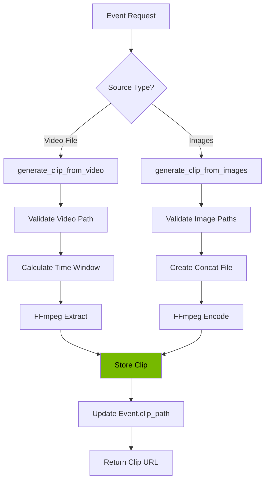

# Clip Generation

> Technical documentation for the event clip generation service using FFmpeg.

**Time to read:** ~8 min
**Prerequisites:** [Video Processing](video.md), [Data Model](data-model.md)

---

## Overview

The ClipGenerator service creates video clips from security events for easy review. It supports two generation modes:

1. **Video source extraction:** Extract segments from existing video files
2. **Image sequence compilation:** Create MP4/GIF from detection frame sequences

## Architecture



## Service API

### ClipGenerator Class

**Location:** `backend/services/clip_generator.py`

```python
from backend.services.clip_generator import ClipGenerator, get_clip_generator

# Use singleton instance
generator = get_clip_generator()

# Or create custom instance
generator = ClipGenerator(
    clips_directory="data/clips",
    pre_roll_seconds=5,
    post_roll_seconds=5,
    enabled=True,
)
```

### Configuration

| Setting             | Default      | Environment Variable      | Description                |
| ------------------- | ------------ | ------------------------- | -------------------------- |
| `clips_directory`   | `data/clips` | `CLIPS_DIRECTORY`         | Output directory for clips |
| `pre_roll_seconds`  | 5            | `CLIP_PRE_ROLL_SECONDS`   | Seconds before event start |
| `post_roll_seconds` | 5            | `CLIP_POST_ROLL_SECONDS`  | Seconds after event end    |
| `enabled`           | `true`       | `CLIP_GENERATION_ENABLED` | Enable/disable generation  |

### Methods

#### `generate_clip_from_video()`

Extract a clip from an existing video file:

```python
clip_path = await generator.generate_clip_from_video(
    event=event,
    video_path="/path/to/source.mp4",
    pre_seconds=5,   # Override default pre-roll
    post_seconds=10, # Override default post-roll
)
```

**Parameters:**

| Parameter      | Type        | Required | Description                  |
| -------------- | ----------- | -------- | ---------------------------- |
| `event`        | `Event`     | Yes      | Event model with timestamps  |
| `video_path`   | `Path\|str` | Yes      | Path to source video         |
| `pre_seconds`  | `int`       | No       | Seconds before event (0-300) |
| `post_seconds` | `int`       | No       | Seconds after event (0-300)  |

**Returns:** `Path` to clip file or `None` on failure

#### `generate_clip_from_images()`

Create a video from image sequence:

```python
clip_path = await generator.generate_clip_from_images(
    event=event,
    image_paths=["/path/frame1.jpg", "/path/frame2.jpg"],
    fps=2,
    output_format="mp4",  # or "gif"
)
```

**Parameters:**

| Parameter       | Type         | Required | Description                         |
| --------------- | ------------ | -------- | ----------------------------------- |
| `event`         | `Event`      | Yes      | Event model for association         |
| `image_paths`   | `list[Path]` | Yes      | Ordered list of image paths         |
| `fps`           | `int`        | No       | Frames per second (1-60, default 2) |
| `output_format` | `str`        | No       | `mp4` or `gif`                      |

**Returns:** `Path` to clip file or `None` on failure

#### `generate_clip_for_event()`

Convenience method that chooses the best generation strategy:

```python
clip_path = await generator.generate_clip_for_event(
    event=event,
    video_path=video_path,     # Optional
    image_paths=image_paths,   # Optional
    fps=2,
)
```

Prefers video source if provided, falls back to image sequence.

#### `get_clip_path()`

Get existing clip path for an event:

```python
path = generator.get_clip_path(event_id=123)
# Returns Path or None if not found
```

Checks for both `.mp4` and `.gif` extensions.

#### `delete_clip()`

Delete a clip file:

```python
success = generator.delete_clip(event_id=123)
```

---

## FFmpeg Integration

### Video Extraction Command

```bash
ffmpeg -y \
    -ss {pre_seconds} \
    -i {input_path} \
    -t {duration} \
    -c:v libx264 \
    -preset fast \
    -crf 23 \
    -c:a copy \
    -movflags +faststart \
    {output_path}
```

**Flags:**

| Flag                   | Purpose                            |
| ---------------------- | ---------------------------------- |
| `-y`                   | Overwrite output without prompting |
| `-ss`                  | Seek to start position             |
| `-t`                   | Limit duration                     |
| `-c:v libx264`         | H.264 video codec                  |
| `-preset fast`         | Encoding speed/quality tradeoff    |
| `-crf 23`              | Constant rate factor (quality)     |
| `-c:a copy`            | Copy audio stream if present       |
| `-movflags +faststart` | Enable web streaming               |

### Image Sequence Command (MP4)

```bash
ffmpeg -y \
    -f concat \
    -safe 0 \
    -i {concat_file} \
    -c:v libx264 \
    -preset fast \
    -crf 23 \
    -pix_fmt yuv420p \
    -movflags +faststart \
    {output_path}
```

### Image Sequence Command (GIF)

```bash
ffmpeg -y \
    -f concat \
    -safe 0 \
    -i {concat_file} \
    -vf "fps={fps},scale=320:-1:flags=lanczos" \
    -loop 0 \
    {output_path}
```

### Concat File Format

```text
file '/path/to/frame1.jpg'
duration 0.5
file '/path/to/frame2.jpg'
duration 0.5
file '/path/to/frame2.jpg'
```

The last frame is repeated to ensure it displays.

---

## REST API Endpoints

### GET `/api/events/{event_id}/clip`

Get clip information for an event.

**Response Schema:** `ClipInfoResponse`

```json
{
  "event_id": 123,
  "clip_available": true,
  "clip_url": "/api/media/clips/123_clip.mp4",
  "duration_seconds": 30,
  "generated_at": "2026-01-03T10:30:00Z",
  "file_size_bytes": 5242880
}
```

### POST `/api/events/{event_id}/clip/generate`

Trigger clip generation for an event.

**Request Schema:** `ClipGenerateRequest`

```json
{
  "start_offset_seconds": -15,
  "end_offset_seconds": 30,
  "force": false
}
```

**Validation (NEM-1355):**

- `start_offset_seconds`: -30 to 3600
- `end_offset_seconds`: -30 to 3600
- `end_offset_seconds` must be >= `start_offset_seconds`

**Response Schema:** `ClipGenerateResponse`

```json
{
  "event_id": 123,
  "status": "completed",
  "clip_url": "/api/media/clips/123_clip.mp4",
  "generated_at": "2026-01-03T10:30:00Z",
  "message": "Clip generated successfully"
}
```

**Status Values:**

| Status      | Description                       |
| ----------- | --------------------------------- |
| `pending`   | Generation queued                 |
| `completed` | Clip ready for playback           |
| `failed`    | Generation failed (check message) |

### GET `/api/media/clips/{filename}`

Serve clip file for playback/download.

---

## Storage and Retention

### File Naming

| Clip Type | Pattern               |
| --------- | --------------------- |
| MP4       | `{event_id}_clip.mp4` |
| GIF       | `{event_id}_clip.gif` |

### Storage Location

Clips are stored in the configured `clips_directory` (default: `data/clips/`).

### Retention

Clips follow the same 30-day retention policy as events. The `CleanupService` handles automatic deletion.

---

## Security Considerations

### Input Validation

All user inputs are validated before use in subprocess calls:

```python
def _validate_video_path(video_path: str | Path) -> Path:
    """Prevent command injection via path manipulation."""
    video_path_obj = Path(video_path).resolve()

    # File must exist
    if not video_path_obj.exists():
        raise ValueError(f"Video file not found: {video_path}")

    # Must be a file, not directory
    if not video_path_obj.is_file():
        raise ValueError(f"Path is not a file: {video_path}")

    # Prevent paths that look like command-line options
    if str(video_path_obj).startswith("-"):
        raise ValueError(f"Invalid video path: {video_path}")

    return video_path_obj
```

### Subprocess Execution

- **Never** use `shell=True`
- Commands built as list arguments
- FFmpeg output captured to prevent information leakage
- Error messages sanitized before returning to API

### Path Escaping

Single quotes in file paths are escaped for FFmpeg concat format:

```python
escaped_path = str(img_path).replace("'", "'\\''")
```

---

## Error Handling

### ClipGenerationError

Custom exception for generation failures:

```python
from backend.services.clip_generator import ClipGenerationError

try:
    path = await generator.generate_clip_from_video(event, video_path)
except ClipGenerationError as e:
    logger.error(f"Clip generation failed: {e}")
```

### Common Failure Modes

| Error                   | Cause                   | Resolution                    |
| ----------------------- | ----------------------- | ----------------------------- |
| `ffmpeg not found`      | FFmpeg not installed    | Install FFmpeg                |
| `Video file not found`  | Source video missing    | Verify path, check FTP upload |
| `No valid images found` | Image paths invalid     | Check detection file paths    |
| `Invalid clip duration` | Duration < 0 or > 3600s | Adjust time offsets           |

---

## Frontend Integration

### EventVideoPlayer Component

**Location:** `frontend/src/components/events/EventVideoPlayer.tsx`

The component handles:

1. Checking clip availability on mount
2. Displaying generate button if no clip exists
3. Showing loading state during generation
4. Playing clip via HTML5 video element
5. Download button for saving clips

**API Functions:**

```typescript
import { fetchEventClipInfo, generateEventClip, getEventClipUrl } from '../../services/api';

// Check availability
const info = await fetchEventClipInfo(eventId);

// Generate clip
const response = await generateEventClip(eventId);

// Get playback URL
const url = getEventClipUrl(info.clip_url);
```

---

## Testing

### Unit Tests

**Location:** `backend/tests/unit/services/test_clip_generator.py`

```bash
uv run pytest backend/tests/unit/services/test_clip_generator.py -v
```

### Integration Tests

Requires FFmpeg installation:

```bash
uv run pytest backend/tests/integration/services/test_clip_generator_integration.py -v
```

### Mocking FFmpeg

For unit tests without FFmpeg:

```python
from unittest.mock import AsyncMock, patch

@patch('asyncio.create_subprocess_exec')
async def test_generation(mock_exec):
    mock_process = AsyncMock()
    mock_process.returncode = 0
    mock_process.communicate.return_value = (b'', b'')
    mock_exec.return_value = mock_process

    # Test code here
```

---

## Performance Considerations

### FFmpeg Options

| Preset    | Speed    | File Size | Quality |
| --------- | -------- | --------- | ------- |
| ultrafast | Fastest  | Largest   | Lowest  |
| fast      | Fast     | Good      | Good    |
| medium    | Moderate | Smaller   | Better  |
| slow      | Slow     | Smallest  | Best    |

Default preset is `fast` for balanced performance.

### Memory Usage

- Image sequences: Each image loaded briefly for validation
- Video extraction: FFmpeg handles streaming, low memory
- Temporary concat file created and cleaned up after encoding

---

## Next Steps

- [Video Processing](video.md) - Frame extraction and video metadata
- [Detection Service](detection-service.md) - How detections are created
- [Entity Tracking](entity-tracking.md) - Re-identification across cameras

---

## See Also

- [Event Timeline API](../architecture/rest-api.md) - Event endpoints
- [Data Model](data-model.md) - Event.clip_path field
- [Cleanup Service](../reference/config/env-reference.md) - Retention settings

---

[Back to Developer Hub](../developer-hub.md)
