# Contributing Guide

> Complete guide for contributing to Home Security Intelligence: workflow, code quality, and best practices.

Thank you for contributing to Home Security Intelligence! This guide covers the development workflow, code standards, and review process.

---

## Code of Conduct

Be respectful, professional, and constructive in all interactions. Focus on the code, not the person.

---

## Quick Start

```bash
# 1. Set up development environment
python setup.py               # Generate .env (the sole config source — no override file is written)
uv sync --extra dev           # Install Python dependencies
cd frontend && npm install    # Install frontend dependencies

# 2. Install pre-commit hooks
pre-commit install
pre-commit install --hook-type pre-push

# 3. Start services
podman-compose -f docker-compose.prod.yml up -d postgres redis

# 4. Run validation
./scripts/validate.sh
```

### Before You Start

1. Set up your development environment following [setup.md](../local-setup.md)
2. Read [AGENTS.md](../../../AGENTS.md) for project rules and conventions
3. Review the [testing guide](../testing.md) to understand test requirements

---

## Development Workflow

```mermaid
%%{init: {
  'theme': 'dark',
  'themeVariables': {
    'primaryColor': '#3B82F6',
    'primaryTextColor': '#FFFFFF',
    'primaryBorderColor': '#60A5FA',
    'secondaryColor': '#A855F7',
    'tertiaryColor': '#009688',
    'background': '#121212',
    'mainBkg': '#1a1a2e',
    'lineColor': '#666666'
  }
}}%%
flowchart LR
    subgraph Linear["Task Tracking"]
        CLAIM["Claim task<br/>In Progress"]
    end

    subgraph Local["Local Development"]
        BRANCH["Create branch"]
        CODE["Implement"]
        TEST["Write tests"]
        COMMIT["Commit"]
    end

    subgraph Remote["GitHub"]
        PUSH["Push"]
        PR["Create PR"]
        REVIEW["Review"]
        MERGE["Merge"]
    end

    CLAIM --> BRANCH --> CODE --> TEST --> COMMIT --> PUSH --> PR --> REVIEW --> MERGE

    style CLAIM fill:#76B900,stroke:#84CC16,color:#FFFFFF
    style TEST fill:#3B82F6,stroke:#60A5FA,color:#FFFFFF
    style REVIEW fill:#A855F7,stroke:#C084FC,color:#FFFFFF
    style MERGE fill:#16A34A,stroke:#22C55E,color:#FFFFFF
```



### 1. Find and Claim Work

This project uses **Linear** for issue tracking:

- **Workspace:** [nemotron-v3-home-security](https://linear.app/nemotron-v3-home-security)
- **Team:** NEM
- **Issue format:** NEM-123
- **Active Issues:** [View Active](https://linear.app/nemotron-v3-home-security/team/NEM/active)

Filter by phase labels (phase-1 through phase-8) to find work appropriate for current project stage — e.g. <https://linear.app/nemotron-v3-home-security/team/NEM/label/phase-3>.

```bash
# View and claim tasks via Linear web interface or MCP tools
# Use mcp__linear__get_issue(issueId="NEM-123") to view details
# Use mcp__linear__update_issue(issueId="NEM-123", status="<In Progress UUID>") to claim
```

### 2. Create a Branch

Branch naming convention:

```bash
git checkout -b feature/camera-grid-pagination  # Features
git checkout -b fix/websocket-reconnect         # Bug fixes
git checkout -b refactor/batch-aggregator       # Refactoring
git checkout -b docs/api-reference              # Documentation
```

### 3. Implement with TDD

Follow TDD principles (RED-GREEN-REFACTOR):

1. **RED:** Write a failing test first (for `tdd` labeled tasks)
2. **GREEN:** Write minimum code to pass the test
3. **REFACTOR:** Improve code while keeping tests green

For complex features, use the `/superpowers:test-driven-development` skill.

See [testing-workflow.md](../testing-workflow.md) for detailed TDD patterns by layer.

### 4. Commit Changes

Use conventional commit format:

```
<type>(<scope>): <description>

[optional body]

[optional footer]
```

**Types** (enforced by the `conventional-pre-commit` commit-msg hook, which also allows `build`, `ci`, `revert`):

| Type       | Description                             |
| ---------- | --------------------------------------- |
| `feat`     | New feature                             |
| `fix`      | Bug fix                                 |
| `docs`     | Documentation only                      |
| `style`    | Formatting, no code change              |
| `refactor` | Code change that neither fixes nor adds |
| `perf`     | Performance improvement                 |
| `test`     | Adding or correcting tests              |
| `chore`    | Maintenance tasks                       |

Commit messages should reference the Linear issue when one applies: `fix(NEM-123): description`.

**Examples:**

```bash
# Feature
git commit -m "feat(cameras): add pagination to camera list endpoint"

# Bug fix
git commit -m "fix(websocket): handle reconnection on network failure"

# Documentation
git commit -m "docs(api): add websocket channel documentation"

# Test
git commit -m "test(events): add integration tests for event filtering"
```

All commits must pass pre-commit hooks — see [Code Quality](#code-quality) below.

### 5. Create Pull Request

**One Task Per PR:** Each PR should address exactly ONE Linear issue.

- PR title must reference the issue ID: `fix: description (NEM-123)`
- If you discover multiple issues, create separate Linear issues

```bash
./scripts/validate.sh           # Run before PR
git push -u origin feature/my-feature
gh pr create --title "feat: my feature (NEM-123)" --body "..."
```

See [AGENTS.md](../../../AGENTS.md) for the complete one-task-one-PR policy.

---

## Pull Request Process

### PR Requirements

Before submitting a PR:

- [ ] All pre-commit hooks pass
- [ ] All tests pass locally
- [ ] Code coverage meets thresholds (80% combined unit+integration via `./scripts/validate.sh`; PR diff gate baseline 85% relative)
- [ ] No new linting warnings
- [ ] TypeScript compiles without errors
- [ ] Documentation updated if needed

### PR Template

```markdown
## Summary

Brief description of changes (1-2 sentences).

## Linear Issue Reference

- Issue ID: `NEM-123` (or N/A for trivial fixes)
- [ ] This PR addresses exactly ONE Linear issue

## Changes

- Added camera pagination endpoint
- Updated frontend to use paginated API
- Added unit and integration tests

## Test Plan

- [ ] Unit tests pass: `pytest backend/tests/unit/ -v`
- [ ] Integration tests pass: `pytest backend/tests/integration/ -v`
- [ ] Frontend tests pass: `cd frontend && npm test`
- [ ] Validation script passes: `./scripts/validate.sh`
- [ ] Manual testing completed

## Screenshots (if UI changes)

[Add screenshots here]

## Related Issues

Closes #123
```

### CI Checks

All CI jobs must pass before merge:

| Job                       | Required | Description                                                                 |
| ------------------------- | -------- | --------------------------------------------------------------------------- |
| Backend Lint              | Yes      | Ruff check and format                                                       |
| Backend Type Check        | Yes      | MyPy                                                                        |
| Backend Unit Tests        | Yes      | Merged coverage floor 84 (CI merge step, only when all shards passed; A7.1) |
| Backend Integration Tests | Yes      | Combined 80% floor (validate.sh/nightly; tier floor 37 in CI; A7.1)         |
| Frontend Lint             | Yes      | ESLint                                                                      |
| Frontend Type Check       | Yes      | TypeScript compilation                                                      |
| Frontend Tests            | Yes      | Vitest                                                                      |
| Frontend E2E              | Yes      | Playwright                                                                  |
| Build Docker Images       | Yes      | Verify builds succeed                                                       |
| Security Validation       | Yes      | Admin endpoint checks                                                       |

### Code Review

#### For Authors

- Keep PRs focused and small (<400 lines preferred)
- Respond to feedback promptly
- Request re-review after making changes
- Don't merge until approved

#### For Reviewers

Focus on:

- **Correctness** - Does the code do what it claims?
- **Tests** - Are edge cases covered?
- **Performance** - Any obvious performance issues?
- **Security** - Any security concerns?
- **Maintainability** - Is the code readable and maintainable?

Use constructive language:

```markdown
# Good

Consider using `async with` here for proper cleanup.

# Avoid

This is wrong. Use `async with`.
```

---

## Code Quality

### Pre-commit Hooks

All commits must pass pre-commit hooks. **Never bypass them.**

| Hook           | Stage      | Purpose                         |
| -------------- | ---------- | ------------------------------- |
| ruff           | pre-commit | Python linting                  |
| ruff-format    | pre-commit | Python formatting               |
| mypy           | pre-commit | Python type checking            |
| eslint         | pre-commit | TypeScript linting              |
| prettier       | pre-commit | Code formatting                 |
| hadolint       | pre-commit | Dockerfile linting              |
| semgrep        | pre-commit | Security scanning               |
| parallel-tests | pre-push   | Selected fast tiers before push |

**Forbidden Commands:**

- `git commit --no-verify`
- `git push --no-verify`
- `SKIP=hook-name git commit` (except emergencies)

If hooks fail, fix the issues (`ruff check --fix backend/`, `cd frontend && npm run lint:fix`) rather than bypassing them. See [AGENTS.md](../../../AGENTS.md) and [git-workflow.md](../git-workflow.md) for the complete policy.

### Running Quality Checks

```bash
# Full validation (recommended before PRs)
./scripts/validate.sh

# Backend checks
uv run ruff check --fix backend/   # Lint and fix
uv run ruff format backend/        # Format
uv run mypy backend/               # Type check

# Frontend checks
cd frontend
npm run lint:fix                   # Lint and fix
npm run format                     # Format
npm run typecheck                  # Type check

# Run all pre-commit hooks
pre-commit run --all-files
```

### Coverage Requirements

The only absolute backend coverage gate that runs is **80% combined unit+integration** (`./scripts/validate.sh --fail-under=80`, mirrored in nightly-full-gate). In CI, merged unit-test coverage has a floor of 84 and the integration tier a floor of 37 (each enforced at the merge step only when all shards pass); `pyproject.toml` `fail_under = 85` is the **relative baseline** for the PR coverage-diff gate, not an absolute floor. Frontend merged coverage floors (enforced at the merge step when all shards pass): statements 80, branches 74.6, functions 78.4, lines 80.9. See the [CI Checks](#ci-checks) table above and [code-quality.md](../code-quality.md).

---

## Python Dependencies (uv)

This project uses **uv** for Python dependency management:

```bash
# Install uv
curl -LsSf https://astral.sh/uv/install.sh | sh

# Sync dependencies
uv sync --extra dev              # Install all dev dependencies
uv sync --group lint             # Install only lint tools
uv sync --group test             # Install only test tools

# Add dependencies
uv add httpx                     # Production dependency
uv add --dev pytest-sugar        # Dev dependency

# Run commands
uv run pytest backend/tests/     # Run tests
uv run ruff check backend/       # Run linter

# Update lock file
uv lock                          # After editing pyproject.toml
```

**Key Files:**

- `pyproject.toml` - Dependencies and tool configuration
- `uv.lock` - Locked dependency versions (commit this)
- `.python-version` - Python version (3.14)

**CI pins uv version `0.9.18`** for reproducibility.

---

## Testing

### Test Commands

```bash
# Backend unit tests (parallel)
uv run pytest backend/tests/unit/ -n auto --dist=worksteal

# Backend integration tests (serial)
uv run pytest backend/tests/integration/ -n0

# Frontend unit tests
cd frontend && npm test

# Frontend E2E tests
cd frontend && npx playwright test

# With coverage
uv run pytest backend/tests/ --cov=backend --cov-report=html
```

### TDD Workflow

1. Write a failing test (RED)
2. Write minimum code to pass (GREEN)
3. Refactor while keeping tests green

For complex features, use `/superpowers:test-driven-development`.

---

## Task Management

### Using Linear

```bash
# Session workflow
# 1. Find available work:
#    https://linear.app/nemotron-v3-home-security/team/NEM/active

# 2. Filter by phase:
#    https://linear.app/nemotron-v3-home-security/team/NEM/label/phase-N

# 3. Claim task (set to "In Progress"):
#    Use Linear web interface or MCP tools

# 4. Implement feature...

# 5. Complete task (set to "Done"):
#    Use Linear web interface or MCP tools

# 6. Push changes:
git push
```

### Task Labels

| Label     | Description                        |
| --------- | ---------------------------------- |
| `phase-1` | Project setup (P0)                 |
| `phase-2` | Database & layout foundation (P1)  |
| `phase-3` | Core APIs & components (P2)        |
| `phase-4` | AI pipeline (P3/P4)                |
| `phase-5` | Events & real-time (P4)            |
| `phase-6` | Dashboard components (P3)          |
| `phase-7` | Pages & modals (P4)                |
| `phase-8` | Integration & E2E (P4)             |
| `tdd`     | Test tasks (write tests alongside) |

---

## Git Safety

### NEVER DISABLE TESTING

This rule is non-negotiable:

- Do NOT disable test hooks
- Do NOT lower coverage thresholds
- Do NOT skip tests without documented reason
- Do NOT use `--no-verify` flags

**If tests fail, fix the code or fix the tests.**

See [git-workflow.md](../git-workflow.md) for the complete Git safety protocol.

### Required Hooks

| Hook                      | Stage    | Purpose                         |
| ------------------------- | -------- | ------------------------------- |
| parallel-tests            | pre-push | Selected fast tiers before push |
| Backend Unit Tests        | CI       | Full test suite                 |
| Backend Integration Tests | CI       | API and service tests           |
| Frontend Tests            | CI       | Component tests                 |
| E2E Tests                 | CI       | Browser tests                   |

---

## Issue Closure Checklist

Before marking a Linear issue as "Done":

```bash
# Quick validation
./scripts/validate.sh

# Or run individually:
uv run pytest backend/tests/unit/ -n auto          # Unit tests
uv run pytest backend/tests/integration/ -n0       # Integration tests
cd frontend && npm test                            # Frontend tests
uv run mypy backend/                               # Type check
cd frontend && npm run typecheck                   # Frontend types
pre-commit run --all-files                         # All hooks
```

For UI changes, also run:

```bash
cd frontend && npx playwright test                 # E2E tests
```

**Do not close an issue if any validation fails.**

If all tests pass, mark as Done in Linear — via the web interface or MCP tools:

```bash
# mcp__linear__update_issue(issueId="NEM-123", status="38267c1e-4458-4875-aa66-4b56381786e9")
```

If tests fail, fix the issue and re-run before closing. See [AGENTS.md](../../../AGENTS.md) for the complete closure checklist.

---

## Code Standards

For comprehensive documentation on all code quality tools, configuration, and commands, see [Code Quality Tools](../code-quality.md).

### Python (Backend)

Configuration in [pyproject.toml](../../../pyproject.toml):

```toml
[tool.ruff]
target-version = "py314"
line-length = 100
src = ["backend"]
```

The lint rule set selects `E`, `W`, `F`, `I` (isort), `B`, `C4`, `UP`, `ARG`, `SIM`, `TCH`, `PTH`, `ERA`, `PL`, `RUF`, `ASYNC`, `S`, and `T20` — see `[tool.ruff.lint]` in `pyproject.toml` for the full list with per-file ignores.

Key rules:

- **Line length:** 100 characters
- **Imports:** Sorted by isort
- **Type hints:** Required for all public functions
- **Docstrings:** Required for modules, classes, and public functions
- **Async:** Use async/await for all I/O operations

### TypeScript (Frontend)

- **Line length:** 100 characters
- **Formatting:** Prettier
- **Linting:** ESLint with strict TypeScript rules
- **Components:** Functional components with hooks
- **Styling:** Tailwind CSS with design system

### Documentation

- Use Markdown for all documentation
- Include YAML frontmatter with `source_refs`
- Link to source code where relevant
- Follow [Diagram Style Guide](../../style-guides/diagrams.md) for Mermaid conventions
- See [Visual Style Guide](../../images/style-guide.md) for colors and design

---

## File Organization

### Backend

```
backend/
  api/routes/       # FastAPI endpoints
  api/schemas/      # Pydantic schemas
  core/             # Infrastructure (config, database, redis)
  models/           # SQLAlchemy models
  services/         # Business logic
  tests/
    unit/           # Unit tests
    integration/    # Integration tests
```

### Frontend

```
frontend/
  src/
    components/     # React components
    hooks/          # Custom hooks
    services/       # API client
    types/          # TypeScript types
  tests/
    e2e/            # Playwright tests
```

---

## Security Guidelines

### Never Commit

- `.env` files with real credentials
- API keys or tokens
- Private keys or certificates
- Database connection strings with passwords

### Code Security

- Validate all user input
- Use parameterized queries (SQLAlchemy handles this)
- Sanitize file paths (prevent traversal)
- Rate limit API endpoints
- Log security-relevant events

---

## Getting Help

- **Documentation:** Start with AGENTS.md files in each directory
- **Issues:** Check existing issues before creating new ones
- **Discussions:** Use GitHub Discussions for questions

---

## Related Documentation

| Document                                              | Purpose                              |
| ----------------------------------------------------- | ------------------------------------ |
| [Setup Guide](../local-setup.md)                      | Development environment setup        |
| [Testing Guide](../testing.md)                        | Test strategy and patterns           |
| [Testing Workflow](../testing-workflow.md)            | TDD workflow and patterns by layer   |
| [Code Quality](../code-quality.md)                    | Linting, formatting, static analysis |
| [Code Patterns](../patterns-and-conventions.md)       | Key patterns and conventions         |
| [Git Workflow](../git-workflow.md)                    | Git safety and pre-commit rules      |
| [Pre-commit Hooks](../hooks.md)                       | Hook configuration and usage         |
| [Linear Integration](../linear-integration.md)        | Linear MCP tools reference           |
| [Diagram Style Guide](../../style-guides/diagrams.md) | Mermaid themes and conventions       |
| [Visual Style Guide](../../images/style-guide.md)     | Colors and design principles         |
| [AGENTS.md](../../../AGENTS.md)                       | Project instructions                 |

---

## Developer Tools

Setup guides for AI-assisted development and debugging tools.

| Document                                  | Purpose                                        |
| ----------------------------------------- | ---------------------------------------------- |
| [Chrome DevTools MCP](chrome-devtools.md) | Browser debugging via Chrome DevTools Protocol |
| [GitHub Copilot Setup](copilot-setup.md)  | GitHub Copilot Free tier configuration         |
| [GitHub Models](github-models.md)         | GitHub Models API for AI-powered workflows     |
| [Linear Setup](linear-setup.md)           | Linear MCP server installation                 |
| [Linear-GitHub Sync](linear-github.md)    | Synchronizing Linear and GitHub Issues         |

---

[Back to Developer Hub](../README.md) | [Back to Documentation Index](../../index.md)
