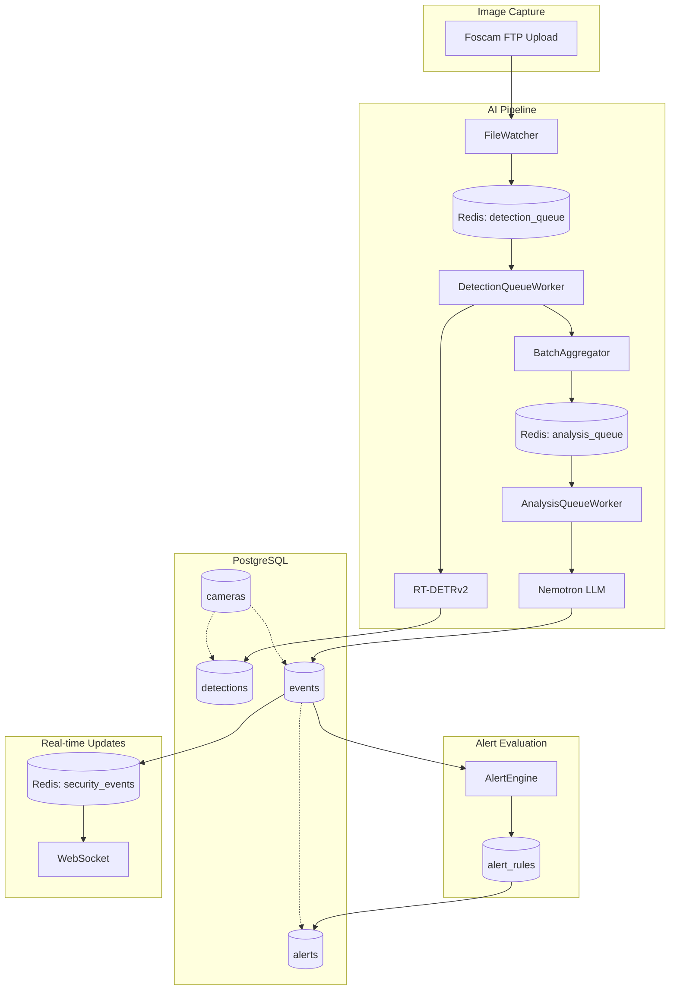

# Data Model Reference

> Complete documentation of all database models, relationships, and data patterns for the Home Security Intelligence system.

**Time to read:** ~15 min
**Prerequisites:** [Codebase Tour](codebase-tour.md)

---

## Table of Contents

1. [Model Inventory](#model-inventory)
2. [Entity Relationship Diagram](#entity-relationship-diagram)
3. [Core Models](#core-models)
   - [Camera](#camera)
   - [Detection](#detection)
   - [Event](#event)
4. [Alert System Models](#alert-system-models)
   - [Alert](#alert)
   - [AlertRule](#alertrule)
5. [Zone and Baseline Models](#zone-and-baseline-models)
   - [Zone](#zone)
   - [ActivityBaseline](#activitybaseline)
   - [ClassBaseline](#classbaseline)
6. [Supporting Models](#supporting-models)
   - [GPUStats](#gpustats)
   - [Log](#log)
   - [AuditLog](#auditlog)
   - [APIKey](#apikey)
7. [Enumerations](#enumerations)
8. [Data Flow](#data-flow)
9. [Common Query Patterns](#common-query-patterns)

---

## Model Inventory

The system uses **12 SQLAlchemy models** across **12 PostgreSQL tables**:

| Model            | Table                | Purpose                                            | Source File                   |
| ---------------- | -------------------- | -------------------------------------------------- | ----------------------------- |
| Camera           | `cameras`            | Security camera configuration and status           | `backend/models/camera.py`    |
| Detection        | `detections`         | Individual object detection results from RT-DETRv2 | `backend/models/detection.py` |
| Event            | `events`             | Aggregated security events with LLM risk analysis  | `backend/models/event.py`     |
| Alert            | `alerts`             | Triggered alert notifications                      | `backend/models/alert.py`     |
| AlertRule        | `alert_rules`        | Alert triggering conditions and configuration      | `backend/models/alert.py`     |
| Zone             | `zones`              | Camera view regions of interest                    | `backend/models/zone.py`      |
| ActivityBaseline | `activity_baselines` | Per-camera activity rate baselines by time slot    | `backend/models/baseline.py`  |
| ClassBaseline    | `class_baselines`    | Per-camera object class frequency baselines        | `backend/models/baseline.py`  |
| GPUStats         | `gpu_stats`          | GPU performance metrics time-series                | `backend/models/gpu_stats.py` |
| Log              | `logs`               | Structured application logs                        | `backend/models/log.py`       |
| AuditLog         | `audit_logs`         | Security-sensitive operation audit trail           | `backend/models/audit.py`     |
| APIKey           | `api_keys`           | API authentication keys                            | `backend/models/api_key.py`   |

All models are exported from `backend/models/__init__.py`.

---

## Entity Relationship Diagram

```mermaid
erDiagram
    cameras ||--o{ detections : "has many"
    cameras ||--o{ events : "has many"
    cameras ||--o{ zones : "has many"
    cameras ||--o{ activity_baselines : "has many"
    cameras ||--o{ class_baselines : "has many"
    events ||--o{ alerts : "triggers"
    alert_rules ||--o{ alerts : "generates"

    cameras {
        string id PK "UUID, normalized folder name"
        string name "Display name"
        string folder_path "FTP upload path"
        string status "online|offline|error"
        datetime created_at "Creation timestamp"
        datetime last_seen_at "Last activity (nullable)"
    }

    detections {
        int id PK "Auto-increment"
        string camera_id FK "References cameras.id"
        string file_path "Source image/video path"
        string file_type "MIME type"
        datetime detected_at "Detection timestamp"
        string object_type "person|car|dog|etc"
        float confidence "0.0-1.0"
        int bbox_x "Bounding box X"
        int bbox_y "Bounding box Y"
        int bbox_width "Bounding box width"
        int bbox_height "Bounding box height"
        string thumbnail_path "Cropped thumbnail"
        string media_type "image|video"
        float duration "Video duration (seconds)"
        string video_codec "h264|hevc|etc"
        int video_width "Video resolution width"
        int video_height "Video resolution height"
    }

    events {
        int id PK "Auto-increment"
        string batch_id "Batch grouping UUID"
        string camera_id FK "References cameras.id"
        datetime started_at "Event start time"
        datetime ended_at "Event end time"
        int risk_score "0-100 (LLM assigned)"
        string risk_level "low|medium|high|critical"
        text summary "LLM-generated summary"
        text reasoning "LLM reasoning"
        text detection_ids "JSON array"
        bool reviewed "User reviewed flag"
        text notes "User notes"
        bool is_fast_path "Fast path flag"
        text object_types "Cached object types"
        string clip_path "Generated video clip"
        tsvector search_vector "Full-text search"
    }

    alerts {
        uuid id PK "UUID"
        int event_id FK "References events.id"
        uuid rule_id FK "References alert_rules.id"
        enum severity "low|medium|high|critical"
        enum status "pending|delivered|acknowledged|dismissed"
        datetime created_at "Creation timestamp"
        datetime updated_at "Last update"
        datetime delivered_at "Delivery timestamp"
        json channels "Notification channels"
        string dedup_key "Deduplication key"
        json metadata "Additional context"
    }

    alert_rules {
        uuid id PK "UUID"
        string name "Rule name"
        text description "Rule description"
        bool enabled "Active status"
        enum severity "Alert severity level"
        int risk_threshold "Min risk score"
        json object_types "Object type filter"
        json camera_ids "Camera filter"
        json zone_ids "Zone filter"
        float min_confidence "Min confidence"
        json schedule "Time-based conditions"
        json conditions "Legacy conditions"
        string dedup_key_template "Dedup pattern"
        int cooldown_seconds "Alert cooldown"
        json channels "Notification channels"
        datetime created_at "Creation timestamp"
        datetime updated_at "Last update"
    }

    zones {
        string id PK "Zone identifier"
        string camera_id FK "References cameras.id"
        string name "Zone name"
        enum zone_type "entry_point|driveway|sidewalk|yard|other"
        jsonb coordinates "Polygon points [[x,y],...]"
        enum shape "rectangle|polygon"
        string color "Hex color (#3B82F6)"
        bool enabled "Active status"
        int priority "Display priority"
        datetime created_at "Creation timestamp"
        datetime updated_at "Last update"
    }

    activity_baselines {
        int id PK "Auto-increment"
        string camera_id FK "References cameras.id"
        int hour "0-23"
        int day_of_week "0-6 (Mon-Sun)"
        float avg_count "Activity average"
        int sample_count "Sample count"
        datetime last_updated "Last update"
    }

    class_baselines {
        int id PK "Auto-increment"
        string camera_id FK "References cameras.id"
        string detection_class "person|vehicle|etc"
        int hour "0-23"
        float frequency "Class frequency"
        int sample_count "Sample count"
        datetime last_updated "Last update"
    }

    gpu_stats {
        int id PK "Auto-increment"
        datetime recorded_at "Sample timestamp"
        string gpu_name "GPU model name"
        float gpu_utilization "0-100%"
        int memory_used "MB"
        int memory_total "MB"
        float temperature "Celsius"
        float power_usage "Watts"
        float inference_fps "FPS"
    }

    logs {
        int id PK "Auto-increment"
        datetime timestamp "Log timestamp"
        string level "DEBUG|INFO|WARNING|ERROR|CRITICAL"
        string component "Module name"
        text message "Log message"
        string camera_id "Associated camera"
        int event_id "Associated event"
        string request_id "Request correlation UUID"
        int detection_id "Associated detection"
        int duration_ms "Operation duration"
        jsonb extra "Additional context"
        string source "backend|frontend"
        text user_agent "Browser UA"
    }

    audit_logs {
        int id PK "Auto-increment"
        datetime timestamp "Action timestamp"
        string action "Action type"
        string resource_type "Resource category"
        string resource_id "Resource identifier"
        string actor "Who performed action"
        string ip_address "Client IP"
        text user_agent "Client UA"
        jsonb details "Action details"
        string status "success|failure"
    }

    api_keys {
        int id PK "Auto-increment"
        string key_hash UK "SHA256 hash"
        string name "Key display name"
        datetime created_at "Creation timestamp"
        bool is_active "Active/revoked status"
    }
```



---

## Core Models

### Camera

**Table:** `cameras`
**Source:** `backend/models/camera.py`
**Purpose:** Tracks registered security cameras and their configuration.

#### Schema

| Column         | Type         | Nullable | Default    | Description                                 |
| -------------- | ------------ | -------- | ---------- | ------------------------------------------- |
| `id`           | STRING       | NO       | -          | Primary key (normalized folder name)        |
| `name`         | STRING       | NO       | -          | Human-readable camera name                  |
| `folder_path`  | STRING       | NO       | -          | Filesystem path for FTP uploads             |
| `status`       | STRING       | NO       | `"online"` | Camera status: `online`, `offline`, `error` |
| `created_at`   | DATETIME(tz) | NO       | `utcnow()` | When camera was registered                  |
| `last_seen_at` | DATETIME(tz) | YES      | NULL       | Last image received timestamp               |

#### Relationships

- **One-to-many** with `detections` (cascade delete)
- **One-to-many** with `events` (cascade delete)
- **One-to-many** with `zones` (cascade delete)
- **One-to-many** with `activity_baselines` (cascade delete)
- **One-to-many** with `class_baselines` (cascade delete)

#### Camera ID Convention

The camera ID follows a strict normalization contract:

```python
from backend.models.camera import normalize_camera_id

# Examples:
normalize_camera_id("Front Door")  # -> "front_door"
normalize_camera_id("back-yard")   # -> "back_yard"
normalize_camera_id("Garage")      # -> "garage"
```

This ensures consistent mapping between upload directories and camera records.

#### Example Data

```json
{
  "id": "front_door",
  "name": "Front Door",
  "folder_path": "/export/foscam/Front Door",
  "status": "online",
  "created_at": "2025-12-01T10:00:00Z",
  "last_seen_at": "2025-12-31T14:30:00Z"
}
```

#### Common Queries

```python
# Get all online cameras
cameras = await session.execute(
    select(Camera).where(Camera.status == "online")
)

# Get camera by folder path
camera = await session.execute(
    select(Camera).where(Camera.folder_path == "/export/foscam/Front Door")
)

# Update last_seen_at
camera.last_seen_at = datetime.now(UTC)
await session.commit()
```

---

### Detection

**Table:** `detections`
**Source:** `backend/models/detection.py`
**Purpose:** Stores individual object detection results from RT-DETRv2.

#### Schema

| Column           | Type         | Nullable | Default    | Description                             |
| ---------------- | ------------ | -------- | ---------- | --------------------------------------- |
| `id`             | INTEGER      | NO       | Auto       | Primary key                             |
| `camera_id`      | STRING       | NO       | -          | Foreign key to `cameras.id`             |
| `file_path`      | STRING       | NO       | -          | Full path to source image/video         |
| `file_type`      | STRING       | YES      | NULL       | MIME type (e.g., `image/jpeg`)          |
| `detected_at`    | DATETIME(tz) | NO       | `utcnow()` | When detection was processed            |
| `object_type`    | STRING       | YES      | NULL       | Detected class (person, car, dog, etc.) |
| `confidence`     | FLOAT        | YES      | NULL       | Detection confidence (0.0-1.0)          |
| `bbox_x`         | INTEGER      | YES      | NULL       | Bounding box top-left X                 |
| `bbox_y`         | INTEGER      | YES      | NULL       | Bounding box top-left Y                 |
| `bbox_width`     | INTEGER      | YES      | NULL       | Bounding box width in pixels            |
| `bbox_height`    | INTEGER      | YES      | NULL       | Bounding box height in pixels           |
| `thumbnail_path` | STRING       | YES      | NULL       | Path to cropped detection thumbnail     |
| `media_type`     | STRING       | YES      | `"image"`  | Media type: `image` or `video`          |
| `duration`       | FLOAT        | YES      | NULL       | Video duration in seconds               |
| `video_codec`    | STRING       | YES      | NULL       | Video codec (h264, hevc)                |
| `video_width`    | INTEGER      | YES      | NULL       | Video resolution width                  |
| `video_height`   | INTEGER      | YES      | NULL       | Video resolution height                 |

#### Indexes

| Index Name                   | Columns                    | Purpose                |
| ---------------------------- | -------------------------- | ---------------------- |
| `idx_detections_camera_id`   | `camera_id`                | Filter by camera       |
| `idx_detections_detected_at` | `detected_at`              | Time-range queries     |
| `idx_detections_camera_time` | `camera_id`, `detected_at` | Combined camera + time |

#### Relationships

- **Many-to-one** with `cameras`

#### Example Data

```json
{
  "id": 1234,
  "camera_id": "front_door",
  "file_path": "/export/foscam/Front Door/FI9805W_20251231143000.jpg",
  "file_type": "image/jpeg",
  "detected_at": "2025-12-31T14:30:05Z",
  "object_type": "person",
  "confidence": 0.92,
  "bbox_x": 150,
  "bbox_y": 200,
  "bbox_width": 80,
  "bbox_height": 180,
  "thumbnail_path": "/var/lib/security/thumbnails/1234.jpg",
  "media_type": "image"
}
```

#### Common Queries

```python
# Get recent detections for a camera
detections = await session.execute(
    select(Detection)
    .where(Detection.camera_id == "front_door")
    .where(Detection.detected_at >= datetime.now(UTC) - timedelta(hours=24))
    .order_by(Detection.detected_at.desc())
)

# Get high-confidence person detections
persons = await session.execute(
    select(Detection)
    .where(Detection.object_type == "person")
    .where(Detection.confidence >= 0.8)
)

# Count detections by object type
counts = await session.execute(
    select(Detection.object_type, func.count(Detection.id))
    .group_by(Detection.object_type)
)
```

---

### Event

**Table:** `events`
**Source:** `backend/models/event.py`
**Purpose:** Aggregated security events analyzed by Nemotron LLM for risk assessment.

#### Schema

| Column          | Type         | Nullable | Default | Description                                        |
| --------------- | ------------ | -------- | ------- | -------------------------------------------------- |
| `id`            | INTEGER      | NO       | Auto    | Primary key                                        |
| `batch_id`      | STRING       | NO       | -       | Batch grouping identifier (UUID)                   |
| `camera_id`     | STRING       | NO       | -       | Foreign key to `cameras.id`                        |
| `started_at`    | DATETIME(tz) | NO       | -       | First detection timestamp in batch                 |
| `ended_at`      | DATETIME(tz) | YES      | NULL    | Last detection timestamp in batch                  |
| `risk_score`    | INTEGER      | YES      | NULL    | LLM-assigned risk score (0-100)                    |
| `risk_level`    | STRING       | YES      | NULL    | Risk category: `low`, `medium`, `high`, `critical` |
| `summary`       | TEXT         | YES      | NULL    | LLM-generated event description                    |
| `reasoning`     | TEXT         | YES      | NULL    | LLM reasoning for risk assessment                  |
| `detection_ids` | TEXT         | YES      | NULL    | JSON array of detection IDs                        |
| `reviewed`      | BOOLEAN      | NO       | `False` | Whether user has reviewed                          |
| `notes`         | TEXT         | YES      | NULL    | User-added notes                                   |
| `is_fast_path`  | BOOLEAN      | NO       | `False` | Whether event bypassed batching                    |
| `object_types`  | TEXT         | YES      | NULL    | Cached object types (comma-separated)              |
| `clip_path`     | STRING       | YES      | NULL    | Path to generated video clip                       |
| `search_vector` | TSVECTOR     | YES      | NULL    | Full-text search vector                            |

#### Indexes

| Index Name                 | Columns         | Type   | Purpose                |
| -------------------------- | --------------- | ------ | ---------------------- |
| `idx_events_camera_id`     | `camera_id`     | B-tree | Filter by camera       |
| `idx_events_started_at`    | `started_at`    | B-tree | Time-range queries     |
| `idx_events_risk_score`    | `risk_score`    | B-tree | Filter by risk level   |
| `idx_events_reviewed`      | `reviewed`      | B-tree | Find unreviewed events |
| `idx_events_batch_id`      | `batch_id`      | B-tree | Lookup by batch        |
| `idx_events_search_vector` | `search_vector` | GIN    | Full-text search       |

#### Relationships

- **Many-to-one** with `cameras`
- **One-to-many** with `alerts` (cascade delete)

#### Risk Score Mapping

| Risk Level | Score Range | Description                       |
| ---------- | ----------- | --------------------------------- |
| `low`      | 0-29        | Routine activity, no concern      |
| `medium`   | 30-59       | Notable activity, worth reviewing |
| `high`     | 60-84       | Concerning activity, review soon  |
| `critical` | 85-100      | Immediate attention required      |

#### Example Data

```json
{
  "id": 567,
  "batch_id": "abc123-def456-789",
  "camera_id": "front_door",
  "started_at": "2025-12-31T14:30:00Z",
  "ended_at": "2025-12-31T14:31:30Z",
  "risk_score": 75,
  "risk_level": "high",
  "summary": "Unknown person approaching front door during daytime",
  "reasoning": "Person detected approaching entry point. Face not recognized. Medium-high risk due to proximity to door.",
  "detection_ids": "[1234, 1235, 1236]",
  "reviewed": false,
  "notes": null,
  "is_fast_path": false,
  "object_types": "person",
  "clip_path": "/var/lib/security/clips/567.mp4"
}
```

#### Common Queries

```python
# Get unreviewed high-risk events
events = await session.execute(
    select(Event)
    .where(Event.reviewed == False)
    .where(Event.risk_score >= 60)
    .order_by(Event.started_at.desc())
)

# Full-text search
events = await session.execute(
    select(Event)
    .where(Event.search_vector.match("person door"))
)

# Get events with alerts
events = await session.execute(
    select(Event)
    .options(selectinload(Event.alerts))
    .where(Event.id == event_id)
)
```

---

## Alert System Models

### Alert

**Table:** `alerts`
**Source:** `backend/models/alert.py`
**Purpose:** Stores triggered alert notifications from security events.

#### Schema

| Column         | Type         | Nullable | Default    | Description                     |
| -------------- | ------------ | -------- | ---------- | ------------------------------- |
| `id`           | UUID         | NO       | `uuid4()`  | Primary key                     |
| `event_id`     | INTEGER      | NO       | -          | Foreign key to `events.id`      |
| `rule_id`      | UUID         | YES      | -          | Foreign key to `alert_rules.id` |
| `severity`     | ENUM         | NO       | `MEDIUM`   | Alert severity level            |
| `status`       | ENUM         | NO       | `PENDING`  | Alert status                    |
| `created_at`   | DATETIME(tz) | NO       | `utcnow()` | Creation timestamp              |
| `updated_at`   | DATETIME(tz) | NO       | `utcnow()` | Last update timestamp           |
| `delivered_at` | DATETIME(tz) | YES      | NULL       | Delivery timestamp              |
| `channels`     | JSON         | YES      | NULL       | Notification channels used      |
| `dedup_key`    | STRING(255)  | NO       | -          | Deduplication key               |
| `metadata`     | JSON         | YES      | NULL       | Additional alert context        |

#### Indexes

| Index Name                        | Columns                   | Purpose                |
| --------------------------------- | ------------------------- | ---------------------- |
| `idx_alerts_event_id`             | `event_id`                | Filter by event        |
| `idx_alerts_rule_id`              | `rule_id`                 | Filter by rule         |
| `idx_alerts_severity`             | `severity`                | Filter by severity     |
| `idx_alerts_status`               | `status`                  | Filter by status       |
| `idx_alerts_created_at`           | `created_at`              | Time-range queries     |
| `idx_alerts_dedup_key`            | `dedup_key`               | Deduplication lookups  |
| `idx_alerts_dedup_key_created_at` | `dedup_key`, `created_at` | Cooldown window checks |

#### Relationships

- **Many-to-one** with `events`
- **Many-to-one** with `alert_rules`

#### Example Data

```json
{
  "id": "a1b2c3d4-e5f6-7890-abcd-ef1234567890",
  "event_id": 567,
  "rule_id": "rule-uuid-here",
  "severity": "high",
  "status": "delivered",
  "created_at": "2025-12-31T14:31:35Z",
  "updated_at": "2025-12-31T14:31:36Z",
  "delivered_at": "2025-12-31T14:31:36Z",
  "channels": ["email", "push"],
  "dedup_key": "front_door:rule-uuid:person",
  "metadata": { "object_type": "person", "confidence": 0.92 }
}
```

---

### AlertRule

**Table:** `alert_rules`
**Source:** `backend/models/alert.py`
**Purpose:** Defines conditions for generating alerts from events.

#### Schema

| Column               | Type         | Nullable | Default                   | Description                     |
| -------------------- | ------------ | -------- | ------------------------- | ------------------------------- |
| `id`                 | UUID         | NO       | `uuid4()`                 | Primary key                     |
| `name`               | STRING(255)  | NO       | -                         | Rule name                       |
| `description`        | TEXT         | YES      | NULL                      | Rule description                |
| `enabled`            | BOOLEAN      | NO       | `True`                    | Active status                   |
| `severity`           | ENUM         | NO       | `MEDIUM`                  | Alert severity level            |
| `risk_threshold`     | INTEGER      | YES      | NULL                      | Min risk score (0-100)          |
| `object_types`       | JSON         | YES      | NULL                      | Object type filter (JSON array) |
| `camera_ids`         | JSON         | YES      | NULL                      | Camera filter (JSON array)      |
| `zone_ids`           | JSON         | YES      | NULL                      | Zone filter (JSON array)        |
| `min_confidence`     | FLOAT        | YES      | NULL                      | Min detection confidence        |
| `schedule`           | JSON         | YES      | NULL                      | Time-based conditions           |
| `conditions`         | JSON         | YES      | NULL                      | Legacy conditions (deprecated)  |
| `dedup_key_template` | STRING(255)  | NO       | `"{camera_id}:{rule_id}"` | Dedup pattern                   |
| `cooldown_seconds`   | INTEGER      | NO       | `300`                     | Alert cooldown (5 min default)  |
| `channels`           | JSON         | YES      | NULL                      | Notification channels           |
| `created_at`         | DATETIME(tz) | NO       | `utcnow()`                | Creation timestamp              |
| `updated_at`         | DATETIME(tz) | NO       | `utcnow()`                | Last update timestamp           |

#### Indexes

| Index Name                 | Columns    | Purpose             |
| -------------------------- | ---------- | ------------------- |
| `idx_alert_rules_name`     | `name`     | Name lookups        |
| `idx_alert_rules_enabled`  | `enabled`  | Filter active rules |
| `idx_alert_rules_severity` | `severity` | Filter by severity  |

#### Rule Evaluation Logic

All conditions in a rule must match (AND logic):

1. **risk_threshold**: Event `risk_score >= threshold`
2. **object_types**: Detection object type in list (empty = all)
3. **camera_ids**: Event camera_id in list (empty = all)
4. **zone_ids**: Detection in specified zone (empty = any)
5. **min_confidence**: Detection confidence >= threshold
6. **schedule**: Current time within schedule window

#### Example Data

```json
{
  "id": "rule-uuid-here",
  "name": "Person at Night",
  "description": "Alert when person detected at front door after 10pm",
  "enabled": true,
  "severity": "high",
  "risk_threshold": 50,
  "object_types": ["person"],
  "camera_ids": ["front_door"],
  "zone_ids": null,
  "min_confidence": 0.7,
  "schedule": {
    "days": ["mon", "tue", "wed", "thu", "fri", "sat", "sun"],
    "start_time": "22:00",
    "end_time": "06:00",
    "timezone": "America/Chicago"
  },
  "dedup_key_template": "{camera_id}:{rule_id}",
  "cooldown_seconds": 600,
  "channels": ["email", "push"]
}
```

---

## Zone and Baseline Models

### Zone

**Table:** `zones`
**Source:** `backend/models/zone.py`
**Purpose:** Defines regions of interest on camera views for detection context.

#### Schema

| Column        | Type         | Nullable | Default     | Description                   |
| ------------- | ------------ | -------- | ----------- | ----------------------------- |
| `id`          | STRING       | NO       | -           | Primary key (zone identifier) |
| `camera_id`   | STRING       | NO       | -           | Foreign key to `cameras.id`   |
| `name`        | STRING(255)  | NO       | -           | Zone display name             |
| `zone_type`   | ENUM         | NO       | `OTHER`     | Zone category                 |
| `coordinates` | JSONB        | NO       | -           | Polygon points [[x,y],...]    |
| `shape`       | ENUM         | NO       | `RECTANGLE` | Zone shape                    |
| `color`       | STRING(7)    | NO       | `"#3B82F6"` | Display color (hex)           |
| `enabled`     | BOOLEAN      | NO       | `True`      | Active status                 |
| `priority`    | INTEGER      | NO       | `0`         | Display priority              |
| `created_at`  | DATETIME(tz) | NO       | `utcnow()`  | Creation timestamp            |
| `updated_at`  | DATETIME(tz) | NO       | `utcnow()`  | Last update timestamp         |

#### Indexes

| Index Name                 | Columns                | Purpose             |
| -------------------------- | ---------------------- | ------------------- |
| `idx_zones_camera_id`      | `camera_id`            | Filter by camera    |
| `idx_zones_enabled`        | `enabled`              | Filter active zones |
| `idx_zones_camera_enabled` | `camera_id`, `enabled` | Combined filter     |

#### Coordinate System

Coordinates are **normalized** (0-1 range) relative to image dimensions:

```json
{
  "coordinates": [
    [0.1, 0.2], // Top-left
    [0.3, 0.2], // Top-right
    [0.3, 0.8], // Bottom-right
    [0.1, 0.8] // Bottom-left
  ]
}
```

#### Example Data

```json
{
  "id": "front_door_entry",
  "camera_id": "front_door",
  "name": "Entry Point",
  "zone_type": "entry_point",
  "coordinates": [
    [0.3, 0.4],
    [0.7, 0.4],
    [0.7, 0.9],
    [0.3, 0.9]
  ],
  "shape": "rectangle",
  "color": "#EF4444",
  "enabled": true,
  "priority": 10
}
```

---

### ActivityBaseline

**Table:** `activity_baselines`
**Source:** `backend/models/baseline.py`
**Purpose:** Tracks average activity rates per camera by hour and day-of-week.

#### Schema

| Column         | Type         | Nullable | Default    | Description                    |
| -------------- | ------------ | -------- | ---------- | ------------------------------ |
| `id`           | INTEGER      | NO       | Auto       | Primary key                    |
| `camera_id`    | STRING       | NO       | -          | Foreign key to `cameras.id`    |
| `hour`         | INTEGER      | NO       | -          | Hour of day (0-23)             |
| `day_of_week`  | INTEGER      | NO       | -          | Day of week (0=Mon, 6=Sun)     |
| `avg_count`    | FLOAT        | NO       | `0.0`      | Exponentially weighted average |
| `sample_count` | INTEGER      | NO       | `0`        | Number of samples              |
| `last_updated` | DATETIME(tz) | NO       | `utcnow()` | Last update timestamp          |

#### Constraints

- **Unique constraint:** `(camera_id, hour, day_of_week)`

#### Indexes

| Index Name                     | Columns                            | Purpose           |
| ------------------------------ | ---------------------------------- | ----------------- |
| `idx_activity_baseline_camera` | `camera_id`                        | Filter by camera  |
| `idx_activity_baseline_slot`   | `camera_id`, `hour`, `day_of_week` | Time slot lookups |

---

### ClassBaseline

**Table:** `class_baselines`
**Source:** `backend/models/baseline.py`
**Purpose:** Tracks frequency of specific object classes per camera and hour.

#### Schema

| Column            | Type         | Nullable | Default    | Description                          |
| ----------------- | ------------ | -------- | ---------- | ------------------------------------ |
| `id`              | INTEGER      | NO       | Auto       | Primary key                          |
| `camera_id`       | STRING       | NO       | -          | Foreign key to `cameras.id`          |
| `detection_class` | STRING       | NO       | -          | Object class (person, vehicle, etc.) |
| `hour`            | INTEGER      | NO       | -          | Hour of day (0-23)                   |
| `frequency`       | FLOAT        | NO       | `0.0`      | Exponentially weighted frequency     |
| `sample_count`    | INTEGER      | NO       | `0`        | Number of samples                    |
| `last_updated`    | DATETIME(tz) | NO       | `utcnow()` | Last update timestamp                |

#### Constraints

- **Unique constraint:** `(camera_id, detection_class, hour)`

#### Indexes

| Index Name                  | Columns                                | Purpose           |
| --------------------------- | -------------------------------------- | ----------------- |
| `idx_class_baseline_camera` | `camera_id`                            | Filter by camera  |
| `idx_class_baseline_class`  | `camera_id`, `detection_class`         | Filter by class   |
| `idx_class_baseline_slot`   | `camera_id`, `detection_class`, `hour` | Time slot lookups |

---

## Supporting Models

### GPUStats

**Table:** `gpu_stats`
**Source:** `backend/models/gpu_stats.py`
**Purpose:** Time-series GPU performance metrics for monitoring AI inference.

#### Schema

| Column            | Type         | Nullable | Default    | Description                      |
| ----------------- | ------------ | -------- | ---------- | -------------------------------- |
| `id`              | INTEGER      | NO       | Auto       | Primary key                      |
| `recorded_at`     | DATETIME(tz) | NO       | `utcnow()` | Sample timestamp                 |
| `gpu_name`        | STRING(255)  | YES      | NULL       | GPU model name                   |
| `gpu_utilization` | FLOAT        | YES      | NULL       | GPU compute utilization (0-100%) |
| `memory_used`     | INTEGER      | YES      | NULL       | VRAM used in MB                  |
| `memory_total`    | INTEGER      | YES      | NULL       | Total VRAM in MB                 |
| `temperature`     | FLOAT        | YES      | NULL       | GPU temperature in Celsius       |
| `power_usage`     | FLOAT        | YES      | NULL       | Power consumption in Watts       |
| `inference_fps`   | FLOAT        | YES      | NULL       | Inference throughput             |

#### Indexes

| Index Name                  | Columns       | Purpose             |
| --------------------------- | ------------- | ------------------- |
| `idx_gpu_stats_recorded_at` | `recorded_at` | Time-series queries |

#### Example Data

```json
{
  "id": 12345,
  "recorded_at": "2025-12-31T14:30:00Z",
  "gpu_name": "NVIDIA RTX A5500",
  "gpu_utilization": 45.5,
  "memory_used": 7168,
  "memory_total": 24576,
  "temperature": 62.0,
  "power_usage": 125.0,
  "inference_fps": 15.2
}
```

---

### Log

**Table:** `logs`
**Source:** `backend/models/log.py`
**Purpose:** Structured application logs with rich metadata for debugging.

#### Schema

| Column         | Type         | Nullable | Default      | Description                   |
| -------------- | ------------ | -------- | ------------ | ----------------------------- |
| `id`           | INTEGER      | NO       | Auto         | Primary key                   |
| `timestamp`    | DATETIME(tz) | NO       | `func.now()` | Log timestamp                 |
| `level`        | STRING(10)   | NO       | -            | Log level                     |
| `component`    | STRING(50)   | NO       | -            | Module/service name           |
| `message`      | TEXT         | NO       | -            | Log message text              |
| `camera_id`    | STRING(100)  | YES      | NULL         | Associated camera ID          |
| `event_id`     | INTEGER      | YES      | NULL         | Associated event ID           |
| `request_id`   | STRING(36)   | YES      | NULL         | Request correlation UUID      |
| `detection_id` | INTEGER      | YES      | NULL         | Associated detection ID       |
| `duration_ms`  | INTEGER      | YES      | NULL         | Operation duration in ms      |
| `extra`        | JSONB        | YES      | NULL         | Additional structured context |
| `source`       | STRING(10)   | NO       | `"backend"`  | Log source: backend/frontend  |
| `user_agent`   | TEXT         | YES      | NULL         | Browser user agent            |

#### Indexes

| Index Name           | Columns     | Purpose                   |
| -------------------- | ----------- | ------------------------- |
| `idx_logs_timestamp` | `timestamp` | Time-range queries        |
| `idx_logs_level`     | `level`     | Filter by severity        |
| `idx_logs_component` | `component` | Filter by module          |
| `idx_logs_camera_id` | `camera_id` | Camera-specific logs      |
| `idx_logs_source`    | `source`    | Separate backend/frontend |

---

### AuditLog

**Table:** `audit_logs`
**Source:** `backend/models/audit.py`
**Purpose:** Security-sensitive operation audit trail.

#### Schema

| Column          | Type         | Nullable | Default     | Description            |
| --------------- | ------------ | -------- | ----------- | ---------------------- |
| `id`            | INTEGER      | NO       | Auto        | Primary key            |
| `timestamp`     | DATETIME(tz) | NO       | `utcnow()`  | Action timestamp       |
| `action`        | STRING(50)   | NO       | -           | Action type (see enum) |
| `resource_type` | STRING(50)   | NO       | -           | Resource category      |
| `resource_id`   | STRING(255)  | YES      | NULL        | Resource identifier    |
| `actor`         | STRING(100)  | NO       | -           | Who performed action   |
| `ip_address`    | STRING(45)   | YES      | NULL        | Client IP address      |
| `user_agent`    | TEXT         | YES      | NULL        | Client user agent      |
| `details`       | JSONB        | YES      | NULL        | Action details         |
| `status`        | STRING(20)   | NO       | `"success"` | Outcome status         |

#### Indexes

| Index Name                     | Columns                        | Purpose            |
| ------------------------------ | ------------------------------ | ------------------ |
| `idx_audit_logs_timestamp`     | `timestamp`                    | Time-range queries |
| `idx_audit_logs_action`        | `action`                       | Filter by action   |
| `idx_audit_logs_resource_type` | `resource_type`                | Filter by resource |
| `idx_audit_logs_actor`         | `actor`                        | Filter by actor    |
| `idx_audit_logs_status`        | `status`                       | Filter by outcome  |
| `idx_audit_logs_resource`      | `resource_type`, `resource_id` | Resource lookups   |

---

### APIKey

**Table:** `api_keys`
**Source:** `backend/models/api_key.py`
**Purpose:** API key management for authentication (optional, disabled by default).

#### Schema

| Column       | Type         | Nullable | Default    | Description                     |
| ------------ | ------------ | -------- | ---------- | ------------------------------- |
| `id`         | INTEGER      | NO       | Auto       | Primary key                     |
| `key_hash`   | STRING(64)   | NO       | -          | SHA256 hash of API key (unique) |
| `name`       | STRING(100)  | NO       | -          | Human-readable key name         |
| `created_at` | DATETIME(tz) | NO       | `utcnow()` | Key creation timestamp          |
| `is_active`  | BOOLEAN      | NO       | `True`     | Active/revoked status           |

#### Notes

- API keys are stored as SHA256 hashes, never in plaintext
- Authentication is disabled by default (`API_KEY_ENABLED=False`)
- Keys are loaded from `API_KEYS` environment variable on startup

---

## Enumerations

### Severity

**Source:** `backend/models/enums.py`

```python
class Severity(str, Enum):
    LOW = "low"        # 0-29: Routine activity
    MEDIUM = "medium"  # 30-59: Notable activity
    HIGH = "high"      # 60-84: Concerning activity
    CRITICAL = "critical"  # 85-100: Immediate attention
```

### AlertSeverity

**Source:** `backend/models/alert.py`

```python
class AlertSeverity(str, Enum):
    LOW = "low"
    MEDIUM = "medium"
    HIGH = "high"
    CRITICAL = "critical"
```

### AlertStatus

**Source:** `backend/models/alert.py`

```python
class AlertStatus(str, Enum):
    PENDING = "pending"        # Alert created, not delivered
    DELIVERED = "delivered"    # Notification sent
    ACKNOWLEDGED = "acknowledged"  # User acknowledged
    DISMISSED = "dismissed"    # User dismissed
```

### ZoneType

**Source:** `backend/models/zone.py`

```python
class ZoneType(str, Enum):
    ENTRY_POINT = "entry_point"  # Doors, gates
    DRIVEWAY = "driveway"        # Vehicle areas
    SIDEWALK = "sidewalk"        # Public walkways
    YARD = "yard"                # Property grounds
    OTHER = "other"              # Custom zones
```

### ZoneShape

**Source:** `backend/models/zone.py`

```python
class ZoneShape(str, Enum):
    RECTANGLE = "rectangle"  # 4-point axis-aligned
    POLYGON = "polygon"      # Arbitrary polygon
```

### AuditAction

**Source:** `backend/models/audit.py`

```python
class AuditAction(str, Enum):
    # Event actions
    EVENT_REVIEWED = "event_reviewed"
    EVENT_DISMISSED = "event_dismissed"

    # Settings actions
    SETTINGS_CHANGED = "settings_changed"

    # Media actions
    MEDIA_EXPORTED = "media_exported"

    # Alert rule actions
    RULE_CREATED = "rule_created"
    RULE_UPDATED = "rule_updated"
    RULE_DELETED = "rule_deleted"

    # Camera actions
    CAMERA_CREATED = "camera_created"
    CAMERA_UPDATED = "camera_updated"
    CAMERA_DELETED = "camera_deleted"

    # Authentication actions
    LOGIN = "login"
    LOGOUT = "logout"

    # API key actions
    API_KEY_CREATED = "api_key_created"
    API_KEY_REVOKED = "api_key_revoked"

    # Notification actions
    NOTIFICATION_TEST = "notification_test"

    # Admin actions
    DATA_CLEARED = "data_cleared"
```

### AuditStatus

**Source:** `backend/models/audit.py`

```python
class AuditStatus(str, Enum):
    SUCCESS = "success"
    FAILURE = "failure"
```

---

## Data Flow



### Data Flow Steps

1. **Image Arrival:** Foscam camera uploads via FTP to `/export/foscam/{camera_name}/`
2. **FileWatcher:** Detects new file, validates, queues for processing
3. **Deduplication:** SHA256 hash checked against Redis cache
4. **Detection Queue:** File path pushed to `detection_queue`
5. **Object Detection:** RT-DETRv2 performs inference, creates Detection records
6. **Batch Aggregation:** Detections grouped by camera in 90s windows
7. **Analysis Queue:** Completed batch pushed to `analysis_queue`
8. **LLM Analysis:** Nemotron analyzes batch, generates risk score and summary
9. **Event Creation:** Event record created with LLM results
10. **Alert Evaluation:** AlertEngine checks event against AlertRules
11. **Alert Creation:** Matching rules generate Alert records
12. **Real-time Broadcast:** Event published via Redis pub/sub to WebSocket clients

---

## Common Query Patterns

### Events by Camera (Last 24h)

```python
from datetime import datetime, timedelta, UTC
from sqlalchemy import select

cutoff = datetime.now(UTC) - timedelta(hours=24)
stmt = (
    select(Event)
    .where(Event.camera_id == "front_door")
    .where(Event.started_at >= cutoff)
    .order_by(Event.started_at.desc())
)
# Uses: idx_events_camera_id, idx_events_started_at
```

### Unreviewed High-Risk Events

```python
stmt = (
    select(Event)
    .where(Event.reviewed == False)
    .where(Event.risk_score >= 60)
    .order_by(Event.started_at.desc())
    .limit(50)
)
# Uses: idx_events_reviewed, idx_events_risk_score
```

### Detection Timeline for Event

```python
import json

# Get detection IDs from event
detection_ids = json.loads(event.detection_ids) if event.detection_ids else []

# Fetch detections
stmt = (
    select(Detection)
    .where(Detection.id.in_(detection_ids))
    .order_by(Detection.detected_at.asc())
)
```

### Alerts by Status

```python
stmt = (
    select(Alert)
    .where(Alert.status == AlertStatus.PENDING)
    .order_by(Alert.created_at.desc())
)
# Uses: idx_alerts_status, idx_alerts_created_at
```

### Active Alert Rules

```python
stmt = (
    select(AlertRule)
    .where(AlertRule.enabled == True)
    .order_by(AlertRule.severity.desc())
)
# Uses: idx_alert_rules_enabled
```

### GPU Stats History

```python
cutoff = datetime.now(UTC) - timedelta(hours=1)
stmt = (
    select(GPUStats)
    .where(GPUStats.recorded_at >= cutoff)
    .order_by(GPUStats.recorded_at.asc())
)
# Uses: idx_gpu_stats_recorded_at
```

### Full-Text Event Search

```python
from sqlalchemy import func

stmt = (
    select(Event)
    .where(Event.search_vector.match("person door"))
    .order_by(func.ts_rank(Event.search_vector, func.plainto_tsquery("person door")).desc())
)
# Uses: idx_events_search_vector (GIN)
```

### Audit Log for Resource

```python
stmt = (
    select(AuditLog)
    .where(AuditLog.resource_type == "camera")
    .where(AuditLog.resource_id == "front_door")
    .order_by(AuditLog.timestamp.desc())
)
# Uses: idx_audit_logs_resource
```

---

## Next Steps

- [Codebase Tour](codebase-tour.md) - Understanding project structure
- [AI Pipeline](../architecture/AI_PIPELINE.md) - Detection and analysis flow

---

Back to [Developer Hub](../developer-hub.md)
