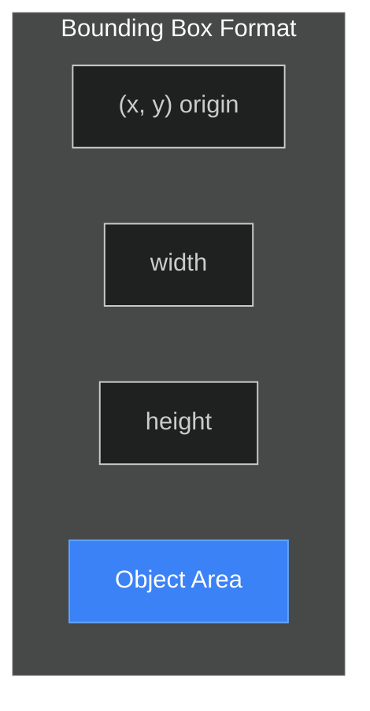

# Detection Service

> YOLO26 integration for object detection.

**Time to read:** ~8 min
**Prerequisites:** [Pipeline Overview](pipeline-overview.md)

---

## What YOLO26 Does

YOLO26 (Real-Time Detection Transformer v2) performs object detection on camera images:

1. Receives camera images via HTTP POST
2. Preprocesses (RGB conversion, normalization)
3. Runs inference on GPU
4. Post-processes to extract bounding boxes
5. Filters to security-relevant classes
6. Returns JSON with detections

---

## Source Files

- `/ai/yolo26/model.py` - FastAPI inference server
- `/backend/services/detector_client.py` - HTTP client

---

## API Format

### Request

**Endpoint:** `POST http://localhost:8090/detect`

**Multipart/form-data:**

```bash
curl -X POST http://localhost:8090/detect \
  -F "file=@image.jpg"
```

**JSON with base64:**

```json
{
  "image_base64": "<base64 encoded image>"
}
```

### Response

```json
{
  "detections": [
    {
      "class": "person",
      "confidence": 0.95,
      "bbox": {
        "x": 100,
        "y": 150,
        "width": 200,
        "height": 400
      }
    },
    {
      "class": "car",
      "confidence": 0.87,
      "bbox": {
        "x": 500,
        "y": 300,
        "width": 350,
        "height": 200
      }
    }
  ],
  "inference_time_ms": 45.2,
  "image_width": 1920,
  "image_height": 1080
}
```

---

## Bounding Box Format

Uses **top-left origin with width/height**:



Where:

- `(x, y)` marks the **top-left corner**
- `width` extends **rightward**
- `height` extends **downward**

- `x`: Top-left X coordinate (pixels from left edge)
- `y`: Top-left Y coordinate (pixels from top edge)
- `width`: Box width in pixels
- `height`: Box height in pixels

---

## Security-Relevant Classes

Only these 9 COCO classes are returned (all others filtered):

| Class        | Description       |
| ------------ | ----------------- |
| `person`     | Human detection   |
| `car`        | Passenger vehicle |
| `truck`      | Large vehicle     |
| `bus`        | Public transport  |
| `dog`        | Canine            |
| `cat`        | Feline            |
| `bird`       | Avian             |
| `bicycle`    | Bike              |
| `motorcycle` | Motorbike         |

---

## Confidence Thresholds

| Parameter                        | Default | Description         |
| -------------------------------- | ------- | ------------------- |
| `YOLO26_CONFIDENCE`              | 0.5     | Server-side minimum |
| `DETECTION_CONFIDENCE_THRESHOLD` | 0.5     | Backend filtering   |

Detections below threshold are discarded.

**Trade-offs:**

- Lower threshold: More detections, more false positives
- Higher threshold: Fewer detections, may miss legitimate objects

---

## Performance

| Metric         | Value                       |
| -------------- | --------------------------- |
| Inference time | 30-50ms per image           |
| VRAM usage     | ~4GB                        |
| Throughput     | ~20-30 images/second        |
| Model warmup   | ~1-2 seconds (3 iterations) |

---

## Health Check

```bash
curl http://localhost:8090/health
```

```json
{
  "status": "healthy",
  "model_loaded": true,
  "device": "cuda:0",
  "cuda_available": true,
  "vram_used_gb": 4.2
}
```

---

## Detection Client Implementation

The backend uses `DetectorClient` to communicate with YOLO26:

```python
# backend/services/detector_client.py

class DetectorClient:
    def __init__(self, base_url: str = "http://localhost:8090"):
        self.base_url = base_url
        self.timeout = httpx.Timeout(30.0)

    async def detect_objects(self, image_path: str) -> list[Detection]:
        """Send image to YOLO26 and return detections."""
        async with httpx.AsyncClient(timeout=self.timeout) as client:
            with open(image_path, "rb") as f:
                response = await client.post(
                    f"{self.base_url}/detect",
                    files={"file": f}
                )
            response.raise_for_status()
            return self._parse_response(response.json())
```

---

## Error Handling

| Error                 | Response    | Recovery         |
| --------------------- | ----------- | ---------------- |
| File not found        | Return `[]` | Skip image       |
| Service unreachable   | Return `[]` | Retry next image |
| Request timeout (30s) | Return `[]` | Skip image       |
| HTTP error (non-200)  | Return `[]` | Skip image       |
| Invalid JSON          | Return `[]` | Skip image       |

Errors are logged but do not crash the pipeline.

---

## Detection Database Model

```sql
CREATE TABLE detections (
    id SERIAL PRIMARY KEY,
    camera_id VARCHAR NOT NULL,
    file_path VARCHAR NOT NULL,
    file_type VARCHAR,
    detected_at TIMESTAMP NOT NULL,
    object_type VARCHAR NOT NULL,
    confidence FLOAT NOT NULL,
    bbox_x INTEGER,
    bbox_y INTEGER,
    bbox_width INTEGER,
    bbox_height INTEGER,
    thumbnail_path VARCHAR
);
```

---

## Next Steps

- [Batching Logic](batching-logic.md) - How detections are grouped
- [Risk Analysis](risk-analysis.md) - LLM processing

---

## See Also

- [Pipeline Overview](pipeline-overview.md) - Full pipeline context
- [AI Overview](../operator/ai-overview.md) - YOLO26 deployment and architecture
- [GPU Setup](../operator/gpu-setup.md) - Hardware requirements
- [Data Model](data-model.md) - Detection database schema

---

[Back to Developer Hub](README.md)
