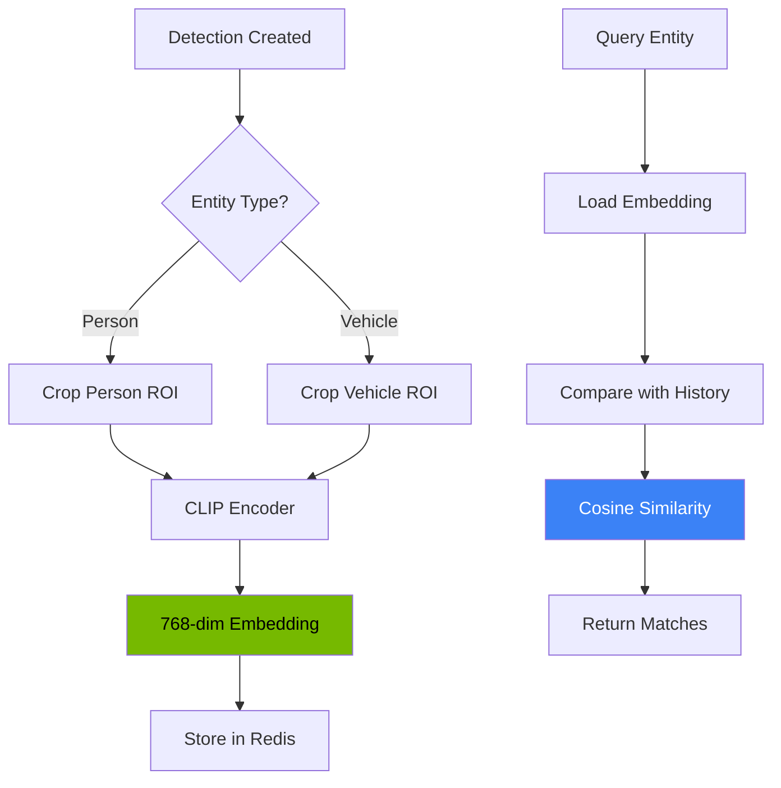
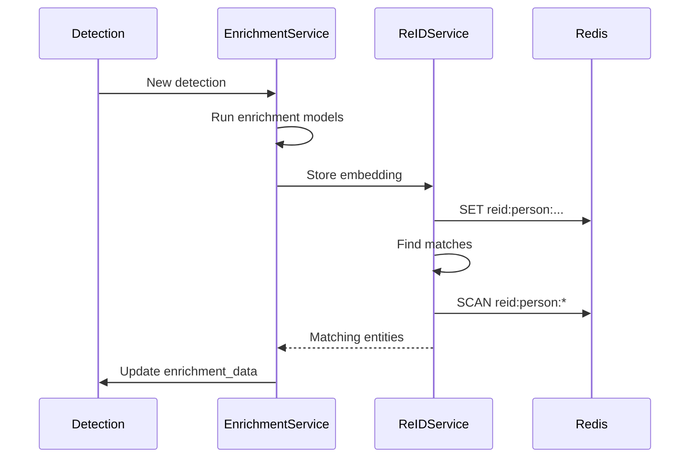

# Entity Tracking and Re-Identification

> Technical documentation for the entity re-identification (ReID) service using CLIP embeddings.

**Time to read:** ~10 min
**Prerequisites:** [Detection Service](detection-service.md), [Data Model](data-model.md)

---

## Overview

The Re-Identification (ReID) service tracks entities (persons and vehicles) across multiple cameras by computing visual embeddings and comparing them for similarity. This enables building movement timelines and correlating events.

## Architecture



---

## Service API

### ReIdentificationService Class

**Location:** `backend/services/reid_service.py`

```python
from backend.services.reid_service import (
    ReIdentificationService,
    get_reid_service,
    EntityEmbedding,
)

# Use FastAPI dependency injection
@router.get("/entities")
async def list_entities(
    reid_service: ReIdentificationService = Depends(get_reid_service),
):
    # Use service
    pass
```

### Configuration

| Setting                | Default | Environment Variable         | Description                     |
| ---------------------- | ------- | ---------------------------- | ------------------------------- |
| `similarity_threshold` | 0.85    | `REID_SIMILARITY_THRESHOLD`  | Minimum match similarity        |
| `embedding_ttl`        | 86400   | `REID_EMBEDDING_TTL_SECONDS` | TTL for stored embeddings (24h) |
| `max_embeddings`       | 1000    | `REID_MAX_EMBEDDINGS`        | Max embeddings per entity type  |

---

## CLIP Embeddings

### What are CLIP Embeddings?

CLIP (Contrastive Language-Image Pre-training) is a neural network trained by OpenAI that learns visual concepts from natural language supervision. When applied to an image, it produces a high-dimensional vector (embedding) that captures the visual semantics.

Key properties:

- **Semantic similarity:** Similar-looking objects have similar embeddings
- **Cross-modal:** Embeddings can be compared with text descriptions
- **Robust:** Performs well across viewing angles, lighting conditions

### Model Details

| Property            | Value                |
| ------------------- | -------------------- |
| Model               | CLIP ViT-L/14        |
| Embedding Dimension | 768                  |
| Inference Device    | CUDA (GPU) preferred |
| Batch Support       | Yes                  |

### Embedding Generation

```python
async def generate_embedding(
    self,
    image_path: Path,
    roi: BoundingBox | None = None,
) -> np.ndarray:
    """Generate CLIP embedding for an image or ROI.

    Args:
        image_path: Path to the source image
        roi: Optional bounding box to crop before encoding

    Returns:
        768-dimensional numpy array (normalized)
    """
```

If a bounding box (ROI) is provided, the image is cropped to that region before encoding. This focuses the embedding on the detected entity rather than background elements.

---

## Entity Storage

### Redis Key Structure

Embeddings are stored in Redis for fast retrieval, partitioned by date:

```
entity_embeddings:{date} -> JSON payload
```

Where `{date}` is formatted as `YYYY-MM-DD` (e.g., `entity_embeddings:2026-01-09`).

Each key contains a JSON object with separate lists for persons and vehicles.

### Payload Format

The value at each date key is a JSON object with `persons` and `vehicles` arrays:

```json
{
  "persons": [
    {
      "detection_id": "12345",
      "camera_id": "front_door",
      "entity_type": "person",
      "timestamp": "2026-01-03T10:30:00Z",
      "embedding": [0.123, -0.456, ...],  // 768 floats
      "attributes": {
        "confidence": 0.95,
        "clothing": "blue jacket"
      }
    }
  ],
  "vehicles": [
    {
      "detection_id": "12346",
      "camera_id": "driveway",
      "entity_type": "vehicle",
      "timestamp": "2026-01-03T10:31:00Z",
      "embedding": [0.789, -0.012, ...],  // 768 floats
      "attributes": {
        "confidence": 0.92,
        "color": "silver"
      }
    }
  ]
}
```

### TTL and Retention

Embeddings expire after 24 hours (configurable via `REID_EMBEDDING_TTL_SECONDS`).

This is intentional:

1. **Privacy:** Limits tracking duration
2. **Storage:** Prevents unbounded Redis memory growth
3. **Relevance:** Old embeddings become less useful for real-time tracking

For longer-term entity tracking, consider persisting to PostgreSQL.

---

## EntityEmbedding Data Class

```python
@dataclass
class EntityEmbedding:
    """Represents a stored entity embedding."""

    detection_id: str
    camera_id: str
    entity_type: str  # "person" or "vehicle"
    timestamp: datetime
    embedding: np.ndarray  # 768-dim normalized vector
    attributes: dict[str, Any] | None = None
```

### Serialization

Embeddings are serialized to JSON for Redis storage:

```python
def to_dict(self) -> dict:
    return {
        "detection_id": self.detection_id,
        "camera_id": self.camera_id,
        "entity_type": self.entity_type,
        "timestamp": self.timestamp.isoformat(),
        "embedding": self.embedding.tolist(),
        "attributes": self.attributes,
    }

@classmethod
def from_dict(cls, data: dict) -> EntityEmbedding:
    return cls(
        detection_id=data["detection_id"],
        camera_id=data["camera_id"],
        entity_type=data["entity_type"],
        timestamp=datetime.fromisoformat(data["timestamp"]),
        embedding=np.array(data["embedding"]),
        attributes=data.get("attributes"),
    )
```

---

## Similarity Matching

### Cosine Similarity

Entity matching uses cosine similarity between embedding vectors:

```python
def cosine_similarity(a: np.ndarray, b: np.ndarray) -> float:
    """Compute cosine similarity between two vectors.

    Args:
        a: First embedding vector (normalized)
        b: Second embedding vector (normalized)

    Returns:
        Similarity score in range [0, 1]
    """
    return float(np.dot(a, b))  # Vectors are pre-normalized
```

Since embeddings are L2-normalized during generation, the dot product equals cosine similarity.

### Match Threshold

| Similarity | Interpretation             |
| ---------- | -------------------------- |
| >= 0.90    | Very high confidence match |
| 0.85-0.90  | High confidence match      |
| 0.80-0.85  | Moderate confidence        |
| < 0.80     | Unlikely to be same entity |

Default threshold: **0.85** (configurable)

### Finding Matches

```python
async def find_matching_entities(
    self,
    redis_client: Redis,
    query_embedding: np.ndarray,
    entity_type: str,
    camera_id: str | None = None,
    min_similarity: float | None = None,
    limit: int = 10,
) -> list[tuple[EntityEmbedding, float]]:
    """Find entities similar to the query embedding.

    Args:
        redis_client: Redis connection
        query_embedding: 768-dim embedding to match
        entity_type: "person" or "vehicle"
        camera_id: Optional filter by camera
        min_similarity: Override default threshold
        limit: Maximum matches to return

    Returns:
        List of (EntityEmbedding, similarity_score) tuples,
        sorted by similarity descending
    """
```

---

## REST API Endpoints

### GET `/api/entities`

List tracked entities with optional filtering.

**Query Parameters:**

| Parameter     | Type         | Description                   |
| ------------- | ------------ | ----------------------------- |
| `entity_type` | string       | Filter: "person" or "vehicle" |
| `camera_id`   | string       | Filter by camera              |
| `since`       | datetime     | Filter entities seen since    |
| `limit`       | int (1-1000) | Max results (default 50)      |
| `offset`      | int          | Pagination offset             |

**Response Schema:** `EntityListResponse`

```json
{
  "entities": [
    {
      "id": "12345",
      "entity_type": "person",
      "first_seen": "2026-01-03T10:15:00Z",
      "last_seen": "2026-01-03T10:30:00Z",
      "appearance_count": 3,
      "cameras_seen": ["front_door", "driveway"],
      "thumbnail_url": "/api/detections/12345/image"
    }
  ],
  "count": 1,
  "limit": 50,
  "offset": 0
}
```

### GET `/api/entities/{entity_id}`

Get detailed information about a specific entity.

**Response Schema:** `EntityDetail`

```json
{
  "id": "12345",
  "entity_type": "person",
  "first_seen": "2026-01-03T10:15:00Z",
  "last_seen": "2026-01-03T10:30:00Z",
  "appearance_count": 3,
  "cameras_seen": ["front_door", "driveway"],
  "thumbnail_url": "/api/detections/12345/image",
  "appearances": [
    {
      "detection_id": "12345",
      "camera_id": "front_door",
      "camera_name": "Front Door",
      "timestamp": "2026-01-03T10:15:00Z",
      "thumbnail_url": "/api/detections/12345/image",
      "similarity_score": 1.0,
      "attributes": { "confidence": 0.95 }
    }
  ]
}
```

### GET `/api/entities/{entity_id}/history`

Get the appearance timeline for an entity.

**Response Schema:** `EntityHistoryResponse`

```json
{
  "entity_id": "12345",
  "entity_type": "person",
  "appearances": [...],
  "count": 3
}
```

---

## Entity Types

### Person Tracking

Person re-identification is challenging due to:

- Clothing changes
- Occlusion (carrying items, partial views)
- Varying poses and viewpoints
- Similar appearances between different people

CLIP embeddings capture holistic appearance features but may miss fine-grained details.

### Vehicle Tracking

Vehicle re-identification benefits from:

- Consistent appearance (no clothing changes)
- Distinctive features (color, shape, damage)
- License plates (when visible and OCR-readable)

Combine ReID with license plate OCR for higher confidence matching.

---

## Enrichment Integration

The ReID service integrates with the enrichment pipeline:



---

## Schemas

### EntitySummary

```python
class EntitySummary(BaseModel):
    """Summary of a tracked entity."""

    id: str
    entity_type: str  # "person" or "vehicle"
    first_seen: datetime
    last_seen: datetime
    appearance_count: int
    cameras_seen: list[str]
    thumbnail_url: str
```

### EntityAppearance

```python
class EntityAppearance(BaseModel):
    """Single appearance of an entity."""

    detection_id: str
    camera_id: str
    camera_name: str
    timestamp: datetime
    thumbnail_url: str
    similarity_score: float
    attributes: dict[str, Any] | None = None
```

### EntityDetail

```python
class EntityDetail(EntitySummary):
    """Detailed entity information with appearances."""

    appearances: list[EntityAppearance]
```

---

## Error Handling

### Service Unavailability

When Redis is unavailable, the API returns graceful fallbacks:

```python
redis = await _get_redis_client()
if redis is None:
    logger.warning("Redis not available for entity list")
    return {"entities": [], "count": 0, "limit": limit, "offset": offset}
```

### Entity Not Found

```python
if not found_embeddings:
    raise HTTPException(
        status_code=status.HTTP_404_NOT_FOUND,
        detail=f"Entity with id '{entity_id}' not found",
    )
```

---

## Performance Considerations

### Embedding Generation

| Factor           | Impact                          |
| ---------------- | ------------------------------- |
| GPU availability | 10-50x faster than CPU          |
| Batch size       | Higher throughput with batching |
| Image resolution | CLIP resizes to 224x224         |
| ROI cropping     | Reduces encoding time           |

### Similarity Search

Current implementation uses brute-force scanning. For large deployments:

1. **Vector Database:** Consider Pinecone, Milvus, or Redis Vector Search
2. **Approximate Search:** Use FAISS or Annoy for ANN
3. **Sharding:** Partition by camera or time window

### Memory Usage

| Storage    | Size per Embedding | Notes                   |
| ---------- | ------------------ | ----------------------- |
| Redis      | ~6KB               | JSON with 768 floats    |
| NumPy      | 3KB                | float32 array           |
| PostgreSQL | ~6KB               | If persisting long-term |

---

## Testing

### Unit Tests

**Location:** `backend/tests/unit/services/test_reid_service.py`

```bash
uv run pytest backend/tests/unit/services/test_reid_service.py -v
```

### Mocking CLIP

For tests without GPU:

```python
@patch('backend.services.reid_service.clip.load')
def test_embedding_generation(mock_load):
    mock_model = Mock()
    mock_model.encode_image.return_value = torch.randn(1, 768)
    mock_load.return_value = (mock_model, None)
    # Test code here
```

### Integration Tests

Requires Redis:

```bash
uv run pytest backend/tests/integration/services/test_reid_integration.py -v
```

---

## Security and Privacy

### Data Minimization

- Embeddings are numerical vectors, not images
- Original faces/appearances are not stored in ReID cache
- TTL ensures automatic expiration

### Access Control

- ReID data is accessible only through authenticated API
- No direct Redis access from frontend
- Audit logging for entity queries (if enabled)

### Ethical Considerations

Re-identification technology has privacy implications:

1. **Purpose Limitation:** Use only for legitimate security purposes
2. **Transparency:** Document tracking capabilities for users
3. **Retention:** Keep embeddings only as long as necessary
4. **Consent:** Consider notification when tracking is active

---

## Future Enhancements

### Planned Features

1. **Clustering:** Group similar entities automatically
2. **Named Entities:** Allow users to name known individuals
3. **Cross-Day Tracking:** Persist embeddings to database
4. **Multi-Model Fusion:** Combine CLIP with specialized person ReID models
5. **Watch Lists:** Alert when specific entities appear

---

## Next Steps

- [Clip Generation](clip-generation.md) - Video clip creation
- [Detection Service](detection-service.md) - Object detection pipeline
- [Pipeline Overview](pipeline-overview.md) - End-to-end flow

---

## See Also

- [Enrichment Panel](../../frontend/src/components/events/EnrichmentPanel.tsx) - UI component
- [Entities API Schema](../architecture/rest-api.md) - OpenAPI spec
- [AI Overview](../operator/ai-overview.md) - CLIP model details

---

[Back to Developer Hub](../developer-hub.md)
