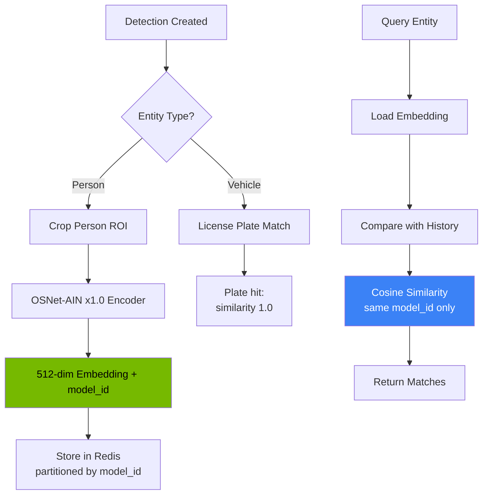
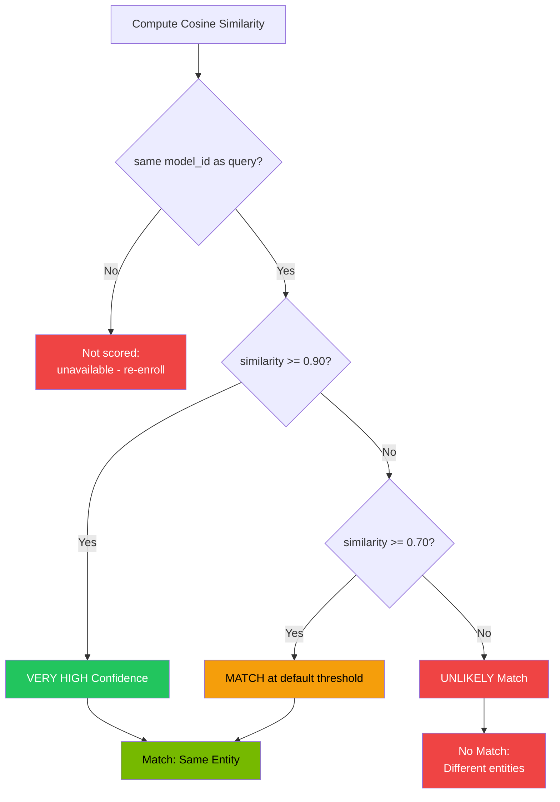
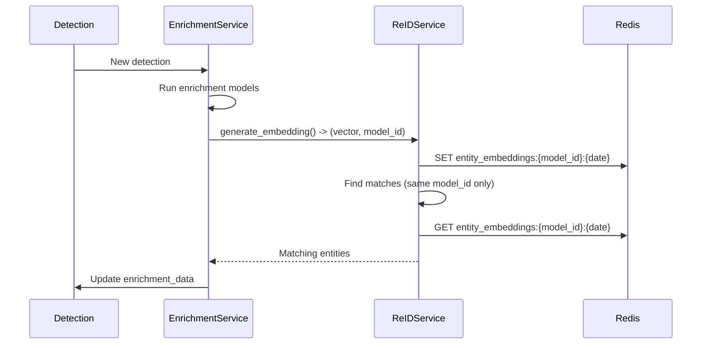

# Entity Tracking and Re-Identification

> Technical documentation for the entity re-identification (ReID) service using OSNet-AIN x1.0 person embeddings.

**Time to read:** ~10 min
**Prerequisites:** [Detection Service](detection-service.md), [Data Model](data-model.md)

---

## Overview

The Re-Identification (ReID) service tracks entities (persons and vehicles) across multiple cameras: persons by computing OSNet-AIN x1.0 embeddings and comparing them for similarity, vehicles by license-plate match (no vehicle embedding producer ships in the resident mode). This enables building movement timelines and correlating events.

## Architecture


```mermaid
flowchart TD
    A[Detection Created] --> B{Entity Type?}
    B -->|Person| C[Crop Person ROI]
    B -->|Vehicle| D[License Plate Match]

    C --> E[OSNet-AIN x1.0 Encoder]

    E --> F[512-dim Embedding + model_id]
    F --> G[Store in Redis<br>partitioned by model_id]

    D --> M[Plate hit:<br>similarity 1.0]

    H[Query Entity] --> I[Load Embedding]
    I --> J[Compare with History]
    J --> K[Cosine Similarity<br>same model_id only]
    K --> L[Return Matches]

    style F fill:#76B900,color:#000
    style K fill:#3B82F6,color:#fff
```

---

## Service API

### ReIdentificationService Class

**Location:** `backend/services/reid_service.py`

```python
from backend.services.reid_service import (
    ReIdentificationService,
    get_reid_service,
    EntityEmbedding,
)

# Use FastAPI dependency injection
@router.get("/entities")
async def list_entities(
    reid_service: ReIdentificationService = Depends(get_reid_service),
):
    # Use service
    pass
```

### Configuration

| Setting                | Default | Environment Variable         | Description                                                                                                    |
| ---------------------- | ------- | ---------------------------- | -------------------------------------------------------------------------------------------------------------- |
| `similarity_threshold` | 0.7     | `REID_SIMILARITY_THRESHOLD`  | Minimum match similarity (OSNet-space value, provisional pending calibration; the 0.85 default was CLIP-tuned) |
| `embedding_ttl`        | 86400   | `REID_EMBEDDING_TTL_SECONDS` | TTL for stored embeddings (24h)                                                                                |
| `max_embeddings`       | 1000    | `REID_MAX_EMBEDDINGS`        | Max embeddings per entity type                                                                                 |

---

## Person Re-ID Embeddings

### What are Person Re-ID Embeddings?

The person-vector space is **OSNet-AIN x1.0** — a dedicated person re-identification network (torchreid's OSNet with AIN, msmt17 weights). Applied to a person crop, it produces a 512-dimensional vector that captures person appearance. CLIP no longer computes person re-ID embeddings; it remains in the system where CLIP's job really is (scene baseline, fashion/threat similarity) behind the ai-gateway `/clip` router.

Key properties:

- **Person-specific:** Trained for person re-identification, not general image semantics
- **Provenanced:** Every vector travels with the `model_id` of the weights that computed it
- **Robust:** Performs well across viewing angles, lighting conditions

### Model Details

| Property            | Value                              |
| ------------------- | ---------------------------------- |
| Model               | OSNet-AIN x1.0                     |
| Embedding Dimension | 512                                |
| Weights File        | `osnet_ain_x1_0_msmt17.pth`        |
| Zoo Row             | `osnet-ain-x1-0` (`models.yml`)    |
| Loader              | `backend/services/osnet_loader.py` |
| Inference Device    | CUDA (GPU) preferred               |
| Batch Support       | Yes                                |

### Provenance (`model_id`)

Every stored person vector carries a `model_id` string naming the weights that produced it, with the grammar `<name>@<weights>@<sha256 prefix 12>` — for the shipped weights, `osnet-ain-x1-0@osnet_ain_x1_0_msmt17@8a07e8da3894`. Rows written before provenance decode to the sentinel `legacy-unknown-provenance` and are **never scored**: a mismatched or unprovenanced vector reads as `unavailable (re-enroll)`. Pre-swap rows are dropped and re-enrolled; there is no backfill.

### Embedding Generation

```python
async def generate_embedding(
    self,
    image: Image.Image,
    bbox: tuple[int, int, int, int] | None = None,
) -> tuple[list[float], str]:
    """Generate a 512-dim OSNet-AIN x1.0 embedding for an image or crop.

    Args:
        image: PIL Image to embed
        bbox: Optional (x1, y1, x2, y2) box to crop before encoding

    Returns:
        (512-dimensional normalized vector, producer model_id)

    Raises:
        ReIDUnavailableError: If the pinned re-ID weights are not resident
    """
```

If a bounding box is provided, the image is cropped to that region before encoding. This focuses the embedding on the detected entity rather than background elements. The producer reads the resident zoo handle and never triggers a load: when the weights are not resident it raises `ReIDUnavailableError` naming the cause rather than returning a zero vector, and the enrollment route answers 503.

---

## Entity Storage

### Redis Key Structure

Embeddings are stored in Redis for fast retrieval, partitioned by provenance and date:

```
entity_embeddings:{model_id}:{date} -> JSON payload
```

Where `{model_id}` is the producer belt described above and `{date}` is formatted as `YYYY-MM-DD` (e.g., `entity_embeddings:osnet-ain-x1-0@osnet_ain_x1_0_msmt17@8a07e8da3894:2026-01-09`). The partition is the strong guard: a search over one vector space physically cannot read another's rows, and a weights swap simply stops writing the old partition (the 24 h TTL expires it). The per-entry `model_id` stays the belt — a key never outranks its payload.

Each key contains a JSON object with separate lists for persons and vehicles.

### Payload Format

The value at each key is a JSON object with `persons` and `vehicles` arrays:

```json
{
  "persons": [
    {
      "detection_id": "12345",
      "camera_id": "front_door",
      "entity_type": "person",
      "timestamp": "2026-01-03T10:30:00Z",
      "embedding": [0.123, -0.456, ...],  // 512 floats
      "model_id": "osnet-ain-x1-0@osnet_ain_x1_0_msmt17@8a07e8da3894",
      "attributes": {
        "confidence": 0.95,
        "clothing": "blue jacket"
      }
    }
  ],
  "vehicles": []
}
```

The payload keeps both arrays, but in the resident mode only `persons` is ever written: there is no vehicle embedding producer (OSNet is a person model, and a vehicle crop through it would be noise wearing plausible numbers), so the enrichment leg skips vehicle detections rather than store a meaningless vector. Vehicle identity rides license-plate match (`backend/services/household_matcher.py`, similarity 1.0 on an exact plate hit), and `RegisteredVehicle.reid_embedding` has no production writer. A vehicle-specific re-ID producer is a named follow-up.

### TTL and Retention

Embeddings expire after 24 hours (configurable via `REID_EMBEDDING_TTL_SECONDS`).

This is intentional:

1. **Privacy:** Limits tracking duration
2. **Storage:** Prevents unbounded Redis memory growth
3. **Relevance:** Old embeddings become less useful for real-time tracking

For longer-term entity tracking, consider persisting to PostgreSQL.

---

## EntityEmbedding Data Class

```python
@dataclass(slots=True)
class EntityEmbedding:
    """Represents a stored entity embedding."""

    entity_type: str  # "person" or "vehicle"
    embedding: list[float]  # 512-dim normalized vector
    camera_id: str
    timestamp: datetime
    detection_id: str
    attributes: dict[str, Any] = field(default_factory=dict)
    model_id: str = LEGACY_MODEL_ID  # producer belt, or the legacy sentinel
```

A payload that never named its producer decodes to `LEGACY_MODEL_ID` (`"legacy-unknown-provenance"`) rather than to the live model — defaulting a silent gap to the current space would launder old CLIP-era bytes into the OSNet space.

### Serialization

Embeddings are serialized to JSON for Redis storage:

```python
def to_dict(self) -> dict:
    return {
        "entity_type": self.entity_type,
        "embedding": self.embedding,
        "camera_id": self.camera_id,
        "timestamp": self.timestamp.isoformat(),
        "detection_id": self.detection_id,
        "attributes": self.attributes,
        "model_id": self.model_id,
    }

@classmethod
def from_dict(cls, data: dict) -> EntityEmbedding:
    return cls(
        entity_type=data["entity_type"],
        embedding=data["embedding"],
        camera_id=data["camera_id"],
        timestamp=datetime.fromisoformat(data["timestamp"]),
        detection_id=data["detection_id"],
        attributes=data.get("attributes", {}),
        model_id=data.get("model_id") or LEGACY_MODEL_ID,
    )
```

---

## Similarity Matching

### Cosine Similarity

Entity matching uses cosine similarity between embedding vectors:

```python
def cosine_similarity(vec1: list[float], vec2: list[float]) -> float:
    """Compute cosine similarity between two vectors.

    Args:
        vec1: First embedding vector
        vec2: Second embedding vector

    Returns:
        Cosine similarity score

    Raises:
        ValueError: If the vectors have different dimensions
    """
    ...
    return float(dot_product / (norm_a * norm_b))
```

Producer vectors arrive L2-normalized, and the helper divides by the norms anyway. The dimension guard matters after the swap: the Re-ID search screens provenance and size before calling in, so a stale 768-d row is skipped rather than raising inside a batch comparison.

### Match Threshold

| Similarity | Interpretation                          |
| ---------- | --------------------------------------- |
| >= 0.90    | Very high confidence match              |
| 0.70-0.90  | Match accepted at the default threshold |
| < 0.70     | Unlikely to be same entity              |

Default threshold: **0.7** (configurable) — the OSNet-AIN x1.0 space's value, PROVISIONAL pending calibration against real household galleries. The former 0.85 default was tuned to CLIP's 768-d space and would drop every legitimate OSNet match.

Only rows that share the query's `model_id` reach the comparison at all; a mismatched or unprovenanced row is never scored.

### Similarity Threshold Decision Tree


```mermaid
flowchart TD
    A[Compute Cosine Similarity] --> B{same model_id as query?}
    B -->|No| N[Not scored:<br>unavailable - re-enroll]
    B -->|Yes| C{similarity >= 0.90?}

    C -->|Yes| E[VERY HIGH Confidence]
    C -->|No| F{similarity >= 0.70?}

    F -->|Yes| G[MATCH at default threshold]
    F -->|No| H[UNLIKELY Match]

    E --> I[Match: Same Entity]
    G --> I
    H --> K[No Match:<br>Different entities]

    style E fill:#22C55E,color:#fff
    style G fill:#F59E0B,color:#000
    style H fill:#EF4444,color:#fff
    style N fill:#EF4444,color:#fff

    style I fill:#76B900,color:#000
    style K fill:#EF4444,color:#fff
```

**Threshold Configuration:**

- **>= 0.90 (Very High):** Automatic match, same entity confirmed
- **0.70-0.90:** Match accepted at the default threshold
- **< 0.70:** Different entities, no correlation recorded
- **Different or missing `model_id`:** Never scored — reported as unavailable, resolved by re-enrollment

### Finding Matches

```python
async def find_matching_entities(
    self,
    redis_client: Redis,
    embedding: list[float],
    entity_type: str = "person",
    threshold: float = DEFAULT_SIMILARITY_THRESHOLD,
    exclude_detection_id: str | None = None,
    include_historical: bool = False,
    camera_id: str | None = None,
    model_id: str | None = None,
) -> list[EntityMatch]:
    """Find entities similar to the query embedding.

    Args:
        redis_client: Redis connection
        embedding: 512-dim embedding to match
        entity_type: "person" or "vehicle"
        threshold: Override default threshold
        exclude_detection_id: Detection to exclude from its own matches
        include_historical: Also search PostgreSQL via hybrid storage
        camera_id: Optional filter by camera
        model_id: Only score rows computed by these weights; without a
            named model_id there is no partition to search

    Returns:
        List of EntityMatch objects, sorted by similarity descending
    """
```

---

## REST API Endpoints

### GET `/api/entities`

List tracked entities with optional filtering.

**Query Parameters:**

| Parameter     | Type         | Description                   |
| ------------- | ------------ | ----------------------------- |
| `entity_type` | string       | Filter: "person" or "vehicle" |
| `camera_id`   | string       | Filter by camera              |
| `since`       | datetime     | Filter entities seen since    |
| `limit`       | int (1-1000) | Max results (default 50)      |
| `offset`      | int          | Pagination offset             |

**Response Schema:** `EntityListResponse`

```json
{
  "entities": [
    {
      "id": "12345",
      "entity_type": "person",
      "first_seen": "2026-01-03T10:15:00Z",
      "last_seen": "2026-01-03T10:30:00Z",
      "appearance_count": 3,
      "cameras_seen": ["front_door", "driveway"],
      "thumbnail_url": "/api/detections/12345/image"
    }
  ],
  "count": 1,
  "limit": 50,
  "offset": 0
}
```

### GET `/api/entities/{entity_id}`

Get detailed information about a specific entity.

**Response Schema:** `EntityDetail`

```json
{
  "id": "12345",
  "entity_type": "person",
  "first_seen": "2026-01-03T10:15:00Z",
  "last_seen": "2026-01-03T10:30:00Z",
  "appearance_count": 3,
  "cameras_seen": ["front_door", "driveway"],
  "thumbnail_url": "/api/detections/12345/image",
  "appearances": [
    {
      "detection_id": "12345",
      "camera_id": "front_door",
      "camera_name": "Front Door",
      "timestamp": "2026-01-03T10:15:00Z",
      "thumbnail_url": "/api/detections/12345/image",
      "similarity_score": 1.0,
      "attributes": { "confidence": 0.95 }
    }
  ]
}
```

### GET `/api/entities/{entity_id}/history`

Get the appearance timeline for an entity.

**Response Schema:** `EntityHistoryResponse`

```json
{
  "entity_id": "12345",
  "entity_type": "person",
  "appearances": [...],
  "count": 3
}
```

---

## Entity Types

### Person Tracking

Person re-identification is challenging due to:

- Clothing changes
- Occlusion (carrying items, partial views)
- Varying poses and viewpoints
- Similar appearances between different people

OSNet-AIN x1.0 is trained specifically for person re-identification, so it reads person appearance rather than the holistic scene semantics a general image encoder would return. It still cannot recover a face or defeat deliberate disguise.

### Vehicle Tracking

Vehicle identity in the resident mode rides license-plate match: an exact, case-insensitive plate hit scores 1.0 (`backend/services/household_matcher.py`). No vehicle embedding producer ships — OSNet is a person model, and a vehicle crop through it would be noise wearing plausible numbers — so `RegisteredVehicle.reid_embedding` has no production writer. A vehicle-specific re-ID producer is a named follow-up.

---

## Enrichment Integration

The ReID service integrates with the enrichment pipeline:


```mermaid
sequenceDiagram
    participant D as Detection
    participant E as EnrichmentService
    participant R as ReIDService
    participant Redis

    D->>E: New detection
    E->>E: Run enrichment models
    E->>R: generate_embedding() -> (vector, model_id)
    R->>Redis: SET entity_embeddings:{model_id}:{date}
    R->>R: Find matches (same model_id only)
    R->>Redis: GET entity_embeddings:{model_id}:{date}
    R-->>E: Matching entities
    E->>D: Update enrichment_data
```

---

## Schemas

### EntitySummary

```python
class EntitySummary(BaseModel):
    """Summary of a tracked entity."""

    id: str
    entity_type: str  # "person" or "vehicle"
    first_seen: datetime
    last_seen: datetime
    appearance_count: int
    cameras_seen: list[str]
    thumbnail_url: str
```

### EntityAppearance

```python
class EntityAppearance(BaseModel):
    """Single appearance of an entity."""

    detection_id: str
    camera_id: str
    camera_name: str
    timestamp: datetime
    thumbnail_url: str
    similarity_score: float
    attributes: dict[str, Any] | None = None
```

### EntityDetail

```python
class EntityDetail(EntitySummary):
    """Detailed entity information with appearances."""

    appearances: list[EntityAppearance]
```

---

## Error Handling

### Service Unavailability

When Redis is unavailable, the API returns graceful fallbacks:

```python
redis = await _get_redis_client()
if redis is None:
    logger.warning("Redis not available for entity list")
    return {"entities": [], "count": 0, "limit": limit, "offset": offset}
```

### Entity Not Found

```python
if not found_embeddings:
    raise HTTPException(
        status_code=status.HTTP_404_NOT_FOUND,
        detail=f"Entity with id '{entity_id}' not found",
    )
```

---

## Performance Considerations

### Embedding Generation

| Factor           | Impact                          |
| ---------------- | ------------------------------- |
| GPU availability | 10-50x faster than CPU          |
| Batch size       | Higher throughput with batching |
| Image resolution | OSNet resizes crops to 256x128  |
| ROI cropping     | Reduces encoding time           |

### Similarity Search

Current implementation uses brute-force scanning. For large deployments:

1. **Vector Database:** Consider Pinecone, Milvus, or Redis Vector Search
2. **Approximate Search:** Use FAISS or Annoy for ANN
3. **Sharding:** Partition by camera or time window

### Memory Usage

| Storage    | Size per Embedding | Notes                   |
| ---------- | ------------------ | ----------------------- |
| Redis      | ~4KB               | JSON with 512 floats    |
| NumPy      | 2KB                | float32 array           |
| PostgreSQL | ~4KB               | If persisting long-term |

---

## Testing

### Unit Tests

**Location:** `backend/tests/unit/services/test_reid_service.py`

```bash
uv run pytest backend/tests/unit/services/test_reid_service.py -v
```

### Mocking the Producer

For tests without GPU: `reid_service` calls the loader **via the module**, so the seams are patched as module attributes — a resident handle plus a fake extraction. A handle of `None` is the unavailable path, which must raise rather than return zeros.

```python
import backend.services.osnet_loader as ol

TEST_MODEL = "osnet-ain-x1-0@osnet_ain_x1_0_msmt17@8a07e8da3894"

monkeypatch.setattr(
    ol, "get_reid_handle",
    lambda: {"model": MagicMock(), "transform": MagicMock(), "model_id": TEST_MODEL},
)
monkeypatch.setattr(ol, "extract_person_embedding", extract_double)
# generate_embedding() now returns ([...512 floats...], TEST_MODEL)
```

### Integration Tests

The producer's loader suite runs without a GPU (torch and torchreid are mocked):

```bash
uv run pytest backend/tests/integration/services/test_osnet_loader.py -v
```

---

## Security and Privacy

### Data Minimization

- Embeddings are numerical vectors, not images
- Original faces/appearances are not stored in ReID cache
- TTL ensures automatic expiration

### Access Control

- ReID data is accessible only through authenticated API
- No direct Redis access from frontend
- Audit logging for entity queries (if enabled)

### Ethical Considerations

Re-identification technology has privacy implications:

1. **Purpose Limitation:** Use only for legitimate security purposes
2. **Transparency:** Document tracking capabilities for users
3. **Retention:** Keep embeddings only as long as necessary
4. **Consent:** Consider notification when tracking is active

---

## Future Enhancements

### Planned Features

1. **Clustering:** Group similar entities automatically
2. **Named Entities:** Allow users to name known individuals
3. **Cross-Day Tracking:** Persist embeddings to database
4. **Vehicle Re-ID:** A dedicated vehicle embedding producer (person vectors do not transfer; vehicle identity is plate-match only today)
5. **Watch Lists:** Alert when specific entities appear

---

## Next Steps

- [Clip Generation](clip-generation.md) - Video clip creation
- [Detection Service](detection-service.md) - Object detection pipeline
- [Pipeline Overview](pipeline-overview.md) - End-to-end flow

---

## See Also

- [Enrichment Panel](https://github.com/mikesvoboda/nemotron-v3-home-security-intelligence/blob/main/frontend/src/components/events/EnrichmentPanel.tsx) - UI component
- [Entities API Schema](api/core-resources.md) - OpenAPI spec
- [AI Overview](../operator/ai-overview.md) - Model zoo details (including the OSNet re-ID row)

---

[Back to Developer Hub](README.md)
