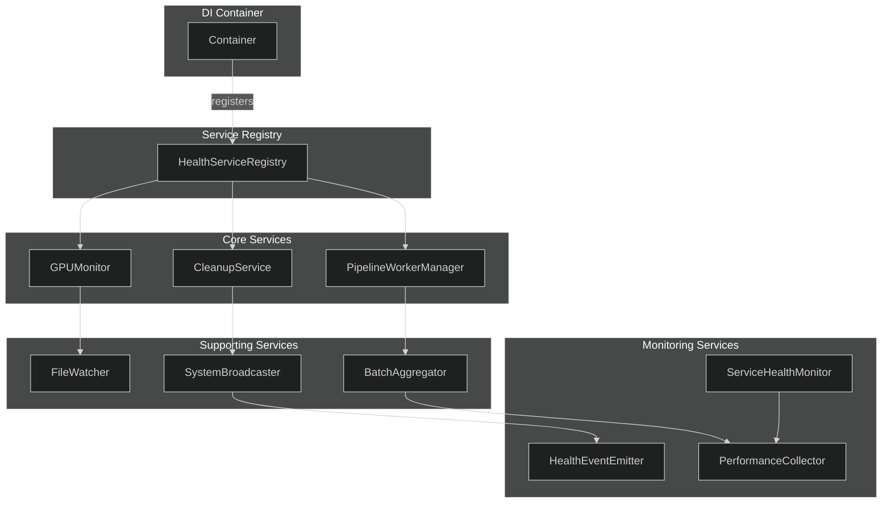

# Health Monitoring Dependency Injection (NEM-2611)

This document describes the dependency injection pattern for health monitoring services.

## Overview

Health monitoring services are wired through the DI pattern:

- The `Container` class in `backend/core/container.py` owns service construction
- `HealthServiceRegistry` (`backend/services/health_service_registry.py`) is the centralized registry of running workers
- FastAPI dependencies in `backend/api/dependencies.py` inject the registry into route handlers
- Route handlers read worker state through the registry instead of module-level handles

## Service Architecture



## Service Initialization Order

Services are initialized during application startup in the lifespan context manager (`backend/main.py`):

1. **Container Services** (via `wire_services` in `backend/core/container.py`):

   - `health_service_registry` - Created first as other services register with it (`backend/core/container.py:471`)
   - `health_event_emitter` - WebSocket health event emission (`backend/core/container.py:475`)
   - `redis_client` - Async singleton for Redis connection (`backend/core/container.py:483`)
   - Other AI services (context_enricher, vlm_analyzer, detector_client, face/plate detector services)

2. **Background Workers** (main.py lifespan):

   - `FileWatcher` - Camera image monitoring (`backend/main.py:938`)
   - `PerformanceCollector` - Performance metrics (`backend/main.py:1036`)
   - `GPUMonitor` - GPU resource monitoring (`backend/main.py:1043`)
   - `CleanupService` - Data cleanup (`backend/main.py:1048`)
   - `ServiceHealthMonitor` - Auto-recovery monitoring (`backend/main.py:1111`)
   - `PipelineWorkerManager` - Detection/analysis workers
   - `SystemBroadcaster` - WebSocket status updates

3. **Registration with Registry**:
   - Each service registers with `HealthServiceRegistry` after creation (`backend/main.py:1185`)
   - This makes services available for health checks

## Using the Registry

### In Route Handlers

```python
from fastapi import Depends
from backend.api.dependencies import get_health_service_registry_dep
from backend.services.health_service_registry import HealthServiceRegistry

@router.get("/workers/status")
async def get_worker_statuses(
    registry: HealthServiceRegistry = Depends(get_health_service_registry_dep),
):
    return registry.get_worker_statuses()
```

### Getting Services

```python
# Get specific service
gpu_monitor = registry.gpu_monitor

# Check if critical workers are healthy
is_healthy = registry.are_critical_pipeline_workers_healthy()

# Get circuit breaker
circuit_breaker = registry.circuit_breaker
```

The registry exposes a `register_*` method per worker (`register_gpu_monitor`, `register_cleanup_service`, `register_system_broadcaster`, `register_file_watcher`, `register_pipeline_manager`, `register_batch_aggregator`, `register_degradation_manager`, `register_service_health_monitor`, `register_performance_collector`, `register_health_event_emitter`).

## Circuit Breaker Pattern

The registry includes a circuit breaker for health checks (`HealthCircuitBreaker` in `backend/services/health_service_registry.py`):

```python
# Circuit breaker automatically tracks failures
if registry.circuit_breaker.is_open("redis"):
    # Skip health check, return cached error
    return {"status": "unhealthy", "error": circuit_breaker.get_cached_error("redis")}

# Perform health check
try:
    result = await redis.ping()
    registry.circuit_breaker.record_success("redis")
except Exception as e:
    registry.circuit_breaker.record_failure("redis", str(e))
```

## Testing with DI

The DI pattern makes testing straightforward — override the dependency:

```python
from unittest.mock import MagicMock
from fastapi.testclient import TestClient

def test_worker_statuses():
    mock_registry = MagicMock()
    mock_registry.get_worker_statuses.return_value = [
        WorkerStatus(name="gpu_monitor", running=True)
    ]

    app.dependency_overrides[get_health_service_registry_dep] = lambda: mock_registry

    # Worker statuses are reported in the readiness payload
    response = client.get("/api/system/health/ready")
    assert response.status_code == 200
```

## Using the Registry in a Route

To read worker state from a route handler:

1. Import the dependency:

   ```python
   from backend.api.dependencies import get_health_service_registry_dep
   ```

2. Add the dependency to the route:

   ```python
   async def my_route(
       registry: HealthServiceRegistry = Depends(get_health_service_registry_dep),
   ):
       # Read worker state through the registry
       gpu_stats = await registry.gpu_monitor.get_stats()
   ```

## Service Lifecycle

### Startup

1. Container is created and services are wired
2. Background workers are started
3. Workers register with HealthServiceRegistry
4. Application accepts requests

### Shutdown

1. Application stops accepting requests
2. Queues are drained (graceful shutdown)
3. Background workers are stopped in reverse order
4. Container shuts down services (calls close/disconnect)

## Key Files

| File                                          | Purpose                                     |
| --------------------------------------------- | ------------------------------------------- |
| `backend/services/health_service_registry.py` | Registry class and health circuit breaker   |
| `backend/core/container.py`                   | Health service registrations in the DI wire |
| `backend/main.py`                             | Worker construction and registration        |
| `backend/services/health_event_emitter.py`    | WebSocket health event emission             |
| `backend/api/dependencies.py`                 | Dependency functions                        |

## Related Issues

- NEM-2611: Health monitoring dependency injection
- NEM-1636: DI container implementation
