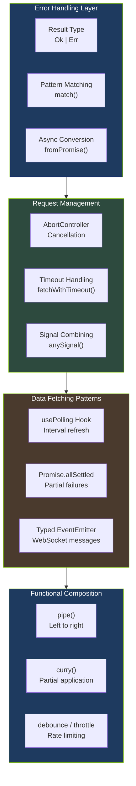
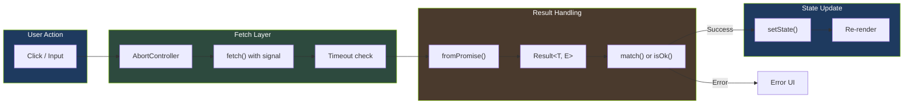

# Frontend JavaScript/TypeScript Patterns

This document describes the modern JavaScript and TypeScript patterns used in this codebase. These patterns promote type safety, explicit error handling, and clean functional composition.

## Pattern Overview



_Frontend patterns are organized into four layers: error handling, request management, data fetching, and functional composition._

## Table of Contents

- [Result Type for Error Handling](#result-type-for-error-handling)
- [AbortController for Request Cancellation](#abortcontroller-for-request-cancellation)
- [usePolling Hook](#usepolling-hook)
- [Typed Event Emitter](#typed-event-emitter)
- [Promise.allSettled Patterns](#promiseallsettled-patterns)
- [Functional Utilities](#functional-utilities)

---

## Result Type for Error Handling

**Location:** `frontend/src/lib/result.ts`

The Result type is a discriminated union that represents either success (`Ok`) or failure (`Err`). This pattern, inspired by Rust, makes error handling explicit in the type system rather than relying on exceptions.

### Why Use Result?

- **Explicit error handling:** Errors are visible in function signatures
- **Type safety:** TypeScript enforces handling both success and error cases
- **Composable:** Chain operations with `map`, `flatMap`, and other utilities
- **No surprises:** Unlike exceptions, errors don't propagate silently

### Basic Usage

```typescript
import { ok, err, isOk, isErr, Result } from '@/lib/result';

// Function that returns a Result
function divide(a: number, b: number): Result<number, string> {
  if (b === 0) {
    return err('Division by zero');
  }
  return ok(a / b);
}

// Using the Result
const result = divide(10, 2);

if (isOk(result)) {
  console.log(result.value); // 5
} else {
  console.error(result.error); // Won't reach here
}
```

### Transformation Utilities

```typescript
import { map, mapErr, flatMap, unwrapOr } from '@/lib/result';

// Transform success values
const doubled = map(result, (n) => n * 2);

// Transform error values
const mapped = mapErr(result, (e) => new Error(e));

// Chain Result-returning functions
const validated = flatMap(result, (n) => (n > 0 ? ok(n) : err('Must be positive')));

// Extract with default
const value = unwrapOr(result, 0);
```

### Pattern Matching

```typescript
import { match } from '@/lib/result';

const message = match(result, {
  onOk: (value) => `Success: ${value}`,
  onErr: (error) => `Error: ${error}`,
});
```

### Async Operations

```typescript
import { fromPromise, toPromise } from '@/lib/result';

// Convert Promise to Result
const result = await fromPromise(fetch('/api/data'));

if (isOk(result)) {
  const response = result.value;
  // Handle response
}

// Convert Result back to Promise
await toPromise(ok(42)); // Resolves to 42
await toPromise(err('oops')); // Rejects with 'oops'
```

### Combining Results

```typescript
import { all, allTuple } from '@/lib/result';

// Combine array of Results
const results = [ok(1), ok(2), ok(3)];
const combined = all(results); // Ok([1, 2, 3])

// With type-safe tuples
const tuple = allTuple([ok(42), ok('hello'), ok(true)] as const);
// Result<[number, string, boolean], never>
```

---

## AbortController for Request Cancellation

**Location:** `frontend/src/services/api.ts`

AbortController is the standard Web API for cancelling fetch requests. This is essential for preventing race conditions when user input changes rapidly (e.g., search filters) and for cleanup in React effects.

### Why Use AbortController?

- **Prevent race conditions:** Cancel stale requests when new ones are made
- **Clean React effects:** Cancel pending requests on unmount
- **Resource efficiency:** Don't process responses that are no longer needed

### Basic Usage

```typescript
// Create controller and pass signal to fetch
const controller = new AbortController();

fetch('/api/data', { signal: controller.signal })
  .then((response) => response.json())
  .then((data) => console.log(data))
  .catch((error) => {
    if (error.name === 'AbortError') {
      console.log('Request was cancelled');
    } else {
      console.error('Request failed:', error);
    }
  });

// Cancel the request
controller.abort();
```

### React Effect Pattern

```typescript
useEffect(() => {
  const controller = new AbortController();

  async function fetchData() {
    try {
      const response = await fetch('/api/data', {
        signal: controller.signal,
      });
      const data = await response.json();
      setData(data);
    } catch (error) {
      if (!isAbortError(error)) {
        setError(error);
      }
    }
  }

  fetchData();

  // Cleanup: cancel request on unmount or dependency change
  return () => controller.abort();
}, [dependency]);
```

### Checking for Abort Errors

```typescript
import { isAbortError } from '@/services/api';

try {
  await fetchData({ signal: controller.signal });
} catch (error) {
  if (isAbortError(error)) {
    // Request was cancelled - this is expected, not an error
    return;
  }
  // Handle actual errors
  console.error('Request failed:', error);
}
```

### Timeout with AbortController

```typescript
import { fetchWithTimeout, TimeoutError, isTimeoutError } from '@/services/api';

try {
  // Automatically aborts after 5 seconds
  const response = await fetchWithTimeout('/api/data', { timeout: 5000 });
} catch (error) {
  if (isTimeoutError(error)) {
    console.error('Request timed out');
  }
}
```

### Combining Signals

```typescript
import { anySignal } from '@/services/api';

// Combine user cancellation with timeout
const userController = new AbortController();
const timeoutController = new AbortController();

// Aborts if either signal aborts
const combined = anySignal([userController.signal, timeoutController.signal]);

fetch('/api/data', { signal: combined });
```

---

## usePolling Hook

**Location:** `frontend/src/hooks/usePolling.ts`

A generic React hook for polling data at regular intervals. Handles loading state, errors, and provides a manual refetch function.

### Why Use usePolling?

- **Reusable:** Same pattern for all polling needs
- **Clean API:** Handles loading/error state automatically
- **Callbacks:** Optional success/error handlers
- **Controllable:** Enable/disable polling dynamically

### Basic Usage

```typescript
import { usePolling } from '@/hooks/usePolling';

function SystemStatus() {
  const { data, loading, error, refetch } = usePolling({
    fetcher: () => fetchSystemHealth(),
    interval: 30000, // Poll every 30 seconds
  });

  if (loading) return <Spinner />;
  if (error) return <Error message={error.message} />;

  return (
    <div>
      <StatusBadge status={data.status} />
      <button onClick={refetch}>Refresh</button>
    </div>
  );
}
```

### With Callbacks

```typescript
const { data } = usePolling({
  fetcher: () => fetchAlerts(),
  interval: 10000,
  enabled: isConnected,
  onSuccess: (data) => {
    if (data.hasNew) {
      showNotification('New alerts!');
    }
  },
  onError: (error) => {
    reportError('Alert polling failed', error);
  },
});
```

### Conditional Polling

```typescript
const { data } = usePolling({
  fetcher: () => fetchQueueStatus(),
  interval: 5000,
  enabled: queueIsActive, // Only poll when queue is active
});
```

---

## Typed Event Emitter

**Location:** `frontend/src/hooks/typedEventEmitter.ts`

A type-safe event emitter for WebSocket message handling. Provides compile-time type checking for event names and their payloads.

### Why Use Typed Event Emitter?

- **Type safety:** Event names and payloads are type-checked
- **Autocomplete:** IDE knows available events and their types
- **Prevents bugs:** Can't emit wrong data types for an event

### Basic Usage

```typescript
import { TypedWebSocketEmitter } from '@/hooks/typedEventEmitter';

const emitter = new TypedWebSocketEmitter();

// Subscribe with type-safe handler
const unsubscribe = emitter.on('event', (data) => {
  // TypeScript knows data is SecurityEventData
  console.log(data.risk_score);
});

// Emit with type-checked payload
emitter.emit('event', {
  id: '123',
  camera_id: 'front_door',
  risk_score: 75,
  risk_level: 'high',
  summary: 'Person detected',
});

// Cleanup
unsubscribe();
```

### One-Time Listeners

```typescript
// Handler automatically removed after first call
emitter.once('system_status', (data) => {
  console.log('Initial status:', data.health);
});
```

### Handling WebSocket Messages

```typescript
// In WebSocket onmessage handler
ws.onmessage = (event) => {
  const message = JSON.parse(event.data);
  const handled = emitter.handleMessage(message);

  if (!handled) {
    console.warn('Unknown message type:', message);
  }
};
```

### Utility Methods

```typescript
// Check if event has listeners
if (emitter.has('event')) {
  emitter.emit('event', data);
}

// Get listener count
const count = emitter.listenerCount('event');

// Remove all listeners for an event
emitter.removeAllListeners('event');

// Clear all listeners
emitter.clear();

// Get all events with listeners
const events = emitter.events();
```

---

## Promise.allSettled Patterns

`Promise.allSettled` waits for all promises to complete (either fulfilled or rejected) and returns their results. This is essential when you need data from multiple sources and want to handle partial failures gracefully.

### Why Use Promise.allSettled?

- **No short-circuit:** Unlike `Promise.all`, doesn't fail on first error
- **Partial data:** Get successful results even if some requests fail
- **Graceful degradation:** Show what you can, handle what you can't

### Basic Usage

```typescript
const [userResult, settingsResult, notificationsResult] = await Promise.allSettled([
  fetchUser(userId),
  fetchSettings(userId),
  fetchNotifications(userId),
]);

// Each result is either { status: 'fulfilled', value: T }
// or { status: 'rejected', reason: Error }

const user = userResult.status === 'fulfilled' ? userResult.value : null;
const settings = settingsResult.status === 'fulfilled' ? settingsResult.value : defaults;
const notifications = notificationsResult.status === 'fulfilled' ? notificationsResult.value : [];
```

### Real-World Example: AI Metrics Hook

```typescript
// From useAIMetrics.ts
const [
  metricsResult,
  telemetryResult,
  healthResult,
  pipelineResult,
  dlqResult,
  detectionStatsResult,
] = await Promise.allSettled([
  fetchAIMetrics(),
  fetchTelemetry(),
  fetchHealth(),
  fetchPipelineLatency(60),
  fetchDlqStats(),
  fetchDetectionStats(),
]);

// Extract successful results with fallbacks
const metrics = metricsResult.status === 'fulfilled' ? metricsResult.value : null;
const telemetry = telemetryResult.status === 'fulfilled' ? telemetryResult.value : null;
const health = healthResult.status === 'fulfilled' ? healthResult.value : null;

// Update state with whatever data we got
setState({
  metrics,
  telemetry,
  health,
  lastUpdated: new Date().toISOString(),
});
```

### Helper Function

```typescript
function getSettledValue<T>(result: PromiseSettledResult<T>, fallback: T): T {
  return result.status === 'fulfilled' ? result.value : fallback;
}

// Usage
const user = getSettledValue(userResult, defaultUser);
```

---

## Functional Utilities

**Location:** `frontend/src/lib/functional.ts`

A collection of utility functions for functional programming patterns.

### Function Composition

#### pipe (left-to-right)

```typescript
import { pipe } from '@/lib/functional';

const processData = pipe(
  (x: number) => x * 2,
  (x: number) => x + 1,
  (x: number) => x.toString()
);

processData(5); // "11"
```

#### compose (right-to-left)

```typescript
import { compose } from '@/lib/functional';

// Mathematical notation: f . g = f(g(x))
const process = compose(
  (x: number) => x.toString(), // Applied last
  (x: number) => x + 1,
  (x: number) => x * 2 // Applied first
);

process(5); // "11"
```

### Currying

```typescript
import { curry, curry3 } from '@/lib/functional';

// Two-argument curry
const add = curry((a: number, b: number) => a + b);
const add5 = add(5);
add5(3); // 8

// Useful with array methods
const numbers = [1, 2, 3];
const multiply = curry((factor: number, x: number) => x * factor);
numbers.map(multiply(2)); // [2, 4, 6]

// Three-argument curry
const replace = curry3((search: string, replacement: string, str: string) =>
  str.replace(search, replacement)
);
const sanitize = replace('<', '&lt;');
sanitize('<script>'); // '&lt;script>'
```

### Debounce

Delays function execution until after wait time has elapsed since last call.

```typescript
import { debounce } from '@/lib/functional';

const debouncedSearch = debounce((query: string) => {
  console.log('Searching:', query);
}, 300);

// Only logs once, 300ms after last call
debouncedSearch('a');
debouncedSearch('ab');
debouncedSearch('abc'); // Only this triggers

// Control methods
debouncedSearch.cancel(); // Cancel pending call
debouncedSearch.flush(); // Execute immediately
debouncedSearch.pending(); // Check if call is pending

// Options
const leading = debounce(fn, 300, { leading: true }); // Fire on first call
const noTrailing = debounce(fn, 300, { trailing: false }); // Don't fire after wait
```

### Throttle

Limits function calls to at most once per wait period.

```typescript
import { throttle } from '@/lib/functional';

const throttledScroll = throttle(() => {
  console.log('Scroll position:', window.scrollY);
}, 100);

window.addEventListener('scroll', throttledScroll);

// Options
const noLeading = throttle(fn, 100, { leading: false }); // Delay first call
const noTrailing = throttle(fn, 100, { trailing: false }); // No call after period
```

### Other Utilities

```typescript
import { once, memoize, negate, constant, identity } from '@/lib/functional';

// once - Call at most once
const initialize = once(() => {
  console.log('Initialized');
  return config;
});
initialize(); // Logs "Initialized"
initialize(); // Returns cached config, no log

// memoize - Cache results
const expensive = memoize((n: number) => {
  console.log('Computing...');
  return n * 2;
});
expensive(5); // Logs "Computing...", returns 10
expensive(5); // Returns 10 (cached, no log)

// negate - Flip boolean result
const isEven = (n: number) => n % 2 === 0;
const isOdd = negate(isEven);
[1, 2, 3, 4].filter(isOdd); // [1, 3]

// constant - Always return same value
const always42 = constant(42);
always42(); // 42

// identity - Return input unchanged
identity(42); // 42
```

---

## Data Flow Visualization



_Data flows from user action through fetch with cancellation, Result type handling, and finally state update._

---

## Best Practices

### 1. Prefer Result over Exceptions

```typescript
// Avoid
async function fetchUser(id: string): Promise<User> {
  const response = await fetch(`/api/users/${id}`);
  if (!response.ok) throw new Error('Not found');
  return response.json();
}

// Prefer
async function fetchUser(id: string): Promise<Result<User, ApiError>> {
  const response = await fetch(`/api/users/${id}`);
  if (!response.ok) {
    return err({ status: response.status, message: 'Not found' });
  }
  return ok(await response.json());
}
```

### 2. Always Cancel Requests in Effects

```typescript
useEffect(() => {
  const controller = new AbortController();

  fetchData({ signal: controller.signal });

  return () => controller.abort(); // Always cleanup
}, [dependencies]);
```

### 3. Use Promise.allSettled for Independent Requests

```typescript
// If requests are independent, use allSettled
const results = await Promise.allSettled([fetchA(), fetchB(), fetchC()]);

// If requests depend on each other, use Promise.all
const [a, b] = await Promise.all([fetchA(), fetchB()]);
const c = await fetchC(a, b);
```

### 4. Type Your Event Emitters

```typescript
// Define event map
interface EventMap {
  'user:login': { userId: string };
  'user:logout': void;
  'data:update': { items: Item[] };
}

// Use typed emitter
const emitter = new TypedEventEmitter<EventMap>();
emitter.on('user:login', ({ userId }) => {
  // TypeScript knows userId is string
});
```

### 5. Compose Small Functions

```typescript
// Avoid one big function
function processData(input: string): number {
  const parsed = parseInt(input, 10);
  const doubled = parsed * 2;
  const bounded = Math.min(doubled, 100);
  return bounded;
}

// Prefer composed small functions
const parse = (s: string) => parseInt(s, 10);
const double = (n: number) => n * 2;
const cap = (max: number) => (n: number) => Math.min(n, max);

const processData = pipe(parse, double, cap(100));
```
