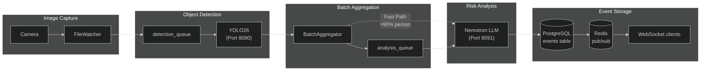

# AI Pipeline Overview

> High-level understanding of the detection and analysis flow.

**Time to read:** ~8 min
**Prerequisites:** [Codebase Tour](codebase-tour.md)

---

## What the Pipeline Does

The AI pipeline transforms raw camera images into risk-scored security events through a multi-stage process:

```
Camera FTP -> FileWatcher -> detection_queue -> YOLO26 -> Detections
  -> Enrichment (context + model zoo + optional Florence/CLIP) -> BatchAggregator -> analysis_queue
  -> Nemotron LLM -> Event -> WebSocket
```

---

## Pipeline Stages

### 1. Image Capture

Foscam cameras upload images via FTP when motion is detected.

**Directory structure:**

```
/export/foscam/
  front_door/
    MDAlarm_20251228_120000.jpg
    MDAlarm_20251228_120030.jpg
  backyard/
    snap_20251228_120015.jpg
```

### 2. File Watching

The FileWatcher service monitors directories using OS-native notifications (inotify on Linux, FSEvents on macOS).

**Key behaviors:**

- Debounce delay: 0.5 seconds (handles FTP chunked uploads)
- Image validation via PIL
- Deduplication via SHA256 content hash

**Source:** `backend/services/file_watcher.py`

### 3. Object Detection

YOLO26 receives images and returns detected objects with bounding boxes.

**Security-relevant classes:**

- person, car, truck, bus
- dog, cat, bird
- bicycle, motorcycle

**Source:** `backend/services/detector_client.py`, `ai/yolo26/model.py`

### 4. Batch Aggregation

Detections are grouped into time-windowed batches before LLM analysis.

**Why batch?**

- Better LLM context (see full activity, not isolated frames)
- Reduced noise from frame-to-frame variations
- More efficient (one LLM call per event, not per frame)

**Timing:**

- Window: 90 seconds maximum
- Idle timeout: 30 seconds no activity

**Source:** `backend/services/batch_aggregator.py`

### 5. Fast Path

High-confidence critical detections bypass batching:

- Confidence >= 0.90
- Object type is `person`
- Creates event with `is_fast_path=True`

**Latency:** ~3-6 seconds (vs. 30-90 seconds for normal path)

### 6. Risk Analysis

Nemotron LLM analyzes batched detections and generates:

- Risk score (0-100)
- Risk level (low/medium/high/critical)
- Human-readable summary
- Reasoning explanation

**Source:** `backend/services/nemotron_analyzer.py`

### 6.5 Enrichment (Context + Model Zoo)

Before calling the LLM, the backend can enrich a batch with additional context:

- **ContextEnricher**: zones, baseline deviation, cross-camera activity
- **EnrichmentPipeline**: model-zoo enrichment (plates/OCR, faces, clothing/vehicle/pet signals, image quality/tamper, etc.)
- **Optional AI services**: Florence-2 and CLIP (when enabled/configured)

This enrichment is designed to be **best-effort**: if an enrichment service is unavailable, the system should
continue with a less enriched prompt rather than failing the entire pipeline.

**Source:** `backend/services/context_enricher.py`, `backend/services/enrichment_pipeline.py`

### 7. Event Creation

Analysis results are stored as Event records in PostgreSQL with links to source detections.

### 8. WebSocket Broadcast

New events are published via Redis pub/sub to all connected WebSocket clients.

**Source:** `backend/services/event_broadcaster.py`

---

## Data Flow Diagram



---

## Timing Characteristics

| Stage                 | Duration | Notes                       |
| --------------------- | -------- | --------------------------- |
| File upload detection | ~10ms    | OS filesystem notifications |
| Debounce delay        | 500ms    | Configurable                |
| Image validation      | ~5-10ms  | PIL verify()                |
| YOLO26 inference      | 30-50ms  | GPU accelerated             |
| Database write        | ~5-10ms  | PostgreSQL async            |
| Batch window          | 30-90s   | Collects related detections |
| Nemotron inference    | 2-5s     | GPU accelerated             |
| Event creation        | ~10ms    | Database + WebSocket        |

**Total latency:**

- Fast path: ~3-6 seconds
- Normal path: 30-95 seconds (dominated by batch window)

---

## Key Configuration

| Variable                         | Default    | Description                  |
| -------------------------------- | ---------- | ---------------------------- |
| `BATCH_WINDOW_SECONDS`           | 90         | Maximum batch duration       |
| `BATCH_IDLE_TIMEOUT_SECONDS`     | 30         | Close batch if no activity   |
| `FAST_PATH_CONFIDENCE_THRESHOLD` | 0.90       | Bypass batching threshold    |
| `FAST_PATH_OBJECT_TYPES`         | ["person"] | Types eligible for fast path |
| `DETECTION_CONFIDENCE_THRESHOLD` | 0.5        | Minimum confidence to store  |

---

## Resource Usage

VRAM depends on the deployed model sizes and which enrichment services are enabled. For authoritative ports/env,
see [Environment Variable Reference](../reference/config/env-reference.md).

---

## Next Steps

- [Detection Service](detection-service.md) - YOLO26 integration details
- [Batching Logic](batching-logic.md) - How detections are grouped
- [Risk Analysis](risk-analysis.md) - LLM processing and scoring

---

## See Also

- [AI Overview](../operator/ai-overview.md) - Operator perspective on AI services
- [Data Model](data-model.md) - Database schema for events and detections
- [Video Processing](video.md) - How camera images enter the pipeline
- [Risk Levels Reference](../reference/config/risk-levels.md) - Risk score definitions

---

[Back to Developer Hub](README.md)
