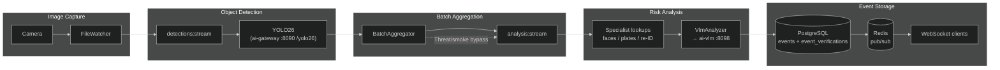

# AI Pipeline Overview

> High-level understanding of the detection and analysis flow.

**Time to read:** ~8 min
**Prerequisites:** [Codebase Tour](codebase-tour.md)

For the exhaustive hop-by-hop version, see
[AI pipeline current state](../architecture/ai-pipeline-current-state.md).

---

## What the Pipeline Does

The AI pipeline transforms raw camera images into risk-scored security events through a multi-stage process:

```
Camera FTP -> FileWatcher -> detections:stream -> DetectorClient
  -> ai-gateway /yolo26 (Triton) -> Detections -> BatchAggregator
  -> analysis:stream -> VlmAnalyzer (key frames + specialist lookups
  + ai-vlm verdict) -> Event + EventVerification -> WebSocket
```

With `USE_REDIS_STREAMS=true` (the default, `backend/core/config.py:2239`)
the two hops are Redis streams; with it false they are the list
queues `detection_queue`/`analysis_queue` with a retry handler. Both feed the
same DLQ names the `/api/dlq` routes read.

---

## Pipeline Stages

### 1. Image Capture

Foscam cameras upload images via FTP when motion is detected.

**Directory structure:**

```
/export/foscam/
  front_door/
    MDAlarm_20251228_120000.jpg
    MDAlarm_20251228_120030.jpg
  backyard/
    snap_20251228_120015.jpg
```

### 2. File Watching

The FileWatcher service monitors directories using OS-native notifications (inotify on Linux, FSEvents on macOS).

**Key behaviors:**

- Debounce delay: 0.5 seconds (handles FTP chunked uploads)
- Image validation via PIL
- Deduplication via SHA256 content hash

**Source:** `backend/services/file_watcher.py`

### 3. Object Detection

The detection worker posts each image to the Triton gateway
(`YOLO26_URL` → `http://ai-gateway:8090/yolo26`) and YOLO26 returns detected
objects with bounding boxes.

**Security-relevant classes:**

- person, car, truck, bus
- dog, cat, bird
- bicycle, motorcycle

**Source:** `backend/services/detector_client.py`,
`ai/gateway/adapters/yolo26.py`

### 4. Batch Aggregation

Detections are grouped into time-windowed batches before analysis
(`backend/services/batch_aggregator.py:172`).

**Why batch?**

- Better VLM context (see full activity, not isolated frames)
- Reduced noise from frame-to-frame variations
- More efficient (one VLM call per event, not per frame)

**Timing (three close triggers):**

- Window: 90 seconds maximum (`BATCH_WINDOW_SECONDS`)
- Idle timeout: 30 seconds no activity (`BATCH_IDLE_TIMEOUT_SECONDS`)
- Max size: 500 detections (`BATCH_MAX_DETECTIONS`)

**Bypasses:** high-confidence weapon threats (knife/pistol/rifle at
confidence ≥ 0.7) and smoke/fire (fire ≥ 0.70, smoke ≥ 0.75) skip the batch
window entirely (`backend/services/batch_aggregator.py:1294`). The generic
"high-confidence person" fast path is **disabled by default** — its
threshold (`FAST_PATH_CONFIDENCE_THRESHOLD`) ships at an impossible 2.0 with
an empty type list, because that path analyzes without specialist context.

### 5. Risk Analysis

`VlmAnalyzer.analyze_batch()` (`backend/services/vlm_analyzer.py:380`) takes
the closed batch and:

1. Selects 1-4 key frames (`backend/services/key_frame_selector.py:73`)
2. Runs the three in-process specialist lookup legs — faces, plates, person
   re-ID — as database lookups (`backend/services/vlm_specialists.py:884`)
3. Renders one prompt (detections + zones + household + specialist lines +
   the stills) and asks `ai-vlm` for a constrained JSON verdict
4. Applies the verdict invariants, writes `Event` + `EventVerification` +
   `event_detections`, and broadcasts

The event carries:

- Risk score (0-100) and risk level (low/medium/high/critical, derived)
- Verdict (`confirmed` / `rejected` / `uncertain` / `verification_failed`)
- Human-readable summary and reasoning

**Source:** `backend/services/vlm_analyzer.py`, `backend/services/vlm_client.py`

### 6. Event Creation

Analysis results are stored as Event records in PostgreSQL with links to
source detections (`backend/models/event.py:36`).

### 7. WebSocket Broadcast

New events are published via Redis pub/sub to all connected WebSocket
clients — last and best-effort, never undoing the commit.

**Source:** `backend/services/event_broadcaster.py`

---

## Data Flow Diagram


```mermaid
%%{init: {'theme': 'dark'}}%%
flowchart LR
    subgraph Input["Image Capture"]
        Camera[Camera]
        FW[FileWatcher]
    end

    subgraph Detection["Object Detection"]
        DS[detections:stream]
        YOLO["YOLO26<br/>(ai-gateway :8090 /yolo26)"]
    end

    subgraph Batching["Batch Aggregation"]
        BA[BatchAggregator]
        AS[analysis:stream]
    end

    subgraph Analysis["Risk Analysis"]
        SPEC[Specialist lookups<br/>faces / plates / re-ID]
        VLM["VlmAnalyzer<br/>→ ai-vlm :8098"]
    end

    subgraph Storage["Event Storage"]
        DB[(PostgreSQL<br/>events + event_verifications)]
        Redis[(Redis<br/>pub/sub)]
        WS[WebSocket clients]
    end

    Camera --> FW
    FW --> DS
    DS --> YOLO
    YOLO --> BA
    BA --> AS
    BA -.->|Threat/smoke bypass| AS
    AS --> SPEC
    SPEC --> VLM
    VLM --> DB
    DB --> Redis
    Redis --> WS
```

---

## Timing Characteristics

| Stage                 | Duration | Notes                                                                                                                                                |
| --------------------- | -------- | ---------------------------------------------------------------------------------------------------------------------------------------------------- |
| File upload detection | ~10ms    | OS filesystem notifications                                                                                                                          |
| Debounce delay        | 500ms    | Configurable                                                                                                                                         |
| Image validation      | ~5-10ms  | PIL verify()                                                                                                                                         |
| YOLO26 inference      | 30-50ms  | GPU accelerated (Triton)                                                                                                                             |
| Database write        | ~5-10ms  | PostgreSQL async                                                                                                                                     |
| Batch window          | 30-90s   | Collects related detections                                                                                                                          |
| VLM assessment        | 2-25s    | One call; retried once only where re-asking is not futile; `AI_VLM_READ_TIMEOUT=25` is a per-read idle budget, so it bounds a stall, not the attempt |
| Event creation        | ~10ms    | Database + WebSocket                                                                                                                                 |

**Total latency:** dominated by the batch window — 30-95 seconds normally;
threat/smoke-fire bypasses skip the window.

---

## Key Configuration

| Variable                         | Default | Description                                                                 |
| -------------------------------- | ------- | --------------------------------------------------------------------------- |
| `BATCH_WINDOW_SECONDS`           | 90      | Maximum batch duration                                                      |
| `BATCH_IDLE_TIMEOUT_SECONDS`     | 30      | Close batch if no activity                                                  |
| `BATCH_MAX_DETECTIONS`           | 500     | Close batch at size                                                         |
| `FAST_PATH_CONFIDENCE_THRESHOLD` | 2.0     | Generic fast path ships disabled (>1.0)                                     |
| `USE_REDIS_STREAMS`              | true    | Streams vs list queues                                                      |
| `DETECTION_CONFIDENCE_THRESHOLD` | 0.40    | Fallback class threshold (per-class overrides in `YOLO26_CLASS_THRESHOLDS`) |
| `AI_VLM_READ_TIMEOUT`            | 25.0    | Per-attempt VLM ceiling                                                     |

---

## Resource Usage

Two GPU-resident services: `ai-gateway` (Triton, YOLO26) on
`GPU_AI_SERVICES`, and `ai-vlm` (llama.cpp) on `GPU_LLM`. The backend's face
and re-ID lookup models load in-process only when `BACKEND_MODEL_PRELOAD`
says so. For authoritative ports/env, see
[Environment Variable Reference](../reference/config/env-reference.md).

---

## Next Steps

- [Detection Service](detection-service.md) - YOLO26 integration details
- [Batching Logic](batching-logic.md) - How detections are grouped
- [Risk Analysis](risk-analysis.md) - VLM processing and scoring

---

## See Also

- [AI Overview](../operator/ai-overview.md) - Operator perspective on AI services
- [Data Model](data-model.md) - Database schema for events and detections
- [Video Processing](video.md) - How camera images enter the pipeline
- [Risk Levels Reference](../reference/config/risk-levels.md) - Risk score definitions

---

[Back to Developer Hub](README.md)
