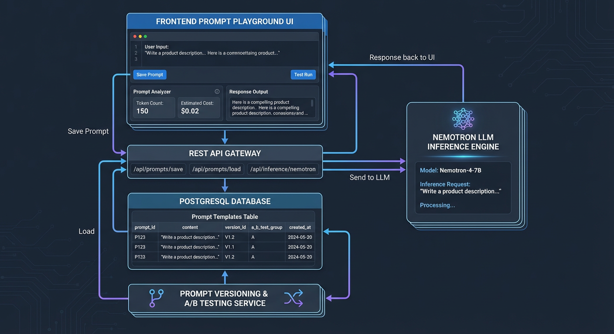

# Prompt Management Architecture

> Technical documentation for the AI prompt management system, including A/B testing, version history, and the Prompt Playground UI.

**Time to read:** ~20 min
**Prerequisites:** [Architecture Overview](../architecture/overview.md), [AI Pipeline](../architecture/ai-pipeline.md)

---

## Overview

The prompt management system provides a complete solution for managing AI model configurations across the security pipeline. It supports:

- **Version Control:** Every change creates a new version with full history
- **A/B Testing:** Compare prompt variations on real events before deployment
- **Shadow Mode:** Run experimental prompts in parallel without affecting production
- **Automatic Rollback:** Detect performance degradation and revert automatically
- **Import/Export:** Backup and share configurations across instances

---

## Architecture



_Full-stack prompt management flow from UI to database to AI inference._

### Components

```
┌─────────────────────────────────────────────────────────────────────┐
│                         Frontend                                     │
├─────────────────────────────────────────────────────────────────────┤
│  PromptPlayground.tsx    │  PromptABTest.tsx    │  ABTestStats.tsx  │
│  - Model editors         │  - Split-view UI     │  - Statistics     │
│  - Diff preview          │  - Delta indicators  │  - Comparison     │
│  - Test configuration    │  - Result panels     │  - Charts         │
└─────────────────────────────────────────────────────────────────────┘
                                    │
                                    ▼
┌─────────────────────────────────────────────────────────────────────┐
│                         Backend API                                  │
├─────────────────────────────────────────────────────────────────────┤
│  /api/ai-audit/prompts                                               │
│  - GET    /           - Get all prompts                              │
│  - GET    /{model}    - Get prompt for model                         │
│  - PUT    /{model}    - Update prompt (creates new version)          │
│  - GET    /export     - Export all configurations                    │
│  - POST   /import     - Import configurations                        │
│  - POST   /import/preview - Preview import changes                   │
│  - GET    /history    - Get version history                          │
│  - POST   /history/{id} - Restore version                            │
│  - POST   /test       - Test prompt against event                    │
└─────────────────────────────────────────────────────────────────────┘
                                    │
                                    ▼
┌─────────────────────────────────────────────────────────────────────┐
│                         Services                                     │
├─────────────────────────────────────────────────────────────────────┤
│  PromptService          │  PromptABTester       │  PromptEvaluator  │
│  - CRUD operations      │  - Traffic splitting  │  - Batch eval     │
│  - Version management   │  - A/B selection      │  - Comparison     │
│  - Import/Export        │  - Metrics recording  │  - Correlation    │
│                         │                       │                   │
│  PromptShadowRunner     │  PromptRollbackChecker                    │
│  - Shadow execution     │  - Performance check                      │
│  - Result comparison    │  - Auto rollback                          │
└─────────────────────────────────────────────────────────────────────┘
                                    │
                                    ▼
┌─────────────────────────────────────────────────────────────────────┐
│                         Database                                     │
├─────────────────────────────────────────────────────────────────────┤
│  prompt_versions                                                     │
│  - id, model, version, config_json, created_at, created_by          │
│  - change_description, is_active, row_version                        │
│  - Indexes: model, model+version, model+is_active, created_at       │
│  - Unique constraint: (model, version)                               │
└─────────────────────────────────────────────────────────────────────┘
```

### Data Flow

1. **User edits prompt** in PromptPlayground UI
2. **Test request** sent to `/api/ai-audit/prompts/test`
3. **PromptService** runs LLM inference with modified config
4. **Results returned** and displayed in before/after comparison
5. **User saves** via PUT `/api/ai-audit/prompts/{model}`
6. **New version created** in `prompt_versions` table
7. **Old version deactivated** (is_active = false)

---

## Database Schema

### PromptVersion Model

**Source:** [`backend/models/prompt_version.py`](../../backend/models/prompt_version.py)

```python
class PromptVersion(Base):
    __tablename__ = "prompt_versions"

    id: Mapped[int]                    # Primary key
    model: Mapped[str]                 # Enum: nemotron, florence2, yolo_world, xclip, fashion_clip
    version: Mapped[int]               # Version number (auto-incremented per model)
    created_at: Mapped[datetime]       # When this version was created
    created_by: Mapped[str | None]     # Optional user identifier
    config_json: Mapped[str]           # JSON configuration (see below)
    change_description: Mapped[str | None]  # Optional description of changes
    is_active: Mapped[bool]            # True for current active version
    row_version: Mapped[int]           # Optimistic locking counter
```

### Configuration JSON Formats

**Nemotron:**

```json
{
  "system_prompt": "You are a security analysis AI...",
  "temperature": 0.7,
  "max_tokens": 2048
}
```

**Florence-2:**

```json
{
  "vqa_queries": ["What is the person doing?", "What objects are they carrying?"]
}
```

**YOLO-World:**

```json
{
  "object_classes": ["knife", "gun", "package"],
  "confidence_threshold": 0.35
}
```

**X-CLIP:**

```json
{
  "action_classes": ["loitering", "running away", "fighting"]
}
```

**Fashion-CLIP:**

```json
{
  "clothing_categories": ["dark hoodie", "face mask"],
  "suspicious_indicators": ["all black", "gloves at night"]
}
```

### Indexes

| Index Name                          | Columns          | Purpose                |
| ----------------------------------- | ---------------- | ---------------------- |
| `idx_prompt_versions_model`         | model            | Filter by model        |
| `idx_prompt_versions_model_version` | model, version   | Get specific version   |
| `idx_prompt_versions_model_active`  | model, is_active | Find active version    |
| `idx_prompt_versions_created_at`    | created_at       | Order by creation date |

### Unique Constraint

- `uq_prompt_version_model_version`: Ensures (model, version) combinations are unique

---

## API Endpoints

### Core Endpoints

**Source:** [`backend/api/routes/prompt_management.py`](../../backend/api/routes/prompt_management.py)

| Method | Endpoint                               | Description                      | Rate Limited |
| ------ | -------------------------------------- | -------------------------------- | ------------ |
| GET    | `/api/ai-audit/prompts`                | Get all model configurations     | No           |
| GET    | `/api/ai-audit/prompts/{model}`        | Get specific model configuration | No           |
| PUT    | `/api/ai-audit/prompts/{model}`        | Update model configuration       | No           |
| GET    | `/api/ai-audit/prompts/export`         | Export all configurations        | No           |
| POST   | `/api/ai-audit/prompts/import`         | Import configurations            | No           |
| POST   | `/api/ai-audit/prompts/import/preview` | Preview import changes           | No           |
| GET    | `/api/ai-audit/prompts/history`        | Get version history              | No           |
| POST   | `/api/ai-audit/prompts/history/{id}`   | Restore specific version         | No           |
| POST   | `/api/ai-audit/prompts/test`           | Test prompt against event        | Yes (10/min) |

### Request/Response Schemas

**Source:** [`backend/api/schemas/prompt_management.py`](../../backend/api/schemas/prompt_management.py)

**PromptUpdateRequest:**

```python
class PromptUpdateRequest(BaseModel):
    config: dict[str, Any]                    # New configuration
    change_description: str | None = None     # Optional change description
    expected_version: int | None = None       # For optimistic locking
```

**Optimistic Locking:** If `expected_version` is provided and does not match the current version, the API returns `409 Conflict`. This prevents race conditions when multiple users edit the same prompt.

### Validation

Each model has a dedicated validation schema:

```python
def validate_config_for_model(model: AIModelEnum, config: dict) -> list[str]:
    """Validate configuration for a specific model."""
```

Validation checks:

- Required fields are present
- Field types are correct
- Values are within valid ranges
- Lists are not empty

---

## Service Layer

### PromptService

**Source:** [`backend/services/prompt_service.py`](../../backend/services/prompt_service.py)

The main service for CRUD operations on prompts.

```python
class PromptService:
    async def get_all_prompts(self, session: AsyncSession) -> dict[str, dict]:
        """Get active configurations for all models."""

    async def get_prompt_for_model(self, session: AsyncSession, model: str) -> dict:
        """Get active configuration for a specific model."""

    async def update_prompt_for_model(
        self,
        session: AsyncSession,
        model: str,
        config: dict,
        change_description: str | None = None,
        created_by: str | None = None,
        expected_version: int | None = None,
    ) -> PromptVersion:
        """Create new version with updated configuration."""

    async def get_version_history(
        self,
        session: AsyncSession,
        model: str | None = None,
        limit: int = 50,
        offset: int = 0,
    ) -> tuple[list[PromptVersion], int]:
        """Get paginated version history."""

    async def restore_version(
        self,
        session: AsyncSession,
        version_id: int,
    ) -> PromptVersion:
        """Restore a previous version (creates new version with old config)."""
```

### PromptABTester

Manages A/B testing traffic splitting.

```python
@dataclass
class ABTestConfig:
    control_version: int       # Current production version
    treatment_version: int     # New version being tested
    traffic_split: float       # 0.0 to 1.0 - fraction to treatment
    model: str                 # Model name
    enabled: bool = True

class PromptABTester:
    def select_prompt_version(self) -> tuple[int, bool]:
        """Select version based on traffic split. Returns (version, is_treatment)."""

    async def record_prompt_execution(
        self,
        version: int,
        latency_seconds: float,
        risk_score: int,
    ) -> None:
        """Record metrics for analysis."""
```

### PromptShadowRunner

Runs experimental prompts in parallel without affecting production.

```python
@dataclass
class ShadowModeConfig:
    enabled: bool
    control_version: int
    shadow_version: int
    model: str
    log_comparisons: bool = True

@dataclass
class ShadowComparisonResult:
    control_result: dict
    shadow_result: dict | None
    risk_score_diff: float
    control_latency_ms: float
    shadow_latency_ms: float
    shadow_error: str | None

class PromptShadowRunner:
    async def run_shadow_comparison(self, context: str) -> ShadowComparisonResult:
        """Run both prompts and compare results."""
```

### PromptRollbackChecker

Monitors performance and triggers automatic rollback.

```python
@dataclass
class RollbackConfig:
    enabled: bool = True
    max_latency_increase_pct: float = 50.0   # Rollback if latency increases 50%+
    max_score_variance: float = 15.0         # Rollback if score variance > 15
    min_samples: int = 100                   # Minimum samples before checking
    evaluation_window_hours: int = 1

class PromptRollbackChecker:
    async def check_rollback_needed(self, metrics) -> RollbackCheckResult:
        """Check if rollback should be triggered."""

    async def execute_rollback(
        self,
        session: AsyncSession,
        ab_config,
        reason: str,
    ) -> RollbackExecutionResult:
        """Execute rollback to control version."""
```

### PromptEvaluator

Evaluates prompts against historical events.

```python
@dataclass
class EvaluationResults:
    total_events: int
    average_score_diff: float | None
    score_variance: float | None
    average_latency_ms: float
    score_correlation: float | None

class PromptEvaluator:
    async def create_evaluation_batch(
        self,
        session: AsyncSession,
        hours_back: int = 24,
        sample_size: int = 100,
    ) -> EvaluationBatch:
        """Create batch of historical events for evaluation."""

    async def evaluate_prompt_version(
        self,
        session: AsyncSession,
        prompt_version: int,
        batch: EvaluationBatch,
    ) -> EvaluationResults:
        """Evaluate prompt version against event batch."""

    async def compare_prompt_versions(
        self,
        session: AsyncSession,
        version_a: int,
        version_b: int,
        batch: EvaluationBatch,
    ) -> VersionComparisonResult:
        """Compare two versions and recommend best."""
```

---

## Frontend Components

### PromptPlayground

**Source:** [`frontend/src/components/ai/PromptPlayground.tsx`](../../frontend/src/components/ai/PromptPlayground.tsx)

Main slide-out panel for prompt editing and testing.

**Props:**

```typescript
interface PromptPlaygroundProps {
  isOpen: boolean;
  onClose: () => void;
  recommendation?: AiAuditRecommendationItem | null;
  sourceEventId?: number | null;
  enrichedSuggestion?: EnrichedSuggestion | null;
  initialShowDiffPreview?: boolean;
}
```

**Key Features:**

- **Model Editors:** Accordion panels for each AI model
- **Syntax Highlighting:** Variables highlighted in green (`{variable_name}`)
- **Line Numbers:** Synchronized scrolling with editor content
- **Diff Preview:** Side-by-side comparison when applying suggestions
- **Toast Notifications:** Success/error feedback

**State Management:**

```typescript
// Prompts and editing
const [prompts, setPrompts] = useState<AllPromptsResponse | null>(null);
const [editedConfigs, setEditedConfigs] = useState<Record<string, Record<string, unknown>>>({});

// A/B testing
const [showABTest, setShowABTest] = useState(false);
const [abTestResults, setAbTestResults] = useState<ABTestResult[]>([]);
const [isRunningABTest, setIsRunningABTest] = useState(false);
```

### PromptABTest

**Source:** [`frontend/src/components/ai/PromptABTest.tsx`](../../frontend/src/components/ai/PromptABTest.tsx)

Split-view A/B testing component.

```typescript
interface PromptABTestProps {
  originalPrompt: string;
  modifiedPrompt: string;
  results: ABTestResult[];
  isRunning: boolean;
  onRunTest: (eventId: number) => void;
  onRunRandomTests: (count: number) => void;
  onPromoteB: () => void;
}
```

**Delta Indicator Logic:**

```typescript
// Green (improvement): B is less alarming (delta <= -5)
// Red (regression): B is more alarming (delta >= +5)
// Gray (neutral): Within threshold (-4 to +4)
```

### ABTestStats

**Source:** [`frontend/src/components/ai/ABTestStats.tsx`](../../frontend/src/components/ai/ABTestStats.tsx)

Calculate and display A/B test statistics.

```typescript
export function calculateStats(results: ABTestResult[]): ABTestStats {
  return {
    totalTests: results.length,
    avgScoreDelta: /* average of all score deltas */,
    improvementRate: /* percentage where B was better */,
  };
}
```

### Prompt Diff Utilities

**Source:** [`frontend/src/utils/promptDiff.ts`](../../frontend/src/utils/promptDiff.ts)

Functions for generating diffs and applying suggestions.

```typescript
// Apply a suggestion to a prompt
export function applySuggestion(
  originalPrompt: string,
  suggestion: EnrichedSuggestion
): InsertionResult;

// Generate visual diff between prompts
export function generateDiff(
  originalPrompt: string,
  modifiedPrompt: string,
  contextLines?: number
): DiffLine[];

// Check if suggestion is already applied
export function isSuggestionApplied(prompt: string, suggestion: EnrichedSuggestion): boolean;
```

---

## A/B Testing Service

**Source:** [`frontend/src/services/abTestService.ts`](../../frontend/src/services/abTestService.ts)

Frontend service for executing A/B tests.

```typescript
export interface ABTestService {
  runTest(
    eventId: number,
    originalPrompt: string,
    modifiedPrompt: string,
    modelConfig: ModelConfig
  ): Promise<ABTestResult>;

  runRandomTests(
    count: number,
    originalPrompt: string,
    modifiedPrompt: string,
    modelConfig: ModelConfig
  ): Promise<ABTestResult[]>;

  getAvailableEvents(limit?: number): Promise<EventSummary[]>;
}
```

---

## Implementing New Prompt Templates

### Adding a New AI Model

1. **Add enum value:**

```python
# backend/models/prompt_version.py
class AIModel(str, Enum):
    # ... existing models ...
    NEW_MODEL = "new_model"
```

2. **Add validation schema:**

```python
# backend/api/schemas/prompt_management.py
class NewModelConfig(BaseModel):
    custom_field: str = Field(..., min_length=1)
    threshold: float = Field(0.5, ge=0.0, le=1.0)
```

3. **Add to validators map:**

```python
validators: dict[AIModelEnum, tuple[type[BaseModel], dict[str, str]]] = {
    # ... existing models ...
    AIModelEnum.NEW_MODEL: (NewModelConfig, {"custom_field": "custom_field"}),
}
```

4. **Add default configuration:**

```python
# backend/services/prompt_service.py
DEFAULT_CONFIGS: dict[str, dict[str, Any]] = {
    # ... existing models ...
    AIModelEnum.NEW_MODEL.value: {
        "custom_field": "default value",
        "threshold": 0.5,
    },
}
```

5. **Add frontend editor:**

```typescript
// frontend/src/components/ai/PromptPlayground.tsx
const MODEL_CONFIGS: ModelConfig[] = [
  // ... existing models ...
  {
    name: 'new_model',
    displayName: 'New Model',
    description: 'Description of the model',
  },
];

// Add case in renderModelEditor()
case 'new_model':
  return (
    <div className="space-y-4">
      {/* Custom editor UI */}
    </div>
  );
```

6. **Add migration:**

```bash
alembic revision --autogenerate -m "add new_model enum value"
```

### Creating Prompt Templates

Effective prompts should:

1. **Be specific:** Define exact output format
2. **Include context variables:** Use `{detections}`, `{time_context}`, etc.
3. **Handle edge cases:** Instructions for ambiguous situations
4. **Define risk levels:** Clear criteria for each level

Example template structure:

```
## Role
You are a security analysis AI for a home monitoring system.

## Input Context
- Detection data: {detections}
- Time context: {time_context}
- Weather: {weather}
- Cross-camera data: {cross_camera_data}

## Analysis Instructions
1. Analyze all detections in context
2. Consider time of day and normal patterns
3. Evaluate for security concerns

## Output Format
Respond with valid JSON:
{
  "risk_score": 0-100,
  "risk_level": "low|medium|high|critical",
  "reasoning": "explanation",
  "recommended_actions": ["action1", "action2"]
}

## Risk Level Criteria
- LOW (0-29): Normal activity
- MEDIUM (30-59): Unusual but not threatening
- HIGH (60-84): Concerning activity
- CRITICAL (85-100): Potential threat
```

---

## Metrics and Monitoring

### Prometheus Metrics

Prompt-related metrics are exposed at `/api/metrics`:

```python
# Recorded on each prompt execution
record_prompt_latency(version: str, latency_seconds: float)

# Recorded on shadow mode comparison
record_shadow_comparison(model: str)

# Recorded on rollback
record_prompt_rollback(model: str, reason: str)
```

### Monitoring Recommendations

1. **Latency:** Alert if prompt execution time increases significantly
2. **Consistency:** Track score variance across similar events
3. **Rollback rate:** Monitor automatic rollback frequency
4. **A/B test duration:** Ensure tests run long enough for statistical validity

---

## Testing

### Unit Tests

**Backend:**

```bash
# Run prompt service tests
uv run pytest backend/tests/unit/services/test_prompt_service.py -v
uv run pytest backend/tests/unit/services/test_prompt_ab_testing.py -v
uv run pytest backend/tests/unit/services/test_prompt_version_service.py -v

# Run API route tests
uv run pytest backend/tests/unit/api/routes/test_prompt_management.py -v
uv run pytest backend/tests/unit/api/routes/test_prompt_config.py -v
```

**Frontend:**

```bash
cd frontend
npm test -- --grep "PromptPlayground"
npm test -- --grep "promptDiff"
npm test -- --grep "abTestService"
```

### Test Coverage

Key test scenarios:

- Version creation and history
- Optimistic locking conflicts
- A/B test traffic splitting
- Shadow mode comparison
- Automatic rollback triggers
- Import/export validation
- Diff generation accuracy

---

## Related Documentation

- [Prompt Management API](api/ai-pipeline.md) - Complete REST API reference
- [AI Audit Dashboard](../ui/ai-audit.md) - Includes Prompt Playground documentation
- [AI Pipeline Architecture](../architecture/ai-pipeline.md) - How prompts fit in the pipeline
- [Risk Analysis](risk-analysis.md) - Nemotron prompt usage in risk scoring

---

## Source Files

| File                                                                                                       | Description        |
| ---------------------------------------------------------------------------------------------------------- | ------------------ |
| [`backend/models/prompt_version.py`](../../backend/models/prompt_version.py)                               | Database model     |
| [`backend/api/routes/prompt_management.py`](../../backend/api/routes/prompt_management.py)                 | API routes         |
| [`backend/api/schemas/prompt_management.py`](../../backend/api/schemas/prompt_management.py)               | Pydantic schemas   |
| [`backend/services/prompt_service.py`](../../backend/services/prompt_service.py)                           | Service layer      |
| [`frontend/src/components/ai/PromptPlayground.tsx`](../../frontend/src/components/ai/PromptPlayground.tsx) | Main UI component  |
| [`frontend/src/components/ai/PromptABTest.tsx`](../../frontend/src/components/ai/PromptABTest.tsx)         | A/B test component |
| [`frontend/src/services/abTestService.ts`](../../frontend/src/services/abTestService.ts)                   | A/B test service   |
| [`frontend/src/utils/promptDiff.ts`](../../frontend/src/utils/promptDiff.ts)                               | Diff utilities     |

---

[Back to Developer Hub](README.md)
